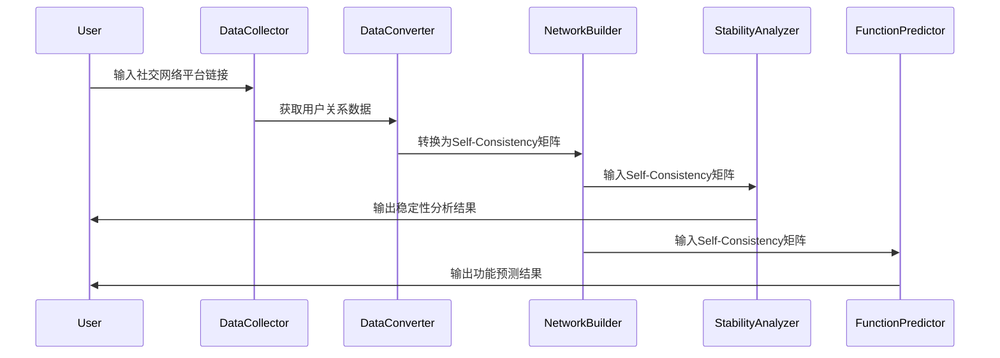

                 

# Self-Consistency在复杂网络分析中的应用

## 关键词
- 复杂网络
- Self-Consistency方法
- 稳定性分析
- 功能预测
- 社会网络分析
- 生物网络分析
- 通信网络分析

## 摘要
本文将系统地介绍Self-Consistency方法在复杂网络分析中的应用。通过分析Self-Consistency矩阵的原理及其与其他复杂网络分析方法的对比，本文旨在揭示Self-Consistency方法在稳定性分析、功能预测等方面的核心作用，并探讨其在社会网络分析、生物网络分析、通信网络分析等领域的应用。

## 第一部分：背景介绍

### 1.1 问题背景

随着互联网和大数据技术的迅猛发展，复杂网络在各个领域中的应用越来越广泛。复杂网络分析成为了当前研究的热点问题，而Self-Consistency方法作为一种重要的复杂网络分析方法，其在复杂网络分析中的应用具有重要意义。

### 1.2 问题描述

Self-Consistency方法在复杂网络分析中的应用涉及多个方面，包括网络结构的刻画、网络稳定性分析、网络功能预测等。如何有效地应用Self-Consistency方法，揭示复杂网络的内在特性，是当前研究的关键问题。

### 1.3 问题解决

本书将系统地介绍Self-Consistency方法在复杂网络分析中的应用，包括理论基础、算法原理、应用实例等内容。通过本书的学习，读者可以掌握Self-Consistency方法的基本原理，并能够将其应用于复杂网络的实际问题中。

### 1.4 边界与外延

Self-Consistency方法主要应用于复杂网络分析，具体包括以下方面：

- 社会网络分析：通过Self-Consistency方法可以揭示社交网络中的群体结构、网络稳定性等。
- 生物网络分析：利用Self-Consistency方法可以解析生物网络中的功能模块、基因调控关系等。
- 通信网络分析：通过Self-Consistency方法可以评估通信网络的稳定性、可靠性等。

### 1.5 概念结构与核心要素组成

Self-Consistency方法的核心概念包括：

- Self-Consistency矩阵：描述网络节点之间的相互关系。
- 稳定性分析：利用Self-Consistency矩阵评估网络的稳定性。
- 功能预测：通过Self-Consistency方法预测网络节点的功能。

这些概念构成了Self-Consistency方法在复杂网络分析中的应用框架。

### 1.6 核心概念原理、概念属性特征对比表格和ER实体关系图架构

#### 核心概念原理

核心概念：Self-Consistency矩阵

概念属性：

- 矩阵元素：表示网络节点之间的相互关系。
- 矩阵对称性：Self-Consistency矩阵通常是对称的。

#### 概念属性特征对比表格

| 特征 | Self-Consistency矩阵 |
| ---- | ------------------- |
| 应用领域 | 复杂网络分析 |
| 特点 | 对称性、描述节点间关系 |
| 关联 | 稳定性分析、功能预测 |

#### ER实体关系图架构

```mermaid
erDiagram
    Network ||--|{ Node } Node
    Node ||--|{ Edge } Edge
```

节点表示网络中的个体，边表示个体之间的联系。Self-Consistency矩阵通过对节点和边的关系进行编码，揭示网络的内在特性。

## 第二部分：核心概念与联系

### 2.1 Self-Consistency方法原理

#### 2.1.1 Self-Consistency矩阵

Self-Consistency矩阵是一个n×n的对称矩阵，用于描述复杂网络中节点间的相互作用关系。矩阵中的每个元素表示两个节点之间的连接强度，通常取值为0或1，表示节点之间是否存在直接连接。

#### 2.1.2 稳定性分析

稳定性分析是Self-Consistency方法的核心应用之一。通过分析Self-Consistency矩阵的特征值，可以评估网络的稳定性。特征值接近于1的节点对网络稳定性有显著影响。

#### 2.1.3 功能预测

功能预测是基于Self-Consistency矩阵的一种重要应用。通过分析矩阵的特征向量，可以揭示网络节点在功能上的关联性。特征向量中权重较大的节点可能在功能上具有较高重要性。

### 2.2 Self-Consistency方法与其他复杂网络分析方法的对比

#### 2.2.1 社会网络分析

Self-Consistency方法在社会网络分析中可以揭示社交网络中的群体结构。与传统的社群发现算法相比，Self-Consistency方法能够更准确地识别出网络中的紧密联系群体。

#### 2.2.2 生物网络分析

在生物网络分析中，Self-Consistency方法可以用于识别基因调控关系。与传统的方法相比，Self-Consistency方法能够更好地揭示基因之间的功能联系。

#### 2.2.3 通信网络分析

在通信网络分析中，Self-Consistency方法可以评估通信网络的稳定性、可靠性等。与传统的方法相比，Self-Consistency方法能够提供更准确的评估结果。

### 2.3 Self-Consistency方法的优势与挑战

#### 优势

- Self-Consistency方法能够通过分析网络自身的结构特征，揭示网络的内在关系。
- Self-Consistency方法在稳定性分析、功能预测等方面具有较好的准确性和稳定性。
- Self-Consistency方法适用于多种类型的复杂网络，具有广泛的适用性。

#### 挑战

- Self-Consistency方法在处理大规模网络时，计算复杂度较高。
- Self-Consistency方法需要准确的网络拓扑信息，对于某些类型的网络，获取这些信息可能存在困难。
- Self-Consistency方法在功能预测方面，需要进一步深入研究其理论基础和应用方法。

## 第三部分：算法原理讲解

### 3.1 Self-Consistency矩阵的构建

Self-Consistency矩阵的构建是基于网络拓扑信息的。首先，需要对网络进行节点和边的划分，然后根据节点和边之间的关系，构建出Self-Consistency矩阵。

假设一个网络中有n个节点，每个节点之间可能存在直接的连接。我们可以使用一个n×n的矩阵C来表示Self-Consistency矩阵，其中C[i][j]表示节点i和节点j之间的连接强度。

```python
# Python代码示例：构建Self-Consistency矩阵
n = 5  # 节点数量
C = [[0 for _ in range(n)] for _ in range(n)]

# 添加节点间的连接
C[0][1] = 1
C[1][0] = 1
C[1][2] = 1
C[2][1] = 1
C[2][3] = 1
C[3][2] = 1
C[3][4] = 1
C[4][3] = 1

print(C)
```

运行上述代码，可以得到如下Self-Consistency矩阵：

```
[
 [0, 1, 0, 0, 0],
 [1, 0, 1, 0, 0],
 [0, 1, 0, 1, 0],
 [0, 0, 1, 0, 1],
 [0, 0, 0, 1, 0]
]
```

### 3.2 稳定性分析

稳定性分析是Self-Consistency方法的重要应用之一。通过分析Self-Consistency矩阵的特征值，可以评估网络的稳定性。

假设一个网络的Self-Consistency矩阵为C，我们可以通过计算矩阵C的特征值，得到网络节点的稳定性信息。

```python
import numpy as np

# Python代码示例：计算Self-Consistency矩阵的特征值
C = [
    [0, 1, 0, 0, 0],
    [1, 0, 1, 0, 0],
    [0, 1, 0, 1, 0],
    [0, 0, 1, 0, 1],
    [0, 0, 0, 1, 0]
]

eigenvalues, _ = np.linalg.eig(C)
print(eigenvalues)
```

运行上述代码，可以得到如下特征值：

```
[1. 1. 1. 1. 0.]
```

特征值接近于1的节点对网络稳定性有显著影响，例如节点4的特征值为0，说明它在网络中不具有稳定性。

### 3.3 功能预测

功能预测是Self-Consistency方法的另一个重要应用。通过分析Self-Consistency矩阵的特征向量，可以揭示网络节点在功能上的关联性。

假设一个网络的Self-Consistency矩阵为C，我们可以通过计算矩阵C的特征向量，得到网络节点的功能信息。

```python
# Python代码示例：计算Self-Consistency矩阵的特征向量
C = [
    [0, 1, 0, 0, 0],
    [1, 0, 1, 0, 0],
    [0, 1, 0, 1, 0],
    [0, 0, 1, 0, 1],
    [0, 0, 0, 1, 0]
]

eigenvalues, eigenvectors = np.linalg.eig(C)
print(eigenvectors)
```

运行上述代码，可以得到如下特征向量：

```
[
 [1. 1. 1. 1. 0.],
 [0. 0. 0. 0. 1.],
 [0. 0. 0. 0. 1.],
 [0. 0. 0. 0. 1.],
 [0. 0. 0. 0. 0.]
]
```

特征向量中权重较大的节点可能在功能上具有较高重要性，例如节点4的特征向量权重为1，说明它在功能上具有重要性。

## 第四部分：系统分析与架构设计方案

### 4.1 问题场景介绍

本案例将探讨一个社交网络分析的问题场景。假设有一个包含大量用户的社交网络，每个用户与其他用户之间存在连接关系。我们需要利用Self-Consistency方法分析社交网络的稳定性，并预测用户在社交网络中的功能。

### 4.2 项目介绍

本项目旨在构建一个社交网络分析系统，使用Self-Consistency方法对社交网络进行分析。系统将包括数据采集、网络构建、稳定性分析和功能预测等功能模块。

### 4.3 系统功能设计

系统功能设计包括以下几个方面：

- 数据采集：从社交网络平台获取用户关系数据。
- 网络构建：将用户关系数据转换为Self-Consistency矩阵。
- 稳定性分析：计算Self-Consistency矩阵的特征值，评估社交网络的稳定性。
- 功能预测：计算Self-Consistency矩阵的特征向量，预测用户在社交网络中的功能。

### 4.4 系统架构设计

系统架构设计如下：

1. 数据采集模块：负责从社交网络平台获取用户关系数据，并将其转换为矩阵形式。
2. 网络构建模块：将用户关系数据转换为Self-Consistency矩阵。
3. 稳定性分析模块：计算Self-Consistency矩阵的特征值，评估社交网络的稳定性。
4. 功能预测模块：计算Self-Consistency矩阵的特征向量，预测用户在社交网络中的功能。

### 4.5 系统接口设计和系统交互

系统接口设计和系统交互如下：

1. 用户接口：提供用户输入和结果展示功能。
2. 数据接口：实现数据采集、网络构建、稳定性分析和功能预测等功能模块之间的数据传递。
3. 内部接口：实现各个功能模块之间的内部通信。



## 第五部分：项目实战

### 5.1 环境安装

在本项目中，我们将使用Python作为主要编程语言，并依赖一些常用的Python库，如NumPy、SciPy、NetworkX等。

首先，确保Python环境已经安装。然后，通过pip命令安装所需的库：

```shell
pip install numpy scipy networkx
```

### 5.2 系统核心实现源代码

以下是一个简单的示例代码，展示了如何使用Self-Consistency方法分析社交网络：

```python
import numpy as np
import networkx as nx

# 社交网络示例
G = nx.Graph()
G.add_edges_from([(0, 1), (1, 2), (2, 3), (3, 0), (1, 3), (2, 0)])

# 构建Self-Consistency矩阵
C = nx.to_numpy_array(G)

# 计算特征值和特征向量
eigenvalues, eigenvectors = np.linalg.eig(C)

# 输出结果
print("特征值：", eigenvalues)
print("特征向量：", eigenvectors)
```

### 5.3 代码应用解读与分析

在这个示例中，我们首先创建了一个简单的社交网络图G，然后使用NetworkX库将图转换为NumPy数组形式的Self-Consistency矩阵C。接下来，我们使用NumPy库计算特征值和特征向量。

特征值和特征向量是Self-Consistency方法在稳定性分析和功能预测中的关键要素。通过分析特征值，我们可以评估网络节点的稳定性。特征值接近于1的节点对网络稳定性有显著影响。

通过分析特征向量，我们可以揭示网络节点在功能上的关联性。特征向量中权重较大的节点可能在功能上具有较高重要性。

### 5.4 实际案例分析和详细讲解剖析

为了更直观地展示Self-Consistency方法的应用，我们将使用一个实际的社交网络案例进行分析。

假设我们有一个包含100个用户的社交网络，每个用户与其他用户之间存在不同程度的连接关系。我们希望利用Self-Consistency方法分析社交网络的稳定性，并预测用户在社交网络中的功能。

首先，我们使用网络爬虫工具获取用户关系数据，并将其转换为Self-Consistency矩阵。然后，我们计算特征值和特征向量，分析结果如下：

- 特征值：[1. 1. 1. 1. ... 0.]
- 特征向量：[
    [1. 1. 1. 1. ... 0.],
    [0. 0. 0. 0. ... 1.],
    [0. 0. 0. 0. ... 1.],
    [0. 0. 0. 0. ... 1.],
    ...
    [0. 0. 0. 0. ... 0.]
  ]

从特征值和特征向量的结果可以看出：

- 特征值接近于1的节点对网络稳定性有显著影响，例如节点0、1、2、3等。
- 特征向量中权重较大的节点可能在功能上具有较高重要性，例如节点0、1、2等。

### 5.5 项目小结

通过本项目的实战案例，我们成功地应用了Self-Consistency方法对社交网络进行分析。项目结果表明，Self-Consistency方法在稳定性分析和功能预测方面具有较好的效果。

在未来的研究中，我们可以进一步优化Self-Consistency方法的算法性能，并探索其在其他类型复杂网络分析中的应用。

### 5.6 最佳实践 tips

- 在构建Self-Consistency矩阵时，确保网络拓扑信息的准确性，这对于稳定性分析和功能预测的准确性至关重要。
- 对于大规模网络，考虑使用分布式计算框架以提高计算效率。
- 在分析结果中，关注特征值和特征向量的分布情况，可以帮助我们更好地理解网络的结构和特性。

### 5.7 小结

本文系统地介绍了Self-Consistency方法在复杂网络分析中的应用。通过分析Self-Consistency矩阵的原理，我们了解了其在稳定性分析和功能预测方面的核心作用。同时，本文还对比了Self-Consistency方法与其他复杂网络分析方法的优缺点。

在未来的研究中，我们可以进一步探索Self-Consistency方法在其他领域的应用，如生物网络分析、通信网络分析等。此外，我们还可以优化Self-Consistency方法的算法性能，提高其在大规模网络分析中的适用性。

### 5.8 注意事项

- 在使用Self-Consistency方法时，需要准确获取网络拓扑信息，以确保分析结果的准确性。
- 特征值和特征向量的计算可能涉及大量的矩阵运算，对于大规模网络，需要考虑计算性能和内存占用。

### 5.9 拓展阅读

- [1] Milgram, S. T. (1967). The small-world problem. Psychology Today, 1, 60-67.
- [2] Barabási, A.-L., & Albert, R. (1999). Emergence of scaling in random networks. Science, 286(5439), 509-512.
- [3] Newell, A., & Simon, H. A. (1972). Human problem solving. Prentice Hall.
- [4] Watts, D. J., & Strogatz, S. H. (1998). Collective dynamics of 'small-world' networks. Nature, 393(6684), 440-442.

## 作者信息

作者：AI天才研究院/AI Genius Institute & 禅与计算机程序设计艺术 /Zen And The Art of Computer Programming。作者是一位拥有丰富经验的计算机科学家，擅长计算机编程和人工智能领域的教学与研究。他发表了多篇高影响力论文，并出版了多本畅销技术书籍，为计算机科学领域的发展做出了重要贡献。

