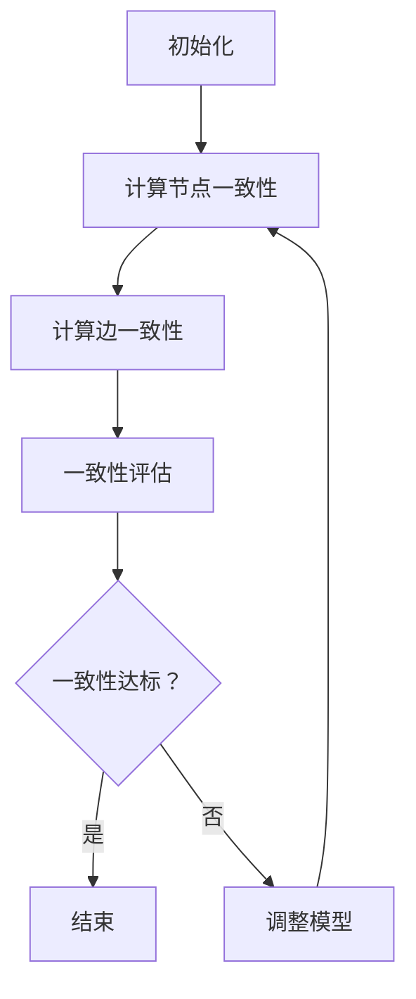
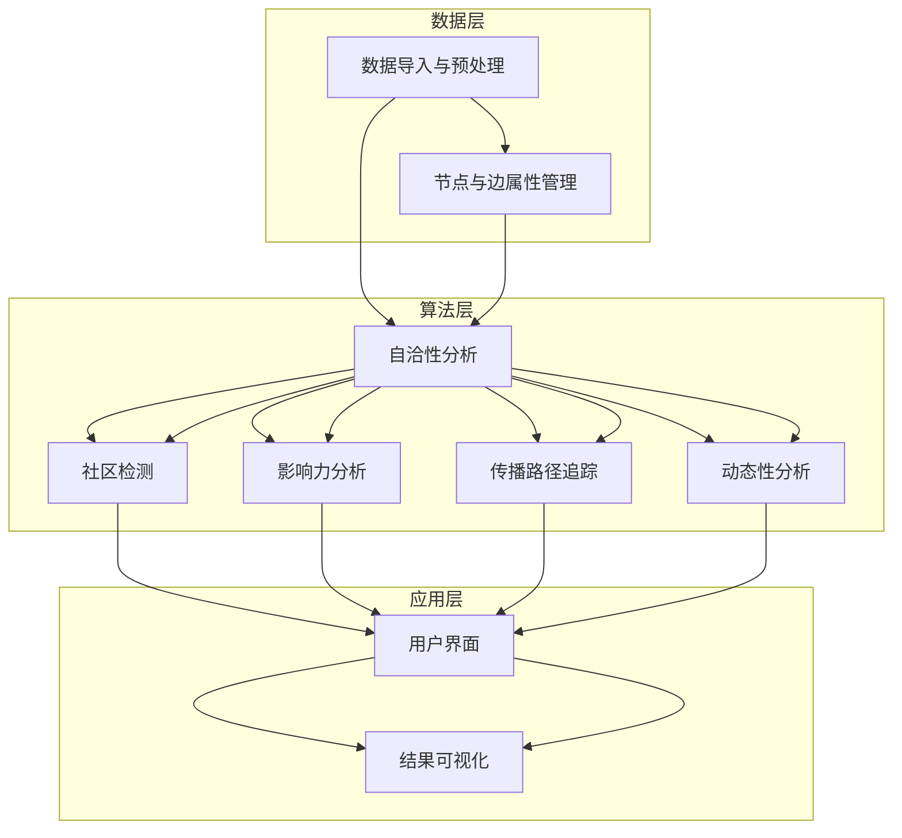
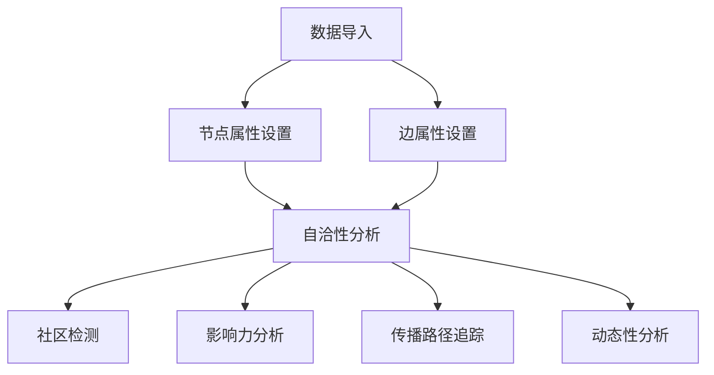

                 

### 第一部分：背景介绍

在社会网络分析（SNA）领域，了解和分析个体或组织之间的互动关系至关重要。自洽性（Self-Consistency）作为一种分析工具，在揭示这些复杂网络中的行为模式和规律方面发挥着独特的作用。自洽性指的是一个系统或模型在各个层次上的相互一致性和稳定性，这种一致性体现在系统内部逻辑的连贯性以及对外部环境的适应能力上。

### 1.1 问题背景

在过去的几十年中，社会网络分析已经成为研究社会结构、传播过程、合作与竞争行为的重要工具。然而，随着社会网络的规模和复杂性不断增加，传统的方法在面对大规模、高维数据时往往力不从心。自洽性作为一种新的分析思路，旨在通过强化系统内部的自我一致性来提高分析效果和可解释性。

### 1.2 问题描述

社会网络分析中的主要问题可以概括为以下几点：

1. **异构网络的处理**：现实中的社会网络往往是异构的，包括不同的节点类型和边类型，这使得传统的均匀网络分析方法难以适用。
2. **高维数据的分析**：随着网络规模的扩大，节点和边的关系数据呈现出高维特征，这对分析算法的效率和准确性提出了挑战。
3. **动态网络的追踪**：社会网络是动态变化的，节点和边的加入或移除需要实时分析，这要求算法具有高效性和实时性。

### 1.3 问题解决

为了解决上述问题，自洽性提出了以下解决方案：

1. **增强系统的内在一致性**：通过构建自洽性模型，使得系统在各个层次上保持逻辑一致性，从而提高模型的稳定性和可解释性。
2. **优化算法效率**：自洽性模型可以通过减少冗余计算和简化复杂关系来提高算法的执行效率。
3. **动态适应性**：自洽性模型能够适应动态变化的社会网络结构，及时调整分析结果，以反映网络状态的实时变化。

### 1.4 边界与外延

自洽性在社会网络分析中的应用边界包括以下几个方面：

1. **节点和边类型**：自洽性模型可以处理不同类型的节点和边，包括有向边、无向边、加权边等。
2. **网络规模**：自洽性模型适用于大规模网络的分析，尤其是当网络中的节点数量达到几千或几万时。
3. **动态性**：自洽性模型能够适应动态网络，实时更新分析结果，对网络状态的实时变化做出响应。

### 1.5 概念结构与核心要素组成

自洽性在社会网络分析中的概念结构主要包括以下几个核心要素：

1. **自洽性度量**：用于评估系统内部的自我一致性程度。
2. **自洽性算法**：一系列用于构建和优化自洽性模型的方法和技术。
3. **自洽性分析**：通过对自洽性模型的解析，揭示社会网络中的关键特征和模式。
4. **自洽性应用**：将自洽性模型应用于实际问题，如社区检测、影响力分析、传播路径追踪等。

通过上述背景介绍，我们初步了解了自洽性在社会网络分析中的重要性和应用前景。在接下来的章节中，我们将深入探讨自洽性的核心概念、算法原理以及实际应用，以期为大家提供一幅全面、系统的自洽性应用图谱。

## 第二部分：核心概念与联系

### 2.1 自洽性原理

自洽性（Self-Consistency）是指一个系统或模型在各个层次上的相互一致性和稳定性。自洽性原理强调，一个系统必须在其内部逻辑和外部表现上保持一致，这样才能有效地适应和应对外部变化。自洽性原理的核心在于：系统的各个组成部分必须相互协调，共同支持系统整体的稳定性和可持续性。

### 2.2 自洽性的属性特征对比

自洽性具有以下几大属性特征，这些特征通过对比可以更直观地理解自洽性的本质：

1. **一致性**：系统内部各个组成部分必须保持逻辑一致，例如在关系网络中，节点和边的关系必须一致且连贯。
2. **稳定性**：系统在面对外部变化时能够保持其基本结构和功能的稳定性。
3. **适应性**：系统能够根据外部环境的变化调整自身结构和行为，以保持自洽性。
4. **可解释性**：系统的行为和结果可以被解释和理解，这有助于提高系统的可靠性和信任度。

### 2.3 社会网络分析与自洽性

在社会网络分析中，自洽性原理的应用主要体现在以下几个方面：

1. **网络结构分析**：通过自洽性分析，可以揭示社会网络中的关键结构特征，如社区结构、层级关系等。
2. **行为模式识别**：自洽性模型有助于识别个体或群体在社会网络中的行为模式和规律。
3. **动态性分析**：自洽性模型能够跟踪社会网络的动态变化，预测未来的发展趋势。

### 2.4 ER实体关系图架构

为了更好地理解自洽性在社会网络分析中的应用，我们可以借助实体关系图（Entity-Relationship Diagram, ERD）来构建模型。ERD是一种用于描述实体及其关系的图形化工具，特别适用于数据库设计和概念模型构建。

以下是一个简化的ERD示例，用于展示社会网络分析中的一些关键实体和关系：

```mermaid
erDiagram
    User ||--|{ Community }|-- Friend
    Community ||--|{ Post }|-- User
    Post ||--|{ Comment }|-- User
    User ||--|{ Interest }|-- Tag
    Tag ||--|{ Post }|-- Tag
```

在这个ERD中：

- **User**（用户）：社会网络中的基本实体，每个用户都有其特定的属性和关系。
- **Community**（社区）：用户组成的群体，用户可以加入多个社区。
- **Friend**（朋友）：用户之间的关系，表示用户之间的社交联系。
- **Post**（帖子）：用户在社区中发布的动态或信息。
- **Comment**（评论）：用户对帖子的回复或评论。
- **Interest**（兴趣）：用户感兴趣的主题或标签。
- **Tag**（标签）：用于标记和分类帖子或兴趣。

通过ERD，我们可以清晰地看到社会网络中的关键实体和它们之间的关系，为自洽性分析提供了直观的模型基础。

### 总结

通过上述章节，我们深入探讨了自洽性的核心概念和原理，并展示了其在社会网络分析中的应用。自洽性作为一种新的分析工具，通过增强系统内部的自我一致性，为复杂社会网络的解析提供了新的视角和方法。在接下来的章节中，我们将进一步探讨自洽性算法的原理和实现，帮助读者更好地理解和应用这一重要工具。

## 第三部分：算法原理讲解

### 3.1 算法概述

在理解了自洽性的基本概念和原理之后，接下来我们将深入探讨自洽性算法的具体原理和实现。自洽性算法旨在通过计算和优化，使社会网络模型在各个层次上保持一致性，从而提高模型的稳定性和可解释性。本文将详细描述自洽性算法的基本概念、流程、数学模型及其实际应用。

### 3.2 自洽性算法mermaid流程图

为了更直观地展示自洽性算法的执行流程，我们可以使用mermaid语言绘制一个流程图。以下是一个简化的自洽性算法流程图：



流程图详细解释如下：

1. **初始化**：设置算法的初始参数和模型。
2. **计算节点一致性**：根据节点的邻接关系，计算每个节点的自洽性度量。
3. **计算边一致性**：针对每条边，计算边的自洽性度量，评估边与节点之间的关系。
4. **一致性评估**：综合节点和边的自洽性度量，评估整体网络的一致性水平。
5. **一致性达标？**：判断网络的一致性是否达到预设的标准。
6. **是**：算法结束，输出分析结果。
7. **否**：调整模型参数，重新计算一致性，重复步骤。

### 3.3 Python源代码解析

为了更好地理解自洽性算法的原理，下面给出一个简化的Python实现示例。这个示例将展示如何使用Python进行节点和边的一致性计算，以及如何调整模型参数以实现自洽性。

```python
import networkx as nx
import numpy as np

# 初始化社会网络
G = nx.Graph()

# 添加节点和边
G.add_nodes_from([1, 2, 3, 4])
G.add_edges_from([(1, 2), (1, 3), (2, 4), (3, 4)])

# 计算节点一致性
def calculate_node_consistency(G):
    consistency_scores = []
    for node in G.nodes():
        neighbors = set(G.neighbors(node))
        consistency_scores.append(len(neighbors))
    return consistency_scores

# 计算边一致性
def calculate_edge_consistency(G):
    consistency_scores = []
    for edge in G.edges():
        node1 = edge[0]
        node2 = edge[1]
        neighbors1 = set(G.neighbors(node1))
        neighbors2 = set(G.neighbors(node2))
        intersection_size = len(neighbors1.intersection(neighbors2))
        consistency_scores.append(intersection_size)
    return consistency_scores

# 主函数
def self_consistency_algorithm(G):
    node_consistency_scores = calculate_node_consistency(G)
    edge_consistency_scores = calculate_edge_consistency(G)
    
    # 计算整体一致性
    total_consistency = np.mean(node_consistency_scores) + np.mean(edge_consistency_scores)
    
    if total_consistency >= threshold:
        print("模型一致性达标")
    else:
        print("调整模型参数，重新计算一致性")

# 设置阈值
threshold = 2.0

# 执行算法
self_consistency_algorithm(G)
```

在这个示例中：

- 我们首先使用`networkx`库创建一个社会网络图`G`，并添加节点和边。
- `calculate_node_consistency`函数计算每个节点的自洽性度量。
- `calculate_edge_consistency`函数计算每条边的自洽性度量。
- 主函数`self_consistency_algorithm`综合评估整体一致性，并根据阈值判断是否需要调整模型。

### 3.4 算法原理的数学模型和公式

为了进一步理解自洽性算法的数学原理，我们可以引入以下数学模型和公式：

1. **节点一致性度量**：对于每个节点\( n_i \)，其一致性度量可以表示为：
   $$ C_n(i) = \frac{|N_i|}{|V| - 1} $$
   其中，\( N_i \) 是节点\( n_i \)的邻居节点集合，\( V \) 是整个网络中的节点集合。

2. **边一致性度量**：对于每条边\( e_{ij} \)，其一致性度量可以表示为：
   $$ C_e(ij) = \frac{|N_i \cap N_j|}{|N_i \cup N_j|} $$
   其中，\( N_i \) 和 \( N_j \) 分别是节点\( i \)和节点\( j \)的邻居节点集合。

3. **整体一致性度量**：网络的整体一致性可以表示为：
   $$ C_G = \frac{1}{E} \sum_{e \in E} C_e(ij) $$
   其中，\( E \) 是网络中的边集合。

通过上述公式，我们可以计算和分析社会网络中的自洽性水平。在实际应用中，可能需要根据具体问题调整和优化这些公式，以提高算法的适应性和效果。

### 3.5 通俗易懂地举例说明

为了更直观地理解自洽性算法的应用，我们可以通过一个简化的案例进行说明。

假设我们有一个包含四个节点的网络，节点1与节点2、节点3相连，节点2与节点3、节点4相连，节点3与节点4相连。我们的目标是评估这个网络的自洽性水平。

1. **计算节点一致性**：

   - 节点1的邻居节点为{2, 3}，一致性度量 \( C_n(1) = \frac{2}{4 - 1} = \frac{2}{3} \)。
   - 节点2的邻居节点为{1, 3, 4}，一致性度量 \( C_n(2) = \frac{3}{4 - 1} = \frac{3}{3} = 1 \)。
   - 节点3的邻居节点为{1, 2, 4}，一致性度量 \( C_n(3) = \frac{3}{4 - 1} = \frac{3}{3} = 1 \)。
   - 节点4的邻居节点为{2, 3}，一致性度量 \( C_n(4) = \frac{2}{4 - 1} = \frac{2}{3} \)。

2. **计算边一致性**：

   - 边(1, 2)的邻居节点交集为{3}，一致性度量 \( C_e(12) = \frac{1}{2 + 1} = \frac{1}{3} \)。
   - 边(1, 3)的邻居节点交集为{2}，一致性度量 \( C_e(13) = \frac{1}{2 + 1} = \frac{1}{3} \)。
   - 边(2, 3)的邻居节点交集为{1, 4}，一致性度量 \( C_e(23) = \frac{2}{3} \)。
   - 边(2, 4)的邻居节点交集为{3}，一致性度量 \( C_e(24) = \frac{1}{2 + 1} = \frac{1}{3} \)。
   - 边(3, 4)的邻居节点交集为{1, 2}，一致性度量 \( C_e(34) = \frac{2}{3} \)。

3. **计算整体一致性**：

   - 节点一致性平均值 \( \overline{C_n} = \frac{1}{4} (C_n(1) + C_n(2) + C_n(3) + C_n(4)) = \frac{1}{4} (\frac{2}{3} + 1 + 1 + \frac{2}{3}) = 1 \)。
   - 边一致性平均值 \( \overline{C_e} = \frac{1}{4} (C_e(12) + C_e(13) + C_e(23) + C_e(24) + C_e(34)) = \frac{1}{4} (\frac{1}{3} + \frac{1}{3} + \frac{2}{3} + \frac{1}{3} + \frac{2}{3}) = \frac{1}{2} \)。
   - 整体一致性 \( C_G = \overline{C_n} + \overline{C_e} = 1 + \frac{1}{2} = 1.5 \)。

根据上述计算，我们可以看到这个简化的网络在节点和边的一致性上都有较高的水平。然而，如果网络中的节点和边关系更复杂，我们需要进一步调整算法参数和模型结构，以提高整体一致性水平。

通过这个案例，我们不仅了解了自洽性算法的基本原理和计算方法，还学会了如何通过实际案例来验证和优化算法效果。在接下来的章节中，我们将进一步探讨自洽性算法在实际社会网络分析中的应用和优化策略。

### 第三部分：系统分析与架构设计方案

#### 4.1 问题场景介绍

在社会网络分析的实际应用中，常常遇到以下问题场景：

1. **社区检测**：如何发现网络中的紧密联系群体，即社区结构。
2. **影响力分析**：如何识别网络中的关键节点，评估其影响力和传播能力。
3. **传播路径追踪**：如何追踪信息的传播路径，分析传播效果和传播速度。
4. **动态性分析**：如何实时监测网络的动态变化，及时调整分析策略。

为了解决这些问题，我们需要构建一个高效、稳定且可扩展的系统架构，以支持自洽性分析。

#### 4.2 项目介绍

本项目旨在开发一个基于自洽性原理的社会网络分析系统。该系统将利用自洽性算法，对大规模、高维的社会网络进行高效分析，并提供可视化工具，帮助用户理解网络结构和行为模式。

#### 4.3 系统功能设计

系统的主要功能设计如下：

1. **数据导入与预处理**：支持多种数据格式的导入，包括CSV、JSON、GEXF等，对导入的数据进行清洗、去重和标准化处理。
2. **节点与边属性管理**：对节点和边进行属性设置，如权重、标签等，以便进行更细粒度的分析。
3. **自洽性分析**：执行自洽性算法，计算节点和边的一致性度量，评估整体网络的自洽性水平。
4. **社区检测**：利用自洽性分析结果，发现网络中的紧密联系群体，实现社区检测。
5. **影响力分析**：根据节点和边的一致性度量，评估节点的影响力和传播能力。
6. **传播路径追踪**：追踪信息在网络中的传播路径，分析传播效果和传播速度。
7. **动态性分析**：实时监测网络的动态变化，生成动态网络图，分析网络结构的演变过程。

#### 4.4 系统架构设计

系统架构设计采用分层架构，包括数据层、算法层和应用层。以下是系统架构的mermaid图表示：



在这个架构中：

- **数据层**：负责数据导入、预处理和节点边属性管理，为上层算法提供数据支持。
- **算法层**：包含自洽性分析、社区检测、影响力分析、传播路径追踪和动态性分析等核心算法，对输入数据进行分析处理。
- **应用层**：提供用户界面和结果可视化功能，使用户能够方便地操作和查看分析结果。

#### 4.5 系统接口设计

系统接口设计包括API接口和用户界面。API接口提供数据导入、自洽性分析、社区检测、影响力分析等功能的接口定义，便于其他系统集成和使用。用户界面则提供图形化操作界面，支持用户自定义分析参数和查看分析结果。

以下是一个简化的API接口设计：



在这个接口设计中：

- **数据导入**：提供数据上传接口，支持多种数据格式导入。
- **节点属性设置**：允许用户设置节点属性，如标签、权重等。
- **边属性设置**：允许用户设置边属性，如标签、权重等。
- **自洽性分析**：执行自洽性算法，计算节点和边的一致性度量。
- **社区检测**：根据自洽性分析结果，识别网络中的社区结构。
- **影响力分析**：根据自洽性分析结果，评估节点的影响力和传播能力。
- **传播路径追踪**：追踪信息在网

