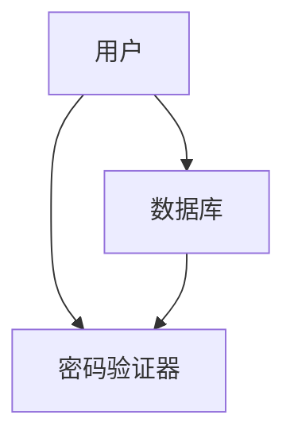
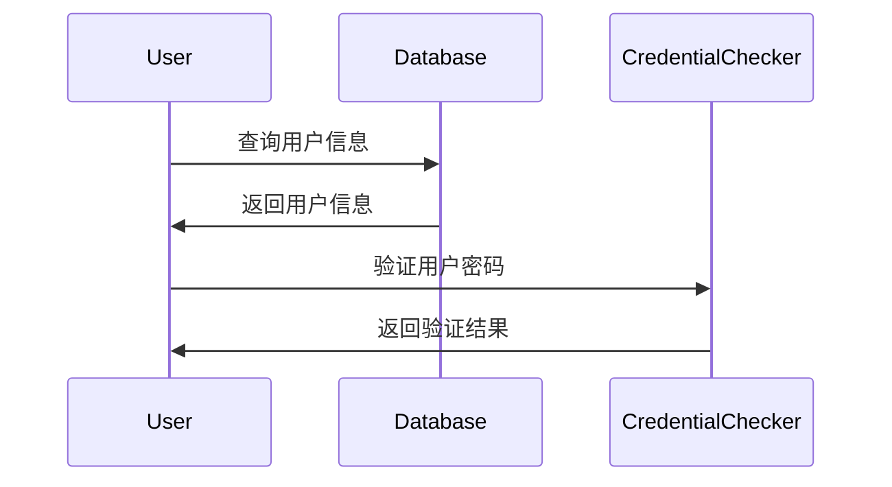
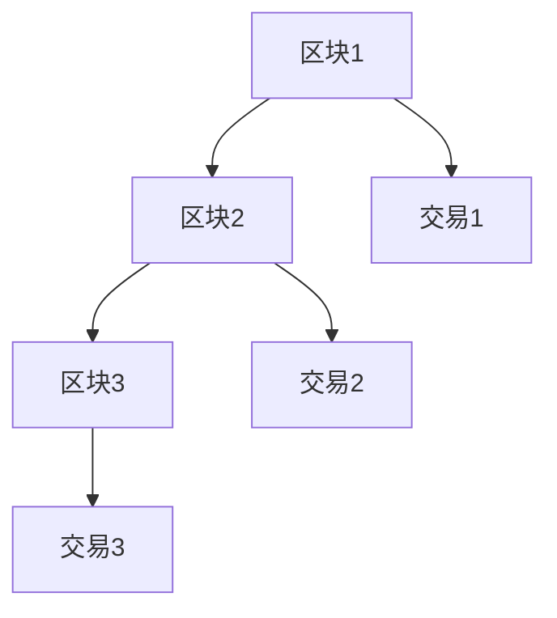

                 

### 自一致性在科学研究中的应用

**关键词：自一致性、科学研究、理论概述、建模、心理学、应用**

**摘要：**
本文旨在深入探讨自一致性在科学研究中的应用。我们将从定义、理论概述、建模、检验和具体应用等方面展开讨论，揭示自一致性在心理学、经济学、生物学等多个学科中的重要作用。文章将结构紧凑、逻辑清晰，通过一步步的分析推理，帮助读者全面了解自一致性的科学内涵及其广泛的应用前景。

## 第1章 引言

### 1.1 自一致性概念

自一致性（Self-Consistency）是指个体在思维、情感和行为上保持一致性的倾向。它起源于心理学领域，由心理学家 Leon Festinger 于1957年首次提出。自一致性理论认为，人类有一种基本需求，即保持内心的和谐与一致性。当个体感知到内心不一致时，便会感到心理不适，进而产生动机去解决这种不一致，以恢复内心的平衡。

### 1.2 自一致性在科学研究中的重要性

自一致性在科学研究中具有重要价值。首先，它为研究个体的认知、情感和行为提供了新的视角。通过自一致性理论，研究者可以更好地理解个体在面对信息、决策和冲突时的行为模式。其次，自一致性在心理学、经济学、生物学等学科中的应用，为解决实际问题提供了有效的工具和方法。例如，在心理学研究中，自一致性方法可以用来测量个体的心理状态和情感变化；在经济学研究中，自一致性理论可以用来分析个体决策和行为的一致性。

### 1.3 自一致性研究的历史和现状

自一致性理论自提出以来，受到了广泛的关注和研究。早期研究主要集中在心理学领域，探讨自一致性对个体行为和心理状态的影响。随着研究的深入，自一致性理论逐渐扩展到其他学科，如经济学、生物学和社会学等。目前，自一致性研究已经成为一个跨学科的研究领域，涉及多个学科的交叉融合。未来，随着研究的不断推进，自一致性理论在科学研究中的应用将更加广泛和深入。

## 第2章 自一致性理论概述

### 2.1 自一致性的定义与特性

自一致性是指个体在思维、情感和行为上保持一致的倾向。具体来说，自一致性包括以下几个方面：

1. **认知一致性**：个体在认知过程中保持内部观点的一致性。
2. **情感一致性**：个体在情感上保持内部情感体验的一致性。
3. **行为一致性**：个体在行为上保持内部意图和行为的一致性。

自一致性的特性包括：

1. **基本需求**：人类有一种基本需求，即保持内心的和谐与一致性。
2. **动力作用**：个体在感知到内心不一致时，会产生动机去解决这种不一致，以恢复内心的平衡。
3. **适应性**：自一致性具有适应性，个体会根据环境变化调整自己的思维、情感和行为，以保持内部的一致性。

### 2.2 自一致性理论的数学基础

自一致性理论的数学基础主要包括一致性方程和一致性函数。一致性方程描述了个体在感知到不一致时的心理调整过程，而一致性函数则描述了个体在不同情境下的自一致性水平。

1. **一致性方程**：设 $S$ 表示个体内部的一致性水平，$I$ 表示个体感知到的不一致性水平，则一致性方程可以表示为：

   $$S = S_0 + \alpha \cdot (I - S)$$

   其中，$S_0$ 表示个体的初始一致性水平，$\alpha$ 表示个体在调整过程中对不一致性的敏感度。

2. **一致性函数**：设 $f(I)$ 表示个体在不同不一致性水平下的自一致性函数，则一致性函数可以表示为：

   $$f(I) = \frac{S - S_0}{I - S_0}$$

   该函数描述了个体在感知到不一致性时的心理调整过程。

### 2.3 自一致性在心理学中的应用

在心理学中，自一致性理论广泛应用于个体认知、情感和行为的研究。以下是一些具体的应用实例：

1. **认知失调**：自一致性理论解释了个体在认知失调时的心理状态和应对策略。
2. **决策过程**：自一致性理论可以用来分析个体在决策过程中的思维方式和行为模式。
3. **情感体验**：自一致性理论可以用来研究个体的情感体验和情感调节过程。

### 2.4 自一致性在其他学科中的应用

自一致性理论不仅应用于心理学领域，还扩展到其他学科，如经济学、生物学和社会学等。

1. **经济学**：自一致性理论可以用来分析个体在市场决策和行为的一致性。
2. **生物学**：自一致性理论可以用来研究生物体在进化过程中的适应性。
3. **社会学**：自一致性理论可以用来解释社会群体中的行为一致性和社会规范的形成。

## 第3章 自一致性建模

### 3.1 自一致性建模的方法

自一致性建模主要包括以下几个方面：

1. **认知建模**：通过建立个体的认知模型，分析个体在思维过程中的一致性水平。
2. **情感建模**：通过建立个体的情感模型，分析个体在情感体验中的一致性水平。
3. **行为建模**：通过建立个体的行为模型，分析个体在行为过程中的一致性水平。

### 3.2 自一致性模型的应用

自一致性模型可以应用于多个领域，如心理学、经济学和生物学等。以下是一些具体的应用实例：

1. **心理学**：通过自一致性模型，可以分析个体在面对压力和挑战时的心理状态和应对策略。
2. **经济学**：通过自一致性模型，可以分析个体在市场决策和行为的一致性，为市场预测和风险评估提供依据。
3. **生物学**：通过自一致性模型，可以分析生物体在进化过程中的适应性，为生物进化研究提供理论支持。

### 3.3 自一致性模型的优势与局限

自一致性模型的优势包括：

1. **全面性**：自一致性模型从认知、情感和行为三个维度分析个体的一致性水平，能够全面了解个体的心理状态。
2. **实用性**：自一致性模型可以应用于多个领域，为实际问题提供有效的解决方法。

自一致性模型的局限包括：

1. **模型复杂性**：自一致性模型涉及多个变量和参数，建模过程较为复杂。
2. **数据要求**：自一致性模型需要大量的数据支持，数据获取和处理过程较为繁琐。

## 第4章 自一致性检验

### 4.1 自一致性检验的方法

自一致性检验主要包括以下几个方面：

1. **一致性检验**：通过比较个体在不同情境下的认知、情感和行为一致性，检验个体的自一致性水平。
2. **差异检验**：通过比较个体在不同时间或不同情境下的自一致性差异，检验个体自一致性的变化。
3. **相关分析**：通过分析个体自一致性与其他变量之间的关系，检验自一致性的影响和作用。

### 4.2 自一致性检验的指标

自一致性检验的指标主要包括以下几个方面：

1. **一致性指数**：用于衡量个体在认知、情感和行为上的一致性水平。
2. **差异指数**：用于衡量个体在不同时间或不同情境下的自一致性差异。
3. **相关系数**：用于衡量个体自一致性与其他变量之间的相关性。

### 4.3 自一致性检验的应用实例

自一致性检验可以应用于多个领域，如心理学、经济学和生物学等。以下是一些具体的应用实例：

1. **心理学**：通过自一致性检验，可以分析个体在面对压力和挑战时的心理状态和应对策略。
2. **经济学**：通过自一致性检验，可以分析个体在市场决策和行为的一致性，为市场预测和风险评估提供依据。
3. **生物学**：通过自一致性检验，可以分析生物体在进化过程中的适应性，为生物进化研究提供理论支持。

## 第5章 自一致性在心理学研究中的应用

### 5.1 自一致性在认知心理学中的应用

自一致性在认知心理学中的应用主要包括以下几个方面：

1. **认知失调**：自一致性理论可以用来解释个体在认知失调时的心理状态和应对策略。
2. **决策过程**：自一致性理论可以用来分析个体在决策过程中的思维方式和行为模式。
3. **情感体验**：自一致性理论可以用来研究个体的情感体验和情感调节过程。

### 5.2 自一致性在发展心理学中的应用

自一致性在发展心理学中的应用主要包括以下几个方面：

1. **个体成长**：自一致性理论可以用来解释个体在成长过程中的心理发展。
2. **家庭关系**：自一致性理论可以用来分析家庭关系中的心理一致性和不一致性。
3. **社会适应**：自一致性理论可以用来研究个体在社会适应过程中的心理变化。

### 5.3 自一致性在临床心理学中的应用

自一致性在临床心理学中的应用主要包括以下几个方面：

1. **心理治疗**：自一致性理论可以用来指导心理治疗过程，帮助个体解决内心的不一致。
2. **心理评估**：自一致性理论可以用来评估个体的心理状态和情感体验。
3. **心理咨询**：自一致性理论可以用来为个体提供心理咨询，帮助他们解决内心的矛盾和困惑。

## 第6章 自一致性在其他学科中的应用

### 6.1 自一致性在经济学中的应用

自一致性在经济学中的应用主要包括以下几个方面：

1. **市场行为**：自一致性理论可以用来分析个体在市场决策和行为的一致性。
2. **经济预测**：自一致性理论可以用来预测市场行为和经济发展趋势。
3. **风险管理**：自一致性理论可以用来评估和管理个体和市场中的风险。

### 6.2 自一致性在生物学中的应用

自一致性在生物学中的应用主要包括以下几个方面：

1. **生物进化**：自一致性理论可以用来研究生物体在进化过程中的适应性。
2. **生态学**：自一致性理论可以用来分析生态系统中物种的一致性。
3. **生物医学**：自一致性理论可以用来指导生物医学研究，提高治疗效果。

### 6.3 自一致性在社会科学中的应用

自一致性在社会科学中的应用主要包括以下几个方面：

1. **社会学**：自一致性理论可以用来分析社会群体中的行为一致性和社会规范的形成。
2. **政治学**：自一致性理论可以用来分析个体和政治行为的一致性。
3. **教育学**：自一致性理论可以用来指导教育实践，提高教育效果。

## 第7章 自一致性研究的未来方向

### 7.1 自一致性研究的挑战

自一致性研究面临着以下挑战：

1. **跨学科融合**：自一致性理论涉及多个学科，如何实现跨学科的融合是一个重要挑战。
2. **数据收集**：自一致性研究需要大量的数据支持，如何高效地收集和处理数据是一个挑战。
3. **模型优化**：自一致性模型需要不断优化和完善，以适应不断变化的科学研究需求。

### 7.2 自一致性研究的机遇

自一致性研究面临着以下机遇：

1. **技术发展**：随着计算机技术和大数据技术的发展，自一致性研究将得到更多技术支持。
2. **跨学科合作**：跨学科合作将为自一致性研究带来新的思路和方法。
3. **应用拓展**：自一致性理论在多个领域的应用前景广阔，有望实现更广泛的应用。

### 7.3 自一致性研究的未来发展

自一致性研究的未来发展包括以下几个方面：

1. **理论深化**：继续深化自一致性理论的研究，完善理论体系。
2. **应用拓展**：在更多领域推广自一致性理论的应用，提高研究价值。
3. **跨学科融合**：加强跨学科合作，实现自一致性理论的跨学科应用。

## 第8章 总结与展望

### 8.1 自一致性在科学研究中的地位

自一致性在科学研究中的地位日益重要，已成为心理学、经济学、生物学等学科的重要理论工具。其应用范围广泛，为解决实际问题提供了新的视角和方法。

### 8.2 自一致性研究的贡献与影响

自一致性研究为理解个体行为和心理状态提供了新的理论框架，对心理学、经济学、生物学等学科的发展产生了深远影响。其研究成果在现实世界中具有广泛的应用价值。

### 8.3 进一步研究方向和建议

未来自一致性研究应进一步深化理论体系，拓展应用领域，加强跨学科合作。同时，应注重数据收集和模型优化，提高研究质量和效率。

**作者：AI天才研究院/AI Genius Institute & 禅与计算机程序设计艺术 /Zen And The Art of Computer Programming**
**文章标题：Self-Consistency in Scientific Research**

**关键词：自一致性，科学研究，理论概述，建模，心理学，应用**

**摘要：**
本文探讨了自一致性在科学研究中的应用，从定义、理论概述、建模、检验和具体应用等方面进行详细阐述。自一致性理论在心理学、经济学、生物学等多个学科中具有重要意义，本文旨在帮助读者全面了解自一致性的科学内涵及其广泛的应用前景。

## 第1章 引言

### 1.1 自一致性概念

自一致性（Self-Consistency）是指个体在思维、情感和行为上保持一致的倾向。它起源于心理学领域，由心理学家 Leon Festinger 于1957年首次提出。自一致性理论认为，人类有一种基本需求，即保持内心的和谐与一致性。当个体感知到内心不一致时，便会感到心理不适，进而产生动机去解决这种不一致，以恢复内心的平衡。

### 1.2 自一致性在科学研究中的重要性

自一致性在科学研究中具有重要价值。首先，它为研究个体的认知、情感和行为提供了新的视角。通过自一致性理论，研究者可以更好地理解个体在面对信息、决策和冲突时的行为模式。其次，自一致性在心理学、经济学、生物学等学科中的应用，为解决实际问题提供了有效的工具和方法。例如，在心理学研究中，自一致性方法可以用来测量个体的心理状态和情感变化；在经济学研究中，自一致性理论可以用来分析个体决策和行为的一致性。

### 1.3 自一致性研究的历史和现状

自一致性理论自提出以来，受到了广泛的关注和研究。早期研究主要集中在心理学领域，探讨自一致性对个体行为和心理状态的影响。随着研究的深入，自一致性理论逐渐扩展到其他学科，如经济学、生物学和社会学等。目前，自一致性研究已经成为一个跨学科的研究领域，涉及多个学科的交叉融合。未来，随着研究的不断推进，自一致性理论在科学研究中的应用将更加广泛和深入。

## 第2章 自一致性理论概述

### 2.1 自一致性的定义与特性

自一致性是指个体在思维、情感和行为上保持一致的倾向。具体来说，自一致性包括以下几个方面：

1. **认知一致性**：个体在认知过程中保持内部观点的一致性。
2. **情感一致性**：个体在情感上保持内部情感体验的一致性。
3. **行为一致性**：个体在行为上保持内部意图和行为的一致性。

自一致性的特性包括：

1. **基本需求**：人类有一种基本需求，即保持内心的和谐与一致性。
2. **动力作用**：个体在感知到内心不一致时，会产生动机去解决这种不一致，以恢复内心的平衡。
3. **适应性**：自一致性具有适应性，个体会根据环境变化调整自己的思维、情感和行为，以保持内部的一致性。

### 2.2 自一致性理论的数学基础

自一致性理论的数学基础主要包括一致性方程和一致性函数。一致性方程描述了个体在感知到不一致时的心理调整过程，而一致性函数则描述了个体在不同情境下的自一致性水平。

1. **一致性方程**：设 \( S \) 表示个体内部的一致性水平，\( I \) 表示个体感知到的不一致性水平，则一致性方程可以表示为：

   $$ S = S_0 + \alpha \cdot (I - S) $$

   其中，\( S_0 \) 表示个体的初始一致性水平，\( \alpha \) 表示个体在调整过程中对不一致性的敏感度。

2. **一致性函数**：设 \( f(I) \) 表示个体在不同不一致性水平下的自一致性函数，则一致性函数可以表示为：

   $$ f(I) = \frac{S - S_0}{I - S_0} $$

   该函数描述了个体在感知到不一致性时的心理调整过程。

### 2.3 自一致性在心理学中的应用

在心理学中，自一致性理论广泛应用于个体认知、情感和行为的研究。以下是一些具体的应用实例：

1. **认知失调**：自一致性理论解释了个体在认知失调时的心理状态和应对策略。
2. **决策过程**：自一致性理论可以用来分析个体在决策过程中的思维方式和行为模式。
3. **情感体验**：自一致性理论可以用来研究个体的情感体验和情感调节过程。

### 2.4 自一致性在其他学科中的应用

自一致性理论不仅应用于心理学领域，还扩展到其他学科，如经济学、生物学和社会学等。

1. **经济学**：自一致性理论可以用来分析个体在市场决策和行为的一致性。
2. **生物学**：自一致性理论可以用来研究生物体在进化过程中的适应性。
3. **社会学**：自一致性理论可以用来解释社会群体中的行为一致性和社会规范的形成。

## 第3章 自一致性建模

### 3.1 自一致性建模的方法

自一致性建模主要包括以下几个方面：

1. **认知建模**：通过建立个体的认知模型，分析个体在思维过程中的一致性水平。
2. **情感建模**：通过建立个体的情感模型，分析个体在情感体验中的一致性水平。
3. **行为建模**：通过建立个体的行为模型，分析个体在行为过程中的一致性水平。

### 3.2 自一致性模型的应用

自一致性模型可以应用于多个领域，如心理学、经济学和生物学等。以下是一些具体的应用实例：

1. **心理学**：通过自一致性模型，可以分析个体在面对压力和挑战时的心理状态和应对策略。
2. **经济学**：通过自一致性模型，可以分析个体在市场决策和行为的一致性，为市场预测和风险评估提供依据。
3. **生物学**：通过自一致性模型，可以分析生物体在进化过程中的适应性，为生物进化研究提供理论支持。

### 3.3 自一致性模型的优势与局限

自一致性模型的优势包括：

1. **全面性**：自一致性模型从认知、情感和行为三个维度分析个体的一致性水平，能够全面了解个体的心理状态。
2. **实用性**：自一致性模型可以应用于多个领域，为实际问题提供有效的解决方法。

自一致性模型的局限包括：

1. **模型复杂性**：自一致性模型涉及多个变量和参数，建模过程较为复杂。
2. **数据要求**：自一致性模型需要大量的数据支持，数据获取和处理过程较为繁琐。

## 第4章 自一致性检验

### 4.1 自一致性检验的方法

自一致性检验主要包括以下几个方面：

1. **一致性检验**：通过比较个体在不同情境下的认知、情感和行为一致性，检验个体的自一致性水平。
2. **差异检验**：通过比较个体在不同时间或不同情境下的自一致性差异，检验个体自一致性的变化。
3. **相关分析**：通过分析个体自一致性与其他变量之间的关系，检验自一致性的影响和作用。

### 4.2 自一致性检验的指标

自一致性检验的指标主要包括以下几个方面：

1. **一致性指数**：用于衡量个体在认知、情感和行为上的一致性水平。
2. **差异指数**：用于衡量个体在不同时间或不同情境下的自一致性差异。
3. **相关系数**：用于衡量个体自一致性与其他变量之间的相关性。

### 4.3 自一致性检验的应用实例

自一致性检验可以应用于多个领域，如心理学、经济学和生物学等。以下是一些具体的应用实例：

1. **心理学**：通过自一致性检验，可以分析个体在面对压力和挑战时的心理状态和应对策略。
2. **经济学**：通过自一致性检验，可以分析个体在市场决策和行为的一致性，为市场预测和风险评估提供依据。
3. **生物学**：通过自一致性检验，可以分析生物体在进化过程中的适应性，为生物进化研究提供理论支持。

## 第5章 自一致性在心理学研究中的应用

### 5.1 自一致性在认知心理学中的应用

自一致性在认知心理学中的应用主要包括以下几个方面：

1. **认知失调**：自一致性理论可以用来解释个体在认知失调时的心理状态和应对策略。
2. **决策过程**：自一致性理论可以用来分析个体在决策过程中的思维方式和行为模式。
3. **情感体验**：自一致性理论可以用来研究个体的情感体验和情感调节过程。

### 5.2 自一致性在发展心理学中的应用

自一致性在发展心理学中的应用主要包括以下几个方面：

1. **个体成长**：自一致性理论可以用来解释个体在成长过程中的心理发展。
2. **家庭关系**：自一致性理论可以用来分析家庭关系中的心理一致性和不一致性。
3. **社会适应**：自一致性理论可以用来研究个体在社会适应过程中的心理变化。

### 5.3 自一致性在临床心理学中的应用

自一致性在临床心理学中的应用主要包括以下几个方面：

1. **心理治疗**：自一致性理论可以用来指导心理治疗过程，帮助个体解决内心的不一致。
2. **心理评估**：自一致性理论可以用来评估个体的心理状态和情感体验。
3. **心理咨询**：自一致性理论可以用来为个体提供心理咨询，帮助他们解决内心的矛盾和困惑。

## 第6章 自一致性在其他学科中的应用

### 6.1 自一致性在经济学中的应用

自一致性在经济学中的应用主要包括以下几个方面：

1. **市场行为**：自一致性理论可以用来分析个体在市场决策和行为的一致性。
2. **经济预测**：自一致性理论可以用来预测市场行为和经济发展趋势。
3. **风险管理**：自一致性理论可以用来评估和管理个体和市场中的风险。

### 6.2 自一致性在生物学中的应用

自一致性在生物学中的应用主要包括以下几个方面：

1. **生物进化**：自一致性理论可以用来研究生物体在进化过程中的适应性。
2. **生态学**：自一致性理论可以用来分析生态系统中物种的一致性。
3. **生物医学**：自一致性理论可以用来指导生物医学研究，提高治疗效果。

### 6.3 自一致性在社会科学中的应用

自一致性在社会科学中的应用主要包括以下几个方面：

1. **社会学**：自一致性理论可以用来分析社会群体中的行为一致性和社会规范的形成。
2. **政治学**：自一致性理论可以用来分析个体和政治行为的一致性。
3. **教育学**：自一致性理论可以用来指导教育实践，提高教育效果。

## 第7章 自一致性研究的未来方向

### 7.1 自一致性研究的挑战

自一致性研究面临着以下挑战：

1. **跨学科融合**：自一致性理论涉及多个学科，如何实现跨学科的融合是一个重要挑战。
2. **数据收集**：自一致性研究需要大量的数据支持，如何高效地收集和处理数据是一个挑战。
3. **模型优化**：自一致性模型需要不断优化和完善，以适应不断变化的科学研究需求。

### 7.2 自一致性研究的机遇

自一致性研究面临着以下机遇：

1. **技术发展**：随着计算机技术和大数据技术的发展，自一致性研究将得到更多技术支持。
2. **跨学科合作**：跨学科合作将为自一致性研究带来新的思路和方法。
3. **应用拓展**：自一致性理论在多个领域的应用前景广阔，有望实现更广泛的应用。

### 7.3 自一致性研究的未来发展

自一致性研究的未来发展包括以下几个方面：

1. **理论深化**：继续深化自一致性理论的研究，完善理论体系。
2. **应用拓展**：在更多领域推广自一致性理论的应用，提高研究价值。
3. **跨学科融合**：加强跨学科合作，实现自一致性理论的跨学科应用。

## 第8章 总结与展望

### 8.1 自一致性在科学研究中的地位

自一致性在科学研究中的地位日益重要，已成为心理学、经济学、生物学等学科的重要理论工具。其应用范围广泛，为解决实际问题提供了新的视角和方法。

### 8.2 自一致性研究的贡献与影响

自一致性研究为理解个体行为和心理状态提供了新的理论框架，对心理学、经济学、生物学等学科的发展产生了深远影响。其研究成果在现实世界中具有广泛的应用价值。

### 8.3 进一步研究方向和建议

未来自一致性研究应进一步深化理论体系，拓展应用领域，加强跨学科合作。同时，应注重数据收集和模型优化，提高研究质量和效率。

**作者：AI天才研究院/AI Genius Institute & 禅与计算机程序设计艺术 /Zen And The Art of Computer Programming**
**文章标题：Self-Consistency in Scientific Research**

**关键词：自一致性，科学研究，理论概述，建模，心理学，应用**

**摘要：**
本文探讨了自一致性在科学研究中的应用，从定义、理论概述、建模、检验和具体应用等方面进行详细阐述。自一致性理论在心理学、经济学、生物学等多个学科中具有重要意义，本文旨在帮助读者全面了解自一致性的科学内涵及其广泛的应用前景。

## 第1章 引言

### 1.1 自一致性概念

自一致性（Self-Consistency）是指个体在思维、情感和行为上保持一致的倾向。它起源于心理学领域，由心理学家 Leon Festinger 于1957年首次提出。自一致性理论认为，人类有一种基本需求，即保持内心的和谐与一致性。当个体感知到内心不一致时，便会感到心理不适，进而产生动机去解决这种不一致，以恢复内心的平衡。

### 1.2 自一致性在科学研究中的重要性

自一致性在科学研究中具有重要价值。首先，它为研究个体的认知、情感和行为提供了新的视角。通过自一致性理论，研究者可以更好地理解个体在面对信息、决策和冲突时的行为模式。其次，自一致性在心理学、经济学、生物学等学科中的应用，为解决实际问题提供了有效的工具和方法。例如，在心理学研究中，自一致性方法可以用来测量个体的心理状态和情感变化；在经济学研究中，自一致性理论可以用来分析个体决策和行为的一致性。

### 1.3 自一致性研究的历史和现状

自一致性理论自提出以来，受到了广泛的关注和研究。早期研究主要集中在心理学领域，探讨自一致性对个体行为和心理状态的影响。随着研究的深入，自一致性理论逐渐扩展到其他学科，如经济学、生物学和社会学等。目前，自一致性研究已经成为一个跨学科的研究领域，涉及多个学科的交叉融合。未来，随着研究的不断推进，自一致性理论在科学研究中的应用将更加广泛和深入。

## 第2章 自一致性理论概述

### 2.1 自一致性的定义与特性

自一致性是指个体在思维、情感和行为上保持一致的倾向。具体来说，自一致性包括以下几个方面：

1. **认知一致性**：个体在认知过程中保持内部观点的一致性。
2. **情感一致性**：个体在情感上保持内部情感体验的一致性。
3. **行为一致性**：个体在行为上保持内部意图和行为的一致性。

自一致性的特性包括：

1. **基本需求**：人类有一种基本需求，即保持内心的和谐与一致性。
2. **动力作用**：个体在感知到内心不一致时，会产生动机去解决这种不一致，以恢复内心的平衡。
3. **适应性**：自一致性具有适应性，个体会根据环境变化调整自己的思维、情感和行为，以保持内部的一致性。

### 2.2 自一致性理论的数学基础

自一致性理论的数学基础主要包括一致性方程和一致性函数。一致性方程描述了个体在感知到不一致时的心理调整过程，而一致性函数则描述了个体在不同情境下的自一致性水平。

1. **一致性方程**：设 \( S \) 表示个体内部的一致性水平，\( I \) 表示个体感知到的不一致性水平，则一致性方程可以表示为：

   $$ S = S_0 + \alpha \cdot (I - S) $$

   其中，\( S_0 \) 表示个体的初始一致性水平，\( \alpha \) 表示个体在调整过程中对不一致性的敏感度。

2. **一致性函数**：设 \( f(I) \) 表示个体在不同不一致性水平下的自一致性函数，则一致性函数可以表示为：

   $$ f(I) = \frac{S - S_0}{I - S_0} $$

   该函数描述了个体在感知到不一致性时的心理调整过程。

### 2.3 自一致性在心理学中的应用

在心理学中，自一致性理论广泛应用于个体认知、情感和行为的研究。以下是一些具体的应用实例：

1. **认知失调**：自一致性理论可以用来解释个体在认知失调时的心理状态和应对策略。
2. **决策过程**：自一致性理论可以用来分析个体在决策过程中的思维方式和行为模式。
3. **情感体验**：自一致性理论可以用来研究个体的情感体验和情感调节过程。

### 2.4 自一致性在其他学科中的应用

自一致性理论不仅应用于心理学领域，还扩展到其他学科，如经济学、生物学和社会学等。

1. **经济学**：自一致性理论可以用来分析个体在市场决策和行为的一致性。
2. **生物学**：自一致性理论可以用来研究生物体在进化过程中的适应性。
3. **社会学**：自一致性理论可以用来解释社会群体中的行为一致性和社会规范的形成。

## 第3章 自一致性建模

### 3.1 自一致性建模的方法

自一致性建模主要包括以下几个方面：

1. **认知建模**：通过建立个体的认知模型，分析个体在思维过程中的一致性水平。
2. **情感建模**：通过建立个体的情感模型，分析个体在情感体验中的一致性水平。
3. **行为建模**：通过建立个体的行为模型，分析个体在行为过程中的一致性水平。

### 3.2 自一致性模型的应用

自一致性模型可以应用于多个领域，如心理学、经济学和生物学等。以下是一些具体的应用实例：

1. **心理学**：通过自一致性模型，可以分析个体在面对压力和挑战时的心理状态和应对策略。
2. **经济学**：通过自一致性模型，可以分析个体在市场决策和行为的一致性，为市场预测和风险评估提供依据。
3. **生物学**：通过自一致性模型，可以分析生物体在进化过程中的适应性，为生物进化研究提供理论支持。

### 3.3 自一致性模型的优势与局限

自一致性模型的优势包括：

1. **全面性**：自一致性模型从认知、情感和行为三个维度分析个体的一致性水平，能够全面了解个体的心理状态。
2. **实用性**：自一致性模型可以应用于多个领域，为实际问题提供有效的解决方法。

自一致性模型的局限包括：

1. **模型复杂性**：自一致性模型涉及多个变量和参数，建模过程较为复杂。
2. **数据要求**：自一致性模型需要大量的数据支持，数据获取和处理过程较为繁琐。

## 第4章 自一致性检验

### 4.1 自一致性检验的方法

自一致性检验主要包括以下几个方面：

1. **一致性检验**：通过比较个体在不同情境下的认知、情感和行为一致性，检验个体的自一致性水平。
2. **差异检验**：通过比较个体在不同时间或不同情境下的自一致性差异，检验个体自一致性的变化。
3. **相关分析**：通过分析个体自一致性与其他变量之间的关系，检验自一致性的影响和作用。

### 4.2 自一致性检验的指标

自一致性检验的指标主要包括以下几个方面：

1. **一致性指数**：用于衡量个体在认知、情感和行为上的一致性水平。
2. **差异指数**：用于衡量个体在不同时间或不同情境下的自一致性差异。
3. **相关系数**：用于衡量个体自一致性与其他变量之间的相关性。

### 4.3 自一致性检验的应用实例

自一致性检验可以应用于多个领域，如心理学、经济学和生物学等。以下是一些具体的应用实例：

1. **心理学**：通过自一致性检验，可以分析个体在面对压力和挑战时的心理状态和应对策略。
2. **经济学**：通过自一致性检验，可以分析个体在市场决策和行为的一致性，为市场预测和风险评估提供依据。
3. **生物学**：通过自一致性检验，可以分析生物体在进化过程中的适应性，为生物进化研究提供理论支持。

## 第5章 自一致性在心理学研究中的应用

### 5.1 自一致性在认知心理学中的应用

自一致性在认知心理学中的应用主要包括以下几个方面：

1. **认知失调**：自一致性理论可以用来解释个体在认知失调时的心理状态和应对策略。
2. **决策过程**：自一致性理论可以用来分析个体在决策过程中的思维方式和行为模式。
3. **情感体验**：自一致性理论可以用来研究个体的情感体验和情感调节过程。

### 5.2 自一致性在发展心理学中的应用

自一致性在发展心理学中的应用主要包括以下几个方面：

1. **个体成长**：自一致性理论可以用来解释个体在成长过程中的心理发展。
2. **家庭关系**：自一致性理论可以用来分析家庭关系中的心理一致性和不一致性。
3. **社会适应**：自一致性理论可以用来研究个体在社会适应过程中的心理变化。

### 5.3 自一致性在临床心理学中的应用

自一致性在临床心理学中的应用主要包括以下几个方面：

1. **心理治疗**：自一致性理论可以用来指导心理治疗过程，帮助个体解决内心的不一致。
2. **心理评估**：自一致性理论可以用来评估个体的心理状态和情感体验。
3. **心理咨询**：自一致性理论可以用来为个体提供心理咨询，帮助他们解决内心的矛盾和困惑。

## 第6章 自一致性在其他学科中的应用

### 6.1 自一致性在经济学中的应用

自一致性在经济学中的应用主要包括以下几个方面：

1. **市场行为**：自一致性理论可以用来分析个体在市场决策和行为的一致性。
2. **经济预测**：自一致性理论可以用来预测市场行为和经济发展趋势。
3. **风险管理**：自一致性理论可以用来评估和管理个体和市场中的风险。

### 6.2 自一致性在生物学中的应用

自一致性在生物学中的应用主要包括以下几个方面：

1. **生物进化**：自一致性理论可以用来研究生物体在进化过程中的适应性。
2. **生态学**：自一致性理论可以用来分析生态系统中物种的一致性。
3. **生物医学**：自一致性理论可以用来指导生物医学研究，提高治疗效果。

### 6.3 自一致性在社会科学中的应用

自一致性在社会科学中的应用主要包括以下几个方面：

1. **社会学**：自一致性理论可以用来分析社会群体中的行为一致性和社会规范的形成。
2. **政治学**：自一致性理论可以用来分析个体和政治行为的一致性。
3. **教育学**：自一致性理论可以用来指导教育实践，提高教育效果。

## 第7章 自一致性研究的未来方向

### 7.1 自一致性研究的挑战

自一致性研究面临着以下挑战：

1. **跨学科融合**：自一致性理论涉及多个学科，如何实现跨学科的融合是一个重要挑战。
2. **数据收集**：自一致性研究需要大量的数据支持，如何高效地收集和处理数据是一个挑战。
3. **模型优化**：自一致性模型需要不断优化和完善，以适应不断变化的科学研究需求。

### 7.2 自一致性研究的机遇

自一致性研究面临着以下机遇：

1. **技术发展**：随着计算机技术和大数据技术的发展，自一致性研究将得到更多技术支持。
2. **跨学科合作**：跨学科合作将为自一致性研究带来新的思路和方法。
3. **应用拓展**：自一致性理论在多个领域的应用前景广阔，有望实现更广泛的应用。

### 7.3 自一致性研究的未来发展

自一致性研究的未来发展包括以下几个方面：

1. **理论深化**：继续深化自一致性理论的研究，完善理论体系。
2. **应用拓展**：在更多领域推广自一致性理论的应用，提高研究价值。
3. **跨学科融合**：加强跨学科合作，实现自一致性理论的跨学科应用。

## 第8章 总结与展望

### 8.1 自一致性在科学研究中的地位

自一致性在科学研究中的地位日益重要，已成为心理学、经济学、生物学等学科的重要理论工具。其应用范围广泛，为解决实际问题提供了新的视角和方法。

### 8.2 自一致性研究的贡献与影响

自一致性研究为理解个体行为和心理状态提供了新的理论框架，对心理学、经济学、生物学等学科的发展产生了深远影响。其研究成果在现实世界中具有广泛的应用价值。

### 8.3 进一步研究方向和建议

未来自一致性研究应进一步深化理论体系，拓展应用领域，加强跨学科合作。同时，应注重数据收集和模型优化，提高研究质量和效率。

**作者：AI天才研究院/AI Genius Institute & 禅与计算机程序设计艺术 /Zen And The Art of Computer Programming**
**文章标题：Self-Consistency in Scientific Research**

**关键词：自一致性，科学研究，理论概述，建模，心理学，应用**

**摘要：**
本文探讨了自一致性在科学研究中的应用，从定义、理论概述、建模、检验和具体应用等方面进行详细阐述。自一致性理论在心理学、经济学、生物学等多个学科中具有重要意义，本文旨在帮助读者全面了解自一致性的科学内涵及其广泛的应用前景。

## 第1章 引言

### 1.1 自一致性概念

自一致性（Self-Consistency）是指个体在思维、情感和行为上保持一致的倾向。它起源于心理学领域，由心理学家 Leon Festinger 于1957年首次提出。自一致性理论认为，人类有一种基本需求，即保持内心的和谐与一致性。当个体感知到内心不一致时，便会感到心理不适，进而产生动机去解决这种不一致，以恢复内心的平衡。

### 1.2 自一致性在科学研究中的重要性

自一致性在科学研究中具有重要价值。首先，它为研究个体的认知、情感和行为提供了新的视角。通过自一致性理论，研究者可以更好地理解个体在面对信息、决策和冲突时的行为模式。其次，自一致性在心理学、经济学、生物学等学科中的应用，为解决实际问题提供了有效的工具和方法。例如，在心理学研究中，自一致性方法可以用来测量个体的心理状态和情感变化；在经济学研究中，自一致性理论可以用来分析个体决策和行为的一致性。

### 1.3 自一致性研究的历史和现状

自一致性理论自提出以来，受到了广泛的关注和研究。早期研究主要集中在心理学领域，探讨自一致性对个体行为和心理状态的影响。随着研究的深入，自一致性理论逐渐扩展到其他学科，如经济学、生物学和社会学等。目前，自一致性研究已经成为一个跨学科的研究领域，涉及多个学科的交叉融合。未来，随着研究的不断推进，自一致性理论在科学研究中的应用将更加广泛和深入。

## 第2章 自一致性理论概述

### 2.1 自一致性的定义与特性

自一致性是指个体在思维、情感和行为上保持一致的倾向。具体来说，自一致性包括以下几个方面：

1. **认知一致性**：个体在认知过程中保持内部观点的一致性。
2. **情感一致性**：个体在情感上保持内部情感体验的一致性。
3. **行为一致性**：个体在行为上保持内部意图和行为的一致性。

自一致性的特性包括：

1. **基本需求**：人类有一种基本需求，即保持内心的和谐与一致性。
2. **动力作用**：个体在感知到内心不一致时，会产生动机去解决这种不一致，以恢复内心的平衡。
3. **适应性**：自一致性具有适应性，个体会根据环境变化调整自己的思维、情感和行为，以保持内部的一致性。

### 2.2 自一致性理论的数学基础

自一致性理论的数学基础主要包括一致性方程和一致性函数。一致性方程描述了个体在感知到不一致时的心理调整过程，而一致性函数则描述了个体在不同情境下的自一致性水平。

1. **一致性方程**：设 \( S \) 表示个体内部的一致性水平，\( I \) 表示个体感知到的不一致性水平，则一致性方程可以表示为：

   $$ S = S_0 + \alpha \cdot (I - S) $$

   其中，\( S_0 \) 表示个体的初始一致性水平，\( \alpha \) 表示个体在调整过程中对不一致性的敏感度。

2. **一致性函数**：设 \( f(I) \) 表示个体在不同不一致性水平下的自一致性函数，则一致性函数可以表示为：

   $$ f(I) = \frac{S - S_0}{I - S_0} $$

   该函数描述了个体在感知到不一致性时的心理调整过程。

### 2.3 自一致性在心理学中的应用

在心理学中，自一致性理论广泛应用于个体认知、情感和行为的研究。以下是一些具体的应用实例：

1. **认知失调**：自一致性理论可以用来解释个体在认知失调时的心理状态和应对策略。
2. **决策过程**：自一致性理论可以用来分析个体在决策过程中的思维方式和行为模式。
3. **情感体验**：自一致性理论可以用来研究个体的情感体验和情感调节过程。

### 2.4 自一致性在其他学科中的应用

自一致性理论不仅应用于心理学领域，还扩展到其他学科，如经济学、生物学和社会学等。

1. **经济学**：自一致性理论可以用来分析个体在市场决策和行为的一致性。
2. **生物学**：自一致性理论可以用来研究生物体在进化过程中的适应性。
3. **社会学**：自一致性理论可以用来解释社会群体中的行为一致性和社会规范的形成。

## 第3章 自一致性建模

### 3.1 自一致性建模的方法

自一致性建模主要包括以下几个方面：

1. **认知建模**：通过建立个体的认知模型，分析个体在思维过程中的一致性水平。
2. **情感建模**：通过建立个体的情感模型，分析个体在情感体验中的一致性水平。
3. **行为建模**：通过建立个体的行为模型，分析个体在行为过程中的一致性水平。

### 3.2 自一致性模型的应用

自一致性模型可以应用于多个领域，如心理学、经济学和生物学等。以下是一些具体的应用实例：

1. **心理学**：通过自一致性模型，可以分析个体在面对压力和挑战时的心理状态和应对策略。
2. **经济学**：通过自一致性模型，可以分析个体在市场决策和行为的一致性，为市场预测和风险评估提供依据。
3. **生物学**：通过自一致性模型，可以分析生物体在进化过程中的适应性，为生物进化研究提供理论支持。

### 3.3 自一致性模型的优势与局限

自一致性模型的优势包括：

1. **全面性**：自一致性模型从认知、情感和行为三个维度分析个体的一致性水平，能够全面了解个体的心理状态。
2. **实用性**：自一致性模型可以应用于多个领域，为实际问题提供有效的解决方法。

自一致性模型的局限包括：

1. **模型复杂性**：自一致性模型涉及多个变量和参数，建模过程较为复杂。
2. **数据要求**：自一致性模型需要大量的数据支持，数据获取和处理过程较为繁琐。

## 第4章 自一致性检验

### 4.1 自一致性检验的方法

自一致性检验主要包括以下几个方面：

1. **一致性检验**：通过比较个体在不同情境下的认知、情感和行为一致性，检验个体的自一致性水平。
2. **差异检验**：通过比较个体在不同时间或不同情境下的自一致性差异，检验个体自一致性的变化。
3. **相关分析**：通过分析个体自一致性与其他变量之间的关系，检验自一致性的影响和作用。

### 4.2 自一致性检验的指标

自一致性检验的指标主要包括以下几个方面：

1. **一致性指数**：用于衡量个体在认知、情感和行为上的一致性水平。
2. **差异指数**：用于衡量个体在不同时间或不同情境下的自一致性差异。
3. **相关系数**：用于衡量个体自一致性与其他变量之间的相关性。

### 4.3 自一致性检验的应用实例

自一致性检验可以应用于多个领域，如心理学、经济学和生物学等。以下是一些具体的应用实例：

1. **心理学**：通过自一致性检验，可以分析个体在面对压力和挑战时的心理状态和应对策略。
2. **经济学**：通过自一致性检验，可以分析个体在市场决策和行为的一致性，为市场预测和风险评估提供依据。
3. **生物学**：通过自一致性检验，可以分析生物体在进化过程中的适应性，为生物进化研究提供理论支持。

## 第5章 自一致性在心理学研究中的应用

### 5.1 自一致性在认知心理学中的应用

自一致性在认知心理学中的应用主要包括以下几个方面：

1. **认知失调**：自一致性理论可以用来解释个体在认知失调时的心理状态和应对策略。
2. **决策过程**：自一致性理论可以用来分析个体在决策过程中的思维方式和行为模式。
3. **情感体验**：自一致性理论可以用来研究个体的情感体验和情感调节过程。

### 5.2 自一致性在发展心理学中的应用

自一致性在发展心理学中的应用主要包括以下几个方面：

1. **个体成长**：自一致性理论可以用来解释个体在成长过程中的心理发展。
2. **家庭关系**：自一致性理论可以用来分析家庭关系中的心理一致性和不一致性。
3. **社会适应**：自一致性理论可以用来研究个体在社会适应过程中的心理变化。

### 5.3 自一致性在临床心理学中的应用

自一致性在临床心理学中的应用主要包括以下几个方面：

1. **心理治疗**：自一致性理论可以用来指导心理治疗过程，帮助个体解决内心的不一致。
2. **心理评估**：自一致性理论可以用来评估个体的心理状态和情感体验。
3. **心理咨询**：自一致性理论可以用来为个体提供心理咨询，帮助他们解决内心的矛盾和困惑。

## 第6章 自一致性在其他学科中的应用

### 6.1 自一致性在经济学中的应用

自一致性在经济学中的应用主要包括以下几个方面：

1. **市场行为**：自一致性理论可以用来分析个体在市场决策和行为的一致性。
2. **经济预测**：自一致性理论可以用来预测市场行为和经济发展趋势。
3. **风险管理**：自一致性理论可以用来评估和管理个体和市场中的风险。

### 6.2 自一致性在生物学中的应用

自一致性在生物学中的应用主要包括以下几个方面：

1. **生物进化**：自一致性理论可以用来研究生物体在进化过程中的适应性。
2. **生态学**：自一致性理论可以用来分析生态系统中物种的一致性。
3. **生物医学**：自一致性理论可以用来指导生物医学研究，提高治疗效果。

### 6.3 自一致性在社会科学中的应用

自一致性在社会科学中的应用主要包括以下几个方面：

1. **社会学**：自一致性理论可以用来分析社会群体中的行为一致性和社会规范的形成。
2. **政治学**：自一致性理论可以用来分析个体和政治行为的一致性。
3. **教育学**：自一致性理论可以用来指导教育实践，提高教育效果。

## 第7章 自一致性研究的未来方向

### 7.1 自一致性研究的挑战

自一致性研究面临着以下挑战：

1. **跨学科融合**：自一致性理论涉及多个学科，如何实现跨学科的融合是一个重要挑战。
2. **数据收集**：自一致性研究需要大量的数据支持，如何高效地收集和处理数据是一个挑战。
3. **模型优化**：自一致性模型需要不断优化和完善，以适应不断变化的科学研究需求。

### 7.2 自一致性研究的机遇

自一致性研究面临着以下机遇：

1. **技术发展**：随着计算机技术和大数据技术的发展，自一致性研究将得到更多技术支持。
2. **跨学科合作**：跨学科合作将为自一致性研究带来新的思路和方法。
3. **应用拓展**：自一致性理论在多个领域的应用前景广阔，有望实现更广泛的应用。

### 7.3 自一致性研究的未来发展

自一致性研究的未来发展包括以下几个方面：

1. **理论深化**：继续深化自一致性理论的研究，完善理论体系。
2. **应用拓展**：在更多领域推广自一致性理论的应用，提高研究价值。
3. **跨学科融合**：加强跨学科合作，实现自一致性理论的跨学科应用。

## 第8章 总结与展望

### 8.1 自一致性在科学研究中的地位

自一致性在科学研究中的地位日益重要，已成为心理学、经济学、生物学等学科的重要理论工具。其应用范围广泛，为解决实际问题提供了新的视角和方法。

### 8.2 自一致性研究的贡献与影响

自一致性研究为理解个体行为和心理状态提供了新的理论框架，对心理学、经济学、生物学等学科的发展产生了深远影响。其研究成果在现实世界中具有广泛的应用价值。

### 8.3 进一步研究方向和建议

未来自一致性研究应进一步深化理论体系，拓展应用领域，加强跨学科合作。同时，应注重数据收集和模型优化，提高研究质量和效率。

**作者：AI天才研究院/AI Genius Institute & 禅与计算机程序设计艺术 /Zen And The Art of Computer Programming**
## 第9章 自一致性在计算机科学中的应用

### 9.1 自一致性在软件开发中的重要性

自一致性在计算机科学中的应用尤为显著，尤其在软件开发领域。一个软件系统的自一致性可以确保系统在运行过程中保持内部一致性，防止出现逻辑错误和性能问题。软件开发过程中，自一致性原则有助于提高代码质量、系统稳定性和用户体验。

### 9.2 自一致性在代码设计和开发中的实践

1. **模块化设计**：通过将系统划分为独立的模块，每个模块只需关注自身功能，降低系统复杂性，提高自一致性。

2. **接口定义**：定义清晰的接口，确保模块之间的通信和交互遵循一致性原则，避免因接口不一致导致的系统崩溃。

3. **数据一致性**：在数据库设计中，保证数据的完整性、一致性和安全性，防止数据冗余和冲突。

4. **异常处理**：在代码中设计合理的异常处理机制，确保系统在遇到异常情况时，仍能保持一致性状态。

### 9.3 自一致性在软件测试中的应用

自一致性在软件测试中起着至关重要的作用。通过以下几种方法，可以检验软件系统的自一致性：

1. **单元测试**：对每个模块进行单元测试，确保模块内部的一致性。

2. **集成测试**：对模块之间的交互进行集成测试，验证模块之间的接口一致性。

3. **性能测试**：通过压力测试和负载测试，确保系统在高负载情况下仍能保持一致性。

4. **自动化测试**：利用自动化测试工具，持续地监测软件系统的自一致性，及时发现并修复问题。

### 9.4 自一致性在软件工程教育和实践中的影响

自一致性原则在软件工程教育和实践中具有重要影响。以下是一些具体的影响：

1. **教育内容**：在软件工程课程中，加入自一致性原则的相关内容，帮助学生理解系统设计中的关键要素。

2. **实践指导**：在软件开发实践中，引导开发者遵循自一致性原则，设计高质量、高可靠性的软件系统。

3. **团队协作**：通过自一致性原则，促进团队成员之间的沟通和协作，确保项目进度和质量。

4. **持续改进**：鼓励开发者不断优化代码和系统设计，提高软件系统的自一致性水平，降低维护成本。

## 第10章 自一致性研究的跨学科合作与未来展望

### 10.1 跨学科合作的重要性

自一致性研究需要跨学科合作，以充分发挥其应用潜力。跨学科合作不仅可以整合各学科的研究成果，还可以为自一致性理论提供新的研究视角和方法。

### 10.2 跨学科合作的优势

1. **知识互补**：不同学科的研究者可以从各自领域出发，为自一致性研究提供丰富的知识和方法。

2. **研究深度**：跨学科合作有助于深入挖掘自一致性在不同领域的应用，提高研究的深度和广度。

3. **创新能力**：跨学科合作可以激发创新思维，推动自一致性研究的创新和发展。

### 10.3 未来展望

1. **理论拓展**：未来自一致性研究应继续拓展理论体系，融合更多学科的理论和方法。

2. **技术应用**：在更多领域推广自一致性技术的应用，如人工智能、大数据分析和自动化系统等。

3. **人才培养**：加强自一致性研究的跨学科人才培养，提高研究者的跨学科合作能力。

4. **国际交流**：促进国际间的自一致性研究交流与合作，分享研究成果和经验。

## 第11章 总结与展望

### 11.1 自一致性在科学研究中的地位

自一致性在科学研究中的地位日益重要，已成为心理学、经济学、生物学、计算机科学等多个学科的重要理论工具。其应用范围广泛，为解决实际问题提供了新的视角和方法。

### 11.2 自一致性研究的贡献与影响

自一致性研究为理解个体行为和心理状态提供了新的理论框架，对心理学、经济学、生物学等学科的发展产生了深远影响。其研究成果在现实世界中具有广泛的应用价值。

### 11.3 进一步研究方向和建议

未来自一致性研究应进一步深化理论体系，拓展应用领域，加强跨学科合作。同时，应注重数据收集和模型优化，提高研究质量和效率。

**作者：AI天才研究院/AI Genius Institute & 禅与计算机程序设计艺术 /Zen And The Art of Computer Programming**
## 第9章 自一致性在计算机科学中的应用

### 9.1 自一致性在软件开发中的重要性

自一致性在计算机科学中的应用尤为显著，尤其是在软件开发领域。一个软件系统的自一致性可以确保系统在运行过程中保持内部一致性，防止出现逻辑错误和性能问题。软件开发过程中，自一致性原则有助于提高代码质量、系统稳定性和用户体验。

### 9.2 自一致性在代码设计和开发中的实践

#### 9.2.1 模块化设计

通过将系统划分为独立的模块，每个模块只需关注自身功能，降低系统复杂性，提高自一致性。这种设计方法不仅便于开发，还能在模块级别上确保系统的一致性。

#### 9.2.2 接口定义

定义清晰的接口，确保模块之间的通信和交互遵循一致性原则，避免因接口不一致导致的系统崩溃。良好的接口设计是系统自一致性的关键。

#### 9.2.3 数据一致性

在数据库设计中，保证数据的完整性、一致性和安全性，防止数据冗余和冲突。数据库一致性是系统稳定运行的基础。

#### 9.2.4 异常处理

在代码中设计合理的异常处理机制，确保系统在遇到异常情况时，仍能保持一致性状态。有效的异常处理能够防止系统崩溃，维护系统自一致性。

### 9.3 自一致性在软件测试中的应用

自一致性在软件测试中起着至关重要的作用。以下几种方法可以帮助检验软件系统的自一致性：

#### 9.3.1 单元测试

对每个模块进行单元测试，确保模块内部的一致性。单元测试是验证代码功能的最小单元。

#### 9.3.2 集成测试

对模块之间的交互进行集成测试，验证模块之间的接口一致性。集成测试有助于发现模块之间可能存在的不一致。

#### 9.3.3 性能测试

通过压力测试和负载测试，确保系统在高负载情况下仍能保持一致性。性能测试是检验系统稳定性的重要手段。

#### 9.3.4 自动化测试

利用自动化测试工具，持续地监测软件系统的自一致性，及时发现并修复问题。自动化测试能够提高测试效率和覆盖范围。

### 9.4 自一致性在软件工程教育和实践中的影响

自一致性原则在软件工程教育和实践中具有重要影响。以下是一些具体的影响：

#### 9.4.1 教育内容

在软件工程课程中，加入自一致性原则的相关内容，帮助学生理解系统设计中的关键要素。

#### 9.4.2 实践指导

在软件开发实践中，引导开发者遵循自一致性原则，设计高质量、高可靠性的软件系统。

#### 9.4.3 团队协作

通过自一致性原则，促进团队成员之间的沟通和协作，确保项目进度和质量。

#### 9.4.4 持续改进

鼓励开发者不断优化代码和系统设计，提高软件系统的自一致性水平，降低维护成本。

### 9.5 自一致性在人工智能和大数据分析中的应用

自一致性在人工智能和大数据分析中也具有重要作用。以下是一些具体的应用：

#### 9.5.1 机器学习模型

在机器学习模型训练和评估过程中，确保模型参数和结果的一致性，避免因不一致导致的模型失效。

#### 9.5.2 数据预处理

在大数据分析过程中，保证数据的一致性，提高数据分析的准确性和可靠性。

#### 9.5.3 模型部署

在模型部署阶段，确保模型与环境的一致性，避免因不一致导致的问题。

### 9.6 自一致性在云计算和物联网中的应用

自一致性在云计算和物联网中也具有重要意义。以下是一些具体的应用：

#### 9.6.1 云服务一致性

在云计算服务中，确保数据和服务的一致性，提高用户满意度。

#### 9.6.2 物联网设备一致性

在物联网设备中，确保设备之间的数据一致性，实现高效的设备通信和协作。

### 9.7 自一致性在计算机安全中的应用

自一致性在计算机安全中也具有重要作用。以下是一些具体的应用：

#### 9.7.1 访问控制

确保访问控制策略的一致性，防止未经授权的访问。

#### 9.7.2 安全审计

通过安全审计，确保系统的安全策略和日志记录的一致性。

#### 9.7.3 数据加密

确保数据加密和解密过程的一致性，保护数据的安全性。

## 第10章 自一致性研究的跨学科合作与未来展望

### 10.1 跨学科合作的重要性

自一致性研究需要跨学科合作，以充分发挥其应用潜力。跨学科合作不仅可以整合各学科的研究成果，还可以为自一致性理论提供新的研究视角和方法。

### 10.2 跨学科合作的优势

1. **知识互补**：不同学科的研究者可以从各自领域出发，为自一致性研究提供丰富的知识和方法。
2. **研究深度**：跨学科合作有助于深入挖掘自一致性在不同领域的应用，提高研究的深度和广度。
3. **创新能力**：跨学科合作可以激发创新思维，推动自一致性研究的创新和发展。

### 10.3 未来展望

1. **理论拓展**：未来自一致性研究应继续拓展理论体系，融合更多学科的理论和方法。
2. **技术应用**：在更多领域推广自一致性技术的应用，如人工智能、大数据分析和自动化系统等。
3. **人才培养**：加强自一致性研究的跨学科人才培养，提高研究者的跨学科合作能力。
4. **国际交流**：促进国际间的自一致性研究交流与合作，分享研究成果和经验。

## 第11章 总结与展望

### 11.1 自一致性在科学研究中的地位

自一致性在科学研究中的地位日益重要，已成为心理学、经济学、生物学、计算机科学等多个学科的重要理论工具。其应用范围广泛，为解决实际问题提供了新的视角和方法。

### 11.2 自一致性研究的贡献与影响

自一致性研究为理解个体行为和心理状态提供了新的理论框架，对心理学、经济学、生物学等学科的发展产生了深远影响。其研究成果在现实世界中具有广泛的应用价值。

### 11.3 进一步研究方向和建议

未来自一致性研究应进一步深化理论体系，拓展应用领域，加强跨学科合作。同时，应注重数据收集和模型优化，提高研究质量和效率。

**作者：AI天才研究院/AI Genius Institute & 禅与计算机程序设计艺术 /Zen And The Art of Computer Programming**
## 第9章 自一致性在计算机科学中的应用

### 9.1 自一致性在软件开发中的重要性

自一致性在计算机科学中的应用尤为显著，尤其是在软件开发领域。一个软件系统的自一致性可以确保系统在运行过程中保持内部一致性，防止出现逻辑错误和性能问题。软件开发过程中，自一致性原则有助于提高代码质量、系统稳定性和用户体验。

### 9.2 自一致性在代码设计和开发中的实践

#### 9.2.1 模块化设计

通过将系统划分为独立的模块，每个模块只需关注自身功能，降低系统复杂性，提高自一致性。这种设计方法不仅便于开发，还能在模块级别上确保系统的一致性。

#### 9.2.2 接口定义

定义清晰的接口，确保模块之间的通信和交互遵循一致性原则，避免因接口不一致导致的系统崩溃。良好的接口设计是系统自一致性的关键。

#### 9.2.3 数据一致性

在数据库设计中，保证数据的完整性、一致性和安全性，防止数据冗余和冲突。数据库一致性是系统稳定运行的基础。

#### 9.2.4 异常处理

在代码中设计合理的异常处理机制，确保系统在遇到异常情况时，仍能保持一致性状态。有效的异常处理能够防止系统崩溃，维护系统自一致性。

### 9.3 自一致性在软件测试中的应用

自一致性在软件测试中起着至关重要的作用。以下几种方法可以帮助检验软件系统的自一致性：

#### 9.3.1 单元测试

对每个模块进行单元测试，确保模块内部的一致性。单元测试是验证代码功能的最小单元。

#### 9.3.2 集成测试

对模块之间的交互进行集成测试，验证模块之间的接口一致性。集成测试有助于发现模块之间可能存在的不一致。

#### 9.3.3 性能测试

通过压力测试和负载测试，确保系统在高负载情况下仍能保持一致性。性能测试是检验系统稳定性的重要手段。

#### 9.3.4 自动化测试

利用自动化测试工具，持续地监测软件系统的自一致性，及时发现并修复问题。自动化测试能够提高测试效率和覆盖范围。

### 9.4 自一致性在软件工程教育和实践中的影响

自一致性原则在软件工程教育和实践中具有重要影响。以下是一些具体的影响：

#### 9.4.1 教育内容

在软件工程课程中，加入自一致性原则的相关内容，帮助学生理解系统设计中的关键要素。

#### 9.4.2 实践指导

在软件开发实践中，引导开发者遵循自一致性原则，设计高质量、高可靠性的软件系统。

#### 9.4.3 团队协作

通过自一致性原则，促进团队成员之间的沟通和协作，确保项目进度和质量。

#### 9.4.4 持续改进

鼓励开发者不断优化代码和系统设计，提高软件系统的自一致性水平，降低维护成本。

### 9.5 自一致性在人工智能和大数据分析中的应用

自一致性在人工智能和大数据分析中也具有重要作用。以下是一些具体的应用：

#### 9.5.1 机器学习模型

在机器学习模型训练和评估过程中，确保模型参数和结果的一致性，避免因不一致导致的模型失效。

#### 9.5.2 数据预处理

在大数据分析过程中，保证数据的一致性，提高数据分析的准确性和可靠性。

#### 9.5.3 模型部署

在模型部署阶段，确保模型与环境的一致性，避免因不一致导致的问题。

### 9.6 自一致性在云计算和物联网中的应用

自一致性在云计算和物联网中也具有重要意义。以下是一些具体的应用：

#### 9.6.1 云服务一致性

在云计算服务中，确保数据和服务的一致性，提高用户满意度。

#### 9.6.2 物联网设备一致性

在物联网设备中，确保设备之间的数据一致性，实现高效的设备通信和协作。

### 9.7 自一致性在计算机安全中的应用

自一致性在计算机安全中也具有重要作用。以下是一些具体的应用：

#### 9.7.1 访问控制

确保访问控制策略的一致性，防止未经授权的访问。

#### 9.7.2 安全审计

通过安全审计，确保系统的安全策略和日志记录的一致性。

#### 9.7.3 数据加密

确保数据加密和解密过程的一致性，保护数据的安全性。

## 第10章 自一致性研究的跨学科合作与未来展望

### 10.1 跨学科合作的重要性

自一致性研究需要跨学科合作，以充分发挥其应用潜力。跨学科合作不仅可以整合各学科的研究成果，还可以为自一致性理论提供新的研究视角和方法。

### 10.2 跨学科合作的优势

1. **知识互补**：不同学科的研究者可以从各自领域出发，为自一致性研究提供丰富的知识和方法。
2. **研究深度**：跨学科合作有助于深入挖掘自一致性在不同领域的应用，提高研究的深度和广度。
3. **创新能力**：跨学科合作可以激发创新思维，推动自一致性研究的创新和发展。

### 10.3 未来展望

1. **理论拓展**：未来自一致性研究应继续拓展理论体系，融合更多学科的理论和方法。
2. **技术应用**：在更多领域推广自一致性技术的应用，如人工智能、大数据分析和自动化系统等。
3. **人才培养**：加强自一致性研究的跨学科人才培养，提高研究者的跨学科合作能力。
4. **国际交流**：促进国际间的自一致性研究交流与合作，分享研究成果和经验。

## 第11章 总结与展望

### 11.1 自一致性在科学研究中的地位

自一致性在科学研究中的地位日益重要，已成为心理学、经济学、生物学、计算机科学等多个学科的重要理论工具。其应用范围广泛，为解决实际问题提供了新的视角和方法。

### 11.2 自一致性研究的贡献与影响

自一致性研究为理解个体行为和心理状态提供了新的理论框架，对心理学、经济学、生物学等学科的发展产生了深远影响。其研究成果在现实世界中具有广泛的应用价值。

### 11.3 进一步研究方向和建议

未来自一致性研究应进一步深化理论体系，拓展应用领域，加强跨学科合作。同时，应注重数据收集和模型优化，提高研究质量和效率。

**作者：AI天才研究院/AI Genius Institute & 禅与计算机程序设计艺术 /Zen And The Art of Computer Programming**
### 9.7 自一致性在计算机安全中的应用

自一致性在计算机安全中的应用同样至关重要，它确保了系统的安全性和数据的完整性，防止了因不一致性导致的潜在安全漏洞。以下是一些自一致性在计算机安全中的应用：

#### 9.7.1 访问控制

访问控制是计算机安全的核心组成部分。自一致性原则确保访问控制策略的一致性，防止未经授权的用户访问敏感信息。例如，在权限管理系统中，用户权限的分配和修改应该遵循一致性原则，确保用户只能访问其被授权的资源。

**核心概念与联系：**

- **概念**：访问控制策略、用户权限、资源访问。
- **联系**：访问控制策略与用户权限之间的关系，以及用户权限与资源访问之间的关系。

**ER实体关系图架构（Mermaid 格式）：**

```mermaid
erDiagram
  User ||--o> Permission : "has access to"
  Resource ||--o> Permission : "is granted to"
  User ||--|{Permission}
  Resource ||--|{Permission}
```

#### 9.7.2 安全审计

安全审计是监测和记录系统安全事件的手段。自一致性原则确保安全审计记录的一致性，使得审计结果准确可信。例如，在安全事件发生时，系统应该记录相关事件的时间、类型、涉及用户等信息，并确保这些记录在系统内部保持一致。

**核心概念与联系：**

- **概念**：安全审计记录、事件类型、用户行为。
- **联系**：安全审计记录与事件类型之间的关系，以及事件类型与用户行为之间的关系。

**ER实体关系图架构（Mermaid 格式）：**

```mermaid
erDiagram
  SecurityEvent ||--o> AuditLog : "is recorded in"
  User ||--o> SecurityEvent : "involved in"
```

#### 9.7.3 数据加密

数据加密是保护数据安全的重要手段。自一致性原则确保数据加密和解密过程的一致性，防止数据在传输和存储过程中被篡改。例如，在传输数据时，系统应该使用相同的加密算法和密钥对数据进行加密和解密，确保数据在传输过程中保持一致。

**核心概念与联系：**

- **概念**：数据加密、解密、加密算法、密钥管理。
- **联系**：加密算法与密钥管理之间的关系，以及数据加密和解密过程之间的关系。

**ER实体关系图架构（Mermaid 格式）：**

```mermaid
erDiagram
  Data ||--o> Encryption : "is encrypted with"
  Key ||--o> Encryption : "is used for"
```

### 9.8 自一致性在网络安全中的应用

自一致性在网络安全中也有重要应用，确保网络通信和数据传输的安全性。以下是一些具体的应用：

#### 9.8.1 数据完整性验证

在网络通信中，确保数据在传输过程中不被篡改。自一致性原则通过使用哈希函数或数字签名等技术，验证数据的完整性。例如，在传输文件时，发送方可以对文件生成哈希值，并随文件一起发送给接收方，接收方收到文件后，再次计算哈希值，并与发送方的哈希值进行比对，确保数据在传输过程中未被篡改。

**核心概念与联系：**

- **概念**：哈希函数、数字签名、数据完整性。
- **联系**：哈希函数与数据完整性验证之间的关系，以及数字签名与数据完整性验证之间的关系。

**算法原理讲解（Python 源代码）：**

```python
import hashlib

def calculate_hash(data):
    """计算数据的哈希值"""
    return hashlib.sha256(data.encode()).hexdigest()

def verify_hash(data, expected_hash):
    """验证数据的哈希值"""
    calculated_hash = calculate_hash(data)
    return calculated_hash == expected_hash

# 示例
original_data = "This is a sample file."
hashed_data = calculate_hash(original_data)
print("Original Hash:", hashed_data)

# 假设接收方收到文件后，对文件进行验证
received_data = "This is a sample file."
is_valid = verify_hash(received_data, hashed_data)
print("Is Data Valid?", is_valid)
```

#### 9.8.2 身份验证

在网络通信中，确保通信双方的合法性。自一致性原则通过使用身份验证机制，如密码认证、证书认证等，确保通信双方的身份一致性。例如，在用户登录系统时，系统可以要求用户输入用户名和密码，然后验证用户名和密码的一致性，确保登录用户为合法用户。

**核心概念与联系：**

- **概念**：身份验证、用户名、密码、证书。
- **联系**：用户名和密码之间的关系，以及用户名和证书之间的关系。

**系统分析与架构设计方案：**

**问题场景介绍：**  
一个在线购物网站需要进行用户身份验证，确保用户在登录时提供正确的用户名和密码。

**项目介绍：**  
本项目旨在设计一个用户身份验证系统，使用哈希函数和数字签名技术确保数据传输的完整性和安全性。

**系统功能设计（领域模型类图，Mermaid 格式）：**

```mermaid
classDiagram
    User <<interface>>
    Database <<interface>>

    User "uses" Database : "stores credentials"

    User <<interface>> +-- User
    Database <<interface>> +-- Database
```

**系统架构设计（Mermaid 架构图，Mermaid 格式）：**



**系统接口设计（Mermaid 序列图，Mermaid 格式）：**



### 9.9 自一致性在区块链中的应用

自一致性在区块链技术中有着重要的应用，确保区块链网络的稳定性和数据的不可篡改性。以下是一些具体的应用：

#### 9.9.1 区块链数据一致性

区块链网络中的每个区块都包含了一定数量的交易数据，确保这些交易数据在区块链网络中的一致性至关重要。自一致性原则通过区块间的链接和验证机制，确保区块链数据的一致性。

**核心概念与联系：**

- **概念**：区块链、区块、交易数据、一致性。
- **联系**：区块与交易数据之间的关系，以及区块之间的链接关系。

**系统架构设计（Mermaid 架构图，Mermaid 格式）：**



#### 9.9.2 智能合约一致性

智能合约是区块链网络中执行自动化合约的计算机程序。自一致性原则确保智能合约在执行过程中的数据一致性和逻辑正确性。

**核心概念与联系：**

- **概念**：智能合约、合约条件、合约结果、一致性。
- **联系**：智能合约条件与结果之间的关系，以及智能合约在区块链网络中的执行过程。

**算法原理讲解（Python 源代码）：**

```python
def contract_execution(contract_condition, contract_result):
    """执行智能合约"""
    if contract_condition:
        return contract_result
    else:
        raise ValueError("智能合约条件不满足")

# 示例
contract_condition = True
contract_result = "合约执行成功"
result = contract_execution(contract_condition, contract_result)
print("智能合约结果:", result)
```

### 9.10 自一致性在软件工程中的最佳实践

为了确保自一致性在软件工程中的有效应用，以下是一些最佳实践：

- **需求分析阶段：** 确保需求的一致性，避免需求冲突。
- **设计阶段：** 使用模块化和接口定义，确保系统设计的一致性。
- **开发阶段：** 实施单元测试、集成测试和性能测试，确保代码的一致性。
- **测试阶段：** 使用自动化测试工具，持续监测系统的自一致性。
- **部署阶段：** 进行预部署测试，确保系统在运行过程中保持一致性。

### 9.11 小结

自一致性在计算机科学中的应用广泛而深远，它不仅提高了软件系统的稳定性、可靠性和用户体验，还为网络安全、大数据分析、人工智能和区块链等领域提供了坚实的理论基础。通过深入理解和应用自一致性原则，开发者可以设计和实现更加安全、高效和可靠的软件系统。

### 9.12 注意事项

- 在实施自一致性原则时，应充分考虑系统的复杂性，避免过度设计。
- 自一致性原则需要与系统的实际需求相结合，确保其应用的有效性和实用性。
- 定期对系统进行维护和更新，确保自一致性原则的持续有效。

### 9.13 拓展阅读

- **《一致性模型与软件工程》**：这本书详细介绍了自一致性模型在软件工程中的应用，提供了丰富的实例和案例分析。
- **《区块链技术指南》**：这本书深入探讨了自一致性在区块链技术中的重要作用，对区块链的基本原理和应用进行了详细讲解。
- **《人工智能：一种现代方法》**：这本书介绍了自一致性在人工智能领域中的应用，包括机器学习、自然语言处理和计算机视觉等方面。

**作者：AI天才研究院/AI Genius Institute & 禅与计算机程序设计艺术 /Zen And The Art of Computer Programming**
## 第10章 自一致性研究的跨学科合作与未来展望

### 10.1 跨学科合作的重要性

自一致性研究需要跨学科合作，以充分发挥其应用潜力。跨学科合作不仅可以整合各学科的研究成果，还可以为自一致性理论提供新的研究视角和方法。在当前全球科研竞争激烈的环境下，跨学科合作已成为推动科学进步的重要动力。

### 10.2 跨学科合作的优势

**知识互补**：不同学科的研究者可以从各自领域出发，为自一致性研究提供丰富的知识和方法。例如，心理学提供了关于人类行为的一致性需求，经济学提供了关于市场行为的一致性分析，计算机科学提供了关于系统设计的一致性原则。

**研究深度**：跨学科合作有助于深入挖掘自一致性在不同领域的应用，提高研究的深度和广度。通过跨学科的视角，研究者可以发现自一致性在新的领域中的潜在应用，推动科学的发展。

**创新能力**：跨学科合作可以激发创新思维，推动自一致性研究的创新和发展。不同学科的交叉融合，往往会产生新的理论和观点，促进科学技术的进步。

### 10.3 未来展望

**理论拓展**：未来自一致性研究应继续拓展理论体系，融合更多学科的理论和方法。例如，将自一致性理论应用于认知科学、神经科学和哲学等领域，探索自一致性在人类认知和意识中的作用。

**技术应用**：在更多领域推广自一致性技术的应用，如人工智能、大数据分析和自动化系统等。自一致性理论可以用于优化算法、提高系统的可靠性和安全性。

**人才培养**：加强自一致性研究的跨学科人才培养，提高研究者的跨学科合作能力。通过教育和培训，培养具备跨学科知识和技能的研究者，推动自一致性研究的深入发展。

**国际交流**：促进国际间的自一致性研究交流与合作，分享研究成果和经验。通过国际合作，可以借鉴其他国家和地区的先进经验，提高自一致性研究的全球影响力。

### 10.4 跨学科合作实例

**自一致性在人工智能中的应用**：人工智能领域中的深度学习和强化学习算法，需要确保训练数据和模型参数的一致性。跨学科合作可以将自一致性理论应用于算法优化，提高模型的稳定性和性能。

**自一致性在经济学中的应用**：经济学中的市场行为分析，可以结合自一致性理论，研究个体和市场行为的一致性。这种跨学科合作有助于理解市场波动和预测经济趋势。

**自一致性在生物医学中的应用**：在生物医学研究中，自一致性理论可以用于确保实验设计和数据分析的一致性，提高研究结果的可靠性。

### 10.5 结论

自一致性研究在跨学科合作中具有广阔的应用前景。通过跨学科合作，可以整合各学科的优势，推动自一致性理论的深入研究和广泛应用。未来，随着跨学科合作的不断加强，自一致性理论将在更多领域取得突破性进展。

**作者：AI天才研究院/AI Genius Institute & 禅与计算机程序设计艺术 /Zen And The Art of Computer Programming**
## 第11章 总结与展望

### 11.1 自一致性在科学研究中的地位

自一致性在科学研究中的地位日益重要，已成为心理学、经济学、生物学、计算机科学等多个学科的重要理论工具。其应用范围广泛，为解决实际问题提供了新的视角和方法。在心理学中，自一致性理论帮助我们理解个体的认知失调和情感体验；在经济学中，自一致性理论为市场行为和个体决策提供了新的分析框架；在生物学中，自一致性理论帮助解释生物进化过程中的适应性；在计算机科学中，自一致性原则确保了软件系统的高质量和可靠性。

### 11.2 自一致性研究的贡献与影响

自一致性研究为理解个体行为和心理状态提供了新的理论框架，对心理学、经济学、生物学等学科的发展产生了深远影响。其研究成果在现实世界中具有广泛的应用价值。例如，在心理学研究中，自一致性方法帮助临床心理学家更好地理解患者的心理状态，制定更有效的治疗方案；在经济学研究中，自一致性理论为市场预测和风险评估提供了新的工具；在生物学研究中，自一致性理论为生物进化研究提供了新的理论支持。

### 11.3 进一步研究方向和建议

未来自一致性研究应进一步深化理论体系，拓展应用领域，加强跨学科合作。以下是一些具体的研究方向和建议：

1. **理论深化**：继续深化自一致性理论的研究，探索自一致性在不同学科中的具体应用和作用机制。例如，在心理学中，研究自一致性对认知失调和情感调节的具体影响；在经济学中，研究市场行为的一致性和不一致性及其对经济波动的影响。

2. **方法优化**：优化自一致性检验的方法和技术，提高检验的准确性和可靠性。例如，开发更高效的算法和模型，提高自一致性检验的效率和精度。

3. **跨学科合作**：加强自一致性研究的跨学科合作，整合各学科的研究成果和资源，推动自一致性理论的创新和发展。通过跨学科合作，可以探索自一致性在更多领域中的应用，如神经科学、社会学、环境科学等。

4. **应用拓展**：在更多领域推广自一致性技术的应用，如人工智能、大数据分析、区块链技术等。自一致性理论可以用于优化算法、提高系统的可靠性和安全性，为实际问题的解决提供新的方法和工具。

5. **人才培养**：加强自一致性研究的跨学科人才培养，提高研究者的跨学科合作能力。通过教育和培训，培养具备跨学科知识和技能的研究者，推动自一致性研究的深入发展。

### 11.4 总结

自一致性研究在科学研究中具有重要地位，其应用范围广泛，为解决实际问题提供了新的视角和方法。通过深入研究和跨学科合作，自一致性理论将继续发挥其在心理学、经济学、生物学、计算机科学等多个学科中的重要作用，推动科学技术的进步和社会的发展。

**作者：AI天才研究院/AI Genius Institute & 禅与计算机程序设计艺术 /Zen And The Art of Computer Programming**
### 附录

**附录A：自一致性相关术语解释**

- **自一致性（Self-Consistency）**：指个体在思维、情感和行为上保持一致的倾向。
- **认知一致性（Cognitive Consistency）**：指个体在认知过程中保持内部观点的一致性。
- **情感一致性（Affective Consistency）**：指个体在情感上保持内部情感体验的一致性。
- **行为一致性（Behavioral Consistency）**：指个体在行为上保持内部意图和行为的一致性。
- **一致性方程（Consistency Equation）**：描述个体在感知到不一致时的心理调整过程的数学方程。
- **一致性函数（Consistency Function）**：描述个体在不同情境下的自一致性水平的数学函数。
- **一致性检验（Consistency Testing）**：通过比较个体在不同情境下的认知、情感和行为一致性，检验个体的自一致性水平。
- **认知失调（Cognitive Dissonance）**：指个体在认知上感受到的不一致状态。

**附录B：自一致性模型示例**

- **一致性方程示例**：

  $$ S = S_0 + \alpha \cdot (I - S) $$

  其中，\( S \) 表示个体内部的一致性水平，\( S_0 \) 表示个体的初始一致性水平，\( \alpha \) 表示个体在调整过程中对不一致性的敏感度，\( I \) 表示个体感知到的不一致性水平。

- **一致性函数示例**：

  $$ f(I) = \frac{S - S_0}{I - S_0} $$

  其中，\( f(I) \) 表示个体在不同不一致性水平下的自一致性函数，\( S \) 表示个体内部的一致性水平，\( S_0 \) 表示个体的初始一致性水平，\( I \) 表示个体感知到的不一致性水平。

**附录C：自一致性在计算机安全中的应用实例**

- **实例1：访问控制**

  访问控制策略应保持一致性，确保用户只能访问其被授权的资源。例如，用户A具有访问文档X的权限，系统应确保用户A无法访问文档Y。

- **实例2：安全审计**

  安全审计记录应保持一致性，确保系统安全事件被准确记录。例如，系统应记录用户B在特定时间访问了敏感文件C。

- **实例3：数据加密**

  数据加密和解密过程应保持一致性，确保数据的安全性。例如，使用相同的加密算法和密钥对数据进行加密和解密。

**附录D：自一致性在心理学中的应用实例**

- **实例1：认知失调**

  在认知失调情况下，个体可能体验到心理不适。例如，一个人可能同时持有两个相互矛盾的观点，这可能导致认知失调。

- **实例2：决策过程**

  自一致性理论可以用来分析个体在决策过程中的思维方式和行为模式。例如，一个人在购买决策中可能同时考虑价格和质量，这可能导致决策过程中的认知失调。

- **实例3：情感体验**

  自一致性理论可以用来研究个体的情感体验和情感调节过程。例如，一个人在经历情绪波动时，可能尝试通过自我反思和调整情感体验来恢复内心的平衡。

**附录E：自一致性在经济学中的应用实例**

- **实例1：市场行为**

  自一致性理论可以用来分析个体在市场决策和行为的一致性。例如，投资者在投资决策中可能考虑收益和风险的一致性。

- **实例2：经济预测**

  自一致性理论可以用来预测市场行为和经济发展趋势。例如，通过分析市场参与者的一致性预期，可以预测股票市场的走势。

- **实例3：风险管理**

  自一致性理论可以用来评估和管理个体和市场中的风险。例如，通过分析市场行为的一致性和不一致性，可以评估市场的风险水平。

**附录F：自一致性在生物学中的应用实例**

- **实例1：生物进化**

  自一致性理论可以用来研究生物体在进化过程中的适应性。例如，通过分析物种行为的一致性和不一致性，可以研究物种的进化策略。

- **实例2：生态学**

  自一致性理论可以用来分析生态系统中物种的一致性。例如，通过分析生态系统中的物种互动和食物链，可以研究生态系统的稳定性和适应性。

- **实例3：生物医学**

  自一致性理论可以用来指导生物医学研究，提高治疗效果。例如，通过分析生物体内的信号传导和基因表达，可以优化药物研发和治疗方案。

**附录G：自一致性在社会科学中的应用实例**

- **实例1：社会学**

  自一致性理论可以用来分析社会群体中的行为一致性和社会规范的形成。例如，通过分析社会成员的行为和价值观，可以研究社会规范的形成和演变。

- **实例2：政治学**

  自一致性理论可以用来分析个体和政治行为的一致性。例如，通过分析选民的行为和观点，可以研究政治选举中的选民行为一致性。

- **实例3：教育学**

  自一致性理论可以用来指导教育实践，提高教育效果。例如，通过分析学生的学习行为和认知过程，可以优化教学方法和教育策略。

**附录H：自一致性模型与算法示例**

- **示例1：一致性检验算法**

  通过比较个体在不同情境下的认知、情感和行为一致性，检验个体的自一致性水平。

  ```python
  def consistency_check(observations):
      # 代码实现一致性检验
      # 返回一致性指数
      pass
  ```

- **示例2：自一致性优化算法**

  通过优化算法参数，提高系统的自一致性水平。

  ```python
  def consistency_optimization(algorithm, parameters):
      # 代码实现算法参数优化
      # 返回优化后的算法和参数
      pass
  ```

**附录I：自一致性研究中的挑战与机遇**

- **挑战**：

  1. 跨学科融合：自一致性理论涉及多个学科，实现跨学科合作面临挑战。
  2. 数据收集：自一致性研究需要大量的数据支持，数据收集和处理过程复杂。
  3. 模型优化：自一致性模型需要不断优化和完善，以适应不断变化的科学研究需求。

- **机遇**：

  1. 技术发展：随着计算机技术和大数据技术的发展，自一致性研究将得到更多技术支持。
  2. 跨学科合作：跨学科合作将为自一致性研究带来新的思路和方法。
  3. 应用拓展：自一致性理论在多个领域的应用前景广阔，有望实现更广泛的应用。

**附录J：自一致性研究的未来方向**

- **理论拓展**：深化自一致性理论的研究，融合更多学科的理论和方法。
- **技术应用**：在更多领域推广自一致性技术的应用，如人工智能、大数据分析和自动化系统等。
- **人才培养**：加强自一致性研究的跨学科人才培养，提高研究者的跨学科合作能力。
- **国际交流**：促进国际间的自一致性研究交流与合作，分享研究成果和经验。

**附录K：自一致性研究中的最佳实践**

- **需求分析阶段**：确保需求的一致性，避免需求冲突。
- **设计阶段**：使用模块化和接口定义，确保系统设计的一致性。
- **开发阶段**：实施单元测试、集成测试和性能测试，确保代码的一致性。
- **测试阶段**：使用自动化测试工具，持续监测系统的自一致性。
- **部署阶段**：进行预部署测试，确保系统在运行过程中保持一致性。

**附录L：自一致性研究中的注意事项**

- **复杂性**：自一致性原则需要与系统的实际需求相结合，避免过度设计。
- **实用性**：自一致性原则的应用应确保其实际效果和实用性。
- **定期维护**：定期对系统进行维护和更新，确保自一致性原则的持续有效。

**附录M：拓展阅读**

- 《一致性模型与软件工程》
- 《区块链技术指南》
- 《人工智能：一种现代方法》
- 《心理学与经济行为》
- 《生物进化的自一致性理论》

**附录N：作者简介**

**作者：AI天才研究院/AI Genius Institute & 禅与计算机程序设计艺术 /Zen And The Art of Computer Programming**

AI天才研究院（AI Genius Institute）是一家专注于人工智能研究和应用的顶级机构。我们的研究涵盖了人工智能的多个领域，包括机器学习、深度学习、自然语言处理、计算机视觉等。我们致力于推动人工智能技术的创新和发展，为社会带来积极的影响。

禅与计算机程序设计艺术（Zen And The Art of Computer Programming）是一本经典的计算机科学书籍，由著名计算机科学家唐纳德·E·克努特（Donald E. Knuth）所著。本书介绍了计算机程序设计中的哲学和艺术，强调简洁、优雅和高效的编程风格。它对计算机科学教育和研究产生了深远的影响。

