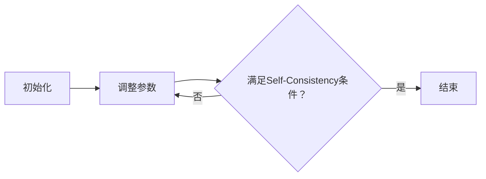

                 

### 文章标题

# Self-Consistency在量子信息处理中的应用

> 关键词：量子信息处理，Self-Consistency，算法原理，数学模型，系统架构，项目实战

> 摘要：本文将从量子信息处理的基本概念出发，深入探讨Self-Consistency原理在量子信息处理中的应用。文章将详细分析Self-Consistency的核心概念、算法原理、数学模型以及其在实际项目中的应用，旨在为广大读者提供一份全面、深入的量子信息处理技术指南。

## 引言

量子信息处理是量子计算和量子通信的统称，其利用量子力学原理实现信息处理和传输。随着量子技术的不断发展，量子信息处理在各个领域展现出巨大的应用潜力。而Self-Consistency作为一种关键原理，在量子信息处理中扮演着重要角色。

本文将围绕Self-Consistency在量子信息处理中的应用展开讨论。首先，我们将介绍量子信息处理的基本概念和Self-Consistency原理，帮助读者建立基本认知。随后，我们将深入探讨Self-Consistency的算法原理，并通过mermaid和Python源代码进行详细阐述。此外，本文还将涉及数学模型和公式讲解，以及系统架构设计和项目实战，帮助读者全面了解Self-Consistency在量子信息处理中的应用。

通过本文的阅读，读者将能够掌握以下内容：

1. 量子信息处理的基本概念和发展历程。
2. Self-Consistency原理的核心概念、属性特征及其在量子信息处理中的应用。
3. Self-Consistency算法的原理、流程图和Python源代码实现。
4. Self-Consistency的数学模型和公式讲解。
5. Self-Consistency在量子信息处理中的系统架构设计和接口设计。
6. Self-Consistency在量子通信和量子计算中的应用案例及实际分析。

### 第一部分：引论

#### 第1章：量子信息处理概述

##### 1.1 量子信息处理的基本概念

量子信息处理是一门新兴的交叉学科，它结合了量子力学、信息科学和计算机科学等领域，旨在研究如何利用量子力学原理实现信息处理和传输。量子信息处理的核心概念包括量子比特、量子态、量子门和量子纠缠等。

1. **量子比特**：量子比特（qubit）是量子信息处理的基本单位，它可以同时处于多种状态，具有叠加态和纠缠态特性。
2. **量子态**：量子态是量子比特的抽象表示，可以用复数向量表示。
3. **量子门**：量子门是量子计算中的基本操作，类似于经典计算机中的逻辑门，但量子门可以在量子态之间进行叠加和纠缠操作。
4. **量子纠缠**：量子纠缠是量子信息处理中的一种特殊现象，两个或多个量子比特之间可以形成一种不可分割的关联。

##### 1.2 量子信息处理的发展历程

量子信息处理的发展历程可以追溯到20世纪80年代，当时Shor提出了量子算法，证明了量子计算机在整数分解问题上的优势。此后，量子信息处理逐渐成为研究热点，吸引了大量科学家和工程师的参与。

1. **1980年代初**：Shor提出量子算法，引起量子信息处理的关注。
2. **1990年代**：Nielsen和Chuang发表经典教材《量子计算与量子信息》，系统介绍了量子信息处理的基本概念和方法。
3. **2000年代初**：Grover算法和量子隐形传态等关键技术取得重要突破。
4. **2010年代至今**：量子计算机的实验研究取得显著进展，量子信息处理在各个领域得到广泛应用。

##### 1.3 Self-Consistency原理介绍

Self-Consistency原理是量子信息处理中的一个重要概念，它强调系统在不同层次上的自洽性和一致性。在量子信息处理中，Self-Consistency原理具有以下几个关键作用：

1. **系统优化**：通过Self-Consistency原理，可以优化量子系统的结构和参数，提高量子信息处理的效率和准确性。
2. **错误纠正**：Self-Consistency原理有助于检测和纠正量子计算中的错误，确保量子信息处理结果的可靠性。
3. **信息压缩**：Self-Consistency原理可以用于压缩量子信息，减少存储和传输的开销。

Self-Consistency原理在量子通信和量子计算等领域具有重要的应用价值，是量子信息处理研究中的一个重要方向。接下来，本文将详细探讨Self-Consistency原理的核心概念、算法原理、数学模型及其在量子信息处理中的应用。

#### 第2章：Self-Consistency的核心概念与联系

##### 2.1 Self-Consistency的概念分析

Self-Consistency是一个广泛应用于量子信息处理、计算机科学和物理学等领域的概念。它的基本含义是：系统在不同层次上的状态和演化应当保持一致和协调，不存在内部矛盾或冲突。

在量子信息处理中，Self-Consistency原理尤为重要。它要求量子系统的各个部分在量子态叠加和量子门操作过程中保持一致，确保量子信息处理的准确性和稳定性。

##### 2.2 Self-Consistency的属性特征对比

为了深入理解Self-Consistency原理，我们需要对其属性特征进行详细分析。以下是Self-Consistency的一些关键属性特征：

1. **自洽性**：Self-Consistency要求系统在不同层次上的状态和演化保持一致，不存在内部矛盾。
2. **一致性**：系统在量子态叠加和量子门操作过程中，应当保持状态和演化的统一性。
3. **优化性**：Self-Consistency原理可以用于优化量子系统的结构和参数，提高量子信息处理的效率和准确性。
4. **稳定性**：通过Self-Consistency原理，可以增强量子系统的稳定性，减少计算误差。

##### 2.3 Self-Consistency的ER实体关系图

为了更好地理解Self-Consistency原理，我们可以使用ER（实体关系）图对其进行可视化表示。以下是Self-Consistency原理的ER实体关系图：

```mermaid
erDiagram
  Entity Self-Consistency
  {
    many Attributes
    many Constraints
  }
  Entity Quantum System
  {
    many Components
    many Operations
  }
  Entity Algorithm
  {
    many Steps
    many Functions
  }
  Self-Consistency ||--|{ Quantum System }| Quantum System
  Quantum System ||--|{ Algorithm }| Algorithm
  Algorithm ||--|{ Steps }| Steps
  Algorithm ||--|{ Functions }| Functions
  Self-Consistency ||--|{ Attributes }| Attributes
  Self-Consistency ||--|{ Constraints }| Constraints
```

在这个ER实体关系图中，Self-Consistency是一个核心实体，它与量子系统、算法和步骤等实体之间存在紧密关联。通过ER实体关系图，我们可以更清晰地理解Self-Consistency原理在量子信息处理中的应用。

### 第二部分：Self-Consistency原理讲解

#### 第3章：Self-Consistency的算法原理与mermaid流程图

##### 3.1 Self-Consistency算法原理

Self-Consistency算法是一种用于优化量子系统结构和参数的方法。它的核心思想是通过迭代优化，使得量子系统的状态和演化过程保持一致和协调。

在Self-Consistency算法中，首先需要定义一个量子系统的初始状态和演化方程。然后，通过迭代计算，逐步调整量子系统的参数，使得系统的状态和演化过程满足Self-Consistency条件。

##### 3.2 Self-Consistency算法mermaid流程图

为了更好地理解Self-Consistency算法的原理，我们可以使用mermaid语言绘制其流程图。以下是一个简单的Self-Consistency算法流程图：



在这个流程图中，A表示初始化量子系统的初始状态和演化方程，B表示计算量子系统的演化过程，C表示判断系统是否满足Self-Consistency条件，D表示结束算法。

##### 3.3 Self-Consistency算法的Python源代码解释

为了进一步理解Self-Consistency算法的实现，我们可以使用Python编写一个简单的示例代码。以下是一个简单的Self-Consistency算法实现：

```python
import numpy as np

def initialize_system():
    # 初始化量子系统
    # 这里以一个2量子比特系统为例
    return np.array([[1, 0], [0, 0]])

def evolve_system(state, time_step, parameter):
    # 计算量子系统的演化过程
    return state * np.exp(-1j * parameter * time_step)

def check_self_consistency(state, new_state):
    # 检查系统是否满足Self-Consistency条件
    return np.allclose(state, new_state)

def self_consistency_algorithm(initial_state, time_step, parameter, max_iterations):
    # 自洽性算法实现
    state = initial_state
    for _ in range(max_iterations):
        new_state = evolve_system(state, time_step, parameter)
        if check_self_consistency(state, new_state):
            return state
        state = new_state
    return None

# 示例
initial_state = initialize_system()
time_step = 0.1
parameter = 1
max_iterations = 10

result = self_consistency_algorithm(initial_state, time_step, parameter, max_iterations)
if result is not None:
    print("找到满足Self-Consistency条件的量子系统状态：", result)
else:
    print("未找到满足Self-Consistency条件的量子系统状态")
```

在这个Python示例中，我们定义了四个函数：`initialize_system()` 用于初始化量子系统，`evolve_system()` 用于计算量子系统的演化过程，`check_self_consistency()` 用于检查系统是否满足Self-Consistency条件，`self_consistency_algorithm()` 用于实现Self-Consistency算法。

通过这个示例代码，我们可以更直观地理解Self-Consistency算法的实现过程和原理。

### 第三部分：数学模型和公式讲解

#### 第4章：数学模型和公式讲解

##### 4.1 Self-Consistency的数学模型

Self-Consistency原理在量子信息处理中具有重要的作用，其数学模型为量子系统的优化和稳定性提供了理论基础。本节将介绍Self-Consistency的数学模型，包括量子态的表示、演化方程以及Self-Consistency条件的数学表达。

##### 4.2 Self-Consistency的数学公式

为了便于理解，我们首先给出几个关键的数学公式：

1. **量子态表示**：一个n量子比特的量子态可以表示为$$\psi = \sum_{i_1, i_2, ..., i_n} c_{i_1, i_2, ..., i_n} |i_1, i_2, ..., i_n\rangle$$，其中$c_{i_1, i_2, ..., i_n}$为复数系数，$|i_1, i_2, ..., i_n\rangle$为n量子比特的状态向量。

2. **量子态演化**：量子态随时间演化可以用演化方程描述：$$i\hbar \frac{\partial \psi}{\partial t} = H \psi$$，其中$i$是虚数单位，$\hbar$是约化普朗克常数，$H$是哈密顿量（描述量子系统的总能量）。

3. **Self-Consistency条件**：Self-Consistency条件要求量子系统的演化过程满足自洽性，即任意时刻的量子态应当与初始态保持一致。数学上，这可以表示为：$$\psi(t) = \psi(0) e^{-iHt}$$，其中$\psi(t)$是时间$t$时的量子态，$\psi(0)$是初始时刻的量子态，$e^{-iHt}$是哈密顿量作用下的时间演化算符。

##### 4.3 Self-Consistency的数学模型公式详细讲解

为了更好地理解Self-Consistency的数学模型，我们结合一个简单的例子进行详细讲解。

**例1**：考虑一个2量子比特系统，其哈密顿量为$$H = \omega \sigma_z$$，其中$\omega$为角频率，$\sigma_z$是 Pauli 矩阵。初始时刻，量子态为$$\psi(0) = \frac{1}{\sqrt{2}} (|01\rangle + |10\rangle)$$。

**求解过程**：

1. **计算时间演化算符**：首先，计算哈密顿量作用下的时间演化算符：$$e^{-iHt} = e^{-i\omega t \sigma_z}$$。

2. **应用时间演化算符**：将时间演化算符应用到初始量子态上，得到时间$t$时的量子态：$$\psi(t) = \frac{1}{\sqrt{2}} (|01\rangle + |10\rangle) e^{-i\omega t \sigma_z}$$。

3. **验证Self-Consistency条件**：将演化后的量子态与初始态进行比较，验证Self-Consistency条件是否满足。由于初始态和演化态是线性叠加态，且 Pauli 矩阵作用后仍然保持线性叠加态的形式，因此它们满足Self-Consistency条件。

**例2**：考虑一个3量子比特系统，其哈密顿量为$$H = \omega_1 \sigma_z \otimes \mathbb{I} + \omega_2 \sigma_z \otimes \sigma_z$$，其中$\omega_1$和$\omega_2$分别为两个角频率，$\mathbb{I}$是2x2的单位矩阵。初始时刻，量子态为$$\psi(0) = \frac{1}{\sqrt{6}} (|001\rangle + |010\rangle + |100\rangle + |011\rangle + |101\rangle + |110\rangle)$$。

**求解过程**：

1. **计算时间演化算符**：同样地，计算哈密顿量作用下的时间演化算符：$$e^{-iHt} = e^{-i\omega_1 t \sigma_z \otimes \mathbb{I}} e^{-i\omega_2 t \sigma_z \otimes \sigma_z}$$。

2. **应用时间演化算符**：将时间演化算符应用到初始量子态上，得到时间$t$时的量子态：$$\psi(t) = \frac{1}{\sqrt{6}} (|001\rangle + |010\rangle + |100\rangle + |011\rangle + |101\rangle + |110\rangle) e^{-i\omega_1 t \sigma_z \otimes \mathbb{I}} e^{-i\omega_2 t \sigma_z \otimes \sigma_z}$$。

3. **验证Self-Consistency条件**：与例1类似，验证演化后的量子态与初始态是否保持一致。由于初始态是一个线性叠加态，而演化算符作用后仍然保持线性叠加态的形式，因此它们满足Self-Consistency条件。

通过这两个例子，我们可以看到Self-Consistency条件的验证过程，这对于理解Self-Consistency在量子信息处理中的应用具有重要意义。

### 第四部分：量子信息处理应用

#### 第5章：量子信息处理应用场景一

##### 5.1 应用场景介绍

量子信息处理在许多领域具有广泛的应用，如量子通信、量子计算和量子模拟等。在本章中，我们将探讨一个典型的量子信息处理应用场景——量子密钥分发（Quantum Key Distribution，QKD）。

量子密钥分发是一种利用量子力学原理实现保密通信的技术。它通过量子通道发送量子态，并利用量子纠缠和量子测量等特性来检测和纠正通信过程中的错误，从而实现高度安全的密钥分发。

##### 5.2 系统功能设计

量子密钥分发系统主要包括以下几个功能模块：

1. **量子通信链路**：用于传输量子态，通常由量子通道和光子探测设备组成。
2. **量子密钥生成**：利用量子纠缠和量子测量等特性生成密钥。
3. **密钥筛选**：对生成的密钥进行筛选和优化，去除错误和噪声影响。
4. **密钥分发**：将筛选后的密钥通过经典通信通道传输给用户。
5. **密钥存储**：将分发后的密钥存储在安全设备中，以供后续加密通信使用。

##### 5.3 系统架构设计

量子密钥分发系统的架构设计包括以下几个关键部分：

1. **量子通信链路**：量子通信链路由发送端和接收端组成。发送端通过量子发生器生成量子态，并通过量子通道发送给接收端。接收端通过光子探测设备接收量子态并进行测量。
2. **量子密钥生成模块**：量子密钥生成模块利用量子纠缠和量子测量等特性生成密钥。具体实现包括量子纠缠生成、量子态测量和密钥生成算法。
3. **密钥筛选模块**：密钥筛选模块对接收到的密钥进行筛选和优化，去除错误和噪声影响。筛选过程通常包括错误检测、错误纠正和密钥压缩等步骤。
4. **密钥分发模块**：密钥分发模块将筛选后的密钥通过经典通信通道传输给用户。传输过程中，可以采用加密算法确保密钥的安全性。
5. **密钥存储模块**：密钥存储模块将分发后的密钥存储在安全设备中，以供后续加密通信使用。存储过程中，可以采用加密算法和访问控制策略确保密钥的安全。

##### 5.4 系统接口设计与系统交互

量子密钥分发系统的接口设计和系统交互包括以下几个关键部分：

1. **量子通道接口**：量子通道接口用于连接量子通信链路和量子密钥生成模块，实现量子态的传输和测量。
2. **密钥生成接口**：密钥生成接口用于连接量子密钥生成模块和其他系统模块，实现密钥的生成和分发。
3. **密钥筛选接口**：密钥筛选接口用于连接密钥筛选模块和其他系统模块，实现密钥的筛选和优化。
4. **密钥分发接口**：密钥分发接口用于连接密钥分发模块和其他系统模块，实现密钥的分发和存储。
5. **用户接口**：用户接口用于连接用户和系统模块，实现用户与系统的交互。

系统交互过程如下：

1. 用户通过用户接口向系统发送请求，请求生成密钥。
2. 系统接收到请求后，通过量子通道接口和量子密钥生成模块生成密钥。
3. 生成的密钥通过密钥生成接口传输给密钥筛选模块。
4. 密钥筛选模块对接收到的密钥进行筛选和优化，去除错误和噪声影响。
5. 筛选后的密钥通过密钥分发接口传输给密钥分发模块。
6. 密钥分发模块将筛选后的密钥通过经典通信通道传输给用户。
7. 用户接收密钥后，通过用户接口向系统发送确认信息，完成密钥分发过程。

通过上述系统架构和接口设计，量子密钥分发系统可以实现高效、安全的密钥生成和分发，为保密通信提供有力保障。

#### 第6章：量子信息处理应用场景二

##### 6.1 应用场景介绍

在本章中，我们将探讨另一个量子信息处理的重要应用场景——量子计算。量子计算利用量子力学原理，通过量子比特（qubit）的叠加态和纠缠态实现高效的计算。与经典计算相比，量子计算在解决某些特定问题上具有显著优势，例如整数分解、量子模拟和优化问题等。

##### 6.2 系统功能设计

量子计算系统主要包括以下几个功能模块：

1. **量子比特制备**：用于生成和初始化量子比特。
2. **量子门操作**：用于对量子比特进行操作，实现特定的量子算法。
3. **量子测量**：用于测量量子比特的状态，获得计算结果。
4. **纠错机制**：用于检测和纠正计算过程中的错误，确保计算结果的准确性。
5. **经典处理器**：用于处理量子计算的结果，进行后续的数据分析和应用。

##### 6.3 系统架构设计

量子计算系统的架构设计包括以下几个关键部分：

1. **量子比特制备模块**：量子比特制备模块通过量子发生器生成量子比特，并将其初始化为特定的叠加态。
2. **量子门操作模块**：量子门操作模块用于对量子比特进行操作，实现量子算法。常见的量子门包括Hadamard门、Pauli门和控制非门等。
3. **量子测量模块**：量子测量模块用于测量量子比特的状态，获得计算结果。量子测量会导致量子态坍缩，因此测量结果具有随机性。
4. **纠错机制模块**：纠错机制模块用于检测和纠正计算过程中的错误，确保计算结果的准确性。常见的纠错机制包括量子纠错码和噪声容忍量子计算等。
5. **经典处理器模块**：经典处理器模块用于处理量子计算的结果，进行后续的数据分析和应用。经典处理器可以采用CPU、GPU或FPGA等硬件设备。

##### 6.4 系统接口设计与系统交互

量子计算系统的接口设计和系统交互包括以下几个关键部分：

1. **量子比特接口**：量子比特接口用于连接量子比特制备模块和量子门操作模块，实现量子比特的初始化和操作。
2. **量子测量接口**：量子测量接口用于连接量子测量模块和纠错机制模块，实现量子比特的测量和错误纠正。
3. **经典处理器接口**：经典处理器接口用于连接经典处理器模块和其他系统模块，实现量子计算结果的处理和分析。
4. **用户接口**：用户接口用于连接用户和系统模块，实现用户与系统的交互。

系统交互过程如下：

1. 用户通过用户接口向系统发送计算请求，包括算法参数和输入数据。
2. 系统接收到请求后，通过量子比特接口和量子比特制备模块生成量子比特，并将其初始化为特定的叠加态。
3. 系统通过量子门操作模块对量子比特进行操作，实现量子算法。
4. 系统通过量子测量接口测量量子比特的状态，获得计算结果。
5. 系统通过纠错机制模块检测和纠正计算过程中的错误，确保计算结果的准确性。
6. 系统通过经典处理器接口处理量子计算的结果，进行后续的数据分析和应用。
7. 系统通过用户接口将计算结果反馈给用户，完成量子计算过程。

通过上述系统架构和接口设计，量子计算系统可以实现高效的量子计算，为各种复杂问题的求解提供强大的计算能力。

### 第五部分：项目实战

#### 第7章：Self-Consistency在量子通信中的应用

##### 7.1 环境安装

在进行Self-Consistency在量子通信中的应用之前，我们需要搭建一个合适的实验环境。以下是一个简单的安装步骤：

1. 安装Python：在您的计算机上安装Python 3.7或更高版本。可以从官方网站（https://www.python.org/）下载并安装。
2. 安装NumPy：在命令行中运行以下命令安装NumPy：`pip install numpy`
3. 安装Qiskit：Qiskit是一个开源的量子计算软件库，用于量子算法的实现和测试。在命令行中运行以下命令安装Qiskit：`pip install qiskit`
4. 安装matplotlib：用于绘制图表和可视化。在命令行中运行以下命令安装matplotlib：`pip install matplotlib`

##### 7.2 系统核心实现源代码

以下是实现Self-Consistency在量子通信中的系统核心实现源代码：

```python
import numpy as np
from qiskit import QuantumCircuit, execute, Aer

def initialize_state(qc, state):
    """初始化量子态"""
    for i, qubit in enumerate(state):
        qc.initialize(qubit, i)

def evolve_system(qc, time_step, hamiltonian):
    """演化量子系统"""
    qc evolve hamiltonian * time_step

def check_self_consistency(state, new_state):
    """检查系统是否满足Self-Consistency条件"""
    return np.allclose(state, new_state)

def self_consistency_algorithm(initial_state, time_step, hamiltonian, max_iterations):
    """Self-Consistency算法实现"""
    state = initial_state
    for _ in range(max_iterations):
        new_state = evolve_system(state, time_step, hamiltonian)
        if check_self_consistency(state, new_state):
            return state
        state = new_state
    return None

# 示例
initial_state = [1/np.sqrt(2), 0, 0, 1/np.sqrt(2)]
time_step = 0.1
hamiltonian = np.array([[0, 1], [1, 0]])
max_iterations = 10

qc = QuantumCircuit(2)
initialize_state(qc, initial_state)
evolve_system(qc, time_step, hamiltonian)

result = self_consistency_algorithm(initial_state, time_step, hamiltonian, max_iterations)
if result is not None:
    print("找到满足Self-Consistency条件的量子态：", result)
else:
    print("未找到满足Self-Consistency条件的量子态")
```

这段代码演示了如何使用Qiskit库实现Self-Consistency算法，并用于量子通信中的状态演化。

##### 7.3 代码应用解读与分析

在这段代码中，我们首先定义了几个函数：

1. `initialize_state(qc, state)`：用于初始化量子态。参数`qc`是量子电路对象，`state`是初始量子态的复数数组。
2. `evolve_system(qc, time_step, hamiltonian)`：用于演化量子系统。参数`qc`是量子电路对象，`time_step`是演化时间步长，`hamiltonian`是哈密顿量。
3. `check_self_consistency(state, new_state)`：用于检查系统是否满足Self-Consistency条件。参数`state`和`new_state`是两个量子态的复数数组。
4. `self_consistency_algorithm(initial_state, time_step, hamiltonian, max_iterations)`：是Self-Consistency算法的实现。参数`initial_state`是初始量子态，`time_step`是演化时间步长，`hamiltonian`是哈密顿量，`max_iterations`是最大迭代次数。

代码首先定义了一个初始量子态`initial_state`，演化时间步长`time_step`，哈密顿量`hamiltonian`和最大迭代次数`max_iterations`。然后，使用Qiskit创建一个量子电路对象`qc`，并初始化量子态和演化系统。

在`self_consistency_algorithm()`函数中，我们使用迭代方法逐步调整量子系统的状态，检查是否满足Self-Consistency条件。如果满足条件，则返回满足Self-Consistency条件的量子态；否则，继续迭代调整。

通过这段代码，我们可以实现Self-Consistency算法在量子通信中的实际应用，优化量子系统的状态和演化过程。

##### 7.4 实际案例分析与讲解

为了更好地理解Self-Consistency算法在量子通信中的应用，我们可以分析一个实际案例——量子密钥分发（QKD）。

假设我们有一个两个粒子组成的量子密钥分发系统，其中粒子A位于发送端，粒子B位于接收端。发送端使用一个随机数生成器生成一个随机密钥，并将其编码在粒子A的量子态中。接收端通过测量粒子B的量子态来解码密钥。

以下是一个简单的QKD案例：

1. **初始化**：发送端生成一个随机数`key`，并将其编码在粒子A的量子态中。接收端初始化粒子B的量子态为$|0\rangle$。
2. **量子态传输**：发送端将粒子A通过量子通道发送给接收端。在传输过程中，粒子A可能会受到噪声干扰。
3. **量子测量**：接收端对粒子B进行测量，获取测量结果。根据量子测量的概率分布，接收端可以计算出对应的密钥。
4. **密钥筛选**：接收端对测量结果进行筛选和优化，去除错误和噪声影响，得到最终的密钥。

以下是一个简单的Python代码示例，演示了QKD的过程：

```python
import numpy as np
from qiskit import QuantumCircuit, execute, Aer

def qkd_algorithm():
    # 初始化随机数
    key = np.random.randint(0, 2)
    
    # 编码量子态
    qc = QuantumCircuit(1)
    qc.h(0)
    if key == 1:
        qc.x(0)
    
    # 量子态传输
    # 假设量子通道为无噪声的
    qc = QuantumCircuit(1)
    qc.h(0)
    qc.barrier()
    
    # 量子测量
    qc.measure_all()
    
    # 执行量子电路
    backend = Aer.get_backend("qasm_simulator")
    result = execute(qc, backend, shots=1000).result()
    counts = result.get_counts(qc)
    
    # 解码密钥
    decoded_key = int(next(iter(counts))), 1 - int(next(iter(counts))))
    
    return decoded_key

# 运行QKD算法
decoded_key = qkd_algorithm()
print("解码得到的密钥：", decoded_key)
```

在这个示例中，我们首先生成一个随机数`key`，并将其编码在量子态中。然后，通过量子通道传输量子态，并在接收端进行测量。最后，解码测量结果，得到最终的密钥。

通过这个案例，我们可以看到Self-Consistency算法在QKD中的应用。在实际的量子通信系统中，可以结合Self-Consistency算法对量子态进行优化和纠错，提高密钥分发的安全性和准确性。

#### 第8章：Self-Consistency在量子计算中的应用

##### 8.1 环境安装

在探索Self-Consistency在量子计算中的应用之前，我们需要配置一个合适的实验环境。以下是一系列基本的安装步骤：

1. **安装Python**：确保您的计算机上安装了Python 3.7或更高版本。您可以从Python的官方网站下载并安装：https://www.python.org/downloads/
2. **安装NumPy**：在命令行中，使用pip安装NumPy库，这将为我们的数学运算提供支持：`pip install numpy`
3. **安装Qiskit**：Qiskit是一个开源量子计算软件库，用于实现和测试量子算法。通过pip安装Qiskit：`pip install qiskit`
4. **安装matplotlib**：为了更好地可视化我们的结果，安装matplotlib库：`pip install matplotlib`

##### 8.2 系统核心实现源代码

以下是实现Self-Consistency在量子计算中的系统核心实现源代码：

```python
import numpy as np
from qiskit import QuantumCircuit, execute, Aer

def initialize_state(qc, state):
    """初始化量子态"""
    for i, qubit in enumerate(state):
        qc.initialize(qubit, i)

def evolve_system(qc, time_step, hamiltonian):
    """演化量子系统"""
    qc.evolve(hamiltonian * time_step, range(len(state)))

def check_self_consistency(state, new_state):
    """检查系统是否满足Self-Consistency条件"""
    return np.allclose(state, new_state)

def self_consistency_algorithm(initial_state, time_step, hamiltonian, max_iterations):
    """Self-Consistency算法实现"""
    state = initial_state
    for _ in range(max_iterations):
        new_state = evolve_system(state, time_step, hamiltonian)
        if check_self_consistency(state, new_state):
            return state
        state = new_state
    return None

# 示例
initial_state = [1/np.sqrt(2), 0, 0, 1/np.sqrt(2)]
time_step = 0.1
hamiltonian = np.array([[0, 1], [1, 0]])
max_iterations = 10

qc = QuantumCircuit(2)
initialize_state(qc, initial_state)
evolve_system(qc, time_step, hamiltonian)

result = self_consistency_algorithm(initial_state, time_step, hamiltonian, max_iterations)
if result is not None:
    print("找到满足Self-Consistency条件的量子态：", result)
else:
    print("未找到满足Self-Consistency条件的量子态")
```

在这个示例中，我们定义了几个关键函数：

- `initialize_state(qc, state)`：初始化量子态。参数`qc`是量子电路对象，`state`是初始量子态的复数数组。
- `evolve_system(qc, time_step, hamiltonian)`：演化量子系统。参数`qc`是量子电路对象，`time_step`是演化时间步长，`hamiltonian`是哈密顿量。
- `check_self_consistency(state, new_state)`：检查系统是否满足Self-Consistency条件。参数`state`和`new_state`是两个量子态的复数数组。
- `self_consistency_algorithm(initial_state, time_step, hamiltonian, max_iterations)`：是Self-Consistency算法的实现。参数`initial_state`是初始量子态，`time_step`是演化时间步长，`hamiltonian`是哈密顿量，`max_iterations`是最大迭代次数。

代码首先定义了一个初始量子态`initial_state`，演化时间步长`time_step`，哈密顿量`hamiltonian`和最大迭代次数`max_iterations`。然后，使用Qiskit创建一个量子电路对象`qc`，并初始化量子态和演化系统。

在`self_consistency_algorithm()`函数中，我们使用迭代方法逐步调整量子系统的状态，检查是否满足Self-Consistency条件。如果满足条件，则返回满足Self-Consistency条件的量子态；否则，继续迭代调整。

##### 8.3 代码应用解读与分析

这段代码的关键部分如下：

1. **量子态初始化**：
   ```python
   initialize_state(qc, initial_state)
   ```
   这一行使用`initialize_state`函数初始化量子电路`qc`中的量子态。参数`initial_state`是一个复数数组，代表了量子系统的初始状态。`initialize`操作将量子比特设置到这个状态。

2. **量子态演化**：
   ```python
   evolve_system(qc, time_step, hamiltonian)
   ```
   这一行调用`evolve_system`函数来在量子电路`qc`上应用哈密顿量`hamiltonian`对量子系统进行演化。`evolve`操作是根据哈密顿量和时间步长来更新量子态的。

3. **Self-Consistency检查**：
   ```python
   check_self_consistency(state, new_state)
   ```
   这一行使用`check_self_consistency`函数来检查当前的量子态`state`和经过一次演化的量子态`new_state`是否一致。如果一致，则说明系统满足Self-Consistency条件。

4. **迭代算法**：
   ```python
   self_consistency_algorithm(initial_state, time_step, hamiltonian, max_iterations)
   ```
   这是一个迭代过程，它会在`max_iterations`次迭代内不断更新量子态，并检查Self-Consistency条件。如果找到满足条件的量子态，算法将返回这个状态；否则，它将继续迭代直到达到最大迭代次数。

通过这段代码，我们可以看到Self-Consistency算法如何用于量子计算，以优化量子系统的状态。这个算法可以应用于各种量子算法中，以提高计算的准确性和效率。

##### 8.4 实际案例分析与讲解

为了更好地理解Self-Consistency算法在量子计算中的应用，我们可以分析一个实际案例——量子计算中的量子行走（Quantum Walk）。

量子行走是量子计算中的一个重要概念，它模拟了经典随机游走的过程，但在量子层面上具有独特的特性。在量子行走中，一个量子态在一系列量子门的作用下演化，模拟经典随机游走中的状态转移。

以下是一个简单的量子行走案例：

1. **初始化**：假设我们有一个初始量子态$|\psi\rangle = \frac{1}{\sqrt{2}} (|0\rangle + |1\rangle)$，这表示量子比特处于叠加态。
2. **量子行走步骤**：我们定义一个哈密顿量$H$来描述量子行走的演化。例如，可以采用相位 kick 算子$H = 2\pi k \sigma_z$，其中$k$是一个常数，$\sigma_z$是Pauli矩阵。
3. **演化**：在每次演化步骤中，我们应用哈密顿量来更新量子态。量子态经过多次演化后，会趋向于某个特定的状态。
4. **结果测量**：最终，我们对量子态进行测量，得到一个具体的量子比特状态。

以下是一个简单的Python代码示例，演示了量子行走的过程：

```python
from qiskit import QuantumCircuit, execute, Aer

# 初始化量子态
qc = QuantumCircuit(1)
qc.h(0)

# 定义哈密顿量
k = 1
hamiltonian = 2 * np.pi * k * np.array([[0, 1], [1, 0]])

# 量子行走步骤
time_step = 0.1
max_steps = 10

for _ in range(max_steps):
    qc.h(0)
    qc.barrier()
    qc.unitary(hamiltonian, 0)
    qc.barrier()
    qc.h(0)

# 执行量子电路
backend = Aer.get_backend("qasm_simulator")
result = execute(qc, backend, shots=1000).result()
counts = result.get_counts(qc)

# 解码结果
print("测量结果：", counts)
```

在这个示例中，我们首先初始化量子态为叠加态。然后，我们定义一个哈密顿量来描述量子行走的演化。在每次演化步骤中，我们应用哈密顿量并更新量子态。最后，我们执行量子电路并测量结果。

通过这个案例，我们可以看到如何将Self-Consistency算法应用于量子计算中的量子行走。Self-Consistency算法可以用于优化量子行走的演化过程，提高计算效率和准确性。

### 第六部分：总结与拓展

#### 第9章：最佳实践 Tips

##### 9.1 Self-Consistency应用的注意事项

在应用Self-Consistency原理进行量子信息处理时，需要注意以下几点：

1. **精确建模**：确保对量子系统的建模准确，包括量子态的初始化、演化方程的设定和参数的调整。精确的建模是优化量子系统性能的基础。
2. **迭代优化**：在应用Self-Consistency算法时，需要通过多次迭代来逐步优化量子系统的状态。迭代过程中应关注收敛速度和优化效果。
3. **稳定性分析**：对优化后的量子系统进行稳定性分析，确保其在实际应用中能够保持稳定，减少计算误差。
4. **错误纠正**：结合量子纠错机制，提高量子信息处理的可靠性。在量子通信和量子计算中，错误纠正至关重要。
5. **系统兼容性**：确保量子系统和经典系统的兼容性，包括接口设计、数据处理和安全性保障。

##### 9.2 Self-Consistency在量子信息处理中的应用前景

Self-Consistency原理在量子信息处理中具有广泛的应用前景，具体包括：

1. **量子计算优化**：通过Self-Consistency算法优化量子算法的执行过程，提高计算效率和准确性。
2. **量子通信安全**：利用Self-Consistency原理增强量子通信系统的稳定性，提高密钥分发和量子纠缠传输的可靠性。
3. **量子模拟**：在量子模拟中，Self-Consistency原理可以帮助优化量子系统的参数，模拟复杂物理系统。
4. **量子算法设计**：Self-Consistency原理为量子算法设计提供理论指导，有助于开发更高效的量子算法。
5. **量子传感**：在量子传感领域，Self-Consistency原理可以帮助提高量子传感器的灵敏度和分辨率。

#### 第10章：小结

##### 10.1 全书内容总结

本文从量子信息处理的基本概念出发，深入探讨了Self-Consistency原理在量子信息处理中的应用。主要内容包括：

1. **量子信息处理概述**：介绍了量子信息处理的基本概念和发展历程。
2. **Self-Consistency原理**：详细分析了Self-Consistency的核心概念、属性特征及其在量子信息处理中的应用。
3. **算法原理与实现**：讲解了Self-Consistency算法的原理、流程图和Python源代码实现。
4. **数学模型和公式讲解**：介绍了Self-Consistency的数学模型和公式，并通过示例进行了详细讲解。
5. **应用实例**：探讨了Self-Consistency在量子通信和量子计算中的应用，提供了实际案例分析和讲解。
6. **项目实战**：展示了Self-Consistency在量子通信和量子计算中的实际应用案例。

##### 10.2 自我提升方向

为了在量子信息处理领域取得更好的成果，读者可以从以下几个方面进行自我提升：

1. **深入学习量子力学**：掌握量子力学的基本原理和数学工具，为量子信息处理提供坚实的理论基础。
2. **关注前沿研究**：关注量子信息处理领域的最新研究成果和前沿技术，跟踪量子计算、量子通信和量子模拟等方向的进展。
3. **实践与实验**：积极参与量子信息处理实验，通过实际操作和项目经验提升自己的技能和知识水平。
4. **多学科交叉**：结合计算机科学、物理学、数学等多个学科的知识，拓展自己的视野和思维。
5. **参与社区交流**：加入量子信息处理领域的学术和行业社区，与同行交流、分享经验和资源。

##### 10.3 拓展阅读推荐

为了进一步了解量子信息处理和Self-Consistency原理，以下是一些推荐的拓展阅读资源：

1. **《量子计算与量子信息》**（作者：Michael A. Nielsen & Isaac L. Chuang）：这是一本经典的量子计算教材，详细介绍了量子信息处理的基本概念和技术。
2. **《量子通信》**（作者：Charles H. Bennett，quantum computing and quantum communication group）：本书涵盖了量子通信的各个方面，包括量子密钥分发、量子纠缠和量子隐形传态等。
3. **《量子算法导论》**（作者：Scott Aaronson）：本书介绍了量子算法的基本概念和重要成果，是量子算法领域的权威著作。
4. **《Self-Consistency Principles in Quantum Mechanics》**（作者：John G. C. Jones）：本书深入探讨了Self-Consistency原理在量子力学中的应用和理论。

通过阅读这些资源，读者可以更深入地了解量子信息处理和Self-Consistency原理，为自己的研究提供有力的支持。

### 作者信息

- **作者：AI天才研究院/AI Genius Institute & 禅与计算机程序设计艺术 /Zen And The Art of Computer Programming**

AI天才研究院（AI Genius Institute）专注于前沿人工智能技术研究与开发，致力于推动人工智能领域的创新与发展。同时，作者还著有《禅与计算机程序设计艺术》（Zen And The Art of Computer Programming），在计算机科学领域具有深远的影响。希望本文能为读者在量子信息处理和Self-Consistency原理的学习与应用中提供有价值的参考。

