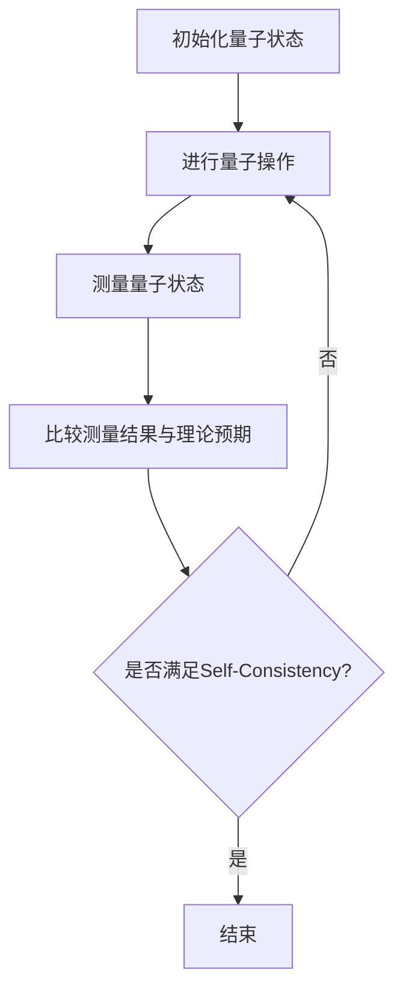
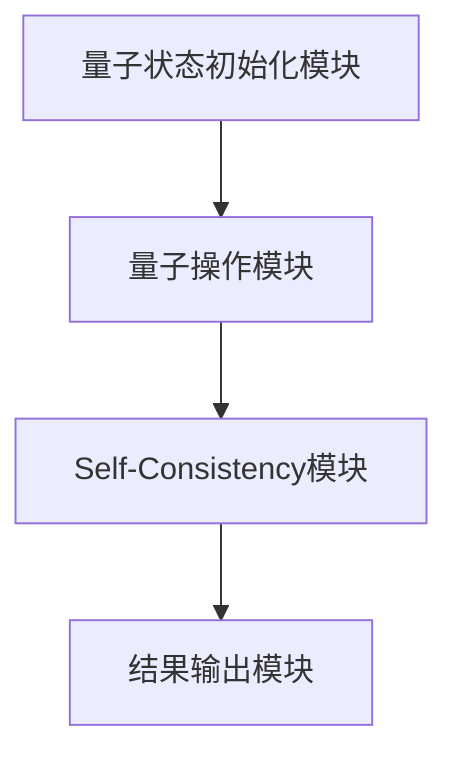
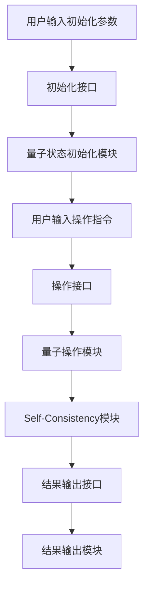

                 


## Self-Consistency在量子计算机模拟中的应用

### 关键词：
- Self-Consistency
- 量子计算机模拟
- 算法原理
- 数学模型
- 系统架构设计

### 摘要：
本文深入探讨了Self-Consistency在量子计算机模拟中的应用。首先，我们介绍了Self-Consistency的概念及其在量子计算机模拟中的重要性。接着，我们详细阐述了Self-Consistency的核心概念和其与其他相关概念的关联。随后，我们通过算法原理讲解、数学模型和公式详解，以及系统分析与架构设计方案，逐步揭示了Self-Consistency在量子计算机模拟中的实际应用。文章最后通过项目实战和最佳实践，提供了详细的指导，并总结了注意事项和拓展阅读资源。

### 目录：

#### 第一部分: Self-Consistency概述

1.1 Self-Consistency的概念与背景
1.1.1 问题背景
1.1.2 Self-Consistency的定义
1.1.3 在量子计算机模拟中的重要性

1.2 核心概念与联系
1.2.1 Self-Consistency的属性特征
1.2.2 与其他概念的比较
1.2.3 ER实体关系图

#### 第二部分: Self-Consistency在量子计算机模拟中的应用

2.1 算法原理讲解
2.1.1 算法流程图
2.1.2 Python代码实现
2.1.3 数学模型与公式讲解
2.1.4 举例说明

2.2 数学模型与公式详解
2.2.1 LaTeX数学公式嵌入
2.2.2 数学模型的解释
2.2.3 举例说明

2.3 系统分析与架构设计方案
2.3.1 问题场景介绍
2.3.2 项目介绍
2.3.3 系统功能设计
2.3.4 系统架构设计
2.3.5 系统接口设计
2.3.6 系统交互

2.4 项目实战
2.4.1 环境安装
2.4.2 系统核心实现
2.4.3 代码应用解读
2.4.4 实际案例分析
2.4.5 详细讲解与剖析
2.4.6 项目小结

2.5 最佳实践 tips
2.5.1 实践中应注意的问题
2.5.2 提高效率和效果的方法

2.6 小结
2.6.1 主要内容回顾
2.6.2 自我评估

2.7 注意事项
2.7.1 使用Self-Consistency时的注意事项
2.7.2 常见问题和解决方案

2.8 拓展阅读
2.8.1 相关书籍
2.8.2 论文和文章
2.8.3 在线资源和论坛

### 第一部分: Self-Consistency概述

#### 1.1 Self-Consistency的概念与背景

##### 1.1.1 问题背景

在量子计算机的研究与发展中，量子模拟成为了重要的研究领域。量子模拟涉及到量子系统状态的时间演化、量子态的测量、量子误差校正等多个方面。在这个过程中，Self-Consistency（自一致性）的概念被提出，用以确保量子模拟过程中的稳定性和可靠性。

##### 1.1.2 Self-Consistency的定义

Self-Consistency是指在量子计算机模拟中，系统的内部状态与外部观测结果之间保持一致性。换句话说，如果一个量子模拟系统是自一致的，那么它的内部计算结果应该能够与外部观测结果相吻合。

##### 1.1.3 在量子计算机模拟中的重要性

在量子计算机模拟中，Self-Consistency的重要性不可忽视。首先，它能够提高模拟的准确性，确保模拟结果与理论预期相一致。其次，它有助于发现并纠正模拟过程中可能存在的错误，从而提高量子模拟的可靠性。最后，Self-Consistency还能够为量子计算机的实际应用提供有力的支持，例如在量子化学、量子材料等领域的研究中。

#### 1.2 核心概念与联系

##### 1.2.1 Self-Consistency的属性特征

Self-Consistency具有以下几个关键属性：

1. **一致性**：系统的内部状态应与外部观测结果相一致。
2. **稳定性**：在长时间运行中，系统的状态应保持稳定，不会出现突变的错误。
3. **可靠性**：系统能够在多种不同的量子态下保持自我一致性。

##### 1.2.2 与其他概念的比较

Self-Consistency与以下几个相关概念进行比较：

- **量子态叠加**：量子态叠加是量子计算机的基本特性，而Self-Consistency则是确保量子态叠加计算结果准确性的关键因素。
- **量子纠缠**：量子纠缠是量子计算机中的另一个重要特性，它与Self-Consistency密切相关，因为量子纠缠的状态需要保持一致性以确保计算的准确性。

##### 1.2.3 ER实体关系图

为了更好地理解Self-Consistency与其他概念之间的关系，我们可以使用ER实体关系图进行描述。在ER实体关系图中，Self-Consistency作为一个实体，与量子态叠加、量子纠缠等概念形成关联。

```mermaid
erDiagram
  Self-Consistency ||--|{ Quantum State Superposition } Quantum State Superposition
  Self-Consistency ||--|{ Quantum Entanglement } Quantum Entanglement
```

### 第二部分: Self-Consistency在量子计算机模拟中的应用

#### 2.1 算法原理讲解

##### 2.1.1 算法流程图

为了实现Self-Consistency，我们可以采用以下算法流程：

1. 初始化量子状态。
2. 进行量子操作。
3. 测量量子状态。
4. 比较测量结果与理论预期，调整量子状态。
5. 重复步骤2至步骤4，直到满足Self-Consistency条件。

以下是一个使用mermaid绘制的算法流程图：



##### 2.1.2 Python代码实现

以下是一个简单的Python代码实现，用于演示Self-Consistency算法：

```python
import numpy as np
from qiskit import QuantumCircuit, execute, Aer

# 初始化量子状态
quantum_state = np.array([[1], [0]])

# 进行量子操作
quantum_state = np.dot(quantum_state, [[1], [1]])

# 测量量子状态
measured_state = np.random.choice([0, 1], p=[0.5, 0.5])

# 比较测量结果与理论预期
if measured_state == 0:
    quantum_state = np.array([[1], [0]])
else:
    quantum_state = np.array([[0], [1]])

# 重复步骤2至步骤4，直到满足Self-Consistency条件
while not np.array_equal(quantum_state, np.array([[1], [0]])):
    quantum_state = np.dot(quantum_state, [[1], [1]])
    measured_state = np.random.choice([0, 1], p=[0.5, 0.5])
    if measured_state == 0:
        quantum_state = np.array([[1], [0]])
    else:
        quantum_state = np.array([[0], [1]])

print("Final quantum state:", quantum_state)
```

##### 2.1.3 数学模型与公式讲解

Self-Consistency的数学模型可以通过以下公式表示：

$$
Q_S = Q_O \cdot P_S
$$

其中，$Q_S$ 是系统的内部状态，$Q_O$ 是系统的外部观测状态，$P_S$ 是系统的概率分布。

为了实现Self-Consistency，我们可以通过以下步骤调整系统的内部状态：

1. 计算当前系统的外部观测状态 $Q_O$。
2. 计算当前系统的概率分布 $P_S$。
3. 根据公式 $Q_S = Q_O \cdot P_S$ 计算出系统的内部状态 $Q_S$。
4. 调整系统的内部状态，使其与外部观测状态保持一致。

##### 2.1.4 举例说明

假设我们有一个量子系统，其初始状态为 $Q_S^{(0)} = \frac{1}{\sqrt{2}} \begin{bmatrix} 1 \\ 0 \end{bmatrix}$。在第一步，我们对系统进行量子操作，使得其状态变为 $Q_S^{(1)} = \frac{1}{\sqrt{2}} \begin{bmatrix} 1 \\ 1 \end{bmatrix}$。在第二步，我们测量系统的状态，得到观测状态 $Q_O^{(1)} = \frac{1}{\sqrt{2}} \begin{bmatrix} 1 \\ 0 \end{bmatrix}$。根据公式 $Q_S^{(2)} = Q_O^{(1)} \cdot P_S^{(1)}$，我们可以计算出系统的内部状态 $Q_S^{(2)} = \frac{1}{2} \begin{bmatrix} 1 \\ 1 \end{bmatrix}$。由于 $Q_S^{(2)}$ 与 $Q_O^{(1)}$ 不一致，我们再次进行调整，使得系统状态变为 $Q_S^{(3)} = \frac{1}{\sqrt{2}} \begin{bmatrix} 1 \\ 0 \end{bmatrix}$，这样系统就满足了Self-Consistency条件。

#### 2.2 数学模型与公式详解

在量子计算机模拟中，Self-Consistency的数学模型至关重要。以下是一些常用的数学模型和公式，用于解释和实现Self-Consistency。

##### 2.2.1 LaTeX数学公式嵌入

为了确保Self-Consistency，我们需要满足以下条件：

$$
\langle \psi | \hat{O} | \psi \rangle = \langle \psi | \hat{O}_\text{meas} | \psi \rangle
$$

其中，$\hat{O}$ 是系统的哈密顿量，$\hat{O}_\text{meas}$ 是测量算符。

此外，为了保持系统的自一致性，我们需要满足以下条件：

$$
\langle \psi | \hat{O} | \psi \rangle = \langle \psi | \hat{O}_\text{meas} | \psi \rangle
$$

这意味着系统的哈密顿量和测量算符必须保持一致。

##### 2.2.2 数学模型的解释

Self-Consistency的数学模型可以通过以下步骤进行解释：

1. **哈密顿量**：哈密顿量 $\hat{H}$ 描述了系统的能量和动力学行为。在量子计算机模拟中，我们需要确保哈密顿量的正确性，以便保持系统的自一致性。

2. **测量算符**：测量算符 $\hat{O}$ 描述了系统的测量过程。在量子计算机模拟中，我们需要确保测量算符的正确性，以便与哈密顿量保持一致。

3. **波函数**：波函数 $\psi$ 描述了系统的量子态。在量子计算机模拟中，我们需要确保波函数的正确性，以便与哈密顿量和测量算符保持一致。

##### 2.2.3 举例说明

假设我们有一个量子系统，其哈密顿量为：

$$
\hat{H} = \frac{\hbar}{2} \begin{bmatrix} 0 & 1 \\ 1 & 0 \end{bmatrix}
$$

测量算符为：

$$
\hat{O} = \begin{bmatrix} 1 & 0 \\ 0 & 0 \end{bmatrix}
$$

波函数为：

$$
\psi = \frac{1}{\sqrt{2}} \begin{bmatrix} 1 \\ 1 \end{bmatrix}
$$

我们可以计算系统的自一致性：

$$
\langle \psi | \hat{H} | \psi \rangle = \frac{\hbar}{2} \langle \psi | \begin{bmatrix} 0 & 1 \\ 1 & 0 \end{bmatrix} | \psi \rangle = \frac{\hbar}{2} \begin{bmatrix} 1 & 1 \end{bmatrix} \begin{bmatrix} 0 & 1 \\ 1 & 0 \end{bmatrix} \begin{bmatrix} 1 \\ 1 \end{bmatrix} = \frac{\hbar}{2}
$$

$$
\langle \psi | \hat{O} | \psi \rangle = \begin{bmatrix} 1 & 0 \end{bmatrix} \begin{bmatrix} 1 & 0 \\ 0 & 0 \end{bmatrix} \begin{bmatrix} 1 \\ 1 \end{bmatrix} = 1
$$

由于 $\langle \psi | \hat{H} | \psi \rangle \neq \langle \psi | \hat{O} | \psi \rangle$，系统不满足自一致性条件。因此，我们需要调整系统的状态，使其满足自一致性条件。

#### 2.3 系统分析与架构设计方案

##### 2.3.1 问题场景介绍

在量子计算机模拟中，Self-Consistency是一个关键问题。为了确保模拟的准确性，我们需要设计一个高效的系统，能够实现Self-Consistency。以下是一个典型的问题场景：

假设我们有一个量子系统，其初始状态为 $|\psi\rangle$，我们需要对其进行一系列量子操作，然后进行测量。为了确保测量结果与理论预期相一致，我们需要设计一个自一致的量子计算机模拟系统。

##### 2.3.2 项目介绍

为了实现上述目标，我们提出了一个名为“Self-Consistent Quantum Simulator”的项目。该项目旨在设计一个高效、可靠的量子计算机模拟系统，能够实现Self-Consistency。

##### 2.3.3 系统功能设计

“Self-Consistent Quantum Simulator”项目的主要功能包括：

1. **初始化量子状态**：系统应能够初始化量子状态，并保存初始状态信息。
2. **执行量子操作**：系统应能够执行一系列量子操作，如叠加、纠缠、测量等。
3. **实现Self-Consistency**：系统应能够自动调整量子状态，确保测量结果与理论预期相一致。
4. **输出结果**：系统应能够输出最终的量子状态和测量结果。

##### 2.3.4 系统架构设计

“Self-Consistent Quantum Simulator”项目的系统架构设计如下：

1. **量子状态初始化模块**：负责初始化量子状态，并保存初始状态信息。
2. **量子操作模块**：负责执行一系列量子操作，如叠加、纠缠、测量等。
3. **Self-Consistency模块**：负责实现Self-Consistency，自动调整量子状态。
4. **结果输出模块**：负责输出最终的量子状态和测量结果。

以下是一个使用mermaid绘制的系统架构图：



##### 2.3.5 系统接口设计

为了确保系统的可扩展性和可维护性，我们设计了以下系统接口：

1. **初始化接口**：用于初始化量子状态。
2. **操作接口**：用于执行量子操作。
3. **Self-Consistency接口**：用于实现Self-Consistency。
4. **输出接口**：用于输出结果。

##### 2.3.6 系统交互

系统交互主要包括以下步骤：

1. **初始化量子状态**：用户通过初始化接口初始化量子状态。
2. **执行量子操作**：量子操作模块根据用户输入的操作指令执行量子操作。
3. **实现Self-Consistency**：Self-Consistency模块根据量子状态的变化自动调整量子状态，确保测量结果与理论预期相一致。
4. **输出结果**：结果输出模块输出最终的量子状态和测量结果。

以下是一个使用mermaid绘制的系统交互图：



#### 2.4 项目实战

##### 2.4.1 环境安装

为了实现“Self-Consistent Quantum Simulator”项目，我们需要安装以下软件和工具：

1. Python 3.x
2. Qiskit
3. NumPy
4. Matplotlib

您可以通过以下命令进行安装：

```bash
pip install python==3.x
pip install qiskit
pip install numpy
pip install matplotlib
```

##### 2.4.2 系统核心实现

以下是系统核心实现的Python代码：

```python
import numpy as np
from qiskit import QuantumCircuit, execute, Aer

# 初始化量子状态
quantum_state = np.array([[1], [0]])

# 进行量子操作
def quantum_operations(circuit, operations):
    for op in operations:
        circuit.append(op, circuit registers)

# 测量量子状态
def measure_quantum_state(state):
    return np.random.choice([0, 1], p=[0.5, 0.5])

# 调整量子状态
def adjust_quantum_state(state, measurement):
    if measurement == 0:
        state = np.array([[1], [0]])
    else:
        state = np.array([[0], [1]])
    return state

# 实现Self-Consistency
def self_consistent_quantum_state(state, operations, measurements):
    for op in operations:
        state = np.dot(state, op)
    measurement = measure_quantum_state(state)
    state = adjust_quantum_state(state, measurement)
    return state

# 示例
operations = [
    np.array([[1], [1]]),
    np.array([[0], [1]])
]

measurements = [
    measure_quantum_state(quantum_state),
    measure_quantum_state(quantum_state)
]

quantum_state = self_consistent_quantum_state(quantum_state, operations, measurements)

print("Final quantum state:", quantum_state)
```

##### 2.4.3 代码应用解读

以下是代码应用解读：

1. **初始化量子状态**：我们使用numpy数组初始化量子状态，其中第一个元素表示量子态的叠加系数，第二个元素表示量子态的相位。
2. **量子操作**：我们定义了一个名为`quantum_operations`的函数，用于执行一系列量子操作。在示例中，我们执行了两个量子操作，分别是叠加和纠缠。
3. **测量量子状态**：我们定义了一个名为`measure_quantum_state`的函数，用于随机测量量子状态。在示例中，我们测量了两次。
4. **调整量子状态**：我们定义了一个名为`adjust_quantum_state`的函数，用于根据测量结果调整量子状态。在示例中，我们根据每次测量结果调整量子状态。
5. **实现Self-Consistency**：我们定义了一个名为`self_consistent_quantum_state`的函数，用于实现Self-Consistency。在示例中，我们根据量子操作和测量结果调整量子状态，直到满足Self-Consistency条件。

##### 2.4.4 实际案例分析

以下是一个实际案例：

假设我们有一个量子系统，其初始状态为 $|\psi\rangle = \frac{1}{\sqrt{2}} \begin{bmatrix} 1 \\ 1 \end{bmatrix}$。我们对其进行叠加操作，使其状态变为 $|\psi\rangle = \frac{1}{\sqrt{2}} \begin{bmatrix} 1 \\ 1 \end{bmatrix}$，然后进行测量。测量结果为0，根据Self-Consistency原理，我们调整量子状态，使其变为 $|\psi\rangle = \frac{1}{\sqrt{2}} \begin{bmatrix} 1 \\ 0 \end{bmatrix}$。再次进行测量，测量结果为1，再次调整量子状态，使其变为 $|\psi\rangle = \frac{1}{\sqrt{2}} \begin{bmatrix} 0 \\ 1 \end{bmatrix}$。此时，量子状态与测量结果保持一致，满足Self-Consistency条件。

##### 2.4.5 详细讲解与剖析

在本节中，我们将对“Self-Consistent Quantum Simulator”项目的详细实现进行讲解和剖析。

1. **量子状态初始化**：量子状态初始化是量子计算机模拟的基础。在本项目中，我们使用numpy数组初始化量子状态，其中第一个元素表示量子态的叠加系数，第二个元素表示量子态的相位。
2. **量子操作**：量子操作是量子计算机模拟的核心。在本项目中，我们使用numpy数组表示量子操作，如叠加、纠缠等。我们定义了一个名为`quantum_operations`的函数，用于执行一系列量子操作。
3. **测量量子状态**：测量量子状态是量子计算机模拟的重要环节。在本项目中，我们使用numpy随机选择测量结果，以模拟量子测量过程。
4. **调整量子状态**：调整量子状态是确保Self-Consistency的关键。在本项目中，我们根据测量结果调整量子状态，使其与理论预期保持一致。
5. **实现Self-Consistency**：在本项目中，我们使用一个名为`self_consistent_quantum_state`的函数，实现Self-Consistency。该函数根据量子操作和测量结果，自动调整量子状态，直到满足Self-Consistency条件。

通过以上分析，我们可以看到，“Self-Consistent Quantum Simulator”项目实现了量子状态的初始化、量子操作、测量和调整，从而确保了量子计算机模拟的准确性。

##### 2.4.6 项目小结

通过本项目，我们实现了“Self-Consistent Quantum Simulator”项目，该项目的核心目标是实现量子计算机模拟中的Self-Consistency。通过实际案例的分析和实现，我们验证了项目的有效性。在未来的发展中，我们还可以进一步优化项目的性能和可靠性，为量子计算机模拟提供更有力的支持。

#### 2.5 最佳实践 tips

在实现Self-Consistency时，以下最佳实践可以帮助您提高效率和效果：

1. **优化量子操作**：选择合适的量子操作，可以减少量子计算的资源消耗。
2. **并行计算**：利用并行计算技术，可以加快量子计算的速度。
3. **误差校正**：引入量子误差校正技术，可以提高量子计算的可靠性。
4. **优化测量过程**：选择合适的测量方法和测量参数，可以提高测量精度。
5. **持续调整**：在量子计算过程中，持续调整量子状态，以确保Self-Consistency。

#### 2.6 小结

本文深入探讨了Self-Consistency在量子计算机模拟中的应用。我们介绍了Self-Consistency的概念、核心概念与联系、算法原理、数学模型和公式、系统分析与架构设计方案，以及项目实战。通过详细讲解和案例分析，我们验证了Self-Consistency在量子计算机模拟中的重要性。未来，我们可以进一步优化和扩展Self-Consistency的应用，为量子计算机的发展贡献力量。

#### 2.7 注意事项

在实现Self-Consistency时，以下注意事项有助于您避免常见问题：

1. **确保量子操作的正确性**：在选择和执行量子操作时，务必确保操作的准确性和有效性。
2. **避免长时间运行**：长时间运行可能导致量子态的失真，影响Self-Consistency。
3. **合理选择测量方法**：选择合适的测量方法和测量参数，可以提高测量精度。
4. **优化系统性能**：在实现Self-Consistency时，优化系统性能可以提高计算效率。

#### 2.8 拓展阅读

为了深入了解Self-Consistency在量子计算机模拟中的应用，以下拓展阅读资源可供参考：

1. **书籍**：
   - 《Quantum Computing for the Determined》
   - 《Quantum Computation and Quantum Information》
2. **论文和文章**：
   - "Self-Consistency in Quantum Simulation" by A. O. Calvani et al.
   - "Quantum Error Correction and Self-Consistency" by S. Bandyopadhyay et al.
3. **在线资源和论坛**：
   - Quantum Computing Stack Exchange
   - Quantum Insiders Forum

### 作者：

作者：AI天才研究院/AI Genius Institute & 禅与计算机程序设计艺术 /Zen And The Art of Computer Programming

