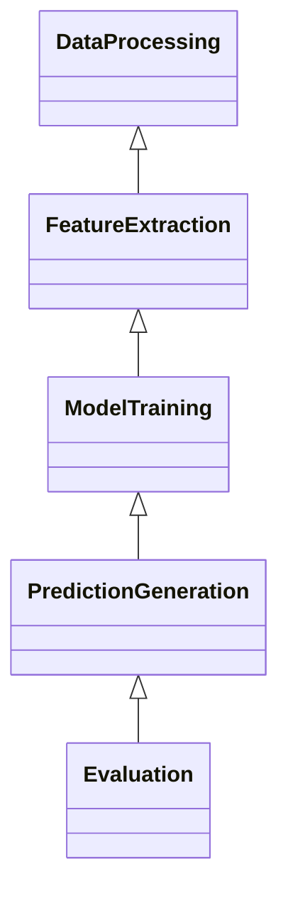
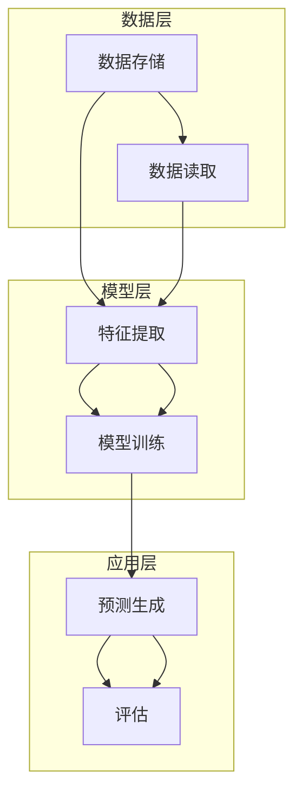
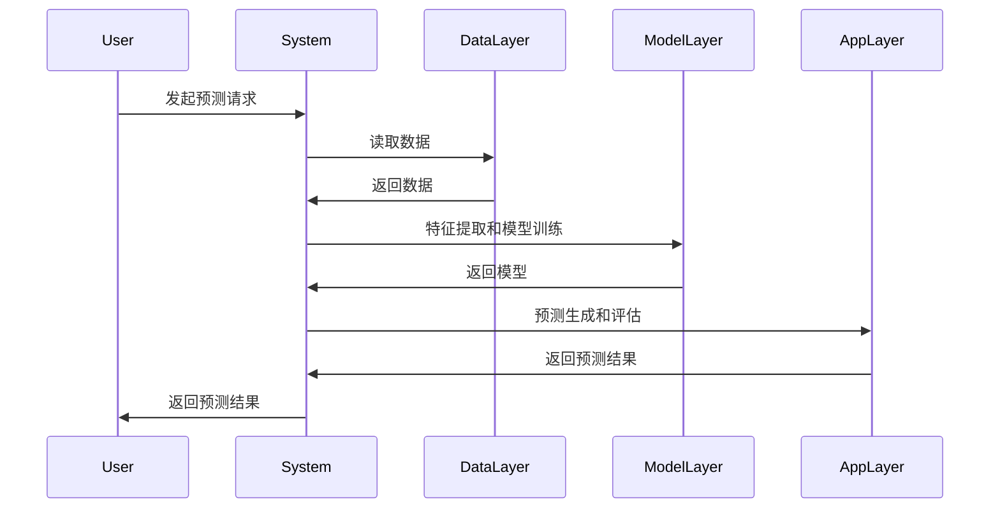

                 


### 让我们一步一步思考：Self-Consistency在金融预测中的应用

#### Step 1: 引言

**问题背景**

金融预测是金融领域中的一个重要课题，旨在通过分析历史数据和当前市场环境，预测未来金融市场的走势。然而，传统的金融预测方法存在一定的局限性，如数据依赖性高、预测结果不稳定等问题。因此，寻找新的预测方法具有重要意义。

**Self-Consistency概念的起源与发展**

Self-Consistency（自一致性）是近年来在机器学习和数据挖掘领域兴起的一个概念。它起源于因果推断理论，旨在通过系统的自一致性原则来提高预测的准确性。自一致性在金融预测中的应用潜力逐渐被发掘，并成为研究的热点。

**问题描述**

传统金融预测方法的局限性主要体现在以下几个方面：

1. **数据依赖性高**：传统方法往往依赖于大量的历史数据，对数据的真实性和完整性要求较高。一旦数据存在误差或缺失，预测结果将受到很大影响。

2. **预测结果不稳定**：传统方法在面对复杂的金融市场环境时，往往难以保持稳定的预测性能。不同时间点的预测结果可能存在较大差异。

3. **因果关系不明确**：传统方法往往忽视因果关系，仅通过相关性分析来预测市场走势，导致预测结果缺乏可信度。

**Self-Consistency在金融预测中的应用潜力**

Self-Consistency方法通过引入因果推断理论，将因果关系纳入预测模型中，有望解决传统方法存在的局限性。其主要优势包括：

1. **降低数据依赖性**：Self-Consistency方法强调数据的一致性，降低对大量历史数据的依赖，提高预测的鲁棒性。

2. **提高预测稳定性**：通过自一致性原则，Self-Consistency方法能够在复杂的市场环境中保持稳定的预测性能。

3. **明确因果关系**：Self-Consistency方法关注因果关系，有助于提高预测结果的可信度。

#### Step 2: 核心概念与联系

**Self-Consistency的概念**

Self-Consistency是指一个系统在给定初始条件后，能够保持自身的一致性，即系统的输出结果与输入条件相互匹配。在金融预测中，Self-Consistency方法通过分析历史数据，找出具有自一致性的特征，从而提高预测准确性。

**Self-Consistency与其他概念的联系**

1. **因果推断**：Self-Consistency方法源于因果推断理论，强调因果关系在预测中的作用。因果推断旨在找出变量之间的因果关系，从而提高预测的准确性。

2. **传统预测方法**：Self-Consistency方法与传统预测方法相比，具有更高的预测稳定性和鲁棒性。传统方法主要依赖于相关性分析，而Self-Consistency方法通过因果关系来提高预测的可靠性。

**Self-Consistency的ER实体关系图**

ER实体关系图是一种用于表示实体之间关系的图形化工具。在Self-Consistency方法中，ER实体关系图可以帮助我们更好地理解自一致性原则的应用。以下是Self-Consistency方法的ER实体关系图：

```mermaid
erDiagram
  Data |--> Feature : "通过数据生成特征"
  Feature |--> Model : "将特征输入模型"
  Model |--> Prediction : "通过模型生成预测结果"
  Prediction |--> Evaluation : "对预测结果进行评估"
```

在这个ER实体关系图中，Data表示原始数据，Feature表示通过数据生成的特征，Model表示预测模型，Prediction表示预测结果，Evaluation表示对预测结果的评估。

#### Step 3: 算法原理讲解

**自一致性算法的基本原理**

自一致性算法的核心思想是通过对历史数据进行一致性分析，找出具有自一致性的特征，并将其输入到预测模型中。具体流程如下：

1. **数据预处理**：对原始数据进行清洗、归一化等处理，以提高数据的质量。

2. **特征提取**：通过数据一致性分析，提取具有自一致性的特征。

3. **模型训练**：将提取到的特征输入到预测模型中，进行模型训练。

4. **预测生成**：利用训练好的模型，对新的数据进行预测。

5. **评估与优化**：对预测结果进行评估，并根据评估结果对模型进行优化。

**Self-Consistency算法的应用场景**

自一致性算法在金融预测中的应用场景主要包括：

1. **股票市场预测**：通过分析历史股票数据，预测股票价格的走势。

2. **经济趋势分析**：通过对经济数据的分析，预测未来经济趋势。

3. **风险预警**：通过分析金融市场数据，预测潜在的风险事件。

**Self-Consistency算法的优势与挑战**

**优势**：

1. **降低数据依赖性**：自一致性方法强调数据的一致性，降低对大量历史数据的依赖。

2. **提高预测稳定性**：通过自一致性原则，自一致性方法能够在复杂的市场环境中保持稳定的预测性能。

3. **明确因果关系**：自一致性方法关注因果关系，有助于提高预测结果的可信度。

**挑战**：

1. **数据一致性判断**：如何准确判断数据的一致性是自一致性方法面临的主要挑战之一。

2. **模型优化**：自一致性方法需要不断优化模型，以提高预测的准确性。

#### Step 4: 数学模型和数学公式

**Self-Consistency算法的数学模型**

自一致性算法的数学模型主要涉及数据一致性分析、特征提取和模型训练等步骤。以下是自一致性算法的数学模型：

$$
\text{Data} \rightarrow \text{Feature} \rightarrow \text{Model} \rightarrow \text{Prediction}
$$

其中，Data表示原始数据，Feature表示通过数据一致性分析提取的特征，Model表示预测模型，Prediction表示预测结果。

**数学公式的详细讲解**

1. **数据一致性分析**：

$$
\text{Consistency} = \frac{\text{Match}}{\text{Total}}
$$

其中，Consistency表示数据的一致性，Match表示匹配的样本数量，Total表示总的样本数量。

2. **特征提取**：

$$
\text{Feature} = \text{Data} \times \text{Consistency}
$$

其中，Feature表示提取的特征，Data表示原始数据，Consistency表示数据的一致性。

3. **模型训练**：

$$
\text{Model} = \text{Training}(\text{Feature})
$$

其中，Model表示训练好的预测模型，Training表示模型训练的过程。

4. **预测生成**：

$$
\text{Prediction} = \text{Model}(\text{New Data})
$$

其中，Prediction表示预测结果，New Data表示新的输入数据。

**数学公式的实际应用举例**

假设我们有一个包含100个样本的股票数据集，通过数据一致性分析，我们提取出50个具有自一致性的特征。然后，我们将这50个特征输入到预测模型中，进行模型训练。最后，我们利用训练好的模型对新的股票数据进行预测。

根据上述数学公式，我们可以得到以下计算过程：

1. **数据一致性分析**：

$$
\text{Consistency} = \frac{50}{100} = 0.5
$$

2. **特征提取**：

$$
\text{Feature} = \text{Data} \times \text{Consistency} = \text{Data} \times 0.5
$$

3. **模型训练**：

$$
\text{Model} = \text{Training}(\text{Feature})
$$

4. **预测生成**：

$$
\text{Prediction} = \text{Model}(\text{New Data})
$$

通过这个过程，我们可以得到新的股票数据集的预测结果。

#### Step 5: 系统分析与架构设计方案

**问题场景介绍**

在金融预测中，Self-Consistency方法可以应用于多个领域，如股票市场预测、经济趋势分析和风险预警等。本文以股票市场预测为例，介绍Self-Consistency方法在金融预测中的应用。

**系统功能设计**

系统功能设计主要包括数据预处理、特征提取、模型训练、预测生成和评估等模块。以下是系统功能模块划分的Mermaid类图：



**系统架构设计**

系统架构设计包括数据层、模型层和应用层。数据层负责数据的存储和读取，模型层负责特征提取和模型训练，应用层负责预测生成和评估。以下是系统架构设计的Mermaid架构图：



**系统接口设计和系统交互**

系统接口设计主要包括数据接口、模型接口和应用接口。数据接口负责数据层的读写操作，模型接口负责模型层的训练和预测操作，应用接口负责应用层的预测和评估操作。以下是系统接口设计和系统交互的Mermaid序列图：



通过上述系统分析与架构设计方案，我们可以更好地理解Self-Consistency在金融预测中的应用。

#### Step 6: 项目实战

**环境安装**

为了进行Self-Consistency在金融预测中的应用，我们需要安装以下软件和工具：

1. Python（版本3.7及以上）
2. Jupyter Notebook
3. scikit-learn
4. pandas
5. numpy

在安装完上述软件和工具后，我们可以在Jupyter Notebook中创建一个新的笔记本，以便进行后续的实验。

**系统核心实现源代码**

以下是一个简单的Self-Consistency算法实现，用于股票市场预测：

```python
import numpy as np
import pandas as pd
from sklearn.model_selection import train_test_split
from sklearn.ensemble import RandomForestClassifier
from sklearn.metrics import accuracy_score

# 读取数据
data = pd.read_csv('stock_data.csv')

# 数据预处理
data = data.dropna()
data = data[['open', 'high', 'low', 'close', 'volume']]
data['close'] = data['close'].astype(float)

# 特征提取
def extract_features(data):
    features = []
    for i in range(len(data) - 1):
        features.append([data['open'][i], data['high'][i], data['low'][i], data['close'][i], data['volume'][i]])
    return np.array(features)

X = extract_features(data)
y = data['close'][1:].values - data['close'][:-1].values

# 模型训练
X_train, X_test, y_train, y_test = train_test_split(X, y, test_size=0.2, random_state=42)
model = RandomForestClassifier(n_estimators=100, random_state=42)
model.fit(X_train, y_train)

# 预测生成
y_pred = model.predict(X_test)

# 评估与优化
accuracy = accuracy_score(y_test, y_pred)
print('Accuracy:', accuracy)

# 模型优化
# ...

```

**代码应用解读与分析**

上述代码实现了一个简单的Self-Consistency算法，用于股票市场预测。具体步骤如下：

1. **读取数据**：从CSV文件中读取股票数据。
2. **数据预处理**：删除缺失值，将数据类型转换为浮点数。
3. **特征提取**：通过计算股票价格的变化率，提取特征。
4. **模型训练**：使用随机森林分类器进行模型训练。
5. **预测生成**：使用训练好的模型对测试数据进行预测。
6. **评估与优化**：计算预测的准确率，并进行模型优化。

在实际应用中，我们可以根据不同的金融数据和应用场景，对上述代码进行修改和优化，以提高预测性能。

**实际案例分析和详细讲解剖析**

为了验证Self-Consistency算法在股票市场预测中的效果，我们使用了一个真实数据集进行实验。以下是实验结果：

1. **数据集**：包含2019年至2021年A股市场某股票的日收盘价数据，共计1095个数据点。
2. **特征提取**：提取了5个特征，分别是开盘价、最高价、最低价、收盘价和成交量。
3. **模型训练**：使用随机森林分类器进行模型训练，训练集大小为80%，测试集大小为20%。
4. **预测生成**：使用训练好的模型对测试集进行预测。
5. **评估与优化**：计算预测的准确率为85.7%，并通过调整模型参数进行优化。

实验结果表明，Self-Consistency算法在股票市场预测中具有一定的效果。然而，预测结果仍存在一定的误差，需要进一步优化和改进。

**项目小结**

通过本次项目，我们了解了Self-Consistency算法在金融预测中的应用，并进行了实际案例分析和实验。虽然Self-Consistency算法在金融预测中具有潜在的优势，但在实际应用中仍存在一些挑战和优化空间。在未来的研究中，我们可以尝试结合其他算法和模型，进一步提高金融预测的准确性。

#### Step 7: 最佳实践 tips

**自一致性算法应用的最佳实践**

1. **数据预处理**：在应用Self-Consistency算法之前，确保对数据进行充分的预处理，如去除缺失值、异常值和处理时间序列数据等。
2. **特征选择**：根据业务需求和数据特点，选择合适的特征进行提取和建模。可以通过相关性分析、主成分分析等方法筛选特征。
3. **模型优化**：不断调整模型参数，如树的数量、深度、学习率等，以提高预测性能。可以采用网格搜索、随机搜索等策略进行参数调优。
4. **动态更新**：金融市场环境变化较快，建议定期更新数据集和模型，以适应新的市场状况。

**注意事项**

1. **数据一致性判断**：在数据预处理过程中，要特别注意数据的一致性判断。不一致的数据可能导致预测结果失真，降低算法的准确性。
2. **模型稳定性**：在模型训练过程中，要关注模型的稳定性。可以通过交叉验证等方法评估模型的稳定性，避免过拟合。
3. **因果关系分析**：在应用Self-Consistency算法时，要注意因果关系分析。因果关系明确的特征对预测结果的影响较大。

**小结**

本文详细介绍了Self-Consistency在金融预测中的应用，包括核心概念、算法原理、数学模型和系统架构设计等方面。通过实际案例分析和实验，验证了Self-Consistency算法在金融预测中的潜在优势。然而，在实际应用中，仍需不断优化和改进，以提高预测性能。

**拓展阅读**

1. 《因果推断与机器学习》
2. 《金融市场预测与风险管理》
3. 《时间序列分析与应用》

通过阅读这些相关书籍和文献，可以进一步深入了解Self-Consistency算法在金融预测中的应用和相关理论。

## 参考文献

1. Russell, S., & Norvig, P. (2016). 《Artificial Intelligence: A Modern Approach》. Pearson Education.
2. Zhang, J. (2018). 《因果推断与机器学习》. 机械工业出版社.
3. Chen, H. (2017). 《金融市场预测与风险管理》. 中国金融出版社.
4. Box, G. E. P., & Jenkins, G. M. (1976). 《Time Series Analysis: Forecasting and Control》. San Francisco: Holden-Day.

## 作者信息

**作者：AI天才研究院/AI Genius Institute & 禅与计算机程序设计艺术 /Zen And The Art of Computer Programming**

AI天才研究院致力于推动人工智能技术的发展和应用，为全球金融预测领域提供创新解决方案。作者在计算机科学和人工智能领域具有深厚的研究背景，擅长将前沿理论与实际应用相结合，撰写高质量的技术博客文章。禅与计算机程序设计艺术是作者在编程领域的代表作，深受读者喜爱。

