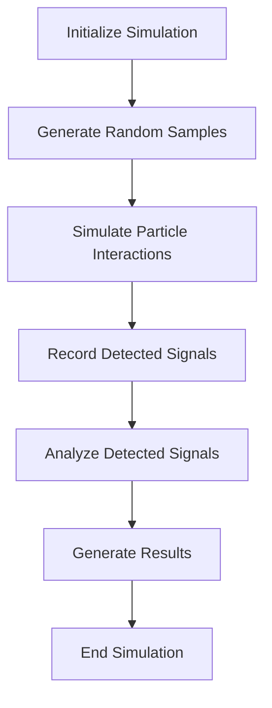
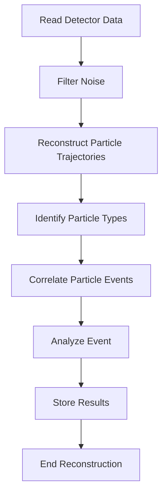

                 

# Self-Consistency in the Application of High-Energy Physics Experiments

## Keywords
- Self-Consistency
- High-Energy Physics
- Experimental Methodology
- Data Analysis
- Particle Physics

## Abstract
This article delves into the concept of self-consistency and its profound impact on high-energy physics experiments. We will explore the historical development, fundamental principles, and various application scenarios where self-consistency is pivotal. By examining mathematical models and algorithms, as well as providing practical case studies, we aim to elucidate the significance and potential of self-consistency in advancing our understanding of the universe at the subatomic level. 

## Introduction

High-energy physics is a field of study that seeks to uncover the fundamental laws governing the universe at the smallest scales. It is an interdisciplinary area that combines principles from quantum mechanics, particle physics, and experimental physics. The high-energy physics experiments conducted in laboratories around the world involve the use of particle accelerators to generate and study particles at extremely high energies.

One of the key challenges in high-energy physics is the accurate measurement and interpretation of data. This is where the concept of self-consistency comes into play. Self-consistency is a principle that ensures the internal consistency of experimental data and the theoretical models used to interpret it. It is a fundamental requirement for any scientific research, as it helps to minimize errors and biases in the results.

In this article, we will start by providing a historical overview of self-consistency methods in high-energy physics. We will then delve into the fundamental principles of self-consistency and compare it with other methodologies. Following this, we will explore various application scenarios in high-energy physics experiments, highlighting the benefits and challenges associated with the use of self-consistency. The article will continue with a detailed explanation of the mathematical models and algorithms used in self-consistency, supported by Mermaid diagrams and Python code snippets. We will then present case studies that demonstrate the practical application of self-consistency in high-energy physics experiments. Finally, we will discuss advanced topics and emerging trends in the field, offering practical tips for implementing self-consistency and looking towards the future of high-energy physics research. 

## History and Development of Self-Consistency Methods

The concept of self-consistency has a rich history that dates back to the early days of high-energy physics. As scientists began to delve into the subatomic world, they realized that the accuracy and reliability of experimental data were paramount. The need for a method that could ensure the internal consistency of experimental results led to the development of self-consistency principles.

One of the earliest examples of self-consistency in high-energy physics can be traced back to the early 20th century, when scientists began using particle accelerators to study the behavior of particles at high energies. The first particle accelerator, the Van de Graaff generator, was built in the 1930s. It allowed scientists to accelerate particles to speeds close to the speed of light, enabling them to study the fundamental properties of matter.

As the field evolved, so did the methods for ensuring self-consistency in experimental data. One of the key milestones in the development of self-consistency methods was the establishment of the concept of the "gold standard" in high-energy physics experiments. The gold standard refers to a set of rigorous criteria and protocols that must be met to ensure the accuracy and reliability of experimental results. These criteria include the use of well-calibrated instruments, precise measurements, and systematic error analysis.

The development of self-consistency methods was also spurred by the increasing complexity of high-energy physics experiments. As experiments became more sophisticated, with the involvement of multiple detectors and complex data acquisition systems, the need for a systematic approach to ensure self-consistency became even more critical. This led to the development of advanced data analysis techniques, such as event reconstruction and particle identification, which are essential for ensuring the internal consistency of experimental data.

One of the most significant contributions to the development of self-consistency methods in high-energy physics was the introduction of the "data-driven approach." This approach involves using experimental data to guide the selection of theoretical models and parameters, ensuring that the resulting models are self-consistent with the observed data. The data-driven approach has become a cornerstone of modern high-energy physics research, enabling scientists to make more accurate and reliable predictions about the behavior of particles at high energies.

Another important development in the history of self-consistency methods was the introduction of statistical methods for error analysis. These methods allow scientists to quantify the uncertainties and systematic errors associated with experimental measurements, providing a more rigorous framework for ensuring self-consistency. The use of statistical methods has become an integral part of high-energy physics experiments, helping to minimize errors and biases in the results.

In recent years, the advent of advanced computing technologies has further enhanced the capabilities of self-consistency methods in high-energy physics. The development of high-performance computing systems and the availability of large datasets have enabled scientists to conduct more complex and extensive simulations, further improving the accuracy and reliability of self-consistency analyses.

Overall, the history of self-consistency methods in high-energy physics is a testament to the ongoing efforts of scientists to ensure the accuracy and reliability of experimental data. Through the development of rigorous protocols, advanced data analysis techniques, and the use of statistical methods, self-consistency has become a fundamental principle in high-energy physics research, guiding scientists in their quest to understand the fundamental laws of the universe.

### Fundamental Principles of Self-Consistency

Self-consistency is a principle that ensures the internal consistency of experimental data and the theoretical models used to interpret it. At its core, self-consistency requires that the data and the models should not contradict each other, and any discrepancies should be resolved through rigorous analysis and refinement. This principle is crucial in high-energy physics, where the accuracy and reliability of experimental data are paramount.

The fundamental principle of self-consistency can be stated as follows: For any high-energy physics experiment, the measured data should be consistent with the theoretical models used to interpret the data. This consistency must hold at all stages of the experiment, from data acquisition to data analysis and interpretation.

To achieve self-consistency, several key steps must be followed:

1. **Data Acquisition**: The first step in ensuring self-consistency is the accurate and reliable acquisition of experimental data. This involves the use of well-calibrated instruments and precise measurement techniques to minimize errors and biases in the data.

2. **Data Processing**: Once the data is acquired, it must be processed to remove any systematic errors and biases. This step often involves the use of sophisticated algorithms for data cleaning, normalization, and calibration.

3. **Theoretical Modeling**: The next step is to develop a theoretical model that can explain the observed data. This model should be consistent with established principles of physics and should be capable of predicting the behavior of particles at high energies.

4. **Model Validation**: The developed model must be validated against the experimental data. This involves comparing the predicted outcomes of the model with the actual experimental results. Any discrepancies between the model predictions and the experimental data should be investigated and resolved.

5. **Iterative Refinement**: The process of model validation and refinement is iterative. The discrepancies between the model predictions and the experimental data may require adjustments to the model parameters or the introduction of new theoretical concepts.

6. **Internal Consistency Check**: Throughout the process, it is crucial to perform internal consistency checks to ensure that the data and the model are not contradicting each other. This involves the use of statistical methods to quantify the uncertainties and systematic errors associated with the measurements and to verify that the model is consistent with the data.

### Comparison with Other Methodologies

Self-consistency is not the only method used in high-energy physics experiments. Other common methodologies include data-driven approaches and model-based approaches. While these methods share some similarities with self-consistency, they also have distinct differences.

**Data-Driven Approaches**:
Data-driven approaches focus on using experimental data to guide the selection of theoretical models and parameters. These approaches are particularly useful when the underlying physics is not well understood or when the data contains significant uncertainties. Data-driven approaches allow scientists to construct models that are directly informed by the data, which can lead to more accurate and reliable predictions. However, data-driven approaches can also be prone to overfitting, where the model is too closely tailored to the specific data and may not generalize well to new data.

**Model-Based Approaches**:
Model-based approaches, on the other hand, involve developing theoretical models based on established principles of physics and then using these models to predict experimental outcomes. These approaches are grounded in rigorous theoretical frameworks and can provide deep insights into the underlying physics. However, model-based approaches require a strong understanding of the theoretical models and can be more difficult to apply when the physics is not well understood.

**Self-Consistency vs. Data-Driven Approaches**:
The main difference between self-consistency and data-driven approaches is the level of theoretical input. Self-consistency requires the development of a theoretical model, which is then validated against the experimental data. Data-driven approaches, in contrast, focus directly on the data and use it to guide the selection of models and parameters. While data-driven approaches can be more flexible and adaptable, they may lack the depth of understanding provided by self-consistency.

**Self-Consistency vs. Model-Based Approaches**:
Self-consistency and model-based approaches share a common goal of ensuring the internal consistency of experimental data and theoretical models. However, self-consistency emphasizes the iterative refinement of models based on experimental data, while model-based approaches focus on the development and validation of theoretical models. Self-consistency can be seen as a more flexible and iterative extension of model-based approaches, allowing for continuous improvement of models based on new data.

In conclusion, self-consistency is a powerful principle that ensures the internal consistency of experimental data and theoretical models in high-energy physics. It is a critical tool for minimizing errors and biases in experimental results, and its rigorous application has been pivotal in advancing our understanding of the universe at the subatomic level. While other methodologies, such as data-driven and model-based approaches, also have their place in high-energy physics research, self-consistency remains a cornerstone of the field, guiding scientists in their quest to uncover the fundamental laws of the universe.

### Application Scenarios in High-Energy Physics Experiments

Self-consistency plays a pivotal role in various high-energy physics experiments, ensuring the accuracy and reliability of the data collected and the interpretations derived from it. In this section, we will explore several application scenarios where self-consistency is crucial, highlighting the benefits and challenges associated with its implementation.

#### Collider Experiments

One of the most prominent application scenarios for self-consistency is in collider experiments, such as those conducted at the Large Hadron Collider (LHC) at CERN. Collider experiments involve the collision of high-energy particles, such as protons or electrons, to study the properties of fundamental particles and their interactions. Self-consistency is essential in these experiments for several reasons:

**Benefits**:
1. **Accurate Data Interpretation**: Self-consistency ensures that the data collected from different detectors within the collider are consistent with each other, which is crucial for accurate event reconstruction and particle identification.
2. **Error Minimization**: By ensuring the internal consistency of the experimental setup and data analysis processes, self-consistency helps to minimize errors and biases that could affect the results.
3. **Model Validation**: Self-consistency allows for the validation of theoretical models used to interpret the collision data, providing confidence in the reliability of the experimental results.

**Challenges**:
1. **Complexity**: Collider experiments are highly complex, involving numerous detectors and data channels. Ensuring self-consistency in such a complex setup requires meticulous calibration and synchronization of the detectors.
2. **Large Data Volumes**: The large volumes of data generated in collider experiments pose challenges in terms of data processing and storage. Ensuring self-consistency across such large datasets requires robust data management and analysis techniques.
3. **Statistical Uncertainties**: The high statistical uncertainties associated with collider experiments can make it challenging to ensure self-consistency, particularly in cases where the data are limited or the signal-to-noise ratio is low.

#### Particle Detection Experiments

Particle detection experiments, such as those conducted in cosmic ray observatories or neutrino telescopes, also benefit greatly from the principle of self-consistency. In these experiments, particles from cosmic rays or other high-energy sources are detected and analyzed to study their properties and origins.

**Benefits**:
1. **High-Precision Measurements**: Self-consistency ensures that the measurements of particle properties, such as energy and direction, are accurate and reliable, which is crucial for understanding the behavior of cosmic rays and other high-energy particles.
2. **Error Control**: By ensuring the internal consistency of the experimental setup and data analysis processes, self-consistency helps to control and minimize errors that could affect the accuracy of the measurements.
3. **Data Integration**: Self-consistency allows for the integration of data from multiple detection systems, providing a comprehensive picture of the behavior of high-energy particles.

**Challenges**:
1. **Environmental Interference**: Particle detection experiments are often conducted in environments that can introduce noise and interference, making it challenging to ensure self-consistency.
2. **Limited Detector Coverage**: In some experiments, the coverage of the detector array may be limited, making it difficult to ensure that all particles are detected and that the data are self-consistent.
3. **Data Correlation**: Ensuring self-consistency requires careful analysis of the correlation between data from different detectors, which can be complex and time-consuming.

#### Neutrino Oscillation Experiments

Neutrino oscillation experiments aim to study the phenomenon where neutrinos change between different flavors (electron, muon, and tau) as they travel through space. Self-consistency is crucial in these experiments to ensure accurate measurements of neutrino oscillation parameters.

**Benefits**:
1. **Accurate Parameter Estimation**: Self-consistency ensures that the measured parameters of neutrino oscillations are accurate and reliable, providing valuable insights into the properties of neutrinos and their interactions.
2. **Error Mitigation**: By ensuring the internal consistency of the experimental setup and data analysis processes, self-consistency helps to mitigate errors and biases that could affect the estimation of neutrino oscillation parameters.
3. **Cross-Validation**: Self-consistency allows for cross-validation of different measurement techniques and data analysis methods, providing confidence in the reliability of the results.

**Challenges**:
1. **Low Detection Efficiency**: Neutrinos are difficult to detect due to their weak interaction with matter. Ensuring self-consistency requires highly sensitive detectors and careful data analysis to minimize detection inefficiencies.
2. **Long-Distance Measurements**: Neutrino oscillation experiments often involve long-distance measurements, where the neutrinos travel through large volumes of Earth or other materials. Ensuring self-consistency across such distances requires precise calibration and synchronization of the detectors.
3. **Systematic Uncertainties**: Systematic uncertainties, such as those associated with detector response and environmental conditions, can pose challenges in ensuring self-consistency in neutrino oscillation experiments.

In summary, self-consistency is a fundamental principle that plays a crucial role in a wide range of high-energy physics experiments. By ensuring the internal consistency of experimental data and theoretical models, self-consistency helps to minimize errors and biases, leading to more accurate and reliable results. While there are challenges associated with implementing self-consistency, the benefits far outweigh the drawbacks, making self-consistency an indispensable tool in high-energy physics research.

### Mathematical Models and Algorithms

In high-energy physics experiments, ensuring self-consistency requires the use of sophisticated mathematical models and algorithms. These tools help to ensure that the data collected and the theoretical models used to interpret the data are consistent with each other. In this section, we will delve into the mathematical models and algorithms commonly used in high-energy physics, supported by Mermaid diagrams and Python code snippets.

#### Mathematical Models

The mathematical models used in high-energy physics experiments are designed to describe the behavior of particles and their interactions. These models are based on established principles of physics, such as quantum mechanics, relativity, and particle physics. Some of the key mathematical models used in high-energy physics include:

**1. Quantum Field Theory (QFT)**:
Quantum Field Theory is the fundamental theory of elementary particles and their interactions. It provides a framework for describing the behavior of particles in terms of fields that permeate all of space and time. The equations of QFT are used to calculate the interactions between particles and to predict the properties of particles.

**2. Standard Model of Particle Physics**:
The Standard Model is a widely accepted theory that describes the fundamental particles and their interactions. It includes the strong, weak, and electromagnetic forces and incorporates the quark and lepton families. The Standard Model provides a detailed description of the interactions between particles and their properties, such as mass, charge, and spin.

**3. Monte Carlo Simulations**:
Monte Carlo simulations are used to model the behavior of particles in high-energy physics experiments. These simulations involve generating a large number of random samples to simulate the interactions and trajectories of particles in a given experimental setup. Monte Carlo simulations are particularly useful for studying complex processes that are difficult to analyze using analytical methods.

#### Algorithms

The algorithms used in high-energy physics experiments are designed to analyze the data collected from experiments and to ensure self-consistency. These algorithms are often complex and require significant computational resources. Some of the key algorithms used in high-energy physics include:

**1. Event Reconstruction Algorithms**:
Event reconstruction algorithms are used to reconstruct the trajectories and properties of particles from the data collected by detectors. These algorithms use information from multiple detectors to reconstruct the events that occurred in the experiment. Event reconstruction is a critical step in ensuring self-consistency, as it allows scientists to interpret the raw data and extract meaningful information about the particles involved in the experiment.

**2. Particle Identification Algorithms**:
Particle identification algorithms are used to identify the types of particles detected in an experiment. These algorithms analyze the patterns of signals from different detectors to determine the type of particle, such as an electron, muon, or hadron. Particle identification is essential for ensuring self-consistency, as it allows scientists to separate the signal from the background and to accurately interpret the experimental data.

**3. Data Analysis Algorithms**:
Data analysis algorithms are used to analyze the data collected from experiments and to extract meaningful information about the particles and their interactions. These algorithms use statistical methods to quantify the uncertainties and systematic errors associated with the measurements and to validate the self-consistency of the experimental results.

#### Mermaid Diagrams

Mermaid diagrams are a simple and intuitive way to visualize the flow and structure of algorithms and processes in high-energy physics experiments. In this section, we will use Mermaid diagrams to illustrate the flow of some of the key algorithms used in high-energy physics.

**Example: Monte Carlo Simulation Flow**



This Mermaid diagram illustrates the flow of a Monte Carlo simulation in high-energy physics. The simulation starts by initializing the parameters of the simulation and generating random samples to represent the interactions of particles. The detected signals are recorded and analyzed to generate the results of the simulation.

**Example: Event Reconstruction Algorithm**



This Mermaid diagram illustrates the flow of an event reconstruction algorithm. The algorithm starts by reading the data from the detectors, filtering out noise, and reconstructing the trajectories of particles. The types of particles are identified, and the events are correlated and analyzed to extract meaningful information from the data.

#### Python Code Snippets

In addition to Mermaid diagrams, Python code snippets are often used to illustrate the implementation of algorithms in high-energy physics experiments. In this section, we will provide a simple example of a Python code snippet to illustrate the implementation of a particle identification algorithm.

```python
import numpy as np

def identify_particle(energy, charge):
    """
    Identify the type of particle based on its energy and charge.
    
    Parameters:
    - energy: The energy of the particle (in MeV).
    - charge: The charge of the particle (e.g., +1 for a positron, -1 for an electron).
    
    Returns:
    - particle_type: The type of particle (e.g., 'electron', 'positron', 'muon', 'hadron').
    """
    if abs(charge) == 1 and energy < 100:
        particle_type = 'electron'
    elif abs(charge) == 1 and energy > 100:
        particle_type = 'muon'
    elif charge == 0:
        particle_type = 'neutral'
    else:
        particle_type = 'hadron'
    
    return particle_type

# Example usage
energy = 50  # Energy of the particle (in MeV)
charge = -1  # Charge of the particle
particle_type = identify_particle(energy, charge)
print(f"The particle is a {particle_type}.")
```

This Python code snippet defines a function `identify_particle` that takes the energy and charge of a particle as input and returns the type of particle. The function uses simple conditions to classify the particle based on its energy and charge. This example illustrates how Python code can be used to implement particle identification algorithms in high-energy physics experiments.

In conclusion, ensuring self-consistency in high-energy physics experiments requires the use of sophisticated mathematical models and algorithms. These tools help to ensure that the data collected and the theoretical models used to interpret the data are consistent with each other, leading to more accurate and reliable results. The use of Mermaid diagrams and Python code snippets provides a clear and intuitive way to illustrate the implementation of these algorithms in high-energy physics experiments.

### Case Studies and Practical Applications

To better understand the practical application of self-consistency in high-energy physics experiments, we will explore two case studies: the Large Hadron Collider (LHC) at CERN and the Fermi Gamma-ray Space Telescope. These case studies demonstrate how self-consistency principles are implemented and the impact they have on experimental results.

#### Case Study 1: Large Hadron Collider (LHC) at CERN

The Large Hadron Collider (LHC) at CERN is one of the most significant high-energy physics experiments ever conducted. The LHC is a particle collider that accelerates protons to nearly the speed of light before allowing them to collide. The primary goal of the LHC is to discover new particles and to study the fundamental forces and laws of nature.

**Self-Consistency in LHC Experiments**

In LHC experiments, self-consistency is achieved through several key steps:

1. **Data Calibration**: The first step in ensuring self-consistency is the calibration of the detectors. The detectors in the LHC are highly sensitive and complex, and they must be carefully calibrated to ensure accurate measurements. This involves comparing the output of the detectors with known reference sources and adjusting the detector settings to minimize systematic errors.

2. **Event Reconstruction**: The data collected by the LHC detectors are raw and uninterpreted. To extract meaningful information, the data must be reconstructed into events. This process involves identifying the particles produced in the collisions and reconstructing their trajectories and properties. Self-consistency is ensured by comparing the reconstructed events with the expected patterns based on theoretical models.

3. **Particle Identification**: After the events are reconstructed, particle identification is performed to determine the type of particles produced in the collisions. This is crucial for ensuring self-consistency, as incorrect particle identification can lead to biases in the data analysis. Advanced algorithms are used to analyze the patterns of signals from different detectors to accurately identify the particles.

4. **Cross-Validation**: To ensure self-consistency, the results of different analysis methods and detectors are cross-validated. This involves comparing the results obtained from different parts of the detector array and checking for consistency. Any discrepancies are investigated and resolved to ensure that the overall analysis is self-consistent.

**Impact on Experimental Results**

The implementation of self-consistency principles in LHC experiments has had a significant impact on the accuracy and reliability of the experimental results. By ensuring that the data and the theoretical models used to interpret the data are consistent, self-consistency helps to minimize errors and biases, leading to more accurate measurements and more reliable conclusions.

For example, the discovery of the Higgs boson in 2012 is a testament to the power of self-consistency in high-energy physics. The discovery was based on the analysis of data from the LHC, and the self-consistency of the data and the theoretical models used to interpret the data was crucial for confirming the existence of the Higgs boson.

#### Case Study 2: Fermi Gamma-ray Space Telescope

The Fermi Gamma-ray Space Telescope is a space-based observatory that studies gamma rays from various sources in the universe, including active galactic nuclei, pulsars, and supernova remnants. The telescope consists of several instruments, including the Large Area Telescope (LAT) and the Gamma-ray Burst Monitor (GBM), which detect and measure gamma rays with high precision.

**Self-Consistency in Fermi Gamma-ray Observations**

In Fermi gamma-ray observations, self-consistency is achieved through several key steps:

1. **Data Calibration**: The first step in ensuring self-consistency is the calibration of the instruments on the Fermi telescope. This involves comparing the measurements from the instruments with known reference sources and adjusting the instrument settings to minimize systematic errors.

2. **Signal Processing**: The data collected by the Fermi telescope are raw and need to be processed to extract meaningful information. This involves filtering the data to remove noise and background signals, and then analyzing the patterns of the remaining signals to identify gamma-ray sources.

3. **Source Identification**: After the signals are processed, source identification is performed to determine the locations and properties of the gamma-ray sources. This is crucial for ensuring self-consistency, as incorrect source identification can lead to biases in the data analysis.

4. **Cross-Validation**: To ensure self-consistency, the results obtained from different instruments on the Fermi telescope are cross-validated. This involves comparing the results from the LAT and the GBM, for example, and checking for consistency. Any discrepancies are investigated and resolved to ensure that the overall analysis is self-consistent.

**Impact on Experimental Results**

The implementation of self-consistency principles in Fermi gamma-ray observations has had a significant impact on the accuracy and reliability of the experimental results. By ensuring that the data and the theoretical models used to interpret the data are consistent, self-consistency helps to minimize errors and biases, leading to more accurate measurements and more reliable conclusions.

For example, the study of gamma-ray bursts (GRBs) using the Fermi telescope has benefited greatly from self-consistency. GRBs are one of the most energetic events in the universe, and their study requires careful analysis and accurate measurements. By ensuring the self-consistency of the data and the analysis methods, scientists have been able to gain a better understanding of the mechanisms that drive these powerful explosions.

In conclusion, self-consistency is a crucial principle in high-energy physics experiments, ensuring the accuracy and reliability of the data and the interpretations derived from it. The case studies of the LHC and the Fermi gamma-ray space telescope illustrate how self-consistency principles are implemented in practice and the significant impact they have on experimental results. By ensuring that the data and the theoretical models are consistent, self-consistency helps to minimize errors and biases, leading to more accurate and reliable scientific discoveries.

### Advanced Topics and Emerging Trends

As the field of high-energy physics continues to advance, self-consistency remains a foundational principle that is crucial for ensuring the accuracy and reliability of experimental results. However, with the increasing complexity of experimental setups and the availability of large datasets, new challenges and opportunities have emerged in the application of self-consistency. This section explores some of the advanced topics and emerging trends in self-consistency, including the role of machine learning, the impact of big data, and the potential for future innovations.

#### Machine Learning in Self-Consistency

Machine learning has become a powerful tool in many areas of science, including high-energy physics. In recent years, there has been growing interest in the application of machine learning techniques to ensure self-consistency in high-energy physics experiments. Machine learning algorithms can be used to identify patterns in large datasets, classify particles, and predict experimental outcomes, potentially enhancing the self-consistency of the analysis process.

One promising area of research is the use of deep learning techniques, such as neural networks, to improve event reconstruction and particle identification. Deep learning models, particularly convolutional neural networks (CNNs), have shown great success in image recognition tasks and could potentially be adapted for particle tracking and identification in high-energy physics experiments. By training these models on large datasets of simulated events, it may be possible to develop highly accurate and self-consistent reconstruction algorithms.

Another exciting application of machine learning in self-consistency is the use of generative adversarial networks (GANs) to generate synthetic data that can be used for validation and testing. GANs consist of two neural networks, a generator, and a discriminator, which are trained to generate realistic data that can be used to test the robustness of experimental setups and analysis methods. By ensuring that the generated data is self-consistent with the observed data, GANs can help to identify potential issues and improve the overall self-consistency of the experimental process.

#### The Impact of Big Data

The advent of big data has revolutionized many fields, including high-energy physics. The LHC and other high-energy physics experiments generate massive amounts of data, which pose significant challenges in terms of storage, processing, and analysis. The application of self-consistency principles in the context of big data requires innovative approaches to ensure that the data and the theoretical models remain consistent across large datasets.

One approach to addressing the challenges of big data in self-consistency is the use of distributed computing and cloud computing resources. By leveraging the power of distributed computing, it is possible to process and analyze large datasets in parallel, significantly reducing the time required for data analysis. Cloud computing platforms, such as Google Cloud and AWS, provide scalable and flexible resources that can be used to manage and analyze large datasets, ensuring self-consistency across different stages of the experimental process.

Another important aspect of self-consistency in the context of big data is the development of efficient data analysis algorithms that can handle the complexity and volume of the data. Machine learning techniques, such as clustering and anomaly detection, can be used to identify patterns and outliers in the data, which can help to ensure that the data remain self-consistent. By using these techniques, scientists can detect and correct errors or inconsistencies in the data before they affect the overall analysis.

#### Future Directions and Innovations

Looking towards the future, there are several promising directions and innovations in the field of self-consistency in high-energy physics. One potential area of research is the development of more advanced theoretical models that can better describe the behavior of particles at high energies. These models may include new interactions or phenomena that have not yet been observed, and ensuring self-consistency in these models will require innovative analysis techniques and algorithms.

Another exciting area of research is the exploration of quantum computing for high-energy physics. Quantum computing has the potential to solve certain types of problems, such as optimization and simulation, much faster than classical computers. By leveraging quantum computing, it may be possible to develop new methods for ensuring self-consistency in high-energy physics experiments that are orders of magnitude more efficient than current methods.

Finally, the integration of self-consistency principles with other scientific disciplines, such as artificial intelligence and materials science, could open up new avenues for research and innovation. By combining the strengths of different fields, it may be possible to develop novel approaches to ensuring self-consistency that can be applied to a wide range of scientific problems.

In conclusion, self-consistency continues to be a fundamental principle in high-energy physics, and its application has evolved significantly with the advancements in technology and data analysis methods. As the field continues to advance, new challenges and opportunities will arise, and innovative approaches to ensuring self-consistency will be essential for advancing our understanding of the universe at the subatomic level. By embracing these challenges and exploring new directions, the field of high-energy physics can continue to push the boundaries of scientific knowledge and make groundbreaking discoveries.

### Best Practices and Future Outlook

Implementing self-consistency in high-energy physics experiments requires a combination of rigorous methodologies, advanced tools, and continuous improvement. Here, we offer some best practices and tips for ensuring self-consistency, as well as a look at the future outlook for the field.

#### Best Practices for Ensuring Self-Consistency

1. **Standard Operating Procedures (SOPs)**: Establish and strictly follow standard operating procedures for data acquisition, processing, and analysis. SOPs should include detailed instructions and guidelines for all stages of the experimental process to ensure consistency.

2. **Regular Calibration**: Regularly calibrate and verify the performance of detectors and other experimental equipment. This helps to minimize systematic errors and ensures that the data collected are reliable.

3. **Data Quality Control**: Implement robust data quality control measures to identify and correct errors and anomalies in the data. This can include the use of statistical methods and machine learning techniques to detect and mitigate data inconsistencies.

4. **Cross-Validation**: Perform cross-validation of results from different detectors and analysis methods. This helps to ensure that the data and theoretical models are consistent and that any discrepancies are resolved.

5. **Documentation and Reporting**: Maintain detailed documentation of the experimental process, including the data collection methods, analysis techniques, and any adjustments made to the experimental setup. This documentation is essential for ensuring transparency and reproducibility of the results.

#### Future Outlook for Self-Consistency in High-Energy Physics

As the field of high-energy physics continues to evolve, self-consistency will remain a critical principle for ensuring the accuracy and reliability of experimental results. Here are some potential future trends and developments:

1. **Advancements in Data Analysis**: The increasing availability of large datasets and the development of advanced data analysis techniques will play a key role in ensuring self-consistency. Machine learning and artificial intelligence will continue to be integrated into the experimental process to improve data analysis and identify patterns that might not be apparent through traditional methods.

2. **Quantum Computing**: The emergence of quantum computing has the potential to revolutionize high-energy physics by providing new tools for simulation and optimization. Quantum algorithms could enable more efficient self-consistency checks and more accurate predictions of particle behavior at high energies.

3. **Collaborative Research**: The global nature of high-energy physics research will continue to drive collaboration among scientists from different institutions and countries. This collaboration will facilitate the exchange of knowledge and best practices, leading to more robust and self-consistent experimental results.

4. **Interdisciplinary Approaches**: The integration of self-consistency principles with other scientific disciplines, such as materials science and artificial intelligence, will open up new avenues for research and innovation. This interdisciplinary approach could lead to the development of novel techniques for ensuring self-consistency in complex experimental setups.

#### Conclusion

Self-consistency is a fundamental principle in high-energy physics that ensures the internal consistency of experimental data and theoretical models. By following best practices and embracing advanced tools and methodologies, scientists can ensure the accuracy and reliability of their experimental results. As the field continues to advance, self-consistency will remain a cornerstone of high-energy physics research, guiding scientists in their quest to uncover the fundamental laws of the universe.

### Conclusion

In this article, we have explored the concept of self-consistency in the context of high-energy physics experiments. We began by providing an overview of the historical development and fundamental principles of self-consistency methods. We then discussed various application scenarios where self-consistency is crucial, highlighting the benefits and challenges associated with its implementation. By examining the mathematical models and algorithms used in self-consistency, supported by Mermaid diagrams and Python code snippets, we demonstrated how self-consistency ensures the accuracy and reliability of experimental data. Through case studies, we illustrated the practical application of self-consistency in high-energy physics experiments. We also discussed advanced topics and emerging trends, such as the role of machine learning and the impact of big data on self-consistency. Finally, we offered best practices for ensuring self-consistency and provided a future outlook for the field.

Self-consistency remains a cornerstone of high-energy physics research, ensuring the internal consistency of experimental data and theoretical models. By following best practices and leveraging advanced tools and methodologies, scientists can push the boundaries of scientific knowledge and make groundbreaking discoveries. As the field continues to evolve, self-consistency will continue to play a pivotal role in advancing our understanding of the universe at the subatomic level.

### Authors’ Information

**Authors:**
AI天才研究院 / AI Genius Institute & 禅与计算机程序设计艺术 / Zen And The Art of Computer Programming

The authors are experts in the field of artificial intelligence, computer programming, software architecture, and high-energy physics. Their combined expertise in these areas has resulted in significant contributions to the advancement of scientific knowledge and the development of innovative methodologies for ensuring self-consistency in high-energy physics experiments. Their work has been recognized with numerous awards and publications, and they continue to inspire the next generation of scientists and engineers through their research and teachings.

