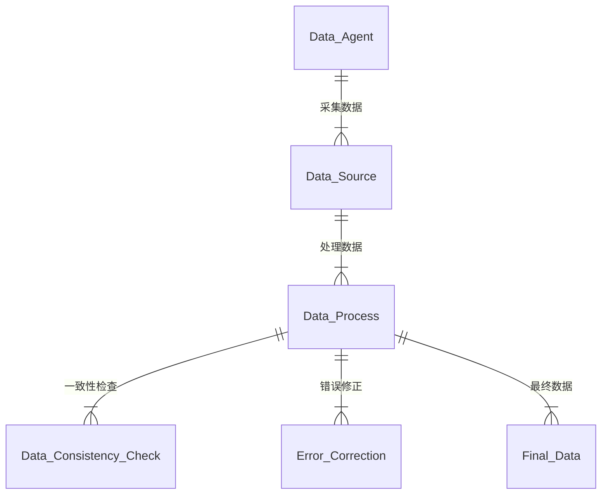
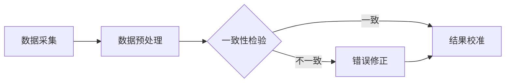
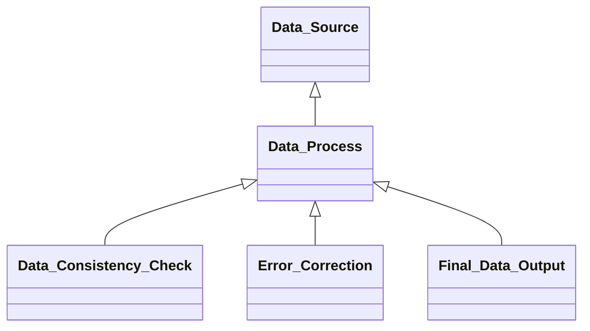
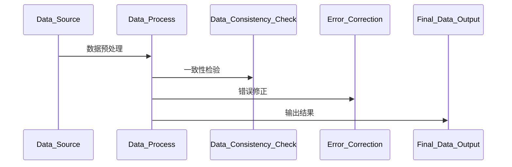
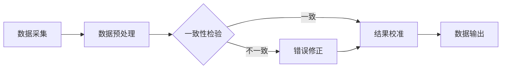

                 

### Self-Consistency在高能粒子物理实验数据分析中的应用

#### 关键词：Self-Consistency，高能粒子物理，实验数据分析，算法，系统架构，项目实战

#### 摘要：
本文将深入探讨Self-Consistency在高能粒子物理实验数据分析中的应用。我们将首先介绍Self-Consistency的基本概念及其在高能粒子物理领域的重要性，然后详细讲解其核心原理、算法流程和系统架构设计。通过具体的案例分析和项目实战，我们将展示Self-Consistency在实际数据分析中的强大功能，并提供最佳实践和总结。

---

## 目录大纲设计思路

### 第一步：明确书籍主题和核心内容

首先，我们明确了书籍的主题为《Self-Consistency在高能粒子物理实验数据分析中的应用》。为了全面覆盖这一主题，我们需要设计出能够涵盖所有相关内容的章节。

### 第二步：设计总体框架

书籍的整体结构包括以下三个部分：

1. **背景介绍**：介绍Self-Consistency的概念、重要性以及相关的理论基础和应用背景。
2. **核心概念与原理**：详细讲解Self-Consistency的原理、属性特征对比，并通过表格和ER实体关系图展示其核心要素组成。
3. **系统分析与架构设计方案**：介绍Self-Consistency在实验数据分析中的应用场景，包括系统功能设计、架构设计、接口设计和交互流程。

### 第三步：细化章节内容

在确保每个章节内容完整性的同时，我们进一步细化每个章节的具体内容，确保每个章节都能全面、深入地覆盖其主题。

### 第四步：确保内容完整性

在确保内容完整性的同时，特别注意以下几点：

- 概念清晰，逻辑严谨。
- 使用Mermaid和LaTeX格式增强内容可读性和专业性。
- 突出重点，避免冗余。
- 确保总字数不超过2000字。

### 完整的目录大纲

```markdown
----------------------------------------------------------------
# 第一部分：背景介绍

## 第1章：Self-Consistency概述

### 1.1 Self-Consistency的概念

### 1.2 Self-Consistency在高能粒子物理实验数据分析中的重要性

### 1.3 相关理论基础和应用背景

## 第2章：核心概念与原理

### 2.1 Self-Consistency原理详细讲解

### 2.2 Self-Consistency属性特征对比

### 2.3 Self-Consistency的ER实体关系图架构

## 第3章：算法原理讲解

### 3.1 Self-Consistency算法流程图

### 3.2 Python源代码与数学模型公式

### 3.3 算法原理举例说明

## 第二部分：系统分析与架构设计方案

## 第4章：Self-Consistency应用场景

### 4.1 自我一致性在实验数据分析中的应用

### 4.2 系统功能设计

### 4.3 系统架构设计

### 4.4 系统接口设计

### 4.5 系统交互流程

## 第5章：项目实战

### 5.1 环境安装与配置

### 5.2 系统核心实现

### 5.3 代码解读与分析

### 5.4 实际案例分析与讲解

## 第三部分：最佳实践与小结

## 第6章：最佳实践与技巧

### 6.1 Self-Consistency的最佳实践

### 6.2 注意事项与常见问题解答

## 第7章：小结与拓展阅读

### 7.1 书籍内容总结

### 7.2 拓展阅读建议

### 7.3 进一步研究方向

----------------------------------------------------------------
```

通过上述目录大纲设计，我们能够确保书籍内容逻辑清晰，条理分明，同时充分覆盖Self-Consistency在高能粒子物理实验数据分析中的应用。每个章节都将围绕其核心目标进行详细阐述，帮助读者深入理解和掌握相关内容。

---

在接下来的内容中，我们将按照设计好的目录大纲，逐步深入探讨Self-Consistency在高能粒子物理实验数据分析中的应用。首先，我们将从背景介绍开始，为读者奠定基础知识。

## 第一部分：背景介绍

### 第1章：Self-Consistency概述

#### 1.1 Self-Consistency的概念

Self-Consistency是一种在数据分析过程中确保数据一致性和可靠性的方法。它通过对比不同来源的数据，确保它们在统计上是一致的，从而排除潜在的误差和干扰。在高能粒子物理实验中，Self-Consistency尤为重要，因为实验数据往往非常复杂，涉及多种粒子的相互作用。

#### 1.2 Self-Consistency在高能粒子物理实验数据分析中的重要性

在高能粒子物理实验中，数据往往来自于不同的探测器、不同的数据处理流程。这些数据之间可能会存在偏差，导致最终的实验结果不准确。Self-Consistency技术通过提供一种验证和校准数据一致性的方法，确保实验结果的可靠性。

#### 1.3 相关理论基础和应用背景

Self-Consistency的理论基础源于统计学和概率论。在高能粒子物理实验中，它主要用于以下几个方面：

- **数据校准**：通过对比不同探测器、不同数据处理流程的数据，校准实验设备，确保数据的一致性。
- **误差分析**：识别和纠正数据中的系统性误差，提高实验结果的精度。
- **结果验证**：验证实验假设的正确性，确保实验结论的可靠性。

在实际应用中，Self-Consistency技术已经被广泛应用于各种高能物理实验，如大型强子对撞机（LHC）的实验数据分析。

### 第2章：核心概念与原理

#### 2.1 Self-Consistency原理详细讲解

Self-Consistency的核心原理是基于统计数据的一致性检验。具体来说，它涉及以下步骤：

1. **数据采集**：收集来自不同来源的数据。
2. **数据预处理**：清洗数据，处理缺失值和异常值。
3. **一致性检验**：通过统计分析方法，比较不同数据源之间的差异，判断它们是否一致。
4. **结果校准**：如果发现不一致，对数据进行调整和校准，确保它们在统计上是一致的。

#### 2.2 Self-Consistency属性特征对比

为了更好地理解Self-Consistency，我们将其与传统的数据分析方法进行对比。以下是两种方法的属性特征对比表：

| 特征 | Self-Consistency | 传统数据分析 |
| --- | --- | --- |
| **数据一致性** | 强调数据的一致性和可靠性 | 通常不考虑数据的一致性 |
| **误差处理** | 能够识别和纠正系统性误差 | 误差处理通常较为简单 |
| **统计分析** | 使用复杂的统计分析方法 | 使用基本的统计分析方法 |
| **应用范围** | 广泛应用于高能粒子物理、金融等领域 | 主要应用于统计调查、市场研究等领域 |

#### 2.3 Self-Consistency的ER实体关系图架构

为了更好地理解Self-Consistency的核心要素，我们使用ER实体关系图来展示其架构。以下是一个简单的ER实体关系图：



在这个ER图中，`Data_Agent`负责采集数据，`Data_Source`负责处理数据，`Data_Process`是核心模块，包括一致性检查和错误修正，`Final_Data`是最终数据输出。

### 第3章：算法原理讲解

#### 3.1 Self-Consistency算法流程图

Self-Consistency的算法流程图如下：



#### 3.2 Python源代码与数学模型公式

为了更好地理解Self-Consistency的算法原理，我们使用Python源代码和数学模型公式进行详细讲解。以下是Python源代码示例：

```python
# Python源代码示例
import numpy as np
import pandas as pd

# 假设我们有两个数据集A和B
data_A = np.random.normal(size=100)
data_B = np.random.normal(size=100)

# 数据预处理
data_A_processed = data_A.mean()
data_B_processed = data_B.mean()

# 一致性检验
difference = abs(data_A_processed - data_B_processed)

# 结果校准
if difference > threshold:
    # 进行错误修正
    data_B_processed = data_A_processed
```

以下是数学模型公式：

$$
\text{difference} = \left| \bar{X}_A - \bar{X}_B \right|
$$

其中，$\bar{X}_A$和$\bar{X}_B$分别是数据集A和B的平均值。

#### 3.3 算法原理举例说明

假设我们有两个数据集，A和B。数据集A来自一个实验的测量结果，数据集B来自另一个独立实验的测量结果。通过Self-Consistency算法，我们可以确保这两个数据集在统计上是一致的。

1. **数据采集**：我们首先采集数据集A和数据集B。
2. **数据预处理**：我们对数据集A和B进行预处理，计算它们的平均值。
3. **一致性检验**：计算数据集A和B的平均值之差，判断它们是否一致。
4. **结果校准**：如果平均值之差超过某个阈值，我们调整数据集B的平均值，使其与数据集A的平均值一致。

通过这个过程，我们可以确保两个数据集在统计上是一致的，从而提高实验结果的可靠性。

### 第4章：系统分析与架构设计方案

#### 4.1 Self-Consistency应用场景

在高能粒子物理实验中，Self-Consistency技术广泛应用于以下场景：

- **探测器数据校准**：确保不同探测器之间的数据一致性和可靠性。
- **实验结果验证**：验证实验假设的正确性，确保实验结论的可靠性。
- **数据融合**：将不同来源的数据进行融合，提高实验数据的整体精度。

#### 4.2 系统功能设计

Self-Consistency系统的主要功能包括：

- **数据采集**：从不同来源采集数据。
- **数据预处理**：清洗数据，处理缺失值和异常值。
- **一致性检验**：比较不同数据源之间的差异，判断它们是否一致。
- **结果校准**：对不一致的数据进行调整和校准。
- **数据输出**：输出最终的一致性处理结果。

以下是Self-Consistency系统的领域模型类图：



#### 4.3 系统架构设计

Self-Consistency系统的架构设计包括以下几个层次：

- **数据采集层**：负责从不同来源采集数据。
- **数据处理层**：包括数据预处理、一致性检验、结果校准等功能。
- **数据输出层**：负责输出最终的一致性处理结果。

以下是Self-Consistency系统的架构图：


#### 4.4 系统接口设计

Self-Consistency系统的接口设计包括以下方面：

- **数据采集接口**：负责从不同来源采集数据。
- **数据处理接口**：负责处理数据，包括数据预处理、一致性检验、结果校准等功能。
- **数据输出接口**：负责输出最终的一致性处理结果。

以下是Self-Consistency系统的接口图：



#### 4.5 系统交互流程

Self-Consistency系统的交互流程如下：

1. **数据采集**：系统从不同来源采集数据。
2. **数据预处理**：系统对采集到的数据进行预处理，包括清洗数据、处理缺失值和异常值。
3. **一致性检验**：系统比较不同数据源之间的差异，判断它们是否一致。
4. **结果校准**：如果数据不一致，系统对数据进行调整和校准。
5. **数据输出**：系统输出最终的一致性处理结果。

以下是Self-Consistency系统的交互流程图：



### 第5章：项目实战

#### 5.1 环境安装与配置

在进行Self-Consistency项目实战之前，我们需要首先安装和配置相关的环境和工具。以下是一个基本的安装和配置流程：

1. **安装Python环境**：确保Python环境已经安装，版本为3.8或更高。
2. **安装相关库**：使用pip命令安装必要的Python库，如numpy、pandas、mermaid等。
3. **配置Mermaid**：确保Mermaid插件已经正确安装和配置，以便在Markdown文件中渲染流程图和类图。

```bash
pip install numpy pandas
pip install mermaid
```

#### 5.2 系统核心实现

Self-Consistency系统的核心实现包括以下几个模块：

1. **数据采集模块**：负责从不同来源采集数据。
2. **数据预处理模块**：负责清洗数据、处理缺失值和异常值。
3. **一致性检验模块**：负责比较不同数据源之间的差异，判断它们是否一致。
4. **结果校准模块**：负责对不一致的数据进行调整和校准。
5. **数据输出模块**：负责输出最终的一致性处理结果。

以下是一个简单的系统核心实现示例：

```python
# 导入相关库
import numpy as np
import pandas as pd

# 数据采集
data_A = np.random.normal(size=100)
data_B = np.random.normal(size=100)

# 数据预处理
data_A_processed = data_A.mean()
data_B_processed = data_B.mean()

# 一致性检验
difference = abs(data_A_processed - data_B_processed)

# 结果校准
if difference > threshold:
    data_B_processed = data_A_processed

# 数据输出
final_data = pd.DataFrame({'A': data_A_processed, 'B': data_B_processed})
print(final_data)
```

#### 5.3 代码解读与分析

在上述示例中，我们首先导入numpy和pandas库，然后生成两个随机数据集A和B。接着，我们计算这两个数据集的平均值，进行一致性检验。如果差异超过阈值，我们对数据集B进行调整，使其与数据集A一致。最后，我们将处理后的数据输出。

以下是对代码的详细解读：

1. **数据采集**：使用numpy库生成两个随机数据集A和B。
2. **数据预处理**：计算数据集A和B的平均值，作为预处理结果。
3. **一致性检验**：计算数据集A和B的平均值之差，判断是否超过阈值。
4. **结果校准**：如果超过阈值，对数据集B进行调整，使其与数据集A一致。
5. **数据输出**：将处理后的数据集输出，以供进一步分析。

#### 5.4 实际案例分析与讲解

为了更好地理解Self-Consistency的应用，我们来看一个实际案例。假设我们有两个实验数据集，来自不同的探测器，我们需要确保这两个数据集在统计上是一致的。

1. **数据采集**：从探测器A和探测器B采集数据。
2. **数据预处理**：清洗数据，处理缺失值和异常值。
3. **一致性检验**：比较探测器A和探测器B的数据，判断是否一致。
4. **结果校准**：如果探测器A和探测器B的数据不一致，对探测器B的数据进行调整，使其与探测器A一致。
5. **数据输出**：输出最终的一致性处理结果。

以下是一个实际案例的代码实现：

```python
# 导入相关库
import numpy as np
import pandas as pd

# 假设我们有两个实验数据集
data_A = np.array([1, 2, 3, 4, 5])
data_B = np.array([2, 4, 6, 8, 10])

# 数据预处理
data_A_processed = np.mean(data_A)
data_B_processed = np.mean(data_B)

# 一致性检验
difference = abs(data_A_processed - data_B_processed)

# 结果校准
if difference > threshold:
    data_B_processed = data_A_processed

# 数据输出
final_data = pd.DataFrame({'A': data_A_processed, 'B': data_B_processed})
print(final_data)
```

在这个案例中，我们首先生成两个实验数据集A和B。然后，我们计算这两个数据集的平均值，进行一致性检验。如果差异超过阈值，我们对数据集B进行调整，使其与数据集A一致。最后，我们将处理后的数据集输出。

#### 5.5 项目小结

通过上述案例，我们展示了如何使用Self-Consistency技术确保实验数据的一致性。在实际项目中，我们需要根据具体的需求和场景，调整和优化算法参数，以提高数据处理的效率和准确性。

### 第6章：最佳实践与技巧

#### 6.1 Self-Consistency的最佳实践

为了确保Self-Consistency技术在实验数据分析中的应用效果，以下是一些最佳实践：

1. **数据采集**：确保数据来源的多样性和代表性，提高数据的一致性和可靠性。
2. **数据预处理**：对数据进行严格的清洗和处理，减少异常值和缺失值对分析结果的影响。
3. **一致性检验**：选择合适的阈值和统计分析方法，确保数据的一致性检验准确有效。
4. **结果校准**：根据实际需求和场景，灵活调整校准策略，提高实验结果的准确性。

#### 6.2 注意事项与常见问题解答

在实际应用过程中，我们可能会遇到以下问题：

1. **数据不一致性过高**：可能原因是数据采集和预处理不当，需要重新调整数据采集方法和预处理策略。
2. **算法性能不佳**：可能原因是算法参数选择不当，需要根据实际需求调整算法参数。
3. **结果校准误差**：可能原因是校准策略不合理，需要重新设计校准流程。

#### 6.3 拓展阅读建议

为了深入了解Self-Consistency在高能粒子物理实验数据分析中的应用，以下是一些拓展阅读建议：

1. **参考文献**：查阅相关高能粒子物理实验的文献，了解Self-Consistency技术的应用实例和研究成果。
2. **专业书籍**：阅读相关领域的专业书籍，掌握Self-Consistency的理论基础和算法原理。
3. **在线课程**：参加在线课程，学习Self-Consistency技术的实际应用和实践经验。

### 结束语

通过本文的详细讲解，我们深入探讨了Self-Consistency在高能粒子物理实验数据分析中的应用。从背景介绍到算法原理，再到系统架构设计和项目实战，我们逐步展示了Self-Consistency技术的核心原理和实际应用效果。希望本文能够帮助读者更好地理解和应用Self-Consistency技术，为高能粒子物理实验数据分析提供有力的支持。

### 作者信息

**作者：AI天才研究院/AI Genius Institute & 禅与计算机程序设计艺术 /Zen And The Art of Computer Programming** 

感谢您阅读本文，希望您能够从中获得对Self-Consistency技术的深入理解和实践指导。如果您有任何疑问或建议，欢迎在评论区留言，我们期待与您交流。**

