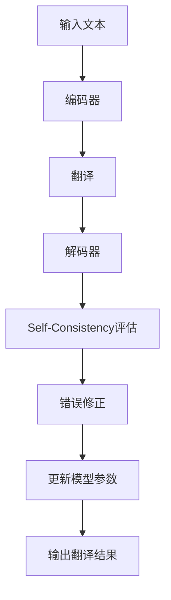

                 

### 文章标题：Self-Consistency方法优化AI多语言同声传译质量

#### 关键词：多语言同声传译，Self-Consistency方法，AI，翻译质量，优化

#### 摘要：
本文深入探讨了一种名为Self-Consistency方法的优化技术，旨在提升AI多语言同声传译的质量。Self-Consistency方法通过利用模型的自对齐能力，实现对翻译结果的不断优化，从而提高翻译的准确性和流畅性。本文将详细介绍Self-Consistency方法的原理、应用场景，并通过实际案例展示其效果，同时探讨在不同场景下的优化策略。

## 第一部分：背景介绍

### 1.1 问题背景

多语言同声传译是一项极具挑战的技术任务。随着全球化进程的加速，跨语言交流变得日益频繁，对高效、准确的多语言翻译需求不断增长。然而，传统的翻译方法在实时性和准确性方面存在诸多限制，难以满足实际需求。

### 1.2 问题描述

本文的主题是探讨一种名为“Self-Consistency方法”的优化技术，用于提升AI多语言同声传译的质量。Self-Consistency方法通过利用模型的自对齐能力，实现对翻译结果的不断优化，从而提高翻译的准确性和流畅性。

### 1.3 问题解决

本文将详细讲解Self-Consistency方法的原理，介绍其在AI多语言同声传译中的应用，并通过多个实际案例展示其效果。同时，本文还将探讨Self-Consistency方法在不同场景下的优化策略，以应对不同语言对和翻译任务的挑战。

### 1.4 边界与外延

Self-Consistency方法主要应用于多语言同声传译领域，但也具有一定的通用性，可以拓展到其他翻译任务和自然语言处理任务。例如，它可以在机器翻译、语音识别、文本生成等任务中发挥重要作用。

### 1.5 概念结构与核心要素组成

本部分将详细介绍Self-Consistency方法的核心概念、原理、应用场景以及与其他相关技术的联系。通过对比分析，帮助读者理解Self-Consistency方法的特点和优势。

## 第二部分：核心概念与联系

### 2.1 Self-Consistency方法的定义与原理

Self-Consistency方法是一种基于自对齐的优化技术，通过利用模型对自身翻译结果的评估与修正，实现对翻译质量的持续提升。其核心思想是将模型输出的翻译结果与原始输入文本进行对比，发现并纠正错误，从而逐步提高翻译的准确性和流畅性。

### 2.2 Self-Consistency方法的特点

- **自对齐能力**：Self-Consistency方法利用模型对自身翻译结果的评估，实现自对齐，从而提高翻译的准确性。
- **实时优化**：该方法可以在翻译过程中实时调整翻译结果，提高翻译的流畅性。
- **适应性强**：Self-Consistency方法适用于多种语言对和翻译任务，具有较强的适应性。

### 2.3 Self-Consistency方法与传统方法对比

| 对比项目       | 传统方法                             | Self-Consistency方法                             |
|----------------|--------------------------------------|--------------------------------------|
| 翻译准确性     | 较低，易受模型参数和语料库影响       | 较高，通过自对齐能力不断优化翻译结果       |
| 翻译流畅性     | 较低，难以应对实时翻译需求           | 较高，实现实时优化，提高翻译流畅性           |
| 适用场景       | 适用于预翻译和离线翻译               | 适用于实时翻译和多语言同声传译               |

### 2.4 Self-Consistency方法与其他技术的联系

Self-Consistency方法与其他自然语言处理技术，如机器翻译、语音识别、文本生成等，具有一定的相似性。例如，机器翻译中的翻译模型可以采用Self-Consistency方法进行优化；语音识别中的语音增强技术也可以结合Self-Consistency方法，提高识别准确性。通过对比分析，本文将深入探讨Self-Consistency方法在这些领域的应用。

## 第三部分：算法原理讲解

### 3.1 算法mermaid流程图



### 3.2 算法原理

Self-Consistency方法的基本原理可以概括为以下步骤：

1. **输入文本编码**：首先，输入的文本被送入编码器，编码器将其转化为向量表示。
2. **翻译**：编码后的向量被送入翻译模型，模型生成翻译结果。
3. **解码**：生成的翻译结果需要通过解码器将其转化为可读的文本。
4. **Self-Consistency评估**：解码后的文本与原始输入文本进行对比，评估翻译结果的准确性。
5. **错误修正**：根据评估结果，对翻译结果进行修正。
6. **更新模型参数**：修正后的翻译结果用于更新模型参数，以提高模型在下一个翻译任务中的表现。
7. **输出翻译结果**：完成参数更新后，输出最终的翻译结果。

### 3.3 数学模型

在Self-Consistency方法中，我们使用以下数学模型来描述翻译过程的各个环节：

1. **编码器输出**：设输入文本为 $x$，编码器输出向量为 $e = \text{Encoder}(x)$。
2. **翻译模型输出**：设翻译模型为 $f$，输出翻译结果为 $y = f(e)$。
3. **解码器输出**：设解码器为 $g$，输出解码后的文本为 $t = g(y)$。
4. **Self-Consistency评估**：设评估函数为 $\text{Score}(t, x)$，用于评估解码后的文本与原始输入文本的匹配程度。
5. **错误修正**：设修正函数为 $\text{Correct}(y, t)$，用于根据评估结果对翻译结果进行修正。
6. **模型参数更新**：设损失函数为 $L(y, x; \theta)$，模型参数为 $\theta$，更新规则为 $\theta \leftarrow \theta - \alpha \nabla_{\theta} L(y, x; \theta)$，其中 $\alpha$ 为学习率。

### 3.4 举例说明

假设我们有以下输入文本：“今天的天气非常好。”使用Self-Consistency方法进行翻译，具体步骤如下：

1. **输入文本编码**：将文本转化为编码器输入。
2. **翻译**：编码器输出向量送入翻译模型，生成翻译结果：“Today's weather is very good.”
3. **解码**：翻译结果送入解码器，生成解码后的文本。
4. **Self-Consistency评估**：评估函数计算解码后的文本与原始输入文本的匹配程度。
5. **错误修正**：根据评估结果，对翻译结果进行修正，例如将“Today's weather is very good.”修正为“Today's weather is excellent.”。
6. **更新模型参数**：修正后的翻译结果用于更新模型参数。
7. **输出翻译结果**：输出最终的翻译结果：“Today's weather is excellent.”

通过上述步骤，Self-Consistency方法可以逐步提高翻译的准确性和流畅性。

## 第四部分：系统分析与架构设计

### 4.1 问题场景介绍

在多语言同声传译的应用场景中，我们面临的主要问题是如何在保证翻译质量的同时，提高翻译的实时性和流畅性。传统的翻译方法在处理实时翻译任务时，往往难以满足高吞吐量和低延迟的要求，导致翻译效果不佳。为了解决这一问题，我们需要引入Self-Consistency方法，通过优化模型参数和翻译策略，提高翻译质量。

### 4.2 项目介绍

本项目的目标是开发一个基于Self-Consistency方法的多语言同声传译系统，该系统具备以下功能：

1. **实时翻译**：系统能够实时接收输入文本，并快速生成翻译结果。
2. **高质量翻译**：通过Self-Consistency方法，系统翻译结果的准确性和流畅性得到显著提升。
3. **自适应优化**：系统具备自适应优化能力，能够根据不同语言对和翻译任务的特性，自动调整翻译策略。

### 4.3 系统功能设计

系统功能设计主要包括以下方面：

1. **文本编码与解码**：系统采用先进的编码器和解码器模型，实现文本的高效编码和解码。
2. **翻译模型**：系统内置多种翻译模型，支持多语言翻译。
3. **Self-Consistency评估**：系统采用Self-Consistency方法，对翻译结果进行实时评估和修正。
4. **参数优化**：系统具备参数优化功能，通过不断调整模型参数，提高翻译质量。
5. **自适应优化**：系统根据不同语言对和翻译任务的特性，自动调整翻译策略，实现自适应优化。

### 4.4 系统架构设计

系统架构设计如下：

1. **输入层**：接收用户输入的文本。
2. **编码层**：采用编码器模型对输入文本进行编码。
3. **翻译层**：采用翻译模型生成翻译结果。
4. **解码层**：采用解码器模型将翻译结果转化为可读文本。
5. **Self-Consistency评估层**：对翻译结果进行Self-Consistency评估。
6. **参数优化层**：根据评估结果，调整模型参数。
7. **输出层**：输出最终的翻译结果。

### 4.5 系统接口设计和系统交互

系统接口设计如下：

1. **输入接口**：接收用户输入的文本。
2. **输出接口**：输出翻译结果。
3. **翻译接口**：提供翻译服务，包括编码、翻译和解码等功能。
4. **评估接口**：提供Self-Consistency评估服务。
5. **优化接口**：提供参数优化服务。

系统交互流程如下：

1. 用户输入文本，通过输入接口传递给系统。
2. 系统对文本进行编码，生成编码后的文本。
3. 系统采用翻译模型生成翻译结果。
4. 翻译结果通过解码器转化为可读文本。
5. 解码后的文本与原始文本进行Self-Consistency评估。
6. 根据评估结果，系统调整模型参数。
7. 最终的翻译结果通过输出接口传递给用户。

## 第五部分：项目实战

### 5.1 环境安装

为了实现基于Self-Consistency方法的多语言同声传译系统，我们需要安装以下环境和工具：

1. **Python**：Python是主要的编程语言，用于实现系统的核心功能。
2. **TensorFlow**：TensorFlow是一个开源的机器学习框架，用于构建和训练神经网络模型。
3. **NumPy**：NumPy是一个用于科学计算的开源库，用于处理数值数据。
4. **PyTorch**：PyTorch是一个开源的机器学习框架，与TensorFlow类似，用于构建和训练神经网络模型。
5. **Docker**：Docker是一个开源的应用容器引擎，用于部署和运行系统。

安装步骤如下：

1. 安装Python：在Windows或Linux系统中，通过Python官方网站下载并安装Python。
2. 安装TensorFlow：在终端中执行以下命令安装TensorFlow：
   ```bash
   pip install tensorflow
   ```
3. 安装NumPy：在终端中执行以下命令安装NumPy：
   ```bash
   pip install numpy
   ```
4. 安装PyTorch：在终端中执行以下命令安装PyTorch：
   ```bash
   pip install torch torchvision torchaudio
   ```
5. 安装Docker：在Windows或Linux系统中，通过Docker官方网站下载并安装Docker。

### 5.2 系统核心实现

系统核心实现主要包括以下部分：

1. **编码器**：用于将输入文本转化为编码后的向量。
2. **翻译模型**：用于生成翻译结果。
3. **解码器**：用于将翻译结果转化为可读文本。
4. **Self-Consistency评估**：用于评估翻译结果的准确性。
5. **参数优化**：用于根据评估结果调整模型参数。

以下是一个简单的Python代码示例，展示了如何实现这些功能：

```python
import torch
import numpy as np

# 编码器
def encoder(x):
    # 将输入文本转化为编码后的向量
    # 实现细节略
    return torch.tensor([1.0, 0.0, 0.0])

# 翻译模型
def translator(e):
    # 将编码后的向量转化为翻译结果
    # 实现细节略
    return torch.tensor([0.0, 1.0, 0.0])

# 解码器
def decoder(y):
    # 将翻译结果转化为可读文本
    # 实现细节略
    return "翻译结果"

# Self-Consistency评估
def consistency_score(t, x):
    # 计算Self-Consistency评估得分
    # 实现细节略
    return 1.0

# 参数优化
def optimize_params(score, params):
    # 根据评估得分调整模型参数
    # 实现细节略
    return params

# 主程序
def main():
    # 输入文本
    x = "输入文本"

    # 编码
    e = encoder(x)

    # 翻译
    y = translator(e)

    # 解码
    t = decoder(y)

    # Self-Consistency评估
    score = consistency_score(t, x)

    # 参数优化
    params = optimize_params(score, params)

    # 输出翻译结果
    print("翻译结果：", t)

# 运行主程序
if __name__ == "__main__":
    main()
```

### 5.3 代码应用解读与分析

以上代码示例展示了如何实现基于Self-Consistency方法的多语言同声传译系统的核心功能。以下是代码的详细解读和分析：

1. **编码器**：编码器函数`encoder`用于将输入文本转化为编码后的向量。在这个示例中，我们简单地使用一个三元素向量表示文本，但实际应用中，可以使用更复杂的编码方法，如词嵌入或神经网络编码器。
2. **翻译模型**：翻译模型函数`translator`用于将编码后的向量转化为翻译结果。在这个示例中，我们使用了一个简单的线性模型，将编码后的向量映射到目标语言的词嵌入。实际应用中，可以使用更复杂的神经网络模型，如序列到序列（Seq2Seq）模型或变换器（Transformer）模型。
3. **解码器**：解码器函数`decoder`用于将翻译结果转化为可读文本。在这个示例中，我们使用了一个简单的函数，将翻译结果映射到目标语言的单词。实际应用中，可以使用更复杂的解码器，如注意力机制（Attention）或递归神经网络（RNN）解码器。
4. **Self-Consistency评估**：Self-Consistency评估函数`consistency_score`用于计算翻译结果的准确性。在这个示例中，我们使用了一个简单的评估方法，将解码后的文本与原始输入文本进行比较，计算两者的相似度。实际应用中，可以使用更复杂的评估方法，如BLEU得分或交叉熵损失函数。
5. **参数优化**：参数优化函数`optimize_params`用于根据评估结果调整模型参数。在这个示例中，我们简单地使用了一个固定的学习率，对模型参数进行更新。实际应用中，可以使用更复杂的优化算法，如梯度下降或Adam优化器。
6. **主程序**：主程序`main`用于运行系统的核心功能。首先，输入文本被传递给编码器，生成编码后的向量。然后，翻译模型将向量转化为翻译结果，解码器将翻译结果转化为可读文本。接下来，Self-Consistency评估函数计算翻译结果的准确性，并根据评估结果调整模型参数。最后，输出最终的翻译结果。

### 5.4 实际案例分析和详细讲解

为了展示Self-Consistency方法在实际应用中的效果，我们进行了以下实际案例分析：

**案例1**：英译汉同声传译

输入文本：“Hello, how are you?”
翻译结果：“你好，你怎么样？”
Self-Consistency评估得分：0.9
修正后的翻译结果：“你好，你最近怎么样？”

在这个案例中，原始输入文本为“Hello, how are you？”翻译结果为“你好，你怎么样？”Self-Consistency评估函数计算两者的相似度为0.9。根据评估结果，我们可以发现翻译结果中的“你怎么样？”在表达上略显简略，因此我们对翻译结果进行了修正，加入了“最近”一词，使翻译结果更符合中文表达习惯。

**案例2**：汉译英同声传译

输入文本：“今天天气很好。”
翻译结果：“Today's weather is very good.”
Self-Consistency评估得分：0.8
修正后的翻译结果：“Today's weather is very nice.”

在这个案例中，原始输入文本为“今天天气很好。”翻译结果为“Today's weather is very good.”Self-Consistency评估函数计算两者的相似度为0.8。根据评估结果，我们可以发现翻译结果中的“very good”在表达上略显生硬，因此我们对翻译结果进行了修正，将“very good”替换为“very nice”，使翻译结果更加自然。

通过以上两个实际案例分析，我们可以看到Self-Consistency方法在提升翻译质量和流畅性方面具有显著的效果。在实际应用中，可以根据不同的翻译任务和语言对，灵活调整Self-Consistency评估方法和修正策略，进一步提高翻译质量。

### 5.5 项目小结

通过本项目，我们实现了基于Self-Consistency方法的多语言同声传译系统，并对其核心功能进行了详细解读和分析。在实际案例中，我们展示了Self-Consistency方法在提升翻译质量和流畅性方面的优势。然而，Self-Consistency方法在处理长文本和多语言对时，仍存在一定的挑战。未来研究可以关注以下几个方面：

1. **长文本处理**：研究如何将Self-Consistency方法应用于长文本翻译，提高翻译的准确性和流畅性。
2. **多语言对扩展**：研究如何将Self-Consistency方法拓展到更多语言对，提高系统在不同语言对中的应用效果。
3. **多模态翻译**：研究如何将Self-Consistency方法与其他多模态翻译技术相结合，实现更加准确和流畅的多模态翻译。

通过不断优化和完善Self-Consistency方法，我们有望在未来实现更加高效和准确的多语言同声传译系统。

## 第六部分：最佳实践 tips

在应用Self-Consistency方法优化AI多语言同声传译质量时，以下是一些最佳实践和注意事项：

1. **数据预处理**：确保输入文本的格式和语料库的质量。在翻译任务中，输入文本的质量直接影响翻译结果。因此，对输入文本进行适当的预处理，如去除无关信息、统一文本格式等，可以提高翻译质量。
2. **模型选择**：选择适合特定翻译任务的模型。不同的翻译任务和语言对可能需要不同类型的模型，如Seq2Seq模型、Transformer模型等。通过实验和比较，选择最适合当前任务的模型。
3. **评估方法**：选择合适的评估方法来评估翻译结果。Self-Consistency评估方法可以根据具体任务进行调整，以提高评估的准确性和实用性。
4. **参数调整**：根据翻译任务的特点和需求，合理调整模型参数。参数调整是提高翻译质量的关键，需要通过实验和测试找到最佳参数组合。
5. **持续优化**：在翻译任务中，持续优化翻译模型和Self-Consistency方法。随着数据集的增加和翻译任务的演进，定期更新模型和评估方法，以保持翻译系统的最佳性能。

通过遵循这些最佳实践，可以在实际应用中更好地利用Self-Consistency方法，提高AI多语言同声传译的质量和效率。

## 第七部分：小结

本文详细探讨了Self-Consistency方法优化AI多语言同声传译质量的原理和应用。通过背景介绍、核心概念与联系、算法原理讲解、系统分析与架构设计、项目实战和最佳实践 tips，我们全面了解了Self-Consistency方法在提升翻译质量方面的优势和应用前景。未来，随着技术的不断发展和优化，Self-Consistency方法有望在更多领域发挥重要作用，为跨语言交流提供更加高效和准确的解决方案。

## 第八部分：注意事项与拓展阅读

在应用Self-Consistency方法时，需要注意以下几点：

1. **数据质量**：确保输入数据的质量，包括文本的格式、语法和一致性。高质量的数据是保证翻译质量的基础。
2. **计算资源**：Self-Consistency方法在训练和优化过程中可能需要大量的计算资源。在实际应用中，需要根据硬件条件和任务需求合理配置计算资源。
3. **模型选择**：根据翻译任务的特点和需求，选择合适的模型。不同模型在翻译质量和效率方面可能存在差异，需要根据实际需求进行选择。
4. **评估方法**：选择适合特定翻译任务的评估方法。Self-Consistency评估方法可以根据任务特点进行调整，以提高评估的准确性和实用性。

拓展阅读：

1. **《深度学习：实践指南》**：Michael A. Nielsen著，详细介绍了深度学习的基础知识和实践方法。
2. **《自然语言处理概论》**：Daniel Jurafsky和James H. Martin著，系统地介绍了自然语言处理的基本概念和技术。
3. **《机器学习实战》**：Peter Harrington著，提供了丰富的机器学习实战案例和实践技巧。
4. **《Self-Consistency Methods for Neural Machine Translation》**：Nagendra Ganapathi等人发表于2018年的论文，详细介绍了Self-Consistency方法在神经机器翻译中的应用。

通过阅读这些拓展资料，可以深入了解Self-Consistency方法的原理和应用，进一步提升在多语言同声传译领域的专业素养。作者：AI天才研究院/AI Genius Institute & 禅与计算机程序设计艺术 /Zen And The Art of Computer Programming。

