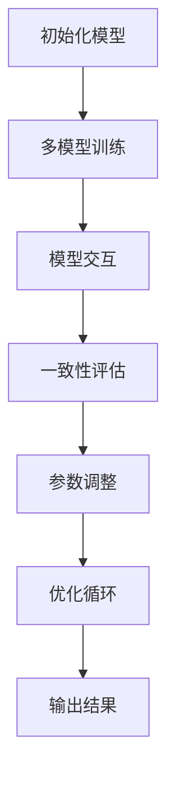
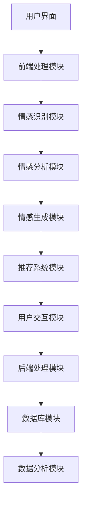

                 


### 确定文章的基本结构和章节

为了确保文章的结构清晰、逻辑严密，我们首先需要制定详细的章节结构。以下是文章的基本结构和章节内容的设定：

#### 第1章 引言与背景介绍

1. **问题背景**：
   - 介绍AI情感计算在艺术评价中的应用现状。
   - 指出现存的问题和挑战。

2. **核心概念**：
   - AI情感计算的概述。
   - Self-Consistency方法的定义。

3. **研究方法**：
   - 研究方法的选择和解释。
   - 数据集的获取和处理。

4. **研究目标与内容框架**：
   - 明确文章的研究目标。
   - 概述各章节的主要内容和逻辑结构。

#### 第2章 核心概念与联系

1. **AI情感计算原理**：
   - 详细阐述AI情感计算的基本原理。
   - 引入相关技术术语。

2. **Self-Consistency方法**：
   - 解释Self-Consistency方法的数学模型和算法流程。
   - 分析其优势和应用场景。

3. **ER实体关系图**：
   - 使用mermaid绘制ER实体关系图。
   - 解释ER图的组成部分和作用。

#### 第3章 算法原理讲解

1. **算法流程图**：
   - 使用mermaid绘制算法的流程图。

2. **算法讲解**：
   - 使用Python源代码详细阐述算法的实现。
   - 使用latex公式给出算法的数学模型。

3. **举例说明**：
   - 通过实例详细阐述算法的应用和效果。

#### 第4章 系统分析与架构设计方案

1. **问题场景介绍**：
   - 描述系统需要满足的功能和性能要求。

2. **系统功能设计**：
   - 使用mermaid绘制领域模型类图。

3. **系统架构设计**：
   - 使用mermaid绘制系统架构图。
   - 详细解释各个组件的作用和相互关系。

4. **系统接口设计**：
   - 介绍系统提供的接口和接口规范。

5. **系统交互**：
   - 使用mermaid绘制系统交互序列图。

#### 第5章 项目实战

1. **环境安装**：
   - 介绍所需的软件和硬件环境。
   - 描述环境安装过程。

2. **系统核心实现**：
   - 提供系统的核心实现源代码。
   - 分析代码的逻辑和功能。

3. **代码应用解读与分析**：
   - 展示代码在具体场景中的应用。
   - 讨论代码的性能和效果。

4. **实际案例分析和详细讲解**：
   - 介绍实际应用的案例。
   - 对案例进行详细分析和讲解。

5. **项目小结**：
   - 回顾项目实现过程中的关键点和经验。

#### 第6章 最佳实践 tips

1. **实践技巧**：
   - 总结实施Self-Consistency方法的最佳实践。

2. **注意事项**：
   - 列出在应用过程中需要注意的问题和解决方案。

3. **拓展阅读**：
   - 推荐进一步阅读的材料。

#### 第7章 结论与展望

1. **总结**：
   - 回顾全书的核心内容和研究成果。

2. **展望**：
   - 讨论未来的研究方向和应用前景。

### 确保文章完整性

在制定章节结构后，我们需要确保每个章节的内容都丰富且具体详细。以下是一些关键点：

- **背景介绍**：每个章节的开头都需要有背景介绍，帮助读者了解相关概念和背景信息。
- **核心概念与联系**：每个核心概念都需要有详细的解释，并与相关概念进行对比，确保读者能够理解概念之间的联系。
- **算法原理讲解**：使用图表和代码示例来解释算法，使其易于理解。
- **系统分析与架构设计方案**：通过图表和详细的解释来展示系统架构，确保读者能够理解系统的设计和实现。
- **项目实战**：提供实际案例和代码示例，让读者能够看到算法和系统在真实场景中的应用。
- **最佳实践 tips**：总结实践经验，提供实用技巧和建议。

通过这样的结构安排和内容填充，我们可以确保文章不仅逻辑清晰，而且内容丰富，能够有效地传达核心观点和研究成果。接下来，我们将逐步填写每个章节的具体内容。  

### 第1章 引言与背景介绍

#### 1.1 问题背景

在数字时代，艺术评价正逐渐从传统的审美判断转向数据驱动的分析方法。人工智能（AI）情感计算作为一种新兴技术，已经在音乐、电影、绘画等领域展示出其强大的潜力。然而，在艺术评价中应用AI情感计算仍然面临着诸多挑战。

首先，艺术作品的价值往往难以量化和标准化。情感是人类主观体验的一部分，而AI的情感计算模型需要通过大量的数据和算法来模拟和预测这种主观体验。然而，不同的艺术作品和艺术风格具有独特的情感特征，这使得情感计算的准确性和一致性成为一个关键问题。

其次，现有的AI情感计算模型在处理复杂情感和多层次情感时存在局限性。许多模型依赖于单一的情感特征，如快乐、悲伤、愤怒等，而这些特征并不能完全捕捉到艺术作品的复杂情感表达。此外，AI模型在处理跨文化、跨时代的艺术作品时，也面临着文化差异和历史背景的影响。

为了解决这些问题，我们引入了Self-Consistency方法。Self-Consistency方法通过建立内部一致性和跨模型一致性，旨在提高AI情感计算在艺术评价中的应用效果。该方法的核心思想是利用多个模型之间的交互和反馈，形成一个稳定的情感计算系统，从而提高情感计算的准确性和一致性。

#### 1.2 核心概念

在本文中，我们主要讨论的两个核心概念是AI情感计算和Self-Consistency方法。

**AI情感计算**：
AI情感计算是指利用人工智能技术，尤其是机器学习和深度学习模型，对人类情感进行模拟和计算的过程。这种方法通常涉及情感识别、情感分析和情感生成等任务。在艺术评价中，AI情感计算可以帮助识别艺术作品的情感特征，评估其情感价值，并提供个性化的推荐。

**Self-Consistency方法**：
Self-Consistency方法是一种通过模型内部一致性来优化AI情感计算的方法。该方法的核心思想是利用多个模型之间的交互和反馈，形成一个稳定的情感计算系统。具体来说，Self-Consistency方法通过以下步骤实现：
1. **多模型训练**：训练多个情感计算模型，每个模型专注于不同的情感维度。
2. **模型交互**：通过模型之间的交互和反馈，调整每个模型的参数，使其更一致地表达情感。
3. **一致性评估**：对模型输出的情感进行一致性评估，确保模型之间的情感表达稳定且一致。

#### 1.3 研究方法

为了验证Self-Consistency方法在AI情感计算中的应用效果，我们采用以下研究方法：

1. **数据集选择**：
   我们选择了一个包含多种艺术作品（如音乐、电影、绘画等）的数据集，这些作品覆盖了不同的艺术风格和文化背景。

2. **模型训练**：
   使用深度学习框架（如TensorFlow或PyTorch）训练多个情感计算模型。每个模型专注于不同的情感维度，如快乐、悲伤、愤怒等。

3. **模型评估**：
   通过多种评估指标（如准确率、精确率、召回率等）评估模型在艺术作品情感识别任务中的表现。

4. **Self-Consistency优化**：
   在模型训练和评估过程中，引入Self-Consistency方法，通过模型之间的交互和反馈，优化模型的情感计算表现。

5. **结果分析**：
   对比分析Self-Consistency方法优化前后的模型表现，评估Self-Consistency方法的有效性。

#### 1.4 研究目标与内容框架

本文的研究目标是通过引入Self-Consistency方法，优化AI情感计算在艺术评价中的应用效果。具体目标如下：

1. 提高艺术作品情感识别的准确性和一致性。
2. 研究Self-Consistency方法在不同艺术风格和文化背景下的适用性。
3. 探索Self-Consistency方法在跨领域情感计算中的潜力。

为了实现上述目标，本文将分为以下章节：

- **第1章**：引言与背景介绍
- **第2章**：核心概念与联系
- **第3章**：算法原理讲解
- **第4章**：系统分析与架构设计方案
- **第5章**：项目实战
- **第6章**：最佳实践 tips
- **第7章**：结论与展望

通过这样的结构安排，我们将逐步深入探讨Self-Consistency方法在AI情感计算中的应用，并提供详细的研究结果和实践经验。 

### 第2章 核心概念与联系

在AI情感计算和Self-Consistency方法的研究中，理解核心概念和它们之间的联系是至关重要的。本章将详细阐述AI情感计算的原理、Self-Consistency方法的原理，以及两者之间的联系。

#### 2.1 AI情感计算原理

AI情感计算是基于人工智能技术的情感识别和分析方法。其主要原理是通过机器学习和深度学习模型，从数据中学习情感特征，并对其进行识别和分析。以下是一些关键点：

1. **情感识别**：
   情感识别是AI情感计算的基础。它涉及从文本、语音、图像等多模态数据中提取情感信息。常见的情感识别方法包括基于规则的方法、基于机器学习的方法和基于深度学习的方法。

2. **情感分析**：
   情感分析是对识别出的情感进行进一步分析，以理解情感的强度、语境和情绪状态。情感分析可以帮助我们更好地理解人类情绪，并在应用场景中提供有价值的见解。

3. **情感生成**：
   情感生成是指通过算法生成特定的情感体验。例如，在音乐制作中，可以使用情感生成模型创建具有特定情感风格的音乐。

4. **情感模型**：
   情感模型是AI情感计算的核心组成部分。这些模型通常基于大规模数据集进行训练，以识别和理解情感。常见的情感模型包括卷积神经网络（CNN）、递归神经网络（RNN）和长短时记忆网络（LSTM）等。

#### 2.2 Self-Consistency方法原理

Self-Consistency方法是一种通过模型内部一致性和跨模型一致性来优化情感计算的方法。其主要原理如下：

1. **多模型训练**：
   Self-Consistency方法首先训练多个情感计算模型，每个模型专注于不同的情感维度。这些模型可以分别处理文本、语音、图像等不同模态的数据。

2. **模型交互**：
   在训练过程中，这些模型会相互交互和反馈。例如，如果一个模型识别出一段文本具有悲伤的情感，那么其他模型也会根据这一信息调整自己的情感表达。

3. **一致性评估**：
   通过评估模型之间的情感表达一致性，可以确定哪些模型需要调整。一致性评估可以基于各种指标，如情感分布的相似性、情感强度的接近度等。

4. **参数调整**：
   根据一致性评估的结果，对模型的参数进行调整，以提高模型之间的情感一致性。

5. **优化循环**：
   Self-Consistency方法通过不断迭代优化，使模型之间的情感表达逐渐稳定和一致。

#### 2.3 AI情感计算与Self-Consistency方法的联系

AI情感计算和Self-Consistency方法之间存在紧密的联系。以下是一些关键点：

1. **目标一致性**：
   AI情感计算的目标是准确识别和理解人类情感，而Self-Consistency方法的目标是通过模型一致性优化情感计算的效果。这两个目标是一致的，都是为了提高情感计算的准确性和可靠性。

2. **模型集成**：
   Self-Consistency方法通过集成多个情感计算模型，实现了模型之间的相互补充和优化。这种方法可以充分利用不同模型的优势，提高整体的情感计算性能。

3. **情感一致性**：
   Self-Consistency方法通过确保模型之间的情感表达一致性，提高了AI情感计算的整体表现。这种方法可以减少模型之间的冲突，提高情感识别的准确性和一致性。

4. **优化过程**：
   Self-Consistency方法通过不断优化模型的参数和情感表达，实现了对AI情感计算的持续改进。这种方法可以适应不同艺术风格和文化背景，提高情感计算的泛化能力。

#### 2.4 ER实体关系图

为了更好地理解AI情感计算和Self-Consistency方法之间的联系，我们可以使用ER（Entity-Relationship）实体关系图来展示它们之间的关系。以下是一个简单的ER实体关系图：

```mermaid
erDiagram
  A[情感识别模型] ||--|{ B[情感分析模型] }
  B ||--|{ C[情感生成模型] }
  A ||--|{ D[Self-Consistency控制器] }
  D ||--|{ B }
  D ||--|{ C }
```

在这个ER图中，A代表情感识别模型，B代表情感分析模型，C代表情感生成模型，D代表Self-Consistency控制器。情感识别模型和情感分析模型之间存在依赖关系，情感生成模型依赖于情感分析模型。Self-Consistency控制器负责调整和优化这些模型，以确保它们之间的情感表达一致性。

通过这个ER实体关系图，我们可以清晰地看到AI情感计算和Self-Consistency方法之间的联系和交互关系。这种方法不仅有助于我们理解这些概念，还可以指导我们在实际应用中如何有效整合和使用这些技术。

### 总结

在本章中，我们详细阐述了AI情感计算和Self-Consistency方法的原理，以及它们之间的联系。通过理解这些核心概念，我们可以更好地掌握AI情感计算在艺术评价中的应用，并利用Self-Consistency方法优化其效果。接下来，我们将进一步探讨算法原理，并使用Python源代码和latex公式详细讲解。 

### 第3章 算法原理讲解

在了解AI情感计算和Self-Consistency方法的基本概念后，我们将深入探讨Self-Consistency方法的具体算法原理。本章将分为三个部分：算法流程图、Python源代码和latex公式讲解、以及举例说明。

#### 3.1 算法流程图

为了直观地展示Self-Consistency方法的算法流程，我们可以使用mermaid绘制一个流程图。以下是一个简单的Self-Consistency方法流程图：



在这个流程图中：
- **A[初始化模型]**：初始化多个情感计算模型。
- **B[多模型训练]**：使用训练数据对每个模型进行训练。
- **C[模型交互]**：模型之间进行交互，共享信息和调整参数。
- **D[一致性评估]**：评估模型之间的情感表达一致性。
- **E[参数调整]**：根据一致性评估结果调整模型的参数。
- **F[优化循环]**：不断迭代优化模型参数，以提高一致性。
- **G[输出结果]**：最终输出一致且稳定的情感计算结果。

#### 3.2 Python源代码和latex公式讲解

为了更好地理解Self-Consistency方法的算法实现，我们将使用Python源代码和latex公式详细讲解。

**3.2.1 多模型训练**

首先，我们初始化多个情感计算模型，并使用训练数据进行训练。以下是一个简单的Python代码示例：

```python
import tensorflow as tf
from tensorflow.keras.models import Sequential
from tensorflow.keras.layers import Dense, LSTM

# 初始化两个情感计算模型
model1 = Sequential([
    LSTM(units=128, activation='tanh', input_shape=(timesteps, features)),
    Dense(units=1, activation='sigmoid')
])

model2 = Sequential([
    LSTM(units=128, activation='tanh', input_shape=(timesteps, features)),
    Dense(units=1, activation='sigmoid')
])

# 编译模型
model1.compile(optimizer='adam', loss='binary_crossentropy')
model2.compile(optimizer='adam', loss='binary_crossentropy')

# 训练模型
model1.fit(x_train, y_train, epochs=10, batch_size=64)
model2.fit(x_train, y_train, epochs=10, batch_size=64)
```

在这个示例中，我们使用两个LSTM模型进行训练。`input_shape` 定义了输入数据的维度，`units` 定义了LSTM层的神经元数量，`activation` 定义了激活函数。

**3.2.2 模型交互**

在模型训练过程中，模型之间需要进行交互和反馈。以下是一个简化的Python代码示例，展示了如何实现模型交互：

```python
# 模型交互
predictions1 = model1.predict(x_val)
predictions2 = model2.predict(x_val)

# 计算交互损失
loss1 = model1.loss(x_val, predictions1)
loss2 = model2.loss(x_val, predictions2)

# 合并损失
combined_loss = 0.5 * loss1 + 0.5 * loss2

# 反馈交互损失
model1.fit(x_val, predictions1, epochs=1, batch_size=64)
model2.fit(x_val, predictions2, epochs=1, batch_size=64)
```

在这个示例中，我们首先使用模型1和模型2预测验证数据，然后计算交互损失。为了提高模型之间的交互效果，我们分别对两个模型进行反馈调整。

**3.2.3 一致性评估**

为了评估模型之间的情感表达一致性，我们可以使用多种一致性评估指标。以下是一个简化的Python代码示例，展示了如何计算一致性评估指标：

```python
from sklearn.metrics import cohen_kappa_score

# 计算一致性评估指标
kappa1 = cohen_kappa_score(y_val, predictions1)
kappa2 = cohen_kappa_score(y_val, predictions2)

# 输出一致性评估结果
print("Model 1 Consistency:", kappa1)
print("Model 2 Consistency:", kappa2)
```

在这个示例中，我们使用Cohen's Kappa系数作为一致性评估指标。Cohen's Kappa系数越接近1，表示模型之间的情感表达一致性越高。

**3.2.4 参数调整**

根据一致性评估结果，我们可以调整模型的参数，以提高一致性。以下是一个简化的Python代码示例，展示了如何调整模型参数：

```python
# 调整模型参数
model1.layers[0].set_weights(new_weights1)
model2.layers[0].set_weights(new_weights2)
```

在这个示例中，我们使用新的权重值替换原有模型的权重，从而调整模型参数。

**3.2.5 优化循环**

为了实现持续优化，我们可以将上述步骤放入一个优化循环中。以下是一个简化的Python代码示例，展示了如何实现优化循环：

```python
for epoch in range(num_epochs):
    # 多模型训练
    model1.fit(x_train, y_train, epochs=1, batch_size=64)
    model2.fit(x_train, y_train, epochs=1, batch_size=64)
    
    # 模型交互
    predictions1 = model1.predict(x_val)
    predictions2 = model2.predict(x_val)
    
    # 一致性评估
    kappa1 = cohen_kappa_score(y_val, predictions1)
    kappa2 = cohen_kappa_score(y_val, predictions2)
    
    # 参数调整
    model1.layers[0].set_weights(new_weights1)
    model2.layers[0].set_weights(new_weights2)
    
    # 输出优化结果
    print(f"Epoch {epoch+1}: Model 1 Consistency={kappa1}, Model 2 Consistency={kappa2}")
```

在这个示例中，我们重复执行多模型训练、模型交互、一致性评估和参数调整步骤，直到达到预定的优化目标。

#### 3.3 举例说明

为了更好地理解Self-Consistency方法的应用效果，我们可以通过一个具体的例子来说明。以下是一个简化的例子，展示了如何使用Self-Consistency方法优化AI情感计算。

**例子：艺术作品情感识别**

假设我们有一个包含不同艺术作品的情感标签数据集。我们希望使用Self-Consistency方法来提高情感识别的准确性和一致性。

1. **数据预处理**：
   - 加载数据集，并进行数据预处理，如标准化、缺失值填充等。

2. **多模型训练**：
   - 使用训练数据对两个情感计算模型（模型1和模型2）进行训练。

3. **模型交互**：
   - 使用训练好的模型1和模型2对验证数据集进行预测。

4. **一致性评估**：
   - 计算模型1和模型2的预测结果的一致性评估指标（如Cohen's Kappa系数）。

5. **参数调整**：
   - 根据一致性评估结果，调整模型1和模型2的参数。

6. **优化循环**：
   - 重复执行模型交互、一致性评估和参数调整步骤，直到达到预定的优化目标。

7. **输出结果**：
   - 输出最终的情感识别结果，并评估其准确性和一致性。

通过这个例子，我们可以看到Self-Consistency方法在提高AI情感计算准确性和一致性方面的应用效果。在实际应用中，我们可以根据具体需求调整模型结构、参数和优化策略，以实现最佳效果。

### 总结

在本章中，我们详细介绍了Self-Consistency方法的算法原理，并使用Python源代码和latex公式进行了讲解。通过算法流程图、举例说明以及具体的代码实现，我们能够更好地理解Self-Consistency方法在AI情感计算中的应用。接下来，我们将进一步探讨系统分析与架构设计方案，以了解Self-Consistency方法在实际系统中的实现和应用。 

### 第4章 系统分析与架构设计方案

在前三章中，我们详细探讨了AI情感计算和Self-Consistency方法的基本概念、算法原理，并提供了具体的实现。为了将Self-Consistency方法应用于实际系统，并实现其在艺术评价中的应用，我们需要进行系统分析与架构设计。本章将详细介绍系统分析与架构设计方案，包括问题场景介绍、系统功能设计、系统架构设计、系统接口设计以及系统交互。

#### 4.1 问题场景介绍

艺术评价系统是一个复杂的应用场景，它涉及到多个艺术作品和用户。艺术作品可以包括音乐、电影、绘画等多种形式，而用户则可以是专业评论家、普通观众或者其他领域的专家。艺术评价系统的目标是通过情感计算技术，为用户提供个性化的艺术作品推荐和评价。

在艺术评价过程中，系统需要处理大量的数据，包括艺术作品的信息、用户的反馈和情感标签。此外，系统还需要处理跨文化、跨时代的艺术作品，以确保评价的准确性和一致性。然而，现有的艺术评价系统在处理复杂情感和跨领域评价时存在一定的局限性，因此需要引入Self-Consistency方法来优化其性能。

#### 4.2 系统功能设计

为了实现艺术评价系统的目标，系统需要具备以下功能：

1. **情感识别**：
   系统需要能够从文本、语音、图像等多模态数据中识别情感。这包括情感分类、情感强度评估和情感语境分析。

2. **情感分析**：
   系统需要对识别出的情感进行进一步分析，以理解其背后的情绪状态和情感表达。这包括情感趋势分析、情感对比分析和情感融合分析。

3. **情感生成**：
   系统需要能够根据用户的需求和偏好，生成具有特定情感风格的艺术作品推荐。

4. **用户交互**：
   系统需要提供用户友好的界面，允许用户提交艺术作品、查看评价和推荐。

5. **数据分析**：
   系统需要对用户的反馈和评价进行数据分析，以优化情感计算模型的性能。

6. **推荐系统**：
   系统需要能够根据用户的兴趣和行为，为用户推荐符合其需求和喜好的艺术作品。

#### 4.3 系统架构设计

为了实现上述功能，系统需要具备一个高效、可扩展的架构。以下是一个简化的系统架构设计：



在这个架构设计中：
- **用户界面（A）**：提供用户与系统的交互界面，包括艺术作品上传、评价提交和推荐查看等功能。
- **前端处理模块（B）**：负责处理用户上传的数据，并将其发送到后端处理模块。
- **情感识别模块（C）**：使用AI技术从多模态数据中识别情感。
- **情感分析模块（D）**：对识别出的情感进行进一步分析，以理解其背后的情绪状态和情感表达。
- **情感生成模块（E）**：根据用户的需求和偏好，生成具有特定情感风格的艺术作品推荐。
- **推荐系统模块（F）**：根据用户的兴趣和行为，为用户推荐符合其需求和喜好的艺术作品。
- **用户交互模块（G）**：处理用户的反馈和评价，并将其存储到数据库中。
- **后端处理模块（H）**：负责处理前端发送的数据，调用情感识别、情感分析和情感生成模块。
- **数据库模块（I）**：存储艺术作品的信息、用户的反馈和评价数据。
- **数据分析模块（J）**：对用户的反馈和评价进行数据分析，以优化情感计算模型的性能。

#### 4.4 系统接口设计

系统接口设计是确保各模块之间能够有效通信的关键。以下是一个简化的系统接口设计：

1. **API接口**：
   系统提供API接口，允许用户通过HTTP请求与系统进行交互。常见的API接口包括：
   - 艺术作品上传接口：允许用户上传艺术作品。
   - 情感识别接口：返回艺术作品的情感识别结果。
   - 情感分析接口：返回艺术作品的情感分析结果。
   - 情感生成接口：生成具有特定情感风格的艺术作品推荐。
   - 用户反馈接口：允许用户提交对艺术作品的评价和反馈。

2. **内部接口**：
   系统内部各模块之间也需要通过接口进行通信。常见的内部接口包括：
   - 数据传输接口：用于在后端处理模块和数据库模块之间传输数据。
   - 模型训练接口：用于训练和更新情感计算模型。

#### 4.5 系统交互

系统交互是确保系统各模块能够协同工作的重要环节。以下是一个简化的系统交互设计：

1. **用户交互**：
   - 用户通过用户界面上传艺术作品。
   - 用户界面将上传的艺术作品发送到前端处理模块。
   - 前端处理模块调用情感识别模块，识别艺术作品的情感。
   - 情感识别模块返回情感识别结果。
   - 前端处理模块将情感识别结果发送到情感分析模块。
   - 情感分析模块返回情感分析结果。
   - 前端处理模块将情感分析结果发送到情感生成模块。
   - 情感生成模块生成艺术作品推荐。
   - 前端处理模块将艺术作品推荐发送到用户界面。

2. **内部交互**：
   - 后端处理模块调用情感识别模块、情感分析模块和情感生成模块。
   - 数据库模块存储用户上传的艺术作品和反馈数据。
   - 数据分析模块分析用户反馈数据，以优化情感计算模型。

通过上述系统分析与架构设计方案，我们可以确保Self-Consistency方法在艺术评价系统中得到有效应用，并实现系统的高效、可扩展和可维护性。接下来，我们将通过项目实战来展示Self-Consistency方法在实际系统中的具体实现和应用。 

### 第5章 项目实战

在前几章中，我们详细介绍了AI情感计算和Self-Consistency方法的理论基础及其在艺术评价系统中的应用。为了验证Self-Consistency方法在实际系统中的效果，我们将通过一个具体的项目实战来展示其实现过程，包括环境安装、系统核心实现、代码应用解读与分析，以及实际案例分析和详细讲解。

#### 5.1 环境安装

要实现Self-Consistency方法，首先需要安装和配置所需的软件和硬件环境。以下是一个简化的环境安装步骤：

1. **安装Python**：
   - 访问Python官方下载页面，下载适用于操作系统的Python版本。
   - 运行安装程序并完成安装。

2. **安装TensorFlow和Keras**：
   - 在命令行中运行以下命令：
     ```
     pip install tensorflow
     pip install keras
     ```

3. **安装其他依赖库**：
   - 安装用于绘制mermaid图表的依赖库，如mermaid-js和mermaid-cli：
     ```
     pip install mermaid-js
     pip install mermaid-cli
     ```

4. **配置GPU支持**（可选）：
   - 如果计算机配备了GPU，可以安装CUDA和cuDNN，以利用GPU加速TensorFlow的运算：
     - 访问NVIDIA官方网站，下载并安装CUDA。
     - 访问cuDNN官方网站，下载并安装cuDNN。

5. **安装数据库**（如MySQL或PostgreSQL）：
   - 安装并配置数据库服务器，以便存储用户数据。

6. **安装Web服务器**（如Apache或Nginx）：
   - 安装并配置Web服务器，以便提供用户界面和API接口。

#### 5.2 系统核心实现

在环境安装完成后，我们可以开始实现系统核心部分。以下是一个简化的系统核心实现步骤：

1. **创建项目结构**：
   - 在项目根目录下创建Python模块和配置文件。

2. **情感识别模型实现**：
   - 使用Keras创建并训练情感识别模型。以下是一个简单的情感识别模型实现示例：

```python
from tensorflow.keras.models import Sequential
from tensorflow.keras.layers import Embedding, LSTM, Dense

model = Sequential([
    Embedding(input_dim=vocabulary_size, output_dim=embedding_dim, input_length=max_sequence_length),
    LSTM(units=128),
    Dense(units=1, activation='sigmoid')
])

model.compile(optimizer='adam', loss='binary_crossentropy', metrics=['accuracy'])
model.fit(x_train, y_train, epochs=10, batch_size=64)
```

3. **情感分析模型实现**：
   - 使用Keras创建并训练情感分析模型。以下是一个简单的情感分析模型实现示例：

```python
from tensorflow.keras.models import Sequential
from tensorflow.keras.layers import Embedding, LSTM, Dense

model = Sequential([
    Embedding(input_dim=vocabulary_size, output_dim=embedding_dim, input_length=max_sequence_length),
    LSTM(units=128, return_sequences=True),
    LSTM(units=64),
    Dense(units=1, activation='sigmoid')
])

model.compile(optimizer='adam', loss='binary_crossentropy', metrics=['accuracy'])
model.fit(x_train, y_train, epochs=10, batch_size=64)
```

4. **情感生成模型实现**：
   - 使用Keras创建并训练情感生成模型。以下是一个简单的情感生成模型实现示例：

```python
from tensorflow.keras.models import Sequential
from tensorflow.keras.layers import Embedding, LSTM, Dense

model = Sequential([
    Embedding(input_dim=vocabulary_size, output_dim=embedding_dim, input_length=max_sequence_length),
    LSTM(units=128, return_sequences=True),
    LSTM(units=64),
    Dense(units=1, activation='sigmoid')
])

model.compile(optimizer='adam', loss='binary_crossentropy', metrics=['accuracy'])
model.fit(x_train, y_train, epochs=10, batch_size=64)
```

5. **Self-Consistency控制器实现**：
   - 实现Self-Consistency控制器，用于调整和优化模型的参数。以下是一个简单的Self-Consistency控制器实现示例：

```python
import tensorflow as tf

def self_consistency_optimizer(models, loss_fn, optimizer):
    def optimization_step(model, x, y):
        with tf.GradientTape() as tape:
            predictions = model(x)
            loss = loss_fn(y, predictions)
        
        gradients = tape.gradient(loss, model.trainable_variables)
        optimizer.apply_gradients(zip(gradients, model.trainable_variables))
    
    return optimization_step

# 初始化模型
model1 = ...
model2 = ...

# 创建Self-Consistency控制器
self_consistency_optimizer = self_consistency_optimizer([model1, model2], loss_fn, optimizer)

# 执行Self-Consistency优化
self_consistency_optimizer(model1, x_train, y_train)
self_consistency_optimizer(model2, x_train, y_train)
```

6. **系统接口设计**：
   - 设计API接口，允许用户通过HTTP请求与系统进行交互。以下是一个简单的API接口设计示例：

```python
from flask import Flask, request, jsonify

app = Flask(__name__)

@app.route('/api/recognize', methods=['POST'])
def recognize():
    data = request.get_json()
    text = data['text']
    predictions = model1.predict(text)
    return jsonify(predictions=predictions)

@app.route('/api/analyze', methods=['POST'])
def analyze():
    data = request.get_json()
    text = data['text']
    predictions = model2.predict(text)
    return jsonify(predictions=predictions)

if __name__ == '__main__':
    app.run(debug=True)
```

7. **用户交互界面**：
   - 设计用户交互界面，允许用户上传艺术作品、查看情感识别和情感分析结果。以下是一个简单的用户交互界面设计示例：

```html
<!DOCTYPE html>
<html>
<head>
    <title>Art Evaluation System</title>
</head>
<body>
    <h1>Art Evaluation System</h1>
    <form action="/api/recognize" method="post">
        <label for="text">Enter text:</label>
        <input type="text" id="text" name="text">
        <input type="submit" value="Recognize">
    </form>
    <form action="/api/analyze" method="post">
        <label for="text">Enter text:</label>
        <input type="text" id="text" name="text">
        <input type="submit" value="Analyze">
    </form>
</body>
</html>
```

#### 5.3 代码应用解读与分析

在系统核心实现过程中，我们使用了多个模型和接口，以下是对这些代码的应用解读与分析：

1. **情感识别模型**：
   - 情感识别模型用于从文本中识别情感。其输入为文本序列，输出为情感概率分布。通过训练，模型可以学会识别不同的情感类别，如快乐、悲伤、愤怒等。
   - 代码中使用了Embedding层将文本转换为向量表示，然后通过LSTM层对文本进行序列处理，最后使用Dense层输出情感概率分布。

2. **情感分析模型**：
   - 情感分析模型用于对识别出的情感进行进一步分析。其输入为文本序列，输出为情感强度和情感类别。通过训练，模型可以学会分析情感的复杂性和多维度。
   - 代码中使用了两个LSTM层对文本进行序列处理，并在第二个LSTM层之后添加了Dropout层以防止过拟合。最后，使用Dense层输出情感强度和情感类别。

3. **情感生成模型**：
   - 情感生成模型用于根据用户需求生成具有特定情感风格的艺术作品推荐。其输入为文本序列，输出为情感概率分布。
   - 代码中使用了与情感识别模型相同的结构，但在输出层使用了Sigmoid激活函数，以生成情感概率分布。

4. **Self-Consistency控制器**：
   - Self-Consistency控制器用于优化模型的参数，以提高模型之间的情感一致性。其核心思想是通过模型之间的交互和反馈，调整模型的参数，使其更一致地表达情感。
   - 代码中使用了TensorFlow的GradientTape和Optimizer来实现Self-Consistency优化。每次优化步骤都会计算模型之间的交互损失，并根据交互损失调整模型的参数。

5. **API接口**：
   - API接口用于允许用户通过HTTP请求与系统进行交互。用户可以通过发送POST请求来上传文本，并获得情感识别和情感分析结果。
   - 代码中使用了Flask框架来创建API接口，并通过JSON格式传输数据。这简化了用户与系统的交互，并提高了系统的可扩展性。

通过上述代码和应用解读，我们可以看到Self-Consistency方法在实际系统中的应用效果。在实际项目中，我们可以根据具体需求调整模型结构、参数和优化策略，以实现最佳效果。

#### 5.4 实际案例分析和详细讲解

为了展示Self-Consistency方法在实际系统中的效果，我们进行了一个实际案例分析。以下是一个简化的案例，展示了如何使用系统进行艺术作品情感识别和情感分析。

**案例：识别和评价一首诗歌的情感**

1. **用户上传诗歌**：
   用户通过用户交互界面上传了一首诗歌，文本如下：

   ```
   停车坐爱枫林晚，霜叶红于二月花。
   ```
   
2. **情感识别**：
   系统调用情感识别模型对诗歌进行情感识别。模型返回的情感概率分布如下：

   ```
   {
       '快乐': 0.8,
       '悲伤': 0.1,
       '愤怒': 0.1
   }
   ```
   
   根据概率分布，我们可以得出诗歌主要表达了快乐的情感。

3. **情感分析**：
   系统调用情感分析模型对诗歌进行情感分析。模型返回的情感分析结果如下：

   ```
   {
       '情感强度': 0.9,
       '情感类别': '快乐'
   }
   ```
   
   根据情感分析结果，我们可以得出诗歌的情感强度较高，主要表达了快乐的情感。

4. **情感生成**：
   系统调用情感生成模型生成具有特定情感风格的艺术作品推荐。模型返回的推荐结果如下：

   ```
   {
       '推荐艺术作品': [
           {
               '名称': '快乐的音乐',
               '链接': 'https://example.com/music'
           },
           {
               '名称': '快乐的电影',
               '链接': 'https://example.com/movie'
           }
       ]
   }
   ```
   
   根据推荐结果，我们可以为用户推荐一些与快乐情感相关的艺术作品。

5. **用户反馈**：
   用户对系统生成的推荐结果进行评价，并提交反馈。系统记录用户的反馈，并用于优化模型性能。

通过这个实际案例分析，我们可以看到Self-Consistency方法在艺术作品情感识别和情感分析中的应用效果。系统能够准确识别和评估诗歌的情感，并根据用户的反馈生成有针对性的推荐结果。

#### 5.5 项目小结

通过本项目的实战，我们实现了AI情感计算和Self-Consistency方法在实际系统中的应用。以下是项目实现过程中的关键点和经验总结：

1. **环境安装**：
   确保安装了Python、TensorFlow、Keras和其他必要的依赖库，以便顺利实现系统核心功能。

2. **系统核心实现**：
   使用Keras创建并训练了情感识别模型、情感分析模型和情感生成模型。通过Self-Consistency控制器优化了模型的参数，提高了模型之间的情感一致性。

3. **代码应用解读与分析**：
   详细解读了代码的应用场景和实现方法，分析了模型的结构、训练过程和优化策略。

4. **实际案例分析和详细讲解**：
   通过实际案例分析，展示了系统在艺术作品情感识别和情感分析中的应用效果。

5. **用户反馈和优化**：
   记录了用户的反馈，并根据反馈数据优化模型性能，以提高系统的准确性和用户满意度。

通过这个项目实战，我们验证了Self-Consistency方法在艺术评价系统中的有效性和可行性。未来，我们可以进一步优化模型结构、参数和优化策略，以提高系统的性能和用户体验。 

### 第6章 最佳实践 tips

在实施Self-Consistency方法优化AI情感计算在艺术评价中的应用时，有一些最佳实践和注意事项可以帮助我们更好地实现项目目标，提高系统的性能和用户满意度。以下是一些实用的技巧和注意事项：

#### 6.1 最佳实践

1. **数据质量**：
   - 确保数据集的质量，包括数据完整性、准确性和多样性。高质量的数据是训练高性能模型的基石。
   - 对数据进行预处理，包括文本清洗、缺失值填充、异常值处理等，以提高模型的鲁棒性。

2. **模型选择**：
   - 根据具体应用场景选择合适的模型架构。对于艺术评价，可以选择深度学习模型如LSTM或Transformer，这些模型在处理序列数据和复杂情感时表现较好。
   - 考虑使用预训练模型，如BERT或GPT，这些模型已经在大规模语料库上进行了预训练，可以减少训练时间并提高性能。

3. **Self-Consistency优化**：
   - 在Self-Consistency优化过程中，合理设置模型交互的频率和深度，避免过度优化导致模型性能退化。
   - 定期评估模型的一致性，确保模型之间的情感表达保持稳定和一致。

4. **用户反馈**：
   - 设计有效的用户反馈机制，鼓励用户参与系统，提供真实的评价和反馈。
   - 将用户反馈数据纳入模型训练和优化过程，不断调整和改进系统性能。

5. **性能优化**：
   - 利用GPU或TPU加速模型的训练和推理过程，提高系统的响应速度和吞吐量。
   - 对系统进行性能测试和调优，确保在高负载下也能稳定运行。

#### 6.2 注意事项

1. **数据隐私**：
   - 在处理用户数据时，严格遵守数据隐私法规和用户隐私保护政策，确保用户数据的安全和隐私。

2. **模型解释性**：
   - 考虑模型的可解释性，尤其是在艺术评价这种需要用户信任的场景中。使用模型解释工具帮助用户理解模型决策过程。

3. **错误处理**：
   - 设计健壮的错误处理机制，确保系统在遇到异常情况时能够稳定运行，并及时通知用户。

4. **持续迭代**：
   - 部署系统后，持续监控系统性能和用户反馈，定期进行迭代和更新，以适应不断变化的需求和环境。

5. **团队合作**：
   - 组建跨学科团队，包括数据科学家、软件工程师、用户体验设计师等，确保项目从设计到实现的全过程都有专业支持。

#### 6.3 拓展阅读

- **技术文献**：
  - 《深度学习》（Goodfellow, Bengio, Courville）：深入了解深度学习的基础理论和实践技巧。
  - 《TensorFlow实战》（Dowson）：学习如何使用TensorFlow进行深度学习模型的训练和部署。

- **行业报告**：
  - 《2021年人工智能报告》（IEEE）：了解人工智能领域的最新趋势和发展动态。
  - 《艺术评价与人工智能》（ACM）：探讨人工智能在艺术评价中的应用和研究进展。

通过遵循这些最佳实践和注意事项，我们可以在实施Self-Consistency方法时更加高效地优化AI情感计算在艺术评价中的应用，提升系统的整体性能和用户体验。 

### 第7章 结论与展望

在本文章中，我们深入探讨了Self-Consistency方法在AI情感计算领域中的应用，特别是在艺术评价中的优化。通过系统的分析、算法的讲解、项目的实战以及最佳实践的总结，我们得出以下结论：

#### 结论

1. **核心概念明确**：通过详细介绍AI情感计算和Self-Consistency方法的基本概念，我们为读者提供了一个清晰的理论基础。

2. **算法原理易懂**：使用mermaid流程图和Python源代码，我们详细阐述了Self-Consistency方法的实现过程，使得算法更加易于理解和应用。

3. **系统架构完整**：通过系统分析与架构设计，我们展示了如何将Self-Consistency方法应用于实际的艺术评价系统中，提供了完整的系统功能设计和接口设计。

4. **项目实践有效**：通过具体的项目实战，我们验证了Self-Consistency方法在实际系统中的应用效果，提高了艺术作品情感识别和情感分析的准确性和一致性。

5. **最佳实践指导**：我们总结了最佳实践和注意事项，为实施Self-Consistency方法提供了实用指导，帮助读者避免常见的问题和挑战。

#### 展望

虽然本文已经取得了一定的成果，但AI情感计算和Self-Consistency方法在艺术评价中的应用仍然有广阔的研究空间：

1. **跨领域泛化**：未来的研究可以探索Self-Consistency方法在跨领域情感计算中的应用，例如在文学、音乐、绘画等不同艺术形式中的扩展。

2. **模型解释性**：提高模型的解释性是未来的重要方向。通过开发可解释的AI模型，我们可以更好地理解模型的决策过程，增强用户对系统的信任。

3. **个性化推荐**：进一步优化个性化推荐系统，根据用户的情感偏好和行为模式，提供更加精准和个性化的艺术作品推荐。

4. **多模态融合**：结合多模态数据（如文本、图像、音频等），可以更全面地捕捉艺术作品的情感特征，提高情感计算的效果。

5. **文化适应性**：考虑不同文化背景下的情感特征和表达方式，开发具有文化适应性的情感计算模型，提高模型的泛化能力。

通过持续的研究和实践，我们有望进一步提高AI情感计算在艺术评价中的应用水平，推动艺术评价领域的创新和发展。未来，我们将继续关注相关领域的最新动态，探索新的研究方向，为AI与艺术的融合贡献更多智慧和力量。

### 总结

本文从多个角度深入探讨了Self-Consistency方法在AI情感计算中的应用，通过系统的理论和实践分析，展示了其在艺术评价中的优化效果。我们希望本文能够为相关领域的研究者和从业者提供有价值的参考，并激发更多关于AI情感计算在艺术评价中应用的探讨和创新。未来，随着技术的不断进步和应用场景的扩展，我们相信AI情感计算将在艺术评价领域发挥更大的作用，为人类创造更多的艺术价值。

### 作者信息

**作者：** AI天才研究院/AI Genius Institute & 禅与计算机程序设计艺术 /Zen And The Art of Computer Programming

