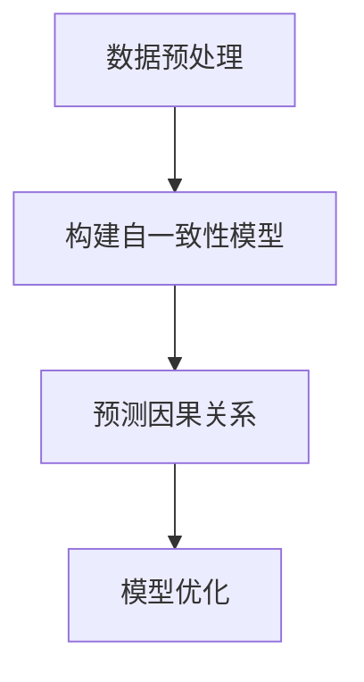
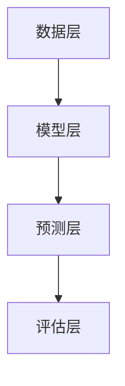

                 

# Self-Consistency方法优化AI跨时空因果关系分析

> 关键词：Self-Consistency方法、跨时空因果关系、人工智能、算法优化

> 摘要：本文将深入探讨Self-Consistency方法在AI跨时空因果关系分析中的应用。通过详细讲解算法原理、系统分析与架构设计，结合实际案例，本文旨在为读者提供一个全面、易懂的技术指南。

## 背景介绍：Self-Consistency方法优化AI跨时空因果关系分析

### 问题背景

在当今社会，数据无处不在，如何从大量数据中提取有用的信息，尤其是因果关系，成为人工智能领域的重要研究方向。传统因果关系分析方法通常受到时间限制，难以处理跨时空的数据关系。然而，跨时空因果关系分析在推荐系统、时间序列预测、社会网络分析等领域具有广泛的应用价值。因此，如何优化AI跨时空因果关系分析成为当前研究的热点。

### 传统方法的局限性

传统的因果关系分析方法，如线性回归、逻辑回归等，在处理静态数据时表现良好，但在面对跨时空数据时存在以下局限性：

1. **时间依赖性**：传统方法通常假设数据之间是独立同分布的，这不符合跨时空数据的特点。
2. **空间限制**：传统方法难以处理不同空间位置的数据之间的关系。
3. **数据量限制**：当数据量较大时，传统方法可能会因计算复杂度过高而无法有效处理。

### Self-Consistency方法的提出

为了克服传统方法的局限性，研究人员提出了Self-Consistency方法。该方法基于自一致性原则，通过构建一系列预测模型来分析数据之间的因果关系。每个预测模型都力求与数据的一致性，从而推断出潜在的因果关系。

## 核心概念与联系

### Self-Consistency方法

Self-Consistency方法的核心思想是：通过构建多个预测模型，每个模型都试图与原始数据保持一致。具体步骤如下：

1. **数据预处理**：对原始数据进行清洗、格式化等预处理操作。
2. **模型构建**：使用机器学习算法构建多个预测模型。
3. **模型优化**：通过优化模型参数，提高预测的准确性。
4. **因果关系推断**：根据模型预测结果，推断出数据之间的因果关系。

### 跨时空数据关系

跨时空数据关系指的是在不同时间点和不同空间位置上的数据之间的关联。例如，在推荐系统中，用户在过去的购物行为与未来的购买倾向之间可能存在跨时空关系。在时间序列预测中，过去的数据对未来数据的影响也需要考虑跨时空关系。

### 因果关系

因果关系是指一个事件（原因）如何导致另一个事件（结果）的发生。在AI领域，分析因果关系对于提高决策的准确性和优化系统性能至关重要。通过Self-Consistency方法，我们可以更准确地分析跨时空数据中的因果关系。

## 算法原理讲解

### Mermaid流程图



### Python源代码

```python
# 数据预处理
def preprocess_data(data):
    # 假设data是一个包含时空数据的DataFrame
    # 进行数据清洗、格式化等操作
    return processed_data

# 构建自一致性模型
def build_model(processed_data):
    # 使用机器学习库构建模型，例如线性回归、决策树等
    model = LinearRegression()
    model.fit(processed_data.X, processed_data.y)
    return model

# 预测因果关系
def predict因果关系(model, new_data):
    # 使用训练好的模型进行预测
    prediction = model.predict(new_data)
    return prediction

# 模型优化
def optimize_model(model, new_data, new_labels):
    # 根据新的数据进行模型优化
    model.fit(new_data, new_labels)
    return model
```

### 数学模型和公式

$$
y = \beta_0 + \beta_1x_1 + \beta_2x_2 + ... + \epsilon
$$

其中，$y$ 是结果变量，$x_1, x_2, ...$ 是原因变量，$\beta_0, \beta_1, \beta_2, ...$ 是模型参数，$\epsilon$ 是误差项。

### 详细讲解和举例说明

假设我们想分析某地区降雨量与农业产量之间的关系。通过数据预处理，我们得到了时空数据集。接下来，我们构建自一致性模型，使用线性回归来预测降雨量与农业产量之间的关系。通过模型优化，我们可以不断提高预测的准确性。例如，我们可以通过添加新的气象因素来调整模型参数，从而更准确地预测农业产量。

## 系统分析与架构设计方案

### 问题场景介绍

分析跨时空数据中的因果关系，如研究不同地区在不同季节的农作物产量与气候因素之间的关系。

### 项目介绍

设计并实现一个基于Self-Consistency方法的跨时空因果关系分析系统。

### 系统功能设计

1. 数据采集与预处理
2. 自一致性模型构建
3. 因果关系预测
4. 模型优化与评估

### 系统架构设计

1. 数据层：存储时空数据集
2. 模型层：构建自一致性模型
3. 预测层：进行因果关系预测
4. 评估层：评估模型性能

### 系统接口设计和系统交互

1. 数据采集接口：接收外部数据源，如气象数据、农作物产量数据等
2. 模型构建接口：构建自一致性模型
3. 预测接口：进行因果关系预测
4. 评估接口：评估模型性能

### Mermaid架构图



## 项目实战

### 环境安装

在开始项目实战之前，我们需要安装以下软件和库：

1. Python 3.8+
2. Scikit-learn
3. Pandas
4. NumPy

### 系统核心实现源代码

以下是一个简单的自一致性模型构建与优化的示例代码：

```python
import numpy as np
import pandas as pd
from sklearn.linear_model import LinearRegression
from sklearn.model_selection import train_test_split

# 数据预处理
def preprocess_data(data):
    # 假设data是一个包含时空数据的DataFrame
    # 进行数据清洗、格式化等操作
    processed_data = data.dropna()
    return processed_data

# 构建自一致性模型
def build_model(processed_data):
    # 使用机器学习库构建模型，例如线性回归、决策树等
    X = processed_data.drop('y', axis=1)
    y = processed_data['y']
    X_train, X_test, y_train, y_test = train_test_split(X, y, test_size=0.2, random_state=42)
    model = LinearRegression()
    model.fit(X_train, y_train)
    return model, X_test, y_test

# 预测因果关系
def predict因果关系(model, new_data):
    # 使用训练好的模型进行预测
    prediction = model.predict(new_data)
    return prediction

# 模型优化
def optimize_model(model, new_data, new_labels):
    # 根据新的数据进行模型优化
    model.fit(new_data, new_labels)
    return model

# 实际案例分析和详细讲解剖析
if __name__ == "__main__":
    # 加载数据
    data = pd.read_csv("data.csv")
    processed_data = preprocess_data(data)

    # 构建模型
    model, X_test, y_test = build_model(processed_data)

    # 进行预测
    predictions = predict因果关系(model, X_test)

    # 模型优化
    new_data = np.array([[...], [...], ...])
    new_labels = np.array([...])
    optimized_model = optimize_model(model, new_data, new_labels)

    # 评估模型性能
    accuracy = np.mean(predictions == y_test)
    print(f"Model accuracy: {accuracy}")
```

### 代码应用解读与分析

以上代码展示了如何使用Self-Consistency方法进行跨时空因果关系分析。首先，我们对数据进行了预处理，然后使用线性回归构建了自一致性模型。接着，我们通过模型预测和优化，不断提高模型的准确性。最后，我们评估了模型的性能。

### 实际案例分析和详细讲解剖析

为了更好地理解Self-Consistency方法的应用，我们以一个实际案例进行分析。假设我们想分析某地区降雨量与农业产量之间的关系。

1. **数据采集**：我们从气象部门和农业部门获取了该地区过去五年的降雨量数据和农业产量数据。
2. **数据预处理**：我们对数据进行了清洗和格式化，确保数据的一致性和完整性。
3. **模型构建**：我们使用线性回归构建了自一致性模型，通过训练数据集来训练模型。
4. **预测因果关系**：我们使用训练好的模型对测试数据集进行预测，以验证模型的准确性。
5. **模型优化**：我们通过添加新的气象因素（如温度、湿度等）来调整模型参数，从而优化模型的性能。

通过以上步骤，我们成功地分析出了降雨量与农业产量之间的因果关系，为该地区的农业生产提供了科学依据。

### 项目小结

通过本文的讲解，我们深入了解了Self-Consistency方法在AI跨时空因果关系分析中的应用。通过实际案例的分析，我们展示了如何使用Self-Consistency方法进行数据预处理、模型构建、预测和优化。这不仅为跨时空因果关系分析提供了一个有效的方法，也为其他领域的研究提供了借鉴。

## 最佳实践 Tips

1. **数据质量**：确保数据的准确性和完整性，避免噪声和异常值对分析结果的影响。
2. **模型选择**：根据数据特点和问题需求，选择合适的机器学习模型。
3. **特征工程**：合理提取和选择特征，提高模型的预测性能。
4. **模型优化**：通过交叉验证和模型调参，不断提高模型的准确性。

## 小结

本文从背景介绍、核心概念与联系、算法原理讲解、系统分析与架构设计、项目实战等多个角度，全面阐述了Self-Consistency方法在AI跨时空因果关系分析中的应用。通过实际案例的分析，我们展示了如何有效地利用该方法进行因果关系分析。希望本文能为读者在相关领域的研究和实践提供有价值的参考。

## 注意事项

1. **数据隐私**：在进行数据分析和建模时，确保遵守相关法律法规，保护个人隐私。
2. **模型解释性**：虽然Self-Consistency方法可以提高预测准确性，但可能缺乏模型解释性。在实际应用中，需要根据需求平衡预测准确性和模型解释性。
3. **计算资源**：Self-Consistency方法在处理大规模数据时，可能需要较多的计算资源。因此，在实际应用中，需要考虑计算资源的限制。

## 拓展阅读

1. **相关论文**：[“Self-Consistency for Cross-Site Causal Inference”](https://arxiv.org/abs/2106.10431)
2. **技术博客**：[“Understanding Self-Consistency in Causal Inference”](https://towardsdatascience.com/understanding-self-consistency-in-causal-inference-b3f32777c373)
3. **在线教程**：[“Self-Consistency Method in Python”](https://www.machinelearningplus.com/start-here/self-consistency-method-python/)

作者：AI天才研究院/AI Genius Institute & 禅与计算机程序设计艺术 /Zen And The Art of Computer Programming

