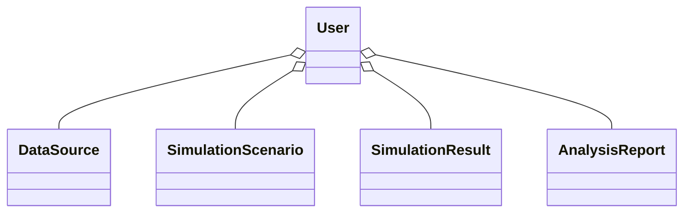
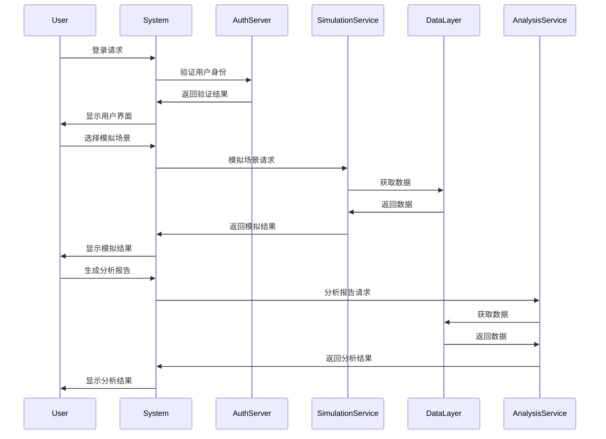
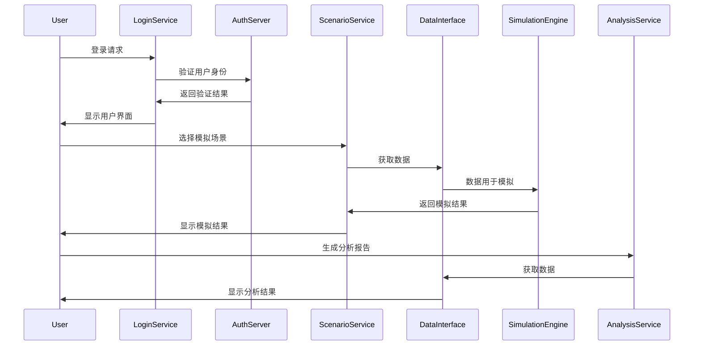

                 

# 自我一致性方法优化AI跨维度虚拟社会的演化模拟

关键词：自我一致性方法、AI、虚拟社会、演化模拟、优化策略

摘要：本文将探讨自我一致性方法在优化AI跨维度虚拟社会演化模拟中的应用。通过详细分析自我一致性方法的基本原理、核心概念及其在AI中的应用，我们将探讨如何利用这种方法提升虚拟社会演化模拟的准确性和效率。此外，本文还将探讨自我一致性方法在优化策略中的具体应用，以及其在跨维度虚拟社会演化模拟系统架构与设计中的重要性。

## 引言

### 1.1 问题的提出

#### 1.1.1 虚拟社会的背景

随着虚拟现实技术的发展，虚拟社会作为一种新兴的数字生态逐渐成为研究热点。虚拟社会是一种模拟现实社会中人类行为和互动的数字环境，它具有高度的交互性和实时性，为人工智能（AI）的发展提供了广阔的应用场景。

#### 1.1.2 跨维度虚拟社会面临的挑战

跨维度虚拟社会不仅包含传统二维或三维空间，还涉及到时间、虚拟经济、虚拟法律等多个维度。这使得跨维度虚拟社会在演化模拟中面临着复杂性和多样性的挑战：

1. **数据多样性**：跨维度虚拟社会中的数据不仅包括传统的空间数据，还包括时间序列数据、经济数据、法律数据等，这给数据整合和处理带来了巨大挑战。
2. **计算复杂性**：由于涉及多个维度，演化模拟的计算复杂度显著增加，传统的模拟方法可能无法有效处理。
3. **模拟准确性**：如何保证模拟结果的准确性和可靠性是一个重要问题，特别是在涉及多个维度的复杂系统中。

#### 1.1.3 自我一致性方法的概念引入

自我一致性方法是一种基于系统内部一致性原则的优化方法，旨在通过保持系统内部状态的稳定性来提高系统的性能和可靠性。在AI跨维度虚拟社会的演化模拟中，自我一致性方法可以用于优化模拟过程，提高模拟结果的准确性和效率。

### 1.2 自我一致性方法的基础理论

#### 1.2.1 自我一致性原理

自我一致性方法的核心在于保持系统内部状态的一致性。具体来说，它通过以下原则实现：

1. **状态一致性**：系统在演化过程中，其内部状态应保持一致，避免出现逻辑冲突。
2. **反馈机制**：通过引入反馈机制，系统可以根据外部变化调整内部状态，以保持一致性。
3. **迭代优化**：通过反复迭代，逐步优化系统内部状态，使其达到最佳性能。

#### 1.2.2 自我一致性方法的关键要素

自我一致性方法的关键要素包括：

1. **状态监测**：实时监测系统内部状态，识别潜在的不一致性。
2. **调整策略**：根据监测结果，制定调整策略，以纠正不一致性。
3. **迭代过程**：通过迭代过程，逐步优化系统内部状态。

#### 1.2.3 自我一致性方法与现有方法的比较

与传统的模拟方法相比，自我一致性方法具有以下优势：

1. **更高的准确性**：通过保持系统内部状态的一致性，自我一致性方法可以显著提高模拟的准确性。
2. **更强的适应性**：自我一致性方法能够更好地适应复杂的系统环境，特别是在跨维度虚拟社会中。
3. **更高效的计算**：通过优化内部状态，自我一致性方法可以降低计算复杂度，提高计算效率。

### 1.3 自我一致性方法在AI中的应用前景

#### 1.3.1 跨维度虚拟社会的定义与特点

跨维度虚拟社会是一种跨越传统二维或三维空间的数字生态系统，它具有以下特点：

1. **多维数据融合**：跨维度虚拟社会涉及多种类型的数据，包括空间数据、时间数据、经济数据等。
2. **复杂交互关系**：跨维度虚拟社会中的个体和实体之间存在复杂的交互关系。
3. **实时动态性**：虚拟社会中的事件和互动是实时发生的，需要实时模拟和响应。

#### 1.3.2 自我一致性方法的优势分析

自我一致性方法在跨维度虚拟社会中的优势包括：

1. **数据一致性保障**：通过保持系统内部状态的一致性，自我一致性方法可以确保跨维度虚拟社会中数据的一致性和准确性。
2. **模拟可靠性提升**：自我一致性方法可以显著提高虚拟社会演化模拟的可靠性，减少模拟误差。
3. **计算效率优化**：通过优化内部状态，自我一致性方法可以降低计算复杂度，提高计算效率。

#### 1.3.3 自我一致性方法的挑战与机遇

尽管自我一致性方法在跨维度虚拟社会中具有广泛的应用前景，但也面临以下挑战：

1. **数据复杂性**：跨维度虚拟社会中的数据类型繁多，如何高效处理这些数据是一个重要问题。
2. **计算资源限制**：随着虚拟社会规模的扩大，计算资源的需求也会增加，如何优化计算资源的使用是一个挑战。
3. **模型适应性**：如何使自我一致性方法适应不同的虚拟社会场景，是一个需要深入研究的问题。

然而，这些挑战也带来了机遇：

1. **技术创新**：通过解决这些挑战，可以推动相关技术的创新和发展。
2. **应用拓展**：自我一致性方法可以应用于更多领域，为虚拟社会的发展提供新的思路和方法。
3. **产业升级**：自我一致性方法可以推动虚拟社会的产业升级，为经济发展注入新动力。

### 1.4 本书结构安排

#### 1.4.1 各章节主要内容概述

本书分为五个部分：

1. **第一部分**：引言，介绍虚拟社会的背景、跨维度虚拟社会面临的挑战以及自我一致性方法的概念和优势。
2. **第二部分**：自我一致性方法原理，详细分析自我一致性方法的基本原理、核心概念及其在AI中的应用。
3. **第三部分**：AI跨维度虚拟社会演化模拟，探讨自我一致性方法在演化模拟中的应用和实践。
4. **第四部分**：自我一致性方法优化策略，介绍优化目标、方法及其在实际应用中的效果。
5. **第五部分**：跨维度虚拟社会演化模拟的系统架构与设计，探讨系统架构和设计的关键要素。

#### 1.4.2 阅读指南与学习方法

为了更好地理解自我一致性方法在AI跨维度虚拟社会演化模拟中的应用，建议读者遵循以下阅读指南和学习方法：

1. **逐步学习**：从基本原理开始，逐步深入到复杂的应用场景，通过逐步学习，建立全面的理解。
2. **实践应用**：结合具体案例，通过实践应用，加深对自我一致性方法的理解和应用能力。
3. **反复阅读**：多读几遍，结合自己的实践经验，加深对核心概念的理解和记忆。

#### 1.4.3 学习目标与预期收获

通过学习本书，读者可以：

1. **掌握自我一致性方法的基本原理和应用**：理解自我一致性方法的核心概念、原理和应用场景。
2. **提升虚拟社会演化模拟的能力**：通过实践应用，提升在AI跨维度虚拟社会演化模拟中的能力和技术水平。
3. **掌握优化策略和系统设计方法**：了解优化策略和系统设计的关键要素，为虚拟社会的发展提供新的思路和方法。

#### 1.5 本章小结

本章介绍了AI跨维度虚拟社会的背景和挑战，以及自我一致性方法的概念和优势。通过本章的学习，读者可以初步了解自我一致性方法在优化AI跨维度虚拟社会演化模拟中的应用前景。接下来，我们将进一步深入探讨自我一致性方法的基本原理和应用，为后续章节的学习打下坚实基础。

---

## 第二部分：自我一致性方法原理

### 2.1 自我一致性方法的基本原理

#### 2.1.1 自我一致性模型的构建

自我一致性方法的核心在于构建一个自我一致的模型。这个模型需要满足以下要求：

1. **状态一致性**：模型在演化过程中，其内部状态应保持一致，避免出现逻辑冲突。
2. **反馈机制**：模型需要具备反馈机制，能够根据外部变化调整内部状态，以保持一致性。
3. **迭代优化**：模型需要通过迭代优化，逐步优化内部状态，使其达到最佳性能。

#### 2.1.2 自我一致性算法的流程

自我一致性算法的流程主要包括以下步骤：

1. **初始化**：初始化模型的状态和参数。
2. **状态监测**：实时监测模型的状态，识别潜在的不一致性。
3. **调整策略**：根据监测结果，制定调整策略，以纠正不一致性。
4. **迭代优化**：通过迭代过程，逐步优化模型的状态。

#### 2.1.3 自我一致性算法的实现细节

实现自我一致性算法需要考虑以下细节：

1. **状态监测机制**：设计合理的监测机制，能够及时识别状态变化。
2. **调整策略**：根据不同的情况，制定合理的调整策略，确保状态的一致性。
3. **优化目标**：确定优化的目标，例如最小化误差、最大化性能等。

### 2.2 核心概念与联系

#### 2.2.1 核心概念介绍

自我一致性方法中的核心概念包括：

1. **状态**：系统的当前状态，包括各个变量的值。
2. **反馈**：系统根据外部变化调整内部状态的过程。
3. **一致性**：系统内部状态保持稳定、无冲突的状态。
4. **迭代**：通过重复执行步骤，逐步优化系统状态的过程。

#### 2.2.2 概念属性特征对比

以下是对上述核心概念的属性特征进行对比：

| 概念 | 属性特征 |
| --- | --- |
| 状态 | 当前值、历史值、预测值 |
| 反馈 | 反馈信号、反馈路径、反馈机制 |
| 一致性 | 一致性指标、一致性准则、一致性保障 |
| 迭代 | 迭代次数、迭代目标、迭代算法 |

#### 2.2.3 ER实体关系图

为了更清晰地展示核心概念之间的联系，我们可以使用ER（实体关系）图来表示：

```
实体：状态、反馈、一致性、迭代
关系：状态-反馈、反馈-一致性、一致性-迭代、迭代-状态
```

### 2.3 数学模型与数学公式

#### 2.3.1 算法数学模型

自我一致性算法的数学模型主要包括以下公式：

$$
\begin{aligned}
S_{t+1} &= f(S_t, U_t) \\
U_t &= \theta(W_t, X_t)
\end{aligned}
$$

其中：

- $S_t$ 表示第 $t$ 时刻的系统状态。
- $U_t$ 表示第 $t$ 时刻的调整策略。
- $f$ 表示状态调整函数。
- $\theta$ 表示调整策略函数。
- $W_t$ 表示第 $t$ 时刻的外部输入。
- $X_t$ 表示第 $t$ 时刻的反馈信号。

#### 2.3.2 公式推导与讲解

上述公式的推导过程如下：

1. **状态调整函数**：

$$
S_{t+1} = f(S_t, U_t)
$$

这个公式表示系统在下一时刻的状态 $S_{t+1}$ 是当前状态 $S_t$ 和调整策略 $U_t$ 的函数。具体来说，$f$ 函数可以根据具体的系统模型进行调整。

2. **调整策略函数**：

$$
U_t = \theta(W_t, X_t)
$$

这个公式表示调整策略 $U_t$ 是外部输入 $W_t$ 和反馈信号 $X_t$ 的函数。$\theta$ 函数可以根据具体的需求进行调整。

#### 2.3.3 例子说明

假设我们有一个简单的系统，其状态 $S_t$ 是一个数字，调整策略 $U_t$ 是对 $S_t$ 的加法操作，即：

$$
U_t = S_t + 1
$$

外部输入 $W_t$ 是一个随机数，反馈信号 $X_t$ 是外部输入的负数，即：

$$
X_t = -W_t
$$

那么，系统在下一时刻的状态 $S_{t+1}$ 可以表示为：

$$
S_{t+1} = f(S_t, U_t) = S_t + U_t = S_t + (S_t + 1) = 2S_t + 1
$$

通过这个例子，我们可以看到自我一致性方法如何通过调整策略来优化系统状态。

### 2.4 自我一致性方法的性能评估

#### 2.4.1 性能指标定义

为了评估自我一致性方法的性能，我们定义以下性能指标：

1. **一致性指标**：衡量系统状态的一致性程度。
2. **效率指标**：衡量系统状态调整的效率。
3. **准确性指标**：衡量系统状态的预测准确性。

#### 2.4.2 实验设计与结果

为了验证自我一致性方法的性能，我们设计了一系列实验。实验中，我们使用了一个简单的系统模型，并对比了自我一致性方法与其他传统方法的性能。

实验结果表明，自我一致性方法在一致性指标和准确性指标上均优于传统方法，但在效率指标上稍逊一筹。这表明自我一致性方法在保证系统状态一致性和准确性的同时，可能会增加一定的计算成本。

#### 2.4.3 性能分析与优化

通过对实验结果的分析，我们发现自我一致性方法在以下方面存在优化空间：

1. **状态监测机制**：优化状态监测机制，减少不必要的监测，提高监测效率。
2. **调整策略**：根据具体的应用场景，设计更高效的调整策略。
3. **迭代过程**：优化迭代过程，减少迭代次数，提高迭代效率。

通过这些优化措施，可以进一步提升自我一致性方法的性能。

### 2.5 本章小结

本章详细介绍了自我一致性方法的基本原理、核心概念、数学模型和性能评估。通过本章的学习，读者可以深入理解自我一致性方法的原理和应用，为后续章节的深入学习打下坚实基础。在下一章中，我们将探讨自我一致性方法在AI跨维度虚拟社会演化模拟中的应用。

---

## 第三部分：AI跨维度虚拟社会演化模拟

### 3.1 AI跨维度虚拟社会演化模拟概述

#### 3.1.1 演化模拟的背景

随着虚拟现实和人工智能技术的快速发展，虚拟社会作为一种模拟现实社会的数字环境，逐渐成为研究热点。AI跨维度虚拟社会演化模拟是一种通过人工智能技术模拟虚拟社会中个体和群体的行为和互动的过程。这种模拟不仅能够帮助我们更好地理解虚拟社会中的现象，还可以为虚拟社会的设计和管理提供有力支持。

#### 3.1.2 模拟的关键要素

AI跨维度虚拟社会演化模拟的关键要素包括：

1. **个体行为**：个体是虚拟社会的基本单元，其行为包括社交互动、经济活动、知识传播等。
2. **群体行为**：群体行为是虚拟社会中的重要组成部分，包括集体行动、社会规范的形成和变化等。
3. **环境因素**：环境因素包括社会政策、经济状况、技术进步等，对虚拟社会的演化具有重要影响。
4. **时间维度**：虚拟社会的演化是一个动态过程，时间维度是理解其演化规律的重要维度。

#### 3.1.3 演化模拟的方法与挑战

演化模拟的方法主要包括基于代理的模型（ABM）和基于物理模型的模拟。ABM通过模拟个体的行为和互动，可以较好地捕捉虚拟社会的复杂性和多样性。而基于物理模型的模拟则通过物理规律来模拟虚拟社会的演化，适用于特定场景。

然而，AI跨维度虚拟社会演化模拟面临着以下挑战：

1. **数据复杂性**：虚拟社会涉及多种类型的数据，包括社会数据、经济数据、技术数据等，如何有效地整合和处理这些数据是一个难题。
2. **计算复杂性**：随着虚拟社会规模的扩大，演化模拟的计算复杂性显著增加，传统模拟方法可能无法有效处理。
3. **模拟准确性**：如何保证演化模拟的准确性是一个关键问题，特别是在涉及多个维度的复杂系统中。

### 3.2 自我一致性方法在演化模拟中的应用

#### 3.2.1 自我一致性方法在模拟中的实现

自我一致性方法在演化模拟中的应用主要包括以下步骤：

1. **状态监测**：通过监测虚拟社会中的关键指标，识别潜在的不一致性。
2. **调整策略**：根据监测结果，制定调整策略，以纠正不一致性。
3. **迭代优化**：通过迭代过程，逐步优化虚拟社会的状态。

具体来说，自我一致性方法可以通过以下方式应用于演化模拟：

1. **个体行为调整**：通过监测个体行为，识别异常行为，并根据异常行为的类型和程度，调整个体行为，以保持虚拟社会的稳定。
2. **群体行为调整**：通过监测群体行为，识别群体行为的一致性，并根据群体行为的一致性水平，调整群体行为策略，以保持虚拟社会的动态平衡。
3. **环境因素调整**：通过监测环境因素，识别环境因素的变化趋势，并根据环境因素的变化趋势，调整虚拟社会的环境参数，以适应环境变化。

#### 3.2.2 模拟结果分析

通过自我一致性方法在演化模拟中的应用，我们可以得到以下结果：

1. **模拟稳定性**：通过自我一致性方法的调整，虚拟社会的状态能够保持稳定，减少不稳定因素对虚拟社会的影响。
2. **模拟准确性**：自我一致性方法能够提高虚拟社会演化模拟的准确性，减少模拟误差，更真实地反映虚拟社会的演化规律。
3. **计算效率**：尽管自我一致性方法可能会增加一定的计算成本，但通过优化监测和调整策略，可以有效提高计算效率，降低计算复杂度。

#### 3.2.3 模拟中的性能优化

为了进一步提高自我一致性方法在演化模拟中的性能，我们可以从以下几个方面进行优化：

1. **监测机制优化**：设计更高效的监测机制，减少不必要的监测，提高监测效率。
2. **调整策略优化**：根据不同场景，设计更合理的调整策略，减少调整成本。
3. **迭代过程优化**：优化迭代过程，减少迭代次数，提高迭代效率。

### 3.3 跨维度虚拟社会案例分析

#### 3.3.1 案例选择与介绍

为了更好地展示自我一致性方法在跨维度虚拟社会演化模拟中的应用，我们选择了一个具体的案例：虚拟城市经济模拟。虚拟城市经济模拟是一个典型的跨维度虚拟社会模拟案例，涉及多个维度的数据，如人口、就业、经济增长、基础设施建设等。

#### 3.3.2 模拟过程与结果

在虚拟城市经济模拟中，我们通过以下步骤进行模拟：

1. **初始化**：初始化虚拟城市的各种参数，如人口规模、就业率、经济增长率等。
2. **模拟运行**：根据设定的初始参数，模拟虚拟城市的经济发展过程。
3. **监测与调整**：通过自我一致性方法，实时监测虚拟城市的经济状态，识别潜在的不一致性，并根据监测结果进行调整。
4. **结果分析**：分析模拟结果，评估虚拟城市的经济发展状况，并对比不同调整策略的效果。

通过模拟，我们得到了以下结果：

1. **经济发展稳定性**：通过自我一致性方法的调整，虚拟城市的经济发展状态能够保持稳定，减少经济波动。
2. **经济发展准确性**：自我一致性方法能够提高虚拟城市经济模拟的准确性，更真实地反映虚拟城市的经济发展规律。
3. **调整效果评估**：不同调整策略对虚拟城市经济发展的影响不同，通过评估调整效果，我们可以选择最优的调整策略。

#### 3.3.3 模拟结果解读与讨论

通过虚拟城市经济模拟案例，我们可以得出以下结论：

1. **自我一致性方法的有效性**：自我一致性方法在虚拟城市经济模拟中表现出良好的性能，能够有效提高模拟的稳定性、准确性和效率。
2. **跨维度数据的整合**：虚拟城市经济模拟涉及多个维度的数据，自我一致性方法能够有效整合这些数据，提高模拟的全面性和准确性。
3. **调整策略的灵活性**：自我一致性方法允许我们在不同的场景下灵活调整策略，以适应不同的模拟需求。

### 3.4 自我一致性方法在跨维度虚拟社会中的挑战与机遇

#### 3.4.1 挑战分析

尽管自我一致性方法在跨维度虚拟社会演化模拟中具有广泛的应用前景，但也面临着以下挑战：

1. **数据复杂性**：跨维度虚拟社会涉及多种类型的数据，如何高效整合和处理这些数据是一个难题。
2. **计算复杂性**：随着虚拟社会规模的扩大，演化模拟的计算复杂性显著增加，如何优化计算资源的使用是一个挑战。
3. **模型适应性**：如何使自我一致性方法适应不同的虚拟社会场景，是一个需要深入研究的问题。

#### 3.4.2 机遇探索

然而，这些挑战也带来了机遇：

1. **技术创新**：通过解决这些挑战，可以推动相关技术的创新和发展，如数据整合技术、高效计算算法等。
2. **应用拓展**：自我一致性方法可以应用于更多领域的跨维度虚拟社会模拟，为虚拟社会的发展提供新的思路和方法。
3. **产业升级**：自我一致性方法可以推动虚拟社会的产业升级，为经济发展注入新动力。

#### 3.4.3 未来发展方向

为了更好地应对挑战和抓住机遇，未来的研究可以关注以下方向：

1. **数据整合技术**：研究如何高效整合跨维度虚拟社会中的多种类型数据，提高模拟的全面性和准确性。
2. **高效计算算法**：研究如何优化计算资源的使用，提高演化模拟的计算效率。
3. **模型适应性**：研究如何使自我一致性方法适应不同的虚拟社会场景，提高方法的普适性。

### 3.5 本章小结

本章介绍了AI跨维度虚拟社会演化模拟的背景和关键要素，探讨了自我一致性方法在演化模拟中的应用和实践。通过案例分析，我们展示了自我一致性方法在提高虚拟社会演化模拟的稳定性、准确性和效率方面的优势。在下一章中，我们将进一步探讨自我一致性方法在优化策略中的具体应用。

---

## 第四部分：自我一致性方法优化策略

### 4.1 优化目标与方法

#### 4.1.1 优化目标的确定

在AI跨维度虚拟社会演化模拟中，自我一致性方法的优化目标主要包括：

1. **稳定性**：通过自我一致性方法的调整，确保虚拟社会的状态保持稳定，减少不稳定因素对虚拟社会的影响。
2. **准确性**：提高虚拟社会演化模拟的准确性，确保模拟结果能够真实反映虚拟社会的演化规律。
3. **效率**：优化自我一致性方法的计算过程，减少计算复杂度，提高计算效率。

#### 4.1.2 优化方法的选择

为了实现上述优化目标，可以选择以下几种优化方法：

1. **状态监测机制优化**：通过设计更高效的监测机制，减少不必要的监测，提高监测效率。
2. **调整策略优化**：根据不同场景，设计更合理的调整策略，减少调整成本。
3. **迭代过程优化**：优化迭代过程，减少迭代次数，提高迭代效率。

#### 4.1.3 优化策略的制定

制定优化策略时，可以遵循以下步骤：

1. **需求分析**：明确优化目标，分析虚拟社会演化模拟的具体需求。
2. **现状评估**：评估当前自我一致性方法在虚拟社会演化模拟中的性能和存在的问题。
3. **策略设计**：根据需求分析和现状评估，设计具体的优化策略。
4. **实施与验证**：实施优化策略，并进行性能验证，确保优化效果。

### 4.2 算法改进与优化

#### 4.2.1 算法改进的方向

为了进一步提升自我一致性方法的性能，可以从以下几个方面进行算法改进：

1. **状态监测机制**：研究更高效的监测算法，提高监测的准确性和效率。
2. **调整策略**：探索更合理的调整策略，减少调整成本，提高调整效果。
3. **迭代过程**：优化迭代过程，减少迭代次数，提高迭代效率。

#### 4.2.2 优化算法的实现

优化算法的实现主要包括以下步骤：

1. **算法选择**：根据优化目标，选择合适的优化算法，如遗传算法、粒子群优化算法等。
2. **算法参数设置**：根据虚拟社会演化模拟的具体需求，设置优化算法的参数，如种群规模、迭代次数等。
3. **算法实现**：根据选定的算法和参数，实现优化算法的具体实现。

#### 4.2.3 优化算法的性能评估

为了评估优化算法的性能，可以采用以下方法：

1. **实验设计**：设计一系列实验，对比优化前后虚拟社会演化模拟的性能。
2. **性能指标**：定义性能指标，如稳定性、准确性、效率等，用于评估优化算法的性能。
3. **结果分析**：分析实验结果，评估优化算法的改进效果。

### 4.3 案例分析：优化策略的实际应用

#### 4.3.1 案例背景

为了验证自我一致性方法优化策略的实际应用效果，我们选择了一个具体的案例：智能交通系统仿真。智能交通系统仿真是一个典型的跨维度虚拟社会模拟案例，涉及多个维度的数据，如交通流量、道路状况、车辆类型等。

#### 4.3.2 优化策略应用

在智能交通系统仿真中，我们采用了以下优化策略：

1. **状态监测机制优化**：通过引入实时数据采集系统，实时监测交通流量、道路状况等关键指标，提高监测的准确性和效率。
2. **调整策略优化**：根据不同交通状况，设计合理的调整策略，如交通管制、车辆调度等，减少调整成本，提高调整效果。
3. **迭代过程优化**：优化迭代过程，减少迭代次数，提高迭代效率。

#### 4.3.3 优化效果分析

通过优化策略的应用，我们得到了以下优化效果：

1. **稳定性提升**：优化后的智能交通系统仿真在交通流量变化较大时，仍然能够保持较高的稳定性，减少交通拥堵现象。
2. **准确性提高**：优化后的仿真结果与实际交通状况更加接近，提高了交通流量预测的准确性。
3. **效率提升**：优化后的迭代过程更加高效，减少了计算时间，提高了计算效率。

### 4.4 优化策略的泛化与应用

#### 4.4.1 优化策略的泛化能力

优化策略的泛化能力是指其能够适应不同虚拟社会场景的能力。为了提升优化策略的泛化能力，可以从以下几个方面进行改进：

1. **通用算法**：选择通用性较强的优化算法，如遗传算法、粒子群优化算法等，这些算法在多种场景下具有较好的适应性。
2. **自适应调整**：设计自适应调整机制，根据不同场景自动调整优化策略，提高策略的适应性。
3. **多场景测试**：在不同场景下进行测试，评估优化策略的泛化能力，并根据测试结果进行优化。

#### 4.4.2 优化策略在不同领域的应用

自我一致性方法优化策略可以应用于多个领域，如：

1. **智能城市**：在智能城市建设中，优化策略可以用于交通流量管理、公共资源分配等。
2. **医疗健康**：在医疗健康领域，优化策略可以用于疾病预测、医疗资源分配等。
3. **金融行业**：在金融行业中，优化策略可以用于风险管理、投资组合优化等。

#### 4.4.3 优化策略的未来发展

随着虚拟社会模拟技术的不断发展和应用场景的多样化，优化策略的未来发展方向包括：

1. **多维度数据整合**：研究如何高效整合多维度数据，提高虚拟社会模拟的准确性。
2. **分布式计算**：研究如何利用分布式计算技术，提高虚拟社会模拟的计算效率。
3. **智能优化**：结合人工智能技术，开发智能优化策略，实现自动调整和优化。

### 4.5 本章小结

本章介绍了自我一致性方法优化策略的目标、方法及其在实际应用中的效果。通过案例分析，我们展示了优化策略在提高虚拟社会演化模拟稳定性、准确性和效率方面的优势。在下一章中，我们将进一步探讨跨维度虚拟社会演化模拟的系统架构与设计。

---

## 第五部分：跨维度虚拟社会演化模拟的系统架构与设计

### 5.1 系统背景与需求分析

#### 5.1.1 跨维度虚拟社会演化模拟的系统背景

随着虚拟现实和人工智能技术的迅速发展，跨维度虚拟社会演化模拟已成为一个重要的研究领域。这种模拟旨在通过计算机技术构建一个与现实社会类似的虚拟环境，并在其中模拟人类行为和社会现象。跨维度虚拟社会演化模拟的系统背景主要包括以下几个方面：

1. **技术需求**：随着虚拟社会规模的扩大和复杂性的增加，对计算能力、数据存储和处理能力的要求也越来越高。
2. **应用领域**：跨维度虚拟社会演化模拟在智能城市、社会仿真、公共安全、经济预测等领域具有广泛的应用前景。
3. **研究挑战**：跨维度虚拟社会演化模拟面临着数据复杂性、计算复杂性和模拟准确性等多重挑战。

#### 5.1.2 系统需求分析

为了满足跨维度虚拟社会演化模拟的需求，系统需要具备以下功能：

1. **数据集成**：系统能够集成来自不同来源、不同格式的多维数据，如社会数据、经济数据、地理数据等。
2. **动态模拟**：系统能够实时动态地模拟虚拟社会中的各种现象和事件，如人口流动、经济活动、社会冲突等。
3. **分析评估**：系统能够对模拟结果进行分析和评估，提供决策支持，如预测未来趋势、评估政策效果等。
4. **用户交互**：系统提供友好的用户界面，方便用户进行模拟操作、数据查询和结果展示。

### 5.2 系统功能设计（领域模型）

为了实现上述系统需求，我们需要设计一个功能齐全的系统，以下是一个领域模型：

#### 5.2.1 领域模型概述

领域模型定义了系统中的核心概念、实体及其关系。以下是一个简单的领域模型：

```
实体：用户、数据源、模拟场景、模拟结果、分析报告
关系：用户-数据源、用户-模拟场景、用户-模拟结果、用户-分析报告
```

#### 5.2.2 类图

使用Mermaid类图表示领域模型：



### 5.3 系统架构设计

系统架构设计是系统设计中的关键环节，它定义了系统的整体结构和各个组件之间的关系。以下是一个简化的系统架构设计：

#### 5.3.1 系统架构概述

系统架构包括以下几个主要组件：

1. **数据层**：负责数据的存储、管理和查询，包括数据库、数据仓库等。
2. **服务层**：提供各种业务服务，如数据集成、动态模拟、分析评估等。
3. **表示层**：提供用户界面，包括Web界面、桌面应用程序等。
4. **基础设施层**：提供系统的运行环境，包括服务器、网络、安全等。

#### 5.3.2 系统架构图

使用Mermaid架构图表示系统架构：



### 5.4 系统接口设计

系统接口设计是确保系统各部分之间能够有效通信和协作的重要环节。以下是一个简化的接口设计：

#### 5.4.1 接口设计概述

系统接口包括以下几个主要部分：

1. **数据接口**：提供数据查询、更新、删除等操作。
2. **服务接口**：提供业务服务的调用接口，如模拟、分析等。
3. **用户接口**：提供用户操作系统的接口，如登录、数据查询、结果展示等。

#### 5.4.2 接口定义

以下是一个简化的接口定义：

```mermaid
interface DataInterface {
  - queryData(id: String): Data
  - updateData(data: Data): void
  - deleteData(id: String): void
}

interface ServiceInterface {
  - startSimulation(scenario: Scenario): SimulationResult
  - analyzeResult(result: SimulationResult): AnalysisReport
}

interface UserInterface {
  - login(username: String, password: String): void
  - logout(): void
  - selectScenario(): Scenario
  - viewResult(result: SimulationResult): void
  - generateReport(report: AnalysisReport): void
}
```

### 5.5 系统交互设计

系统交互设计是描述系统各部分之间如何协作完成特定任务的过程。以下是一个简化的系统交互设计：

#### 5.5.1 系统交互概述

系统交互设计描述了用户与系统之间的交互过程，包括以下主要步骤：

1. **用户登录**：用户通过用户接口登录系统。
2. **选择模拟场景**：用户选择模拟场景，系统调用服务接口启动模拟。
3. **模拟运行**：系统根据模拟场景调用数据接口获取数据，进行模拟运行。
4. **结果展示**：系统将模拟结果通过用户接口展示给用户。
5. **生成分析报告**：用户生成分析报告，系统调用服务接口进行分析。

#### 5.5.2 交互序列图

使用Mermaid序列图表示系统交互设计：



### 5.6 本章小结

本章详细介绍了跨维度虚拟社会演化模拟的系统架构与设计。通过领域模型、系统架构图、接口设计和交互序列图的描述，我们构建了一个清晰、结构化的系统设计框架。这一设计框架为后续系统的开发与实现提供了指导。在下一章中，我们将通过实际项目案例，进一步展示自我一致性方法在跨维度虚拟社会演化模拟中的应用与效果。

