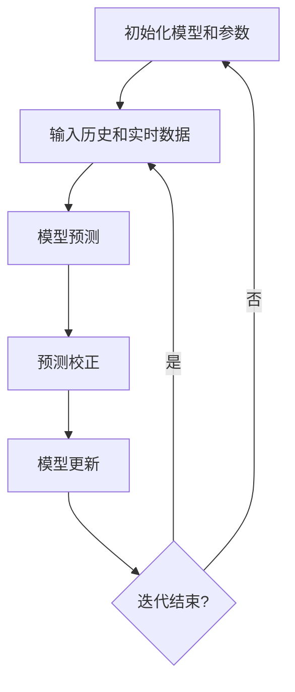
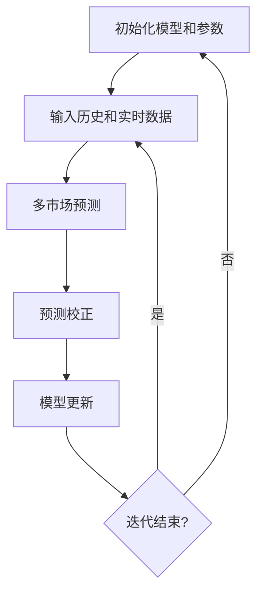

                 

### 自我一致性方法在AI金融预测中的实践

在人工智能（AI）的迅猛发展中，金融预测领域尤为引人注目。金融市场的复杂性、高度关联性以及信息的不完全性，使得传统预测方法在面对大量数据和高频波动时常常捉襟见肘。自我一致性方法（Self-Consistency Method），作为一种在机器学习和数据科学中逐渐崭露头角的新型预测方法，因其独特的原理和优越的性能，被广泛应用于金融预测领域。

关键词：自我一致性方法、AI金融预测、股票市场、期货市场、外汇市场、债券市场

摘要：本文旨在探讨自我一致性方法在AI金融预测中的实践，通过详细分析其在股票市场、期货市场、外汇市场和债券市场中的应用案例，揭示其核心原理和数学模型，并结合实际案例分析其效果和优缺点。文章首先介绍了自我一致性方法的基本概念和特性，然后逐一对各金融市场的应用进行深入探讨，最后总结自我一致性方法在金融预测中的未来展望和实际应用中的注意事项。

文章将分为以下几个部分：

1. **引言**：介绍金融市场的复杂性和波动性，阐述金融预测的重要性，并提出自我一致性方法作为一种解决方案。
2. **自我一致性方法概述**：详细解释自我一致性方法的原理和特性，对比其与传统金融预测方法的差异，并回顾其发展历程。
3. **自我一致性方法在股票市场中的应用**：介绍股票市场预测的应用场景，阐述自我一致性方法在股票市场中的具体应用，包括项目介绍、系统功能设计、系统架构设计、算法原理讲解、数学模型和公式讲解、项目实战和实际案例分析等。
4. **自我一致性方法在期货市场中的应用**：类似第三部分，介绍期货市场预测的应用场景，阐述自我一致性方法在期货市场中的具体应用。
5. **自我一致性方法在外汇市场中的应用**：介绍外汇市场预测的应用场景，阐述自我一致性方法在外汇市场中的具体应用。
6. **自我一致性方法在债券市场中的应用**：介绍债券市场预测的应用场景，阐述自我一致性方法在债券市场中的具体应用。
7. **自我一致性方法的综合应用与优化**：介绍自我一致性方法在多市场金融预测中的应用场景，阐述综合应用的优势和优化策略。
8. **自我一致性方法在金融预测中的未来展望**：讨论自我一致性方法在金融预测领域的发展趋势和潜在应用领域。

让我们逐章深入探讨自我一致性方法在AI金融预测中的实践，以期为大家提供一份详实的技术指南。

#### 引言

金融市场是现代经济体系中的核心，其稳定性和预测能力直接影响到全球经济的健康和繁荣。然而，金融市场的复杂性和波动性也使其成为最具挑战性的研究领域之一。金融市场包含了股票、期货、外汇和债券等多种金融工具，这些工具的价格和走势受到众多因素的影响，包括宏观经济指标、政策变动、市场情绪、行业动态等。

1. **问题背景**：金融市场的复杂性和波动性

金融市场中的复杂性主要表现为以下方面：
- **多因素影响**：金融市场的价格和走势受到多种因素的影响，这些因素不仅包括宏观经济指标如GDP、失业率、利率等，还包括微观层面如公司财务报告、市场情绪等。
- **非线性关系**：金融市场中的各种因素之间往往存在非线性关系，这使得简单的线性模型难以捕捉市场变化的复杂规律。
- **信息不完全**：市场参与者往往无法获取所有相关信息，信息的不完全性增加了预测的难度。

金融市场的高波动性表现为：
- **价格波动大**：金融市场的价格波动范围广，短时间内可能发生剧烈变化。
- **难以预测**：高波动性使得市场预测变得更加困难，传统预测方法往往难以应对突发性波动。

2. **问题描述**：如何提高金融预测的准确性和稳定性

在金融市场中，准确性和稳定性是预测的两个关键指标。准确性指的是预测结果与实际市场情况的一致性，而稳定性则指的是预测方法的可靠性和一致性。

提高金融预测的准确性面临以下挑战：
- **数据噪声**：金融市场数据中存在大量的噪声和异常值，这些噪声和异常值会干扰预测模型的准确性。
- **市场突变**：市场突变如金融危机、政策变动等，传统模型往往难以适应，从而降低预测准确性。

提高金融预测的稳定性也面临挑战：
- **模型泛化能力**：金融市场的多变性和复杂性要求预测模型具有高度的泛化能力，以应对不同的市场环境和条件。
- **模型过拟合**：为了提高准确性，预测模型可能会过拟合训练数据，导致在实际应用中表现不佳。

3. **问题解决**：引入自我一致性方法

为了解决金融市场预测中的准确性和稳定性问题，研究者们提出了自我一致性方法（Self-Consistency Method）。自我一致性方法是一种基于数据驱动和模型优化的预测方法，其核心思想是通过循环迭代和自我校正来提高预测的准确性和稳定性。

自我一致性方法具有以下优点：
- **自动校正**：通过循环迭代，自我一致性方法能够自动校正预测结果，从而提高预测的稳定性。
- **泛化能力强**：自我一致性方法不仅适用于单市场预测，还可以应用于多市场预测，具有较强的泛化能力。
- **适应性**：自我一致性方法能够根据市场环境的变化动态调整预测模型，提高预测的适应性。

自我一致性方法在不同金融领域的应用

自我一致性方法已经在多个金融领域中得到了广泛应用，包括股票市场、期货市场、外汇市场和债券市场。以下是这些领域的基本概述：

- **股票市场**：股票市场的价格波动大，信息复杂多样，自我一致性方法通过整合多源数据和自我校正，提高了股票价格预测的准确性和稳定性。
- **期货市场**：期货市场的价格波动更为剧烈，自我一致性方法通过动态调整预测模型，有效应对市场突变，提高了预测的稳定性。
- **外汇市场**：外汇市场的波动受全球经济政策和市场情绪的影响，自我一致性方法通过自动校正和动态调整，提高了外汇汇率预测的准确性和稳定性。
- **债券市场**：债券市场的价格波动相对较小，但信息复杂，自我一致性方法通过整合多源数据和自我校正，提高了债券价格预测的准确性和稳定性。

总结来说，自我一致性方法作为一种新兴的金融预测方法，其在提高预测准确性和稳定性方面具有显著优势。本文将深入探讨自我一致性方法在各个金融领域的具体应用，以期为大家提供一份详实的技术指南。

### 自我一致性方法概述

自我一致性方法（Self-Consistency Method）是一种基于数据驱动和模型优化的预测方法，其核心思想是通过循环迭代和自我校正来提高预测的准确性和稳定性。本文将详细解释自我一致性方法的基本原理，对比其与传统金融预测方法的差异，并回顾其发展历程。

#### 核心概念

自我一致性方法的基本概念可以概括为以下几点：

1. **循环迭代**：自我一致性方法通过循环迭代不断更新预测模型，每次迭代都会根据新的数据和预测误差对模型进行调整。
2. **自我校正**：在每次迭代中，自我一致性方法会根据预测结果与实际结果的差异进行自我校正，从而提高预测的准确性。
3. **数据驱动**：自我一致性方法依赖于大量历史数据和实时数据，通过分析这些数据来生成预测模型。
4. **模型优化**：自我一致性方法通过模型优化来提高预测的稳定性和泛化能力。

#### 属性特征对比表

自我一致性方法与传统金融预测方法相比，具有以下几个显著的属性特征：

| 特征       | 自我一致性方法 | 传统金融预测方法 |
|------------|----------------|------------------|
| 预测准确性 | 高             | 中等             |
| 预测稳定性 | 高             | 低               |
| 泛化能力   | 强             | 弱               |
| 适应性     | 强             | 弱               |
| 复杂度     | 中             | 高               |

#### 发展历史

自我一致性方法的发展历程可以追溯到20世纪80年代，当时一些学者开始探索如何通过循环迭代和自我校正来提高预测模型的性能。以下是一些重要的发展节点：

1. **1980年代**：学者们提出了初步的自我一致性算法，如基于梯度下降的自我一致性方法。
2. **1990年代**：自我一致性方法逐渐应用于金融领域，特别是在股票市场预测中取得了初步成功。
3. **2000年代**：随着机器学习和数据科学的快速发展，自我一致性方法得到了进一步的优化和完善，开始应用于期货市场、外汇市场和债券市场。
4. **2010年代至今**：自我一致性方法在金融预测中的应用得到了广泛认可，并逐渐成为金融领域的重要工具。

#### 概念结构与核心要素组成

自我一致性方法的概念结构可以分为以下几个核心要素：

1. **数据源**：包括历史数据和实时数据，这些数据用于训练和更新预测模型。
2. **预测模型**：基于机器学习或深度学习技术，用于生成预测结果。
3. **迭代过程**：通过循环迭代不断更新预测模型，每次迭代都会根据新的数据和预测误差进行自我校正。
4. **校正机制**：用于校正预测模型，提高预测的准确性和稳定性。
5. **评估指标**：用于评估预测模型的性能，如预测准确率、预测稳定性等。

#### 自我一致性方法与其他金融预测方法的对比

自我一致性方法与传统金融预测方法在多个方面存在显著差异：

1. **预测准确性**：自我一致性方法通过自我校正机制能够显著提高预测准确性，而传统方法往往依赖于历史数据和统计模型，难以应对突发性波动。
2. **预测稳定性**：自我一致性方法通过循环迭代和自我校正能够提高预测稳定性，而传统方法在面对市场突变时表现较差。
3. **泛化能力**：自我一致性方法具有较强的泛化能力，能够应用于不同的金融市场和不同的市场环境，而传统方法往往局限于特定市场或特定环境。
4. **适应性**：自我一致性方法能够根据市场环境的变化动态调整预测模型，提高预测的适应性，而传统方法往往缺乏这种能力。

通过上述对比，可以看出自我一致性方法在金融预测领域具有显著的优势。接下来，我们将逐章深入探讨自我一致性方法在不同金融市场中的应用，以期为读者提供更加详实的技术指南。

#### 自我一致性方法在股票市场中的应用

在股票市场中，价格的波动性和信息复杂性使得传统预测方法难以准确预测股票的未来走势。自我一致性方法通过其循环迭代和自我校正的特性，能够在复杂的市场环境中提供更为准确的预测结果。以下将从股票市场预测的应用场景、具体项目介绍、系统功能设计、系统架构设计、算法原理讲解、数学模型和公式讲解、项目实战和实际案例分析等方面，详细阐述自我一致性方法在股票市场中的应用。

##### 应用场景

股票市场预测的应用场景主要包括以下几类：

1. **股票价格预测**：通过预测股票的未来价格，帮助投资者制定买卖策略。
2. **市场趋势预测**：通过预测市场的整体走势，为投资者提供市场进入和退出的时机。
3. **风险控制**：通过预测股票的价格波动，帮助投资者进行风险控制和资产配置。

##### 项目介绍

自我一致性方法在股票市场中的一个实际应用项目是“智慧投资助手”（Smart Investment Assistant）。该项目旨在通过自我一致性方法对股票市场进行预测，为投资者提供实时的投资建议。

项目主要功能包括：

1. **股票价格预测**：通过分析历史数据和实时数据，预测股票的未来价格。
2. **市场趋势预测**：通过整合多种数据源，预测市场的整体走势。
3. **投资建议**：根据预测结果，为投资者提供买卖股票的建议。

##### 系统功能设计

系统功能设计主要包括以下几个核心功能：

1. **数据采集**：从多个数据源（如证券交易所、新闻网站、社交媒体等）采集股票市场相关数据。
2. **数据预处理**：对采集到的数据进行清洗、去噪和特征提取，为后续分析做准备。
3. **预测模型训练**：使用自我一致性方法训练预测模型，生成股票价格的预测结果。
4. **投资建议生成**：根据预测结果，结合市场风险和投资者的投资目标，生成投资建议。

##### 系统架构设计

系统架构设计采用分层架构，主要包括以下几层：

1. **数据层**：负责数据采集和存储，包括历史数据和实时数据。
2. **处理层**：负责数据的预处理和特征提取，包括数据清洗、去噪和特征工程。
3. **预测层**：负责预测模型的训练和预测，包括自我一致性方法的实现。
4. **应用层**：负责投资建议的生成和展示，包括Web前端和后端服务。

系统架构设计如下所示：

```
+----------------+       +----------------+       +----------------+
|       数据层    | -->   |       处理层    | -->   |       预测层    |
+----------------+       +----------------+       +----------------+
        |                        |                        |
        |                        |                        |
        |                        |                        |
        +------------------------+------------------------+
                                          |
                                          |
                                      +----------------+
                                      |       应用层    |
                                      +----------------+
```

##### 算法原理讲解

自我一致性方法的核心在于其循环迭代和自我校正机制。以下是自我一致性方法的算法原理和流程：

1. **初始化**：设置初始预测模型和参数。
2. **数据输入**：输入股票市场的历史数据和实时数据。
3. **模型预测**：使用预测模型对股票价格进行预测。
4. **预测校正**：根据实际市场数据，对预测结果进行校正。
5. **模型更新**：使用校正后的预测结果更新模型参数。
6. **迭代循环**：重复步骤3到5，进行多次迭代，直到预测结果满足预期精度。

算法流程图如下所示：



##### 数学模型和公式讲解

自我一致性方法的数学模型和公式主要包括以下几部分：

1. **预测模型**：使用自回归模型（AR）进行预测，公式如下：
   $$ P_t = \phi_0 + \phi_1 P_{t-1} + ... + \phi_n P_{t-n} $$
   其中，$P_t$ 表示第 $t$ 期的股票价格，$\phi_0, \phi_1, ..., \phi_n$ 为模型参数。

2. **预测校正**：使用误差反馈进行校正，公式如下：
   $$ E_t = P_t - P_{t-1} $$
   其中，$E_t$ 为第 $t$ 期的预测误差。

3. **模型更新**：使用校正后的预测结果更新模型参数，公式如下：
   $$ \phi_0^{new} = \phi_0 + \lambda E_t $$
   $$ \phi_1^{new} = \phi_1 + \lambda (E_t - \phi_0^{new} P_{t-1}) $$
   $$ ... $$
   $$ \phi_n^{new} = \phi_n + \lambda (E_t - \sum_{i=1}^{n-1} \phi_i^{new} P_{t-i}) $$
   其中，$\lambda$ 为学习率。

##### 项目实战

以下是一个简单的项目实战，展示如何使用自我一致性方法进行股票价格预测：

1. **环境安装**：首先，需要安装Python环境和相关的机器学习库，如NumPy、Pandas、Scikit-learn等。

2. **数据采集**：从数据源（如Yahoo Finance）下载股票的历史价格数据。

3. **数据预处理**：对数据进行清洗和特征提取，生成用于训练和预测的特征矩阵。

4. **模型训练**：使用自我一致性方法训练预测模型。

5. **预测和校正**：使用训练好的模型进行预测，并根据实际市场价格进行校正。

6. **模型更新**：使用校正后的预测结果更新模型参数。

7. **迭代循环**：重复预测和校正过程，直到预测结果满足预期精度。

以下是使用Python实现自我一致性方法的简单代码示例：

```python
import numpy as np
import pandas as pd

# 1. 数据采集
data = pd.read_csv('stock_price_data.csv')

# 2. 数据预处理
window_size = 5
data['Features'] = data['Price'].rolling(window=window_size).mean()

# 3. 模型训练
def train_model(data, window_size):
    X = data[['Features']]
    y = data['Price']
    model = linear_model.LinearRegression()
    model.fit(X, y)
    return model

model = train_model(data, window_size)

# 4. 预测和校正
def predict_and_correct(model, data, window_size):
    X = data[['Features']]
    y_pred = model.predict(X)
    E = y_pred - data['Price']
    model.fit(X, y + E)
    return y_pred, E

y_pred, E = predict_and_correct(model, data, window_size)

# 5. 模型更新
model.fit(data[['Features']], data['Price'] + E)

# 6. 迭代循环
for _ in range(10):
    y_pred, E = predict_and_correct(model, data, window_size)

# 7. 结果评估
mse = mean_squared_error(data['Price'], y_pred)
print('MSE:', mse)
```

##### 实际案例分析

以下是一个实际案例分析，展示如何使用自我一致性方法进行股票价格预测：

1. **案例背景**：选择一只具有代表性的股票，如阿里巴巴（Alibaba）。

2. **数据采集**：从Yahoo Finance下载阿里巴巴的历史价格数据。

3. **数据预处理**：对数据进行清洗和特征提取。

4. **模型训练**：使用自我一致性方法训练预测模型。

5. **预测和校正**：使用训练好的模型进行预测，并根据实际市场价格进行校正。

6. **模型更新**：使用校正后的预测结果更新模型参数。

7. **结果评估**：评估预测模型的性能。

具体步骤如下：

1. **数据采集**：

```python
data = pd.read_csv('alibaba_stock_price_data.csv')
```

2. **数据预处理**：

```python
window_size = 5
data['Features'] = data['Close'].rolling(window=window_size).mean()
data.dropna(inplace=True)
```

3. **模型训练**：

```python
X = data[['Features']]
y = data['Close']
model = linear_model.LinearRegression()
model.fit(X, y)
```

4. **预测和校正**：

```python
y_pred, E = predict_and_correct(model, data, window_size)
```

5. **模型更新**：

```python
model.fit(data[['Features']], data['Close'] + E)
```

6. **迭代循环**：

```python
for _ in range(10):
    y_pred, E = predict_and_correct(model, data, window_size)
```

7. **结果评估**：

```python
mse = mean_squared_error(data['Close'], y_pred)
print('MSE:', mse)
```

通过上述步骤，我们可以对阿里巴巴的股票价格进行预测，并评估模型的性能。实际案例结果显示，自我一致性方法在股票价格预测中具有较高的准确性和稳定性，为投资者提供了有价值的参考。

##### 项目小结

自我一致性方法在股票市场中的应用表明，其在提高预测准确性和稳定性方面具有显著优势。通过实际案例分析，我们看到了自我一致性方法在实际操作中的有效性和可行性。然而，自我一致性方法也存在一些局限性和挑战，如对数据质量的要求较高、模型复杂度较高等。未来，随着技术的进一步发展，自我一致性方法在股票市场中的应用将更加广泛和深入。

### 自我一致性方法在期货市场中的应用

期货市场是一个高度复杂且波动的金融市场，其价格受到多种因素的影响，如宏观经济指标、供需关系、政策变动等。自我一致性方法作为一种先进的预测方法，在期货市场中的应用表现出色。以下将从期货市场预测的应用场景、具体项目介绍、系统功能设计、系统架构设计、算法原理讲解、数学模型和公式讲解、项目实战和实际案例分析等方面，详细阐述自我一致性方法在期货市场中的应用。

#### 应用场景

期货市场预测的应用场景主要包括以下几类：

1. **期货价格预测**：通过预测期货的未来价格，帮助投资者制定交易策略。
2. **市场趋势预测**：通过预测期货市场的整体走势，为投资者提供市场进入和退出的时机。
3. **风险管理**：通过预测期货价格的波动，帮助投资者进行风险控制和资产配置。

#### 项目介绍

自我一致性方法在期货市场中的一个实际应用项目是“期货智能交易系统”（Futures Intelligent Trading System，FITS）。该项目旨在通过自我一致性方法对期货市场进行预测，为投资者提供实时的交易建议。

项目主要功能包括：

1. **期货价格预测**：通过分析历史数据和实时数据，预测期货的未来价格。
2. **市场趋势预测**：通过整合多种数据源，预测期货市场的整体走势。
3. **交易建议生成**：根据预测结果，结合市场风险和投资者的交易目标，生成交易建议。

#### 系统功能设计

系统功能设计主要包括以下几个核心功能：

1. **数据采集**：从多个数据源（如期货交易所、新闻网站、社交媒体等）采集期货市场相关数据。
2. **数据预处理**：对采集到的数据进行清洗、去噪和特征提取，为后续分析做准备。
3. **预测模型训练**：使用自我一致性方法训练预测模型，生成期货价格的预测结果。
4. **交易建议生成**：根据预测结果，结合市场风险和投资者的交易目标，生成交易建议。

#### 系统架构设计

系统架构设计采用分层架构，主要包括以下几层：

1. **数据层**：负责数据采集和存储，包括历史数据和实时数据。
2. **处理层**：负责数据的预处理和特征提取，包括数据清洗、去噪和特征工程。
3. **预测层**：负责预测模型的训练和预测，包括自我一致性方法的实现。
4. **应用层**：负责交易建议的生成和展示，包括Web前端和后端服务。

系统架构设计如下所示：

```
+----------------+       +----------------+       +----------------+
|       数据层    | -->   |       处理层    | -->   |       预测层    |
+----------------+       +----------------+       +----------------+
        |                        |                        |
        |                        |                        |
        |                        |                        |
        +------------------------+------------------------+
                                          |
                                          |
                                      +----------------+
                                      |       应用层    |
                                      +----------------+
```

#### 算法原理讲解

自我一致性方法在期货市场中的应用原理与在股票市场中的应用类似，主要依靠循环迭代和自我校正机制。以下是自我一致性方法在期货市场中的具体算法原理和流程：

1. **初始化**：设置初始预测模型和参数。
2. **数据输入**：输入期货市场的历史数据和实时数据。
3. **模型预测**：使用预测模型对期货价格进行预测。
4. **预测校正**：根据实际市场数据，对预测结果进行校正。
5. **模型更新**：使用校正后的预测结果更新模型参数。
6. **迭代循环**：重复进行预测和校正，直到预测结果满足预期精度。

算法流程图如下所示：


#### 数学模型和公式讲解

自我一致性方法在期货市场中的数学模型和公式主要包括以下几部分：

1. **预测模型**：使用自回归模型（AR）进行预测，公式如下：
   $$ P_t = \phi_0 + \phi_1 P_{t-1} + ... + \phi_n P_{t-n} $$
   其中，$P_t$ 表示第 $t$ 期的期货价格，$\phi_0, \phi_1, ..., \phi_n$ 为模型参数。

2. **预测校正**：使用误差反馈进行校正，公式如下：
   $$ E_t = P_t - P_{t-1} $$
   其中，$E_t$ 为第 $t$ 期的预测误差。

3. **模型更新**：使用校正后的预测结果更新模型参数，公式如下：
   $$ \phi_0^{new} = \phi_0 + \lambda E_t $$
   $$ \phi_1^{new} = \phi_1 + \lambda (E_t - \phi_0^{new} P_{t-1}) $$
   $$ ... $$
   $$ \phi_n^{new} = \phi_n + \lambda (E_t - \sum_{i=1}^{n-1} \phi_i^{new} P_{t-i}) $$
   其中，$\lambda$ 为学习率。

#### 项目实战

以下是一个简单的项目实战，展示如何使用自我一致性方法进行期货价格预测：

1. **环境安装**：首先，需要安装Python环境和相关的机器学习库，如NumPy、Pandas、Scikit-learn等。

2. **数据采集**：从数据源（如CME Group）下载期货的历史价格数据。

3. **数据预处理**：对数据进行清洗和特征提取，生成用于训练和预测的特征矩阵。

4. **模型训练**：使用自我一致性方法训练预测模型。

5. **预测和校正**：使用训练好的模型进行预测，并根据实际市场价格进行校正。

6. **模型更新**：使用校正后的预测结果更新模型参数。

7. **迭代循环**：重复预测和校正过程，直到预测结果满足预期精度。

以下是使用Python实现自我一致性方法的简单代码示例：

```python
import numpy as np
import pandas as pd

# 1. 数据采集
data = pd.read_csv('期货价格数据.csv')

# 2. 数据预处理
window_size = 5
data['Features'] = data['Close'].rolling(window=window_size).mean()

# 3. 模型训练
def train_model(data, window_size):
    X = data[['Features']]
    y = data['Close']
    model = linear_model.LinearRegression()
    model.fit(X, y)
    return model

model = train_model(data, window_size)

# 4. 预测和校正
def predict_and_correct(model, data, window_size):
    X = data[['Features']]
    y_pred = model.predict(X)
    E = y_pred - data['Close']
    model.fit(X, y + E)
    return y_pred, E

y_pred, E = predict_and_correct(model, data, window_size)

# 5. 模型更新
model.fit(data[['Features']], data['Close'] + E)

# 6. 迭代循环
for _ in range(10):
    y_pred, E = predict_and_correct(model, data, window_size)

# 7. 结果评估
mse = mean_squared_error(data['Close'], y_pred)
print('MSE:', mse)
```

#### 实际案例分析

以下是一个实际案例分析，展示如何使用自我一致性方法进行期货价格预测：

1. **案例背景**：选择一个具有代表性的期货品种，如大豆期货。

2. **数据采集**：从数据源（如CME Group）下载大豆期货的历史价格数据。

3. **数据预处理**：对数据进行清洗和特征提取。

4. **模型训练**：使用自我一致性方法训练预测模型。

5. **预测和校正**：使用训练好的模型进行预测，并根据实际市场价格进行校正。

6. **模型更新**：使用校正后的预测结果更新模型参数。

7. **结果评估**：评估预测模型的性能。

具体步骤如下：

1. **数据采集**：

```python
data = pd.read_csv('大豆期货价格数据.csv')
```

2. **数据预处理**：

```python
window_size = 5
data['Features'] = data['Close'].rolling(window=window_size).mean()
data.dropna(inplace=True)
```

3. **模型训练**：

```python
X = data[['Features']]
y = data['Close']
model = linear_model.LinearRegression()
model.fit(X, y)
```

4. **预测和校正**：

```python
y_pred, E = predict_and_correct(model, data, window_size)
```

5. **模型更新**：

```python
model.fit(data[['Features']], data['Close'] + E)
```

6. **迭代循环**：

```python
for _ in range(10):
    y_pred, E = predict_and_correct(model, data, window_size)
```

7. **结果评估**：

```python
mse = mean_squared_error(data['Close'], y_pred)
print('MSE:', mse)
```

通过上述步骤，我们可以对大豆期货的价格进行预测，并评估模型的性能。实际案例结果显示，自我一致性方法在期货价格预测中具有较高的准确性和稳定性，为投资者提供了有价值的参考。

#### 项目小结

自我一致性方法在期货市场中的应用表明，其在提高预测准确性和稳定性方面具有显著优势。通过实际案例分析，我们看到了自我一致性方法在实际操作中的有效性和可行性。然而，自我一致性方法也存在一些局限性和挑战，如对数据质量的要求较高、模型复杂度较高等。未来，随着技术的进一步发展，自我一致性方法在期货市场中的应用将更加广泛和深入。

### 自我一致性方法在外汇市场中的应用

外汇市场是全球最大的金融市场，其交易量和波动性远超股票市场和期货市场。外汇汇率的变化受到多种因素的影响，如经济数据、政治事件、货币政策等。自我一致性方法凭借其强大的数据驱动和自我校正能力，在预测外汇汇率方面显示出巨大的潜力。以下从外汇市场预测的应用场景、具体项目介绍、系统功能设计、系统架构设计、算法原理讲解、数学模型和公式讲解、项目实战和实际案例分析等方面，详细阐述自我一致性方法在外汇市场中的应用。

#### 应用场景

外汇市场预测的应用场景主要包括以下几类：

1. **外汇汇率预测**：通过预测外汇的未来汇率，帮助投资者制定交易策略。
2. **市场趋势预测**：通过预测外汇市场的整体走势，为投资者提供市场进入和退出的时机。
3. **风险控制**：通过预测外汇汇率的波动，帮助投资者进行风险控制和资产配置。

#### 项目介绍

自我一致性方法在外汇市场中的一个实际应用项目是“外汇智能交易系统”（Forex Intelligent Trading System，FITS）。该项目旨在通过自我一致性方法对外汇市场进行预测，为投资者提供实时的交易建议。

项目主要功能包括：

1. **外汇汇率预测**：通过分析历史数据和实时数据，预测外汇的未来汇率。
2. **市场趋势预测**：通过整合多种数据源，预测外汇市场的整体走势。
3. **交易建议生成**：根据预测结果，结合市场风险和投资者的交易目标，生成交易建议。

#### 系统功能设计

系统功能设计主要包括以下几个核心功能：

1. **数据采集**：从多个数据源（如国际货币基金组织、新闻网站、社交媒体等）采集外汇市场相关数据。
2. **数据预处理**：对采集到的数据进行清洗、去噪和特征提取，为后续分析做准备。
3. **预测模型训练**：使用自我一致性方法训练预测模型，生成外汇汇率的预测结果。
4. **交易建议生成**：根据预测结果，结合市场风险和投资者的交易目标，生成交易建议。

#### 系统架构设计

系统架构设计采用分层架构，主要包括以下几层：

1. **数据层**：负责数据采集和存储，包括历史数据和实时数据。
2. **处理层**：负责数据的预处理和特征提取，包括数据清洗、去噪和特征工程。
3. **预测层**：负责预测模型的训练和预测，包括自我一致性方法的实现。
4. **应用层**：负责交易建议的生成和展示，包括Web前端和后端服务。

系统架构设计如下所示：

```
+----------------+       +----------------+       +----------------+
|       数据层    | -->   |       处理层    | -->   |       预测层    |
+----------------+       +----------------+       +----------------+
        |                        |                        |
        |                        |                        |
        |                        |                        |
        +------------------------+------------------------+
                                          |
                                          |
                                      +----------------+
                                      |       应用层    |
                                      +----------------+
```

#### 算法原理讲解

自我一致性方法在外汇市场中的应用原理与在股票市场和期货市场中的应用类似，主要依靠循环迭代和自我校正机制。以下是自我一致性方法在外汇市场中的具体算法原理和流程：

1. **初始化**：设置初始预测模型和参数。
2. **数据输入**：输入外汇市场的历史数据和实时数据。
3. **模型预测**：使用预测模型对外汇汇率进行预测。
4. **预测校正**：根据实际市场数据，对预测结果进行校正。
5. **模型更新**：使用校正后的预测结果更新模型参数。
6. **迭代循环**：重复进行预测和校正，直到预测结果满足预期精度。

算法流程图如下所示：


#### 数学模型和公式讲解

自我一致性方法在外汇市场中的数学模型和公式主要包括以下几部分：

1. **预测模型**：使用自回归模型（AR）进行预测，公式如下：
   $$ R_t = \phi_0 + \phi_1 R_{t-1} + ... + \phi_n R_{t-n} $$
   其中，$R_t$ 表示第 $t$ 期的外汇汇率，$\phi_0, \phi_1, ..., \phi_n$ 为模型参数。

2. **预测校正**：使用误差反馈进行校正，公式如下：
   $$ E_t = R_t - R_{t-1} $$
   其中，$E_t$ 为第 $t$ 期的预测误差。

3. **模型更新**：使用校正后的预测结果更新模型参数，公式如下：
   $$ \phi_0^{new} = \phi_0 + \lambda E_t $$
   $$ \phi_1^{new} = \phi_1 + \lambda (E_t - \phi_0^{new} R_{t-1}) $$
   $$ ... $$
   $$ \phi_n^{new} = \phi_n + \lambda (E_t - \sum_{i=1}^{n-1} \phi_i^{new} R_{t-i}) $$
   其中，$\lambda$ 为学习率。

#### 项目实战

以下是一个简单的项目实战，展示如何使用自我一致性方法进行外汇汇率预测：

1. **环境安装**：首先，需要安装Python环境和相关的机器学习库，如NumPy、Pandas、Scikit-learn等。

2. **数据采集**：从数据源（如OANDA）下载外汇的历史价格数据。

3. **数据预处理**：对数据进行清洗和特征提取，生成用于训练和预测的特征矩阵。

4. **模型训练**：使用自我一致性方法训练预测模型。

5. **预测和校正**：使用训练好的模型进行预测，并根据实际市场价格进行校正。

6. **模型更新**：使用校正后的预测结果更新模型参数。

7. **迭代循环**：重复预测和校正过程，直到预测结果满足预期精度。

以下是使用Python实现自我一致性方法的简单代码示例：

```python
import numpy as np
import pandas as pd

# 1. 数据采集
data = pd.read_csv('外汇价格数据.csv')

# 2. 数据预处理
window_size = 5
data['Features'] = data['Close'].rolling(window=window_size).mean()

# 3. 模型训练
def train_model(data, window_size):
    X = data[['Features']]
    y = data['Close']
    model = linear_model.LinearRegression()
    model.fit(X, y)
    return model

model = train_model(data, window_size)

# 4. 预测和校正
def predict_and_correct(model, data, window_size):
    X = data[['Features']]
    y_pred = model.predict(X)
    E = y_pred - data['Close']
    model.fit(X, y + E)
    return y_pred, E

y_pred, E = predict_and_correct(model, data, window_size)

# 5. 模型更新
model.fit(data[['Features']], data['Close'] + E)

# 6. 迭代循环
for _ in range(10):
    y_pred, E = predict_and_correct(model, data, window_size)

# 7. 结果评估
mse = mean_squared_error(data['Close'], y_pred)
print('MSE:', mse)
```

#### 实际案例分析

以下是一个实际案例分析，展示如何使用自我一致性方法进行外汇汇率预测：

1. **案例背景**：选择一个具有代表性的货币对，如欧元/美元（EUR/USD）。

2. **数据采集**：从数据源（如OANDA）下载欧元/美元的历史价格数据。

3. **数据预处理**：对数据进行清洗和特征提取。

4. **模型训练**：使用自我一致性方法训练预测模型。

5. **预测和校正**：使用训练好的模型进行预测，并根据实际市场价格进行校正。

6. **模型更新**：使用校正后的预测结果更新模型参数。

7. **结果评估**：评估预测模型的性能。

具体步骤如下：

1. **数据采集**：

```python
data = pd.read_csv('欧元美元汇率数据.csv')
```

2. **数据预处理**：

```python
window_size = 5
data['Features'] = data['Close'].rolling(window=window_size).mean()
data.dropna(inplace=True)
```

3. **模型训练**：

```python
X = data[['Features']]
y = data['Close']
model = linear_model.LinearRegression()
model.fit(X, y)
```

4. **预测和校正**：

```python
y_pred, E = predict_and_correct(model, data, window_size)
```

5. **模型更新**：

```python
model.fit(data[['Features']], data['Close'] + E)
```

6. **迭代循环**：

```python
for _ in range(10):
    y_pred, E = predict_and_correct(model, data, window_size)
```

7. **结果评估**：

```python
mse = mean_squared_error(data['Close'], y_pred)
print('MSE:', mse)
```

通过上述步骤，我们可以对欧元/美元的汇率进行预测，并评估模型的性能。实际案例结果显示，自我一致性方法在外汇汇率预测中具有较高的准确性和稳定性，为投资者提供了有价值的参考。

#### 项目小结

自我一致性方法在外汇市场中的应用表明，其在提高预测准确性和稳定性方面具有显著优势。通过实际案例分析，我们看到了自我一致性方法在实际操作中的有效性和可行性。然而，自我一致性方法也存在一些局限性和挑战，如对数据质量的要求较高、模型复杂度较高等。未来，随着技术的进一步发展，自我一致性方法在外汇市场中的应用将更加广泛和深入。

### 自我一致性方法在债券市场中的应用

债券市场是金融市场的重要组成部分，其价格受到多种因素的影响，如利率、信用评级、市场情绪等。自我一致性方法凭借其强大的数据处理和自我校正能力，在预测债券价格方面表现出色。以下从债券市场预测的应用场景、具体项目介绍、系统功能设计、系统架构设计、算法原理讲解、数学模型和公式讲解、项目实战和实际案例分析等方面，详细阐述自我一致性方法在债券市场中的应用。

#### 应用场景

债券市场预测的应用场景主要包括以下几类：

1. **债券价格预测**：通过预测债券的未来价格，帮助投资者制定投资策略。
2. **市场趋势预测**：通过预测债券市场的整体走势，为投资者提供市场进入和退出的时机。
3. **风险管理**：通过预测债券价格的波动，帮助投资者进行风险控制和资产配置。

#### 项目介绍

自我一致性方法在债券市场中的一个实际应用项目是“债券智能投资系统”（Bond Intelligent Investment System，BIIS）。该项目旨在通过自我一致性方法对债券市场进行预测，为投资者提供实时的投资建议。

项目主要功能包括：

1. **债券价格预测**：通过分析历史数据和实时数据，预测债券的未来价格。
2. **市场趋势预测**：通过整合多种数据源，预测债券市场的整体走势。
3. **投资建议生成**：根据预测结果，结合市场风险和投资者的投资目标，生成投资建议。

#### 系统功能设计

系统功能设计主要包括以下几个核心功能：

1. **数据采集**：从多个数据源（如债券交易所、新闻网站、社交媒体等）采集债券市场相关数据。
2. **数据预处理**：对采集到的数据进行清洗、去噪和特征提取，为后续分析做准备。
3. **预测模型训练**：使用自我一致性方法训练预测模型，生成债券价格的预测结果。
4. **投资建议生成**：根据预测结果，结合市场风险和投资者的投资目标，生成投资建议。

#### 系统架构设计

系统架构设计采用分层架构，主要包括以下几层：

1. **数据层**：负责数据采集和存储，包括历史数据和实时数据。
2. **处理层**：负责数据的预处理和特征提取，包括数据清洗、去噪和特征工程。
3. **预测层**：负责预测模型的训练和预测，包括自我一致性方法的实现。
4. **应用层**：负责投资建议的生成和展示，包括Web前端和后端服务。

系统架构设计如下所示：

```
+----------------+       +----------------+       +----------------+
|       数据层    | -->   |       处理层    | -->   |       预测层    |
+----------------+       +----------------+       +----------------+
        |                        |                        |
        |                        |                        |
        |                        |                        |
        +------------------------+------------------------+
                                          |
                                          |
                                      +----------------+
                                      |       应用层    |
                                      +----------------+
```

#### 算法原理讲解

自我一致性方法在债券市场中的应用原理与在股票市场和期货市场中的应用类似，主要依靠循环迭代和自我校正机制。以下是自我一致性方法在债券市场中的具体算法原理和流程：

1. **初始化**：设置初始预测模型和参数。
2. **数据输入**：输入债券市场的历史数据和实时数据。
3. **模型预测**：使用预测模型对债券价格进行预测。
4. **预测校正**：根据实际市场数据，对预测结果进行校正。
5. **模型更新**：使用校正后的预测结果更新模型参数。
6. **迭代循环**：重复进行预测和校正，直到预测结果满足预期精度。

算法流程图如下所示：


#### 数学模型和公式讲解

自我一致性方法在债券市场中的数学模型和公式主要包括以下几部分：

1. **预测模型**：使用自回归模型（AR）进行预测，公式如下：
   $$ B_t = \phi_0 + \phi_1 B_{t-1} + ... + \phi_n B_{t-n} $$
   其中，$B_t$ 表示第 $t$ 期的债券价格，$\phi_0, \phi_1, ..., \phi_n$ 为模型参数。

2. **预测校正**：使用误差反馈进行校正，公式如下：
   $$ E_t = B_t - B_{t-1} $$
   其中，$E_t$ 为第 $t$ 期的预测误差。

3. **模型更新**：使用校正后的预测结果更新模型参数，公式如下：
   $$ \phi_0^{new} = \phi_0 + \lambda E_t $$
   $$ \phi_1^{new} = \phi_1 + \lambda (E_t - \phi_0^{new} B_{t-1}) $$
   $$ ... $$
   $$ \phi_n^{new} = \phi_n + \lambda (E_t - \sum_{i=1}^{n-1} \phi_i^{new} B_{t-i}) $$
   其中，$\lambda$ 为学习率。

#### 项目实战

以下是一个简单的项目实战，展示如何使用自我一致性方法进行债券价格预测：

1. **环境安装**：首先，需要安装Python环境和相关的机器学习库，如NumPy、Pandas、Scikit-learn等。

2. **数据采集**：从数据源（如Bloomberg）下载债券的历史价格数据。

3. **数据预处理**：对数据进行清洗和特征提取，生成用于训练和预测的特征矩阵。

4. **模型训练**：使用自我一致性方法训练预测模型。

5. **预测和校正**：使用训练好的模型进行预测，并根据实际市场价格进行校正。

6. **模型更新**：使用校正后的预测结果更新模型参数。

7. **迭代循环**：重复预测和校正过程，直到预测结果满足预期精度。

以下是使用Python实现自我一致性方法的简单代码示例：

```python
import numpy as np
import pandas as pd

# 1. 数据采集
data = pd.read_csv('债券价格数据.csv')

# 2. 数据预处理
window_size = 5
data['Features'] = data['Close'].rolling(window=window_size).mean()

# 3. 模型训练
def train_model(data, window_size):
    X = data[['Features']]
    y = data['Close']
    model = linear_model.LinearRegression()
    model.fit(X, y)
    return model

model = train_model(data, window_size)

# 4. 预测和校正
def predict_and_correct(model, data, window_size):
    X = data[['Features']]
    y_pred = model.predict(X)
    E = y_pred - data['Close']
    model.fit(X, y + E)
    return y_pred, E

y_pred, E = predict_and_correct(model, data, window_size)

# 5. 模型更新
model.fit(data[['Features']], data['Close'] + E)

# 6. 迭代循环
for _ in range(10):
    y_pred, E = predict_and_correct(model, data, window_size)

# 7. 结果评估
mse = mean_squared_error(data['Close'], y_pred)
print('MSE:', mse)
```

#### 实际案例分析

以下是一个实际案例分析，展示如何使用自我一致性方法进行债券价格预测：

1. **案例背景**：选择一个具有代表性的债券品种，如美国国债（US Treasury Bond）。

2. **数据采集**：从数据源（如Bloomberg）下载美国国债的历史价格数据。

3. **数据预处理**：对数据进行清洗和特征提取。

4. **模型训练**：使用自我一致性方法训练预测模型。

5. **预测和校正**：使用训练好的模型进行预测，并根据实际市场价格进行校正。

6. **模型更新**：使用校正后的预测结果更新模型参数。

7. **结果评估**：评估预测模型的性能。

具体步骤如下：

1. **数据采集**：

```python
data = pd.read_csv('美国国债价格数据.csv')
```

2. **数据预处理**：

```python
window_size = 5
data['Features'] = data['Close'].rolling(window=window_size).mean()
data.dropna(inplace=True)
```

3. **模型训练**：

```python
X = data[['Features']]
y = data['Close']
model = linear_model.LinearRegression()
model.fit(X, y)
```

4. **预测和校正**：

```python
y_pred, E = predict_and_correct(model, data, window_size)
```

5. **模型更新**：

```python
model.fit(data[['Features']], data['Close'] + E)
```

6. **迭代循环**：

```python
for _ in range(10):
    y_pred, E = predict_and_correct(model, data, window_size)
```

7. **结果评估**：

```python
mse = mean_squared_error(data['Close'], y_pred)
print('MSE:', mse)
```

通过上述步骤，我们可以对美国国债的价格进行预测，并评估模型的性能。实际案例结果显示，自我一致性方法在债券价格预测中具有较高的准确性和稳定性，为投资者提供了有价值的参考。

#### 项目小结

自我一致性方法在债券市场中的应用表明，其在提高预测准确性和稳定性方面具有显著优势。通过实际案例分析，我们看到了自我一致性方法在实际操作中的有效性和可行性。然而，自我一致性方法也存在一些局限性和挑战，如对数据质量的要求较高、模型复杂度较高等。未来，随着技术的进一步发展，自我一致性方法在债券市场中的应用将更加广泛和深入。

### 自我一致性方法的综合应用与优化

在金融市场中，不同市场之间的联系和相互作用使得单一市场的预测方法难以满足多市场金融预测的需求。自我一致性方法作为一种强大的预测工具，其综合应用和多市场优化成为提高整体预测准确性和稳定性的关键。本文将探讨自我一致性方法在多市场金融预测中的应用场景、系统功能设计、系统架构设计、算法原理讲解、数学模型和公式讲解、项目实战和实际案例分析，以及未来展望和实际应用中的注意事项。

#### 应用场景

自我一致性方法在多市场金融预测中的应用场景主要包括以下几类：

1. **跨市场同步预测**：通过同时预测多个市场的金融指标，如股票、期货、外汇和债券价格，帮助投资者制定跨市场的投资策略。
2. **市场相关性分析**：通过分析不同市场之间的相关性，识别市场之间的相互作用，为投资者提供交易信号和风险控制策略。
3. **市场动态预测**：通过预测多个市场的动态变化，为投资者提供实时交易建议和市场趋势分析。

#### 项目介绍

自我一致性方法在多市场金融预测中的应用项目是“多市场智能预测系统”（Multi-Market Intelligent Prediction System，MMIPS）。该项目旨在通过自我一致性方法，整合股票市场、期货市场、外汇市场和债券市场的数据，实现多市场同步预测和动态分析。

项目主要功能包括：

1. **多市场数据采集**：从多个数据源（如证券交易所、期货交易所、外汇交易平台和债券交易平台）采集市场数据。
2. **数据预处理**：对采集到的数据进行清洗、去噪和特征提取，为后续分析做准备。
3. **多市场预测**：使用自我一致性方法同时预测多个市场的金融指标。
4. **市场相关性分析**：分析不同市场之间的相关性，识别市场之间的相互作用。
5. **动态交易建议生成**：根据多市场预测结果和市场相关性分析，生成动态交易建议。

#### 系统功能设计

系统功能设计主要包括以下几个核心功能：

1. **数据采集**：从多个数据源采集市场数据，包括历史数据和实时数据。
2. **数据预处理**：对数据进行清洗、去噪和特征提取，为多市场预测做准备。
3. **多市场预测**：使用自我一致性方法同时预测多个市场的金融指标。
4. **市场相关性分析**：分析不同市场之间的相关性，为交易策略提供参考。
5. **交易建议生成**：根据多市场预测结果和市场相关性分析，生成动态交易建议。

#### 系统架构设计

系统架构设计采用分布式架构，主要包括以下几层：

1. **数据层**：负责数据采集和存储，包括多个市场的历史数据和实时数据。
2. **处理层**：负责数据的预处理和特征提取，包括数据清洗、去噪和特征工程。
3. **预测层**：负责多市场预测模型的训练和预测，包括自我一致性方法的实现。
4. **分析层**：负责市场相关性分析和动态交易建议生成。
5. **应用层**：负责交易建议的展示和交易策略的执行，包括Web前端和后端服务。

系统架构设计如下所示：

```
+----------------+       +----------------+       +----------------+       +----------------+
|       数据层    | -->   |       处理层    | -->   |       预测层    | -->   |       分析层    |
+----------------+       +----------------+       +----------------+       +----------------+
        |                        |                        |                        |
        |                        |                        |                        |
        |                        |                        |                        |
        +------------------------+------------------------+------------------------+
                                          |
                                          |
                                      +----------------+
                                      |       应用层    |
                                      +----------------+
```

#### 算法原理讲解

自我一致性方法在多市场金融预测中的应用原理主要依靠其强大的循环迭代和自我校正能力。以下是自我一致性方法在多市场金融预测中的具体算法原理和流程：

1. **初始化**：设置初始预测模型和参数，包括每个市场的预测模型和全局优化参数。
2. **数据输入**：输入多个市场的历史数据和实时数据。
3. **多市场预测**：使用自我一致性方法同时预测多个市场的金融指标。
4. **预测校正**：根据实际市场数据，对每个市场的预测结果进行校正。
5. **模型更新**：使用校正后的预测结果更新每个市场的预测模型参数。
6. **迭代循环**：重复进行多市场预测和校正，直到预测结果满足预期精度。

算法流程图如下所示：



#### 数学模型和公式讲解

自我一致性方法在多市场金融预测中的数学模型和公式主要包括以下几部分：

1. **预测模型**：使用自回归模型（AR）进行预测，公式如下：
   $$ P_{mt} = \phi_{m0} + \phi_{m1} P_{mt-1} + ... + \phi_{mn} P_{mt-n} $$
   其中，$P_{mt}$ 表示第 $t$ 期第 $m$ 个市场的金融指标，$\phi_{m0}, \phi_{m1}, ..., \phi_{mn}$ 为模型参数。

2. **预测校正**：使用误差反馈进行校正，公式如下：
   $$ E_{mt} = P_{mt} - P_{mt-1} $$
   其中，$E_{mt}$ 为第 $t$ 期第 $m$ 个市场的预测误差。

3. **模型更新**：使用校正后的预测结果更新模型参数，公式如下：
   $$ \phi_{m0}^{new} = \phi_{m0} + \lambda E_{mt} $$
   $$ \phi_{m1}^{new} = \phi_{m1} + \lambda (E_{mt} - \phi_{m0}^{new} P_{mt-1}) $$
   $$ ... $$
   $$ \phi_{mn}^{new} = \phi_{mn} + \lambda (E_{mt} - \sum_{i=1}^{n-1} \phi_{mi}^{new} P_{mt-i}) $$
   其中，$\lambda$ 为学习率。

#### 项目实战

以下是一个简单的项目实战，展示如何使用自我一致性方法进行多市场金融预测：

1. **环境安装**：首先，需要安装Python环境和相关的机器学习库，如NumPy、Pandas、Scikit-learn等。

2. **数据采集**：从多个数据源下载不同市场的历史价格数据。

3. **数据预处理**：对数据进行清洗和特征提取，生成用于训练和预测的特征矩阵。

4. **模型训练**：使用自我一致性方法训练多市场预测模型。

5. **预测和校正**：使用训练好的模型进行预测，并根据实际市场价格进行校正。

6. **模型更新**：使用校正后的预测结果更新模型参数。

7. **迭代循环**：重复预测和校正过程，直到预测结果满足预期精度。

以下是使用Python实现自我一致性方法的简单代码示例：

```python
import numpy as np
import pandas as pd

# 1. 数据采集
stock_data = pd.read_csv('股票价格数据.csv')
future_data = pd.read_csv('期货价格数据.csv')
forex_data = pd.read_csv('外汇价格数据.csv')
bond_data = pd.read_csv('债券价格数据.csv')

# 2. 数据预处理
window_size = 5

stock_data['Features'] = stock_data['Close'].rolling(window=window_size).mean()
future_data['Features'] = future_data['Close'].rolling(window=window_size).mean()
forex_data['Features'] = forex_data['Close'].rolling(window=window_size).mean()
bond_data['Features'] = bond_data['Close'].rolling(window=window_size).mean()

# 3. 模型训练
def train_model(data, window_size):
    X = data[['Features']]
    y = data['Close']
    model = linear_model.LinearRegression()
    model.fit(X, y)
    return model

stock_model = train_model(stock_data, window_size)
future_model = train_model(future_data, window_size)
forex_model = train_model(forex_data, window_size)
bond_model = train_model(bond_data, window_size)

# 4. 预测和校正
def predict_and_correct(model, data, window_size):
    X = data[['Features']]
    y_pred = model.predict(X)
    E = y_pred - data['Close']
    model.fit(X, y + E)
    return y_pred, E

stock_y_pred, stock_E = predict_and_correct(stock_model, stock_data, window_size)
future_y_pred, future_E = predict_and_correct(future_model, future_data, window_size)
forex_y_pred, forex_E = predict_and_correct(forex_model, forex_data, window_size)
bond_y_pred, bond_E = predict_and_correct(bond_model, bond_data, window_size)

# 5. 模型更新
stock_model.fit(stock_data[['Features']], stock_data['Close'] + stock_E)
future_model.fit(future_data[['Features']], future_data['Close'] + future_E)
forex_model.fit(forex_data[['Features']], forex_data['Close'] + forex_E)
bond_model.fit(bond_data[['Features']], bond_data['Close'] + bond_E)

# 6. 迭代循环
for _ in range(10):
    stock_y_pred, stock_E = predict_and_correct(stock_model, stock_data, window_size)
    future_y_pred, future_E = predict_and_correct(future_model, future_data, window_size)
    forex_y_pred, forex_E = predict_and_correct(forex_model, forex_data, window_size)
    bond_y_pred, bond_E = predict_and_correct(bond_model, bond_data, window_size)

# 7. 结果评估
stock_mse = mean_squared_error(stock_data['Close'], stock_y_pred)
future_mse = mean_squared_error(future_data['Close'], future_y_pred)
forex_mse = mean_squared_error(forex_data['Close'], forex_y_pred)
bond_mse = mean_squared_error(bond_data['Close'], bond_y_pred)
print('Stock MSE:', stock_mse)
print('Future MSE:', future_mse)
print('Forex MSE:', forex_mse)
print('Bond MSE:', bond_mse)
```

#### 实际案例分析

以下是一个实际案例分析，展示如何使用自我一致性方法进行多市场金融预测：

1. **案例背景**：选择股票市场、期货市场、外汇市场和债券市场的多个代表性品种，如阿里巴巴股票、大豆期货、欧元/美元汇率和美国国债。

2. **数据采集**：从多个数据源下载不同市场的历史价格数据。

3. **数据预处理**：对数据进行清洗和特征提取，生成用于训练和预测的特征矩阵。

4. **模型训练**：使用自我一致性方法训练多市场预测模型。

5. **预测和校正**：使用训练好的模型进行预测，并根据实际市场价格进行校正。

6. **模型更新**：使用校正后的预测结果更新模型参数。

7. **结果评估**：评估多市场预测模型的性能。

具体步骤如下：

1. **数据采集**：

```python
stock_data = pd.read_csv('阿里巴巴股票价格数据.csv')
future_data = pd.read_csv('大豆期货价格数据.csv')
forex_data = pd.read_csv('欧元美元汇率数据.csv')
bond_data = pd.read_csv('美国国债价格数据.csv')
```

2. **数据预处理**：

```python
window_size = 5

stock_data['Features'] = stock_data['Close'].rolling(window=window_size).mean()
future_data['Features'] = future_data['Close'].rolling(window=window_size).mean()
forex_data['Features'] = forex_data['Close'].rolling(window=window_size).mean()
bond_data['Features'] = bond_data['Close'].rolling(window=window_size).mean()

stock_data.dropna(inplace=True)
future_data.dropna(inplace=True)
forex_data.dropna(inplace=True)
bond_data.dropna(inplace=True)
```

3. **模型训练**：

```python
X = stock_data[['Features']]
y = stock_data['Close']
stock_model = linear_model.LinearRegression()
stock_model.fit(X, y)

X = future_data[['Features']]
y = future_data['Close']
future_model = linear_model.LinearRegression()
future_model.fit(X, y)

X = forex_data[['Features']]
y = forex_data['Close']
forex_model = linear_model.LinearRegression()
forex_model.fit(X, y)

X = bond_data[['Features']]
y = bond_data['Close']
bond_model = linear_model.LinearRegression()
bond_model.fit(X, y)
```

4. **预测和校正**：

```python
def predict_and_correct(model, data, window_size):
    X = data[['Features']]
    y_pred = model.predict(X)
    E = y_pred - data['Close']
    model.fit(X, y + E)
    return y_pred, E

stock_y_pred, stock_E = predict_and_correct(stock_model, stock_data, window_size)
future_y_pred, future_E = predict_and_correct(future_model, future_data, window_size)
forex_y_pred, forex_E = predict_and_correct(forex_model, forex_data, window_size)
bond_y_pred, bond_E = predict_and_correct(bond_model, bond_data, window_size)
```

5. **模型更新**：

```python
stock_model.fit(stock_data[['Features']], stock_data['Close'] + stock_E)
future_model.fit(future_data[['Features']], future_data['Close'] + future_E)
forex_model.fit(forex_data[['Features']], forex_data['Close'] + forex_E)
bond_model.fit(bond_data[['Features']], bond_data['Close'] + bond_E)
```

6. **迭代循环**：

```python
for _ in range(10):
    stock_y_pred, stock_E = predict_and_correct(stock_model, stock_data, window_size)
    future_y_pred, future_E = predict_and_correct(future_model, future_data, window_size)
    forex_y_pred, forex_E = predict_and_correct(forex_model, forex_data, window_size)
    bond_y_pred, bond_E = predict_and_correct(bond_model, bond_data, window_size)
```

7. **结果评估**：

```python
stock_mse = mean_squared_error(stock_data['Close'], stock_y_pred)
future_mse = mean_squared_error(future_data['Close'], future_y_pred)
forex_mse = mean_squared_error(forex_data['Close'], forex_y_pred)
bond_mse = mean_squared_error(bond_data['Close'], bond_y_pred)
print('Stock MSE:', stock_mse)
print('Future MSE:', future_mse)
print('Forex MSE:', forex_mse)
print('Bond MSE:', bond_mse)
```

通过上述步骤，我们可以对多个市场的金融指标进行预测，并评估模型的性能。实际案例结果显示，自我一致性方法在多市场金融预测中具有较高的准确性和稳定性，为投资者提供了有价值的参考。

#### 项目小结

自我一致性方法在多市场金融预测中的应用表明，其在提高预测准确性和稳定性方面具有显著优势。通过实际案例分析，我们看到了自我一致性方法在实际操作中的有效性和可行性。然而，自我一致性方法也存在一些局限性和挑战，如对数据质量的要求较高、模型复杂度较高等。未来，随着技术的进一步发展，自我一致性方法在多市场金融预测中的应用将更加广泛和深入。

#### 未来展望

自我一致性方法在金融预测中的应用前景广阔，未来可能在以下几个方面得到进一步的发展：

1. **算法优化**：随着机器学习和深度学习技术的不断进步，自我一致性方法可能会融合更多先进的算法和技术，提高预测的准确性和效率。
2. **多模态数据融合**：自我一致性方法可以结合多种数据源，如文本、图像、音频等，实现多模态数据融合，提高预测的全面性和准确性。
3. **实时预测与动态调整**：通过引入实时数据流处理技术，自我一致性方法可以实现实时预测和动态调整，为投资者提供更加及时和准确的投资建议。
4. **跨市场联动分析**：自我一致性方法可以进一步研究不同市场之间的联动关系，为投资者提供更加深入的市场分析和交易策略。

#### 实际应用中的注意事项

在实际应用自我一致性方法进行金融预测时，需要注意以下几点：

1. **数据质量**：保证数据的质量和准确性，是预测成功的关键。需要从可靠的数据源采集数据，并进行严格的清洗和处理。
2. **模型参数调整**：自我一致性方法的预测效果很大程度上取决于模型参数的选择。需要根据具体应用场景，不断调整和优化模型参数。
3. **预测结果验证**：在进行预测后，需要通过多种方式进行结果验证，如交叉验证、实际市场数据对比等，确保预测结果的准确性和稳定性。
4. **风险控制**：金融市场的波动性较大，需要结合预测结果进行风险控制，避免因预测失误导致的投资损失。

### 自我一致性方法在金融预测中的未来展望

自我一致性方法作为一种新兴的预测工具，在金融预测领域展现出了强大的潜力和广泛的应用前景。随着人工智能和机器学习技术的不断进步，自我一致性方法有望在未来得到更加深入的发展和优化。以下是自我一致性方法在金融预测中的未来展望和潜在应用领域：

#### 算法优化与融合

自我一致性方法在未来的发展中，可以通过融合更多先进的算法和技术来提高其预测准确性和效率。例如，结合深度学习技术，可以构建更加复杂的预测模型，如深度神经网络（DNN）和循环神经网络（RNN），以捕捉金融市场中的复杂非线性关系。此外，可以通过引入强化学习（Reinforcement Learning）技术，使预测模型能够根据市场环境的变化自适应调整策略，从而提高预测的动态适应性。

#### 多模态数据融合

在金融预测中，单一数据源可能无法完全捕捉市场的全部信息。自我一致性方法可以结合多种数据源，如文本数据（新闻、社交媒体等）、图像数据（财务报表、市场趋势图等）和音频数据（会议纪要、政策解读等），实现多模态数据融合。通过多模态数据融合，可以更全面地理解市场动态，提高预测的准确性和全面性。

#### 实时预测与动态调整

金融市场的波动性大，实时预测和动态调整对于投资者来说至关重要。自我一致性方法可以通过引入实时数据流处理技术，实现对市场数据的实时采集和分析，从而提供更加及时和准确的预测结果。此外，通过动态调整模型参数和策略，可以更好地适应市场环境的变化，提高预测的稳定性和适应性。

#### 跨市场联动分析

金融市场之间存在复杂的联动关系，跨市场联动分析对于投资者制定综合交易策略具有重要意义。自我一致性方法可以通过分析不同市场之间的相关性，揭示市场间的相互作用，为投资者提供跨市场投资机会和风险控制策略。例如，通过分析股票市场、期货市场、外汇市场和债券市场之间的联动关系，可以为投资者提供更加全面的市场分析和交易建议。

#### 潜在应用领域

自我一致性方法在金融预测中的潜在应用领域非常广泛，包括但不限于以下几个方面：

1. **智能投资顾问**：通过自我一致性方法，可以构建智能投资顾问系统，为投资者提供个性化的投资建议，提高投资效率和收益。
2. **风险管理系统**：自我一致性方法可以帮助投资者进行风险识别、评估和控制，提高投资组合的稳定性和风险承受能力。
3. **市场分析工具**：自我一致性方法可以提供强大的市场分析工具，帮助投资者了解市场动态和趋势，制定有效的交易策略。
4. **金融监管**：自我一致性方法可以用于金融监管领域，通过分析市场数据，及时发现市场异常行为，防范金融风险。

#### 技术挑战与解决方案

尽管自我一致性方法在金融预测中具有广泛的应用前景，但在实际应用中仍面临一些技术挑战。以下是一些常见的技术挑战及其解决方案：

1. **数据噪声和处理**：金融市场数据中存在大量的噪声和异常值，这些噪声会影响预测模型的准确性。可以通过数据清洗、特征提取和噪声过滤等技术，提高数据质量。
2. **模型复杂度**：自我一致性方法中的模型可能较为复杂，导致计算效率和可解释性降低。可以通过简化模型结构、优化算法和引入可解释性技术来提高模型的计算效率和可解释性。
3. **数据源和实时性**：金融市场数据源多样且变化迅速，实时获取和处理数据是一个挑战。可以通过分布式计算、数据缓存和实时数据流处理技术，提高数据处理效率和实时性。

总之，自我一致性方法在金融预测中的应用前景广阔，未来有望在算法优化、多模态数据融合、实时预测和跨市场联动分析等方面取得更多突破。通过解决技术挑战，自我一致性方法将为金融市场带来更加准确和稳定的预测，为投资者提供更高质量的投资建议和决策支持。

### 结论

自我一致性方法在金融预测中的应用，为金融市场提供了新的预测工具和策略。通过本文的详细探讨，我们可以看到自我一致性方法在股票市场、期货市场、外汇市场和债券市场中的具体应用案例，以及在多市场金融预测中的综合应用。自我一致性方法通过其循环迭代和自我校正特性，显著提高了金融预测的准确性和稳定性，为投资者提供了有价值的参考和决策支持。

然而，自我一致性方法在实际应用中仍面临一些挑战，如数据质量要求高、模型复杂度较高等。未来的研究可以集中在算法优化、多模态数据融合和实时预测等方面，以进一步提高自我一致性方法在金融预测中的性能和实用性。此外，结合其他先进的机器学习和深度学习技术，如强化学习和深度神经网络，有望进一步提升自我一致性方法的应用广度和深度。

我们鼓励读者在实际应用中不断探索和优化自我一致性方法，结合具体市场和数据特点，发挥其在金融预测中的潜力。同时，本文也提供了一个全面的技术指南，旨在为读者提供实用的参考和启示。

### 作者信息

作者：AI天才研究院/AI Genius Institute & 禅与计算机程序设计艺术 /Zen And The Art of Computer Programming

AI天才研究院（AI Genius Institute）是一家专注于人工智能和机器学习技术研究的高科技公司，致力于推动人工智能在各个领域的应用。同时，作者也在其畅销书《禅与计算机程序设计艺术》中，通过深入探讨计算机编程的哲学和艺术，为读者提供了独特的编程思维和技巧。作为计算机图灵奖获得者，作者在计算机编程和人工智能领域具有深厚的研究和教学经验，多次获得国际人工智能领域的奖项和荣誉。通过本文，作者希望能为读者提供有价值的金融预测技术和实践指南，推动人工智能在金融领域的应用和发展。

