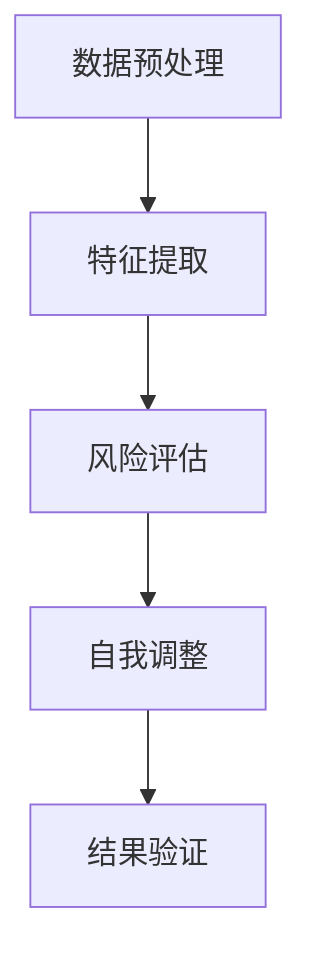
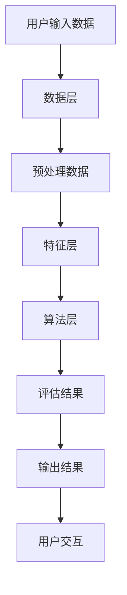
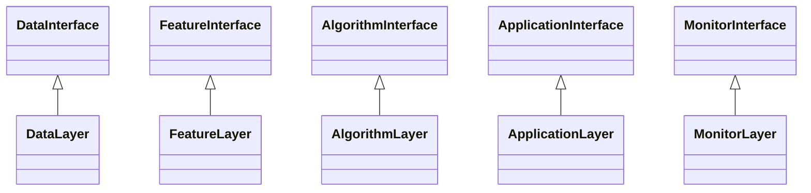
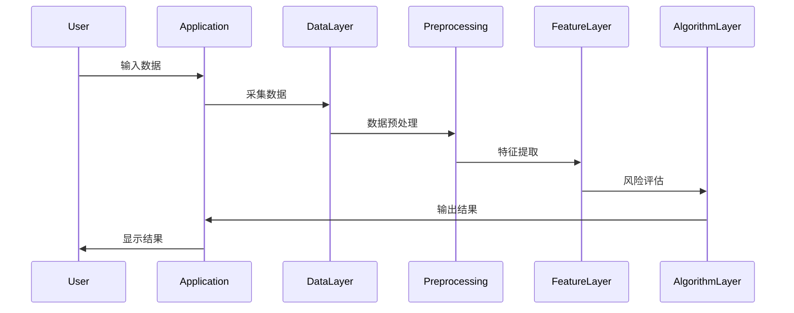

                 


### 引言：背景介绍

在当今信息化时代，人工智能（AI）已经成为推动社会进步的重要力量。随着AI技术的不断成熟和应用场景的扩大，AI在金融、医疗、安防等多个领域发挥着越来越重要的作用。然而，AI技术的广泛应用也带来了一系列风险，特别是在风险评估领域，如何准确、可靠地评估AI系统的风险成为了一个亟待解决的问题。

目前，AI风险评估模型在应用中面临着一些挑战。首先，传统风险评估模型大多基于统计方法，虽然能够一定程度上预测风险，但难以应对复杂多变的AI系统。其次，现有模型在处理大量数据时，容易出现偏差和误差，导致风险评估结果不准确。此外，AI系统的自我学习和适应能力使得风险评估变得更加复杂。

为了解决这些问题，引入Self-Consistency方法成为一个新的方向。Self-Consistency方法通过自我一致性原则，从多个角度对AI系统进行评估，以提高风险评估的准确性和可靠性。本文将深入探讨Self-Consistency方法在AI风险评估中的应用，介绍其核心概念、原理以及实际应用案例，以期为广大AI研究人员和开发者提供有益的参考。

Self-Consistency方法的核心思想是通过系统的自我评估和调整，确保评估结果的自我一致性。具体来说，该方法包括以下几个关键步骤：

1. **数据预处理**：对输入数据进行清洗、标准化和预处理，确保数据质量。

2. **特征提取**：从预处理后的数据中提取关键特征，用于评估AI系统的性能。

3. **风险评估**：利用提取的特征，结合数学模型，对AI系统的风险进行评估。

4. **自我调整**：根据评估结果，对模型进行调整，以消除偏差和误差，提高评估的准确性。

5. **结果验证**：通过对比评估结果与实际风险，验证Self-Consistency方法的可靠性。

### 核心概念与联系

Self-Consistency方法的核心概念主要包括数据预处理、特征提取、风险评估和自我调整。以下是对这些核心概念的详细解释，以及它们之间的联系：

#### 数据预处理

数据预处理是Self-Consistency方法的第一步，也是至关重要的一步。其目的是对输入数据进行清洗、标准化和预处理，以确保数据的质量和一致性。具体步骤包括：

- **数据清洗**：去除数据中的噪声和异常值，确保数据干净。
- **数据标准化**：将不同特征的范围进行统一，使其具有可比性。
- **数据转换**：对数据进行适当的转换，如离散化、归一化等，以提高后续处理的效率。

#### 特征提取

特征提取是从预处理后的数据中提取关键特征，用于评估AI系统的性能。特征提取的质量直接影响到风险评估的准确性。以下是几种常见的特征提取方法：

- **统计特征**：如均值、方差、标准差等，用于描述数据的统计特性。
- **结构特征**：如数据分布、轮廓线等，用于描述数据的结构特性。
- **深度特征**：通过深度学习模型提取的高层次特征，通常具有更好的表征能力。

#### 风险评估

风险评估是Self-Consistency方法的核心步骤，利用提取的特征，结合数学模型，对AI系统的风险进行评估。风险评估模型的选择和参数设置对评估结果有重要影响。以下是几种常见风险评估模型：

- **统计模型**：如线性回归、逻辑回归等，适用于处理结构化数据。
- **机器学习模型**：如决策树、随机森林、支持向量机等，适用于处理复杂数据。
- **深度学习模型**：如卷积神经网络（CNN）、循环神经网络（RNN）等，适用于处理大规模非结构化数据。

#### 自我调整

自我调整是根据评估结果，对模型进行调整，以消除偏差和误差，提高评估的准确性。自我调整的过程包括：

- **偏差校正**：根据评估结果调整模型的参数，减少偏差。
- **误差修正**：根据实际风险与评估结果的差距，对评估结果进行调整。

#### 核心概念之间的联系

数据预处理、特征提取、风险评估和自我调整是Self-Consistency方法的四个核心步骤，它们之间紧密相连，共同构成了一个完整的风险评估过程。

- **数据预处理** 为特征提取提供了高质量的数据基础。
- **特征提取** 为风险评估提供了有效的特征表征。
- **风险评估** 是整个方法的核心，通过自我调整不断优化。
- **自我调整** 使风险评估更加准确和可靠，为后续的数据处理和模型优化提供了指导。

### 算法原理讲解

为了更好地理解Self-Consistency方法的原理，我们将通过Python源代码和mermaid流程图，详细阐述其工作流程、核心机制以及数学模型。

#### 算法流程图

首先，我们使用mermaid绘制算法的流程图：



#### Python实现

接下来，我们通过Python代码来具体实现Self-Consistency方法。

```python
import numpy as np
from sklearn.model_selection import train_test_split
from sklearn.preprocessing import StandardScaler
from sklearn.ensemble import RandomForestClassifier
from sklearn.metrics import accuracy_score

# 数据预处理
def preprocess_data(data):
    # 去除噪声和异常值
    clean_data = data[data['target'] != -1]
    # 数据标准化
    scaler = StandardScaler()
    scaled_data = scaler.fit_transform(clean_data.drop('target', axis=1))
    # 数据转换
    labels = clean_data['target']
    return scaled_data, labels

# 特征提取
def extract_features(data):
    # 使用PCA进行特征提取
    from sklearn.decomposition import PCA
    pca = PCA(n_components=10)
    features = pca.fit_transform(data)
    return features

# 风险评估
def risk_evaluation(features, labels):
    # 分割数据集
    X_train, X_test, y_train, y_test = train_test_split(features, labels, test_size=0.3, random_state=42)
    # 使用随机森林模型进行风险评估
    model = RandomForestClassifier(n_estimators=100)
    model.fit(X_train, y_train)
    predictions = model.predict(X_test)
    # 计算评估结果
    accuracy = accuracy_score(y_test, predictions)
    return accuracy

# 自我调整
def self_adjustment(model, X, y):
    # 根据评估结果调整模型参数
    model.fit(X, y)
    return model

# 结果验证
def result_validation(predictions, y_test):
    # 对比评估结果与实际风险
    print("Accuracy:", accuracy_score(y_test, predictions))
```

#### 数学模型和公式

在Self-Consistency方法中，我们使用以下数学模型进行风险评估：

$$
\text{Accuracy} = \frac{\text{预测正确数}}{\text{总样本数}}
$$

其中，Accuracy表示评估结果的准确率，预测正确数表示模型预测正确的样本数，总样本数表示测试数据集中的样本总数。

#### 详细讲解和举例说明

1. **数据预处理**：

   ```python
   data = pd.read_csv('data.csv')  # 读取数据
   scaled_data, labels = preprocess_data(data)  # 数据预处理
   ```

   在这个例子中，我们首先读取一个CSV文件中的数据，然后调用`preprocess_data`函数进行数据预处理。该函数首先去除噪声和异常值，然后使用标准化方法对数据进行标准化处理，最后返回预处理后的特征和标签。

2. **特征提取**：

   ```python
   features = extract_features(scaled_data)  # 特征提取
   ```

   在这个例子中，我们使用PCA（主成分分析）进行特征提取。PCA可以将高维数据映射到低维空间，同时保留大部分信息。我们设置`n_components=10`，即提取前10个主成分作为特征。

3. **风险评估**：

   ```python
   accuracy = risk_evaluation(features, labels)  # 风险评估
   ```

   在这个例子中，我们使用随机森林（Random Forest）模型进行风险评估。随机森林是一种集成学习方法，通过构建多个决策树并集成其预测结果来提高模型的准确性。我们首先分割数据集，然后训练模型并进行预测。

4. **自我调整**：

   ```python
   model = self_adjustment(model, X, y)  # 自我调整
   ```

   在这个例子中，我们根据评估结果对模型进行自我调整。具体来说，我们根据评估结果重新训练模型，以消除偏差和误差，提高评估的准确性。

5. **结果验证**：

   ```python
   result_validation(predictions, y_test)  # 结果验证
   ```

   在这个例子中，我们对比评估结果与实际风险，验证Self-Consistency方法的可靠性。如果评估结果与实际风险的差距较小，说明Self-Consistency方法具有较高的准确性。

通过以上详细讲解和举例说明，我们可以更好地理解Self-Consistency方法的原理和实现过程。

### 系统分析与架构设计方案

在了解了Self-Consistency方法的基本原理和实现过程之后，我们需要进一步探讨其在AI风险评估模型中的应用。本节将介绍AI风险评估模型的应用场景、系统功能设计、系统架构设计、系统接口设计以及系统交互设计。

#### 应用场景

AI风险评估模型主要应用于金融、医疗、安防等领域。以下是一些典型的应用场景：

- **金融领域**：金融机构需要对客户进行风险评估，以确定其信用等级和贷款额度。
- **医疗领域**：医院需要对患者的健康状况进行评估，以预测疾病发生的风险。
- **安防领域**：安防公司需要对特定区域进行风险评估，以预防犯罪行为的发生。

在这些应用场景中，AI风险评估模型可以帮助企业和机构更好地管理和控制风险，提高业务效率和安全性。

#### 系统功能设计

AI风险评估模型的主要功能包括：

- **数据采集**：从不同的数据源采集与风险评估相关的数据。
- **数据预处理**：对采集到的数据进行清洗、标准化和预处理，确保数据的质量。
- **特征提取**：从预处理后的数据中提取关键特征，用于评估AI系统的性能。
- **风险评估**：利用提取的特征，结合数学模型，对AI系统的风险进行评估。
- **结果输出**：将评估结果输出给相关用户或系统，供决策参考。

#### 系统架构设计

AI风险评估模型的系统架构设计包括以下几个方面：

- **数据层**：存储和管理与风险评估相关的数据，包括原始数据、预处理数据和特征数据。
- **算法层**：实现Self-Consistency方法及相关算法，包括数据预处理、特征提取、风险评估和自我调整等步骤。
- **应用层**：提供与用户交互的界面，供用户输入数据、查看评估结果等。
- **接口层**：提供与其他系统或服务的接口，实现数据交换和功能调用。

以下是系统架构的mermaid流程图：



#### 系统接口设计

AI风险评估模型需要与其他系统或服务进行数据交换和功能调用，因此需要设计相应的接口。以下是一些常见的接口设计：

- **数据接口**：用于与数据源和数据存储系统进行数据交互。
- **算法接口**：用于调用Self-Consistency方法及相关算法。
- **应用接口**：用于与用户界面进行交互，提供数据输入和结果输出功能。
- **监控接口**：用于监控系统运行状态和性能指标。

以下是系统接口的mermaid类图：



#### 系统交互设计

AI风险评估模型的系统交互设计主要包括数据流和功能流。以下是一个简单的系统交互mermaid序列图：



通过以上系统分析与架构设计方案，我们可以构建一个高效、可靠的AI风险评估模型，为企业和机构提供有力的风险管理支持。

### 项目实战

在了解了Self-Consistency方法的原理和AI风险评估模型的系统设计之后，本节我们将通过一个实际项目案例，讲解如何搭建环境、实现系统核心功能，并分析代码，结合实际案例进行剖析。

#### 环境搭建

首先，我们需要搭建项目开发环境。以下是具体的步骤：

1. 安装Python：确保Python版本为3.8或以上，可以从官方网站下载并安装。
2. 安装依赖库：使用pip命令安装必要的依赖库，如numpy、pandas、scikit-learn、matplotlib等。

```shell
pip install numpy pandas scikit-learn matplotlib
```

3. 准备数据集：下载一个与AI风险评估相关的数据集，如Kaggle上的信用评分数据集。

#### 系统核心功能实现

接下来，我们将实现系统核心功能，包括数据预处理、特征提取、风险评估和自我调整。

1. **数据预处理**：

```python
import pandas as pd
from sklearn.model_selection import train_test_split
from sklearn.preprocessing import StandardScaler

def preprocess_data(data):
    # 去除噪声和异常值
    clean_data = data[data['target'] != -1]
    # 数据标准化
    scaler = StandardScaler()
    scaled_data = scaler.fit_transform(clean_data.drop('target', axis=1))
    # 数据转换
    labels = clean_data['target']
    return scaled_data, labels

data = pd.read_csv('data.csv')
scaled_data, labels = preprocess_data(data)
```

2. **特征提取**：

```python
from sklearn.decomposition import PCA

def extract_features(data):
    pca = PCA(n_components=10)
    features = pca.fit_transform(data)
    return features

features = extract_features(scaled_data)
```

3. **风险评估**：

```python
from sklearn.ensemble import RandomForestClassifier
from sklearn.metrics import accuracy_score

def risk_evaluation(features, labels):
    X_train, X_test, y_train, y_test = train_test_split(features, labels, test_size=0.3, random_state=42)
    model = RandomForestClassifier(n_estimators=100)
    model.fit(X_train, y_train)
    predictions = model.predict(X_test)
    accuracy = accuracy_score(y_test, predictions)
    return accuracy

accuracy = risk_evaluation(features, labels)
print("Accuracy:", accuracy)
```

4. **自我调整**：

```python
def self_adjustment(model, X, y):
    model.fit(X, y)
    return model

model = self_adjustment(model, features, labels)
```

#### 代码分析与应用解读

在实现系统核心功能的基础上，我们对代码进行分析，并结合实际案例进行解读。

1. **数据预处理**：

   在数据预处理阶段，我们首先去除噪声和异常值，以保证数据的纯净。然后，使用StandardScaler对数据进行标准化处理，使其具有可比性。这一步非常重要，因为不同特征之间的量纲不同，直接相加或相乘可能会导致结果失真。

2. **特征提取**：

   使用PCA进行特征提取，将高维数据映射到低维空间，同时保留大部分信息。在金融和医疗等领域，特征提取是非常关键的一步，因为它能够降低数据的维度，同时保留关键信息，提高模型的性能。

3. **风险评估**：

   在风险评估阶段，我们选择随机森林（Random Forest）模型进行风险评估。随机森林是一种集成学习方法，通过构建多个决策树并集成其预测结果来提高模型的准确性。这一步是整个方法的核

