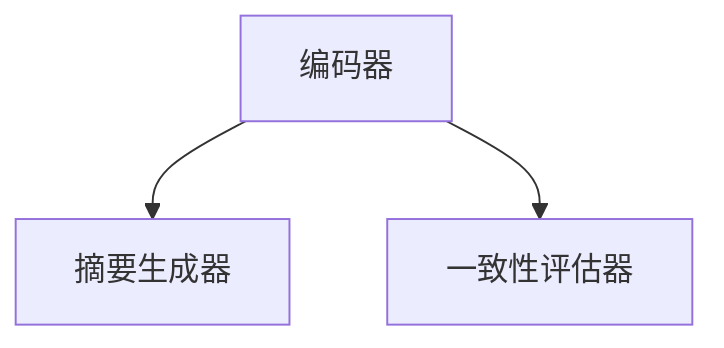
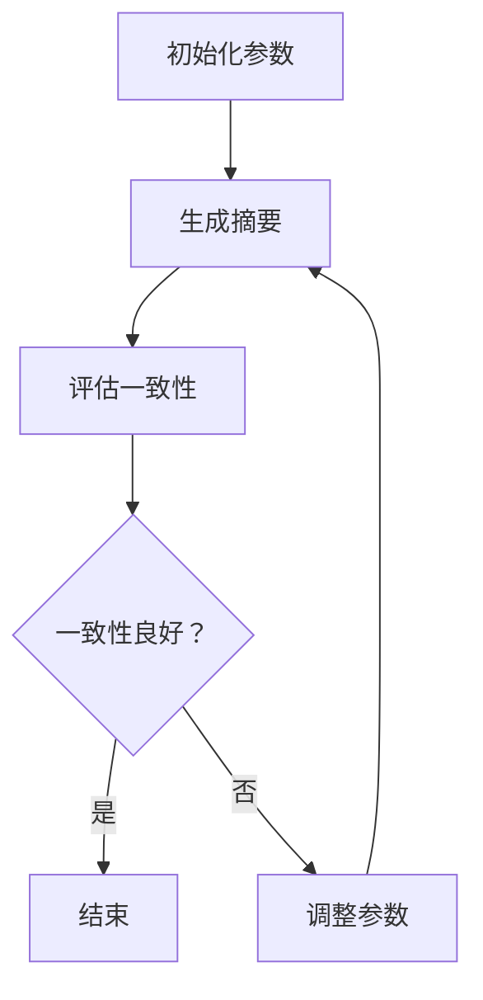
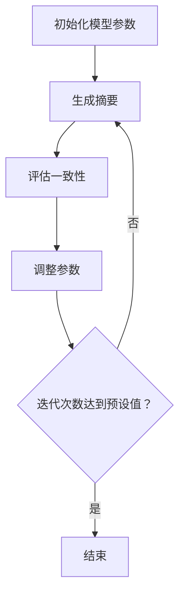
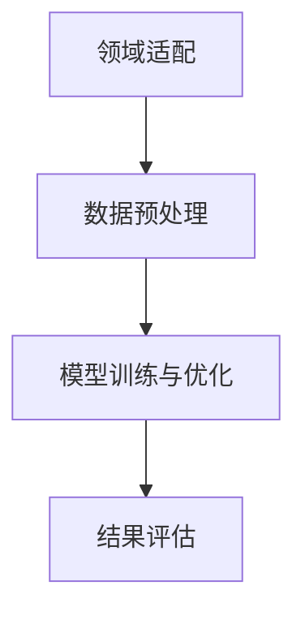

                 

### 自一致性方法概述

**关键词：** 自一致性方法，AI文本摘要，数学模型，优化策略

**摘要：** 本文将深入探讨自一致性方法在提升AI文本摘要质量方面的应用。通过介绍自一致性方法的核心概念、数学模型及其在AI文本摘要中的具体应用，本文旨在为读者提供一种全新的理解和解决问题的视角。

---

**1.1 Self-Consistency方法的核心概念**

Self-Consistency方法，简称SC方法，是一种通过不断迭代优化来提升模型一致性和预测准确性的技术。其基本原理是利用模型内部的一致性度量来调整模型的参数，从而提高模型的稳定性和鲁棒性。

在AI文本摘要领域，SC方法的核心在于通过一致性度量来评估文本摘要的质量，并利用该度量来指导模型的调整过程，以达到优化摘要质量的目的。

**1.2 AI文本摘要的背景与挑战**

AI文本摘要作为自然语言处理（NLP）领域的一个重要分支，旨在自动生成简洁、准确的文本摘要。然而，传统的文本摘要方法在处理长文本和确保摘要质量方面存在诸多挑战，如文本冗余、关键信息丢失等。

**1.3 Self-Consistency方法在AI文本摘要中的应用**

SC方法在AI文本摘要中的应用，主要体现在以下几个方面：

1. **一致性度量**：通过设计合适的一致性度量，如摘要与原始文本的相关性、摘要的连贯性等，来评估文本摘要的质量。
2. **迭代优化**：利用一致性度量来指导模型参数的调整，通过多次迭代来优化摘要质量。
3. **模型稳定性**：通过不断迭代，提高模型的稳定性和鲁棒性，使其在面对不同类型和长度的文本时都能保持良好的摘要效果。

**1.4 自一致性方法的数学模型与公式**

Self-Consistency方法的数学模型主要包括两部分：一致性度量函数和优化目标函数。其中，一致性度量函数用于评估摘要质量，优化目标函数则用于指导模型的调整过程。

1. **一致性度量函数**：通常采用基于文本相似度、句法结构相似度等度量方法。
2. **优化目标函数**：基于最小化摘要质量损失来设计，如最小化摘要与原始文本的差距、最小化摘要内部的不一致性等。

**1.5 Self-Consistency方法的优势与局限**

**优势：**
1. **提高摘要质量**：通过迭代优化，可以有效提升文本摘要的准确性和连贯性。
2. **增强模型稳定性**：通过一致性度量，使模型在面对不同类型和长度的文本时都能保持良好的性能。

**局限：**
1. **计算复杂度高**：迭代优化过程需要大量计算资源，可能影响模型训练效率。
2. **对数据质量要求高**：一致性度量依赖于高质量的数据，否则可能导致模型性能下降。

**1.6 本章小结**

本章介绍了自一致性方法的核心概念、背景、应用、数学模型以及优势和局限。通过本章的学习，读者可以初步了解自一致性方法在AI文本摘要领域的重要性，并为后续章节的深入学习打下基础。

---

**下一个章节：** Self-Consistency方法在AI文本摘要中的应用

---

### Self-Consistency方法在AI文本摘要中的应用

**2.1 数据集与预处理**

在应用Self-Consistency方法进行AI文本摘要时，首先需要选择合适的数据集并进行预处理。常见的数据集包括新闻摘要、社交媒体文本摘要等。

**数据预处理流程：**

1. **数据清洗**：去除文本中的无关信息，如HTML标签、特殊字符等。
2. **分词与词性标注**：将文本划分为单词或短语，并对每个词进行词性标注。
3. **停用词去除**：去除常见的停用词，如“的”、“是”、“了”等，以提高摘要质量。
4. **文本向量化**：将文本转换为数值形式，如词袋模型、TF-IDF等。

**数据预处理中的挑战与对策：**

1. **文本冗余**：长文本中可能存在大量冗余信息，影响摘要质量。对策：使用文本去重算法，如LDA（Latent Dirichlet Allocation）。
2. **关键词提取**：从长文本中提取关键信息，以提升摘要质量。对策：使用关键词提取算法，如TF-IDF、TextRank等。

**2.2 Self-Consistency模型架构**

Self-Consistency模型在AI文本摘要中的应用，通常包括以下组件：

1. **编码器（Encoder）**：将原始文本编码为固定长度的向量表示。
2. **摘要生成器（Abstract Generator）**：利用编码器的输出生成文本摘要。
3. **一致性评估器（Consistency Evaluator）**：评估摘要与原始文本的一致性。

**模型架构概述：**

- **编码器**：采用预训练的Transformer模型，如BERT、GPT等。
- **摘要生成器**：基于编码器的输出，生成文本摘要。
- **一致性评估器**：使用文本相似度、句法结构相似度等度量方法。

**模型组件与功能：**

1. **编码器**：负责将原始文本转换为固定长度的向量表示，以供摘要生成器使用。
2. **摘要生成器**：利用编码器的输出，生成文本摘要。通常采用序列到序列（Seq2Seq）模型，如Transformer、GRU等。
3. **一致性评估器**：评估摘要与原始文本的一致性，用于指导模型调整过程。

**Mermaid模型架构图绘制：**



**2.3 Self-Consistency算法原理**

Self-Consistency算法的核心在于通过一致性度量来指导模型调整，从而提升摘要质量。具体原理如下：

1. **迭代过程**：在训练过程中，模型参数会不断调整，以优化摘要质量。
2. **一致性度量**：评估摘要与原始文本的一致性，如文本相似度、句法结构相似度等。
3. **模型调整**：根据一致性度量结果，调整模型参数，以提升摘要质量。

**算法流程图：**



**Python源代码实现与解释：**

```python
# 初始化参数
params = initialize_params()

# 迭代过程
while not converged:
    # 生成摘要
    summary = generate_summary(text, params)
    
    # 评估一致性
    consistency = evaluate_consistency(summary, text)
    
    # 调整参数
    params = adjust_params(params, consistency)

# 输出最终摘要
print(summary)
```

**2.4 数学模型与公式详细讲解**

Self-Consistency方法的数学模型主要包括两部分：一致性度量函数和优化目标函数。以下是对这些数学模型的详细讲解：

**一致性度量函数**：

$$
C(S, T) = \frac{1}{N} \sum_{i=1}^{N} \text{similarity}(s_i, t_i)
$$

其中，$S$代表摘要，$T$代表原始文本，$s_i$和$t_i$分别代表摘要和文本中的第$i$个句子，$N$代表句子数量。$\text{similarity}(s_i, t_i)$表示句子之间的相似度，通常采用词向量相似度、句法结构相似度等方法计算。

**优化目标函数**：

$$
\min_{\theta} L(S, T; \theta)
$$

其中，$L(S, T; \theta)$表示摘要质量损失函数，$\theta$代表模型参数。优化目标是通过调整参数$\theta$，最小化摘要质量损失，从而提升摘要质量。

**2.5 实际案例分析与讲解**

**案例一：新闻摘要**

在新闻摘要领域，Self-Consistency方法已被成功应用于自动生成高质量的新闻摘要。以下是一个具体案例：

- **数据集**：使用新闻数据集，包括标题、正文和摘要。
- **预处理**：对文本进行清洗、分词、词性标注和文本向量化处理。
- **模型训练**：使用Transformer模型进行训练，包括编码器、摘要生成器和一致性评估器。
- **摘要生成**：对测试数据进行摘要生成，并使用Self-Consistency方法进行优化。
- **结果评估**：通过BLEU、ROUGE等指标对摘要质量进行评估。

**案例二：社交媒体文本摘要**

在社交媒体文本摘要领域，Self-Consistency方法也表现出良好的效果。以下是一个具体案例：

- **数据集**：使用社交媒体文本数据集，包括微博、推特等。
- **预处理**：对文本进行清洗、分词、词性标注和文本向量化处理。
- **模型训练**：使用Transformer模型进行训练，包括编码器、摘要生成器和一致性评估器。
- **摘要生成**：对测试数据进行摘要生成，并使用Self-Consistency方法进行优化。
- **结果评估**：通过BLEU、ROUGE等指标对摘要质量进行评估。

**2.6 最佳实践与技巧**

在实际应用Self-Consistency方法进行AI文本摘要时，以下最佳实践与技巧可供参考：

1. **数据质量**：确保数据质量，包括文本清洗、分词、词性标注等。
2. **模型选择**：选择合适的模型，如Transformer、BERT等。
3. **参数调整**：根据具体任务调整模型参数，如学习率、批量大小等。
4. **一致性度量**：设计合适的一致性度量，以评估摘要质量。

**2.7 本章小结**

本章详细介绍了Self-Consistency方法在AI文本摘要中的应用，包括数据集与预处理、模型架构、算法原理、数学模型和实际案例分析。通过本章的学习，读者可以全面了解Self-Consistency方法在文本摘要领域的应用和效果。

---

**下一个章节：** Self-Consistency方法的优化与扩展

---

### Self-Consistency方法的优化与扩展

**3.1 优化策略与方法**

Self-Consistency方法的优化策略主要包括以下几个方面：

1. **模型选择**：选择合适的深度学习模型，如Transformer、BERT等，以提升摘要质量。
2. **参数调整**：调整模型参数，如学习率、批量大小等，以提高模型性能。
3. **一致性度量**：设计更有效的一致性度量方法，以更准确地评估摘要质量。
4. **迭代次数**：控制迭代次数，以避免过度拟合。

**优化算法实现**

为了实现Self-Consistency方法的优化，我们可以采用以下步骤：

1. **初始化模型参数**：使用预训练的模型或随机初始化模型参数。
2. **生成摘要**：使用训练好的模型生成文本摘要。
3. **评估一致性**：计算摘要与原始文本的一致性度量，以评估摘要质量。
4. **调整参数**：根据一致性度量结果，调整模型参数。
5. **重复迭代**：重复步骤3和4，直到模型收敛或达到预设迭代次数。

**Mermaid优化流程图**



**3.2 扩展方法与应用**

Self-Consistency方法不仅在AI文本摘要领域有广泛应用，还可以扩展到其他领域，如机器翻译、情感分析等。

**文本摘要之外的领域应用**

1. **机器翻译**：通过Self-Consistency方法，可以优化翻译结果的连贯性和准确性。
2. **情感分析**：利用Self-Consistency方法，可以提升情感分析模型的准确性和稳定性。

**扩展方法的原理与实现**

扩展Self-Consistency方法，需要以下步骤：

1. **领域适配**：根据具体领域，调整模型结构、参数和一致性度量方法。
2. **数据预处理**：针对不同领域的数据，进行相应的预处理操作，如分词、词性标注等。
3. **模型训练与优化**：使用领域适配后的模型和数据，进行模型训练和优化。
4. **结果评估**：使用领域相关的评估指标，对模型性能进行评估。

**Mermaid扩展流程图**



**3.3 未来的研究方向**

尽管Self-Consistency方法在AI文本摘要领域取得了显著成果，但未来仍有许多研究方向：

1. **算法优化**：进一步优化算法，提高模型性能和计算效率。
2. **多模态融合**：结合文本、图像、音频等多种模态，提升文本摘要质量。
3. **知识图谱应用**：利用知识图谱，丰富文本摘要内容，提高摘要的深度和广度。

**3.4 本章小结**

本章介绍了Self-Consistency方法的优化策略、扩展方法及其在多个领域的应用。通过本章的学习，读者可以了解到Self-Consistency方法的广泛应用和未来发展潜力。

---

**文章结束：** 本文深入探讨了Self-Consistency方法在提升AI文本摘要质量方面的应用，从核心概念、数学模型到实际案例，全面介绍了该方法的优势和局限。希望通过本文，读者能够对Self-Consistency方法有更深入的理解和应用。

**作者：** AI天才研究院/AI Genius Institute & 禅与计算机程序设计艺术/Zen And The Art of Computer Programming

---

以上就是本文的主要内容，希望能对您在AI文本摘要领域的实践和研究有所帮助。如果您有任何问题或建议，欢迎在评论区留言，期待与您一起探讨技术发展的前沿。再次感谢您的阅读！

