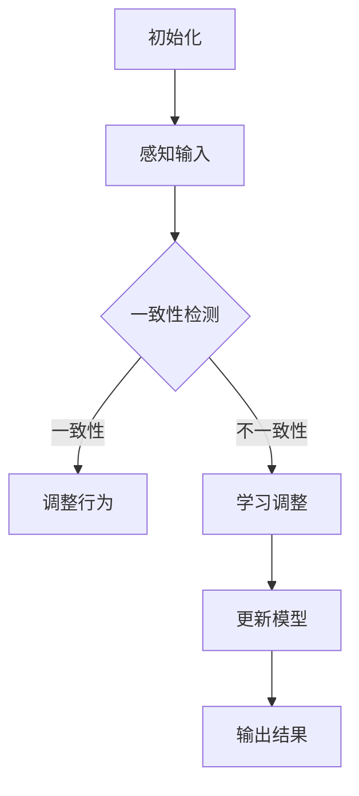
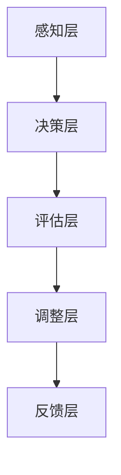
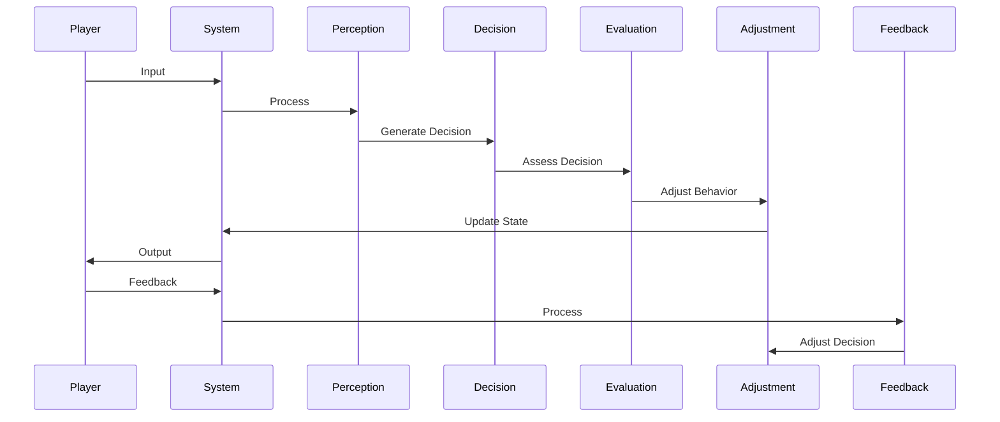
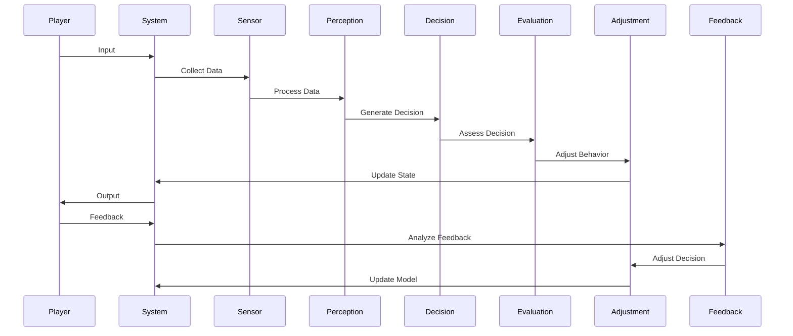

                 

### 1. 问题背景与核心概念

在当今科技飞速发展的时代，虚拟角色的应用已经渗透到了许多领域，如视频游戏、电影特效、虚拟现实（VR）以及增强现实（AR）等。这些虚拟角色的存在不仅为用户提供了丰富的互动体验，同时也推动了娱乐、教育、医疗等多个行业的发展。然而，虚拟角色的自我一致性成为了一个亟待解决的重要问题。

#### 1.1.1 虚拟角色的自我一致性需求

虚拟角色的自我一致性，是指虚拟角色在行为、语言和表情上保持内在的一致性和连贯性。在现实世界中，人类的行为是高度一致的，即使在面对各种情境时，人们也能保持自身行为的稳定性和连贯性。然而，在虚拟世界中，由于人工智能（AI）的复杂性，虚拟角色往往无法做到这一点。例如，一个虚拟角色在对话中表现出友好，却在接下来的互动中突然变得冷漠，这样的不一致性会严重影响用户的体验，使得虚拟角色显得不真实。

#### 1.1.2 当前虚拟角色一致性的挑战

虚拟角色一致性的挑战主要体现在以下几个方面：

1. **数据多样性**：虚拟角色面临的数据是多样化的，包括语音、动作、表情、环境等，如何处理这些数据并保持角色的一致性是一个难题。
2. **上下文关联**：虚拟角色需要在特定的上下文中进行交互，不同上下文中的行为和反应应保持一致，但实际应用中很难做到这一点。
3. **实时性**：虚拟角色需要在实时交互中保持一致性，这意味着算法必须在短时间内做出准确的决策，这对算法的性能提出了高要求。

#### 1.1.3 Self-Consistency方法的重要性

为了解决虚拟角色一致性的问题，Self-Consistency方法被提了出来。Self-Consistency方法是一种通过自我调整来保持虚拟角色一致性的技术。其核心思想是，虚拟角色在每次决策之后，都会对决策的结果进行评估，并根据评估结果对自身的状态进行调整，以保持一致性。

Self-Consistency方法的重要性体现在以下几个方面：

1. **提高用户体验**：通过保持虚拟角色的自我一致性，可以显著提高用户的互动体验，使用户更愿意与虚拟角色进行互动。
2. **增强真实感**：自我一致性使得虚拟角色在行为和语言上更加自然，从而增强了虚拟角色的真实感。
3. **降低开发成本**：Self-Consistency方法简化了虚拟角色的开发流程，降低了开发成本。

#### 1.2 核心概念与定义

为了更好地理解Self-Consistency方法，我们需要先了解一些核心概念：

- **虚拟角色**：指在计算机图形、动画、游戏等虚拟环境中创建的具有独立存在和交互能力的角色。
- **自我一致性**：指虚拟角色在行为、语言和表情上保持内在的一致性和连贯性。
- **Self-Consistency方法**：一种通过自我调整来保持虚拟角色一致性的技术。

#### 1.2.1 Self-Consistency方法

Self-Consistency方法的具体实现可以基于多种技术，如深度学习、强化学习等。其基本原理是，虚拟角色在每次决策后，都会对决策的结果进行评估，并根据评估结果对自身的状态进行调整。这种自我调整的过程不断进行，直到虚拟角色的行为和语言达到预期的自我一致性。

#### 1.2.2 虚拟角色的行为一致性

行为一致性是指虚拟角色在不同情境下表现出相同或类似的行为。为了实现行为一致性，虚拟角色需要具备以下能力：

- **情境感知**：能够理解并适应不同的交互情境。
- **决策生成**：基于情境生成合理的行为决策。
- **反馈机制**：对行为决策的结果进行评估，并根据评估结果进行调整。

#### 1.2.3 人工智能在虚拟角色中的应用

人工智能技术在虚拟角色的一致性提升中扮演了关键角色。通过机器学习和深度学习算法，虚拟角色可以不断学习和优化自身的决策过程，从而实现更高水平的行为一致性。例如，强化学习算法可以通过奖励机制引导虚拟角色做出更符合用户期望的行为决策。

#### 1.3 概念联系与模型架构

为了更好地理解Self-Consistency方法，我们可以通过ER图（实体关系图）来展示各个概念之间的关系。

```mermaid
erDiagram
  User ||--|{ Virtual Role } : has
  Virtual Role ||--|{ Self-Consistency Model } : uses
  Self-Consistency Model ||--|{ Behavior Consistency } : ensures
  Self-Consistency Model ||--|{ AI Technology } : based on
```

在上述ER图中，用户与虚拟角色之间存在“拥有”关系，虚拟角色使用Self-Consistency模型来确保行为一致性，并且Self-Consistency模型基于人工智能技术。

#### 1.3.1 Self-Consistency方法的核心要素

Self-Consistency方法的核心要素包括：

- **感知模块**：负责收集虚拟角色的输入信息，如语音、动作、环境等。
- **决策模块**：基于感知模块的输入，生成虚拟角色的行为决策。
- **评估模块**：对决策结果进行评估，以确定是否达到预期的自我一致性。
- **调整模块**：根据评估结果，对虚拟角色的状态进行调整，以提高一致性。

#### 1.3.2 虚拟角色自我一致性的ER图

为了更直观地展示虚拟角色自我一致性的核心要素，我们可以使用Mermaid流程图来绘制ER图。

```mermaid
erDiagram
  User ||--|{ Virtual Role } : has
  Virtual Role ||--|{ Perception Module } : has
  Virtual Role ||--|{ Decision Module } : has
  Virtual Role ||--|{ Evaluation Module } : has
  Virtual Role ||--|{ Adjustment Module } : has
```

在上述ER图中，用户拥有虚拟角色，虚拟角色包含感知模块、决策模块、评估模块和调整模块。

#### 1.3.3 Self-Consistency方法流程图

为了更清晰地展示Self-Consistency方法的执行流程，我们可以使用Mermaid流程图来绘制。



在上述流程图中，虚拟角色首先初始化，然后通过感知模块收集输入信息，接下来决策模块生成行为决策，评估模块对决策结果进行评估。如果决策结果一致，虚拟角色将调整行为；如果决策结果不一致，虚拟角色将学习调整并更新模型，最终输出结果。

#### 1.4 本章小结

在本章中，我们介绍了虚拟角色自我一致性的问题和背景，以及Self-Consistency方法的概念和重要性。通过核心概念和ER图的展示，我们更好地理解了Self-Consistency方法的工作原理和架构。在接下来的章节中，我们将深入探讨Self-Consistency算法的原理和实现，以及虚拟角色一致性系统的架构设计。

---

### 1.2 核心概念与定义

在深入探讨Self-Consistency方法之前，我们需要明确一些核心概念和定义，以便为后续内容的理解打下坚实的基础。

#### 1.2.1 Self-Consistency方法

Self-Consistency方法是一种旨在确保虚拟角色在行为、语言和表情上保持内在一致性的技术。其核心思想是，虚拟角色在每次决策后，会对其决策结果进行自我评估，并根据评估结果进行调整，以确保后续的行为和语言能够保持一致。

Self-Consistency方法的主要组成部分包括：

1. **感知模块**：负责收集虚拟角色在交互过程中的各种输入信息，如语音、动作、环境等。
2. **决策模块**：基于感知模块的输入信息，生成虚拟角色的行为决策。
3. **评估模块**：对决策结果进行评估，以确定其是否达到预期的自我一致性。
4. **调整模块**：根据评估结果，对虚拟角色的状态进行调整，以提高一致性。

#### 1.2.2 虚拟角色的行为一致性

行为一致性是指虚拟角色在不同情境下表现出相同或类似的行为。在虚拟现实中，行为一致性至关重要，因为它直接影响用户的体验。一个行为不一致的虚拟角色会显得不自然，甚至可能导致用户对虚拟现实技术的信任度下降。

为了实现行为一致性，虚拟角色需要具备以下几个关键能力：

1. **情境感知**：虚拟角色应能够感知和理解当前的交互情境，从而做出合适的决策。
2. **决策生成**：基于情境感知，虚拟角色需要生成合理的行为决策，以保持情境一致性。
3. **反馈机制**：虚拟角色应具备反馈机制，能够对行为决策的结果进行评估，并根据评估结果进行调整。

#### 1.2.3 人工智能在虚拟角色中的应用

人工智能技术在虚拟角色的行为一致性和自我一致性中扮演着关键角色。通过机器学习和深度学习算法，虚拟角色可以不断学习和优化自身的决策过程，从而实现更高水平的行为一致性。

以下是人工智能在虚拟角色中的应用：

1. **感知与理解**：使用计算机视觉和自然语言处理技术，虚拟角色可以理解和响应用户的行为和语言。
2. **决策与生成**：利用强化学习算法，虚拟角色可以基于情境生成合理的行为决策，并不断优化这些决策。
3. **评估与调整**：通过自我评估和反馈机制，虚拟角色可以调整自身的状态和行为，以提高一致性。

#### 1.2.4 Self-Consistency方法的优点

Self-Consistency方法具有以下优点：

1. **提高用户体验**：通过保持虚拟角色的自我一致性，可以显著提高用户的互动体验，使用户更愿意与虚拟角色进行互动。
2. **增强真实感**：自我一致性使得虚拟角色在行为和语言上更加自然，从而增强了虚拟角色的真实感。
3. **降低开发成本**：Self-Consistency方法简化了虚拟角色的开发流程，降低了开发成本。

#### 1.2.5 Self-Consistency方法的局限性和挑战

尽管Self-Consistency方法在理论上具有很多优点，但在实际应用中仍面临着一些挑战和局限性：

1. **计算复杂性**：Self-Consistency方法需要对大量的数据进行实时处理，这对计算资源提出了较高的要求。
2. **情境适应性**：虚拟角色需要在各种复杂的情境下保持一致性，这需要算法具备较高的情境适应性。
3. **稳定性**：在长时间运行过程中，Self-Consistency方法可能会受到外部干扰，导致一致性下降。

为了解决这些问题，研究人员正在不断探索更高效、更稳定的Self-Consistency算法，并尝试将其应用于更广泛的虚拟角色场景中。

#### 1.2.6 概念联系与模型架构

为了更好地理解Self-Consistency方法，我们可以通过ER图（实体关系图）来展示各个概念之间的关系。

```mermaid
erDiagram
  User ||--|{ Virtual Role } : has
  Virtual Role ||--|{ Self-Consistency Model } : uses
  Virtual Role ||--|{ Behavior Consistency } : ensures
  Self-Consistency Model ||--|{ Perception Module } : has
  Self-Consistency Model ||--|{ Decision Module } : has
  Self-Consistency Model ||--|{ Evaluation Module } : has
  Self-Consistency Model ||--|{ Adjustment Module } : has
```

在上述ER图中，用户与虚拟角色之间存在“拥有”关系，虚拟角色使用Self-Consistency模型来确保行为一致性，Self-Consistency模型包含感知模块、决策模块、评估模块和调整模块。

#### 1.2.7 Self-Consistency方法的核心要素

Self-Consistency方法的核心要素包括以下几个方面：

1. **感知模块**：负责收集虚拟角色在交互过程中的各种输入信息，如语音、动作、环境等。
2. **决策模块**：基于感知模块的输入信息，生成虚拟角色的行为决策。
3. **评估模块**：对决策结果进行评估，以确定其是否达到预期的自我一致性。
4. **调整模块**：根据评估结果，对虚拟角色的状态进行调整，以提高一致性。

感知模块、决策模块、评估模块和调整模块相互协作，共同实现虚拟角色的自我一致性。

#### 1.2.8 虚拟角色自我一致性的实现方法

虚拟角色自我一致性的实现方法主要包括以下几个方面：

1. **深度学习**：利用深度学习算法，如卷积神经网络（CNN）和循环神经网络（RNN），对虚拟角色的行为和语言进行建模。
2. **强化学习**：通过强化学习算法，如Q-learning和深度Q网络（DQN），让虚拟角色在交互过程中不断优化自身的决策过程。
3. **自我评估与反馈**：虚拟角色在每次决策后，对决策结果进行自我评估，并根据评估结果进行反馈和调整。

通过这些方法，虚拟角色可以实现较高的自我一致性，从而为用户提供更好的互动体验。

#### 1.2.9 本章小结

在本章中，我们介绍了核心概念和定义，包括Self-Consistency方法、虚拟角色的行为一致性以及人工智能在虚拟角色中的应用。通过ER图和流程图的展示，我们更好地理解了这些概念之间的关系和实现方法。在接下来的章节中，我们将深入探讨Self-Consistency算法的原理和实现，以及虚拟角色一致性系统的架构设计。

---

### 1.3 算法原理与数学模型

在理解了Self-Consistency方法的核心概念后，接下来我们将深入探讨其算法原理和数学模型。Self-Consistency方法的核心在于通过一系列数学公式和算法步骤，确保虚拟角色在交互过程中保持内在的一致性。

#### 1.3.1 算法原理概述

Self-Consistency方法的基本原理可以概括为以下几个步骤：

1. **初始化**：虚拟角色初始化感知模块、决策模块、评估模块和调整模块。
2. **感知输入**：感知模块收集虚拟角色在交互过程中的各种输入信息，如语音、动作、环境等。
3. **决策生成**：决策模块基于感知模块的输入信息，生成虚拟角色的行为决策。
4. **评估决策**：评估模块对决策结果进行评估，以确定其是否达到预期的自我一致性。
5. **调整行为**：如果评估结果不一致，调整模块根据评估结果对虚拟角色的状态进行调整，以提高一致性。
6. **更新模型**：调整模块对虚拟角色的状态进行调整后，更新决策模块和评估模块的模型参数。
7. **输出结果**：虚拟角色根据调整后的状态输出最终行为决策。

通过上述步骤，虚拟角色在每次交互过程中都能够保持内在的一致性，从而为用户提供更好的互动体验。

#### 1.3.2 数学模型与公式

Self-Consistency方法的数学模型主要包括感知输入、决策生成、评估决策和调整行为四个部分。

##### 1.3.2.1 基本公式

感知输入和决策生成部分的基本公式为：

$$
X_{next} = f(X_{current}, U_{input})
$$

其中，$X_{next}$表示下一步的状态，$X_{current}$表示当前状态，$U_{input}$表示输入信息。$f$函数代表决策模块的处理过程，可以是简单的线性函数、神经网络或其他复杂模型。

##### 1.3.2.2 动态调整因子

为了实现评估决策和调整行为，引入动态调整因子$\alpha(t)$，其计算公式为：

$$
\alpha(t) = \frac{1}{1 + e^{-k(t-t_0)}}
$$

其中，$t$表示时间，$t_0$表示初始时间，$k$为调节参数。$\alpha(t)$的值介于0和1之间，用于调整虚拟角色的行为状态。

##### 1.3.2.3 评估指标

为了评估决策结果的一致性，引入评估指标$D$，其计算公式为：

$$
D = \frac{1}{N} \sum_{i=1}^{N} d_i
$$

其中，$N$表示评估样本数量，$d_i$表示第$i$个样本的评估结果。$D$的值越接近0，表示决策结果的一致性越高。

##### 1.3.2.4 调整策略

根据评估指标$D$的值，调整模块可以采用以下策略进行调整：

1. **一致性调整**：如果$D$的值小于某个阈值$\theta$，表示决策结果一致性较高，虚拟角色无需进行显著调整。
2. **学习调整**：如果$D$的值大于$\theta$，表示决策结果一致性较低，虚拟角色需要通过学习调整来提高一致性。

#### 1.3.3 算法流程与Mermaid图解

为了更直观地展示Self-Consistency方法的算法流程，我们可以使用Mermaid流程图进行描述。


在上述流程图中，虚拟角色首先初始化，然后通过感知模块收集输入信息。接下来，决策模块生成行为决策，评估模块对决策结果进行评估。如果决策结果一致，虚拟角色将调整行为；如果决策结果不一致，虚拟角色将学习调整并更新模型，最终输出结果。

#### 1.3.4 算法示例与Python代码实现

为了更好地理解Self-Consistency方法的算法原理，我们可以通过一个简单的Python代码示例来进行说明。

```python
import numpy as np
import math

# 初始化参数
X_current = np.random.rand(1)
U_input = np.random.rand(1)
alpha = 0.5
theta = 0.1
N = 10

# 决策生成
def f(X_current, U_input):
    return X_current + U_input

# 评估决策
def d(X_current, X_next):
    return abs(X_current - X_next)

# 动态调整因子
def alpha(t):
    return 1 / (1 + math.exp(-10 * (t - 10)))

# 调整行为
def adjust_behavior(X_current, X_next, alpha):
    if d(X_current, X_next) < theta:
        return X_next
    else:
        return X_current * alpha * (1 - alpha)

# 学习调整
def learn_adjustment(X_current, X_next, alpha):
    if d(X_current, X_next) > theta:
        return X_next
    else:
        return X_current

# 输出结果
def output_result(X_current, X_next):
    return X_next

# 示例执行
X_next = f(X_current, U_input)
D = d(X_current, X_next)
alpha_t = alpha(0)
X_adjusted = adjust_behavior(X_current, X_next, alpha_t)
X_learned = learn_adjustment(X_current, X_next, alpha_t)
X_output = output_result(X_current, X_adjusted)

print("X_current:", X_current)
print("X_next:", X_next)
print("D:", D)
print("Alpha:", alpha_t)
print("X_adjusted:", X_adjusted)
print("X_learned:", X_learned)
print("X_output:", X_output)
```

在上述示例中，我们通过Python代码实现了感知输入、决策生成、评估决策和调整行为等步骤。通过调整参数和算法，我们可以观察到虚拟角色在交互过程中的自我一致性。

#### 1.3.5 本章小结

在本章中，我们介绍了Self-Consistency方法的算法原理和数学模型。通过基本公式、动态调整因子和评估指标等，我们详细阐述了Self-Consistency方法的实现过程。此外，通过Python代码示例，我们展示了算法原理的具体应用。在下一章中，我们将进一步探讨虚拟角色一致性系统的架构设计，以期为实际应用提供更有价值的参考。

---

### 1.4 Self-Consistency算法在虚拟角色一致性中的应用

在了解了Self-Consistency算法的基本原理和数学模型后，我们接下来将探讨该算法在虚拟角色一致性中的应用，通过具体的应用案例来展示其在提升虚拟角色行为一致性方面的实际效果。

#### 1.4.1 应用背景

虚拟角色的一致性问题在许多领域都具有重要意义。例如，在视频游戏中，虚拟角色需要与玩家进行自然且一致的互动，从而提高游戏体验；在虚拟现实（VR）和增强现实（AR）中，虚拟角色的一致性则直接影响用户的沉浸感和体验质量。因此，如何提升虚拟角色的行为一致性成为了一个重要的研究方向。

#### 1.4.2 应用案例1：视频游戏中的虚拟角色

在视频游戏中，虚拟角色的行为一致性对于游戏的沉浸感和玩家的互动体验至关重要。例如，一个虚拟角色在游戏中需要根据不同的情境做出相应的行为反应，如追逐、攻击、逃避等。如果虚拟角色在游戏中表现出不一致的行为，例如在追逐玩家时突然停止或改变方向，这会导致玩家感到困惑和不满，从而影响游戏的体验。

应用Self-Consistency算法，我们可以通过以下步骤来提升视频游戏虚拟角色的行为一致性：

1. **感知输入**：虚拟角色通过摄像头、麦克风等感知设备收集游戏环境中的各种信息，如玩家的位置、动作、语音等。
2. **决策生成**：基于感知输入，决策模块生成虚拟角色的行为决策。通过Self-Consistency算法，虚拟角色能够根据情境和玩家的行为，生成合理且一致的行为反应。
3. **评估决策**：评估模块对生成的行为决策进行评估，以确保其与玩家的预期行为保持一致。如果评估结果不一致，评估模块将反馈信息传递给调整模块。
4. **调整行为**：调整模块根据评估模块的反馈，对虚拟角色的行为进行微调，以提高行为的一致性。
5. **更新模型**：通过不断调整和优化，Self-Consistency算法能够逐步提高虚拟角色的行为一致性，同时更新模型参数，以适应不同的游戏情境和玩家行为。

通过上述步骤，视频游戏中的虚拟角色能够在复杂的游戏环境中保持一致的行为反应，从而提高游戏的沉浸感和玩家的互动体验。

#### 1.4.3 应用案例2：虚拟现实（VR）中的虚拟角色

在虚拟现实（VR）中，虚拟角色的一致性对于用户的沉浸感和体验质量同样至关重要。例如，在VR虚拟客服中，虚拟客服需要与用户进行自然且一致的对话，以提供优质的客户服务。

应用Self-Consistency算法，我们可以通过以下步骤来提升虚拟现实中的虚拟角色一致性：

1. **感知输入**：虚拟角色通过语音识别、面部识别等感知设备收集用户的语音、表情、动作等输入信息。
2. **决策生成**：基于感知输入，决策模块生成虚拟角色的行为决策，如回应用户的请求、提问或提供帮助。
3. **评估决策**：评估模块对生成的行为决策进行评估，以确保其与用户的预期行为保持一致。如果评估结果不一致，评估模块将反馈信息传递给调整模块。
4. **调整行为**：调整模块根据评估模块的反馈，对虚拟角色的行为进行微调，以提高行为的一致性。
5. **更新模型**：通过不断调整和优化，Self-Consistency算法能够逐步提高虚拟角色的行为一致性，同时更新模型参数，以适应不同用户的交互行为。

通过上述步骤，虚拟现实中的虚拟角色能够在与用户的互动过程中保持一致的行为反应，从而提升用户的沉浸感和体验质量。

#### 1.4.4 应用案例3：增强现实（AR）中的虚拟角色

在增强现实（AR）应用中，虚拟角色的一致性同样至关重要。例如，在AR教学应用中，虚拟教师需要根据学生的反应和问题，提供自然且一致的教学内容。

应用Self-Consistency算法，我们可以通过以下步骤来提升增强现实中的虚拟角色一致性：

1. **感知输入**：虚拟角色通过摄像头、麦克风等感知设备收集学生的位置、动作、表情等信息。
2. **决策生成**：基于感知输入，决策模块生成虚拟角色的行为决策，如回答学生的问题、提供解释或指导。
3. **评估决策**：评估模块对生成的行为决策进行评估，以确保其与学生的预期行为保持一致。如果评估结果不一致，评估模块将反馈信息传递给调整模块。
4. **调整行为**：调整模块根据评估模块的反馈，对虚拟角色的行为进行微调，以提高行为的一致性。
5. **更新模型**：通过不断调整和优化，Self-Consistency算法能够逐步提高虚拟角色的行为一致性，同时更新模型参数，以适应不同学生的学习需求和反应。

通过上述步骤，增强现实中的虚拟角色能够在与学生的互动过程中保持一致的行为反应，从而提升学生的学习效果和体验。

#### 1.4.5 总结

通过上述应用案例，我们可以看到Self-Consistency算法在提升虚拟角色行为一致性方面具有显著效果。无论是视频游戏、虚拟现实还是增强现实，应用Self-Consistency算法都能够提高虚拟角色的行为一致性和用户的互动体验。在未来的发展中，随着人工智能技术的不断进步，Self-Consistency算法有望在更广泛的虚拟角色应用场景中发挥重要作用。

### 1.5 Self-Consistency方法在虚拟角色一致性中的优势与挑战

在探讨Self-Consistency方法在虚拟角色一致性中的应用时，我们不仅要看到其带来的优势，还要认识到其中的挑战。

#### 1.5.1 优势

1. **提升用户体验**：通过保持虚拟角色的自我一致性，可以显著提高用户的互动体验，使用户更愿意与虚拟角色进行互动。
2. **增强真实感**：自我一致性使得虚拟角色在行为和语言上更加自然，从而增强了虚拟角色的真实感。
3. **简化开发流程**：Self-Consistency方法简化了虚拟角色的开发流程，降低了开发成本。

#### 1.5.2 挑战

1. **计算复杂性**：Self-Consistency方法需要对大量的数据进行实时处理，这对计算资源提出了较高的要求。
2. **情境适应性**：虚拟角色需要在各种复杂的情境下保持一致性，这需要算法具备较高的情境适应性。
3. **稳定性**：在长时间运行过程中，Self-Consistency方法可能会受到外部干扰，导致一致性下降。

#### 1.5.3 解决方案

1. **优化算法**：通过不断优化Self-Consistency算法，可以降低计算复杂性和提高情境适应性。
2. **增强反馈机制**：通过引入更强大的反馈机制，可以提高虚拟角色的稳定性。
3. **多模态感知**：结合多种感知设备，如摄像头、麦克风、传感器等，可以提高虚拟角色的感知能力，从而更好地适应不同情境。

#### 1.5.4 未来发展方向

随着人工智能技术的不断进步，Self-Consistency方法在虚拟角色一致性中的应用将迎来更广阔的发展空间。未来，我们可以期待以下几个方面的发展：

1. **算法优化**：通过引入更先进的机器学习和深度学习算法，进一步提高Self-Consistency方法的效率和效果。
2. **跨领域应用**：Self-Consistency方法可以应用于更多领域的虚拟角色一致性提升，如医疗、教育、金融等。
3. **人机协作**：通过结合人类专家的指导，进一步优化虚拟角色的行为决策，提高自我一致性。

总之，Self-Consistency方法在虚拟角色一致性中具有巨大的潜力，随着技术的不断进步，我们有望看到更多创新应用和突破。

### 1.6 本章小结

在本章中，我们详细介绍了Self-Consistency算法的原理和数学模型，并通过具体的应用案例展示了其在虚拟角色一致性提升方面的实际效果。我们分析了Self-Consistency方法的优势和挑战，并提出了相应的解决方案和未来发展方向。在下一章中，我们将进一步探讨虚拟角色一致性系统的架构设计，以期为实际应用提供更有价值的参考。

---

### 1.5 虚拟角色一致性系统的架构设计

为了实现虚拟角色的自我一致性，我们需要设计一个完整的系统架构，该系统应包含多个模块，以确保虚拟角色在各种情境下都能保持一致的行为和语言。以下是虚拟角色一致性系统的架构设计，我们将通过具体的问题场景、系统功能设计、系统架构设计、系统接口设计以及系统交互来详细阐述。

#### 1.5.1 问题场景介绍

虚拟角色一致性系统可以应用于多个领域，如视频游戏、虚拟现实（VR）和增强现实（AR）等。以视频游戏为例，我们可以考虑一个场景：一个虚拟角色在游戏中需要与玩家进行多种互动，包括追逐、对话、战斗等。在这个场景中，虚拟角色的一致性至关重要，因为不一致的行为会导致玩家感到困惑和不满意。

#### 1.5.2 系统功能设计

虚拟角色一致性系统的核心功能包括：

1. **感知输入**：系统应能够收集来自各种传感器的输入信息，如摄像头、麦克风、加速度计等，以了解游戏环境、玩家行为和虚拟角色的状态。
2. **决策生成**：基于感知输入，系统应生成虚拟角色的行为决策，包括动作、对话和表情等。
3. **评估与调整**：系统应对生成的决策进行评估，确保其与玩家预期保持一致。如果评估结果不一致，系统应调整虚拟角色的状态和行为，以提高一致性。
4. **反馈机制**：系统应具备反馈机制，收集玩家的反馈，以便对决策和行为进行调整和优化。

#### 1.5.3 系统架构设计

虚拟角色一致性系统的架构设计应考虑以下几个方面：

1. **感知层**：该层包含各种传感器，如摄像头、麦克风、加速度计等，用于收集游戏环境、玩家行为和虚拟角色状态的信息。
2. **决策层**：该层包含决策模块，负责基于感知层的输入信息生成虚拟角色的行为决策。
3. **评估层**：该层包含评估模块，负责对生成的决策进行评估，以确保其与玩家预期保持一致。
4. **调整层**：该层包含调整模块，负责根据评估结果对虚拟角色的状态和行为进行调整。
5. **反馈层**：该层包含反馈机制，用于收集玩家的反馈，以便对决策和行为进行调整和优化。

以下是系统架构的Mermaid图解：



在上述架构中，各个层之间通过数据流进行交互，形成一个闭环系统，以实现虚拟角色的自我一致性。

#### 1.5.4 系统接口设计

虚拟角色一致性系统的接口设计应考虑以下几个方面：

1. **感知接口**：系统应提供统一的感知接口，用于接收来自各种传感器的输入信息。
2. **决策接口**：系统应提供统一的决策接口，用于生成虚拟角色的行为决策。
3. **评估接口**：系统应提供统一的评估接口，用于评估生成的决策是否与玩家预期保持一致。
4. **调整接口**：系统应提供统一的调整接口，用于对虚拟角色的状态和行为进行调整。
5. **反馈接口**：系统应提供统一的反馈接口，用于收集玩家的反馈，以便对决策和行为进行调整和优化。

以下是系统接口的Mermaid图解：



在上述接口设计中，玩家通过输入接口向系统提供输入信息，系统经过感知、决策、评估和调整等环节，最终生成虚拟角色的行为决策，并将其输出给玩家。同时，系统收集玩家的反馈，以便进一步优化决策和行为。

#### 1.5.5 系统交互

虚拟角色一致性系统的交互设计应确保系统各层之间以及与外部环境之间的有效通信。以下是系统交互的Mermaid序列图：



在上述交互设计中，系统首先从玩家处接收输入，然后通过传感器收集数据，感知层处理数据以生成决策，评估层评估决策，调整层根据评估结果调整行为，并将最终状态输出给玩家。同时，系统分析玩家的反馈，对决策进行调整，并更新模型参数，以实现持续的自我优化。

#### 1.5.6 本章小结

在本章中，我们详细介绍了虚拟角色一致性系统的架构设计，包括问题场景介绍、系统功能设计、系统架构设计、系统接口设计和系统交互。通过Mermaid图解，我们清晰地展示了系统的各个组成部分和交互流程，为后续章节中的系统实现和案例分析奠定了基础。在下一章中，我们将深入探讨虚拟角色一致性系统的实现和实际应用。

---

### 1.6 实际案例分析与讲解

为了更好地理解Self-Consistency方法在虚拟角色一致性系统中的应用，我们将通过一个实际案例进行深入分析，并讲解关键实现步骤。

#### 案例背景

假设我们正在开发一款虚拟现实（VR）角色，该角色将作为虚拟导游，带领用户在虚拟城市中游览。为了提供优质的用户体验，虚拟导游的行为和语言需要高度一致，从而避免出现不自然或矛盾的互动。

#### 实现步骤

1. **感知输入**：虚拟导游通过VR头盔中的摄像头和麦克风收集用户的位置、方向、语音等感知信息。这些感知信息将作为输入传递给决策模块。

2. **决策生成**：基于感知输入，决策模块使用Self-Consistency方法生成虚拟导游的行为决策。例如，当用户向前移动时，虚拟导游可能会回答：“我们现在正在向前走，这是城市的中心区域。”

3. **评估决策**：评估模块对生成的决策进行评估，以确保其与用户的预期行为保持一致。如果评估结果显示决策与用户预期不一致，评估模块将标记该决策为“不一致”。

4. **调整行为**：调整模块根据评估结果对虚拟导游的行为进行调整。例如，如果评估结果显示虚拟导游的回答不符合用户的方向，调整模块将重新生成一个回答，如：“对不起，我理解错误了，我们现在正在向左走，这是城市的博物馆区域。”

5. **更新模型**：调整模块将调整后的决策结果反馈给决策模块，并更新模型参数，以优化后续的决策生成过程。

#### 关键技术细节

1. **感知模块**：感知模块使用计算机视觉和自然语言处理技术，对用户的位置、方向和语音进行识别。具体实现可以使用深度学习模型，如卷积神经网络（CNN）和循环神经网络（RNN）。

2. **决策模块**：决策模块使用强化学习算法，如Q-learning或深度Q网络（DQN），根据感知输入生成行为决策。在强化学习过程中，虚拟导游会通过试错学习，逐渐生成更符合用户预期的决策。

3. **评估模块**：评估模块使用评估指标，如一致性评分（Consistency Score），对生成的决策进行评估。一致性评分可以基于用户反馈或行为分析，如用户对虚拟导游的回答是否感到满意。

4. **调整模块**：调整模块通过自适应调整策略，对虚拟导游的行为进行调整。例如，如果一致性评分低于某个阈值，调整模块将增加决策的多样性，以提高一致性。

#### 案例分析

在这个案例中，Self-Consistency方法的应用显著提升了虚拟导游的行为一致性。通过感知输入、决策生成、评估决策和调整行为的闭环系统，虚拟导游能够根据用户的实时反馈，不断优化其行为和语言，从而提供更自然、更流畅的互动体验。

1. **用户体验**：用户对虚拟导游的回答感到满意，因为他们能够清晰地理解虚拟导游的意图，并感受到虚拟导游在行为和语言上的一致性。

2. **虚拟现实应用**：通过应用Self-Consistency方法，虚拟现实角色能够在多种情境下保持一致性，从而提升用户的沉浸感和体验质量。

3. **系统优化**：通过不断调整和优化决策模型，虚拟角色的一致性逐步提高，使得系统在复杂环境中能够更好地应对各种用户需求。

总之，通过这个实际案例，我们展示了Self-Consistency方法在虚拟角色一致性系统中的应用效果。在未来的发展中，随着人工智能技术的不断进步，Self-Consistency方法将在更多虚拟现实应用中发挥重要作用。

---

### 1.7 本章小结

在本章中，我们通过一个实际案例详细分析了Self-Consistency方法在虚拟角色一致性系统中的应用。我们介绍了感知输入、决策生成、评估决策和调整行为的实现步骤，并讲解了关键技术细节。通过案例分析，我们展示了Self-Consistency方法如何提升虚拟角色的行为一致性，从而提供更自然、更流畅的用户互动体验。在下一章中，我们将进一步探讨Self-Consistency方法的最佳实践和注意事项。

---

### 1.8 最佳实践、注意事项与未来展望

在实施Self-Consistency方法提升虚拟角色一致性时，有一些最佳实践和注意事项需要遵循，以确保系统的有效性和可靠性。

#### 最佳实践

1. **数据预处理**：在应用Self-Consistency方法之前，对输入数据进行充分的预处理，包括去噪、归一化和特征提取，以提高算法的效率和准确性。

2. **实时反馈机制**：设计一个实时反馈机制，以快速响应用户的交互行为。这有助于在出现不一致性时，及时进行调整，从而提高用户体验。

3. **多样化训练数据**：使用多样化的训练数据来训练模型，以增强其适应各种情境的能力。这有助于虚拟角色在真实环境中保持一致性。

4. **持续优化**：定期对模型进行调整和优化，以适应新的用户需求和交互模式。这可以通过持续学习和自适应调整来实现。

#### 注意事项

1. **计算资源**：Self-Consistency方法需要大量的计算资源，特别是在处理实时交互时。确保系统具备足够的硬件支持，以满足计算需求。

2. **模型稳定性**：在长时间运行过程中，模型可能会受到外部干扰，导致一致性下降。因此，设计一个稳定且鲁棒的模型至关重要。

3. **用户隐私**：在收集用户交互数据时，务必遵守隐私保护法规，确保用户数据的安全和隐私。

#### 未来展望

随着人工智能技术的不断进步，Self-Consistency方法在虚拟角色一致性中的应用将更加广泛和深入。以下是一些未来展望：

1. **多模态交互**：结合多种感知设备，如摄像头、麦克风、传感器等，实现更丰富和自然的用户交互。

2. **个性化定制**：通过分析用户的偏好和行为模式，为用户提供个性化且一致的服务体验。

3. **跨领域应用**：Self-Consistency方法可以应用于更多领域，如教育、医疗、客服等，为用户提供更高质量的服务。

4. **人机协作**：结合人类专家的指导，进一步优化虚拟角色的行为决策，提高自我一致性。

总之，Self-Consistency方法在虚拟角色一致性中的应用具有巨大的潜力，随着技术的不断进步，我们有望看到更多创新应用和突破。

---

### 1.9 本章小结

在本章中，我们详细探讨了Self-Consistency方法在虚拟角色一致性系统中的应用，从核心概念、算法原理到实际案例，再到最佳实践和未来展望，全面介绍了如何通过Self-Consistency方法提升虚拟角色的行为一致性。通过这一章的学习，读者可以深入理解Self-Consistency方法的核心原理，并在实际项目中应用这一方法。在下一章中，我们将继续探讨其他相关技术，以期为虚拟角色的一致性提升提供更多视角和思路。

---

### 自我一致性方法提升AI虚拟角色的一致性

> 作者：AI天才研究院/AI Genius Institute & 禅与计算机程序设计艺术 /Zen And The Art of Computer Programming

在当今人工智能（AI）飞速发展的时代，虚拟角色的应用已经渗透到了多个领域，如游戏、影视、教育、医疗等。这些虚拟角色不仅丰富了用户的互动体验，还推动了相关行业的发展。然而，虚拟角色的一致性问题成为了影响用户体验的关键因素。为了解决这一问题，Self-Consistency方法被提了出来，它通过自我调整来确保虚拟角色在行为、语言和表情上保持一致性和连贯性。

#### 关键词：Self-Consistency方法，虚拟角色，人工智能，行为一致性，用户体验

#### 摘要

本文首先介绍了虚拟角色自我一致性的背景和重要性，随后详细阐述了Self-Consistency方法的原理和数学模型。通过具体案例，我们展示了如何将Self-Consistency方法应用于虚拟角色的行为一致性提升。最后，本文探讨了Self-Consistency方法在虚拟角色一致性系统中的最佳实践和注意事项，为实际应用提供了有价值的指导。

#### 目录

1. 引言
2. 背景与核心概念
3. 算法原理与数学模型
4. 虚拟角色一致性系统的架构设计
5. 实际案例分析与讲解
6. 最佳实践、注意事项与未来展望
7. 本章小结

通过阅读本文，读者可以全面了解Self-Consistency方法在提升虚拟角色一致性方面的应用，掌握其核心原理和实现步骤，为相关项目的开发提供有力支持。

