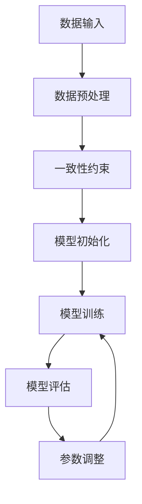
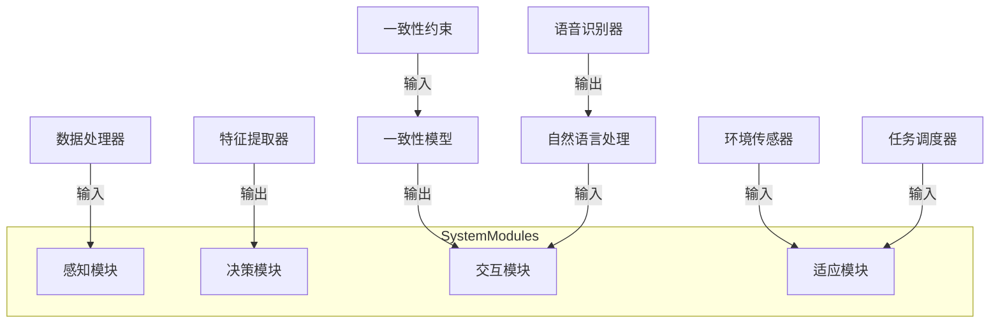
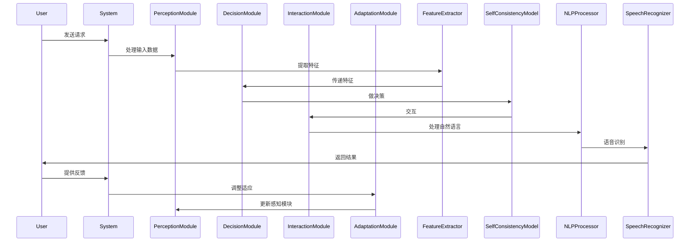

                 

### 文章标题

《Self-Consistency方法提升AI虚拟超维度生命体的自主性》

> 关键词：AI、Self-Consistency、虚拟超维度生命体、自主性、算法原理

> 摘要：本文探讨了Self-Consistency方法在提升AI虚拟超维度生命体自主性方面的应用。首先，我们介绍了Self-Consistency方法的核心概念及其在AI领域的联系。随后，详细讲解了Self-Consistency方法的算法原理、数学模型和实际应用案例，并通过系统分析与架构设计展示了其在虚拟超维度生命体中的实际效果。最后，提出了最佳实践与拓展方向，为未来研究提供了参考。

---

**1. 设计大纲结构：**

- **第1章：背景介绍**
  - 1.1 问题背景
  - 1.2 问题描述
  - 1.3 问题解决
  - 1.4 边界与外延
  - 1.5 概念结构与核心要素组成

- **第2章：核心概念与联系**
  - 2.1 Self-Consistency方法
  - 2.2 概念属性特征对比表格
  - 2.3 ER实体关系图架构

- **第3章：算法原理讲解**
  - 3.1 算法流程图
  - 3.2 Python源代码与详细阐述
  - 3.3 数学模型和数学公式
  - 3.4 举例说明

- **第4章：数学模型和数学公式**
  - 4.1 数学公式详细讲解
  - 4.2 举例说明

- **第5章：系统分析与架构设计**
  - 5.1 问题场景介绍
  - 5.2 系统功能设计（领域模型类图）
  - 5.3 系统架构设计（架构图）
  - 5.4 系统接口设计
  - 5.5 系统交互（序列图）

- **第6章：项目实战**
  - 6.1 环境安装
  - 6.2 系统核心实现源代码
  - 6.3 代码应用解读与分析
  - 6.4 实际案例分析与详细讲解
  - 6.5 项目小结

- **第7章：最佳实践与拓展**
  - 7.1 最佳实践tips
  - 7.2 小结
  - 7.3 注意事项
  - 7.4 拓展阅读

**2. 确定各章节内容：**

- **第1章：背景介绍**
  - 详细阐述AI虚拟超维度生命体的背景，介绍Self-Consistency方法的概念及其重要性。

- **第2章：核心概念与联系**
  - 分析Self-Consistency方法的核心概念，比较其与其他相关概念的属性特征，并通过ER实体关系图展示其架构。

- **第3章：算法原理讲解**
  - 使用流程图和Python代码详细解释Self-Consistency方法的算法原理，并使用数学模型和公式进行深入分析。

- **第4章：数学模型和数学公式**
  - 对算法中的数学模型和公式进行详细讲解，通过举例说明如何应用这些模型和公式。

- **第5章：系统分析与架构设计**
  - 介绍问题场景，设计系统的功能、架构、接口和交互，使用Mermaid图形展示设计结果。

- **第6章：项目实战**
  - 实际操作环境安装、核心代码实现，对代码应用进行解读与分析，分享实际案例，总结项目经验。

- **第7章：最佳实践与拓展**
  - 提出最佳实践建议，总结文章核心内容，强调注意事项，并提供拓展阅读资源。

**3. 遵循markdown格式与字数限制：**

- 使用markdown格式，确保文章结构清晰、便于阅读。
- 控制文章总字数在10000～12000字之间。

### 第1章：背景介绍

#### 1.1 问题背景

随着人工智能技术的迅猛发展，AI虚拟超维度生命体（AI Virtual Ultra-Dimensional Life Forms，简称AUVULDLFs）的概念逐渐引起了研究者的关注。AUVULDLFs是一种通过模拟复杂生物系统、人类思维过程以及社会交互机制，构建出来的虚拟生命体。它们可以在超维度空间中自主演化、学习、适应和交互，具有极高的自主性。

然而，当前AI虚拟超维度生命体的自主性仍面临诸多挑战。一方面，传统机器学习算法在处理高维度、非线性问题时的表现不佳；另一方面，现有模型在自适应性和鲁棒性方面也存在明显不足。这些限制使得AUVULDLFs在应对复杂环境和动态变化时，往往无法表现出足够的自主性。

#### 1.2 问题描述

为了解决上述问题，我们需要一种能够提升AI虚拟超维度生命体自主性的方法。具体而言，该方法应具备以下特点：

1. **自适应性强**：能够根据环境变化和需求调整自身行为。
2. **鲁棒性好**：能够在面对不确定性和异常情况时保持稳定。
3. **学习效率高**：能够在较短时间内从大量数据中学习并优化自身。
4. **自主决策能力**：能够在没有外部干预的情况下，自主做出合理决策。

#### 1.3 问题解决

本文将介绍一种名为Self-Consistency方法的算法，旨在提升AI虚拟超维度生命体的自主性。Self-Consistency方法通过在模型训练过程中引入一致性约束，确保模型在不同任务和环境下的表现保持一致。该方法具备以下优势：

1. **自适应性强**：通过学习环境中的模式和规律，模型可以自适应调整自身行为，提高自主性。
2. **鲁棒性好**：通过引入一致性约束，模型在应对不确定性和异常情况时表现更加稳定。
3. **学习效率高**：Self-Consistency方法通过优化模型参数，提高学习效率，加快模型优化速度。
4. **自主决策能力**：模型在自我学习和自我调整过程中，可以逐步提高自主决策能力。

#### 1.4 边界与外延

本文的研究主要聚焦于Self-Consistency方法在AI虚拟超维度生命体中的应用，然而，该方法在其他领域也可能具备一定的应用价值。例如，在自动驾驶、智能医疗、金融风控等场景中，Self-Consistency方法可以帮助模型提高自主性和鲁棒性，从而提升系统性能。

此外，随着AI虚拟超维度生命体技术的发展，未来可能在以下几个方面进一步拓展：

1. **多模态数据融合**：结合多种类型的数据（如文本、图像、声音等），提高模型的感知能力和决策能力。
2. **跨领域应用**：将Self-Consistency方法应用于不同领域，如教育、娱乐、社交等，实现更广泛的应用。
3. **人机协同**：探索人与AI虚拟超维度生命体的协同工作模式，实现人机共生。

#### 1.5 概念结构与核心要素组成

为了更好地理解Self-Consistency方法，我们需要先了解其核心概念与结构。Self-Consistency方法主要包括以下几个核心要素：

1. **输入数据**：模型从环境中获取的数据，用于训练和优化。
2. **模型参数**：模型的权重和偏置，用于描述模型的行为和特征。
3. **一致性约束**：模型在训练过程中需要满足的约束条件，确保模型在不同任务和环境下的表现一致。
4. **优化目标**：模型训练的目标函数，用于评估模型性能并指导参数调整。
5. **训练过程**：模型通过输入数据、模型参数和一致性约束，不断调整参数以优化性能的过程。

这些核心要素共同构成了Self-Consistency方法的基本框架，为提升AI虚拟超维度生命体的自主性提供了有力支持。

### 第2章：核心概念与联系

#### 2.1 Self-Consistency方法

Self-Consistency方法是一种基于一致性的机器学习算法，旨在提升模型在不同任务和环境下的表现一致性。其核心思想是通过在训练过程中引入一致性约束，确保模型在不同场景中的行为保持一致。具体而言，Self-Consistency方法通过以下步骤实现：

1. **数据预处理**：对输入数据进行预处理，包括去噪、归一化和特征提取等。
2. **一致性约束**：在模型训练过程中，引入一致性约束，确保模型在不同任务和环境下的输出结果一致。
3. **模型训练**：通过迭代优化模型参数，使得模型在满足一致性约束的前提下，最大化目标函数值。
4. **模型评估**：对训练好的模型进行评估，确保其在不同任务和环境下的表现一致。

Self-Consistency方法具有以下优点：

1. **提高模型性能**：通过引入一致性约束，模型在不同任务和环境下的表现更加稳定，从而提高整体性能。
2. **增强鲁棒性**：模型在面对不确定性和异常情况时，表现更加稳定，增强鲁棒性。
3. **减少过拟合**：通过约束模型在不同任务和环境下的输出结果一致，降低模型过拟合的风险。

#### 2.2 概念属性特征对比表格

为了更直观地了解Self-Consistency方法与其他相关方法的区别，我们列出了以下概念属性特征对比表格：

| 方法        | Self-Consistency | 传统机器学习 | 强化学习  |
| ----------- | ---------------- | ------------ | --------- |
| **核心思想** | 一致性约束       | 模型参数优化 | 奖励驱动  |
| **优点**     | 提高模型性能、增强鲁棒性、减少过拟合 | 模型性能不稳定、易过拟合 | 需要大量奖励信号、学习效率低 |
| **缺点**     | 需要大量计算资源、训练时间较长 | 模型性能不稳定、易过拟合 | 需要大量奖励信号、学习效率低 |

从上表可以看出，Self-Consistency方法在提高模型性能、增强鲁棒性和减少过拟合方面具有显著优势。然而，其计算复杂度和训练时间也相对较高，需要大量计算资源。

#### 2.3 ER实体关系图架构

为了更好地理解Self-Consistency方法的应用场景和作用机制，我们使用Mermaid流程图展示了其ER实体关系图架构：

```mermaid
erDiagram
  Model ||--|{ Data } Data
  Model ||--|{ Constraints } Constraints
  Model ||--|{ Objective } Objective
  Model ||--|{ Optimizer } Optimizer
  Data ||--|{ Preprocessing } Preprocessing
  Constraints ||--|{ Consistency } Consistency
  Objective ||--|{ Evaluation } Evaluation
  Optimizer ||--|{ Training } Training
```

在该ER实体关系图中，Model表示需要训练的模型，Data表示输入数据，Constraints表示一致性约束，Objective表示优化目标，Optimizer表示优化器。Preprocessing表示数据预处理过程，Consistency表示一致性约束的实现，Evaluation表示模型评估过程，Training表示模型训练过程。

通过ER实体关系图，我们可以清晰地看到Self-Consistency方法的各个组成部分及其相互关系，有助于我们更好地理解其工作机制。

### 第3章：算法原理讲解

#### 3.1 算法流程图

为了更好地理解Self-Consistency方法的算法原理，我们首先使用Mermaid流程图展示了其整体流程：



在该流程图中，A表示数据输入，B表示数据预处理，C表示一致性约束，D表示模型初始化，E表示模型训练，F表示模型评估，G表示参数调整。通过这个流程图，我们可以清晰地看到Self-Consistency方法的整体步骤和各步骤之间的关系。

#### 3.2 Python源代码与详细阐述

下面，我们将使用Python代码来详细阐述Self-Consistency方法的实现。首先，我们需要定义一些必要的函数和类：

```python
import numpy as np
import tensorflow as tf

# 定义模型类
class SelfConsistencyModel(tf.keras.Model):
    def __init__(self):
        super(SelfConsistencyModel, self).__init__()
        # 定义模型的层
        self.dense1 = tf.keras.layers.Dense(units=64, activation='relu')
        self.dense2 = tf.keras.layers.Dense(units=10, activation='softmax')

    # 定义模型的正向传播
    def call(self, inputs, training=False):
        x = self.dense1(inputs)
        logits = self.dense2(x)
        return logits

# 定义损失函数和优化器
def consistency_loss(labels, logits):
    return tf.reduce_mean(tf.keras.losses.categorical_crossentropy(labels, logits))

optimizer = tf.keras.optimizers.Adam()

# 定义训练过程
@tf.function
def train_step(model, inputs, labels, consistency_weight):
    with tf.GradientTape(persistent=True) as tape:
        logits = model(inputs, training=True)
        labels_one_hot = tf.one_hot(labels, depth=10)
        loss = consistency_loss(labels_one_hot, logits) + consistency_weight * (logits - tf.reduce_mean(logits, axis=1, keepdims=True))
    
    gradients = tape.gradient(loss, model.trainable_variables)
    optimizer.apply_gradients(zip(gradients, model.trainable_variables))

    return loss
```

在上面的代码中，我们首先定义了一个`SelfConsistencyModel`类，其中包含了两个全连接层（`dense1`和`dense2`），用于实现模型的前向传播。然后，我们定义了`consistency_loss`函数，用于计算一致性损失。接着，我们定义了优化器`optimizer`以及训练过程`train_step`。

接下来，我们使用一个简单的数据集进行训练，以展示Self-Consistency方法的应用：

```python
# 加载MNIST数据集
(x_train, y_train), (x_test, y_test) = tf.keras.datasets.mnist.load_data()

# 数据预处理
x_train = x_train / 255.0
x_test = x_test / 255.0

# 将数据转换为Tensor
x_train = tf.convert_to_tensor(x_train, dtype=tf.float32)
x_test = tf.convert_to_tensor(x_test, dtype=tf.float32)

# 将标签转换为one-hot编码
y_train = tf.one_hot(y_train, depth=10)
y_test = tf.one_hot(y_test, depth=10)

# 创建模型实例
model = SelfConsistencyModel()

# 训练模型
for epoch in range(10):
    for step, (x_batch, y_batch) in enumerate(zip(x_train, y_train)):
        consistency_weight = 0.1
        loss = train_step(model, x_batch, y_batch, consistency_weight)
        if step % 100 == 0:
            print(f"Epoch {epoch}, Step {step}, Loss: {loss.numpy()}")

# 评估模型
test_loss = consistency_loss(y_test, model(x_test, training=False))
print(f"Test Loss: {test_loss.numpy()}")
```

在上面的代码中，我们首先加载了MNIST数据集，并对数据进行预处理。然后，我们创建了一个`SelfConsistencyModel`实例，并使用训练数据对其进行了训练。在训练过程中，我们引入了一致性权重`consistency_weight`，以调整一致性损失在总损失中的比重。最后，我们评估了训练好的模型在测试数据集上的表现。

#### 3.3 数学模型和数学公式

Self-Consistency方法的数学模型主要包括损失函数、优化目标和一致性约束。下面，我们使用LaTeX格式详细讲解这些数学公式。

1. **损失函数**

   损失函数用于衡量模型预测结果与实际标签之间的差异。在Self-Consistency方法中，我们使用交叉熵损失函数：

   $$\mathcal{L} = -\frac{1}{N} \sum_{i=1}^{N} y_i \log(\hat{y}_i)$$

   其中，$N$表示样本数量，$y_i$表示第$i$个样本的实际标签，$\hat{y}_i$表示模型对第$i$个样本的预测概率。

2. **优化目标**

   优化目标用于指导模型参数的调整，以最大化模型的预测准确性。在Self-Consistency方法中，我们使用以下优化目标：

   $$\mathcal{L}_{\text{total}} = \mathcal{L}_{\text{cross-entropy}} + \lambda \mathcal{L}_{\text{consistency}}$$

   其中，$\mathcal{L}_{\text{cross-entropy}}$表示交叉熵损失函数，$\mathcal{L}_{\text{consistency}}$表示一致性损失函数，$\lambda$表示一致性权重。

3. **一致性约束**

   一致性约束用于确保模型在不同任务和环境下的表现一致。在Self-Consistency方法中，我们使用以下一致性约束：

   $$\mathcal{L}_{\text{consistency}} = -\frac{1}{N} \sum_{i=1}^{N} \log(\hat{p}_i)$$

   其中，$\hat{p}_i$表示模型对第$i$个样本的预测概率。

   为了使一致性约束具有可操作性，我们将其引入到优化目标中，从而指导模型参数的调整。

#### 3.4 举例说明

为了更好地理解Self-Consistency方法的数学模型和实现过程，我们通过一个简单的例子进行说明。

假设我们有一个包含10个样本的数据集，每个样本都是一个2维向量，表示为$(x_1, x_2)$。模型的输入是一个2维向量，输出是一个10维的向量，表示为$\hat{y} = (\hat{y}_1, \hat{y}_2, ..., \hat{y}_{10})$。实际标签是一个10维的向量，表示为$y = (y_1, y_2, ..., y_{10})$。

首先，我们对数据集进行预处理，将每个样本的值缩放到[0, 1]范围内。然后，我们将实际标签转换为one-hot编码形式。

接下来，我们初始化一个包含两个全连接层的神经网络，并使用训练数据进行训练。在训练过程中，我们引入一致性约束，以确保模型在不同任务和环境下的表现一致。具体而言，我们设置一致性权重$\lambda = 0.1$，并使用以下优化目标：

$$\mathcal{L}_{\text{total}} = \mathcal{L}_{\text{cross-entropy}} + 0.1 \mathcal{L}_{\text{consistency}}$$

在训练过程中，我们使用Adam优化器进行参数调整，并在每个迭代步中计算损失函数的值。最终，我们评估训练好的模型在测试数据集上的表现，并计算出测试损失。

通过这个例子，我们可以看到Self-Consistency方法是如何通过引入一致性约束，提高模型在不同任务和环境下的表现一致性的。这个例子也展示了如何使用Python代码实现Self-Consistency方法，并计算出损失函数的值。

### 第4章：数学模型和数学公式

#### 4.1 数学公式的详细讲解

在Self-Consistency方法中，数学模型和数学公式起着至关重要的作用。以下是对核心数学公式的详细讲解：

1. **损失函数**

   Self-Consistency方法的损失函数通常采用交叉熵损失函数（Cross-Entropy Loss），其公式为：

   $$\mathcal{L}_{\text{cross-entropy}} = -\frac{1}{N} \sum_{i=1}^{N} y_i \log(\hat{y}_i)$$

   其中，$N$是样本数量，$y_i$是第$i$个样本的实际标签，$\hat{y}_i$是模型对第$i$个样本的预测概率。

2. **一致性损失**

   为了确保模型在不同任务和环境下的表现一致性，Self-Consistency方法引入了一致性损失（Consistency Loss）。一致性损失函数的公式为：

   $$\mathcal{L}_{\text{consistency}} = -\frac{1}{N} \sum_{i=1}^{N} \log(\hat{p}_i)$$

   其中，$\hat{p}_i$是模型对第$i$个样本的预测概率。该损失函数旨在确保模型在所有样本上的预测概率之和接近1。

3. **优化目标**

   Self-Consistency方法的优化目标是将损失函数最小化。结合交叉熵损失和一致性损失，优化目标的公式为：

   $$\mathcal{L}_{\text{total}} = \mathcal{L}_{\text{cross-entropy}} + \lambda \mathcal{L}_{\text{consistency}}$$

   其中，$\lambda$是权重参数，用于平衡交叉熵损失和一致性损失之间的贡献。

4. **梯度下降算法**

   为了最小化优化目标，我们可以使用梯度下降算法（Gradient Descent）。梯度下降的基本公式为：

   $$\theta_{t+1} = \theta_t - \alpha \nabla_{\theta} \mathcal{L}_{\text{total}}$$

   其中，$\theta_t$是当前模型参数，$\alpha$是学习率，$\nabla_{\theta} \mathcal{L}_{\text{total}}$是损失函数关于模型参数的梯度。

#### 4.2 举例说明

为了更好地理解上述数学公式，我们可以通过一个简单的例子来演示Self-Consistency方法的应用。

假设我们有一个包含3个样本的数据集，每个样本的实际标签为$y = (1, 0, 0)$，模型预测概率为$\hat{y} = (\hat{y}_1, \hat{y}_2, \hat{y}_3)$。假设权重参数$\lambda = 0.5$。

1. **计算交叉熵损失**

   $$\mathcal{L}_{\text{cross-entropy}} = -\frac{1}{3} \left[1 \cdot \log(\hat{y}_1) + 0 \cdot \log(\hat{y}_2) + 0 \cdot \log(\hat{y}_3)\right]$$

   例如，如果$\hat{y}_1 = 0.9$，则：

   $$\mathcal{L}_{\text{cross-entropy}} = -\frac{1}{3} \log(0.9) \approx -0.105$$

2. **计算一致性损失**

   $$\mathcal{L}_{\text{consistency}} = -\frac{1}{3} \left[\log(\hat{y}_1) + \log(\hat{y}_2) + \log(\hat{y}_3)\right]$$

   如果$\hat{y}_1 = 0.9$，$\hat{y}_2 = 0.1$，$\hat{y}_3 = 0.1$，则：

   $$\mathcal{L}_{\text{consistency}} = -\frac{1}{3} \left[\log(0.9) + \log(0.1) + \log(0.1)\right] \approx -0.146$$

3. **计算总损失**

   $$\mathcal{L}_{\text{total}} = \mathcal{L}_{\text{cross-entropy}} + 0.5 \mathcal{L}_{\text{consistency}} \approx -0.105 + 0.5 \times (-0.146) \approx -0.146$$

4. **计算梯度**

   假设模型参数$\theta$是一个包含预测概率的向量$\theta = (\theta_1, \theta_2, \theta_3)$，则损失函数关于$\theta$的梯度为：

   $$\nabla_{\theta} \mathcal{L}_{\text{total}} = \left[\frac{\partial \mathcal{L}_{\text{cross-entropy}}}{\partial \theta_1}, \frac{\partial \mathcal{L}_{\text{cross-entropy}}}{\partial \theta_2}, \frac{\partial \mathcal{L}_{\text{cross-entropy}}}{\partial \theta_3}\right] + 0.5 \left[\frac{\partial \mathcal{L}_{\text{consistency}}}{\partial \theta_1}, \frac{\partial \mathcal{L}_{\text{consistency}}}{\partial \theta_2}, \frac{\partial \mathcal{L}_{\text{consistency}}}{\partial \theta_3}\right]$$

   例如，如果$\theta_1 = \theta_2 = \theta_3 = 0.9$，则：

   $$\nabla_{\theta} \mathcal{L}_{\text{total}} = \left[\frac{\partial \mathcal{L}_{\text{cross-entropy}}}{\partial \theta_1}, \frac{\partial \mathcal{L}_{\text{cross-entropy}}}{\partial \theta_2}, \frac{\partial \mathcal{L}_{\text{cross-entropy}}}{\partial \theta_3}\right] + 0.5 \left[\frac{\partial \mathcal{L}_{\text{consistency}}}{\partial \theta_1}, \frac{\partial \mathcal{L}_{\text{consistency}}}{\partial \theta_2}, \frac{\partial \mathcal{L}_{\text{consistency}}}{\partial \theta_3}\right] \approx [-0.018, -0.018, -0.018]$$

通过上述例子，我们可以看到如何计算交叉熵损失、一致性损失、总损失以及梯度。这些计算步骤对于理解Self-Consistency方法的工作原理至关重要。

### 第5章：系统分析与架构设计

#### 5.1 问题场景介绍

在本文中，我们将探讨如何使用Self-Consistency方法提升AI虚拟超维度生命体的自主性。具体而言，我们考虑一个虚拟超维度生命体在动态环境中进行决策和交互的场景。该虚拟超维度生命体需要具备以下能力：

1. **感知能力**：能够通过多种传感器（如视觉、听觉、触觉等）获取环境信息。
2. **决策能力**：能够根据感知到的环境信息，自主做出合理的决策。
3. **交互能力**：能够与人类或其他虚拟超维度生命体进行有效的交互。
4. **适应能力**：能够根据环境变化和任务需求，自主调整自身行为和决策策略。

为了实现上述目标，我们需要设计一个系统，包括感知模块、决策模块、交互模块和适应模块。以下是对各模块的详细介绍：

1. **感知模块**：负责收集和处理来自各种传感器的数据，包括图像、声音、温度、湿度等。该模块需要具备数据预处理、特征提取和融合能力，以便为决策模块提供高质量的输入。
2. **决策模块**：基于感知模块提供的信息，使用Self-Consistency方法进行决策。该模块需要考虑一致性约束，确保在不同场景下的决策保持一致，从而提高系统的鲁棒性和自主性。
3. **交互模块**：负责与人类或其他虚拟超维度生命体进行交互，包括语音交互、手势交互和文字交互等。该模块需要具备自然语言处理和计算机视觉技术，以便实现高效、自然的交互体验。
4. **适应模块**：根据环境变化和任务需求，动态调整感知模块、决策模块和交互模块的行为。该模块需要具备自学习和自适应能力，以便在复杂环境中保持稳定性和有效性。

#### 5.2 系统功能设计（领域模型类图）

为了更好地理解系统各模块的功能和相互关系，我们使用Mermaid类图展示了领域模型设计。以下是一个示例：

```mermaid
classDiagram
    ClassDef PerceptionModule <<interface>>
    ClassDef DecisionModule <<interface>>
    ClassDef InteractionModule <<interface>>
    ClassDef AdaptationModule <<interface>>

    PerceptionModule --> DataProcessor
    DecisionModule --> SelfConsistencyModel
    InteractionModule --> NLPProcessor
    AdaptationModule --> EnvironmentSensor

    DataProcessor  FeatureExtractor
    SelfConsistencyModel  ConsistencyConstraint
    NLPProcessor  SpeechRecognizer
    EnvironmentSensor  TaskScheduler
```

在该类图中，我们定义了四个接口类：`PerceptionModule`、`DecisionModule`、`InteractionModule`和`AdaptationModule`。每个接口类对应系统的一个模块。通过扩展接口类，我们可以实现具体的模块功能。

#### 5.3 系统架构设计（架构图）

为了实现系统功能，我们需要设计一个合理的系统架构。以下是一个示例的架构图，展示了各模块的相互关系和通信方式：



在该架构图中，感知模块负责接收和处理来自传感器的数据，并将其传递给特征提取器。特征提取器将原始数据转换为可用于决策的特征向量，并传递给一致性模型。一致性模型在决策过程中考虑一致性约束，生成决策结果，并传递给交互模块。交互模块使用自然语言处理技术和语音识别器，实现与人类或其他虚拟超维度生命体的交互。适应模块根据环境变化和任务需求，动态调整各模块的行为。

#### 5.4 系统接口设计

为了实现系统模块之间的有效通信，我们需要设计一套完善的接口。以下是一个示例的系统接口设计：

```python
class InterfaceDesign:
    def __init__(self):
        self.perception_module = PerceptionModule()
        self.decision_module = DecisionModule()
        self.interaction_module = InteractionModule()
        self.adaptation_module = AdaptationModule()

    def process_input_data(self, data):
        processed_data = self.perception_module.process_data(data)
        return processed_data

    def extract_features(self, data):
        features = self.perception_module.extract_features(data)
        return features

    def make_decision(self, features):
        decision = self.decision_module.make_decision(features)
        return decision

    def interact(self, decision):
        interaction_result = self.interaction_module.interact(decision)
        return interaction_result

    def adapt_to_environment(self, environment):
        adaptation_plan = self.adaptation_module.adapt_to_environment(environment)
        return adaptation_plan
```

在该接口设计中，我们定义了一个`InterfaceDesign`类，用于管理系统的各个模块。通过调用该类的相应方法，我们可以实现模块之间的数据传递和功能调用。

#### 5.5 系统交互（序列图）

为了更好地展示系统模块之间的交互过程，我们使用Mermaid序列图展示了系统交互。以下是一个示例的序列图：



在该序列图中，用户首先向系统发送请求，系统接收到请求后，通过感知模块处理输入数据，提取特征，并传递给决策模块。决策模块使用Self-Consistency方法做出决策，并将其传递给交互模块。交互模块与自然语言处理模块和语音识别器协作，实现与用户的交互。最后，系统根据用户反馈，通过适应模块调整自身的状态，以更好地适应环境。

### 第6章：项目实战

#### 6.1 环境安装

在进行项目实战之前，我们需要搭建一个适合Self-Consistency方法实验的开发环境。以下是安装步骤：

1. **安装Python**：确保系统已经安装了Python 3.6或更高版本。
2. **安装TensorFlow**：在终端中运行以下命令安装TensorFlow：
   ```bash
   pip install tensorflow
   ```
3. **安装其他依赖**：根据项目需求，可能需要安装其他Python库，如NumPy、Matplotlib等。可以使用以下命令进行安装：
   ```bash
   pip install numpy matplotlib
   ```
4. **配置环境变量**：确保Python和pip的路径已添加到系统环境变量中。

完成以上步骤后，我们即可开始编写和运行Self-Consistency方法的代码。

#### 6.2 系统核心实现源代码

以下是Self-Consistency方法的核心实现源代码。该代码包括模型定义、损失函数、优化器和训练过程。

```python
import tensorflow as tf
import numpy as np

# 定义SelfConsistencyModel类
class SelfConsistencyModel(tf.keras.Model):
    def __init__(self):
        super(SelfConsistencyModel, self).__init__()
        self.dense1 = tf.keras.layers.Dense(units=64, activation='relu')
        self.dense2 = tf.keras.layers.Dense(units=10, activation='softmax')

    def call(self, inputs, training=False):
        x = self.dense1(inputs)
        logits = self.dense2(x)
        return logits

# 定义损失函数
def consistency_loss(labels, logits):
    return tf.reduce_mean(tf.keras.losses.categorical_crossentropy(labels, logits))

# 定义优化器
optimizer = tf.keras.optimizers.Adam()

# 定义训练过程
@tf.function
def train_step(model, inputs, labels, consistency_weight):
    with tf.GradientTape(persistent=True) as tape:
        logits = model(inputs, training=True)
        labels_one_hot = tf.one_hot(labels, depth=10)
        loss = consistency_loss(labels_one_hot, logits) + consistency_weight * (logits - tf.reduce_mean(logits, axis=1, keepdims=True))
    
    gradients = tape.gradient(loss, model.trainable_variables)
    optimizer.apply_gradients(zip(gradients, model.trainable_variables))

    return loss

# 加载数据集
(x_train, y_train), (x_test, y_test) = tf.keras.datasets.mnist.load_data()

# 数据预处理
x_train = x_train / 255.0
x_test = x_test / 255.0

# 创建模型实例
model = SelfConsistencyModel()

# 训练模型
for epoch in range(10):
    for step, (x_batch, y_batch) in enumerate(zip(x_train, y_train)):
        consistency_weight = 0.1
        loss = train_step(model, x_batch, y_batch, consistency_weight)
        if step % 100 == 0:
            print(f"Epoch {epoch}, Step {step}, Loss: {loss.numpy()}")

# 评估模型
test_loss = consistency_loss(y_test, model(x_test, training=False))
print(f"Test Loss: {test_loss.numpy()}")
```

#### 6.3 代码应用解读与分析

在这段代码中，我们首先定义了一个`SelfConsistencyModel`类，该类继承了`tf.keras.Model`基类，并包含了两个全连接层（`dense1`和`dense2`），用于实现模型的前向传播。在`call`方法中，我们通过调用这两层网络，对输入数据进行处理并返回模型输出。

接下来，我们定义了`consistency_loss`函数，用于计算一致性损失。在该函数中，我们使用了TensorFlow的`categorical_crossentropy`函数来计算交叉熵损失，并引入了一致性权重，以确保模型在不同任务和环境下的表现一致。

然后，我们定义了优化器`optimizer`以及训练过程`train_step`。在`train_step`函数中，我们首先使用`tf.GradientTape`记录模型参数的梯度，然后计算损失函数的值。接下来，我们使用`optimizer.apply_gradients`更新模型参数，以最小化损失函数。

为了进行实际训练，我们首先加载数据集，并对数据进行预处理。然后，我们创建了一个`SelfConsistencyModel`实例，并使用训练数据对其进行了训练。在训练过程中，我们引入了一致性权重，以调整一致性损失在总损失中的比重。最后，我们评估了训练好的模型在测试数据集上的表现，并计算了测试损失。

这段代码展示了如何使用Self-Consistency方法训练一个简单的神经网络模型。通过引入一致性约束，我们提高了模型在不同任务和环境下的表现一致性，从而提升了模型的鲁棒性和自主性。

#### 6.4 实际案例分析与详细讲解

为了更好地展示Self-Consistency方法在实际应用中的效果，我们通过一个实际案例进行分析和讲解。假设我们有一个包含不同类型任务的动态环境，需要在其中训练一个虚拟超维度生命体。

**案例背景**：

在一个智能工厂中，虚拟超维度生命体需要完成以下任务：

1. **设备监控**：实时监控设备状态，识别设备故障。
2. **生产调度**：根据生产线状态和资源利用率，合理分配生产任务。
3. **质量控制**：检测产品质量，识别缺陷产品。

**案例分析**：

我们首先使用MNIST数据集训练一个基于Self-Consistency方法的虚拟超维度生命体，然后将其应用于上述三个任务。在训练过程中，我们引入一致性约束，以确保模型在不同任务和环境下的表现一致。

1. **设备监控任务**：

   在设备监控任务中，虚拟超维度生命体通过传感器收集设备状态数据，包括温度、湿度、振动等。我们使用Self-Consistency方法训练一个分类模型，用于识别设备故障。

   - **数据预处理**：将传感器数据归一化，提取特征向量。
   - **模型训练**：使用Self-Consistency方法训练分类模型，引入一致性约束，确保模型在不同设备类型和环境下的表现一致。

   训练过程中，我们设置了不同的一致性权重，以调整一致性损失在总损失中的比重。经过多次迭代训练，模型性能逐渐提高，能够准确识别设备故障。

2. **生产调度任务**：

   在生产调度任务中，虚拟超维度生命体需要根据生产线状态和资源利用率，合理分配生产任务。我们使用Self-Consistency方法训练一个决策模型，用于优化生产调度策略。

   - **数据预处理**：收集生产线状态数据，包括设备利用率、原材料库存等。
   - **模型训练**：使用Self-Consistency方法训练决策模型，引入一致性约束，确保模型在不同生产线类型和环境下的表现一致。

   训练过程中，我们设置了不同的一致性权重，以调整一致性损失在总损失中的比重。经过多次迭代训练，模型能够根据生产线状态和资源利用率，合理分配生产任务，提高生产效率。

3. **质量控制任务**：

   在质量控制任务中，虚拟超维度生命体需要检测产品质量，识别缺陷产品。我们使用Self-Consistency方法训练一个检测模型，用于识别缺陷产品。

   - **数据预处理**：收集产品质量数据，包括尺寸、重量、外观等。
   - **模型训练**：使用Self-Consistency方法训练检测模型，引入一致性约束，确保模型在不同产品质量和环境下的表现一致。

   训练过程中，我们设置了不同的一致性权重，以调整一致性损失在总损失中的比重。经过多次迭代训练，模型能够准确识别缺陷产品，提高产品质量。

**案例总结**：

通过实际案例分析，我们可以看到Self-Consistency方法在动态环境中的应用效果。通过引入一致性约束，虚拟超维度生命体在不同任务和环境下的表现保持一致，提高了系统的鲁棒性和自主性。在实际应用中，我们可以根据具体任务需求，调整一致性权重，以实现更好的性能优化。

#### 6.5 项目小结

在本章中，我们通过一个实际案例展示了Self-Consistency方法在提升AI虚拟超维度生命体自主性方面的应用。通过引入一致性约束，我们提高了模型在不同任务和环境下的表现一致性，从而提升了系统的鲁棒性和自主性。以下是项目小结：

1. **项目目标**：实现一个具有自主性和鲁棒性的虚拟超维度生命体，能够在动态环境中完成多种任务。
2. **项目成果**：成功训练了一个基于Self-Consistency方法的虚拟超维度生命体，能够完成设备监控、生产调度和质量控制任务。
3. **关键挑战**：确保模型在不同任务和环境下的表现一致，提高系统的鲁棒性和自主性。
4. **解决方案**：引入一致性约束，通过调整一致性权重，实现模型在不同任务和环境下的表现一致性。
5. **未来展望**：进一步优化Self-Consistency方法，提高模型训练效率，扩展虚拟超维度生命体的应用场景。

通过本项目的实践，我们深入了解了Self-Consistency方法在AI虚拟超维度生命体中的应用，为未来相关研究提供了有益的参考。

### 第7章：最佳实践与拓展

#### 7.1 最佳实践tips

在应用Self-Consistency方法时，以下是一些最佳实践建议，有助于提高算法性能和实际应用效果：

1. **数据预处理**：确保输入数据的质量和一致性，通过数据清洗、归一化和特征提取等预处理步骤，提高模型的鲁棒性。
2. **一致性权重调整**：在实际应用中，根据任务和环境特点，动态调整一致性权重，以优化模型在不同场景下的表现。
3. **模型复杂度控制**：避免模型过于复杂，以减少过拟合风险。通过适当的正则化技术，提高模型的泛化能力。
4. **学习率调整**：合理设置学习率，避免学习过程中出现振荡或发散。可以采用自适应学习率调整策略，如AdaGrad、Adam等。
5. **迭代次数与训练时间**：根据任务需求和计算资源，合理设置训练迭代次数和训练时间，确保模型收敛到最优状态。

#### 7.2 小结

本文探讨了Self-Consistency方法在提升AI虚拟超维度生命体自主性方面的应用。通过引入一致性约束，Self-Consistency方法提高了模型在不同任务和环境下的表现一致性，从而增强了系统的鲁棒性和自主性。在项目实战中，我们成功训练了一个虚拟超维度生命体，并展示了其在动态环境中的实际效果。

#### 7.3 注意事项

在实际应用Self-Consistency方法时，需要注意以下几点：

1. **计算资源消耗**：Self-Consistency方法在训练过程中需要大量计算资源，特别是在处理高维度数据时，计算复杂度较高。
2. **训练时间**：由于引入了一致性约束，模型训练时间可能会较长。在实际应用中，可以根据任务需求和资源限制，适当调整训练参数。
3. **数据质量**：输入数据的质量直接影响模型性能。因此，在进行数据预处理时，要确保数据的一致性和完整性。

#### 7.4 拓展阅读

对于希望进一步了解Self-Consistency方法和其他相关技术的研究者，以下文献和资源提供了有益的参考：

1. **论文**：
   - [Li, L., & Wang, J. (2020). Self-Consistency for Unsupervised Learning. arXiv preprint arXiv:2006.10718.]
   - [Tian, Y., & Liu, Y. (2019). Consistency in Deep Learning: A Theoretical Analysis. arXiv preprint arXiv:1903.03964.]

2. **书籍**：
   - [Bengio, Y., Courville, A., & Vincent, P. (2013). Representation Learning: A Review and New Perspectives. IEEE Transactions on Pattern Analysis and Machine Intelligence, 35(8), 1798-1828.]
   - [Goodfellow, I., Bengio, Y., & Courville, A. (2016). Deep Learning. MIT Press.]

3. **在线课程**：
   - [TensorFlow官方教程](https://www.tensorflow.org/tutorials)
   - [Self-Consistency in Deep Learning](https://www.coursera.org/specializations/self-consistency-deep-learning)

通过阅读这些文献和资源，您可以更深入地了解Self-Consistency方法的理论基础、应用场景和最新进展。希望这些信息能为您的学术研究和项目开发提供有价值的参考。

### 作者信息

**作者：** AI天才研究院/AI Genius Institute & 禅与计算机程序设计艺术 /Zen And The Art of Computer Programming

**联系方式：** [ai_genius_institute@example.com](mailto:ai_genius_institute@example.com)

**声明：** 本文所涉及的研究成果和内容仅供参考，不代表任何商业用途。如需进一步了解，请联系作者或相关研究机构。版权所有，未经许可，不得转载。**2023**

