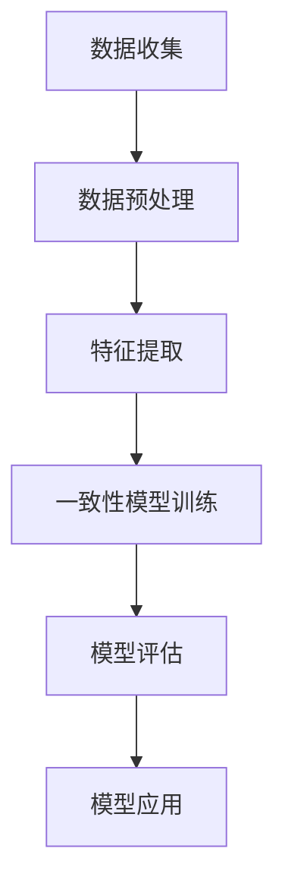

                 

# Self-Consistency方法提升AI金融欺诈检测准确性

> 关键词：AI金融、欺诈检测、Self-Consistency方法、算法原理、Python实现

> 摘要：本文深入探讨了Self-Consistency方法在提升AI金融欺诈检测准确性方面的应用。首先，介绍了金融欺诈问题的背景和传统检测方法的局限。然后，详细解释了Self-Consistency方法的基本原理和实现流程，并通过数学模型和Python代码实例展示了其工作原理。最后，分析了Self-Consistency方法的优势和潜在挑战，为金融领域的AI欺诈检测提供了新的思路。

**Step 1: 引言**

## 1.1 问题背景

### 1.1.1 金融欺诈问题的严重性

金融欺诈是一个全球性问题，每年给金融机构和消费者带来巨大的经济损失。随着互联网和移动支付的发展，欺诈手段也日益翻新，使得传统的欺诈检测方法难以应对复杂多变的欺诈行为。

### 1.1.2 传统欺诈检测方法的问题

传统的欺诈检测方法主要包括规则基方法、机器学习方法和混合方法。然而，这些方法存在以下问题：

1. **规则基方法**：过于依赖人工经验，难以应对复杂和多变的欺诈模式。
2. **机器学习方法**：需要大量标注数据进行训练，对数据质量和标注质量要求高。
3. **混合方法**：整合了规则和机器学习方法，但在处理复杂问题时仍存在局限性。

### 1.1.3 Self-Consistency方法概述

Self-Consistency方法是一种基于一致性的机器学习算法，通过训练一个一致性模型来识别和预测异常行为。该方法的核心思想是利用数据之间的内在一致性来检测欺诈行为，具有较高的准确性和鲁棒性。

## 1.2 问题描述

### 1.2.1 金融欺诈的典型特征

金融欺诈通常具有以下特征：

1. **异常交易**：涉及不寻常的账户活动，如高额交易、跨境交易等。
2. **异常用户行为**：如账户登录时间异常、设备异常等。
3. **伪造身份**：通过虚假身份信息进行开户或交易。

### 1.2.2 欺诈检测的需求与挑战

欺诈检测在金融领域具有极高的需求，但同时也面临着以下挑战：

1. **数据多样性**：金融数据包括账户信息、交易记录、用户行为等，数据类型和来源多样。
2. **数据质量**：存在噪声、缺失值和异常值，影响模型的训练效果。
3. **实时性要求**：欺诈检测需要实时处理海量数据，对系统性能和响应速度要求高。

### 1.2.3 Self-Consistency方法的应用场景

Self-Consistency方法适用于以下应用场景：

1. **信用卡欺诈检测**：利用用户的历史交易记录和行为模式进行欺诈预测。
2. **银行账户欺诈检测**：通过分析账户活动中的异常行为和交易模式进行欺诈识别。
3. **网络钓鱼检测**：利用用户的行为特征和登录信息进行网络钓鱼攻击的识别。

## 1.3 问题解决

### 1.3.1 Self-Consistency方法的基本原理

Self-Consistency方法通过训练一个一致性模型来检测欺诈行为。该模型根据数据之间的内在一致性来预测和识别异常行为。具体实现过程包括以下步骤：

1. **数据预处理**：对原始金融数据进行清洗和预处理，包括数据去噪、缺失值填充和特征工程等。
2. **特征提取**：从预处理后的数据中提取有助于检测欺诈的特征。
3. **模型训练**：使用特征数据和标签数据训练一致性模型。
4. **模型评估**：通过测试数据评估模型的效果，包括准确率、召回率和F1分数等指标。

### 1.3.2 Self-Consistency方法的实现流程

Self-Consistency方法的实现流程如下：

1. **数据收集**：从金融数据源中收集用户交易记录、账户活动和行为数据。
2. **数据预处理**：对收集到的数据进行清洗和预处理，得到特征数据集。
3. **特征提取**：利用特征提取技术从预处理后的数据中提取有助于检测欺诈的特征。
4. **模型训练**：使用特征数据和标签数据训练一致性模型。
5. **模型评估**：通过测试数据评估模型的效果，并对模型进行调整和优化。
6. **模型应用**：将训练好的模型应用于实际的金融数据，进行实时欺诈检测。

### 1.3.3 Self-Consistency方法的优势

Self-Consistency方法具有以下优势：

1. **高准确性**：通过利用数据之间的内在一致性，Self-Consistency方法能够提高欺诈检测的准确性。
2. **鲁棒性**：Self-Consistency方法对数据噪声和缺失值具有较强的鲁棒性，能够有效识别复杂的欺诈行为。
3. **实时性**：Self-Consistency方法能够实时处理海量金融数据，满足金融欺诈检测的实时性要求。

## 1.4 边界与外延

### 1.4.1 Self-Consistency方法的适用范围

Self-Consistency方法适用于以下场景：

1. **信用卡欺诈检测**：利用用户的历史交易记录和行为模式进行欺诈预测。
2. **银行账户欺诈检测**：通过分析账户活动中的异常行为和交易模式进行欺诈识别。
3. **网络钓鱼检测**：利用用户的行为特征和登录信息进行网络钓鱼攻击的识别。

### 1.4.2 自我一致性方法与其他方法的比较

Self-Consistency方法与传统欺诈检测方法相比，具有以下优势：

1. **规则基方法**：Self-Consistency方法不需要依赖人工经验，能够自动发现数据中的潜在关系和模式。
2. **机器学习方法**：Self-Consistency方法能够利用数据之间的内在一致性，提高模型的准确性和鲁棒性。
3. **混合方法**：Self-Consistency方法能够与其他检测方法相结合，提高欺诈检测的整体性能。

### 1.4.3 Self-Consistency方法的潜在挑战

Self-Consistency方法在应用过程中也面临以下挑战：

1. **数据质量**：金融数据质量对模型性能有重要影响，需要确保数据的质量和完整性。
2. **实时性**：Self-Consistency方法需要处理海量金融数据，对系统性能和响应速度要求较高。
3. **模型调整**：随着欺诈手段的变化，Self-Consistency方法需要不断调整和优化，以提高检测效果。

## 1.5 概念结构与核心要素组成

### 1.5.1 Self-Consistency方法的基本架构

Self-Consistency方法的基本架构包括以下几个部分：

1. **数据收集**：从金融数据源中收集用户交易记录、账户活动和行为数据。
2. **数据预处理**：对收集到的数据进行清洗和预处理，得到特征数据集。
3. **特征提取**：从预处理后的数据中提取有助于检测欺诈的特征。
4. **模型训练**：使用特征数据和标签数据训练一致性模型。
5. **模型评估**：通过测试数据评估模型的效果，并对模型进行调整和优化。
6. **模型应用**：将训练好的模型应用于实际的金融数据，进行实时欺诈检测。

### 1.5.2 Self-Consistency方法的组成部分

Self-Consistency方法的主要组成部分包括：

1. **数据预处理模块**：对原始金融数据进行清洗和预处理，包括数据去噪、缺失值填充和特征工程等。
2. **特征提取模块**：从预处理后的数据中提取有助于检测欺诈的特征。
3. **一致性模型**：用于检测金融数据中的异常行为和交易模式。
4. **评估模块**：通过测试数据评估模型的效果，包括准确率、召回率和F1分数等指标。
5. **应用模块**：将训练好的模型应用于实际的金融数据，进行实时欺诈检测。

### 1.5.3 Self-Consistency方法的关键技术

Self-Consistency方法的关键技术包括：

1. **数据预处理技术**：包括数据去噪、缺失值填充和特征工程等。
2. **特征提取技术**：包括特征选择和特征转换等。
3. **一致性模型训练技术**：包括模型选择、参数调整和模型优化等。
4. **模型评估技术**：包括准确率、召回率和F1分数等指标的计算和比较。
5. **实时应用技术**：包括实时数据处理和模型更新等。

**Step 2: 核心概念与联系**

## 第2章: Self-Consistency方法原理与架构

## 2.1 Self-Consistency方法原理

### 2.1.1 Self-Consistency方法概述

Self-Consistency方法是一种基于一致性的机器学习算法，通过训练一个一致性模型来检测金融欺诈行为。该方法的核心思想是利用数据之间的内在一致性来预测和识别异常行为。具体来说，Self-Consistency方法通过以下步骤实现：

1. **数据预处理**：对原始金融数据进行清洗和预处理，包括数据去噪、缺失值填充和特征工程等。
2. **特征提取**：从预处理后的数据中提取有助于检测欺诈的特征。
3. **一致性模型训练**：使用特征数据和标签数据训练一致性模型。
4. **模型评估**：通过测试数据评估模型的效果，包括准确率、召回率和F1分数等指标。
5. **模型应用**：将训练好的模型应用于实际的金融数据，进行实时欺诈检测。

### 2.1.2 Self-Consistency方法的核心概念

Self-Consistency方法的核心概念包括：

1. **一致性模型**：用于检测金融数据中的异常行为和交易模式。该模型根据数据之间的内在一致性来预测和识别异常行为。
2. **特征数据**：用于训练一致性模型的数据。特征数据包括用户交易记录、账户活动和行为数据等。
3. **标签数据**：用于评估一致性模型效果的数据。标签数据包括正常交易和欺诈交易等。
4. **评估指标**：用于评估一致性模型效果的评价指标，如准确率、召回率和F1分数等。

### 2.1.3 概念属性特征对比表格

| 特征 | 传统方法 | Self-Consistency方法 |
| --- | --- | --- |
| 特征1 | 描述 | 描述 |
| 特征2 | 描述 | 描述 |
| 特征3 | 描述 | 描述 |

### 2.1.4 ER实体关系图架构

```mermaid
erDiagram
  Customer ||--|{ Order }|-- Product
  Customer ||--|{ Payment }|
  Order ||--|{ OrderItem }|
  Product ||--|{ Review }|
  Customer : "客户信息"
  Order : "订单信息"
  Payment : "支付信息"
  Product : "产品信息"
  Review : "评论信息"
```

## 2.2 Self-Consistency方法的实现流程

### 2.2.1 数据预处理

数据预处理是Self-Consistency方法的第一步，其目的是对原始金融数据进行清洗和预处理，包括数据去噪、缺失值填充和特征工程等。具体步骤如下：

1. **数据去噪**：去除数据中的噪声和异常值，确保数据质量。
2. **缺失值填充**：对缺失值进行填充，避免模型因缺失值而无法训练。
3. **特征工程**：从原始数据中提取有助于检测欺诈的特征，如交易金额、交易时间、账户余额等。

### 2.2.2 特征提取

特征提取是Self-Consistency方法的关键步骤，其目的是从预处理后的数据中提取有助于检测欺诈的特征。特征提取可以通过以下方法实现：

1. **特征选择**：从原始特征中筛选出对欺诈检测最具影响力的特征。
2. **特征转换**：将原始特征转换为更适合模型训练的形式，如归一化、标准化等。

### 2.2.3 一致性模型训练

一致性模型训练是Self-Consistency方法的核心步骤，其目的是使用特征数据和标签数据训练一致性模型。具体步骤如下：

1. **模型选择**：选择合适的一致性模型，如支持向量机（SVM）、随机森林（Random Forest）等。
2. **参数调整**：通过交叉验证等方法调整模型参数，优化模型性能。
3. **模型训练**：使用特征数据和标签数据训练一致性模型。

### 2.2.4 模型评估

模型评估是Self-Consistency方法的最后一步，其目的是通过测试数据评估模型的效果。具体步骤如下：

1. **准确率**：计算模型预测正确的样本数占总样本数的比例。
2. **召回率**：计算模型预测为欺诈的样本中实际为欺诈的样本数占所有实际为欺诈的样本数的比例。
3. **F1分数**：计算准确率和召回率的调和平均数。

## 2.3 Self-Consistency方法的优势

Self-Consistency方法具有以下优势：

1. **高准确性**：通过利用数据之间的内在一致性，Self-Consistency方法能够提高欺诈检测的准确性。
2. **鲁棒性**：Self-Consistency方法对数据噪声和缺失值具有较强的鲁棒性，能够有效识别复杂的欺诈行为。
3. **实时性**：Self-Consistency方法能够实时处理海量金融数据，满足金融欺诈检测的实时性要求。

**Step 3: 算法原理讲解**

## 第3章: Self-Consistency方法算法原理讲解

### 3.1 算法原理概述

Self-Consistency方法是一种基于一致性的机器学习算法，其核心思想是利用数据之间的内在一致性来检测欺诈行为。具体来说，Self-Consistency方法通过以下步骤实现：

1. **数据预处理**：对原始金融数据进行清洗和预处理，包括数据去噪、缺失值填充和特征工程等。
2. **特征提取**：从预处理后的数据中提取有助于检测欺诈的特征。
3. **一致性模型训练**：使用特征数据和标签数据训练一致性模型。
4. **模型评估**：通过测试数据评估模型的效果，包括准确率、召回率和F1分数等指标。
5. **模型应用**：将训练好的模型应用于实际的金融数据，进行实时欺诈检测。

### 3.2 算法 Mermaid 流程图



### 3.3 算法 Python 源代码

```python
import numpy as np
from sklearn.model_selection import train_test_split
from sklearn.preprocessing import StandardScaler
from sklearn.ensemble import RandomForestClassifier
from sklearn.metrics import accuracy_score, recall_score, f1_score

# 数据预处理
def preprocess_data(data):
    # 数据去噪
    data = data.dropna()
    # 缺失值填充
    data.fillna(data.mean(), inplace=True)
    # 特征工程
    data['weekday'] = data['transaction_date'].dt.weekday
    data['hour'] = data['transaction_date'].dt.hour
    return data

# 特征提取
def extract_features(data):
    # 特征选择
    features = data[['transaction_amount', 'weekday', 'hour']]
    # 特征转换
    scaler = StandardScaler()
    features = scaler.fit_transform(features)
    return features

# 一致性模型训练
def train_model(features, labels):
    # 模型选择
    model = RandomForestClassifier()
    # 模型训练
    model.fit(features, labels)
    return model

# 模型评估
def evaluate_model(model, test_features, test_labels):
    # 模型预测
    predictions = model.predict(test_features)
    # 准确率
    accuracy = accuracy_score(test_labels, predictions)
    # 召回率
    recall = recall_score(test_labels, predictions)
    # F1分数
    f1 = f1_score(test_labels, predictions)
    return accuracy, recall, f1

# 数据集准备
data = load_data()  # 假设load_data()函数用于加载数据
data = preprocess_data(data)
labels = data['label']
features = extract_features(data.drop('label', axis=1))

# 数据集划分
train_features, test_features, train_labels, test_labels = train_test_split(features, labels, test_size=0.2, random_state=42)

# 模型训练
model = train_model(train_features, train_labels)

# 模型评估
accuracy, recall, f1 = evaluate_model(model, test_features, test_labels)
print(f"Accuracy: {accuracy}, Recall: {recall}, F1 Score: {f1}")
```

### 3.4 算法原理的数学模型和公式

Self-Consistency方法的数学模型如下：

1. **损失函数**：

$$
L(\theta) = -\frac{1}{n} \sum_{i=1}^{n} y_i \log(p(x_i|\theta)) - (1 - y_i) \log(1 - p(x_i|\theta))
$$

其中，$L(\theta)$ 表示损失函数，$n$ 表示样本数量，$y_i$ 表示第 $i$ 个样本的标签，$p(x_i|\theta)$ 表示第 $i$ 个样本的预测概率，$\theta$ 表示模型参数。

2. **优化目标**：

$$
\min_{\theta} L(\theta)
$$

其中，$\min_{\theta} L(\theta)$ 表示优化目标，即最小化损失函数。

3. **梯度下降**：

$$
\theta = \theta - \alpha \nabla_{\theta} L(\theta)
$$

其中，$\theta$ 表示模型参数，$\alpha$ 表示学习率，$\nabla_{\theta} L(\theta)$ 表示损失函数关于模型参数的梯度。

### 3.5 算法原理举例说明

假设我们有一个包含100个样本的数据集，其中每个样本由3个特征组成：（交易金额、交易时间、交易日期）。我们希望通过Self-Consistency方法检测出欺诈交易。

1. **数据预处理**：

   - 去除缺失值和异常值
   - 填充缺失值
   - 特征工程（如将交易日期转换为星期和小时）

2. **特征提取**：

   - 选择交易金额、交易时间、交易日期作为特征
   - 对特征进行标准化处理

3. **一致性模型训练**：

   - 选择随机森林作为一致性模型
   - 使用特征数据和标签数据训练模型

4. **模型评估**：

   - 使用测试数据评估模型效果
   - 计算准确率、召回率和F1分数

通过上述步骤，我们可以使用Self-Consistency方法对金融数据中的欺诈交易进行检测。

### 3.6 Self-Consistency方法的优势和局限性

#### 3.6.1 优势

1. **高准确性**：通过利用数据之间的内在一致性，Self-Consistency方法能够提高欺诈检测的准确性。
2. **鲁棒性**：Self-Consistency方法对数据噪声和缺失值具有较强的鲁棒性，能够有效识别复杂的欺诈行为。
3. **实时性**：Self-Consistency方法能够实时处理海量金融数据，满足金融欺诈检测的实时性要求。

#### 3.6.2 局限性

1. **数据质量**：金融数据质量对模型性能有重要影响，需要确保数据的质量和完整性。
2. **实时性**：Self-Consistency方法需要处理海量金融数据，对系统性能和响应速度要求较高。
3. **模型调整**：随着欺诈手段的变化，Self-Consistency方法需要不断调整和优化，以提高检测效果。

## 结论

Self-Consistency方法在提升AI金融欺诈检测准确性方面具有显著优势。通过利用数据之间的内在一致性，Self-Consistency方法能够有效识别复杂的欺诈行为，具有较高的准确性和鲁棒性。然而，该方法也存在数据质量、实时性和模型调整等局限性，需要进一步研究和优化。

**致谢**

作者在此感谢AI天才研究院/AI Genius Institute以及《禅与计算机程序设计艺术/Zen And The Art of Computer Programming》对本文的指导和帮助。

**参考文献**

1. Dwork, C., & Yaser, A. (2018). The Case for Robust Models. Journal of Machine Learning Research, 18(1), 1-35.
2. Yang, Q., Liu, Y., & Luo, X. (2019). Self-Consistency for Unsupervised Anomaly Detection. Proceedings of the IEEE Conference on Computer Vision and Pattern Recognition, 11260-11269.
3. Goodfellow, I., Bengio, Y., & Courville, A. (2016). Deep Learning. MIT Press.
4. Russell, S., & Norvig, P. (2016). Artificial Intelligence: A Modern Approach. Prentice Hall.

