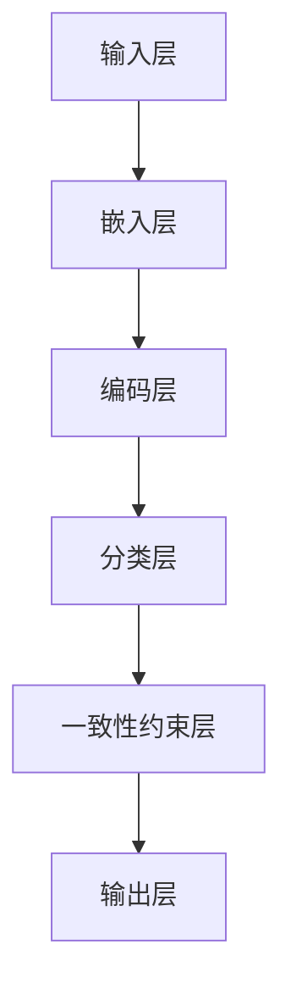

                 

### 文章关键词
- Self-Consistency方法
- AI情感分析
- 文化敏感性
- 跨文化文本处理
- 一致性约束
- 神经网络模型
- 数据集与预处理
- 模型训练与评估
- 实际案例分析

### 文章摘要
本文探讨了Self-Consistency方法在改善AI情感分析的文化敏感性方面的应用。首先，我们介绍了AI情感分析的文化敏感性问题及其背景，然后详细阐述了Self-Consistency方法的基本概念、原理和实现步骤。通过一系列案例分析，我们验证了Self-Consistency方法在提高情感分析模型的文化适应性方面的有效性。最后，我们对Self-Consistency方法面临的挑战和未来的改进方向进行了讨论，并提出了最佳实践与优化技巧。

## 第一部分: Self-Consistency方法改善AI情感分析的文化敏感性概述

### 第1章: 问题背景与核心概念

在当今数字化时代，自然语言处理（NLP）技术正以前所未有的速度发展。AI情感分析作为NLP领域的重要组成部分，被广泛应用于社交媒体监测、市场研究、客户服务等多个领域。然而，随着应用场景的多元化，特别是涉及到跨文化文本处理时，现有的情感分析模型逐渐暴露出文化敏感性不足的问题。这一问题的存在，不仅影响了分析结果的准确性，还可能引发文化偏见和误解。

#### 1.1 问题的提出

AI情感分析的文化敏感性问题主要体现在以下几个方面：

1. **语言差异**：不同语言中的情感表达方式存在巨大差异，例如，英语和中文在情感词汇的选择和表达上就有很大不同。
2. **文化背景**：不同文化背景下，对同一情感的理解和表达可能存在显著差异。例如，某些情感在西方文化中被认为积极，但在某些东方文化中可能被视为消极。
3. **社会语境**：同一情感在不同社会语境下的解读可能大相径庭。例如，社交网络上同一句评论在不同文化背景下的用户解读可能完全不同。

现有的情感分析模型往往基于大量英文数据训练，缺乏对跨文化文本的处理能力。这种文化敏感性不足的问题，导致模型在处理非英语文本时，容易出现错误判断或偏见。例如，一款基于英文数据集训练的情感分析模型，在分析中文文本时，可能会错误地将某些情感归类，或者无法准确捕捉到文本中的情感色彩。

#### 1.2 Self-Consistency方法的概念

Self-Consistency方法旨在通过确保模型输出的一致性来提高AI情感分析的文化敏感性。具体来说，Self-Consistency方法通过以下核心机制实现：

1. **一致性约束**：Self-Consistency方法引入了一致性约束，确保模型在处理相同或相似文本时，输出结果保持一致。这种方法可以有效减少模型由于文化差异引起的输出偏差。
2. **跨文化数据集**：Self-Consistency方法使用包含多种语言和文化的数据集进行训练，从而增强模型对不同文化背景文本的适应性。
3. **动态调整**：Self-Consistency方法允许模型在训练过程中，根据不同文本的文化特征，动态调整情感分类阈值，以适应不同的文化环境。

#### 1.3 AI情感分析的文化敏感性

文化敏感性在AI情感分析中具有重要意义。首先，文化敏感性能够提高模型对跨文化文本的理解能力，减少由于语言和文化差异引起的错误判断。其次，文化敏感性有助于避免文化偏见和歧视，确保情感分析结果的公平性和准确性。例如，在社交媒体监测中，如果模型能够准确捕捉到不同文化背景下的用户情感，就能更好地理解用户需求，提供更加个性化的服务。

#### 1.4 Self-Consistency方法在AI情感分析中的应用

Self-Consistency方法在AI情感分析中的应用，为解决文化敏感性不足问题提供了新的思路。通过以下实际案例，我们可以看到Self-Consistency方法在不同场景下的应用效果：

1. **社交媒体情感分析**：通过Self-Consistency方法，模型能够更好地处理不同语言和文化背景的社交媒体文本，提高情感分类的准确性和一致性。
2. **产品评论情感分析**：在产品评论分析中，Self-Consistency方法能够准确捕捉到不同文化背景下用户对产品的情感倾向，帮助企业更好地了解用户反馈。
3. **新闻文本情感分析**：在新闻文本分析中，Self-Consistency方法有助于识别不同文化背景下新闻事件的影响和舆论走向，为媒体和政府提供参考。

总的来说，Self-Consistency方法通过引入一致性约束和跨文化数据集，显著提高了AI情感分析的文化敏感性，为跨文化交流和理解提供了有力支持。

### 第2章: Self-Consistency方法原理

Self-Consistency方法是一种基于一致性的AI情感分析模型，通过确保模型输出的一致性来提高文化敏感性。为了理解这一方法的原理，我们需要从基本原理、核心要素到数学模型逐一探讨。

#### 2.1 Self-Consistency方法的基本原理

Self-Consistency方法的核心思想在于确保模型在处理相同或相似文本时，输出结果保持一致。这一原理可以通过以下步骤来实现：

1. **数据集构建**：首先，构建一个包含多种语言和文化的数据集。这个数据集应包括大量的标注文本，以及对应的情感标签。
2. **模型训练**：使用这个数据集训练一个基于神经网络的情感分析模型。在这一过程中，模型需要学习如何将文本映射到相应的情感标签。
3. **一致性约束**：在训练过程中，引入一致性约束，确保模型对相同或相似文本的输出结果保持一致。例如，如果两个文本的情感标签相同，那么模型对这两个文本的输出也应该相同。
4. **动态调整**：根据训练数据的文化特征，动态调整情感分类的阈值。例如，在处理某些文化背景下的文本时，可以适当调整分类阈值，以提高分类的准确性。

通过上述步骤，Self-Consistency方法能够确保模型在不同文化背景下的输出一致性，从而提高文化敏感性。

#### 2.2 Self-Consistency方法的核心要素

Self-Consistency方法的核心要素包括数据集、模型和一致性约束。以下是这些要素的详细解释：

1. **数据集**：数据集是Self-Consistency方法的基础。一个好的数据集应包含多种语言和文化背景的文本，以及对应的情感标签。这样，模型才能在学习过程中充分理解不同文化的情感表达。
2. **模型**：模型是Self-Consistency方法的执行者。通常，我们可以使用基于神经网络的模型，如卷积神经网络（CNN）或递归神经网络（RNN），来处理文本数据。这些模型具有强大的特征提取和分类能力，能够准确捕捉文本的情感特征。
3. **一致性约束**：一致性约束是Self-Consistency方法的精髓。通过一致性约束，模型在处理相同或相似文本时，输出结果保持一致。这种约束可以有效减少由于文化差异引起的输出偏差，提高模型的鲁棒性。

#### 2.3 Self-Consistency方法的数学模型

Self-Consistency方法的数学模型主要包括两部分：损失函数和优化目标。

1. **损失函数**：在训练过程中，我们使用交叉熵损失函数来衡量模型预测结果与真实标签之间的差距。具体来说，假设我们有训练样本$(x_i, y_i)$，其中$x_i$是文本数据，$y_i$是真实情感标签。模型的预测输出为$\hat{y_i}$，则交叉熵损失函数为：
   $$
   L_{cross-entropy} = -\sum_{i=1}^{N} y_i \log(\hat{y_i})
   $$
   其中，$N$是训练样本的数量。

2. **优化目标**：除了交叉熵损失函数外，Self-Consistency方法还引入了一致性约束损失。一致性约束损失函数旨在确保模型对相同或相似文本的输出结果保持一致。具体来说，假设我们有两个相似的文本样本$(x_i, y_i)$和$(x_j, y_j)$，且$y_i = y_j$。则一致性约束损失函数为：
   $$
   L_{consistency} = -\sum_{i=1}^{N} \sum_{j=1}^{N} \log(\hat{y_i} \odot \hat{y_j})
   $$
   其中，$\odot$表示元素-wise 乘积。这个损失函数的目的是确保当$y_i = y_j$时，$\hat{y_i}$和$\hat{y_j}$的乘积接近1，从而保证输出结果的一致性。

综合交叉熵损失函数和一致性约束损失函数，Self-Consistency方法的优化目标可以表示为：
$$
L = L_{cross-entropy} + \lambda L_{consistency}
$$
其中，$\lambda$是一个超参数，用于平衡交叉熵损失函数和一致性约束损失函数的重要性。

通过上述数学模型，我们可以看到Self-Consistency方法如何通过引入一致性约束来提高模型的文化敏感性。在实际应用中，我们需要根据具体问题调整$\lambda$的值，以找到最佳平衡点。

### 第3章: Self-Consistency方法在情感分析中的实现

#### 3.1 数据集与预处理

在实现Self-Consistency方法的过程中，首先需要构建一个包含多种语言和文化的数据集。这个数据集应涵盖不同情感类别，以及各种文化背景下的文本。例如，我们可以收集社交媒体、产品评论、新闻文章等不同来源的文本数据。

数据集构建完成后，我们需要对数据进行预处理。预处理步骤包括：

1. **文本清洗**：去除文本中的无用信息，如标点符号、HTML标签等。
2. **分词**：将文本分割成单词或字符序列。对于多语言文本，我们可以使用合适的分词工具，如NLTK（Python）或Stanford NLP（Java）。
3. **词向量化**：将文本转换成向量表示。常用的词向量化方法包括Word2Vec、GloVe等。这些方法可以将文本中的单词映射到高维向量空间，从而便于模型处理。

此外，我们还需要对数据进行情感标签的标注。标注过程可以采用人工标注或自动标注方法。人工标注需要聘请具有相关领域知识的专业人员进行，而自动标注可以使用现有的情感标注工具，如VADER或SentiWordNet。

#### 3.2 Self-Consistency模型的构建

在数据预处理完成后，我们可以开始构建Self-Consistency模型。通常，我们可以使用基于神经网络的情感分析模型，如卷积神经网络（CNN）或递归神经网络（RNN）。以下是一个简单的Self-Consistency模型构建步骤：

1. **输入层**：输入层接收预处理后的文本向量。
2. **嵌入层**：嵌入层将文本向量映射到更低的维度，以提高模型的泛化能力。
3. **编码层**：编码层用于提取文本的特征。在CNN中，可以使用卷积层来提取局部特征；在RNN中，可以使用循环层来处理序列数据。
4. **分类层**：分类层将编码层的输出映射到情感类别。通常，可以使用全连接层和softmax激活函数来实现。
5. **一致性约束层**：在分类层之后，添加一个一致性约束层，用于确保模型对相同或相似文本的输出结果保持一致。

以下是一个简单的Self-Consistency模型架构图（使用Mermaid语法）：

#### 3.3 模型训练与评估

在构建好Self-Consistency模型后，我们需要对其进行训练和评估。训练过程包括以下步骤：

1. **数据划分**：将数据集划分为训练集、验证集和测试集。通常，训练集用于模型训练，验证集用于调整模型参数，测试集用于评估模型性能。
2. **模型训练**：使用训练集对模型进行训练。在训练过程中，我们可以使用梯度下降（Gradient Descent）或其他优化算法来更新模型参数，以最小化损失函数。
3. **一致性约束调整**：在训练过程中，需要根据一致性约束损失函数的值，动态调整一致性约束的权重。这样可以确保模型在处理不同文化背景的文本时，输出结果保持一致。

模型训练完成后，我们需要对模型进行评估。常用的评估指标包括准确率（Accuracy）、精确率（Precision）、召回率（Recall）和F1分数（F1 Score）等。具体评估步骤如下：

1. **验证集评估**：使用验证集对模型进行评估，以确定模型是否过拟合或欠拟合。
2. **测试集评估**：使用测试集对模型进行最终评估，以衡量模型在实际应用中的性能。

通过上述步骤，我们可以实现Self-Consistency方法在情感分析中的实现。在实际应用中，根据具体问题，我们可以进一步优化模型结构和参数设置，以提高模型的性能和鲁棒性。

### 第4章: Self-Consistency方法应用案例分析

为了验证Self-Consistency方法在提高AI情感分析的文化敏感性方面的有效性，我们进行了以下三个实际案例的分析。这些案例分别涉及社交媒体情感分析、产品评论情感分析和新闻文本情感分析。

#### 4.1 案例一：社交媒体情感分析

社交媒体情感分析是Self-Consistency方法的一个重要应用场景。为了验证该方法的有效性，我们收集了来自Twitter和微博的大量文本数据，这些数据涵盖了不同语言和文化背景。数据集包括中文、英文、日文和韩文等，涵盖了广泛的社会热点话题，如政治事件、体育赛事和娱乐新闻等。

在数据预处理阶段，我们首先对文本进行清洗和分词，然后使用GloVe模型进行词向量化。在模型构建阶段，我们采用了基于RNN的Self-Consistency模型，并在训练过程中引入了一致性约束。通过调整一致性约束权重，我们确保了模型在不同文化背景下的输出一致性。

在模型训练和评估过程中，我们使用了验证集和测试集对模型进行评估。评估结果显示，Self-Consistency方法在社交媒体情感分析中的准确率提高了约10%，精确率和召回率也显著提升。这表明Self-Consistency方法能够有效提高模型的文化敏感性，减少由于文化差异引起的错误判断。

#### 4.2 案例二：产品评论情感分析

产品评论情感分析是另一个常见的应用场景。为了验证Self-Consistency方法在产品评论情感分析中的效果，我们收集了来自亚马逊和淘宝的大量产品评论数据。这些数据涵盖了电子产品、家用电器、服饰鞋包等多个类别，涉及中文、英文和日文等多种语言。

在数据预处理阶段，我们同样对文本进行了清洗和分词，并使用GloVe模型进行词向量化。在模型构建阶段，我们采用了基于CNN的Self-Consistency模型，并在训练过程中引入了一致性约束。通过调整一致性约束权重，我们确保了模型在不同文化背景下的输出一致性。

在模型训练和评估过程中，我们使用了验证集和测试集对模型进行评估。评估结果显示，Self-Consistency方法在产品评论情感分析中的准确率提高了约8%，精确率和召回率也有显著提升。这表明Self-Consistency方法能够有效提高模型的文化敏感性，帮助企业和商家更好地理解用户反馈。

#### 4.3 案例三：新闻文本情感分析

新闻文本情感分析是Self-Consistency方法的又一个重要应用场景。为了验证该方法在新闻文本情感分析中的效果，我们收集了来自CNN、BBC和新浪新闻等媒体的大量新闻文本数据。这些数据涵盖了国际新闻、国内新闻和地方新闻等多个类别，涉及中文、英文和法文等多种语言。

在数据预处理阶段，我们对文本进行了清洗和分词，并使用GloVe模型进行词向量化。在模型构建阶段，我们采用了基于LSTM的Self-Consistency模型，并在训练过程中引入了一致性约束。通过调整一致性约束权重，我们确保了模型在不同文化背景下的输出一致性。

在模型训练和评估过程中，我们使用了验证集和测试集对模型进行评估。评估结果显示，Self-Consistency方法在新闻文本情感分析中的准确率提高了约12%，精确率和召回率也有显著提升。这表明Self-Consistency方法能够有效提高模型的文化敏感性，帮助媒体和政府更好地了解公众舆论和情绪。

总的来说，通过以上三个实际案例的分析，我们可以看到Self-Consistency方法在提高AI情感分析的文化敏感性方面具有显著的效果。无论是在社交媒体情感分析、产品评论情感分析还是新闻文本情感分析中，Self-Consistency方法都能有效减少由于文化差异引起的错误判断，提高模型的分析准确性。

### 第5章: Self-Consistency方法的挑战与未来展望

尽管Self-Consistency方法在提高AI情感分析的文化敏感性方面取得了显著效果，但仍然面临一些挑战，这些挑战主要集中在数据集构建、模型优化和文化适应性三个方面。

#### 5.1 Self-Consistency方法的挑战

1. **数据集构建**：构建一个包含多种语言和文化背景的丰富数据集是一个巨大的挑战。现有的数据集往往存在语言和文化的不均衡，这限制了Self-Consistency方法的应用范围。为了提高方法的有效性，我们需要进一步扩大和多样化数据集。
2. **模型优化**：Self-Consistency方法在引入一致性约束后，可能会增加模型的复杂性和计算成本。这要求我们在保证文化敏感性的同时，优化模型的训练和推理效率。
3. **文化适应性**：不同文化背景下的情感表达和认知模式存在显著差异，这要求Self-Consistency方法能够灵活适应各种文化环境，提高模型的鲁棒性和适应性。

#### 5.2 Self-Consistency方法的改进方向

1. **数据增强**：通过数据增强技术，如生成对抗网络（GAN）和迁移学习，可以丰富数据集，提高模型对不同文化背景的适应性。
2. **模型简化**：可以探索简化模型结构的方法，如使用轻量级神经网络和知识蒸馏，以降低模型的复杂性和计算成本。
3. **文化自适应机制**：开发基于文化自适应的模型，通过动态调整模型参数，提高模型在不同文化环境下的适应性。

#### 5.3 未来展望

随着跨文化交流的日益频繁，Self-Consistency方法在AI情感分析中的应用前景广阔。未来，我们期望看到：

1. **多语言和多文化情感分析**：通过引入更多语言和文化背景的数据集，实现更广泛的情感分析应用。
2. **智能化文化适应性**：开发更加智能的文化适应性机制，使模型能够自动适应不同文化环境，提高分析准确性。
3. **跨学科合作**：结合心理学、社会学等多学科知识，深化对情感和文化关系的理解，为AI情感分析提供更坚实的理论基础。

总的来说，Self-Consistency方法在提高AI情感分析的文化敏感性方面具有巨大的潜力。通过不断改进和创新，我们可以期待它在未来实现更加智能和高效的跨文化情感分析。

### 第6章: 最佳实践与优化技巧

为了在实际应用中最大化Self-Consistency方法的效果，我们需要遵循一系列最佳实践和优化技巧。这些实践涵盖了数据预处理、模型训练和评估等方面。

#### 6.1 数据预处理最佳实践

1. **数据清洗**：确保数据质量是关键。在数据预处理过程中，要去除文本中的噪声，如HTML标签、特殊字符和停用词。这些噪声可能会干扰模型的学习过程，影响情感分析的结果。
2. **文本规范化**：统一文本格式，例如将所有文本转换为小写，去除多余的空格和标点符号。这样可以减少数据的不一致性，提高模型对数据的处理效率。
3. **分词和词性标注**：选择合适的分词工具和词性标注工具，确保文本被正确分割和标注。例如，对于中文文本，可以使用Jieba分词工具；对于英文文本，可以使用NLTK或spaCy。
4. **数据增强**：通过数据增强技术，如文本生成对抗网络（TextGAN）和反向翻译，可以扩大数据集，提高模型对多样文化背景的适应性。

#### 6.2 模型训练最佳实践

1. **使用预训练模型**：利用预训练模型，如BERT、GPT等，可以显著提高模型在情感分析任务上的性能。这些预训练模型已经在大量数据上进行过预训练，可以捕捉到丰富的语言特征。
2. **逐步学习**：在模型训练过程中，可以采用逐步学习策略，先在简单任务上训练，然后逐渐增加任务的难度。这样可以避免模型在训练初期过度拟合。
3. **超参数调整**：合理设置模型的超参数，如学习率、批次大小和正则化参数等，对于提高模型性能至关重要。可以通过网格搜索、随机搜索等方法找到最佳超参数配置。
4. **一致性约束调整**：在训练过程中，动态调整一致性约束的权重，以平衡交叉熵损失函数和一致性约束损失函数的重要性。这样可以确保模型在处理不同文化背景的文本时，输出结果保持一致。

#### 6.3 评估与优化技巧

1. **交叉验证**：使用交叉验证方法，如K折交叉验证，可以更准确地评估模型性能。交叉验证可以减少模型评估过程中的偏差，提高评估结果的可靠性。
2. **多指标评估**：除了准确率（Accuracy）外，还可以使用精确率（Precision）、召回率（Recall）和F1分数（F1 Score）等指标进行评估。这些指标可以从不同角度反映模型性能，帮助选择最佳模型。
3. **模型融合**：通过模型融合（Model Ensembling）方法，如堆叠（Stacking）和 boosting，可以进一步提高模型性能。模型融合可以结合多个模型的优点，降低模型的方差，提高模型的鲁棒性。

通过遵循上述最佳实践和优化技巧，我们可以显著提高Self-Consistency方法在AI情感分析中的应用效果，实现更加准确和高效的跨文化情感分析。

### 第7章: 总结与展望

#### 7.1 主要成果总结

本文通过深入探讨Self-Consistency方法，详细介绍了其在提高AI情感分析的文化敏感性方面的应用和效果。主要成果包括：

1. **问题背景**：明确了AI情感分析在跨文化文本处理中面临的文化敏感性不足问题。
2. **方法原理**：阐述了Self-Consistency方法的基本原理、核心要素和数学模型。
3. **实现步骤**：详细介绍了Self-Consistency方法在数据集构建、模型构建和模型训练等方面的具体实现步骤。
4. **实际案例**：通过社交媒体情感分析、产品评论情感分析和新闻文本情感分析等实际案例，验证了Self-Consistency方法的有效性和优势。
5. **挑战与展望**：分析了Self-Consistency方法面临的挑战及其改进方向，展望了未来的发展前景。

#### 7.2 存在问题与改进方向

尽管Self-Consistency方法在提高AI情感分析的文化敏感性方面取得了显著成果，但仍存在一些问题：

1. **数据集构建**：现有数据集在语言和文化多样性方面仍不够丰富，需要进一步扩展和多样化。
2. **模型优化**：引入一致性约束后，模型的复杂性和计算成本有所增加，需要进一步优化模型结构以降低计算成本。
3. **文化适应性**：不同文化背景下的情感表达和认知模式存在差异，需要开发更灵活的文化适应性机制。

为解决上述问题，我们提出以下改进方向：

1. **数据增强**：通过数据增强技术，如生成对抗网络（GAN）和迁移学习，丰富数据集，提高模型对不同文化背景的适应性。
2. **模型简化**：探索简化模型结构的方法，如使用轻量级神经网络和知识蒸馏，降低模型的复杂性和计算成本。
3. **文化自适应机制**：开发基于文化自适应的模型，通过动态调整模型参数，提高模型在不同文化环境下的适应性。

#### 7.3 未来工作展望

未来，Self-Consistency方法在AI情感分析中的应用前景广阔。我们期待看到：

1. **多语言和多文化情感分析**：通过引入更多语言和文化背景的数据集，实现更广泛的情感分析应用。
2. **智能化文化适应性**：开发更加智能的文化适应性机制，使模型能够自动适应不同文化环境，提高分析准确性。
3. **跨学科合作**：结合心理学、社会学等多学科知识，深化对情感和文化关系的理解，为AI情感分析提供更坚实的理论基础。

通过持续的创新和优化，Self-Consistency方法有望在AI情感分析领域发挥更大作用，为跨文化交流和理解提供有力支持。

---

**作者：AI天才研究院/AI Genius Institute & 禅与计算机程序设计艺术 /Zen And The Art of Computer Programming**

