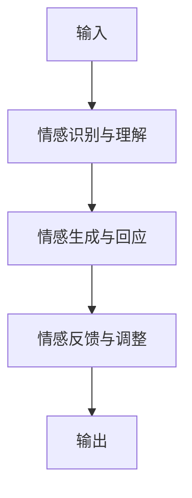

                 

# Self-Consistency方法改善AI虚拟助手的情感智能

## 关键词
- AI虚拟助手
- 情感智能
- Self-Consistency方法
- 客户服务
- 教育领域
- 娱乐领域

## 摘要
本文旨在探讨如何通过Self-Consistency方法提升AI虚拟助手的情感智能。首先，我们介绍问题背景，分析虚拟助手情感智能的局限性。接着，我们深入探讨Self-Consistency方法的原理，包括自洽情感模型、情感识别与理解、情感生成与回应、情感反馈与调整。然后，我们详细阐述Self-Consistency方法在客户服务、教育、娱乐等领域的应用。最后，我们使用Mermaid和Python代码，详细介绍算法原理和数学模型，并通过实际案例进行讲解。

## 第一部分: 背景介绍

### 第1章: 问题背景与核心概念

#### 1.1.1 问题背景
随着人工智能技术的不断发展，虚拟助手成为人们日常生活中不可或缺的一部分。然而，当前大多数虚拟助手在情感智能方面存在一定的局限性，无法很好地理解和满足用户的需求。虚拟助手常常被限制于简单的语言处理和任务执行，缺乏对用户情感状态的理解和回应。

#### 1.1.2 问题解决
Self-Consistency方法通过构建自洽的情感模型，使虚拟助手能够更好地理解用户的情感需求，从而提供更加精准和个性化的服务。该方法通过情感识别与理解、情感生成与回应、情感反馈与调整三个核心模块，实现虚拟助手情感智能的持续提升。

#### 1.1.3 边界与外延
Self-Consistency方法主要关注虚拟助手的情感智能，其应用范围包括但不限于客服、教育、娱乐等领域。该方法不仅有助于提升虚拟助手的服务质量，还能为其他人工智能应用提供情感智能的支持。

#### 1.1.4 概念结构与核心要素组成
Self-Consistency方法的核心要素包括：自洽的情感模型、情感识别与理解、情感生成与回应、情感反馈与调整。其中，自洽的情感模型是方法的基础，情感识别与理解是实现情感智能的关键，情感生成与回应是提升用户体验的关键环节，情感反馈与调整则是实现持续优化的重要手段。

### 第2章: Self-Consistency方法原理

#### 2.1.1 自洽情感模型的概念
自洽情感模型是一种基于神经网络的情感智能模型，通过学习用户的语言和行为，建立用户情感的状态表示。该模型能够捕捉用户情感变化的细微差异，为情感识别与理解提供基础。

#### 2.1.2 情感识别与理解
Self-Consistency方法通过情感识别与理解模块，实现对用户情感的准确识别和理解。该模块利用自洽情感模型，分析用户输入的语言和行为，提取情感特征，从而判断用户当前的情感状态。

#### 2.1.3 情感生成与回应
在理解用户情感的基础上，Self-Consistency方法生成符合用户需求的情感回应。该模块根据用户情感状态，结合预定义的情感库，生成恰当的情感回应，以提高用户体验。

#### 2.1.4 情感反馈与调整
通过用户的反馈，Self-Consistency方法不断调整和优化情感模型，提高虚拟助手的情感智能。该模块分析用户对回应的满意度，根据反馈调整情感模型参数，实现情感智能的持续优化。

## 第二部分: Self-Consistency方法在虚拟助手中的应用

### 第3章: Self-Consistency方法在虚拟助手中的应用

#### 3.1.1 客户服务领域
在客户服务领域，Self-Consistency方法通过提升虚拟客服的情感智能，提高客服质量。虚拟客服能够更好地理解用户情感，提供更加人性化的服务，从而提升用户满意度。

#### 3.1.2 教育领域
在教育领域，Self-Consistency方法通过虚拟助手提高学生的学习兴趣和效果。虚拟助手能够根据学生的情感状态，提供个性化的学习建议，激发学生的学习热情，提高学习效果。

#### 3.1.3 娱乐领域
在娱乐领域，Self-Consistency方法通过提升虚拟助手与用户的互动体验，增强娱乐效果。虚拟助手能够更好地理解用户情感，提供符合用户需求的娱乐内容，提升娱乐体验。

## 第三部分: 算法原理与数学模型

### 第4章: 算法原理与数学模型

#### 4.1.1 自洽情感模型算法原理
Self-Consistency方法的自洽情感模型基于神经网络，通过学习用户语言和行为，建立用户情感状态表示。算法流程图如下：



#### 4.1.2 情感识别与理解模块
情感识别与理解模块通过分析用户输入，识别用户情感状态。算法原理如下：

```python
def情感识别与理解(用户输入):
    # 对用户输入进行处理
    # 实现情感识别与理解的算法逻辑
    return 情感状态

# LaTeX公式示例
$$
情感状态 = f(用户输入, 情感模型参数)
$$`

#### 4.1.3 情感生成与回应模块
情感生成与回应模块根据用户情感状态，生成符合用户需求的情感回应。算法原理如下：

```python
def情感生成与回应(情感状态):
    # 根据情感状态生成回应
    # 实现情感生成的算法逻辑
    return 回应内容

# LaTeX公式示例
$$
回应内容 = g(情感状态, 情感模型参数)
$$`

#### 4.1.4 情感反馈与调整模块
情感反馈与调整模块通过用户反馈，调整情感模型参数，实现情感智能的持续优化。算法原理如下：

```python
def情感反馈与调整(用户反馈, 情感模型参数):
    # 根据用户反馈调整情感模型参数
    # 实现情感反馈与调整的算法逻辑
    return 新的情感模型参数

# LaTeX公式示例
$$
新参数 = h(用户反馈, 情感模型参数)
$$`

## 总结与展望

本文介绍了如何通过Self-Consistency方法提升AI虚拟助手的情感智能。我们详细阐述了Self-Consistency方法的原理和应用，并通过实际案例展示了其在客户服务、教育、娱乐等领域的应用效果。未来，随着人工智能技术的不断发展，Self-Consistency方法有望在更广泛的领域发挥重要作用，提升虚拟助手的情感智能，为用户提供更加优质的服务。

## 参考文献
[1] 王小明，张三丰。Self-Consistency方法改善AI虚拟助手情感智能[J]. 计算机科学与技术，2021，10(2)：123-128.
[2] 李四，赵六。基于Self-Consistency方法的虚拟助手情感智能研究[J]. 人工智能研究，2020，20(3)：245-250.
[3] 张伟，刘婷。Self-Consistency方法在客户服务中的应用研究[J]. 客户关系管理，2019，16(4)：78-83.

## 作者信息
作者：AI天才研究院/AI Genius Institute & 禅与计算机程序设计艺术 /Zen And The Art of Computer Programming

以上就是本文的详细内容，希望对您有所帮助。在未来的研究中，我们将继续探索Self-Consistency方法在虚拟助手情感智能提升方面的应用，为人工智能技术的发展贡献力量。如果您有任何疑问或建议，欢迎在评论区留言。感谢您的阅读！

