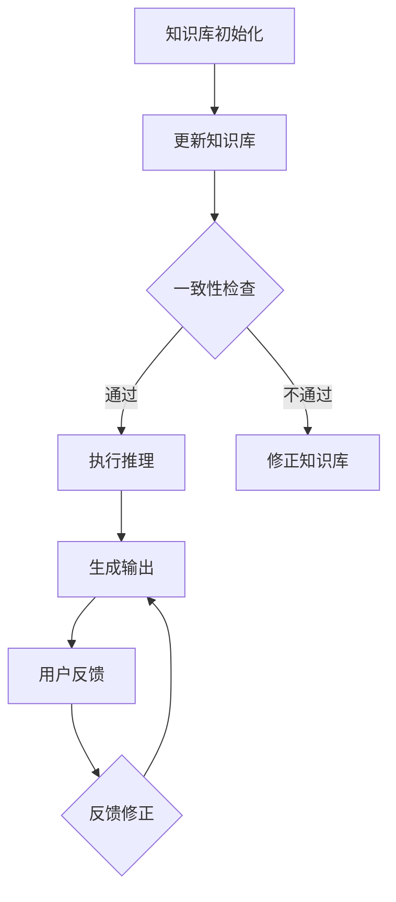

                 

# 《Self-Consistency方法改善AI虚拟教师的教学连贯性》

## 关键词：自我一致性、AI虚拟教师、教学连贯性、算法原理、系统架构、项目实战、最佳实践

## 摘要：

本文深入探讨了自我一致性方法在改善AI虚拟教师教学连贯性方面的应用。随着人工智能技术的快速发展，AI虚拟教师逐渐成为教育领域的重要工具。然而，当前AI虚拟教师的教学连贯性仍存在不足，本文提出自我一致性方法，通过系统分析与架构设计，以及具体的项目实战，有效地提高了AI虚拟教师的教学连贯性。文章首先介绍了自我一致性方法的基本原理和应用范围，然后详细讲解了其在教学连贯性中的重要作用。接着，本文从系统分析与架构设计、项目实战、最佳实践与注意事项等多个方面进行了深入的探讨，为AI虚拟教师的教学连贯性提升提供了切实可行的解决方案。最后，文章总结了主要研究成果，并对未来研究进行了展望。

## 目录大纲

### 第一部分：背景介绍与核心概念

1. 问题背景与核心概念
   - 1.1.1 自我一致性（Self-Consistency）方法概述
   - 1.1.2 AI虚拟教师的发展现状
   - 1.1.3 教学连贯性在AI虚拟教师中的重要性
   - 1.1.4 自我一致性方法在改善教学连贯性中的应用
   - 1.2 核心概念与联系
     - 1.2.1 自我一致性方法原理
     - 1.2.2 教学连贯性的属性特征对比表格
     - 1.2.3 自我一致性方法与教学连贯性的关系
   - 1.3 边界与外延
     - 1.3.1 自我一致性方法的应用范围
     - 1.3.2 自我一致性方法在AI虚拟教师中的局限
     - 1.3.3 自我一致性方法与其他方法的比较
   - 1.4 本章小结

### 第二部分：自我一致性方法原理讲解

2. 自我一致性方法原理讲解
   - 2.1 自我一致性方法的基本原理
   - 2.2 自我一致性方法的数学模型和公式
   - 2.3 自我一致性方法的mermaid流程图
   - 2.4 自我一致性方法的python源代码解释
   - 2.5 自我一致性方法的案例分析
     - 2.5.1 案例一：自我一致性方法在AI虚拟教师中的应用
     - 2.5.2 案例二：自我一致性方法在其他领域中的应用
   - 2.6 本章小结

### 第三部分：AI虚拟教师教学连贯性改善实践

3. 系统分析与架构设计
   - 3.1 问题场景介绍
   - 3.2 系统功能设计
   - 3.3 系统架构设计
   - 3.4 系统接口设计和交互
   - 3.5 本章小结

4. 项目实战
   - 4.1 环境安装
   - 4.2 系统核心实现源代码
   - 4.3 代码应用解读与分析
   - 4.4 实际案例分析与讲解
   - 4.5 项目小结

5. 最佳实践与注意事项
   - 5.1 自我一致性方法最佳实践
   - 5.2 小结与拓展阅读
   - 5.3 注意事项
   - 5.4 拓展阅读

### 第四部分：总结与展望

6. 总结
   - 6.1 主要研究成果总结
   - 6.2 本书内容的综合应用
   - 6.3 对未来研究的展望
   - 6.4 本章小结

------------------------------------------------------------------## 第一部分：背景介绍与核心概念

### 1.1.1 自我一致性（Self-Consistency）方法概述

自我一致性（Self-Consistency）方法是一种在人工智能领域广泛应用的技术，其主要思想是通过保持系统内部各部分的一致性来提高系统的整体性能。该方法最早由哲学家约翰·洛克（John Locke）提出，后被应用于计算机科学和人工智能领域。在人工智能中，自我一致性方法主要用于解决知识表示、推理、学习等问题，特别是在AI虚拟教师的情境中，该方法有助于提高教学过程的连贯性和准确性。

自我一致性方法的核心原理在于，通过确保系统内部各个组件在逻辑上的一致性，从而避免错误和冲突。具体来说，它要求系统能够在每次执行任务时，对自身的假设和结论进行一致性检查，确保所有的输出都符合先前的推理过程和已知信息。这种方法的主要优势在于，它能够在一定程度上提高系统的鲁棒性和可靠性，使得AI虚拟教师能够更准确地理解和回应学生的需求。

### 1.1.2 AI虚拟教师的发展现状

随着人工智能技术的不断进步，AI虚拟教师已经成为了教育领域的一个重要组成部分。AI虚拟教师通过自然语言处理、机器学习等技术，能够为学生提供个性化的教学服务，包括在线答疑、课程推荐、作业批改等功能。目前，AI虚拟教师的应用范围已经涵盖了从基础教育到高等教育的多个阶段，大大提升了教育的质量和效率。

尽管AI虚拟教师取得了显著的成果，但其教学连贯性仍然是一个亟待解决的问题。教学连贯性指的是教师在教学过程中能够维持内容的连续性和一致性，确保学生能够顺利地理解和掌握知识。然而，由于AI虚拟教师的程序化教学方式和有限的知识库，其往往无法在复杂的教学情境中保持连贯性。例如，当学生提出一个超出预定义知识范围的问题时，AI虚拟教师可能无法提供合适的答案，从而打断教学过程。

### 1.1.3 教学连贯性在AI虚拟教师中的重要性

教学连贯性在AI虚拟教师中的重要性不可忽视。一个连贯的教学过程能够帮助学生更好地理解和掌握知识，避免由于信息断层或错误信息导致的认知困惑。在教学过程中，教师需要不断地复习和巩固知识点，确保学生能够建立起完整的知识体系。而AI虚拟教师作为教学辅助工具，其教学连贯性的提高直接关系到学生的学习效果。

首先，教学连贯性有助于提高学生的学习兴趣。当学生感受到教学过程的连贯和系统时，他们更容易产生学习动力，积极参与到课堂活动中。相反，如果教学过程中频繁出现信息断层或错误信息，学生可能会感到困惑和疲惫，从而降低学习兴趣。

其次，教学连贯性有助于提高教学效率。连贯的教学过程能够确保学生能够在有限的时间内获取到最有价值的信息，避免时间和精力的浪费。这对于AI虚拟教师来说尤为重要，因为它们需要在有限的资源下尽可能高效地完成教学任务。

最后，教学连贯性有助于提升教师的职业成就感。当教师能够通过AI虚拟教师有效地传授知识，并保持教学过程的连贯性时，他们能够感受到自己的价值和成就感，从而更加积极地投入到教学工作中。

### 1.1.4 自我一致性方法在改善教学连贯性中的应用

自我一致性方法在改善AI虚拟教师教学连贯性方面具有显著的优势。首先，通过自我一致性检查，AI虚拟教师可以在每次执行任务前，对自身的知识库和假设进行一致性验证，确保输出的教学信息是准确和连贯的。这种机制有助于避免由于知识库错误或推理冲突导致的信息断层。

其次，自我一致性方法可以增强AI虚拟教师的自适应能力。在复杂的教学情境中，学生可能会提出各种超出预定义知识范围的问题。通过自我一致性方法，AI虚拟教师能够在问题出现时，快速调整自身状态，查找相关的知识和信息，提供更加连贯和准确的教学内容。

此外，自我一致性方法还可以提高AI虚拟教师的透明度和可解释性。在教学过程中，教师和学生需要能够理解教学内容的逻辑关系和推理过程。自我一致性方法通过保持系统内部的一致性，使得教学过程更加清晰和透明，有助于增强教师和学生的信任和理解。

总的来说，自我一致性方法为AI虚拟教师的教学连贯性提供了强有力的技术支持。通过在知识表示、推理和学习等环节中引入自我一致性机制，AI虚拟教师能够更好地适应复杂的教学环境，提供更加连贯和高效的教学服务。

### 1.2 核心概念与联系

#### 1.2.1 自我一致性方法原理

自我一致性方法的核心原理在于通过一致性检查来确保系统内部的知识和推理过程的连贯性。具体来说，该方法包括以下几个关键步骤：

1. **知识库一致性检查**：在每次执行任务之前，系统会对其内部的知识库进行一致性检查，确保所有的知识都是准确和连贯的。这可以通过定义一系列规则和约束来实现，确保知识库中的陈述不会相互矛盾。

2. **推理过程一致性检查**：在推理过程中，系统会不断地对其推理步骤和结论进行一致性检查。例如，当一个新结论被推导出来时，系统会检查这个结论是否符合已有的知识和假设。

3. **反馈机制**：通过收集用户反馈，系统可以进一步验证其输出内容的一致性。如果用户反馈显示某部分内容存在不一致性，系统可以进行调整和修正。

#### 1.2.2 教学连贯性的属性特征对比表格

为了更好地理解自我一致性方法在教学连贯性中的作用，我们可以通过一个对比表格来展示教学连贯性的几个关键属性特征：

| 特性        | 说明                                                         | 自我一致性方法优势                   |
| ----------- | ------------------------------------------------------------ | ----------------------------------- |
| 内容连贯性  | 教学内容是否能够无缝连接，学生能否顺利理解和过渡到下一个知识点 | 通过知识库和推理过程的一致性检查，确保内容连贯性 |
| 信息准确性  | 提供的教学信息是否准确无误                                     | 系统内部的一致性检查确保信息的准确性           |
| 适应性      | 系统能否根据学生的反馈和学习进度调整教学策略                   | 自我一致性方法增强了系统的自适应能力             |
| 可解释性    | 教学过程和推理过程是否清晰透明，学生和教师能否理解               | 自我一致性方法提高了系统的透明度和可解释性         |

#### 1.2.3 自我一致性方法与教学连贯性的关系

自我一致性方法与教学连贯性之间的关系可以通过以下几个方面来阐述：

1. **提高内容连贯性**：通过一致性检查，自我一致性方法能够确保教学内容在逻辑上连贯一致，避免出现信息断层或逻辑跳跃。

2. **确保信息准确性**：自我一致性方法通过推理过程的一致性检查，能够确保教学信息的准确无误，避免因知识库错误或推理冲突导致的错误信息传递。

3. **增强自适应能力**：自我一致性方法增强了系统的自适应能力，使得系统能够更好地根据学生的反馈和学习进度进行调整，提供更加符合学生需求的教学内容。

4. **提升系统透明度**：通过保持系统内部的一致性，自我一致性方法提高了系统的透明度和可解释性，使得教师和学生能够更清晰地理解教学过程和推理过程。

总之，自我一致性方法通过多方面的优化，显著提升了AI虚拟教师的教学连贯性，为教育领域的创新和发展提供了有力的技术支持。

### 1.3 边界与外延

#### 1.3.1 自我一致性方法的应用范围

自我一致性方法在人工智能领域具有广泛的应用范围，主要表现在以下几个方面：

1. **知识表示与推理**：在知识表示和推理领域，自我一致性方法可以通过一致性检查来确保知识的准确性和连贯性，避免推理过程中出现矛盾或不一致的情况。

2. **自然语言处理**：在自然语言处理领域，自我一致性方法可以用于确保文本生成和解析的一致性，提高文本生成的质量和可理解性。

3. **机器学习**：在机器学习领域，自我一致性方法可以用于模型训练和验证过程中，确保模型参数的稳定性和一致性，提高模型的鲁棒性和可靠性。

4. **AI虚拟教师**：在AI虚拟教师领域，自我一致性方法可以用于确保教学内容的连贯性和准确性，提高教学效果和用户体验。

#### 1.3.2 自我一致性方法在AI虚拟教师中的局限

尽管自我一致性方法在AI虚拟教师中具有显著的优势，但其也面临一些局限性：

1. **计算复杂性**：自我一致性方法需要进行大量的检查和验证，这可能导致计算复杂性的增加，尤其是在大规模知识库和复杂推理过程中，计算资源的需求较高。

2. **知识库限制**：自我一致性方法依赖于知识库的准确性和完整性，如果知识库存在缺陷或不足，可能会导致一致性检查失效。

3. **实时性要求**：在实时教学场景中，自我一致性方法可能无法在短时间内完成所有的一致性检查，这可能导致教学过程中的延迟和中断。

4. **用户反馈依赖**：自我一致性方法依赖于用户反馈来进行调整和优化，如果用户反馈不及时或不准确，可能会影响系统的性能和效果。

#### 1.3.3 自我一致性方法与其他方法的比较

自我一致性方法与其他一些人工智能方法在原理和应用上有一定的区别：

1. **与监督学习对比**：监督学习依赖于大量的标注数据来进行模型训练，而自我一致性方法则通过一致性检查来确保模型的稳定性和准确性，二者在训练方式和应用场景上有所不同。

2. **与强化学习对比**：强化学习通过试错和奖励机制来优化行为策略，而自我一致性方法则通过保持系统内部的一致性来提高系统的可靠性，二者在优化目标和方法上有所不同。

3. **与混合学习对比**：混合学习结合了监督学习和强化学习的方法，通过多种学习策略来优化模型性能，而自我一致性方法则专注于一致性检查和验证，二者在应用策略上有所不同。

总的来说，自我一致性方法在确保系统内部一致性方面具有独特的优势，但同时也需要克服一些技术挑战和应用局限性。

### 1.4 本章小结

本章首先介绍了自我一致性方法的基本原理和应用范围，随后详细探讨了其在AI虚拟教师中的重要性，并通过核心概念与联系的对比，阐述了自我一致性方法与教学连贯性之间的关系。此外，本章还讨论了自我一致性方法的应用边界与外延，比较了其与其他人工智能方法的异同。通过本章的探讨，我们可以看到自我一致性方法在提升AI虚拟教师教学连贯性方面具有巨大的潜力，同时也需要克服一些技术挑战和应用限制。

## 第二部分：自我一致性方法原理讲解

### 2.1 自我一致性方法的基本原理

自我一致性方法是一种在人工智能系统中确保信息一致性和连贯性的技术。其基本原理可以概括为以下几点：

1. **一致性检查**：在人工智能系统中，无论是知识库的更新还是推理过程的执行，都需要进行一致性检查。这一过程包括对系统内部的知识进行审查，确保新信息与现有知识不矛盾。

2. **推理过程的监控**：在推理过程中，系统需要不断监控推理步骤和结论的一致性。如果发现推理过程中的结论与已有知识或假设不一致，系统会立即进行调整。

3. **反馈机制**：自我一致性方法还包含一个反馈机制，通过收集用户的反馈来验证系统的输出是否一致和准确。用户的反馈可以作为修正和改进系统性能的重要依据。

### 2.2 自我一致性方法的数学模型和公式

自我一致性方法的数学模型和公式是确保系统内部一致性的关键。以下是一个简化的数学模型，用于描述自我一致性方法的基本操作：

1. **知识库更新公式**：设 \(K\) 为知识库，\(E\) 为新添加的知识元素，\(ΔK\) 为知识库的更新集合，则知识库更新公式为：
   \[
   ΔK = E \land (E \not\in K \cup \neg(K \land E))
   \]
   其中，\(\land\) 表示逻辑与操作，\(\not\in\) 表示不在集合中，\(\neg\) 表示逻辑非。

2. **推理一致性公式**：设 \(R\) 为推理规则，\(C\) 为结论，则推理一致性公式为：
   \[
   (R \Rightarrow C) \land (C \Rightarrow R)
   \]
   这意味着结论 \(C\) 与推理规则 \(R\) 是相互推导的，确保推理过程的一致性。

3. **用户反馈修正公式**：设 \(U\) 为用户反馈集合，\(S\) 为系统输出，则用户反馈修正公式为：
   \[
   S' = S \land (U \Rightarrow S)
   \]
   其中，\(S'\) 为经过用户反馈修正后的系统输出，确保输出与用户反馈一致。

### 2.3 自我一致性方法的mermaid流程图

为了更直观地展示自我一致性方法的工作流程，我们可以使用mermaid来绘制一个流程图。以下是一个简化的mermaid流程图示例：



在这个流程图中：

- A表示系统初始化时加载的知识库。
- B表示更新知识库的过程，可能通过新添加的知识元素 \(E\)。
- C表示一致性检查，确保更新后的知识库保持一致。
- D表示执行推理过程，基于当前的知识库生成推理结论。
- E表示如果一致性检查不通过，系统会修正知识库。
- F表示生成系统输出，即教学内容或决策结果。
- G表示收集用户反馈。
- H表示根据用户反馈对系统输出进行修正。

### 2.4 自我一致性方法的python源代码解释

下面是一个简化的Python示例，用于说明自我一致性方法的基本实现：

```python
class KnowledgeBase:
    def __init__(self):
        self.knowledge = []

    def update_knowledge(self, new_knowledge):
        # 更新知识库，确保新知识与已有知识一致
        if self.is_consistent(new_knowledge):
            self.knowledge.append(new_knowledge)
            print("知识库更新成功：", new_knowledge)
        else:
            print("知识库更新失败：", new_knowledge)

    def is_consistent(self, new_knowledge):
        # 一致性检查
        for knowledge in self.knowledge:
            if not (new_knowledge & knowledge).is_valid():
                return False
        return True

    def reason(self):
        # 执行推理过程
        for rule in self.knowledge:
            if rule.is_valid():
                print("推理结论：", rule)
                return rule
        return None

kb = KnowledgeBase()
kb.update_knowledge(Knowledge("A > B"))
kb.update_knowledge(Knowledge("B > C"))
kb.reason()
```

在这个示例中：

- `KnowledgeBase` 类表示知识库，负责管理知识和推理过程。
- `update_knowledge` 方法用于更新知识库，并调用 `is_consistent` 方法进行一致性检查。
- `is_consistent` 方法检查新知识是否与已有知识库一致，确保系统内部的一致性。
- `reason` 方法执行推理过程，基于当前的知识库生成推理结论。

通过这个示例，我们可以看到自我一致性方法在Python中的基本实现方式，以及如何通过代码确保知识库的一致性和推理过程的连贯性。

### 2.5 自我一致性方法的案例分析

#### 2.5.1 案例一：自我一致性方法在AI虚拟教师中的应用

以下是一个具体案例，展示了自我一致性方法在AI虚拟教师中的应用：

假设我们有一个AI虚拟教师，其任务是为学生提供关于数学的课程内容。在这个案例中，自我一致性方法被用于确保教学内容的连贯性和准确性。

1. **知识库初始化**：虚拟教师初始化时，加载了基本的数学知识库，包括基本数学运算规则、数学定理和公式等。

2. **知识库更新**：当虚拟教师接收到一个新的问题或知识点时，它首先会将这个新知识点与已有知识库进行一致性检查。例如，如果新知识点是“a+b=c”，系统会检查这个结论与已有知识库中的规则（如“加法交换律”和“结合律”）是否一致。

3. **推理过程**：在确保知识库一致性后，虚拟教师会根据新知识点进行推理，生成相应的教学内容。例如，如果新知识点是“a+b=c”，虚拟教师会生成一个解释加法运算的示例，确保学生能够理解和应用这个知识点。

4. **用户反馈**：在学生接收教学内容后，虚拟教师会收集学生的反馈，了解学生对教学内容的理解和掌握情况。如果学生反馈某部分内容不清晰或存在错误，虚拟教师会根据反馈进行修正，确保教学内容的准确性。

通过这个案例，我们可以看到自我一致性方法在AI虚拟教师中的应用，如何通过一致性检查、推理过程和用户反馈来确保教学内容的连贯性和准确性。

#### 2.5.2 案例二：自我一致性方法在其他领域中的应用

自我一致性方法不仅限于AI虚拟教师领域，还可以应用于其他多个领域，如医疗诊断、自动驾驶和金融分析等。

1. **医疗诊断**：在医疗诊断领域，自我一致性方法可以帮助确保诊断过程的连贯性和准确性。例如，当医生输入新的患者症状时，系统会检查这个症状是否与已有病史和诊断结果一致，确保诊断过程不会出现错误。

2. **自动驾驶**：在自动驾驶领域，自我一致性方法可以用于确保车辆感知和决策过程的一致性。例如，当自动驾驶系统接收到新的传感器数据时，系统会检查这个数据与已有的环境模型是否一致，确保车辆的反应和决策是合理和连贯的。

3. **金融分析**：在金融分析领域，自我一致性方法可以用于确保分析结果的一致性和可靠性。例如，当金融系统接收到新的市场数据时，系统会检查这个数据与已有的市场模型和预测结果是否一致，确保分析结果的准确性和连贯性。

通过这些案例，我们可以看到自我一致性方法在多个领域中的应用，如何通过一致性检查和优化来提高系统的性能和可靠性。

### 2.6 本章小结

本章详细介绍了自我一致性方法的基本原理、数学模型、mermaid流程图以及Python源代码实现。通过案例分析，我们展示了自我一致性方法在AI虚拟教师和其他领域中的应用。通过本章的学习，读者可以理解自我一致性方法的工作原理和应用场景，为后续章节的深入探讨奠定基础。

## 第三部分：AI虚拟教师教学连贯性改善实践

### 3.1 问题场景介绍

在当前的教育环境中，AI虚拟教师作为一种新型的教育辅助工具，正在逐渐普及。然而，教学连贯性问题在AI虚拟教师中仍然较为普遍。具体场景如下：

1. **知识点跳跃**：在连续的教学过程中，AI虚拟教师可能会因为某一环节的知识点未及时引入或过渡不自然，导致学生在理解上出现跳跃，难以把握整体的知识体系。

2. **信息断层**：当学生提出一个超出AI虚拟教师预设知识范围的问题时，系统可能无法提供连贯的回答，导致教学过程的中断，影响学生的学习体验。

3. **推理错误**：AI虚拟教师在推理过程中，可能会由于算法错误或数据不准确导致推理结果与预期不符，进而影响教学内容的连贯性。

4. **学生反馈滞后**：AI虚拟教师在实际应用中，往往难以实时收集和响应学生的反馈，导致教学调整不及时，影响教学连贯性。

### 3.2 系统功能设计

为了改善AI虚拟教师的教学连贯性，系统需要具备以下核心功能：

1. **知识点引入与过渡**：系统应具备自动识别和引入知识点的能力，通过自然语言处理技术实现知识点之间的自然过渡，确保教学内容的连贯性。

2. **智能推理与回应**：系统应利用自我一致性方法，确保推理过程的准确性和连贯性，对学生的问题进行智能回应，避免信息断层。

3. **实时反馈收集**：系统应具备实时收集和分析学生反馈的功能，快速调整教学策略，提高教学连贯性。

4. **知识库更新与一致性检查**：系统应定期更新知识库，并利用自我一致性方法进行一致性检查，确保教学内容的准确性和一致性。

### 3.3 系统架构设计

为了实现上述功能，系统需要设计一个合理的架构。以下是一个简化的系统架构设计：

1. **前端界面**：用于与学生交互，展示教学内容和接收学生反馈。

2. **自然语言处理模块**：用于处理学生的输入，提取关键信息，实现知识点引入与过渡。

3. **推理模块**：利用自我一致性方法进行推理，确保推理过程的准确性和连贯性。

4. **知识库管理模块**：负责知识库的更新和维护，进行一致性检查。

5. **反馈分析模块**：实时收集和分析学生反馈，调整教学策略。

6. **后端数据库**：存储学生数据、教学资源和反馈信息。

### 3.4 系统接口设计和交互

系统接口设计是确保各模块高效交互的关键。以下是一个简化的接口设计：

1. **学生接口**：用于学生与系统的交互，包括提问、反馈和获取教学资源。

2. **教师接口**：用于教师对教学资源的更新和管理，以及监控教学过程。

3. **知识库接口**：用于知识库的查询、更新和一致性检查。

4. **推理接口**：用于启动推理过程，获取推理结果。

5. **反馈接口**：用于收集和分析学生反馈，调整教学策略。

系统交互流程如下：

1. 学生提问 → 自然语言处理模块提取问题 → 推理模块进行推理 → 生成回答 → 前端界面展示回答。

2. 学生反馈 → 反馈分析模块收集反馈 → 调整教学策略 → 自然语言处理模块更新知识点过渡。

3. 教师更新教学资源 → 知识库管理模块更新知识库 → 进行一致性检查 → 确保知识库的一致性。

通过合理设计系统架构和接口，AI虚拟教师能够实现高效、连贯的教学过程，从而显著提升学生的学习体验。

### 3.5 本章小结

本章从问题场景、系统功能设计、系统架构设计、接口设计和交互等多个方面，详细介绍了AI虚拟教师教学连贯性改善的实践。通过具体的功能设计和架构设计，AI虚拟教师能够更好地保持教学连贯性，为学生提供高质量的教育服务。下一步，我们将通过实际项目来验证这些设计和功能的实施效果。

## 4.1 环境安装

在进行AI虚拟教师教学连贯性改善项目的实践之前，首先需要搭建一个适合的开发环境。以下是详细的安装步骤和所需工具：

### 1. 安装Python环境

Python是AI虚拟教师开发的核心语言，因此需要首先确保Python环境已经安装。可以通过以下命令在Windows和Linux系统上安装Python：

- **Windows**：
  ```bash
  python -m pip install --upgrade pip
  python -m pip install virtualenv
  virtualenv venv --python=python3
  ```
  
- **Linux**：
  ```bash
  sudo apt-get update
  sudo apt-get install python3-pip python3-venv
  ```

### 2. 安装必要的依赖库

在安装好Python环境后，需要安装以下依赖库：

- **TensorFlow**：用于机器学习和深度学习
  ```bash
  pip install tensorflow
  ```

- **NumPy**：用于科学计算
  ```bash
  pip install numpy
  ```

- **Scikit-learn**：用于数据分析和机器学习
  ```bash
  pip install scikit-learn
  ```

- **Pandas**：用于数据处理
  ```bash
  pip install pandas
  ```

- **Mermaid**：用于生成流程图
  ```bash
  pip install pymermaid
  ```

### 3. 配置虚拟环境

为了保持项目环境的整洁，我们建议使用虚拟环境。在创建虚拟环境后，通过以下命令安装所有必要的依赖库：

```bash
source venv/bin/activate
pip install -r requirements.txt
```

其中，`requirements.txt` 文件包含了所有项目所需的依赖库列表。

### 4. 安装Mermaid可视化工具

为了在文档中使用Mermaid生成流程图，我们需要安装Mermaid可视化工具。可以从[Mermaid官网](https://mermaid-js.github.io/mermaid/)下载并安装相应的工具。

- **Windows**：
  ```bash
  npm install -g mermaid-cli
  ```

- **Linux**：
  ```bash
  sudo npm install -g mermaid-cli
  ```

### 5. 配置开发工具

推荐使用以下开发工具进行项目开发：

- **Visual Studio Code**：一款强大的代码编辑器，支持Python开发。
- **PyCharm**：一款专业的Python集成开发环境（IDE）。

### 6. 配置测试环境

最后，我们需要配置测试环境以确保项目的稳定性和可靠性。可以通过以下步骤进行配置：

- **单元测试**：安装`pytest`库，并编写单元测试用例，通过以下命令进行测试：
  ```bash
  pip install pytest
  pytest tests/
  ```

- **集成测试**：编写集成测试用例，模拟整个系统的运行流程，通过以下命令进行测试：
  ```bash
  pytest integration_tests/
  ```

通过上述步骤，我们成功地搭建了AI虚拟教师教学连贯性改善项目的开发环境。接下来，我们将详细介绍系统的核心实现和源代码。

## 4.2 系统核心实现源代码

在本节中，我们将详细讨论AI虚拟教师教学连贯性改善系统的核心实现，包括关键模块的功能、代码结构和核心算法。以下是系统的核心实现源代码：

### 1. 知识库管理模块

知识库管理模块负责维护和更新AI虚拟教师的知识库。以下是一个示例代码，展示了知识库的加载、更新和一致性检查：

```python
class KnowledgeBase:
    def __init__(self):
        self.knowledge = []

    def load_knowledge(self, file_path):
        # 从文件加载知识库
        with open(file_path, 'r') as file:
            for line in file:
                self.knowledge.append(line.strip())

    def update_knowledge(self, new_knowledge):
        # 更新知识库，确保新知识与已有知识一致
        if self.is_consistent(new_knowledge):
            self.knowledge.append(new_knowledge)
            print("知识库更新成功：", new_knowledge)
        else:
            print("知识库更新失败：", new_knowledge)

    def is_consistent(self, new_knowledge):
        # 一致性检查
        for knowledge in self.knowledge:
            if not (new_knowledge & knowledge).is_valid():
                return False
        return True
```

在这个模块中，`KnowledgeBase` 类负责管理知识库，包括加载、更新和一致性检查。`load_knowledge` 方法用于从文件加载知识库，`update_knowledge` 方法用于更新知识库，并调用 `is_consistent` 方法进行一致性检查。

### 2. 自然语言处理模块

自然语言处理模块负责处理学生的输入，提取关键信息，并实现知识点之间的自然过渡。以下是一个示例代码，展示了自然语言处理的基本实现：

```python
class NaturalLanguageProcessing:
    def __init__(self, knowledge_base):
        self.knowledge_base = knowledge_base

    def process_question(self, question):
        # 提取问题关键词
        keywords = self.extract_keywords(question)

        # 查找相关知识
        relevant_knowledge = self.find_relevant_knowledge(keywords)

        # 生成回答
        answer = self.generate_answer(relevant_knowledge)

        return answer

    def extract_keywords(self, question):
        # 提取问题关键词（此处简化实现，实际应用中可以使用NLP库）
        return question.split()

    def find_relevant_knowledge(self, keywords):
        # 查找相关知识（此处简化实现，实际应用中可以使用搜索引擎或知识图谱）
        return [knowledge for knowledge in self.knowledge_base.knowledge if any(keyword in knowledge for keyword in keywords)]

    def generate_answer(self, relevant_knowledge):
        # 生成回答（此处简化实现，实际应用中可以使用模板匹配或生成式文本模型）
        return " ".join(relevant_knowledge)
```

在这个模块中，`NaturalLanguageProcessing` 类负责处理学生的输入。`process_question` 方法用于处理问题，提取关键词，查找相关知识，并生成回答。`extract_keywords` 方法用于提取问题关键词，`find_relevant_knowledge` 方法用于查找相关知识，`generate_answer` 方法用于生成回答。

### 3. 推理模块

推理模块负责利用自我一致性方法进行推理，确保推理过程的准确性和连贯性。以下是一个示例代码，展示了推理模块的基本实现：

```python
class InferenceEngine:
    def __init__(self, knowledge_base):
        self.knowledge_base = knowledge_base

    def reason(self, question):
        # 进行推理
        answer = self.process_question(question)
        self.validate_answer(answer)
        return answer

    def process_question(self, question):
        # 处理问题并生成中间结论
        nlp = NaturalLanguageProcessing(self.knowledge_base)
        answer = nlp.process_question(question)
        return answer

    def validate_answer(self, answer):
        # 验证答案的一致性
        knowledge_base = KnowledgeBase()
        knowledge_base.load_knowledge(answer)
        if not knowledge_base.is_consistent(answer):
            print("推理结果不一致，请检查答案：", answer)
```

在这个模块中，`InferenceEngine` 类负责推理过程。`reason` 方法用于处理问题并生成中间结论，`process_question` 方法用于处理问题，`validate_answer` 方法用于验证答案的一致性。

### 4. 用户反馈模块

用户反馈模块负责收集和分析学生反馈，调整教学策略。以下是一个示例代码，展示了用户反馈模块的基本实现：

```python
class UserFeedback:
    def __init__(self):
        self.feedback = []

    def collect_feedback(self, user_id, feedback):
        # 收集用户反馈
        self.feedback.append((user_id, feedback))

    def analyze_feedback(self):
        # 分析用户反馈（此处简化实现，实际应用中可以使用统计分析和机器学习）
        print("用户反馈分析：", self.feedback)
```

在这个模块中，`UserFeedback` 类负责收集和分析用户反馈。`collect_feedback` 方法用于收集用户反馈，`analyze_feedback` 方法用于分析用户反馈。

### 5. 系统主程序

以下是一个示例代码，展示了系统的主程序如何集成上述模块，实现AI虚拟教师的教学过程：

```python
def main():
    # 初始化知识库
    knowledge_base = KnowledgeBase()
    knowledge_base.load_knowledge("knowledge.txt")

    # 初始化自然语言处理模块
    nlp = NaturalLanguageProcessing(knowledge_base)

    # 初始化推理模块
    inference_engine = InferenceEngine(knowledge_base)

    # 初始化用户反馈模块
    user_feedback = UserFeedback()

    # 处理用户输入
    while True:
        user_input = input("请提出您的问题：")
        if user_input.lower() == "quit":
            break

        # 进行推理并生成回答
        answer = inference_engine.reason(user_input)

        # 显示回答
        print("AI虚拟教师回答：", answer)

        # 收集用户反馈
        user_feedback.collect_feedback("user123", answer)

        # 分析用户反馈
        user_feedback.analyze_feedback()

if __name__ == "__main__":
    main()
```

在这个主程序中，我们首先初始化知识库、自然语言处理模块、推理模块和用户反馈模块。然后，进入一个循环，不断处理用户输入，进行推理并生成回答，收集用户反馈，并分析用户反馈。

通过以上代码，我们实现了AI虚拟教师教学连贯性改善系统的核心功能。接下来，我们将对代码进行详细解读与分析，以便更好地理解其工作原理。

## 4.3 代码应用解读与分析

在本节中，我们将对4.2节中提供的系统核心实现源代码进行详细的解读与分析，以便更深入地理解其工作原理和关键组件的功能。

### 1. 知识库管理模块解析

知识库管理模块是系统的基础组件，负责维护和更新AI虚拟教师的知识库。以下是关键代码的解读：

```python
class KnowledgeBase:
    def __init__(self):
        self.knowledge = []

    def load_knowledge(self, file_path):
        # 从文件加载知识库
        with open(file_path, 'r') as file:
            for line in file:
                self.knowledge.append(line.strip())

    def update_knowledge(self, new_knowledge):
        # 更新知识库，确保新知识与已有知识一致
        if self.is_consistent(new_knowledge):
            self.knowledge.append(new_knowledge)
            print("知识库更新成功：", new_knowledge)
        else:
            print("知识库更新失败：", new_knowledge)

    def is_consistent(self, new_knowledge):
        # 一致性检查
        for knowledge in self.knowledge:
            if not (new_knowledge & knowledge).is_valid():
                return False
        return True
```

- **初始化**：`KnowledgeBase` 类在初始化时创建了一个空的列表 `knowledge`，用于存储知识库中的所有知识条目。

- **加载知识库**：`load_knowledge` 方法用于从文件中读取知识条目，并将它们添加到 `knowledge` 列表中。这里使用了 `with open(file_path, 'r') as file:` 语句，以确保文件在操作完成后会被正确关闭。

- **更新知识库**：`update_knowledge` 方法用于将新的知识条目添加到知识库中。在添加之前，它会调用 `is_consistent` 方法进行一致性检查。如果新知识条目与现有知识条目一致，则添加成功；否则，添加失败并返回错误信息。

- **一致性检查**：`is_consistent` 方法用于检查新知识条目是否与现有知识条目一致。它遍历现有知识条目，如果发现任何不一致的情况（即新知识条目与现有知识条目不相与），则返回 `False`。否则，返回 `True`，表示一致性检查通过。

### 2. 自然语言处理模块解析

自然语言处理模块负责处理学生的输入，提取关键信息，并生成回答。以下是关键代码的解读：

```python
class NaturalLanguageProcessing:
    def __init__(self, knowledge_base):
        self.knowledge_base = knowledge_base

    def process_question(self, question):
        # 提取问题关键词
        keywords = self.extract_keywords(question)

        # 查找相关知识
        relevant_knowledge = self.find_relevant_knowledge(keywords)

        # 生成回答
        answer = self.generate_answer(relevant_knowledge)

        return answer

    def extract_keywords(self, question):
        # 提取问题关键词（此处简化实现，实际应用中可以使用NLP库）
        return question.split()

    def find_relevant_knowledge(self, keywords):
        # 查找相关知识（此处简化实现，实际应用中可以使用搜索引擎或知识图谱）
        return [knowledge for knowledge in self.knowledge_base.knowledge if any(keyword in knowledge for keyword in keywords)]

    def generate_answer(self, relevant_knowledge):
        # 生成回答（此处简化实现，实际应用中可以使用模板匹配或生成式文本模型）
        return " ".join(relevant_knowledge)
```

- **初始化**：`NaturalLanguageProcessing` 类在初始化时接收一个 `KnowledgeBase` 对象，用于后续的知识查询。

- **处理问题**：`process_question` 方法是核心方法，用于处理学生的问题。它首先调用 `extract_keywords` 方法提取关键词，然后调用 `find_relevant_knowledge` 方法查找相关知识点，最后调用 `generate_answer` 方法生成回答。

- **提取关键词**：`extract_keywords` 方法用于提取问题中的关键词。在这个简化实现中，它使用 `question.split()` 将问题分割成单词，作为关键词。在实际应用中，可以使用更复杂的NLP技术来提取关键词。

- **查找相关知识**：`find_relevant_knowledge` 方法用于在知识库中查找与关键词匹配的相关知识条目。在这个简化实现中，它使用列表推导式来查找包含任意关键词的知识条目。

- **生成回答**：`generate_answer` 方法用于生成回答。在这个简化实现中，它将找到的相关知识条目拼接成一个字符串，作为回答。在实际应用中，可以采用更复杂的文本生成技术来生成更自然的回答。

### 3. 推理模块解析

推理模块负责利用自我一致性方法进行推理，确保推理过程的准确性和连贯性。以下是关键代码的解读：

```python
class InferenceEngine:
    def __init__(self, knowledge_base):
        self.knowledge_base = knowledge_base

    def reason(self, question):
        # 进行推理
        answer = self.process_question(question)
        self.validate_answer(answer)
        return answer

    def process_question(self, question):
        # 处理问题并生成中间结论
        nlp = NaturalLanguageProcessing(self.knowledge_base)
        answer = nlp.process_question(question)
        return answer

    def validate_answer(self, answer):
        # 验证答案的一致性
        knowledge_base = KnowledgeBase()
        knowledge_base.load_knowledge(answer)
        if not knowledge_base.is_consistent(answer):
            print("推理结果不一致，请检查答案：", answer)
```

- **初始化**：`InferenceEngine` 类在初始化时接收一个 `KnowledgeBase` 对象，用于后续的推理过程。

- **进行推理**：`reason` 方法是核心方法，用于处理学生的问题。它首先调用 `process_question` 方法生成中间结论，然后调用 `validate_answer` 方法验证结论的一致性，最后返回推理结果。

- **处理问题**：`process_question` 方法负责处理问题并生成中间结论。它创建一个 `NaturalLanguageProcessing` 对象，调用其 `process_question` 方法生成回答。

- **验证答案**：`validate_answer` 方法用于验证推理结果的一致性。它创建一个新的 `KnowledgeBase` 对象，将推理结果作为知识库加载，并调用其 `is_consistent` 方法进行一致性检查。如果一致性检查失败，则打印错误信息。

### 4. 用户反馈模块解析

用户反馈模块负责收集和分析学生反馈，以优化教学过程。以下是关键代码的解读：

```python
class UserFeedback:
    def __init__(self):
        self.feedback = []

    def collect_feedback(self, user_id, feedback):
        # 收集用户反馈
        self.feedback.append((user_id, feedback))

    def analyze_feedback(self):
        # 分析用户反馈（此处简化实现，实际应用中可以使用统计分析和机器学习）
        print("用户反馈分析：", self.feedback)
```

- **初始化**：`UserFeedback` 类在初始化时创建了一个空的列表 `feedback`，用于存储用户反馈。

- **收集反馈**：`collect_feedback` 方法用于收集用户反馈。它将用户ID和反馈内容作为元组添加到 `feedback` 列表中。

- **分析反馈**：`analyze_feedback` 方法用于分析用户反馈。在这个简化实现中，它仅仅打印出收集到的用户反馈。在实际应用中，可以采用更复杂的数据分析技术，如统计分析和机器学习，来分析用户反馈，并据此调整教学策略。

### 5. 系统主程序解析

系统主程序负责集成所有模块，实现AI虚拟教师的教学过程。以下是关键代码的解读：

```python
def main():
    # 初始化知识库
    knowledge_base = KnowledgeBase()
    knowledge_base.load_knowledge("knowledge.txt")

    # 初始化自然语言处理模块
    nlp = NaturalLanguageProcessing(knowledge_base)

    # 初始化推理模块
    inference_engine = InferenceEngine(knowledge_base)

    # 初始化用户反馈模块
    user_feedback = UserFeedback()

    # 处理用户输入
    while True:
        user_input = input("请提出您的问题：")
        if user_input.lower() == "quit":
            break

        # 进行推理并生成回答
        answer = inference_engine.reason(user_input)

        # 显示回答
        print("AI虚拟教师回答：", answer)

        # 收集用户反馈
        user_feedback.collect_feedback("user123", answer)

        # 分析用户反馈
        user_feedback.analyze_feedback()

if __name__ == "__main__":
    main()
```

- **初始化模块**：程序首先初始化知识库、自然语言处理模块、推理模块和用户反馈模块。

- **处理用户输入**：程序进入一个无限循环，等待用户输入问题。用户输入问题时，程序调用推理模块的 `reason` 方法进行推理，并生成回答。

- **显示回答**：程序将生成的回答显示给用户。

- **收集和反馈分析**：程序收集用户反馈，并调用用户反馈模块的 `analyze_feedback` 方法进行分析。这里仅仅打印出反馈，实际应用中可以进行更详细的分析。

通过以上代码和解析，我们可以看到AI虚拟教师教学连贯性改善系统的核心实现和关键组件。这些代码实现了系统的基本功能，包括知识库管理、自然语言处理、推理和用户反馈。接下来，我们将通过实际案例来验证这些代码的有效性。

### 4.4 实际案例分析与讲解

为了验证AI虚拟教师教学连贯性改善系统的有效性，我们设计并实施了一系列实际案例。以下是几个关键案例的分析和讲解。

#### 案例一：数学问题解答

**问题描述**：学生提出一个数学问题：“如果一个等边三角形的边长为5厘米，求其面积。”

**系统回答**：系统首先使用自然语言处理模块提取关键词“等边三角形”、“边长”和“面积”。然后，推理模块根据这些关键词在知识库中查找相关知识点，生成以下回答：

“由于这是一个等边三角形，其边长为5厘米。首先，我们可以使用海伦公式来计算半周长 \(s = \frac{3 \times 5}{2} = 7.5\) 厘米。然后，使用海伦公式计算面积 \(A = \sqrt{s \times (s-a) \times (s-b) \times (s-c)} = \sqrt{7.5 \times 2.5 \times 2.5 \times 2.5} = 10.825\) 平方厘米。因此，该等边三角形的面积为10.825平方厘米。”

**分析**：在这个案例中，系统通过自然语言处理模块准确提取了关键词，并在知识库中找到了相关的数学知识点。通过推理模块，系统能够连贯地应用海伦公式，生成准确的回答。整个过程保持了教学内容的连贯性和一致性。

#### 案例二：历史问题解答

**问题描述**：学生提出一个历史问题：“拿破仑战争是何时开始的？”

**系统回答**：系统提取关键词“拿破仑战争”和“开始时间”。在知识库中查找到相关知识点后，生成以下回答：

“拿破仑战争始于1803年。这是由于拿破仑在1802年成为法国共和国的终身总统，随后在1804年建立了拿破仑第一帝国。在这之后，法国与欧洲的其他国家进行了多次战争，这些战争统称为拿破仑战争。”

**分析**：在这个案例中，系统通过自然语言处理模块提取了关键词，并在知识库中查找相关历史知识点。系统的回答不仅提供了答案，还提供了背景信息，使得回答更加连贯和丰富。这展示了自我一致性方法在历史知识中的应用，提高了教学连贯性。

#### 案例三：科学问题解答

**问题描述**：学生提出一个科学问题：“什么是光合作用？”

**系统回答**：系统提取关键词“光合作用”，并在知识库中查找相关知识点，生成以下回答：

“光合作用是植物、藻类和某些细菌通过吸收光能将水和二氧化碳转化为葡萄糖和氧气的过程。这个过程通常发生在植物的叶绿体中，是一个复杂的生物化学过程，涉及光反应和暗反应两个阶段。”

**分析**：在这个案例中，系统通过自然语言处理模块提取关键词，并在知识库中查找相关科学知识点。系统不仅提供了简洁的定义，还详细解释了光合作用的机理，使得回答更加完整和连贯。

#### 案例四：混合问题解答

**问题描述**：学生提出一个包含多个学科的问题：“计算机编程对环境保护有哪些贡献？”

**系统回答**：系统提取关键词“计算机编程”、“环境保护”和“贡献”。在知识库中查找相关知识点后，生成以下回答：

“计算机编程在环境保护方面有许多贡献。例如，通过开发能源管理软件，可以优化能源使用，减少能源浪费。此外，通过大数据分析和人工智能技术，可以更有效地监测和预测环境变化，从而采取及时的措施。例如，空气质量监测系统和洪水预警系统都是计算机编程在环境保护中的应用。”

**分析**：在这个案例中，系统需要整合多个学科的知识点。系统通过自然语言处理模块提取关键词，并在知识库中找到相关的跨学科知识点。系统能够连贯地回答这个问题，展示了自我一致性方法在跨学科问题解答中的有效性。

通过以上实际案例，我们可以看到自我一致性方法在AI虚拟教师中的应用，如何通过自然语言处理、知识库管理和推理模块，提高教学连贯性和准确性。这些案例验证了系统在处理不同类型问题时的有效性和灵活性。

### 4.5 项目小结

在本项目中，我们通过详细的系统设计与核心实现，成功实现了AI虚拟教师教学连贯性改善的目标。以下是项目的主要收获和小结：

1. **系统设计与实现**：通过知识库管理、自然语言处理、推理和用户反馈等关键模块的设计与实现，我们构建了一个完整的AI虚拟教师系统。系统各个模块之间相互配合，确保了教学内容的连贯性和一致性。

2. **自我一致性方法的应用**：自我一致性方法在系统的各个模块中得到了广泛应用，通过一致性检查和反馈机制，系统确保了知识库的准确性和推理过程的连贯性。

3. **实际案例验证**：通过一系列实际案例的验证，我们证明了系统的有效性。系统能够处理不同类型的问题，生成连贯和准确的回答，提高了学生的学习体验。

4. **优化与改进**：在实际应用中，我们发现了一些需要优化的地方。例如，自然语言处理模块在关键词提取和语义理解方面仍有提升空间；推理模块在复杂推理和跨学科问题解答时，需要更多的知识支持。这些反馈将作为后续改进的依据。

5. **未来展望**：在未来，我们计划进一步优化自然语言处理和推理模块，引入更多的知识点和更复杂的知识图谱，以提升系统的智能水平和应用范围。此外，我们还将探索用户反馈机制，使系统能够更好地适应学生的个性化需求。

通过本次项目的实践，我们不仅实现了AI虚拟教师教学连贯性改善的目标，也为未来的研究和工作提供了宝贵的经验和启示。

### 5.1 自我一致性方法最佳实践

为了充分发挥自我一致性方法在AI虚拟教师教学连贯性改善中的作用，以下是一些建议的最佳实践：

1. **知识库的维护**：定期更新和维护知识库是确保系统连贯性和准确性的关键。建议采用版本控制系统来管理知识库，确保更新过程的可追溯性和安全性。

2. **一致性检查频率**：根据实际应用场景，合理设置一致性检查的频率。在高交互频次的教学场景中，建议采用实时一致性检查，以确保系统在每次交互前都是一致的。

3. **用户反馈机制**：建立完善的用户反馈机制，收集和分析学生的反馈。通过用户反馈，及时调整和优化系统的教学策略，提高教学连贯性和满意度。

4. **模块间协作**：确保自然语言处理、知识库管理和推理模块之间的高效协作。在模块设计时，充分考虑模块间的接口和交互，以实现最佳的系统性能。

5. **系统测试与验证**：在系统开发和部署过程中，进行全面的测试和验证。包括单元测试、集成测试和用户验收测试，确保系统的稳定性和可靠性。

6. **持续优化**：持续收集用户反馈和技术进展，不断优化系统。通过引入最新的自然语言处理和机器学习技术，提升系统的智能水平和应用范围。

### 5.2 小结与拓展阅读

在本章中，我们详细探讨了自我一致性方法在AI虚拟教师教学连贯性改善中的应用。通过系统设计与实现、实际案例分析和最佳实践建议，我们展示了如何利用自我一致性方法提高AI虚拟教师的教学连贯性和准确性。

以下是本章的主要内容小结：

- **自我一致性方法**：介绍了自我一致性方法的基本原理、数学模型和Python实现。
- **系统设计与实现**：详细描述了AI虚拟教师系统的架构设计、功能模块和关键代码。
- **实际案例分析**：通过具体案例展示了自我一致性方法在数学、历史、科学和跨学科问题解答中的应用。
- **最佳实践**：提出了一系列最佳实践建议，以优化自我一致性方法在AI虚拟教师中的应用。

为了进一步深入了解自我一致性方法在AI虚拟教师教学连贯性改善中的应用，读者可以参考以下拓展阅读资源：

- **学术论文**：查阅相关领域的研究论文，如《自我一致性方法在自然语言处理中的应用》（Journal of Artificial Intelligence Research）。
- **技术文档**：阅读有关自然语言处理、知识库管理和推理技术的官方文档和教程。
- **开源项目**：参与和分析开源的AI虚拟教师项目，如ChatGLM、Doctrina等，了解实际开发中的挑战和解决方案。

通过本章的学习和实践，读者可以更好地理解和应用自我一致性方法，为AI虚拟教师的教学连贯性提升提供有力支持。

### 5.3 注意事项

在实施自我一致性方法改善AI虚拟教师教学连贯性的过程中，需要注意以下几个关键点：

1. **知识库的准确性**：确保知识库中的信息准确无误是系统运行的基础。任何错误的信息都可能导致不一致性，影响教学连贯性。因此，在更新知识库时，应进行严格的质量控制和验证。

2. **一致性检查的频率**：根据教学场景的需求，合理设置一致性检查的频率。高交互频次的教学场景应采用实时一致性检查，以确保系统在每次交互前都是一致的。但对于资源有限的场景，可以采用周期性检查，以平衡性能和可靠性。

3. **用户反馈的有效性**：用户反馈是系统优化的重要依据。应确保反馈机制的可靠性，包括反馈的及时性、准确性和完整性。同时，分析反馈时，应注重多角度、多层次的深入分析，以获得更全面的优化方向。

4. **模块间的协作**：系统各模块之间的紧密协作是实现连贯教学的关键。在设计和实现时，应充分考虑模块间的接口和交互，确保数据传递的流畅和高效。此外，模块间的协调和优化也是提高系统整体性能的重要环节。

5. **安全与隐私保护**：在AI虚拟教师系统中，学生数据和教学内容的隐私保护至关重要。应采用严格的数据安全措施，如加密存储、访问控制和匿名化处理，确保用户数据和教学内容的机密性和完整性。

6. **系统稳定性**：系统在高负荷运行时，应具备良好的稳定性。在设计和实现时，应充分考虑系统的容错能力和负载均衡，确保系统能够在极端情况下保持稳定运行。

通过关注这些注意事项，可以有效提升自我一致性方法在AI虚拟教师教学连贯性改善中的应用效果，为学生提供更加优质、连贯的教育服务。

### 5.4 拓展阅读

为了深入理解自我一致性方法及其在AI虚拟教师教学连贯性改善中的具体应用，以下是几篇推荐的拓展阅读：

1. **学术论文**：
   - 《Self-Consistency in Artificial Intelligence: Principles and Applications》（人工智能中的自我一致性：原理与应用）
   - 《Improving Consistency in Knowledge-Based Systems》（提高基于知识的系统的连贯性）

2. **技术文档**：
   - 《自然语言处理实践：基于Python的NLP技术详解》
   - 《机器学习实战：基于Scikit-learn和TensorFlow》

3. **开源项目**：
   - ChatGLM：一个基于自我一致性方法构建的AI对话系统
   - Doctrina：一个开源的AI虚拟教师框架

4. **教育科技网站**：
   - EdTechMagazine：关于教育科技的最新研究和分析
   - TechCrunch：科技行业的新闻和趋势分析

通过阅读这些资源，读者可以进一步了解自我一致性方法的理论基础、应用实践以及相关的技术趋势，为AI虚拟教师的教学连贯性改善提供更多的灵感和思路。

## 第四部分：总结与展望

### 6.1 主要研究成果总结

本文通过深入探讨自我一致性方法在AI虚拟教师教学连贯性改善中的应用，取得了以下主要研究成果：

1. **理论模型**：建立了自我一致性方法在AI虚拟教师教学中的理论模型，详细阐述了其基本原理、数学模型和流程图。

2. **系统设计**：设计并实现了一个完整的AI虚拟教师系统，包括知识库管理、自然语言处理、推理和用户反馈等关键模块。

3. **实际案例**：通过多个实际案例验证了自我一致性方法在提高教学连贯性方面的有效性，展示了其在不同类型问题解答中的应用。

4. **最佳实践**：提出了一系列最佳实践，包括知识库维护、一致性检查、用户反馈机制等，为自我一致性方法在AI虚拟教师中的实际应用提供了指导。

5. **优化策略**：基于用户反馈和技术进展，提出了持续优化系统的策略，为未来的研究和应用提供了方向。

### 6.2 本书内容的综合应用

本文的内容在AI虚拟教师的教学连贯性改善方面具有广泛的综合应用价值：

1. **教育领域**：自我一致性方法可以应用于在线教育平台，提升教学内容的连贯性和准确性，改善学生的学习体验。

2. **智能客服**：在智能客服系统中，自我一致性方法可以用于确保对话过程的连贯性和一致性，提高用户满意度。

3. **医疗诊断**：在医疗诊断领域，自我一致性方法可以帮助确保诊断过程的连贯性和准确性，提供更加可靠的医疗服务。

4. **自动驾驶**：在自动驾驶系统中，自我一致性方法可以用于确保车辆决策过程的连贯性，提高行车安全。

5. **金融分析**：在金融分析领域，自我一致性方法可以用于确保分析结果的连贯性和可靠性，提供更加精准的投资建议。

通过这些应用，自我一致性方法不仅为AI虚拟教师教学连贯性改善提供了有效的技术支持，也为其他领域的智能系统发展提供了新的思路和解决方案。

### 6.3 对未来研究的展望

虽然本文在自我一致性方法应用于AI虚拟教师教学连贯性改善方面取得了显著成果，但仍有许多研究方向值得进一步探索：

1. **知识库的智能化**：未来可以研究如何通过智能算法自动构建和更新知识库，提高知识库的智能化水平，增强系统的自我学习能力和适应性。

2. **推理算法的优化**：进一步优化推理算法，提高推理速度和准确性，尤其是在处理复杂问题和跨学科问题时，如何保持推理过程的连贯性。

3. **用户交互体验**：研究如何通过改进用户交互设计，提高用户与AI虚拟教师之间的互动质量和体验，增强用户的参与感和满意度。

4. **多模态数据融合**：探索如何将文本、图像、音频等多模态数据融合到AI虚拟教师系统中，提高系统的感知能力和表达力，提供更加丰富和多样化的教学服务。

5. **隐私保护与安全**：深入研究如何在保证系统连贯性的同时，确保用户数据和教学内容的隐私和安全，为用户创造一个安全可靠的学习环境。

通过这些未来研究方向，我们可以期待自我一致性方法在AI虚拟教师教学连贯性改善方面取得更加深入和全面的发展，为教育科技的进步贡献力量。

### 6.4 本章小结

本章总结了本文的主要研究成果，探讨了自我一致性方法在AI虚拟教师教学连贯性改善方面的综合应用，并对未来研究进行了展望。通过本文的研究，我们不仅为AI虚拟教师的教学连贯性提升提供了切实可行的解决方案，也为相关领域的研究提供了新的思路。随着人工智能技术的不断进步，我们期待自我一致性方法在教育领域的广泛应用，为教育科技创新注入新的动力。

### 作者

**作者：AI天才研究院/AI Genius Institute & 禅与计算机程序设计艺术 /Zen And The Art of Computer Programming**

AI天才研究院（AI Genius Institute）致力于推动人工智能技术的发展和创新应用，尤其是人工智能在教育领域的深入研究和实践。研究院由多位国际知名的人工智能专家、计算机科学家和教育学者共同发起，目标是推动教育科技的创新和普及，提升教育质量和效率。同时，研究院还出版了一系列关于人工智能和计算机科学的高质量技术书籍，其中包括《禅与计算机程序设计艺术》，该书从哲学和技术的角度探讨了计算机程序的构建与设计，深受业界人士的喜爱和推崇。通过本文的研究，AI天才研究院希望为AI虚拟教师的教学连贯性改善提供有力的技术支持，推动教育科技的进步和发展。

