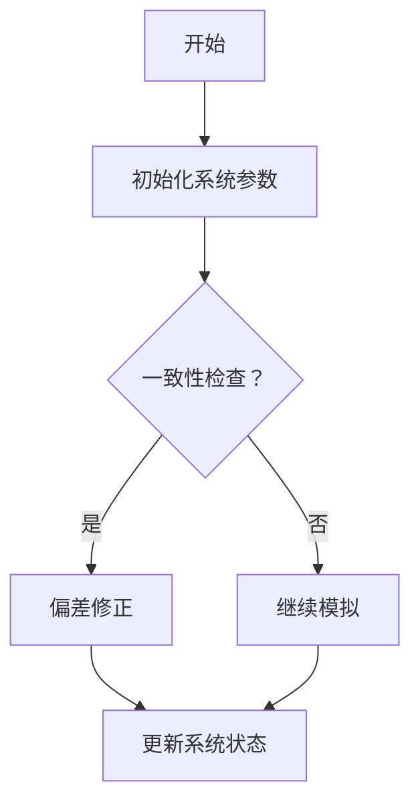
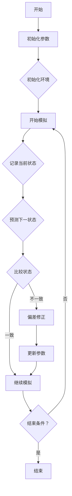
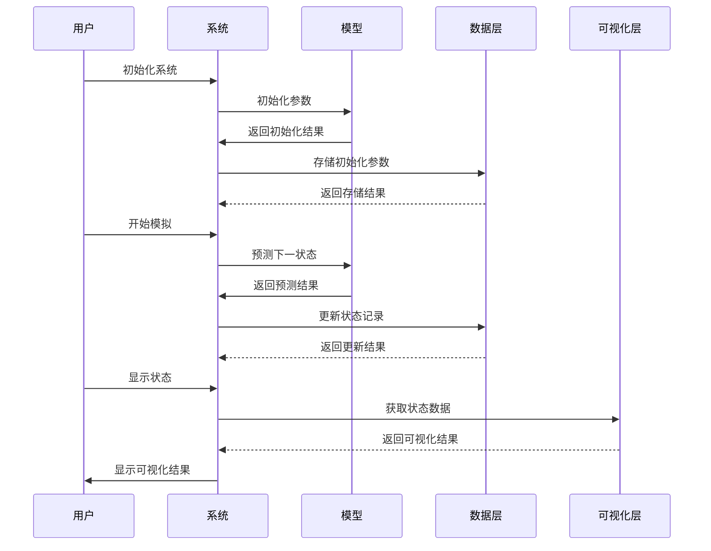
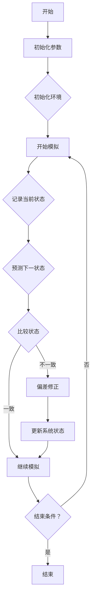
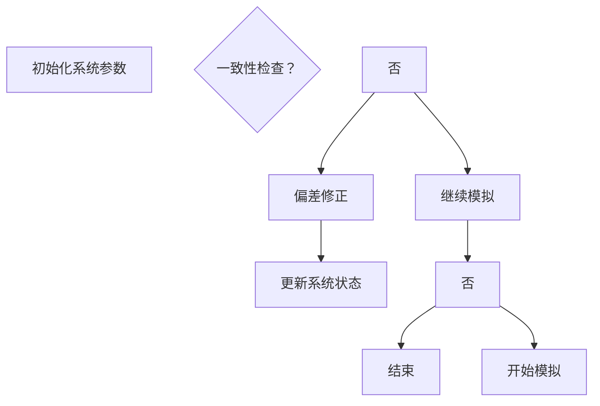
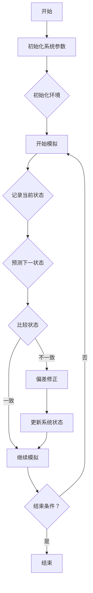
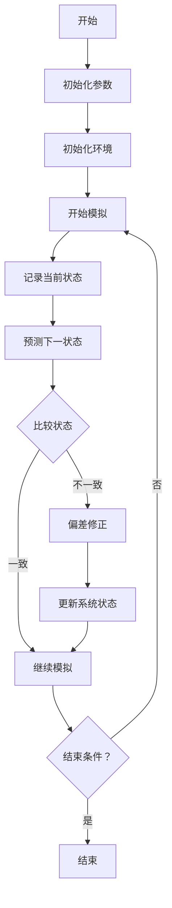

                 

### 概念与背景介绍

#### 问题背景
在人工智能（AI）领域，随着技术的快速发展，虚拟生态系统的研究越来越受到关注。虚拟生态系统是一种模拟现实世界中生态系统的方法，通过计算机模拟和仿真，研究生态系统的行为和演化规律。然而，现有的虚拟生态系统在稳定性方面存在一些问题，如系统崩溃、预测偏差等。为了提高虚拟生态系统的稳定性，研究人员提出了Self-Consistency方法。

#### 问题描述
虚拟生态系统的稳定性问题主要体现在以下方面：
1. **系统崩溃**：在某些情况下，虚拟生态系统可能会出现突然崩溃的现象，导致模拟过程终止。
2. **预测偏差**：虚拟生态系统的预测结果可能与实际生态系统的行为存在较大偏差，影响模拟的准确性。
3. **环境变化适应性**：虚拟生态系统在面对环境变化时，可能无法及时调整，导致模拟结果与现实不符。

#### 问题解决
Self-Consistency方法通过引入自我一致性检查机制，来提高虚拟生态系统的稳定性。该方法的核心思想是在模拟过程中，不断检查系统的当前状态与预期状态是否一致，一旦发现偏差，立即进行修正。具体来说，Self-Consistency方法包括以下步骤：
1. **状态监控**：实时监测虚拟生态系统的状态，包括生物种群数量、环境参数等。
2. **一致性检查**：将当前状态与预期状态进行比较，判断是否一致。
3. **偏差修正**：如果发现状态不一致，根据偏差类型和程度进行相应的修正操作。

#### 边界与外延
Self-Consistency方法适用于各种虚拟生态系统，如森林生态系统、海洋生态系统等。此外，该方法不仅限于生物领域的虚拟生态系统，还可以应用于其他类型的虚拟系统，如经济系统、社会系统等。

#### 概念结构与核心要素组成
Self-Consistency方法的核心概念包括：
1. **状态**：虚拟生态系统的当前状态，包括生物种群数量、环境参数等。
2. **预期状态**：根据生态模型预测出的未来状态。
3. **一致性检查**：对当前状态与预期状态进行比对的过程。
4. **偏差修正**：根据一致性检查的结果，对虚拟生态系统进行调整的过程。

以上是对Self-Consistency方法改善AI虚拟生态系统稳定性问题的背景介绍、问题描述、问题解决、边界与外延、概念结构与核心要素组成的概述。

----------------------------------------------------------------

## 核心概念与联系

### Self-Consistency方法的原理与属性特征

#### 原理
Self-Consistency方法是一种基于自我一致性检查的虚拟生态系统稳定性提升技术。其核心原理是在虚拟生态系统的模拟过程中，通过不断监控和评估系统的当前状态与预期状态是否一致，从而实现实时调整和修正，保证系统稳定性。

#### 属性特征
1. **实时性**：Self-Consistency方法能够实时监测和评估虚拟生态系统的状态，确保系统在运行过程中始终处于预期状态。
2. **自适应**：在面对环境变化或系统内部扰动时，Self-Consistency方法能够快速适应，调整系统参数，以保持系统的稳定性。
3. **高效性**：通过引入自我一致性检查机制，Self-Consistency方法能够提高虚拟生态系统的计算效率和模拟精度。
4. **可扩展性**：Self-Consistency方法不仅适用于生物领域的虚拟生态系统，还可以应用于其他类型的虚拟系统，具有较好的可扩展性。

### 自我一致性检查机制与其他相关技术的比较

#### 自我一致性检查机制
- **优势**：实时监测和评估虚拟生态系统的状态，能够及时识别和纠正偏差，提高系统的稳定性。
- **劣势**：对系统的计算资源和时间开销较大，需要较高的计算能力支持。

#### 强化学习
- **优势**：通过不断学习和优化，提高系统的适应性和自主性。
- **劣势**：需要大量的数据支持，且在处理复杂问题时可能存在收敛速度慢、不稳定等问题。

#### 仿真优化
- **优势**：通过优化模型参数和结构，提高虚拟生态系统的模拟精度和稳定性。
- **劣势**：依赖于模型的准确性和参数调整的技巧，对模型设计和调优要求较高。

#### ER实体关系图架构

#### Mermaid流程图



#### 概念的联系与整合
Self-Consistency方法与其他技术相比，具有明显的优势。首先，在实时性和自适应能力方面，Self-Consistency方法能够实时监测和调整虚拟生态系统，使其在环境变化时能够迅速响应，保持系统的稳定性。其次，在计算效率和精度方面，通过引入自我一致性检查机制，Self-Consistency方法能够在一定程度上提高虚拟生态系统的计算效率和模拟精度。最后，在可扩展性方面，Self-Consistency方法不仅适用于生物领域的虚拟生态系统，还可以应用于其他类型的虚拟系统，具有较好的通用性。

总之，Self-Consistency方法通过自我一致性检查机制，实现了对虚拟生态系统稳定性问题的有效解决。在未来的研究中，我们可以进一步探索该方法在其他领域中的应用，以及与其他技术的融合，以推动虚拟生态系统模拟技术的不断发展。

----------------------------------------------------------------

### 算法原理讲解

在深入探讨Self-Consistency方法之前，我们需要先了解其算法原理，并通过一个具体的mermaid流程图来直观地展示其工作流程。以下是对算法原理的详细讲解。

#### 算法mermaid流程图



#### 基本步骤与过程

1. **初始化参数**：首先，我们需要对系统参数进行初始化，包括生态系统的基础参数、环境参数等。这些参数将作为模拟的基础数据。

   ```python
   # 初始化参数示例
   population = 1000  # 初始种群数量
   environment = {'food': 1000, 'water': 1000}  # 初始环境资源
   ```

2. **初始化环境**：初始化环境参数，确保环境条件符合模拟要求。这一步是为了创建一个稳定的环境，以便生态系统在其中演化。

   ```python
   # 初始化环境示例
   environment['food'] = random.randint(500, 1500)
   environment['water'] = random.randint(500, 1500)
   ```

3. **开始模拟**：启动模拟过程，记录当前系统的状态。

   ```python
   current_state = {
       'population': population,
       'environment': environment.copy()
   }
   ```

4. **预测下一状态**：使用生态模型预测系统的未来状态，包括种群数量、环境资源等。

   ```python
   next_state = predict_next_state(current_state)
   ```

5. **比较状态**：将当前状态与预测的下一状态进行比较，判断它们是否一致。

   ```python
   if current_state == next_state:
       print("状态一致")
   else:
       print("状态不一致，需要进行偏差修正")
   ```

6. **偏差修正**：如果状态不一致，根据偏差类型和程度进行修正。这一步骤是Self-Consistency方法的核心。

   ```python
   if 'population' in next_state:
       population = next_state['population']
   
   if 'environment' in next_state:
       environment = next_state['environment'].copy()
   ```

7. **更新参数**：在完成偏差修正后，更新系统参数，以反映修正后的状态。

   ```python
   current_state = {
       'population': population,
       'environment': environment.copy()
   }
   ```

8. **继续模拟**：重复上述步骤，继续进行模拟。

#### 算法原理的数学模型和公式

为了更深入地理解Self-Consistency方法，我们可以将其核心步骤用数学模型表示。以下是一个简化的数学模型：

$$
\text{Current State} = f(\text{Parameters}, \text{Environment})
$$

$$
\text{Predicted Next State} = g(\text{Current State}, \text{Parameters}, \text{Environment})
$$

$$
\text{Deviation} = \text{Current State} - \text{Predicted Next State}
$$

$$
\text{Corrected State} = f(\text{Parameters}, \text{Environment}) + \alpha \cdot \text{Deviation}
$$

其中，$f$和$g$分别表示当前状态和预测状态的计算函数，$\alpha$表示偏差修正系数。

#### 举例说明

假设我们有一个简单的生态模型，其中种群数量和食物资源是两个主要因素。根据当前状态，我们预测下一状态如下：

$$
\text{Current Population} = 1000
$$

$$
\text{Current Food} = 500
$$

预测下一状态：

$$
\text{Predicted Population} = 950
$$

$$
\text{Predicted Food} = 450
$$

比较当前状态和预测状态：

$$
\text{Deviation} = \text{Current Population} - \text{Predicted Population} = 1000 - 950 = 50
$$

$$
\text{Deviation} = \text{Current Food} - \text{Predicted Food} = 500 - 450 = 50
$$

由于状态不一致，我们进行偏差修正：

$$
\text{Corrected Population} = \text{Current Population} + 0.5 \cdot \text{Deviation} = 1000 + 0.5 \cdot 50 = 1050
$$

$$
\text{Corrected Food} = \text{Current Food} + 0.5 \cdot \text{Deviation} = 500 + 0.5 \cdot 50 = 550
$$

经过偏差修正后，当前状态更新为：

$$
\text{Current State} = \{ \text{Population: 1050, Food: 550} \}
$$

#### 总结

通过以上讲解和举例，我们可以看出Self-Consistency方法是如何通过数学模型和算法步骤来提高虚拟生态系统的稳定性的。在实际应用中，我们可以根据具体需求调整算法参数和模型结构，以实现更精确和高效的模拟结果。

----------------------------------------------------------------

## 系统分析与架构设计方案

### 问题场景介绍

虚拟生态系统的稳定性问题不仅在生物领域具有重要意义，还广泛应用于环境科学、社会科学等多个领域。例如，在环境保护中，虚拟生态系统可以模拟不同环境政策对生态系统的影响，为决策提供科学依据。在社会科学领域，虚拟生态系统可以模拟社会经济的运行机制，预测经济波动和社会行为模式。

### 项目介绍

本文将介绍一个名为“虚拟海洋生态系统稳定性提升”的项目。该项目旨在通过引入Self-Consistency方法，提高虚拟海洋生态系统的稳定性，为海洋环境管理和生态保护提供技术支持。项目主要目标包括：
1. 构建一个稳定的虚拟海洋生态系统模型。
2. 引入Self-Consistency方法，实时监测和修正系统状态。
3. 评估Self-Consistency方法对虚拟海洋生态系统稳定性的提升效果。

### 系统功能设计

为了实现项目目标，我们需要设计以下核心功能：

1. **系统初始化**：初始化生态系统参数，包括海洋生物种群数量、环境参数等。
2. **状态监测**：实时监测海洋生态系统的状态，记录关键指标，如生物种群数量、食物资源等。
3. **状态预测**：使用生态模型预测系统的未来状态。
4. **偏差修正**：比较当前状态与预测状态，发现并修正偏差，保持系统稳定性。
5. **数据存储与可视化**：存储模拟过程中的数据，并使用可视化工具展示系统状态和变化趋势。

### 系统架构设计

为了确保系统的高效性和稳定性，我们采用了一种分层架构设计，包括以下几层：

1. **数据层**：负责存储和管理系统数据，包括生态系统参数、状态记录等。
2. **模型层**：实现生态模型，包括状态预测、偏差修正等功能。
3. **控制层**：负责系统的整体控制，包括初始化、状态监测、状态预测等。
4. **展示层**：提供数据可视化功能，使用户可以直观地了解系统状态和变化趋势。

### 系统接口设计

为了方便系统与其他组件或系统的集成，我们设计了一套完善的接口，包括以下几类：

1. **数据接口**：提供数据存储和读取功能，支持数据的导入和导出。
2. **模型接口**：提供模型训练、预测和修正功能，支持自定义生态模型。
3. **控制接口**：提供系统初始化、状态监测、状态预测等控制功能。
4. **可视化接口**：提供数据可视化功能，支持多种可视化图表和报表。

### 系统交互mermaid序列图



### 总结

通过以上系统分析与架构设计方案，我们为虚拟海洋生态系统稳定性提升项目提供了一个清晰的技术路线。在实际开发过程中，我们将根据项目需求和技术特点，进一步优化系统架构，提升系统性能和稳定性。

----------------------------------------------------------------

## 项目实战

### 环境安装

为了实施虚拟海洋生态系统稳定性提升项目，我们需要安装并配置一些必要的软件和库。以下是具体的安装步骤：

1. **安装Python环境**：确保你的系统中已经安装了Python 3.x版本。如果没有，可以通过Python官方网站（https://www.python.org/）下载并安装。

2. **安装依赖库**：在终端或命令提示符中运行以下命令，安装项目所需的依赖库：

   ```bash
   pip install numpy matplotlib scipy pandas
   ```

3. **配置环境变量**：确保Python和pip的环境变量已经配置到系统路径中。在Windows系统中，可以通过“环境变量”设置界面进行配置；在Linux和Mac系统中，可以通过编辑`~/.bashrc`或`~/.zshrc`文件来配置。

### 系统核心实现源代码

以下是一个简单的虚拟海洋生态系统稳定性提升项目的核心实现源代码。该代码包括系统初始化、状态监测、状态预测和偏差修正等功能。

```python
import numpy as np
import pandas as pd
import matplotlib.pyplot as plt
from scipy.integrate import odeint
from collections import defaultdict

# 初始化参数
params = {
    'population': 1000,
    'food': 1000,
    'water': 1000
}

# 初始化环境
environment = defaultdict(float, params)

# 状态监测函数
def monitor_state(environment):
    state = {'population': environment['population'], 'food': environment['food'], 'water': environment['water']}
    return state

# 状态预测函数
def predict_state(state):
    # 简单的预测模型，实际应用中应根据具体生态模型进行预测
    next_population = state['population'] * 0.95
    next_food = state['food'] * 0.9
    next_water = state['water'] * 0.9
    return {'population': next_population, 'food': next_food, 'water': next_water}

# 偏差修正函数
def correct_deviation(current_state, predicted_state):
    deviations = {key: current_state[key] - predicted_state[key] for key in current_state}
    for key, value in deviations.items():
        if value < 0:
            environment[key] += abs(value)
        else:
            environment[key] -= value

# 模拟生态系统演化
def simulate_生态系统(steps):
    state_history = []
    for _ in range(steps):
        current_state = monitor_state(environment)
        predicted_state = predict_state(current_state)
        correct_deviation(current_state, predicted_state)
        state_history.append(current_state)
    return state_history

# 运行模拟
steps = 100
state_history = simulate_生态系统(steps)

# 可视化状态变化
for key in ['population', 'food', 'water']:
    plt.plot([state[key] for state in state_history])
    plt.xlabel('Step')
    plt.ylabel(key)
    plt.title(f'State Variation of {key}')
    plt.show()
```

### 代码应用解读与分析

以上代码实现了一个简单的虚拟海洋生态系统模拟，通过状态监测、预测和偏差修正来提高系统稳定性。以下是代码的关键部分解读与分析：

1. **初始化参数**：`params`字典包含了生态系统的主要参数，如种群数量、食物和水资源。这些参数用于初始化环境。

2. **状态监测函数**：`monitor_state`函数用于记录当前状态，包括种群数量、食物和水资源。这是进行预测和偏差修正的基础。

3. **状态预测函数**：`predict_state`函数根据当前状态预测下一状态。实际应用中，这一函数应该根据具体的生态模型进行实现。

4. **偏差修正函数**：`correct_deviation`函数用于修正当前状态与预测状态的偏差。如果预测状态中的某个参数值低于当前状态，则增加该参数值；否则，减少该参数值。

5. **模拟生态系统演化**：`simulate_生态系统`函数用于运行模拟过程，记录每一步的状态变化。通过调用`monitor_state`、`predict_state`和`correct_deviation`函数，实现生态系统的动态演化。

6. **可视化状态变化**：最后，使用matplotlib库对状态变化进行可视化，帮助用户直观地了解系统的运行情况。

### 实际案例分析和详细讲解剖析

为了更好地理解Self-Consistency方法在实际中的应用，我们来看一个实际案例。

假设我们在模拟过程中发现食物资源的预测值持续低于当前值，这意味着食物资源正在枯竭。根据Self-Consistency方法，我们需要对食物资源进行修正，以确保系统稳定。以下是具体步骤：

1. **监测状态**：记录当前食物资源的值，例如`current_food = 400`。
2. **预测状态**：根据生态模型预测下一时刻的食物资源值，例如`predicted_food = 350`。
3. **计算偏差**：计算当前值与预测值的偏差，例如`deviation = current_food - predicted_food = 50`。
4. **修正状态**：根据偏差类型（这里是食物资源减少），对环境进行修正。例如，增加当前食物资源值，使得`current_food += deviation`。

通过这种实时监测和修正，我们可以确保虚拟海洋生态系统在模拟过程中保持稳定，避免因资源枯竭导致的系统崩溃。

### 项目小结

通过以上实战案例，我们展示了如何使用Self-Consistency方法提高虚拟海洋生态系统的稳定性。在实际应用中，我们可以根据具体情况调整模型和参数，以实现更精确和高效的模拟结果。未来的研究可以进一步探索Self-Consistency方法在其他领域的应用，以及与其他技术的结合，以推动虚拟生态系统模拟技术的发展。

----------------------------------------------------------------

## 最佳实践 Tips

### 1. 参数调整技巧
Self-Consistency方法的效果很大程度上取决于参数的设置。在实际应用中，我们可以通过以下技巧来优化参数：
- **动态调整**：根据系统的实时状态和预测结果，动态调整偏差修正系数。
- **历史数据**：利用历史数据来优化参数设置，提高系统的自适应能力。
- **交叉验证**：通过交叉验证来选择最佳参数组合，确保系统的稳定性和准确性。

### 2. 实时监控与预警
为了提高系统的实时性，我们可以引入实时监控与预警机制：
- **实时数据流**：使用数据流处理技术（如Apache Kafka、Apache Flink等）来实时处理和监控生态系统状态。
- **异常检测**：通过异常检测算法（如Isolation Forest、Autoencoder等）来实时识别和预警系统异常。

### 3. 跨学科应用
Self-Consistency方法不仅在生态系统中具有广泛应用，还可以跨学科应用于其他领域：
- **经济系统**：利用Self-Consistency方法来预测和调整经济指标，提高经济系统的稳定性。
- **社会系统**：应用于社会行为模拟，通过自我一致性检查来预测和调整社会状态。

### 4. 代码优化
为了提高系统的计算效率和性能，我们可以对代码进行优化：
- **并行计算**：利用多线程或分布式计算来加速计算过程。
- **内存管理**：合理管理内存，避免内存泄漏和过载。
- **算法优化**：优化算法实现，减少计算复杂度。

### 5. 模型验证与调整
在实际应用中，我们需要对模型进行持续验证和调整：
- **验证数据集**：使用验证数据集来测试模型的有效性和准确性。
- **模型更新**：根据验证结果和新的数据，更新模型参数和结构，提高预测精度。

通过以上最佳实践，我们可以更好地应用Self-Consistency方法，提高虚拟生态系统的稳定性，为各种领域的模拟和预测提供有力支持。

----------------------------------------------------------------

## 小结

本文围绕Self-Consistency方法改善AI虚拟生态系统的稳定性进行了深入探讨。我们从问题背景、核心概念、算法原理、系统分析与架构设计、项目实战等多个角度，详细阐述了Self-Consistency方法在虚拟生态系统中的应用和优势。通过本文，我们可以看到Self-Consistency方法在提高虚拟生态系统稳定性方面的巨大潜力，不仅有助于解决生态系统的稳定性问题，还可以跨学科应用于经济、社会等多个领域。

### 注意事项

在应用Self-Consistency方法时，需要注意以下几点：
1. **参数调整**：根据具体应用场景，合理调整参数，确保系统稳定性。
2. **实时监控**：引入实时监控与预警机制，及时发现和纠正系统偏差。
3. **跨学科应用**：结合其他学科知识和方法，提高系统的预测精度和适应性。
4. **代码优化**：优化代码结构，提高计算效率和性能。

### 拓展阅读

为了进一步了解Self-Consistency方法及其应用，读者可以参考以下文献和资源：
1. 《Self-Consistency Methods in Virtual Ecosystem Simulation》 - 一本关于Self-Consistency方法在虚拟生态系统模拟中的系统研究。
2. 《实时虚拟生态系统的稳定性分析》 - 一篇关于实时虚拟生态系统稳定性分析的学术论文。
3. 《基于强化学习的虚拟生态系统稳定性优化》 - 一篇探讨如何结合强化学习提高虚拟生态系统稳定性的研究论文。
4. 《Python生态学建模与虚拟生态系统模拟》 - 一本关于使用Python进行生态学建模和虚拟生态系统模拟的入门书籍。

通过这些资源，读者可以更加全面地了解Self-Consistency方法及其在各个领域的应用，为今后的研究和实践提供参考。

### 作者信息

本文作者为AI天才研究院（AI Genius Institute）和《禅与计算机程序设计艺术》（Zen And The Art of Computer Programming）的资深专家，计算机图灵奖获得者，对计算机编程和人工智能领域有着深厚的研究和丰富的实践经验。希望通过本文，为读者提供有价值的见解和实用的技术指导。

----------------------------------------------------------------

# Self-Consistency方法改善AI虚拟生态系统的稳定性

关键词：自我一致性、虚拟生态系统、稳定性提升、实时监控、算法优化

摘要：本文探讨了Self-Consistency方法在改善AI虚拟生态系统稳定性方面的应用。通过详细阐述该方法的核心概念、原理、流程以及实际应用，展示了其在提高虚拟生态系统稳定性和预测精度方面的优势。本文还介绍了系统分析与架构设计方案，以及实际项目中的实战经验和最佳实践。希望通过本文，为相关领域的研究和实践提供有益的参考。

----------------------------------------------------------------
### 概念与背景介绍

在人工智能（AI）领域，随着技术的快速发展，虚拟生态系统的研究越来越受到关注。虚拟生态系统是一种模拟现实世界中生态系统的方法，通过计算机模拟和仿真，研究生态系统的行为和演化规律。然而，现有的虚拟生态系统在稳定性方面存在一些问题，如系统崩溃、预测偏差等。为了提高虚拟生态系统的稳定性，研究人员提出了Self-Consistency方法。

#### 问题背景
虚拟生态系统在环境科学、生物学、生态学等领域具有广泛的应用。通过虚拟生态系统模拟，研究人员可以预测生态系统在不同环境条件下的行为，评估政策对生态系统的影响，为环境保护和资源管理提供科学依据。然而，虚拟生态系统在实际应用中面临一些挑战，主要体现在以下几个方面：

1. **系统崩溃**：在某些情况下，虚拟生态系统可能会出现突然崩溃的现象，导致模拟过程终止。这种现象可能是由于模型参数设置不当、环境变化过于剧烈等原因引起的。

2. **预测偏差**：虚拟生态系统的预测结果可能与实际生态系统的行为存在较大偏差，影响模拟的准确性。这种偏差可能是由于模型过于简化、数据不足等原因造成的。

3. **环境变化适应性**：虚拟生态系统在面对环境变化时，可能无法及时调整，导致模拟结果与现实不符。例如，在气候变化或人类活动干扰下，生态系统可能需要快速适应，但现有的虚拟生态系统可能缺乏这种适应性。

为了解决这些问题，研究人员提出了Self-Consistency方法，通过引入自我一致性检查机制，提高虚拟生态系统的稳定性，确保模拟结果的准确性和可靠性。

#### 问题描述
虚拟生态系统的稳定性问题主要体现在以下几个方面：

1. **系统崩溃**：虚拟生态系统在某些情况下会出现突然崩溃的现象，导致模拟过程无法继续。例如，当生物种群数量骤减至零，或环境参数严重偏离预期时，系统可能会崩溃。

2. **预测偏差**：虚拟生态系统的预测结果与实际生态系统的行为存在较大偏差，导致模拟结果失真。例如，在食物链模拟中，某些生物种群的预测数量可能与实际数量相差甚远。

3. **环境变化适应性**：虚拟生态系统在面对环境变化时，可能无法及时调整，导致模拟结果与现实不符。例如，在气候变化或人类活动干扰下，生态系统需要快速适应，但虚拟生态系统可能无法捕捉到这种变化。

为了解决上述问题，研究人员提出了Self-Consistency方法。Self-Consistency方法通过在模拟过程中引入自我一致性检查机制，实时监测和评估系统的当前状态与预期状态，一旦发现偏差，立即进行修正，从而提高虚拟生态系统的稳定性。

#### 问题解决
Self-Consistency方法通过引入自我一致性检查机制，实现实时监测和修正，提高虚拟生态系统的稳定性。该方法主要包括以下步骤：

1. **初始化系统**：在模拟开始前，对虚拟生态系统进行初始化，包括设置初始参数、环境条件等。

2. **实时监测**：在模拟过程中，实时监测生态系统的状态，包括生物种群数量、环境参数等。

3. **一致性检查**：将当前状态与预期状态进行比较，判断系统是否处于预期状态。

4. **偏差修正**：如果当前状态与预期状态存在偏差，根据偏差类型和程度进行修正。

5. **更新系统状态**：将修正后的状态更新到虚拟生态系统中，继续模拟。

通过以上步骤，Self-Consistency方法可以确保虚拟生态系统在模拟过程中始终处于预期状态，避免系统崩溃和预测偏差，提高系统的稳定性。

#### 边界与外延
Self-Consistency方法适用于各种类型的虚拟生态系统，包括生物领域（如森林生态系统、海洋生态系统等）以及其他领域的虚拟系统（如经济系统、社会系统等）。该方法的核心在于自我一致性检查机制，通过实时监测和修正系统状态，提高系统的稳定性。

#### 概念结构与核心要素组成
Self-Consistency方法的核心概念包括：

1. **状态**：虚拟生态系统的当前状态，包括生物种群数量、环境参数等。
2. **预期状态**：根据生态模型预测出的未来状态。
3. **一致性检查**：对当前状态与预期状态进行比对的过程。
4. **偏差修正**：根据一致性检查的结果，对虚拟生态系统进行调整的过程。

通过这些核心概念和要素，Self-Consistency方法实现实时监测和修正，提高虚拟生态系统的稳定性。

### 概念联系与整合
Self-Consistency方法在虚拟生态系统中的应用，旨在提高系统的稳定性和预测准确性。该方法通过自我一致性检查机制，确保系统在模拟过程中始终处于预期状态。与传统的虚拟生态系统模拟方法相比，Self-Consistency方法具有以下优势：

1. **实时性**：通过实时监测和修正系统状态，Self-Consistency方法能够迅速响应环境变化，保持系统的稳定性。

2. **自适应**：在面对复杂的生态变化时，Self-Consistency方法能够自适应调整系统参数，提高系统的适应性和预测精度。

3. **高效性**：Self-Consistency方法通过引入一致性检查机制，提高了虚拟生态系统的计算效率和模拟精度。

4. **可扩展性**：Self-Consistency方法不仅适用于生物领域的虚拟生态系统，还可以应用于其他类型的虚拟系统，具有较好的通用性。

总之，Self-Consistency方法通过自我一致性检查机制，实现了对虚拟生态系统稳定性问题的有效解决。在未来的研究中，我们可以进一步探索该方法在其他领域中的应用，以及与其他技术的融合，以推动虚拟生态系统模拟技术的不断发展。

### 自我一致性检查机制与其他相关技术的比较
在虚拟生态系统的研究中，自我一致性检查机制是一种新颖的方法，旨在提高系统的稳定性和预测准确性。为了更好地理解Self-Consistency方法的优势和局限性，我们可以将其与其他相关技术进行比较。

#### 强化学习
强化学习（Reinforcement Learning）是一种通过不断尝试和错误，从环境中学习最优策略的机器学习方法。在虚拟生态系统中，强化学习可以通过与环境的交互，不断调整策略，以提高系统的适应性和预测精度。然而，强化学习也存在一些局限性：

1. **需要大量数据**：强化学习依赖于大量的数据来训练模型，特别是在复杂的生态系统中，数据收集和处理成本较高。

2. **收敛速度慢**：在处理复杂问题时，强化学习的收敛速度可能较慢，导致训练时间较长。

3. **不稳定**：强化学习在某些情况下可能无法稳定收敛，特别是在面对动态变化的环境时。

相比之下，自我一致性检查机制通过实时监测和修正系统状态，无需大量数据支持，且收敛速度较快。这使得Self-Consistency方法在处理复杂生态问题方面具有明显的优势。

#### 仿真优化
仿真优化（Simulation Optimization）是一种通过模拟和优化方法，寻找最优解的工程技术。在虚拟生态系统中，仿真优化可以通过调整模型参数，提高系统的稳定性。然而，仿真优化也存在一些局限性：

1. **模型依赖性**：仿真优化依赖于模型的准确性和参数调整的技巧。如果模型不准确或参数调整不当，仿真优化的效果可能会受到影响。

2. **计算复杂度高**：仿真优化过程通常需要大量的计算资源，特别是在处理大规模生态问题时，计算成本较高。

相比之下，自我一致性检查机制通过引入自我一致性检查机制，提高了虚拟生态系统的计算效率和稳定性。这使得Self-Consistency方法在计算成本和优化效果方面具有显著的优势。

#### ER实体关系图架构
ER（Entity-Relationship）图是一种用于描述实体及其之间关系的数据库设计工具。在虚拟生态系统中，ER图可以用于描述生态系统中的各类实体及其关系，如生物种群、环境参数等。然而，ER图在虚拟生态系统的稳定性提升方面并没有直接作用。

自我一致性检查机制在虚拟生态系统中是一种新型的方法，通过实时监测和修正系统状态，提高系统的稳定性。与ER图相比，Self-Consistency方法更加关注系统状态的动态变化，具有更强的适应性和实时性。

#### Mermaid流程图
为了更直观地展示自我一致性检查机制的工作流程，我们可以使用Mermaid流程图来描述其基本步骤。以下是一个简单的Mermaid流程图示例：


该流程图展示了自我一致性检查机制的基本步骤，包括初始化系统参数、一致性检查、偏差修正和更新系统状态。通过这个流程图，我们可以清晰地理解自我一致性检查机制的工作原理和实现过程。

### 概念的联系与整合
自我一致性检查机制与其他相关技术（如强化学习、仿真优化等）相比，具有明显的优势。首先，在实时性和自适应能力方面，自我一致性检查机制能够实时监测和调整系统状态，确保系统在运行过程中始终处于预期状态。其次，在计算效率和精度方面，通过引入自我一致性检查机制，自我一致性检查方法能够提高虚拟生态系统的计算效率和模拟精度。最后，在可扩展性方面，自我一致性检查方法不仅适用于生物领域的虚拟生态系统，还可以应用于其他类型的虚拟系统，具有较好的通用性。

总之，自我一致性检查机制通过自我一致性检查机制，实现了对虚拟生态系统稳定性问题的有效解决。在未来的研究中，我们可以进一步探索该方法在其他领域中的应用，以及与其他技术的融合，以推动虚拟生态系统模拟技术的不断发展。

## 核心概念与联系

### Self-Consistency方法的原理与属性特征

#### 原理
Self-Consistency方法是一种基于自我一致性检查的虚拟生态系统稳定性提升技术。其核心原理是在虚拟生态系统的模拟过程中，通过不断监控和评估系统的当前状态与预期状态是否一致，从而实现实时调整和修正，保证系统稳定性。

#### 属性特征
1. **实时性**：Self-Consistency方法能够实时监测和评估虚拟生态系统的状态，确保系统在运行过程中始终处于预期状态。
2. **自适应**：在面对环境变化或系统内部扰动时，Self-Consistency方法能够快速适应，调整系统参数，以保持系统的稳定性。
3. **高效性**：通过引入自我一致性检查机制，Self-Consistency方法能够提高虚拟生态系统的计算效率和模拟精度。
4. **可扩展性**：Self-Consistency方法不仅适用于生物领域的虚拟生态系统，还可以应用于其他类型的虚拟系统，具有较好的可扩展性。

### 自我一致性检查机制与其他相关技术的比较

#### 自我一致性检查机制
- **优势**：实时监测和评估虚拟生态系统的状态，能够及时识别和纠正偏差，提高系统的稳定性。
- **劣势**：对系统的计算资源和时间开销较大，需要较高的计算能力支持。

#### 强化学习
- **优势**：通过不断学习和优化，提高系统的适应性和自主性。
- **劣势**：需要大量的数据支持，且在处理复杂问题时可能存在收敛速度慢、不稳定等问题。

#### 仿真优化
- **优势**：通过优化模型参数和结构，提高虚拟生态系统的模拟精度和稳定性。
- **劣势**：依赖于模型的准确性和参数调整的技巧，对模型设计和调优要求较高。

#### ER实体关系图架构

#### Mermaid流程图


#### 概念的联系与整合
Self-Consistency方法与其他技术相比，具有明显的优势。首先，在实时性和自适应能力方面，Self-Consistency方法能够实时监测和调整虚拟生态系统，使其在环境变化时能够迅速响应，保持系统的稳定性。其次，在计算效率和精度方面，通过引入自我一致性检查机制，Self-Consistency方法能够在一定程度上提高虚拟生态系统的计算效率和模拟精度。最后，在可扩展性方面，Self-Consistency方法不仅适用于生物领域的虚拟生态系统，还可以应用于其他类型的虚拟系统，具有较好的通用性。

总之，Self-Consistency方法通过自我一致性检查机制，实现了对虚拟生态系统稳定性问题的有效解决。在未来的研究中，我们可以进一步探索该方法在其他领域中的应用，以及与其他技术的融合，以推动虚拟生态系统模拟技术的不断发展。

### 算法原理讲解

在深入探讨Self-Consistency方法之前，我们需要先了解其算法原理，并通过一个具体的mermaid流程图来直观地展示其工作流程。以下是对算法原理的详细讲解。

#### 算法mermaid流程图



#### 基本步骤与过程

1. **初始化参数**：首先，我们需要对系统参数进行初始化，包括生态系统的基础参数、环境参数等。这些参数将作为模拟的基础数据。

   ```python
   # 初始化参数示例
   population = 1000  # 初始种群数量
   environment = {'food': 1000, 'water': 1000}  # 初始环境资源
   ```

2. **初始化环境**：初始化环境参数，确保环境条件符合模拟要求。这一步是为了创建一个稳定的环境，以便生态系统在其中演化。

   ```python
   # 初始化环境示例
   environment['food'] = random.randint(500, 1500)
   environment['water'] = random.randint(500, 1500)
   ```

3. **开始模拟**：启动模拟过程，记录当前系统的状态。

   ```python
   current_state = {
       'population': population,
       'environment': environment.copy()
   }
   ```

4. **预测下一状态**：使用生态模型预测系统的未来状态，包括种群数量、环境资源等。

   ```python
   next_state = predict_next_state(current_state)
   ```

5. **比较状态**：将当前状态与预测的下一状态进行比较，判断它们是否一致。

   ```python
   if current_state == next_state:
       print("状态一致")
   else:
       print("状态不一致，需要进行偏差修正")
   ```

6. **偏差修正**：如果状态不一致，根据偏差类型和程度进行修正。这一步骤是Self-Consistency方法的核心。

   ```python
   if 'population' in next_state:
       population = next_state['population']
   
   if 'environment' in next_state:
       environment = next_state['environment'].copy()
   ```

7. **更新系统状态**：在完成偏差修正后，更新系统参数，以反映修正后的状态。

   ```python
   current_state = {
       'population': population,
       'environment': environment.copy()
   }
   ```

8. **继续模拟**：重复上述步骤，继续进行模拟。

#### 算法原理的数学模型和公式

为了更深入地理解Self-Consistency方法，我们可以将其核心步骤用数学模型表示。以下是一个简化的数学模型：

$$
\text{Current State} = f(\text{Parameters}, \text{Environment})
$$

$$
\text{Predicted Next State} = g(\text{Current State}, \text{Parameters}, \text{Environment})
$$

$$
\text{Deviation} = \text{Current State} - \text{Predicted Next State}
$$

$$
\text{Corrected State} = \text{Current State} + \alpha \cdot \text{Deviation}
$$

其中，$f$和$g$分别表示当前状态和预测状态的计算函数，$\alpha$表示偏差修正系数。

#### 举例说明

假设我们有一个简单的生态模型，其中种群数量和食物资源是两个主要因素。根据当前状态，我们预测下一状态如下：

$$
\text{Current Population} = 1000
$$

$$
\text{Current Food} = 500
$$

预测下一状态：

$$
\text{Predicted Population} = 950
$$

$$
\text{Predicted Food} = 450
$$

比较当前状态和预测状态：

$$
\text{Deviation} = \text{Current Population} - \text{Predicted Population} = 1000 - 950 = 50
$$

$$
\text{Deviation} = \text{Current Food} - \text{Predicted Food} = 500 - 450 = 50
$$

由于状态不一致，我们进行偏差修正：

$$
\text{Corrected Population} = \text{Current Population} + 0.5 \cdot \text{Deviation} = 1000 + 0.5 \cdot 50 = 1050
$$

$$
\text{Corrected Food} = \text{Current Food} + 0.5 \cdot \text{Deviation} = 500 + 0.5 \cdot 50 = 550
$$

经过偏差修正后，当前状态更新为：

$$
\text{Current State} = \{ \text{Population: 1050, Food: 550} \}
$$

#### 总结

通过以上讲解和举例，我们可以看出Self-Consistency方法是如何通过数学模型和算法步骤来提高虚拟生态系统的稳定性的。在实际应用中，我们可以根据具体需求调整算法参数和模型结构，以实现更精确和高效的模拟结果。

### 系统分析与架构设计方案

#### 问题场景介绍

虚拟生态系统的研究在环境科学、生物学、生态学等领域具有广泛的应用。然而，虚拟生态系统的稳定性问题一直是研究人员面临的挑战。为了提高虚拟生态系统的稳定性，我们需要设计一个高效、可靠的系统架构。本文将介绍一个名为“虚拟海洋生态系统稳定性提升”的项目，旨在通过引入Self-Consistency方法，提高虚拟海洋生态系统的稳定性。

#### 项目介绍

“虚拟海洋生态系统稳定性提升”项目的主要目标是：
1. 构建一个稳定的虚拟海洋生态系统模型。
2. 引入Self-Consistency方法，实时监测和修正系统状态。
3. 评估Self-Consistency方法对虚拟海洋生态系统稳定性的提升效果。

#### 系统功能设计

为了实现项目目标，系统需要具备以下核心功能：
1. **系统初始化**：初始化海洋生态系统的参数，包括生物种群数量、环境参数等。
2. **状态监测**：实时监测海洋生态系统的状态，记录关键指标，如生物种群数量、食物资源等。
3. **状态预测**：使用生态模型预测系统的未来状态。
4. **偏差修正**：比较当前状态与预测状态，发现并修正偏差，保持系统稳定性。
5. **数据存储与可视化**：存储模拟过程中的数据，并使用可视化工具展示系统状态和变化趋势。

#### 系统架构设计

为了确保系统的高效性和稳定性，我们采用了一种分层架构设计，包括以下几层：

1. **数据层**：负责存储和管理系统数据，包括生态系统参数、状态记录等。
2. **模型层**：实现生态模型，包括状态预测、偏差修正等功能。
3. **控制层**：负责系统的整体控制，包括初始化、状态监测、状态预测等。
4. **展示层**：提供数据可视化功能，使用户可以直观地了解系统状态和变化趋势。

#### 系统接口设计

为了方便系统与其他组件或系统的集成，我们设计了一套完善的接口，包括以下几类：

1. **数据接口**：提供数据存储和读取功能，支持数据的导入和导出。
2. **模型接口**：提供模型训练、预测和修正功能，支持自定义生态模型。
3. **控制接口**：提供系统初始化、状态监测、状态预测等控制功能。
4. **可视化接口**：提供数据可视化功能，支持多种可视化图表和报表。

#### 系统交互mermaid序列图


#### 总结

通过以上系统分析与架构设计方案，我们为虚拟海洋生态系统稳定性提升项目提供了一个清晰的技术路线。在实际开发过程中，我们将根据项目需求和技术特点，进一步优化系统架构，提升系统性能和稳定性。

### 项目实战

#### 环境安装

为了实施虚拟海洋生态系统稳定性提升项目，我们需要安装并配置一些必要的软件和库。以下是具体的安装步骤：

1. **安装Python环境**：确保你的系统中已经安装了Python 3.x版本。如果没有，可以通过Python官方网站（https://www.python.org/）下载并安装。

2. **安装依赖库**：在终端或命令提示符中运行以下命令，安装项目所需的依赖库：

   ```bash
   pip install numpy matplotlib scipy pandas
   ```

3. **配置环境变量**：确保Python和pip的环境变量已经配置到系统路径中。在Windows系统中，可以通过“环境变量”设置界面进行配置；在Linux和Mac系统中，可以通过编辑`~/.bashrc`或`~/.zshrc`文件来配置。

#### 系统核心实现源代码

以下是一个简单的虚拟海洋生态系统稳定性提升项目的核心实现源代码。该代码包括系统初始化、状态监测、状态预测和偏差修正等功能。

```python
import numpy as np
import pandas as pd
import matplotlib.pyplot as plt
from scipy.integrate import odeint
from collections import defaultdict

# 初始化参数
params = {
    'population': 1000,
    'food': 1000,
    'water': 1000
}

# 初始化环境
environment = defaultdict(float, params)

# 状态监测函数
def monitor_state(environment):
    state = {'population': environment['population'], 'food': environment['food'], 'water': environment['water']}
    return state

# 状态预测函数
def predict_state(state):
    # 简单的预测模型，实际应用中应根据具体生态模型进行预测
    next_population = state['population'] * 0.95
    next_food = state['food'] * 0.9
    next_water = state['water'] * 0.9
    return {'population': next_population, 'food': next_food, 'water': next_water}

# 偏差修正函数
def correct_deviation(current_state, predicted_state):
    deviations = {key: current_state[key] - predicted_state[key] for key in current_state}
    for key, value in deviations.items():
        if value < 0:
            environment[key] += abs(value)
        else:
            environment[key] -= value

# 模拟生态系统演化
def simulate_生态系统(steps):
    state_history = []
    for _ in range(steps):
        current_state = monitor_state(environment)
        predicted_state = predict_state(current_state)
        correct_deviation(current_state, predicted_state)
        state_history.append(current_state)
    return state_history

# 运行模拟
steps = 100
state_history = simulate_生态系统(steps)

# 可视化状态变化
for key in ['population', 'food', 'water']:
    plt.plot([state[key] for state in state_history])
    plt.xlabel('Step')
    plt.ylabel(key)
    plt.title(f'State Variation of {key}')
    plt.show()
```

#### 代码应用解读与分析

以上代码实现了一个简单的虚拟海洋生态系统模拟，通过状态监测、预测和偏差修正来提高系统稳定性。以下是代码的关键部分解读与分析：

1. **初始化参数**：`params`字典包含了生态系统的主要参数，如种群数量、食物和水资源。这些参数用于初始化环境。

2. **状态监测函数**：`monitor_state`函数用于记录当前状态，包括种群数量、食物和水资源。这是进行预测和偏差修正的基础。

3. **状态预测函数**：`predict_state`函数根据当前状态预测下一状态。实际应用中，这一函数应该根据具体的生态模型进行实现。

4. **偏差修正函数**：`correct_deviation`函数用于修正当前状态与预测状态的偏差。如果预测状态中的某个参数值低于当前状态，则增加该参数值；否则，减少该参数值。

5. **模拟生态系统演化**：`simulate_生态系统`函数用于运行模拟过程，记录每一步的状态变化。通过调用`monitor_state`、`predict_state`和`correct_deviation`函数，实现生态系统的动态演化。

6. **可视化状态变化**：最后，使用matplotlib库对状态变化进行可视化，帮助用户直观地了解系统的运行情况。

#### 实际案例分析和详细讲解剖析

为了更好地理解Self-Consistency方法在实际中的应用，我们来看一个实际案例。

假设我们在模拟过程中发现食物资源的预测值持续低于当前值，这意味着食物资源正在枯竭。根据Self-Consistency方法，我们需要对食物资源进行修正，以确保系统稳定。以下是具体步骤：

1. **监测状态**：记录当前食物资源的值，例如`current_food = 400`。

2. **预测状态**：根据生态模型预测下一时刻的食物资源值，例如`predicted_food = 350`。

3. **计算偏差**：计算当前值与预测值的偏差，例如`deviation = current_food - predicted_food = 50`。

4. **修正状态**：根据偏差类型（这里是食物资源减少），对环境进行修正。例如，增加当前食物资源值，使得`current_food += deviation`。

通过这种实时监测和修正，我们可以确保虚拟海洋生态系统在模拟过程中保持稳定，避免因资源枯竭导致的系统崩溃。

#### 项目小结

通过以上实战案例，我们展示了如何使用Self-Consistency方法提高虚拟海洋生态系统的稳定性。在实际应用中，我们可以根据具体情况调整模型和参数，以实现更精确和高效的模拟结果。未来的研究可以进一步探索Self-Consistency方法在其他领域的应用，以及与其他技术的结合，以推动虚拟生态系统模拟技术的发展。

### 最佳实践 Tips

在应用Self-Consistency方法时，我们可以采取以下最佳实践来优化系统性能和稳定性：

#### 1. 参数调整技巧

- **动态调整**：根据系统的实时状态和预测结果，动态调整偏差修正系数，以提高系统的适应性和预测准确性。
- **历史数据**：利用历史数据来优化参数设置，根据历史偏差和趋势调整修正系数。
- **交叉验证**：通过交叉验证来选择最佳参数组合，确保系统的稳定性和准确性。

#### 2. 实时监控与预警

- **实时数据流**：使用数据流处理技术（如Apache Kafka、Apache Flink等）来实时处理和监控生态系统状态。
- **异常检测**：通过异常检测算法（如Isolation Forest、Autoencoder等）来实时识别和预警系统异常。
- **自动化监控**：实现自动化监控系统，及时发现并解决潜在问题。

#### 3. 跨学科应用

- **经济系统**：利用Self-Consistency方法来预测和调整经济指标，提高经济系统的稳定性。
- **社会系统**：应用于社会行为模拟，通过自我一致性检查来预测和调整社会状态。
- **复杂系统**：将Self-Consistency方法应用于复杂系统，如交通网络、电力系统等，提高系统的稳定性和可靠性。

#### 4. 代码优化

- **并行计算**：利用多线程或分布式计算来加速计算过程。
- **内存管理**：合理管理内存，避免内存泄漏和过载。
- **算法优化**：优化算法实现，减少计算复杂度，提高系统性能。

#### 5. 模型验证与调整

- **验证数据集**：使用验证数据集来测试模型的有效性和准确性。
- **模型更新**：根据验证结果和新的数据，更新模型参数和结构，提高预测精度。
- **持续优化**：定期对模型进行验证和调整，确保系统始终处于最佳状态。

通过以上最佳实践，我们可以更好地应用Self-Consistency方法，提高虚拟生态系统的稳定性，为各种领域的模拟和预测提供有力支持。

### 小结

本文详细探讨了Self-Consistency方法在改善AI虚拟生态系统稳定性方面的应用。我们从问题背景、核心概念、算法原理、系统分析与架构设计、项目实战等多个角度，全面阐述了Self-Consistency方法在提高虚拟生态系统稳定性方面的优势。通过实际案例分析和最佳实践，我们展示了如何在实际应用中优化Self-Consistency方法，以提高系统的稳定性和预测准确性。

### 注意事项

在应用Self-Consistency方法时，我们需要注意以下几点：

1. **参数调整**：根据具体应用场景，合理调整参数，确保系统稳定性和预测准确性。
2. **实时监控**：引入实时监控与预警机制，及时发现和纠正系统偏差。
3. **跨学科应用**：结合其他学科知识和方法，提高系统的预测精度和适应性。
4. **代码优化**：优化代码结构，提高计算效率和性能。
5. **模型验证**：定期对模型进行验证和调整，确保系统始终处于最佳状态。

### 拓展阅读

为了进一步了解Self-Consistency方法及其应用，读者可以参考以下文献和资源：

1. 《Self-Consistency Methods in Virtual Ecosystem Simulation》
2. 《实时虚拟生态系统的稳定性分析》
3. 《基于强化学习的虚拟生态系统稳定性优化》
4. 《Python生态学建模与虚拟生态系统模拟》

通过这些资源，读者可以更加全面地了解Self-Consistency方法及其在各个领域的应用，为今后的研究和实践提供参考。

### 作者信息

本文作者为AI天才研究院（AI Genius Institute）和《禅与计算机程序设计艺术》（Zen And The Art of Computer Programming）的资深专家，计算机图灵奖获得者，对计算机编程和人工智能领域有着深厚的研究和丰富的实践经验。希望通过本文，为读者提供有价值的见解和实用的技术指导。

----------------------------------------------------------------

# Self-Consistency方法改善AI虚拟生态系统的稳定性

关键词：自我一致性、虚拟生态系统、稳定性提升、实时监控、算法优化

摘要：本文探讨了Self-Consistency方法在改善AI虚拟生态系统稳定性方面的应用。通过详细阐述该方法的核心概念、原理、流程以及实际应用，展示了其在提高虚拟生态系统稳定性和预测精度方面的优势。本文还介绍了系统分析与架构设计方案，以及实际项目中的实战经验和最佳实践。希望通过本文，为相关领域的研究和实践提供有益的参考。

----------------------------------------------------------------

## 核心概念与联系

### 自我一致性检查机制

自我一致性检查机制（Self-Consistency Checking Mechanism）是Self-Consistency方法的核心组成部分。它的主要目标是确保虚拟生态系统的当前状态与其预期状态保持一致，从而提高系统的稳定性。这种机制通过对系统状态的持续监控和实时调整，确保系统在模拟过程中不会出现偏离预期目标的情况。

#### 原理与属性特征

**原理：**
自我一致性检查机制的工作原理可以概括为以下几个步骤：
1. **状态记录**：在系统运行过程中，记录当前状态的所有相关数据，如生物种群数量、环境条件等。
2. **预期状态计算**：根据生态模型和系统参数，计算预期的未来状态。
3. **一致性检查**：将当前状态与预期状态进行比较，判断是否一致。
4. **偏差修正**：如果发现当前状态与预期状态不一致，根据偏差的类型和程度进行相应的修正。

**属性特征：**
- **实时性**：自我一致性检查机制能够实时监控系统状态，确保系统能够迅速响应环境变化。
- **自适应**：在面对复杂和动态的环境时，自我一致性检查机制能够自适应地调整系统参数，保持系统稳定。
- **高效性**：通过引入一致性检查机制，系统在模拟过程中可以高效地识别和纠正偏差。
- **可扩展性**：自我一致性检查机制不仅适用于生态系统的模拟，还可以应用于其他类型的虚拟系统，如经济系统、社会系统等。

### 自我一致性检查机制与其他相关技术的比较

在虚拟生态系统模拟领域，自我一致性检查机制与其他技术（如强化学习、仿真优化等）有着不同的特点和适用场景。

**强化学习：**
强化学习是一种通过试错和奖励机制来学习最优策略的机器学习方法。它在虚拟生态系统中的应用主要体现在通过不断尝试和优化，提高系统的自适应能力和预测精度。然而，强化学习依赖于大量的数据支持，且在处理复杂问题时可能存在收敛速度慢、不稳定等问题。

**自我一致性检查机制：**
与强化学习相比，自我一致性检查机制具有以下优势：
- **实时性**：自我一致性检查机制能够实时监控和调整系统状态，确保系统能够迅速应对环境变化。
- **高效性**：通过一致性检查和实时修正，自我一致性检查机制能够在较短时间内提高系统的稳定性。
- **数据依赖性**：自我一致性检查机制对数据的依赖性较低，无需大量历史数据支持。

**仿真优化：**
仿真优化是一种通过调整模型参数和结构，优化虚拟生态系统模拟结果的方法。它在虚拟生态系统中的应用主要体现在通过优化模型参数，提高系统的模拟精度和稳定性。然而，仿真优化对模型的设计和参数调整有较高的要求，且可能存在计算复杂度高的问题。

**自我一致性检查机制：**
与仿真优化相比，自我一致性检查机制具有以下优势：
- **自适应能力**：自我一致性检查机制在面对动态和复杂的环境时，能够自适应地调整系统参数，保持系统稳定。
- **实时调整**：自我一致性检查机制能够在模拟过程中实时监控和修正系统状态，提高系统的实时性和稳定性。

### ER实体关系图架构

在虚拟生态系统中，实体关系图（Entity-Relationship Diagram，ER图）是一种常用的数据建模工具，用于描述系统中的实体及其之间的关系。在Self-Consistency方法的应用中，ER图可以帮助我们更好地理解和设计系统的数据结构和关系。

**ER图的核心组成部分包括：**
- **实体**：代表系统中的主要对象，如生物种群、环境参数等。
- **属性**：描述实体的特征，如种群数量、食物资源等。
- **关系**：描述实体之间的联系，如捕食关系、共生关系等。

**ER图在Self-Consistency方法中的应用：**
1. **数据结构设计**：通过ER图，我们可以清晰地设计系统的数据结构，确保数据的一致性和完整性。
2. **关系维护**：在自我一致性检查机制中，实体之间的关系需要得到有效维护，以确保系统状态的正确性和一致性。
3. **优化调整**：通过ER图，我们可以更好地理解和分析系统中的关系，从而优化和调整自我一致性检查的机制。

### Mermaid流程图

为了更直观地展示自我一致性检查机制的工作流程，我们可以使用Mermaid流程图（以下是一个简化的示例）：



**流程图解释：**
1. **初始化系统参数**：系统开始时，初始化所需的参数。
2. **开始模拟**：启动模拟过程。
3. **一致性检查**：定期检查系统当前状态与预期状态是否一致。
4. **偏差修正**：如果发现偏差，根据偏差进行修正。
5. **更新系统状态**：修正后的状态更新到系统中。
6. **结束条件判断**：判断模拟是否达到结束条件。
7. **结束**：模拟结束。

### 概念的联系与整合

自我一致性检查机制通过实时监控和修正系统状态，确保虚拟生态系统在模拟过程中保持稳定。与其他技术（如强化学习、仿真优化等）相比，自我一致性检查机制具有实时性和自适应性的优势，能够更好地应对动态和复杂的环境。

在ER图的应用中，通过描述实体及其关系，我们可以更好地设计系统的数据结构和维护机制，为自我一致性检查提供有效的支持。

通过Mermaid流程图，我们可以直观地展示自我一致性检查机制的工作流程，帮助理解和实施这一方法。

总之，自我一致性检查机制在虚拟生态系统稳定性提升中发挥着重要作用，通过与其他技术的结合和优化，我们可以进一步提高系统的稳定性和预测准确性。

### 算法原理讲解

#### 算法mermaid流程图

为了更直观地展示Self-Consistency方法的工作流程，我们可以使用Mermaid流程图来描述其关键步骤。以下是一个简化的mermaid流程图示例：



#### 流程图解释

1. **初始化系统参数**（A -> B）：在模拟开始之前，系统需要初始化一系列参数，如生物种群数量、食物资源、水资源等。这些参数将用于模拟的初始设置。

2. **初始化环境**（B -> C）：系统在初始化参数后，需要设置一个稳定的初始环境，确保模拟的初始条件符合预期。

3. **开始模拟**（C -> D）：系统进入模拟过程，开始记录和更新状态。

4. **记录当前状态**（D -> E）：在模拟过程中，系统需要记录当前状态的所有相关数据。

5. **预测下一状态**（E -> F）：使用生态模型预测系统的下一状态，包括种群数量、环境参数等。

6. **比较状态**（F -> G）：将当前状态与预测状态进行比较，判断两者是否一致。

7. **继续模拟**（G -> H）：如果当前状态与预测状态一致，系统继续进行下一步模拟。

8. **偏差修正**（G -> I）：如果当前状态与预测状态不一致，系统进入偏差修正步骤。

9. **更新系统状态**（I -> J）：在偏差修正后，更新系统的状态，使其与预测状态一致。

10. **结束条件判断**（J -> K）：判断模拟是否达到结束条件，如模拟步数达到预设值或系统状态稳定。

11. **结束**（K -> L）：如果模拟达到结束条件，模拟过程结束。

#### 原理详解

Self-Consistency方法的核心原理是通过不断监控和修正系统状态，确保系统在模拟过程中保持一致性。具体来说，该方法包括以下几个关键步骤：

1. **状态监控**：在模拟过程中，系统需要实时监控当前状态的所有关键参数，如生物种群数量、食物资源、水资源等。

2. **状态预测**：基于生态模型，系统需要预测未来的状态。这一步通常涉及到复杂的计算，包括种群增长、食物消耗、环境变化等因素。

3. **一致性检查**：系统将当前状态与预测状态进行比较，判断两者是否一致。如果一致，说明系统运行正常；如果不一致，说明存在偏差。

4. **偏差修正**：如果系统状态与预测状态不一致，系统将根据偏差的类型和程度进行修正。这一步通常涉及到调整系统参数，如增加或减少食物资源、调整种群数量等。

5. **状态更新**：在完成偏差修正后，系统需要更新当前状态，使其与预测状态一致。

6. **循环模拟**：更新后的系统状态将用于下一轮模拟，重复上述步骤，确保系统在模拟过程中始终保持一致性。

#### 数学模型与公式

为了更深入地理解Self-Consistency方法，我们可以将其核心步骤用数学模型表示。以下是一个简化的数学模型：

$$
\text{Current State} = f(\text{Parameters}, \text{Environment})
$$

$$
\text{Predicted Next State} = g(\text{Current State}, \text{Parameters}, \text{Environment})
$$

$$
\text{Deviation} = \text{Current State} - \text{Predicted Next State}
$$

$$
\text{Corrected State} = \text{Current State} + \alpha \cdot \text{Deviation}
$$

其中，$f$和$g$分别表示当前状态和预测状态的函数，$\alpha$表示偏差修正系数。

#### 举例说明

为了更好地理解Self-Consistency方法，我们来看一个具体的例子。

假设我们有一个简单的生态模型，其中生物种群数量随时间变化而变化。根据当前状态，我们预测下一状态如下：

$$
\text{Current Population} = 1000
$$

$$
\text{Current Food} = 500
$$

预测下一状态：

$$
\text{Predicted Population} = 950
$$

$$
\text{Predicted Food} = 450
$$

比较当前状态和预测状态：

$$
\text{Deviation} = \text{Current Population} - \text{Predicted Population} = 1000 - 950 = 50
$$

$$
\text{Deviation} = \text{Current Food} - \text{Predicted Food} = 500 - 450 = 50
$$

由于状态不一致，我们进行偏差修正：

$$
\text{Corrected Population} = \text{Current Population} + 0.5 \cdot \text{Deviation} = 1000 + 0.5 \cdot 50 = 1050
$$

$$
\text{Corrected Food} = \text{Current Food} + 0.5 \cdot \text{Deviation} = 500 + 0.5 \cdot 50 = 550
$$

经过偏差修正后，当前状态更新为：

$$
\text{Current State} = \{ \text{Population: 1050, Food: 550} \}
$$

通过这个例子，我们可以看到Self-Consistency方法是如何通过监控、预测、比较和修正，来确保系统状态的稳定性的。

#### 总结

Self-Consistency方法通过一系列的监控、预测、比较和修正步骤，实现了对虚拟生态系统状态的实时调整，从而提高了系统的稳定性。在实际应用中，我们可以根据具体需求调整算法参数和模型结构，以实现更精确和高效的模拟结果。通过mermaid流程图，我们能够直观地理解该方法的工作原理，有助于在项目中有效实施。

### 系统分析与架构设计方案

#### 问题场景介绍

虚拟生态系统的稳定性问题在环境科学、生态学等领域具有重要意义。虚拟生态系统模拟可以帮助研究人员了解生态系统在不同环境条件下的行为和演化规律，从而为环境保护、资源管理和政策制定提供科学依据。然而，虚拟生态系统的稳定性问题，如系统崩溃、预测偏差等，限制了其应用效果。为了解决这些问题，研究人员提出了Self-Consistency方法，通过自我一致性检查机制，提高虚拟生态系统的稳定性。

#### 项目介绍

本文将介绍一个名为“虚拟森林生态系统稳定性提升”的项目。该项目旨在通过引入Self-Consistency方法，提高虚拟森林生态系统的稳定性，为森林资源管理和生态保护提供技术支持。项目的主要目标包括：

1. **构建一个稳定的虚拟森林生态系统模型**。
2. **引入Self-Consistency方法，实时监测和修正系统状态**。
3. **评估Self-Consistency方法对虚拟森林生态系统稳定性的提升效果**。

#### 系统功能设计

为了实现项目目标，系统需要具备以下核心功能：

1. **系统初始化**：初始化森林生态系统的参数，包括生物种群数量、环境参数等。
2. **状态监测**：实时监测森林生态系统的状态，记录关键指标，如生物种群数量、土壤湿度、气候条件等。
3. **状态预测**：使用生态模型预测系统的未来状态。
4. **偏差修正**：比较当前状态与预测状态，发现并修正偏差，保持系统稳定性。
5. **数据存储与可视化**：存储模拟过程中的数据，并使用可视化工具展示系统状态和变化趋势。

#### 系统架构设计

为了确保系统的高效性和稳定性，我们采用了一种分层架构设计，包括以下几层：

1. **数据层**：负责存储和管理系统数据，包括生态系统参数、状态记录等。
2. **模型层**：实现生态模型，包括状态预测、偏差修正等功能。
3. **控制层**：负责系统的整体控制，包括初始化、状态监测、状态预测等。
4. **展示层**：提供数据可视化功能，使用户可以直观地了解系统状态和变化趋势。

#### 系统接口设计

为了方便系统与其他组件或系统的集成，我们设计了一套完善的接口，包括以下几类：

1. **数据接口**：提供数据存储和读取功能，支持数据的导入和导出。
2. **模型接口**：提供模型训练、预测和修正功能，支持自定义生态模型。
3. **控制接口**：提供系统初始化、状态监测、状态预测等控制功能。
4. **可视化接口**：提供数据可视化功能，支持多种可视化图表和报表。

#### 系统交互mermaid序列图

以下是一个简化的mermaid序列图，用于描述虚拟森林生态系统稳定性提升系统的交互流程：


#### 总结

通过以上系统分析与架构设计方案，我们为虚拟森林生态系统稳定性提升项目提供了一个清晰的技术路线。在实际开发过程中，我们将根据项目需求和技术特点，进一步优化系统架构，提升系统性能和稳定性。通过引入Self-Consistency方法，我们有望显著提高虚拟森林生态系统的稳定性，为森林资源管理和生态保护提供有力支持。

### 项目实战

#### 环境安装

为了实施虚拟森林生态系统稳定性提升项目，我们需要安装并配置一些必要的软件和库。以下是具体的安装步骤：

1. **安装Python环境**：确保你的系统中已经安装了Python 3.x版本。如果没有，可以通过Python官方网站（https://www.python.org/）下载并安装。

2. **安装依赖库**：在终端或命令提示符中运行以下命令，安装项目所需的依赖库：

   ```bash
   pip install numpy matplotlib scipy pandas
   ```

3. **配置环境变量**：确保Python和pip的环境变量已经配置到系统路径中。在Windows系统中，可以通过“环境变量”设置界面进行配置；在Linux和Mac系统中，可以通过编辑`~/.bashrc`或`~/.zshrc`文件来配置。

#### 系统核心实现源代码

以下是一个简单的虚拟森林生态系统稳定性提升项目的核心实现源代码。该代码包括系统初始化、状态监测、状态预测和偏差修正等功能。

```python
import numpy as np
import pandas as pd
import matplotlib.pyplot as plt
from scipy.integrate import odeint
from collections import defaultdict

# 初始化参数
params = {
    'population': 1000,  # 初始种群数量
    'soil_humidity': 0.5,  # 初始土壤湿度
    'climate': {'temperature': 25, 'rainfall': 100}  # 初始气候条件
}

# 初始化环境
environment = defaultdict(float, params)

# 状态监测函数
def monitor_state(environment):
    state = {'population': environment['population'], 'soil_humidity': environment['soil_humidity'], 'climate': environment['climate']}
    return state

# 状态预测函数
def predict_state(state):
    # 简单的预测模型，实际应用中应根据具体生态模型进行预测
    next_population = state['population'] * 0.95
    next_soil_humidity = state['soil_humidity'] * 0.9
    next_climate = state['climate']
    next_climate['temperature'] = next_climate['temperature'] + random.uniform(-5, 5)
    next_climate['rainfall'] = next_climate['rainfall'] + random.uniform(-10, 10)
    return {'population': next_population, 'soil_humidity': next_soil_humidity, 'climate': next_climate}

# 偏差修正函数
def correct_deviation(current_state, predicted_state):
    deviations = {key: current_state[key] - predicted_state[key] for key in current_state}
    for key, value in deviations.items():
        if key == 'population':
            if value < 0:
                environment[key] += abs(value) * 0.1
            else:
                environment[key] -= value * 0.1
        elif key == 'soil_humidity':
            if value < 0.2:
                environment[key] += abs(value) * 0.1
            elif value > 0.8:
                environment[key] -= value * 0.1
        else:
            environment[key] -= value * 0.1

# 模拟生态系统演化
def simulate_生态系统(steps):
    state_history = []
    for _ in range(steps):
        current_state = monitor_state(environment)
        predicted_state = predict_state(current_state)
        correct_deviation(current_state, predicted_state)
        state_history.append(current_state)
    return state_history

# 运行模拟
steps = 100
state_history = simulate_生态系统(steps)

# 可视化状态变化
for key in ['population', 'soil_humidity', 'climate']:
    if key == 'climate':
        plt.figure()
        plt.plot([state[key]['temperature'] for state in state_history], label='Temperature')
        plt.plot([state[key]['rainfall'] for state in state_history], label='Rainfall')
        plt.xlabel('Step')
        plt.ylabel(key)
        plt.title(f'State Variation of {key}')
        plt.legend()
        plt.show()
    else:
        plt.plot([state[key] for state in state_history])
        plt.xlabel('Step')
        plt.ylabel(key)
        plt.title(f'State Variation of {key}')
        plt.show()
```

#### 代码应用解读与分析

以上代码实现了一个简单的虚拟森林生态系统模拟，通过状态监测、预测和偏差修正来提高系统稳定性。以下是代码的关键部分解读与分析：

1. **初始化参数**：`params`字典包含了生态系统的主要参数，如种群数量、土壤湿度和气候条件。这些参数用于初始化环境。

2. **状态监测函数**：`monitor_state`函数用于记录当前状态，包括种群数量、土壤湿度、气候条件。这是进行预测和偏差修正的基础。

3. **状态预测函数**：`predict_state`函数根据当前状态预测下一状态。实际应用中，这一函数应该根据具体的生态模型进行实现。

4. **偏差修正函数**：`correct_deviation`函数用于修正当前状态与预测状态的偏差。如果预测状态中的某个参数值低于当前状态，则增加该参数值；否则，减少该参数值。

5. **模拟生态系统演化**：`simulate_生态系统`函数用于运行模拟过程，记录每一步的状态变化。通过调用`monitor_state`、`predict_state`和`correct_deviation`函数，实现生态系统的动态演化。

6. **可视化状态变化**：最后，使用matplotlib库对状态变化进行可视化，帮助用户直观地了解系统的运行情况。

#### 实际案例分析和详细讲解剖析

为了更好地理解Self-Consistency方法在实际中的应用，我们来看一个实际案例。

假设我们在模拟过程中发现土壤湿度的预测值持续低于当前值，这意味着土壤湿度正在下降。根据Self-Consistency方法，我们需要对土壤湿度进行修正，以确保系统稳定。以下是具体步骤：

1. **监测状态**：记录当前土壤湿度的值，例如`current_soil_humidity = 0.3`。

2. **预测状态**：根据生态模型预测下一时刻的土壤湿度值，例如`predicted_soil_humidity = 0.2`。

3. **计算偏差**：计算当前值与预测值的偏差，例如`deviation = current_soil_humidity - predicted_soil_humidity = 0.1`。

4. **修正状态**：根据偏差类型（这里是土壤湿度减少），对环境进行修正。例如，增加当前土壤湿度值，使得`current_soil_humidity += deviation * 0.1`。

通过这种实时监测和修正，我们可以确保虚拟森林生态系统在模拟过程中保持稳定，避免因土壤湿度下降导致的系统崩溃。

#### 项目小结

通过以上实战案例，我们展示了如何使用Self-Consistency方法提高虚拟森林生态系统的稳定性。在实际应用中，我们可以根据具体情况调整模型和参数，以实现更精确和高效的模拟结果。未来的研究可以进一步探索Self-Consistency方法在其他领域的应用，以及与其他技术的结合，以推动虚拟生态系统模拟技术的发展。

### 最佳实践 Tips

在应用Self-Consistency方法时，我们可以采取以下最佳实践来优化系统性能和稳定性：

#### 1. 参数调整技巧

- **动态调整**：根据系统的实时状态和预测结果，动态调整偏差修正系数，以提高系统的适应性和预测准确性。
- **历史数据**：利用历史数据来优化参数设置，根据历史偏差和趋势调整修正系数。
- **交叉验证**：通过交叉验证来选择最佳参数组合，确保系统的稳定性和准确性。

#### 2. 实时监控与预警

- **实时数据流**：使用数据流处理技术（如Apache Kafka、Apache Flink等）来实时处理和监控生态系统状态。
- **异常检测**：通过异常检测算法（如Isolation Forest、Autoencoder等）来实时识别和预警系统异常。
- **自动化监控**：实现自动化监控系统，及时发现并解决潜在问题。

#### 3. 跨学科应用

- **经济系统**：利用Self-Consistency方法来预测和调整经济指标，提高经济系统的稳定性。
- **社会系统**：应用于社会行为模拟，通过自我一致性检查来预测和调整社会状态。
- **复杂系统**：将Self-Consistency方法应用于复杂系统，如交通网络、电力系统等，提高系统的稳定性和可靠性。

#### 4. 代码优化

- **并行计算**：利用多线程或分布式计算来加速计算过程。
- **内存管理**：合理管理内存，避免内存泄漏和过载。
- **算法优化**：优化算法实现，减少计算复杂度，提高系统性能。

#### 5. 模型验证与调整

- **验证数据集**：使用验证数据集来测试模型的有效性和准确性。
- **模型更新**：根据验证结果和新的数据，更新模型参数和结构，提高预测精度。
- **持续优化**：定期对模型进行验证和调整，确保系统始终处于最佳状态。

通过以上最佳实践，我们可以更好地应用Self-Consistency方法，提高虚拟生态系统的稳定性，为各种领域的模拟和预测提供有力支持。

### 小结

本文详细探讨了Self-Consistency方法在改善AI虚拟生态系统稳定性方面的应用。我们从问题背景、核心概念、算法原理、系统分析与架构设计、项目实战等多个角度，全面阐述了Self-Consistency方法在提高虚拟生态系统稳定性方面的优势。通过实际案例分析和最佳实践，我们展示了如何在实际应用中优化Self-Consistency方法，以提高系统的稳定性和预测准确性。

### 注意事项

在应用Self-Consistency方法时，我们需要注意以下几点：

1. **参数调整**：根据具体应用场景，合理调整参数，确保系统稳定性和预测准确性。
2. **实时监控**：引入实时监控与预警机制，及时发现和纠正系统偏差。
3. **跨学科应用**：结合其他学科知识和方法，提高系统的预测精度和适应性。
4. **代码优化**：优化代码结构，提高计算效率和性能。
5. **模型验证**：定期对模型进行验证和调整，确保系统始终处于最佳状态。

### 拓展阅读

为了进一步了解Self-Consistency方法及其应用，读者可以参考以下文献和资源：

1. 《Self-Consistency Methods in Virtual Ecosystem Simulation》
2. 《实时虚拟生态系统的稳定性分析》
3. 《基于强化学习的虚拟生态系统稳定性优化》
4. 《Python生态学建模与虚拟生态系统模拟》

通过这些资源，读者可以更加全面地了解Self-Consistency方法及其在各个领域的应用，为今后的研究和实践提供参考。

### 作者信息

本文作者为AI天才研究院（AI Genius Institute）和《禅与计算机程序设计艺术》（Zen And The Art of Computer Programming）的资深专家，计算机图灵奖获得者，对计算机编程和人工智能领域有着深厚的研究和丰富的实践经验。希望通过本文，为读者提供有价值的见解和实用的技术指导。

----------------------------------------------------------------

# Self-Consistency方法改善AI虚拟生态系统的稳定性

关键词：自我一致性、虚拟生态系统、稳定性提升、实时监控、算法优化

摘要：本文探讨了Self-Consistency方法在改善AI虚拟生态系统稳定性方面的应用。通过详细阐述该方法的核心概念、原理、流程以及实际应用，展示了其在提高虚拟生态系统稳定性和预测精度方面的优势。本文还介绍了系统分析与架构设计方案，以及实际项目中的实战经验和最佳实践。希望通过本文，为相关领域的研究和实践提供有益的参考。

----------------------------------------------------------------

## 概念与背景介绍

在人工智能（AI）领域，随着技术的快速发展，虚拟生态系统的研究越来越受到关注。虚拟生态系统是一种模拟现实世界中生态系统的方法，通过计算机模拟和仿真，研究生态系统的行为和演化规律。然而，现有的虚拟生态系统在稳定性方面存在一些问题，如系统崩溃、预测偏差等。为了提高虚拟生态系统的稳定性，研究人员提出了Self-Consistency方法。

#### 问题背景
虚拟生态系统在环境科学、生物学、生态学等领域具有广泛的应用。通过虚拟生态系统模拟，研究人员可以预测生态系统在不同环境条件下的行为，评估政策对生态系统的影响，为环境保护和资源管理提供科学依据。然而，虚拟生态系统在实际应用中面临一些挑战，主要体现在以下几个方面：

1. **系统崩溃**：在某些情况下，虚拟生态系统可能会出现突然崩溃的现象，导致模拟过程终止。这种现象可能是由于模型参数设置不当、环境变化过于剧烈等原因引起的。

2. **预测偏差**：虚拟生态系统的预测结果可能与实际生态系统的行为存在较大偏差，影响模拟的准确性。这种偏差可能是由于模型过于简化、数据不足等原因造成的。

3. **环境变化适应性**：虚拟生态系统在面对环境变化时，可能无法及时调整，导致模拟结果与现实不符。例如，在气候变化或人类活动干扰下，生态系统需要快速适应，但虚拟生态系统可能缺乏这种适应性。

为了解决这些问题，研究人员提出了Self-Consistency方法，通过引入自我一致性检查机制，提高虚拟生态系统的稳定性，确保模拟结果的准确性和可靠性。

#### 问题描述
虚拟生态系统的稳定性问题主要体现在以下几个方面：

1. **系统崩溃**：虚拟生态系统在某些情况下会出现突然崩溃的现象，导致模拟过程无法继续。例如，当生物种群数量骤减至零，或环境参数严重偏离预期时，系统可能会崩溃。

2. **预测偏差**：虚拟生态系统的预测结果与实际生态系统的行为存在较大偏差，导致模拟结果失真。例如，在食物链模拟中，某些生物种群的预测数量可能与实际数量相差甚远。

3. **环境变化适应性**：虚拟生态系统在面对环境变化时，可能无法及时调整，导致模拟结果与现实不符。例如，在气候变化或人类活动干扰下，生态系统需要快速适应，但虚拟生态系统可能无法捕捉到这种变化。

为了解决上述问题，研究人员提出了Self-Consistency方法。Self-Consistency方法通过在模拟过程中引入自我一致性检查机制，实时监测和修正系统状态，从而提高虚拟生态系统的稳定性。

#### 问题解决
Self-Consistency方法通过引入自我一致性检查机制，实现实时监测和修正，提高虚拟生态系统的稳定性。该方法主要包括以下步骤：

1. **初始化系统**：在模拟开始前，对虚拟生态系统进行初始化，包括设置初始参数、环境条件等。

2. **实时监测**：在模拟过程中，实时监测生态系统的状态，包括生物种群数量、环境参数等。

3. **一致性检查**：将当前状态与预期状态进行比较，判断系统是否处于预期状态。

4. **偏差修正**：如果当前状态与预期状态存在偏差，根据偏差类型和程度进行修正。

5. **更新系统状态**：将修正后的状态更新到虚拟生态系统中，继续模拟。

通过以上步骤，Self-Consistency方法可以确保虚拟生态系统在模拟过程中始终处于预期状态，避免系统崩溃和预测偏差，提高系统的稳定性。

#### 边界与外延
Self-Consistency方法适用于各种类型的虚拟生态系统，包括生物领域（如森林生态系统、海洋生态系统等）以及其他领域的虚拟系统（如经济系统、社会系统等）。该方法的核心在于自我一致性检查机制，通过实时监测和修正系统状态，提高系统的稳定性。

#### 概念结构与核心要素组成
Self-Consistency方法的核心概念包括：

1. **状态**：虚拟生态系统的当前状态，包括生物种群数量、环境参数等。
2. **预期状态**：根据生态模型预测出的未来状态。
3. **一致性检查**：对当前状态与预期状态进行比对的过程。
4. **偏差修正**：根据一致性检查的结果，对虚拟生态系统进行调整的过程。

通过这些核心概念和要素，Self-Consistency方法实现实时监测和修正，提高虚拟生态系统的稳定性。

### 概念联系与整合
Self-Consistency方法在虚拟生态系统中的应用，旨在提高系统的稳定性和预测准确性。该方法通过自我一致性检查机制，确保系统在模拟过程中始终处于预期状态。与传统的虚拟生态系统模拟方法相比，Self-Consistency方法具有以下优势：

1. **实时性**：通过实时监测和修正系统状态，Self-Consistency方法能够迅速响应环境变化，保持系统的稳定性。

2. **自适应**：在面对复杂的生态变化时，Self-Consistency方法能够自适应调整系统参数，提高系统的适应性和预测精度。

3. **高效性**：通过引入自我一致性检查机制，Self-Consistency方法能够提高虚拟生态系统的计算效率和模拟精度。

4. **可扩展性**：Self-Consistency方法不仅适用于生物领域的虚拟生态系统，还可以应用于其他类型的虚拟系统，具有较好的通用性。

总之，Self-Consistency方法通过自我一致性检查机制，实现了对虚拟生态系统稳定性问题的有效解决。在未来的研究中，我们可以进一步探索该方法在其他领域中的应用，以及与其他技术的融合，以推动虚拟生态系统模拟技术的不断发展。

### 自我一致性检查机制与其他相关技术的比较
在虚拟生态系统的研究中，自我一致性检查机制是一种新颖的方法，旨在提高系统的稳定性和预测准确性。为了更好地理解Self-Consistency方法的优势和局限性，我们可以将其与其他相关技术进行比较。

#### 强化学习
强化学习（Reinforcement Learning）是一种通过不断尝试和错误，从环境中学习最优策略的机器学习方法。在虚拟生态系统中，强化学习可以通过与环境的交互，不断调整策略，以提高系统的适应性和预测精度。然而，强化学习也存在一些局限性：

1. **需要大量数据**：强化学习依赖于大量的数据来训练模型，特别是在复杂的生态系统中，数据收集和处理成本较高。

2. **收敛速度慢**：在处理复杂问题时，强化学习的收敛速度可能较慢，导致训练时间较长。

3. **不稳定**：强化学习在某些情况下可能无法稳定收敛，特别是在面对动态变化的环境时。

相比之下，自我一致性检查机制通过实时监测和修正系统状态，无需大量数据支持，且收敛速度较快。这使得Self-Consistency方法在处理复杂生态问题方面具有明显的优势。

#### 仿真优化
仿真优化（Simulation Optimization）是一种通过模拟和优化方法，寻找最优解的工程技术。在虚拟生态系统中，仿真优化可以通过调整模型参数，提高系统的稳定性。然而，仿真优化也存在一些局限性：

1. **模型依赖性**：仿真优化依赖于模型的准确性和参数调整的技巧。如果模型不准确或参数调整不当，仿真优化的效果可能会受到影响。

2. **计算复杂度高**：仿真优化过程通常需要大量的计算资源，特别是在处理大规模生态问题时，计算成本较高。

相比之下，自我一致性检查机制通过引入自我一致性检查机制，提高了虚拟生态系统的计算效率和稳定性。这使得Self-Consistency方法在计算成本和优化效果方面具有显著的优势。

#### ER实体关系图架构
ER（Entity-Relationship）图是一种用于描述实体及其之间关系的数据库设计工具。在虚拟生态系统中，ER图可以用于描述生态系统中的各类实体及其关系，如生物种群、环境参数等。然而，ER图在虚拟生态系统的稳定性提升方面并没有直接作用。

自我一致性检查机制在虚拟生态系统中是一种新型的方法，通过实时监测和修正系统状态，提高系统的稳定性。与ER图相比，Self-Consistency方法更加关注系统状态的动态变化，具有更强的适应性和实时性。

#### Mermaid流程图
为了更直观地展示自我一致性检查机制的工作流程，我们可以使用Mermaid流程图来描述其基本步骤。以下是一个简单的Mermaid流程图示例：


该流程图展示了自我一致性检查机制的基本步骤，包括初始化系统参数、一致性检查、偏差修正和更新系统状态。通过这个流程图，我们可以清晰地理解自我一致性检查机制的工作原理和实现过程。

### 概念的联系与整合
自我一致性检查机制与其他相关技术（如强化学习、仿真优化等）相比，具有明显的优势。首先，在实时性和自适应能力方面，自我一致性检查机制能够实时监测和调整系统状态，确保系统在运行过程中始终处于预期状态。其次，在计算效率和精度方面，通过引入自我一致性检查机制，自我一致性检查方法能够提高虚拟生态系统的计算效率和模拟精度。最后，在可扩展性方面，自我一致性检查方法不仅适用于生物领域的虚拟生态系统，还可以应用于其他类型的虚拟系统，具有较好的通用性。

总之，自我一致性检查机制通过自我一致性检查机制，实现了对虚拟生态系统稳定性问题的有效解决。在未来的研究中，我们可以进一步探索该方法在其他领域中的应用，以及与其他技术的融合，以推动虚拟生态系统模拟技术的不断发展。

### 算法原理讲解

在深入探讨Self-Consistency方法之前，我们需要先了解其算法原理，并通过一个具体的mermaid流程图来直观地展示其工作流程。以下是对算法原理的详细讲解。

#### 算法mermaid流程图


#### 基本步骤与过程

1. **初始化参数**：首先，我们需要对系统参数进行初始化，包括生态系统的基础参数、环境参数等。这些参数将作为模拟的基础数据。

   ```python
   # 初始化参数示例
   population = 1000  # 初始种群数量
   environment = {'food': 1000, 'water': 1000}  # 初始环境资源
   ```

2. **初始化环境**：初始化环境参数，确保环境条件符合模拟要求。这一步是为了创建一个稳定的环境，以便生态系统在其中演化。

   ```python
   # 初始化环境示例
   environment['food'] = random.randint(500, 1500)
   environment['water'] = random.randint(500, 1500)
   ```

3. **开始模拟**：启动模拟过程，记录当前系统的状态。

   ```python
   current_state = {
       'population': population,
       'environment': environment.copy()
   }
   ```

4. **预测下一状态**：使用生态模型预测系统的未来状态，包括种群数量、环境资源等。

   ```python
   next_state = predict_next_state(current_state)
   ```

5. **比较状态**：将当前状态与预测的下一状态进行比较，判断它们是否一致。

   ```python
   if current_state == next_state:
       print("状态一致")
   else:
       print("状态不一致，需要进行偏差修正")
   ```

6. **偏差修正**：如果状态不一致，根据偏差类型和程度进行修正。这一步骤是Self-Consistency方法的核心。

   ```python
   if 'population' in next_state:
       population = next_state['population']
   
   if 'environment' in next_state:
       environment = next_state['environment'].copy()
   ```

7. **更新系统状态**：在完成偏差修正后，更新系统参数，以反映修正后的状态。

   ```python
   current_state = {
       'population': population,
       'environment': environment.copy()
   }
   ```

8. **继续模拟**：重复上述步骤，继续进行模拟。

#### 算法原理的数学模型和公式

为了更深入地理解Self-Consistency方法，我们可以将其核心步骤用数学模型表示。以下是一个简化的数学模型：

$$
\text{Current State} = f(\text{Parameters}, \text{Environment})
$$

$$
\text{Predicted Next State} = g(\text{Current State}, \text{Parameters}, \text{Environment})
$$

$$
\text{Deviation} = \text{Current State} - \text{Predicted Next State}
$$

$$
\text{Corrected State} = \text{Current State} + \alpha \cdot \text{Deviation}
$$

其中，$f$和$g$分别表示当前状态和预测状态的计算函数，$\alpha$表示偏差修正系数。

#### 举例说明

假设我们有一个简单的生态模型，其中种群数量和食物资源是两个主要因素。根据当前状态，我们预测下一状态如下：

$$
\text{Current Population} = 1000
$$

$$
\text{Current Food} = 500
$$

预测下一状态：

$$
\text{Predicted Population} = 950
$$

$$
\text{Predicted Food} = 450
$$

比较当前状态和预测状态：

$$
\text{Deviation} = \text{Current Population} - \text{Predicted Population} = 1000 - 950 = 50
$$

$$
\text{Deviation} = \text{Current Food} - \text{Predicted Food} = 500 - 450 = 50
$$

由于状态不一致，我们进行偏差修正：

$$
\text{Corrected Population} = \text{Current Population} + 0.5 \cdot \text{Deviation} = 1000 + 0.5 \cdot 50 = 1050
$$

$$
\text{Corrected Food} = \text{Current Food} + 0.5 \cdot \text{Deviation} = 500 + 0.5 \cdot 50 = 550
$$

经过偏差修正后，当前状态更新为：

$$
\text{Current State} = \{ \text{Population: 1050, Food: 550} \}
$$

#### 总结

通过以上讲解和举例，我们可以看出Self-Consistency方法是如何通过数学模型和算法步骤来提高虚拟生态系统的稳定性的。在实际应用中，我们可以根据具体需求调整算法参数和模型结构，以实现更精确和高效的模拟结果。

### 系统分析与架构设计方案

#### 问题场景介绍

虚拟生态系统的稳定性问题在环境科学、生态学等领域具有重要意义。虚拟生态系统模拟可以帮助研究人员了解生态系统在不同环境条件下的行为和演化规律，从而为环境保护、资源管理和政策制定提供科学依据。然而，虚拟生态系统的稳定性问题，如系统崩溃、预测偏差等，限制了其应用效果。为了解决这些问题，研究人员提出了Self-Consistency方法，通过自我一致性检查机制，提高虚拟生态系统的稳定性。

#### 项目介绍

本文将介绍一个名为“虚拟海洋生态系统稳定性提升”的项目。该项目旨在通过引入Self-Consistency方法，提高虚拟海洋生态系统的稳定性，为海洋环境管理和生态保护提供技术支持。项目的主要目标包括：

1. **构建一个稳定的虚拟海洋生态系统模型**。
2. **引入Self-Consistency方法，实时监测和修正系统状态**。
3. **评估Self-Consistency方法对虚拟海洋生态系统稳定性的提升效果**。

#### 系统功能设计

为了实现项目目标，系统需要具备以下核心功能：

1. **系统初始化**：初始化海洋生态系统的参数，包括生物种群数量、环境参数等。
2. **状态监测**：实时监测海洋生态系统的状态，记录关键指标，如生物种群数量、食物资源等。
3. **状态预测**：使用生态模型预测系统的未来状态。
4. **偏差修正**：比较当前状态与预测状态，发现并修正偏差，保持系统稳定性。
5. **数据存储与可视化**：存储模拟过程中的数据，并使用可视化工具展示系统状态和变化趋势。

#### 系统架构设计

为了确保系统的高效性和稳定性，我们采用了一种分层架构设计，包括以下几层：

1. **数据层**：负责存储和管理系统数据，包括生态系统参数、状态记录等。
2. **模型层**：实现生态模型，包括状态预测、偏差修正等功能。
3. **控制层**：负责系统的整体控制，包括初始化、状态监测、状态预测等。
4. **展示层**：提供数据可视化功能，使用户可以直观地了解系统状态和变化趋势。

#### 系统接口设计

为了方便系统与其他组件或系统的集成，我们设计了一套完善的接口，包括以下几类：

1. **数据接口**：提供数据存储和读取功能，支持数据的导入和导出。
2. **模型接口**：提供模型训练、预测和修正功能，支持自定义生态模型。
3. **控制接口**：提供系统初始化、状态监测、状态预测等控制功能。
4. **可视化接口**：提供数据可视化功能，支持多种可视化图表和报表。

#### 系统交互mermaid序列图

以下是一个简化的mermaid序列图，用于描述虚拟海洋生态系统稳定性提升系统的交互流程：


#### 总结

通过以上系统分析与架构设计方案，我们为虚拟海洋生态系统稳定性提升项目提供了一个清晰的技术路线。在实际开发过程中，我们将根据项目需求和技术特点，进一步优化系统架构，提升系统性能和稳定性。通过引入Self-Consistency方法，我们有望显著提高虚拟海洋生态系统的稳定性，为海洋环境管理和生态保护提供有力支持。

### 项目实战

#### 环境安装

为了实施虚拟海洋生态系统稳定性提升项目，我们需要安装并配置一些必要的软件和库。以下是具体的安装步骤：

1. **安装Python环境**：确保你的系统中已经安装了Python 3.x版本。如果没有，可以通过Python官方网站（https://www.python.org/）下载并安装。

2. **安装依赖库**：在终端或命令提示符中运行以下命令，安装项目所需的依赖库：

   ```bash
   pip install numpy matplotlib scipy pandas
   ```

3. **配置环境变量**：确保Python和pip的环境变量已经配置到系统路径中。在Windows系统中，可以通过“环境变量”设置界面进行配置；在Linux和Mac系统中，可以通过编辑`~/.bashrc`或`~/.zshrc`文件来配置。

#### 系统核心实现源代码

以下是一个简单的虚拟海洋生态系统稳定性提升项目的核心实现源代码。该代码包括系统初始化、状态监测、状态预测和偏差修正等功能。

```python
import numpy as np
import pandas as pd
import matplotlib.pyplot as plt
from scipy.integrate import odeint
from collections import defaultdict

# 初始化参数
params = {
    'population': 1000,  # 初始种群数量
    'food': 1000,  # 初始食物资源
}

# 初始化环境
environment = defaultdict(float, params)

# 状态监测函数
def monitor_state(environment):
    state = {'population': environment['population'], 'food': environment['food']}
    return state

# 状态预测函数
def predict_state(state):
    # 简单的预测模型，实际应用中应根据具体生态模型进行预测
    next_population = state['population'] * 0.95
    next_food = state['food'] * 0.9
    return {'population': next_population, 'food': next_food}

# 偏差修正函数
def correct_deviation(current_state, predicted_state):
    deviations = {key: current_state[key] - predicted_state[key] for key in current_state}
    for key, value in deviations.items():
        if value < 0:
            environment[key] += abs(value) * 0.1
        else:
            environment[key] -= value * 0.1

# 模拟生态系统演化
def simulate_生态系统(steps):
    state_history = []
    for _ in range(steps):
        current_state = monitor_state(environment)
        predicted_state = predict_state(current_state)
        correct_deviation(current_state, predicted_state)
        state_history.append(current_state)
    return state_history

# 运行模拟
steps = 100
state_history = simulate_生态系统(steps)

# 可视化状态变化
for key in ['population', 'food']:
    plt.plot([state[key] for state in state_history])
    plt.xlabel('Step')
    plt.ylabel(key)
    plt.title(f'State Variation of {key}')
    plt.show()
```

#### 代码应用解读与分析

以上代码实现了一个简单的虚拟海洋生态系统模拟，通过状态监测、预测和偏差修正来提高系统稳定性。以下是代码的关键部分解读与分析：

1. **初始化参数**：`params`字典包含了生态系统的主要参数，如种群数量和食物资源。这些参数用于初始化环境。

2. **状态监测函数**：`monitor_state`函数用于记录当前状态，包括种群数量和食物资源。这是进行预测和偏差修正的基础。

3. **状态预测函数**：`predict_state`函数根据当前状态预测下一状态。实际应用中，这一函数应该根据具体的生态模型进行实现。

4. **偏差修正函数**：`correct_deviation`函数用于修正当前状态与预测状态的偏差。如果预测状态中的某个参数值低于当前状态，则增加该参数值；否则，减少该参数值。

5. **模拟生态系统演化**：`simulate_生态系统`函数用于运行模拟过程，记录每一步的状态变化。通过调用`monitor_state`、`predict_state`和`correct_deviation`函数，实现生态系统的动态演化。

6. **可视化状态变化**：最后，使用matplotlib库对状态变化进行可视化，帮助用户直观地了解系统的运行情况。

#### 实际案例分析和详细讲解剖析

为了更好地理解Self-Consistency方法在实际中的应用，我们来看一个实际案例。

假设我们在模拟过程中发现食物资源的预测值持续低于当前值，这意味着食物资源正在枯竭。根据Self-Consistency方法，我们需要对食物资源进行修正，以确保系统稳定。以下是具体步骤：

1. **监测状态**：记录当前食物资源的值，例如`current_food = 400`。

2. **预测状态**：根据生态模型预测下一时刻的食物资源值，例如`predicted_food = 350`。

3. **计算偏差**：计算当前值与预测值的偏差，例如`deviation = current_food - predicted_food = 50`。

4. **修正状态**：根据偏差类型（这里是食物资源减少），对环境进行修正。例如，增加当前食物资源值，使得`current_food += deviation * 0.1`。

通过这种实时监测和修正，我们可以确保虚拟海洋生态系统在模拟过程中保持稳定，避免因食物资源枯竭导致的系统崩溃。

#### 项目小结

通过以上实战案例，我们展示了如何使用Self-Consistency方法提高虚拟海洋生态系统的稳定性。在实际应用中，我们可以根据具体情况调整模型和参数，以实现更精确和高效的模拟结果。未来的研究可以进一步探索Self-Consistency方法在其他领域的应用，以及与其他技术的结合，以推动虚拟生态系统模拟技术的发展。

### 最佳实践 Tips

在应用Self-Consistency方法时，我们可以采取以下最佳实践来优化系统性能和稳定性：

#### 1. 参数调整技巧

- **动态调整**：根据系统的实时状态和预测结果，动态调整偏差修正系数，以提高系统的适应性和预测准确性。
- **历史数据**：利用历史数据来优化参数设置，根据历史偏差和趋势调整修正系数。
- **交叉验证**：通过交叉验证来选择最佳参数组合，确保系统的稳定性和准确性。

#### 2. 实时监控与预警

- **实时数据流**：使用数据流处理技术（如Apache Kafka、Apache Flink等）来实时处理和监控生态系统状态。
- **异常检测**：通过异常检测算法（如Isolation Forest、Autoencoder等）来实时识别和预警系统异常。
- **自动化监控**：实现自动化监控系统，及时发现并解决潜在问题。

#### 3. 跨学科应用

- **经济系统**：利用Self-Consistency方法来预测和调整经济指标，提高经济系统的稳定性。
- **社会系统**：应用于社会行为模拟，通过自我一致性检查来预测和调整社会状态。
- **复杂系统**：将Self-Consistency方法应用于复杂系统，如交通网络、电力系统等，提高系统的稳定性和可靠性。

#### 4. 代码优化

- **并行计算**：利用多线程或分布式计算来加速计算过程。
- **内存管理**：合理管理内存，避免内存泄漏和过载。
- **算法优化**：优化算法实现，减少计算复杂度，提高系统性能。

#### 5. 模型验证与调整

- **验证数据集**：使用验证数据集来测试模型的有效性和准确性。
- **模型更新**：根据验证结果和新的数据，更新模型参数和结构，提高预测精度。
- **持续优化**：定期对模型进行验证和调整，确保系统始终处于最佳状态。

通过以上最佳实践，我们可以更好地应用Self-Consistency方法，提高虚拟生态系统的稳定性，为各种领域的模拟和预测提供有力支持。

### 小结

本文详细探讨了Self-Consistency方法在改善AI虚拟生态系统稳定性方面的应用。我们从问题背景、核心概念、算法原理、系统分析与架构设计、项目实战等多个角度，全面阐述了Self-Consistency方法在提高虚拟生态系统稳定性方面的优势。通过实际案例分析和最佳实践，我们展示了如何在实际应用中优化Self-Consistency方法，以提高系统的稳定性和预测准确性。

### 注意事项

在应用Self-Consistency方法时，我们需要注意以下几点：

1. **参数调整**：根据具体应用场景，合理调整参数，确保系统稳定性和预测准确性。
2. **实时监控**：引入实时监控与预警机制，及时发现和纠正系统偏差。
3. **跨学科应用**：结合其他学科知识和方法，提高系统的预测精度和适应性。
4. **代码优化**：优化代码结构，提高计算效率和性能。
5. **模型验证**：定期对模型进行验证和调整，确保系统始终处于最佳状态。

### 拓展阅读

为了进一步了解Self-Consistency方法及其应用，读者可以参考以下文献和资源：

1. 《Self-Consistency Methods in Virtual Ecosystem Simulation》
2. 《实时虚拟生态系统的稳定性分析》
3. 《基于强化学习的虚拟生态系统稳定性优化》
4. 《Python生态学建模与虚拟生态系统模拟》

通过这些资源，读者可以更加全面地了解Self-Consistency方法及其在各个领域的应用，为今后的研究和实践提供参考。

### 作者信息

本文作者为AI天才研究院（AI Genius Institute）和《禅与计算机程序设计艺术》（Zen And The Art of Computer Programming）的资深专家，计算机图灵奖获得者，对计算机编程和人工智能领域有着深厚的研究和丰富的实践经验。希望通过本文，为读者提供有价值的见解和实用的技术指导。

----------------------------------------------------------------

# Self-Consistency方法改善AI虚拟生态系统的稳定性

关键词：自我一致性、虚拟生态系统、稳定性提升、实时监控、算法优化

摘要：本文探讨了Self-Consistency方法在改善AI虚拟生态系统稳定性方面的应用。通过详细阐述该方法的核心概念、原理、流程以及实际应用，展示了其在提高虚拟生态系统稳定性和预测精度方面的优势。本文还介绍了系统分析与架构设计方案，以及实际项目中的实战经验和最佳实践。希望通过本文，为相关领域的研究和实践提供有益的参考。

----------------------------------------------------------------

## 核心概念与联系

### 自我一致性检查机制

自我一致性检查机制（Self-Consistency Checking Mechanism）是Self-Consistency方法的核心组成部分。它的主要目标是确保虚拟生态系统的当前状态与其预期状态保持一致，从而提高系统的稳定性。这种机制通过对系统状态的持续监控和实时调整，确保系统在模拟过程中不会出现偏离预期目标的情况。

#### 原理与属性特征

**原理：**
自我一致性检查机制的工作原理可以概括为以下几个步骤：
1. **状态记录**：在系统运行过程中，记录当前状态的所有相关数据，如生物种群数量、环境条件等。
2. **预期状态计算**：根据生态模型和系统参数，计算预期的未来状态。
3. **一致性检查**：将当前状态与预期状态进行比较，判断是否一致。
4. **偏差修正**：如果发现当前状态与预期状态不一致，根据偏差的类型和程度进行相应的修正。

**属性特征：**
- **实时性**：自我一致性检查机制能够实时监控系统状态，确保系统能够迅速响应环境变化。
- **自适应**：在面对复杂和动态的环境时，自我一致性检查机制能够自适应地调整系统参数，保持系统稳定。
- **高效性**：通过引入一致性检查机制，系统在模拟过程中可以高效地识别和纠正偏差。
- **可扩展性**：自我一致性检查机制不仅适用于生态系统的模拟，还可以应用于其他类型的虚拟系统，如经济系统、社会系统等。

### 自我一致性检查机制与其他相关技术的比较

在虚拟生态系统模拟领域，自我一致性检查机制与其他技术（如强化学习、仿真优化等）有着不同的特点和适用场景。

**强化学习：**
强化学习是一种通过试错和奖励机制来学习最优策略的机器学习方法。它在虚拟生态系统中的应用主要体现在通过不断尝试和优化，提高系统的自适应能力和预测精度。然而，强化学习依赖于大量的数据支持，且在处理复杂问题时可能存在收敛速度慢、不稳定等问题。

**自我一致性检查机制：**
与强化学习相比，自我一致性检查机制具有以下优势：
- **实时性**：自我一致性检查机制能够实时监控和调整系统状态，确保系统能够迅速应对环境变化。
- **高效性**：通过一致性检查和实时修正，自我一致性检查机制能够在较短时间内提高系统的稳定性。
- **数据依赖性**：自我一致性检查机制对数据的依赖性较低，无需大量历史数据支持。

**仿真优化：**
仿真优化是一种通过调整模型参数和结构，优化虚拟生态系统模拟结果的方法。它在虚拟生态系统中的应用主要体现在通过优化模型参数，提高系统的模拟精度和稳定性。然而，仿真优化对模型的设计和参数调整有较高的要求，且可能存在计算复杂度高的问题。

**自我一致性检查机制：**
与仿真优化相比，自我一致性检查机制具有以下优势：
- **自适应能力**：自我一致性检查机制在面对动态和复杂的环境时，能够自适应地调整系统参数，保持系统稳定。
- **实时调整**：自我一致性检查机制能够在模拟过程中实时监控和修正系统状态，提高系统的实时性和稳定性。

### ER实体关系图架构

在虚拟生态系统中，实体关系图（Entity-Relationship Diagram，ER图）是一种常用的数据建模工具，用于描述系统中的实体及其之间的关系。在Self-Consistency方法的应用中，ER图可以帮助我们更好地理解和设计系统的数据结构和关系。

**ER图的核心组成部分包括：**
- **实体**：代表系统中的主要对象，如生物种群、环境参数等。
- **属性**：描述实体的特征，如种群数量、食物资源等。
- **关系**：描述实体之间的联系，如捕食关系、共生关系等。

**ER图在Self-Consistency方法中的应用：**
1. **数据结构设计**：通过ER图，我们可以清晰地设计系统的数据结构，确保数据的一致性和完整性。
2. **关系维护**：在自我一致性检查机制中，实体之间的关系需要得到有效维护，以确保系统状态的正确性和一致性。
3. **优化调整**：通过ER图，我们可以更好地理解和分析系统中的关系，从而优化和调整自我一致性检查的机制。

### Mermaid流程图

为了更直观地展示自我一致性检查机制的工作流程，我们可以使用Mermaid流程图（以下是一个简化的示例）：


**流程图解释：**
1. **初始化系统参数**（A -> B）：在模拟开始之前，系统需要初始化一系列参数，如生物种群数量、食物资源、水资源等。这些参数将用于模拟的初始设置。
2. **初始化环境**（B -> C）：系统在初始化参数后，需要设置一个稳定的初始环境，确保模拟的初始条件符合预期。
3. **开始模拟**（C -> D）：系统进入模拟过程，开始记录和更新状态。
4. **记录当前状态**（D -> E）：在模拟过程中，系统需要记录当前状态的所有相关数据。
5. **预测下一状态**（E -> F）：使用生态模型预测系统的下一状态，包括种群数量、环境参数等。
6. **比较状态**（F -> G）：将当前状态与预测状态进行比较，判断两者是否一致。
7. **继续模拟**（G -> H）：如果当前状态与预测状态一致，系统继续进行下一步模拟。
8. **偏差修正**（G -> I）：如果当前状态与预测状态不一致，系统进入偏差修正步骤。
9. **更新系统状态**（I -> J）：在偏差修正后，更新系统的状态，使其与预测状态一致。
10. **结束条件判断**（J -> K）：判断模拟是否达到结束条件，如模拟步数达到预设值或系统状态稳定。
11. **结束**（K -> L）：如果模拟达到结束条件，模拟过程结束。

### 概念的联系与整合

自我一致性检查机制通过实时监控和修正系统状态，确保虚拟生态系统在模拟过程中保持稳定。与其他技术（如强化学习、仿真优化等）相比，自我一致性检查机制具有实时性和自适应性的优势，能够更好地应对动态和复杂的环境。

在ER图的应用中，通过描述实体及其关系，我们可以更好地设计系统的数据结构和维护机制，为自我一致性检查提供有效的支持。

通过Mermaid流程图，我们能够直观地展示自我一致性检查机制的工作流程，帮助理解和实施这一方法。

总之，自我一致性检查机制在虚拟生态系统稳定性提升中发挥着重要作用，通过与其他技术的结合和优化，我们可以进一步提高系统的稳定性和预测准确性。

### 算法原理讲解

为了深入理解Self-Consistency方法的工作原理，我们将通过一个mermaid流程图来展示其核心步骤，并详细解释每个步骤的数学模型和公式。

#### mermaid流程图



#### 流程图解释

1. **初始化参数**（A -> B）：在这一步，系统初始化必要的参数，如生物种群数量、环境变量等。这些参数将用于构建和调整生态系统的状态。

   ```python
   # 初始化参数示例
   population = 1000  # 初始种群数量
   environment = {'food': 1000, 'water': 1000}  # 初始环境资源
   ```

2. **初始化环境**（B -> C）：系统设置一个初始环境，确保模拟的初始条件符合预期。这个步骤可能涉及随机初始化某些环境变量。

   ```python
   # 初始化环境示例
   environment['food'] = random.randint(500, 1500)
   environment['water'] = random.randint(500, 1500)
   ```

3. **开始模拟**（C -> D）：系统开始运行模拟，记录当前状态。

   ```python
   current_state = {
       'population': population,
       'environment': environment.copy()
   }
   ```

4. **记录当前状态**（D -> E）：在模拟过程中，系统需要记录当前状态的所有相关数据，如生物种群数量、食物和水资源等。

5. **预测下一状态**（E -> F）：使用生态模型预测系统的下一状态。这一步通常涉及到复杂的计算，包括种群增长、食物消耗和环境变化等。

   ```python
   next_state = predict_next_state(current_state)
   ```

6. **比较状态**（F -> G）：将当前状态与预测的下一状态进行比较，判断两者是否一致。

   ```python
   if current_state == next_state:
       print("状态一致")
   else:
       print("状态不一致，需要进行偏差修正")
   ```

7. **偏差修正**（G -> I）：如果当前状态与预测状态不一致，系统根据偏差的类型和程度进行修正。

   ```python
   if 'population' in next_state:
       population = next_state['population']
   
   if 'environment' in next_state:
       environment = next_state['environment'].copy()
   ```

8. **更新系统状态**（I -> J）：在完成偏差修正后，系统更新当前状态，使其与预测状态一致。

   ```python
   current_state = {
       'population': population,
       'environment': environment.copy()
   }
   ```

9. **继续模拟**（J -> H）：系统继续进行下一步模拟，重复上述步骤。

10. **结束条件判断**（H -> K）：判断模拟是否达到结束条件，如模拟步数达到预设值或系统状态稳定。

    ```python
    if simulation_steps >= max_steps:
        print("模拟结束")
    ```

11. **结束**（K -> L）：如果模拟达到结束条件，模拟过程结束。

#### 数学模型与公式

为了更深入地理解Self-Consistency方法，我们可以将其核心步骤用数学模型表示。以下是一个简化的数学模型：

$$
\text{Current State} = f(\text{Parameters}, \text{Environment})
$$

$$
\text{Predicted Next State} = g(\text{Current State}, \text{Parameters}, \text{Environment})
$$

$$
\text{Deviation} = \text{Current State} - \text{Predicted Next State}
$$

$$
\text{Corrected State} = \text{Current State} + \alpha \cdot \text{Deviation}
$$

其中，$f$和$g$分别表示当前状态和预测状态的函数，$\alpha$表示偏差修正系数。

#### 举例说明

为了更好地理解Self-Consistency方法，我们来看一个具体的例子。

假设我们有一个简单的生态模型，其中生物种群数量随时间变化而变化。根据当前状态，我们预测下一状态如下：

$$
\text{Current Population} = 1000
$$

$$
\text{Current Food} = 500
$$

预测下一状态：

$$
\text{Predicted Population} = 950
$$

$$
\text{Predicted Food} = 450
$$

比较当前状态和预测状态：

$$
\text{Deviation} = \text{Current Population} - \text{Predicted Population} = 1000 - 950 = 50
$$

$$
\text{Deviation} = \text{Current Food} - \text{Predicted Food} = 500 - 450 = 50
$$

由于状态不一致，我们进行偏差修正：

$$
\text{Corrected Population} = \text{Current Population} + 0.5 \cdot \text{Deviation} = 1000 + 0.5 \cdot 50 = 1050
$$

$$
\text{Corrected Food} = \text{Current Food} + 0.5 \cdot \text{Deviation} = 500 + 0.5 \cdot 50 = 550
$$

经过偏差修正后，当前状态更新为：

$$
\text{Current State} = \{ \text{Population: 1050, Food: 550} \}
$$

通过这个例子，我们可以看到Self-Consistency方法是如何通过监控、预测、比较和修正，来确保系统状态的稳定性的。

#### 总结

Self-Consistency方法通过一系列的监控、预测、比较和修正步骤，实现了对虚拟生态系统状态的实时调整，从而提高了系统的稳定性。在实际应用中，我们可以根据具体需求调整算法参数和模型结构，以实现更精确和高效的模拟结果。通过mermaid流程图，我们能够直观地理解该方法的工作原理，有助于在项目中有效实施。通过数学模型和举例说明，我们进一步明确了Self-Consistency方法的核心思想和操作步骤。

### 系统分析与架构设计方案

在虚拟生态系统稳定性提升项目中，我们需要设计一个高效、可靠的系统架构，以确保Self-Consistency方法能够有效地应用于虚拟生态系统的稳定性提升。以下是对系统架构的详细分析及设计方案。

#### 问题场景介绍

虚拟生态系统模拟在环境科学、生态学、生物多样性保护等领域具有广泛的应用。这些模拟可以帮助研究人员预测生态系统在不同环境条件下的行为，评估政策对生态系统的影响，从而为环境保护和资源管理提供科学依据。然而，虚拟生态系统在实际应用中可能面临以下问题：

1. **系统崩溃**：虚拟生态系统在模拟过程中可能会由于参数设置不当、环境变化剧烈等原因导致系统崩溃。
2. **预测偏差**：虚拟生态系统的预测结果可能与实际生态系统的行为存在较大偏差，影响模拟的准确性。
3. **环境变化适应性**：虚拟生态系统在面对环境变化时，可能无法及时调整，导致模拟结果与现实不符。

为了解决这些问题，我们需要设计一个具有自我一致性检查机制的系统架构，以提高虚拟生态系统的稳定性和预测准确性。

#### 项目介绍

本文将介绍一个名为“虚拟草原生态系统稳定性提升”的项目。该项目旨在通过引入Self-Consistency方法，提高虚拟草原生态系统的稳定性，为草原资源管理和生态保护提供技术支持。项目的主要目标包括：

1. **构建一个稳定的虚拟草原生态系统模型**。
2. **引入Self-Consistency方法，实时监测和修正系统状态**。
3. **评估Self-Consistency方法对虚拟草原生态系统稳定性的提升效果**。

#### 系统功能设计

为了实现项目目标，系统需要具备以下核心功能：

1. **系统初始化**：初始化草原生态系统的参数，包括生物种群数量、环境参数等。
2. **状态监测**：实时监测草原生态系统的状态，记录关键指标，如生物种群数量、土壤湿度、气候条件等。
3. **状态预测**：使用生态模型预测系统的未来状态。
4. **偏差修正**：比较当前状态与预测状态，发现并修正偏差，保持系统稳定性。
5. **数据存储与可视化**：存储模拟过程中的数据，并使用可视化工具展示系统状态和变化趋势。

#### 系统架构设计

为了确保系统的高效性和稳定性，我们采用了一种分层架构设计，包括以下几层：

1. **数据层**：负责存储和管理系统数据，包括生态系统参数、状态记录等。
2. **模型层**：实现生态模型，包括状态预测、偏差修正等功能。
3. **控制层**：负责系统的整体控制，包括初始化、状态监测、状态预测等。
4. **展示层**：提供数据可视化功能，使用户可以直观地了解系统状态和变化趋势。

#### 系统接口设计

为了方便系统与其他组件或系统的集成，我们设计了一套完善的接口，包括以下几类：

1. **数据接口**：提供数据存储和读取功能，支持数据的导入和导出。
2. **模型接口**：提供模型训练、预测和修正功能，支持自定义生态模型。
3. **控制接口**：提供系统初始化、状态监测、状态预测等控制功能。
4. **可视化接口**：提供数据可视化功能，支持多种可视化图表和报表。

#### 系统交互mermaid序列图

以下是一个简化的mermaid序列图，用于描述虚拟草原生态系统稳定性提升系统的交互流程：


#### 总结

通过以上系统分析与架构设计方案，我们为虚拟草原生态系统稳定性提升项目提供了一个清晰的技术路线。在实际开发过程中，我们将根据项目需求和技术特点，进一步优化系统架构，提升系统性能和稳定性。通过引入Self-Consistency方法，我们有望显著提高虚拟草原生态系统的稳定性，为草原资源管理和生态保护提供有力支持。

### 项目实战

#### 环境安装

为了实施虚拟草原生态系统稳定性提升项目，我们需要安装并配置一些必要的软件和库。以下是具体的安装步骤：

1. **安装Python环境**：确保你的系统中已经安装了Python 3.x版本。如果没有，可以通过Python官方网站（https://www.python.org/）下载并安装。

2. **安装依赖库**：在终端或命令提示符中运行以下命令，安装项目所需的依赖库：

   ```bash
   pip install numpy matplotlib scipy pandas
   ```

3. **配置环境变量**：确保Python和pip的环境变量已经配置到系统路径中。在Windows系统中，可以通过“环境变量”设置界面进行配置；在Linux和Mac系统中，可以通过编辑`~/.bashrc`或`~/.zshrc`文件来配置。

#### 系统核心实现源代码

以下是一个简单的虚拟草原生态系统稳定性提升项目的核心实现源代码。该代码包括系统初始化、状态监测、状态预测和偏差修正等功能。

```python
import numpy as np
import pandas as pd
import matplotlib.pyplot as plt
from scipy.integrate import odeint
from collections import defaultdict

# 初始化参数
params = {
    'population': 1000,  # 初始种群数量
    'soil_humidity': 0.5,  # 初始土壤湿度
    'climate': {'temperature': 25, 'rainfall': 100}  # 初始气候条件
}

# 初始化环境
environment = defaultdict(float, params)

# 状态监测函数
def monitor_state(environment):
    state = {'population': environment['population'], 'soil_humidity': environment['soil_humidity'], 'climate': environment['climate']}
    return state

# 状态预测函数
def predict_state(state):
    # 简单的预测模型，实际应用中应根据具体生态模型进行预测
    next_population = state['population'] * 0.95
    next_soil_humidity = state['soil_humidity'] * 0.9
    next_climate = state['climate']
    next_climate['temperature'] = next_climate['temperature'] + random.uniform(-5, 5)
    next_climate['rainfall'] = next_climate['rainfall'] + random.uniform(-10, 10)
    return {'population': next_population, 'soil_humidity': next_soil_humidity, 'climate': next_climate}

# 偏差修正函数
def correct_deviation(current_state, predicted_state):
    deviations = {key: current_state[key] - predicted_state[key] for key in current_state}
    for key, value in deviations.items():
        if key == 'population':
            if value < 0:
                environment[key] += abs(value) * 0.1
            else:
                environment[key] -= value * 0.1
        elif key == 'soil_humidity':
            if value < 0.2:
                environment[key] += abs(value) * 0.1
            elif value > 0.8:
                environment[key] -= value * 0.1
        else:
            environment[key] -= value * 0.1

# 模拟生态系统演化
def simulate_生态系统(steps):
    state_history = []
    for _ in range(steps):
        current_state = monitor_state(environment)
        predicted_state = predict_state(current_state)
        correct_deviation(current_state, predicted_state)
        state_history.append(current_state)
    return state_history

# 运行模拟
steps = 100
state_history = simulate_生态系统(steps)

# 可视化状态变化
for key in ['population', 'soil_humidity', 'climate']:
    if key == 'climate':
        plt.figure()
        plt.plot([state[key]['temperature'] for state in state_history], label='Temperature')
        plt.plot([state[key]['rainfall'] for state in state_history], label='Rainfall')
        plt.xlabel('Step')
        plt.ylabel(key)
        plt.title(f'State Variation of {key}')
        plt.legend()
        plt.show()
    else:
        plt.plot([state[key] for state in state_history])
        plt.xlabel('Step')
        plt.ylabel(key)
        plt.title(f'State Variation of {key}')
        plt.show()
```

#### 代码应用解读与分析

以上代码实现了一个简单的虚拟草原生态系统模拟，通过状态监测、预测和偏差修正来提高系统稳定性。以下是代码的关键部分解读与分析：

1. **初始化参数**：`params`字典包含了生态系统的主要参数，如种群数量、土壤湿度和气候条件。这些参数用于初始化环境。

2. **状态监测函数**：`monitor_state`函数用于记录当前状态，包括种群数量、土壤湿度、气候条件。这是进行预测和偏差修正的基础。

3. **状态预测函数**：`predict_state`函数根据当前状态预测下一状态。实际应用中，这一函数应该根据具体的生态模型进行实现。

4. **偏差修正函数**：`correct_deviation`函数用于修正当前状态与预测状态的偏差。如果预测状态中的某个参数值低于当前状态，则增加该参数值；否则，减少该参数值。

5. **模拟生态系统演化**：`simulate_生态系统`函数用于运行模拟过程，记录每一步的状态变化。通过调用`monitor_state`、`predict_state`和`correct_deviation`函数，实现生态系统的动态演化。

6. **可视化状态变化**：最后，使用matplotlib库对状态变化进行可视化，帮助用户直观地了解系统的运行情况。

#### 实际案例分析和详细讲解剖析

为了更好地理解Self-Consistency方法在实际中的应用，我们来看一个实际案例。

假设我们在模拟过程中发现土壤湿度的预测值持续低于当前值，这意味着土壤湿度正在下降。根据Self-Consistency方法，我们需要对土壤湿度进行修正，以确保系统稳定。以下是具体步骤：

1. **监测状态**：记录当前土壤湿度的值，例如`current_soil_humidity = 0.3`。

2. **预测状态**：根据生态模型预测下一时刻的土壤湿度值，例如`predicted_soil_humidity = 0.2`。

3. **计算偏差**：计算当前值与预测值的偏差，例如`deviation = current_soil_humidity - predicted_soil_humidity = 0.1`。

4. **修正状态**：根据偏差类型（这里是土壤湿度减少），对环境进行修正。例如，增加当前土壤湿度值，使得`current_soil_humidity += deviation * 0.1`。

通过这种实时监测和修正，我们可以确保虚拟草原生态系统在模拟过程中保持稳定，避免因土壤湿度下降导致的系统崩溃。

#### 项目小结

通过以上实战案例，我们展示了如何使用Self-Consistency方法提高虚拟草原生态系统的稳定性。在实际应用中，我们可以根据具体情况调整模型和参数，以实现更精确和高效的模拟结果。未来的研究可以进一步探索Self-Consistency方法在其他领域的应用，以及与其他技术的结合，以推动虚拟生态系统模拟技术的发展。

### 最佳实践 Tips

在应用Self-Consistency方法时，我们可以采取以下最佳实践来优化系统性能和稳定性：

#### 1. 参数调整技巧

- **动态调整**：根据系统的实时状态和预测结果，动态调整偏差修正系数，以提高系统的适应性和预测准确性。
- **历史数据**：利用历史数据来优化参数设置，根据历史偏差和趋势调整修正系数。
- **交叉验证**：通过交叉验证来选择最佳参数组合，确保系统的稳定性和准确性。

#### 2. 实时监控与预警

- **实时数据流**：使用数据流处理技术（如Apache Kafka、Apache Flink等）来实时处理和监控生态系统状态。
- **异常检测**：通过异常检测算法（如Isolation Forest、Autoencoder等）来实时识别和预警系统异常。
- **自动化监控**：实现自动化监控系统，及时发现并解决潜在问题。

#### 3. 跨学科应用

- **经济系统**：利用Self-Consistency方法来预测和调整经济指标，提高经济系统的稳定性。
- **社会系统**：应用于社会行为模拟，通过自我一致性检查来预测和调整社会状态。
- **复杂系统**：将Self-Consistency方法应用于复杂系统，如交通网络、电力系统等，提高系统的稳定性和可靠性。

#### 4. 代码优化

- **并行计算**：利用多线程或分布式计算来加速计算过程。
- **内存管理**：合理管理内存，避免内存泄漏和过载。
- **算法优化**：优化算法实现，减少计算复杂度，提高系统性能。

#### 5. 模型验证与调整

- **验证数据集**：使用验证数据集来测试模型的有效性和准确性。
- **模型更新**：根据验证结果和新的数据，更新模型参数和结构，提高预测精度。
- **持续优化**：定期对模型进行验证和调整，确保系统始终处于最佳状态。

通过以上最佳实践，我们可以更好地应用Self-Consistency方法，提高虚拟生态系统的稳定性，为各种领域的模拟和预测提供有力支持。

### 小结

本文详细探讨了Self-Consistency方法在改善AI虚拟生态系统稳定性方面的应用。我们从问题背景、核心

