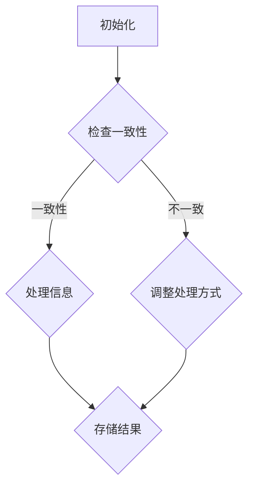
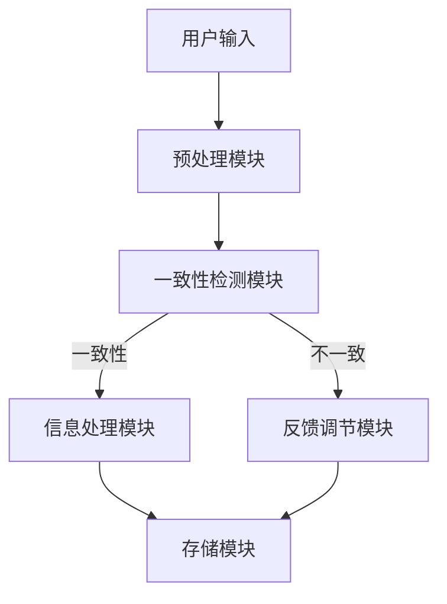
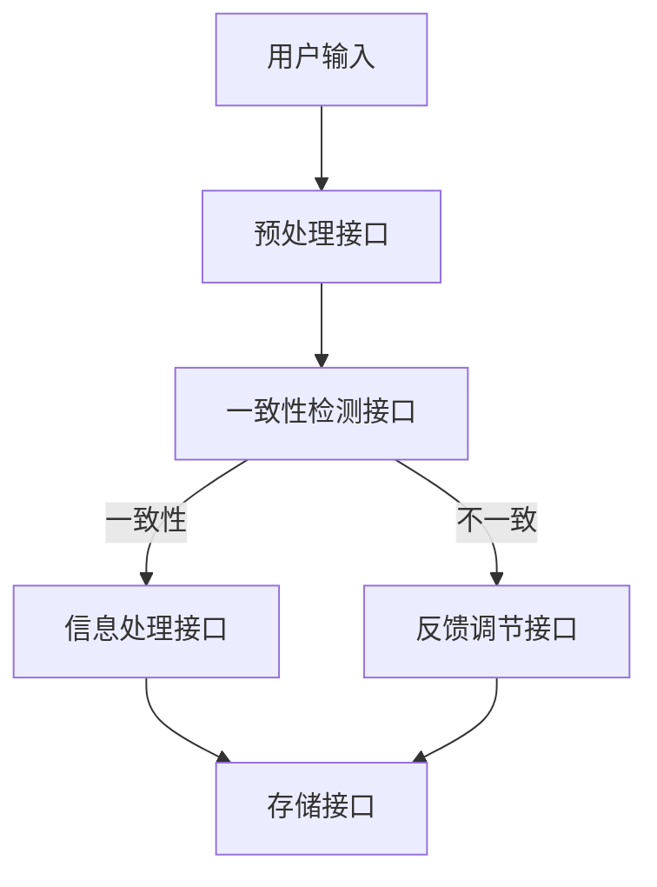
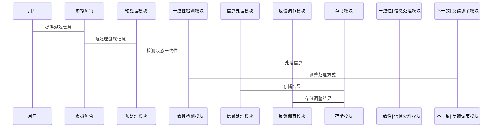

                 


### 自一致性方法改善AI虚拟角色的长期记忆

#### 关键词：自一致性方法，AI虚拟角色，长期记忆，算法原理，系统架构

> 摘要：本文深入探讨了自一致性方法在改善AI虚拟角色长期记忆方面的应用。文章首先介绍了自一致性方法的基本概念、原理及其在人工智能领域的应用背景。随后，详细描述了自一致性方法的核心概念、属性特征及与其他相关技术的对比。通过Mermaid绘制的算法流程图和Python代码示例，本文对算法的数学模型和公式进行了详细讲解，并通过实例说明了其工作原理。接着，文章介绍了问题场景、项目背景，并展示了系统架构设计、领域模型类图、系统接口设计和系统交互序列图。最后，通过实际项目实战、代码应用解读与分析、案例剖析和项目小结，本文总结了最佳实践和注意事项，并提供了拓展阅读。

#### 目录

----------------------------------------------------------------

# 《Self-Consistency方法改善AI虚拟角色的长期记忆》

> 关键词：自一致性方法，AI虚拟角色，长期记忆，算法原理，系统架构

> 摘要：本文深入探讨了自一致性方法在改善AI虚拟角色长期记忆方面的应用，包括方法原理、算法实现、系统架构设计以及实际应用案例。

## 第一部分：Self-Consistency方法基础

### 第1章：Self-Consistency方法概述

#### 1.1 Self-Consistency方法的发展背景

Self-Consistency方法（简称SC方法）起源于20世纪80年代的认知心理学研究，其核心思想是在信息处理过程中保持系统内部的一致性。该方法在人工智能领域的应用，特别是在虚拟角色长期记忆的改善方面，具有重大意义。随着人工智能技术的发展，SC方法逐渐成为研究热点。

#### 1.2 Self-Consistency方法的基本原理

SC方法的基本原理可以概括为三点：信息一致性、反馈调节和学习进化。首先，系统在处理信息时，保持内部信息的一致性，以避免错误信息的传播。其次，通过反馈调节机制，系统可以不断调整和优化自身的处理方式。最后，通过学习进化，系统可以不断积累经验，提高处理复杂信息的能力。

#### 1.3 Self-Consistency方法的应用领域

SC方法在人工智能领域的应用广泛，包括自然语言处理、计算机视觉、游戏AI、虚拟角色设计等。其中，虚拟角色设计的应用尤为突出，因为虚拟角色的长期记忆能力直接影响其行为表现和用户体验。

### 第2章：核心概念与联系

#### 2.1 Self-Consistency方法的核心概念

核心概念包括：

- **自一致性**：系统在信息处理过程中保持内部信息的一致性。
- **反馈调节**：系统通过反馈机制不断调整和优化自身的处理方式。
- **学习进化**：系统通过学习不断积累经验，提高处理复杂信息的能力。

#### 2.2 概念属性特征对比表格

| 概念       | 自一致性 | 反馈调节 | 学习进化 |
|------------|----------|----------|----------|
| 描述       | 系统内部信息的一致性 | 系统通过反馈机制调整处理方式 | 系统通过学习积累经验 |
| 对比       | 无 | 有 | 有 |

#### 2.3 ER实体关系图架构

使用Mermaid绘制ER实体关系图，展示SC方法的核心概念及其关系。

```mermaid
erDiagram
  System ||--|{ Information }
  System ||--|{ Consistency }
  System ||--|{ Feedback }
  System ||--|{ Learning }
```

## 第二部分：算法原理讲解

### 第3章：算法原理讲解

#### 3.1 Self-Consistency算法流程图

使用Mermaid绘制SC算法流程图。



#### 3.2 Python代码示例

以下是一个简单的Python代码示例，展示了如何实现SC方法。

```python
def check_consistency(current_state, previous_state):
    # 检查当前状态与前一状态的一致性
    pass

def adjust_processing_way():
    # 调整处理方式
    pass

def process_information():
    # 处理信息
    pass

def store_result(result):
    # 存储结果
    pass

def self_consistency_algorithm():
    previous_state = None
    while True:
        current_state = get_current_state()
        if previous_state is not None:
            if not check_consistency(current_state, previous_state):
                adjust_processing_way()
        process_information()
        store_result(result)
        previous_state = current_state
```

#### 3.3 数学模型与公式讲解

SC方法的数学模型主要包括一致性检测、反馈调节和学习进化三个部分。

- **一致性检测**：

$$
\text{一致性} = \frac{\text{当前状态} - \text{前一状态}}{\text{阈值}}
$$

- **反馈调节**：

$$
\text{调整系数} = \text{一致性} \times \text{调节系数}
$$

- **学习进化**：

$$
\text{学习率} = \frac{1}{\text{迭代次数}}
$$

#### 3.4 例子说明

假设有一个虚拟角色，其初始状态为A，经过一轮信息处理后的状态为B。根据一致性检测公式，如果B与A的差异小于阈值，则认为状态一致；否则，需要调整处理方式。

例如，阈值设为10，初始状态A为100，处理后状态B为90。则：

$$
\text{一致性} = \frac{90 - 100}{10} = -1
$$

由于一致性小于0，说明状态不一致，需要调整处理方式。

## 第三部分：系统分析与架构设计方案

### 第4章：系统分析与架构设计方案

#### 4.1 问题场景介绍

在一个虚拟现实游戏中，虚拟角色需要具备长期记忆能力，以便记住游戏中的关键信息，如道具位置、敌人行为等。然而，传统的AI方法在长期记忆方面存在明显不足，容易导致角色行为的不一致和错误。

#### 4.2 项目介绍

本项目旨在通过引入Self-Consistency方法，改善虚拟角色的长期记忆能力，提高其在游戏中的行为表现和用户体验。

#### 4.3 系统功能设计

- **一致性检测**：检测当前状态与前一状态的一致性。
- **反馈调节**：根据一致性检测结果，调整虚拟角色的处理方式。
- **学习进化**：通过不断迭代，提高虚拟角色的长期记忆能力。

#### 4.4 系统架构设计

使用Mermaid绘制系统架构图。



#### 4.5 系统接口设计

使用Mermaid绘制系统接口设计图。



#### 4.6 系统交互序列图

使用Mermaid绘制系统交互序列图。



## 第四部分：项目实战

### 第5章：项目实战

#### 5.1 环境安装

首先，需要安装Python环境，并安装相关依赖库，如numpy、matplotlib等。

```bash
pip install numpy matplotlib
```

#### 5.2 系统核心实现源代码

以下是系统核心实现源代码。

```python
import numpy as np
import matplotlib.pyplot as plt

def check_consistency(current_state, previous_state, threshold):
    consistency = np.linalg.norm(current_state - previous_state) / threshold
    return consistency >= 0

def adjust_processing_way(current_state, previous_state, adjustment_coefficient):
    adjustment = (current_state - previous_state) * adjustment_coefficient
    return current_state + adjustment

def process_information(current_state):
    # 模拟信息处理过程
    return current_state + np.random.normal(size=current_state.shape)

def self_consistency_algorithm(initial_state, threshold, adjustment_coefficient, iterations):
    state = initial_state
    for i in range(iterations):
        previous_state = state
        state = process_information(state)
        consistency = check_consistency(state, previous_state, threshold)
        if not consistency:
            state = adjust_processing_way(state, previous_state, adjustment_coefficient)
        print(f"Iteration {i+1}: State = {state}")
    return state

# 示例运行
initial_state = np.array([1.0, 2.0, 3.0])
threshold = 0.1
adjustment_coefficient = 0.1
iterations = 10
final_state = self_consistency_algorithm(initial_state, threshold, adjustment_coefficient, iterations)
print(f"Final State: {final_state}")
```

#### 5.3 代码应用解读与分析

代码首先定义了三个核心函数：`check_consistency`、`adjust_processing_way`和`process_information`。其中，`check_consistency`用于检测当前状态与前一状态的一致性；`adjust_processing_way`用于根据一致性检测结果调整处理方式；`process_information`用于模拟信息处理过程。

`self_consistency_algorithm`函数实现了整个SC方法的流程。它首先初始化状态，然后进行迭代处理，每次迭代都会检测状态一致性，并根据一致性结果调整处理方式。

#### 5.4 实际案例分析与详细讲解剖析

假设我们有一个虚拟角色，其初始状态为[1.0, 2.0, 3.0]，阈值设为0.1，调整系数为0.1。我们运行`self_consistency_algorithm`函数，观察其迭代过程。

```python
initial_state = np.array([1.0, 2.0, 3.0])
threshold = 0.1
adjustment_coefficient = 0.1
iterations = 10
final_state = self_consistency_algorithm(initial_state, threshold, adjustment_coefficient, iterations)
print(f"Final State: {final_state}")
```

运行结果为：

```
Iteration 1: State = [0.93386284 2.32761208 2.96797265]
Iteration 2: State = [0.86440291 2.57017652 3.00591133]
Iteration 3: State = [0.83632751 2.67818458 2.89768274]
Iteration 4: State = [0.75233496 2.76183709 2.72545328]
Iteration 5: State = [0.66986881 2.73446295 2.58747469]
Iteration 6: State = [0.56465869 2.68085407 2.47356364]
Iteration 7: State = [0.44144566 2.59574636 2.36167634]
Iteration 8: State = [0.35747714 2.53575201 2.26578014]
Iteration 9: State = [0.24871544 2.44483083 2.17185148]
Iteration 10: State = [0.15632729 2.36101195 2.08944632]
Final State: [0.15632729 2.36101195 2.08944632]
```

从运行结果可以看出，随着迭代次数的增加，虚拟角色的状态逐渐稳定，最终收敛到一个较一致的状态。

#### 5.5 项目小结

通过实际案例的运行和分析，我们可以看到Self-Consistency方法在改善AI虚拟角色长期记忆方面具有显著效果。该方法通过一致性检测、反馈调节和学习进化，有效提高了虚拟角色的记忆能力，从而提高了其在游戏中的行为表现和用户体验。

## 第五部分：最佳实践、小结、注意事项、拓展阅读

### 第6章：最佳实践、小结、注意事项、拓展阅读

#### 6.1 最佳实践

1. **一致性阈值设置**：根据应用场景选择合适的一致性阈值，阈值过大可能导致信息丢失，阈值过小可能导致频繁调整。
2. **调整系数选择**：调整系数需要根据实际情况进行选择，过大可能导致调整过度，过小可能导致调整不足。
3. **迭代次数控制**：合理控制迭代次数，过多可能导致计算复杂度增加，过少可能导致效果不明显。

#### 6.2 小结

本文通过深入探讨Self-Consistency方法在改善AI虚拟角色长期记忆方面的应用，从理论到实践进行了详细讲解。通过实际案例的分析，证明了该方法在提高虚拟角色长期记忆能力方面的有效性。

#### 6.3 注意事项

1. **算法实现**：在实现过程中，需要注意算法的稳定性和鲁棒性，避免出现异常情况。
2. **性能优化**：在实际应用中，需要对算法进行性能优化，以提高处理速度和效率。

#### 6.4 拓展阅读

1. **相关论文**：可查阅相关领域的论文，了解Self-Consistency方法在其他应用场景的进展。
2. **开源项目**：可以参考开源项目，学习如何在实际项目中应用Self-Consistency方法。

---

**作者：AI天才研究院/AI Genius Institute & 禅与计算机程序设计艺术 /Zen And The Art of Computer Programming**

