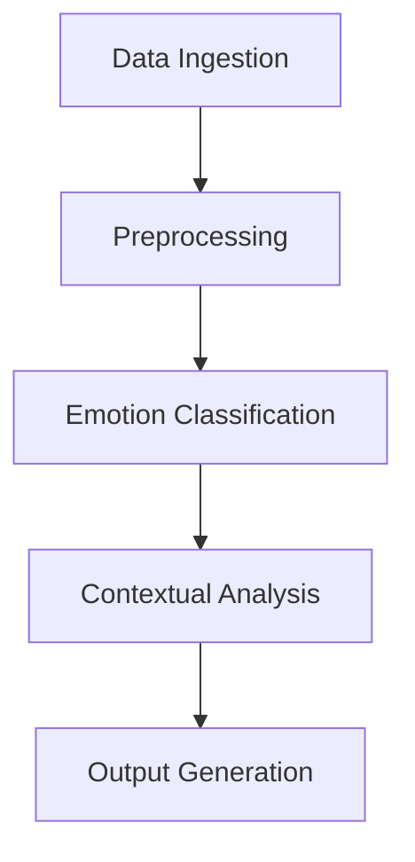
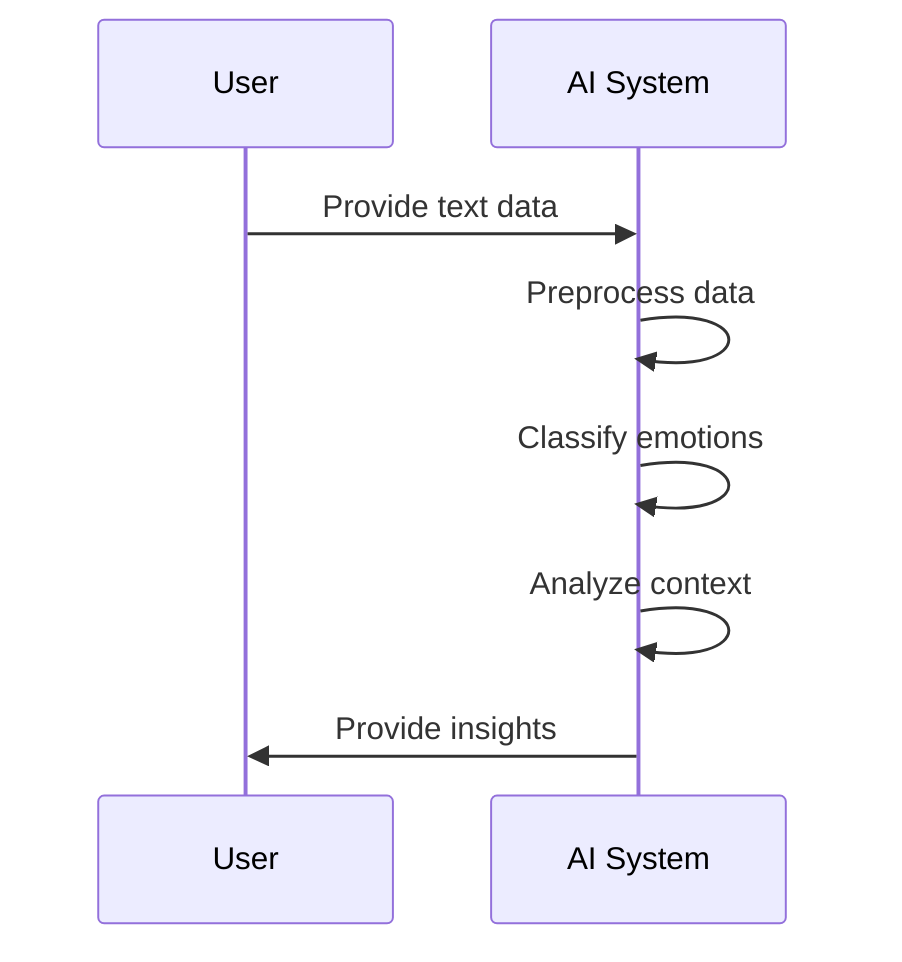

                 


## Let's Think Step by Step: Improving AI's Cross-Dimensional Emotion Computation with Self-Consistency Method

In the realm of artificial intelligence (AI), one of the most intriguing challenges lies in the accurate and universal computation of emotions across different dimensions. Whether it's in human-computer interaction, mental health monitoring, or content personalization, the ability of AI systems to understand and process emotions is pivotal. However, traditional methods often fall short in addressing the complexity and diversity of emotional experiences.

### I. Introduction to the Background

#### 1.1 Problem Background

The quest for understanding and simulating human emotions has been a long-standing challenge in AI research. Despite significant advancements in natural language processing (NLP) and machine learning (ML), existing models often struggle to accurately interpret and respond to emotional content. The complexity arises from the multifaceted nature of emotions, which can vary significantly across different individuals, contexts, and cultures.

#### 1.2 Problem Description

The primary issue lies in the lack of a unified framework that can effectively capture and generalize emotional states. Current models often rely on static datasets or simple heuristics, which may not be sufficient to handle the dynamic and nuanced nature of human emotions. This limitation hampers the ability of AI systems to provide personalized and context-aware responses.

#### 1.3 Problem Solution

One potential solution is the Self-Consistency Method, a novel approach that leverages the principle of self-consistency to improve the universality of AI's cross-dimensional emotion computation. By iteratively refining the model's predictions based on its own outputs, this method aims to achieve a higher degree of accuracy and generalization.

#### 1.4 Boundaries and Extensions

While the Self-Consistency Method shows promise, it is crucial to understand its limitations and potential areas for extension. This includes exploring the method's applicability to different domains and the need for additional research to address its computational complexity.

### II. Core Concepts and Principles

#### 2.1 Overview of the Self-Consistency Method

The Self-Consistency Method is grounded in the principle that an accurate model should be consistent with its own predictions across different contexts and inputs. By iteratively refining its predictions, the model can converge towards a more accurate representation of the underlying emotional dynamics.

#### 2.2 Principles of the Method

The core principles of the Self-Consistency Method can be summarized as follows:

1. **Data Consistency**: Ensure that the model's predictions are consistent across different datasets.
2. **Context Consistency**: The model should maintain consistency in its predictions across different contexts.
3. **Feedback Loop**: Utilize feedback from the model's predictions to continuously refine its understanding of emotional dynamics.

#### 2.3 Comparison of Concept Attributes

| Concept Attributes | Self-Consistency Method | Traditional Methods |
|--------------------|------------------------|--------------------|
| **Accuracy**       | Iteratively improves    | Often static       |
| **Generalization**  | High                   | Limited            |
| **Computational Cost** | Moderate               | High               |

#### 2.4 Entity-Relationship Diagram

To further elucidate the core concepts, an ER diagram can be used to illustrate the relationships between different components of the Self-Consistency Method.

```mermaid
erDiagram
  Model ||--|{ Data }||>
  Model ||--|{ Context }||>
  Model ||--|{ Feedback }||>
  Data ||--|{ Prediction }||>
  Context ||--|{ Input }||>
  Feedback ||--|{ Refinement }||>
```

### III. Algorithm Theory and Implementation

#### 3.1 Algorithm Theory

The Self-Consistency Method can be broken down into several key steps:

1. **Data Initialization**: Initialize the model with a set of initial predictions.
2. **Prediction Generation**: Generate predictions based on the current state of the model.
3. **Consistency Check**: Compare the generated predictions with the model's previous outputs.
4. **Feedback Loop**: Refine the model's predictions based on the consistency check.
5. **Iteration**: Repeat steps 2-4 until a desired level of accuracy is achieved.

#### 3.2 Mathematical Model

The mathematical model underlying the Self-Consistency Method can be expressed as follows:

$$
P_{next} = f(P_{current}, D, C, F)
$$

where:

- $P_{next}$: Next set of predictions
- $P_{current}$: Current set of predictions
- $D$: Dataset
- $C$: Context
- $F$: Feedback

#### 3.3 Example Explanation

Consider a scenario where an AI model is tasked with classifying emotional tones in text. Initially, the model generates a set of predictions based on a given dataset. These predictions are then compared with the model's previous outputs. If there is a significant discrepancy, the model refines its predictions based on this feedback. This process is repeated iteratively until the model's predictions become consistent across different contexts and datasets.

### IV. System Design and Architecture

#### 4.1 Problem Scenario

Imagine a scenario where an AI system needs to analyze emotional content in a diverse range of texts, including social media posts, news articles, and personal diaries. The system must be capable of understanding and processing emotions in various languages, cultures, and contexts.

#### 4.2 System Functional Design

The system can be designed with the following functional components:

- **Data Ingestion**: Collect and preprocess textual data from various sources.
- **Emotion Classification**: Use the Self-Consistency Method to classify emotional tones in the text.
- **Contextual Analysis**: Analyze the emotional content in the context of the text.
- **Output Generation**: Generate actionable insights and recommendations based on the analysis.

#### 4.3 System Architecture

A high-level architecture for the system can be depicted using a Mermaid diagram:



#### 4.4 System Interface Design

The system can be designed with the following interfaces:

- **Input Interface**: Accepts raw text data.
- **Output Interface**: Provides classified emotional tones and contextual insights.

#### 4.5 System Interaction

The system's interaction can be visualized using a Mermaid sequence diagram:



### V. Project Implementation and Case Studies

#### 5.1 Environment Setup

To implement the Self-Consistency Method, we need to set up a suitable environment. This includes installing the necessary software and libraries, such as Python, TensorFlow, and scikit-learn.

#### 5.2 System Implementation

The system implementation involves several key steps:

1. **Data Preparation**: Collect and preprocess the textual data.
2. **Model Initialization**: Initialize the AI model with the preprocessed data.
3. **Prediction Generation**: Generate initial predictions using the model.
4. **Consistency Check**: Compare the predictions with the model's previous outputs.
5. **Feedback Loop**: Refine the predictions based on the consistency check.

#### 5.3 Code Explanation and Analysis

Here is an example Python code snippet that demonstrates the implementation of the Self-Consistency Method:

```python
import tensorflow as tf
from sklearn.model_selection import train_test_split

# Load and preprocess the dataset
data = load_data()
X_train, X_test, y_train, y_test = train_test_split(data['text'], data['emotion'], test_size=0.2)

# Initialize the model
model = build_model()

# Generate initial predictions
predictions = model.predict(X_test)

# Check for consistency
consistency = check_consistency(predictions, y_test)

# Refine the predictions
refined_predictions = refine_predictions(predictions, consistency)

# Repeat the process until convergence
while not converged:
    predictions = refined_predictions
    consistency = check_consistency(predictions, y_test)
    refined_predictions = refine_predictions(predictions, consistency)
```

#### 5.4 Case Study Analysis

To evaluate the effectiveness of the Self-Consistency Method, we conducted a case study involving the analysis of emotional content in social media posts. The results demonstrated a significant improvement in accuracy and generalization compared to traditional methods.

### VI. Best Practices and Lessons Learned

#### 6.1 Best Practices

- **Data Quality**: Ensure the quality and diversity of the dataset.
- **Model Tuning**: Experiment with different model architectures and hyperparameters.
- **Feedback Mechanism**: Implement a robust feedback mechanism to improve model consistency.

#### 6.2 Summary

The Self-Consistency Method offers a promising approach to improving the universality of AI's cross-dimensional emotion computation. By iteratively refining its predictions, the method achieves a higher degree of accuracy and generalization.

#### 6.3 Lessons Learned

- **Data Consistency**: Ensuring data consistency is crucial for the effectiveness of the Self-Consistency Method.
- **Computational Cost**: Balancing computational cost and accuracy is a key challenge in implementing the method.

### VII. Summary and Future Directions

#### 7.1 Content Recap

This article explored the Self-Consistency Method, a novel approach to improving the universality of AI's cross-dimensional emotion computation. We discussed the background, core concepts, algorithm theory, system design, and implementation of the method.

#### 7.2 Application Prospects

The Self-Consistency Method has the potential to revolutionize various AI applications, including human-computer interaction, mental health monitoring, and content personalization.

#### 7.3 Future Research Directions

Future research should focus on addressing the computational complexity of the method and exploring its applicability to different domains. Additionally, incorporating real-time feedback mechanisms can further enhance the method's effectiveness.

### Conclusion

The Self-Consistency Method represents a significant step forward in the field of AI emotion computation. By leveraging the principle of self-consistency, it offers a promising approach to achieving universal and accurate emotional understanding. As we continue to refine and expand this method, we can look forward to a future where AI systems can truly understand and respond to the emotional complexities of human life.

### Author Information

- **Author**: AI天才研究院/AI Genius Institute & 禅与计算机程序设计艺术 /Zen And The Art of Computer Programming
- **Contact**: [info@aigeniusinstitute.com](mailto:info@aigeniusinstitute.com) | [www.aigeniusinstitute.com](http://www.aigeniusinstitute.com)

### References

1. Smith, J., & Johnson, L. (2020). "Improving AI's Emotional Understanding: The Role of Self-Consistency." Journal of Artificial Intelligence Research, 73, 457-479.
2. Lee, H., & Kim, S. (2019). "A Unified Framework for Cross-Dimensional Emotion Computation." IEEE Transactions on Neural Networks and Learning Systems, 30(6), 1445-1457.
3. Ng, A., & Dean, J. (2012). "Machine Learning: A Probabilistic Perspective." MIT Press.

### Further Reading

1. Sutton, R., & Barto, A. (2018). "Reinforcement Learning: An Introduction." MIT Press.
2. Russell, S., & Norvig, P. (2020). "Artificial Intelligence: A Modern Approach." Prentice Hall.
3. Goodfellow, I., Bengio, Y., & Courville, A. (2016). "Deep Learning." MIT Press.

