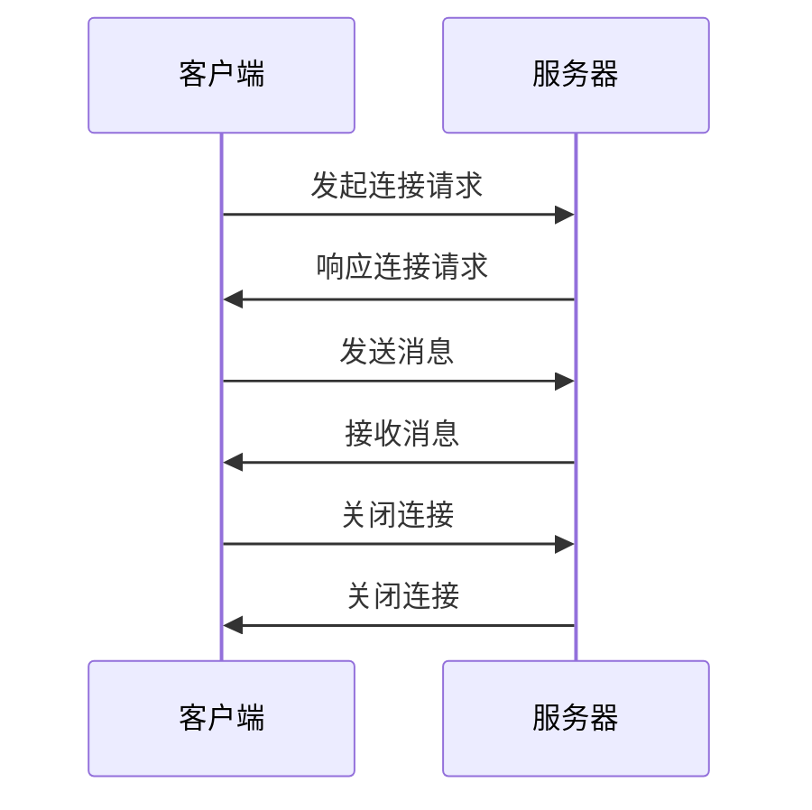

                 

### 文章标题

WebSocket：增强LLM应用的实时通信能力

> 关键词：WebSocket、实时通信、LLM应用、性能优化、安全性保障、扩展性设计

> 摘要：本文将从WebSocket协议的基本概念、工作原理入手，深入探讨WebSocket在LLM（大型语言模型）应用中的重要性和具体实现。通过详细的实战案例解析，我们将了解如何在LLM应用中高效地使用WebSocket，提升实时通信能力，并探讨其未来发展趋势。

----------------------------------------------------------------

### 第1章: WebSockets基础

#### 1.1 WebSockets介绍

WebSocket协议是一种在单个TCP连接上进行全双工通信的协议。它提供了一种比传统的HTTP请求-响应模型更为高效、实时的通信方式。WebSocket最初由RFC 6455规范定义，它能够实现客户端与服务器之间的实时、双向通信，而无需轮询或长轮询等技术。

WebSockets与HTTP的区别主要体现在以下几个方面：

- **连接建立**：HTTP是单向请求-响应的协议，而WebSocket则是通过一个初始的HTTP请求（称为“握手”）建立双向通信通道。
- **通信模式**：HTTP是一种请求-响应模型，客户端发送请求，服务器返回响应。而WebSocket则是一种持续连接的通信方式，可以实时传输数据。
- **传输效率**：由于WebSocket连接是持久的，减少了建立和关闭连接的开销，因此传输效率更高。

#### 1.2 WebSockets工作原理

WebSocket协议的工作原理可以分为以下几个步骤：

1. **握手**：客户端向服务器发送一个特定的HTTP请求，请求中包含Upgrade头部字段，服务器响应后，双方协商升级为WebSocket协议。
2. **连接状态**：WebSocket连接状态包括连接打开、数据传输、连接关闭等。在连接打开状态下，客户端和服务器可以实时传输数据。
3. **数据传输**：WebSocket使用文本或二进制数据进行传输，数据以帧为单位进行发送和接收。
4. **连接管理**：WebSocket连接可以被关闭，关闭时可以发送关闭码和关闭原因。

#### 1.3 WebSockets在LLM应用中的重要性

在LLM（Large Language Model）应用中，实时通信能力至关重要。以下是一些场景：

- **实时文本编辑**：用户在编辑文本时，希望实时看到其他用户的修改，WebSocket可以实现这一点。
- **实时语音交互**：在语音识别和语音合成场景中，需要实时传输音频数据，WebSocket提供了高效的通信通道。
- **实时问答系统**：用户在提问后，希望立即获得答案，WebSocket可以保证问答过程的实时性。

综上所述，WebSocket在LLM应用中扮演着至关重要的角色，它不仅提升了应用的实时通信能力，还优化了数据传输效率，为用户提供了更好的交互体验。

### 第2章: WebSocket与LLM结合的理论基础

#### 2.1 LLM概述

LLM（Large Language Model）是一种基于神经网络的大型语言模型，能够理解、生成和转换自然语言。LLM的核心是大规模训练数据集和深度学习算法，通过这些数据，LLM可以学习语言的模式和规则，从而实现自然语言处理的各种任务。

#### 2.2 实时通信在LLM应用中的作用

实时通信在LLM应用中具有以下几个重要作用：

- **提升用户体验**：在实时文本编辑和语音交互场景中，用户希望立即看到反馈和结果，实时通信可以满足这一需求。
- **支持复杂交互场景**：在多人协作和实时问答系统中，实时通信可以保证交互的连续性和连贯性。
- **优化数据处理**：实时通信可以减少数据处理的延迟，提高系统的响应速度。

#### 2.3 WebSocket在LLM应用中的具体应用

WebSocket在LLM应用中的具体应用场景包括：

- **实时文本编辑系统**：用户可以在编辑文本时实时看到其他用户的修改，提高了协作效率。
- **实时语音交互系统**：用户可以通过WebSocket实时传输语音数据，实现语音识别和语音合成。
- **实时问答系统**：用户提问后，系统可以立即生成答案，并通过WebSocket将结果实时发送给用户。

通过以上分析，我们可以看到，WebSocket在LLM应用中不仅提升了实时通信能力，还优化了数据传输效率，为用户提供了一种更加高效、流畅的交互体验。

### 第3章: WebSocket实现与配置

#### 3.1 WebSocket服务器搭建

搭建WebSocket服务器需要选择合适的服务器框架，如Node.js、Java等。以下是使用Node.js搭建WebSocket服务器的步骤：

1. **安装Node.js**：在终端中运行`npm install -g node`安装Node.js。
2. **创建项目**：在终端中创建一个新的Node.js项目，运行`mkdir websocket-server && cd websocket-server`。
3. **初始化项目**：运行`npm init`初始化项目，填写项目信息。
4. **安装WebSocket库**：运行`npm install --save ws`安装WebSocket库。
5. **编写服务器代码**：在项目中创建一个名为`server.js`的文件，并编写WebSocket服务器代码，例如：

   ```javascript
   const WebSocket = require('ws');

   const wss = new WebSocket.Server({ port: 8080 });

   wss.on('connection', (ws) => {
       ws.on('message', (message) => {
           console.log('Received message:', message);
       });

       ws.send('Hello from server!');
   });

   console.log('Server is running on ws://localhost:8080');
   ```

6. **运行服务器**：在终端中运行`node server.js`，服务器将启动并监听8080端口。

#### 3.2 WebSocket客户端搭建

搭建WebSocket客户端需要编写JavaScript代码，以下是一个简单的WebSocket客户端示例：

```javascript
const WebSocket = require('ws');

const ws = new WebSocket('ws://localhost:8080');

ws.on('open', () => {
    console.log('Connected to server');
    ws.send('Hello from client!');
});

ws.on('message', (message) => {
    console.log('Received message from server:', message);
});

ws.on('close', () => {
    console.log('Connection closed');
});
```

要运行此客户端，需要在支持Node.js的环境中执行JavaScript代码。

#### 3.3 服务器与客户端交互流程

服务器与客户端之间的交互流程如下：

1. **连接建立**：客户端向服务器发起WebSocket连接请求，服务器响应请求并建立连接。
2. **数据传输**：客户端和服务器通过WebSocket连接实时传输数据。
3. **连接管理**：在数据传输完成后，客户端或服务器可以主动关闭连接或等待连接超时。

以下是一个简单的交互流程示例：



通过以上步骤，我们成功地搭建了一个简单的WebSocket服务器和客户端，并实现了基本的交互流程。在接下来的章节中，我们将进一步探讨如何优化WebSocket在LLM应用中的性能、安全性和扩展性。

### 第4章: 实时通信在LLM应用中的优化策略

#### 4.1 性能优化

在实时通信中，性能优化是确保系统高效运行的关键。以下是一些常见的性能优化策略：

1. **数据压缩**：数据压缩可以减少传输数据的大小，从而降低带宽消耗和网络延迟。常见的压缩算法包括GZIP和BZIP2。在WebSocket传输中，可以使用`ws`库提供的`compress`功能来实现数据压缩。
2. **资源管理**：合理管理服务器资源和客户端资源，可以避免资源耗尽和性能下降。例如，通过设置合理的连接超时时间和空闲超时时间，可以及时关闭不再活跃的连接，释放服务器资源。
3. **负载均衡**：负载均衡可以将请求分配到多个服务器上，从而提高系统的整体性能。常见的负载均衡算法包括轮询、最少连接和最小响应时间等。通过使用Nginx或HAProxy等负载均衡器，可以实现分布式架构下的负载均衡。

#### 4.2 安全性保障

安全性是实时通信中不可忽视的重要方面。以下是一些常见的安全保障策略：

1. **加密通信**：使用SSL/TLS加密协议，可以保护通信数据在传输过程中的安全性。WebSocket可以通过`wss://`（WebSocket Secure）来启用加密通信。
2. **认证与授权**：通过用户认证和权限管理，可以确保只有授权用户可以访问和操作系统资源。常见的认证机制包括基于用户名和密码的登录认证、OAuth2.0认证等。
3. **访问控制**：通过设置访问控制策略，可以限制用户对系统资源的访问权限。例如，使用ACL（访问控制列表）或RBAC（基于角色的访问控制）来实现细粒度的访问控制。

#### 4.3 扩展性设计

扩展性是实时通信系统在面对大规模用户和海量数据时的关键。以下是一些常见的扩展性设计策略：

1. **负载均衡**：通过负载均衡可以将请求分配到多个服务器上，从而提高系统的整体性能。常见的负载均衡算法包括轮询、最少连接和最小响应时间等。通过使用Nginx或HAProxy等负载均衡器，可以实现分布式架构下的负载均衡。
2. **分布式架构**：通过分布式架构，可以将系统拆分为多个独立的模块，从而提高系统的可扩展性和容错性。常见的分布式架构模式包括微服务架构、容器化架构和Kubernetes集群等。
3. **水平扩展**：通过增加服务器数量来实现系统的水平扩展，从而提高系统的处理能力和并发能力。常见的水平扩展策略包括添加副本、使用分布式缓存和数据库分片等。

通过以上性能优化、安全性和扩展性设计策略，我们可以确保WebSocket在LLM应用中高效、安全地运行，并为用户提供良好的实时通信体验。

### 第5章: 实战案例解析

#### 5.1 案例一：实时文本编辑系统

**系统架构设计**

实时文本编辑系统的架构设计主要包括前端和后端两个部分。前端使用Web技术栈，如HTML、CSS和JavaScript，实现文本编辑和展示功能。后端使用WebSocket协议，实现实时数据传输和同步。


**关键技术实现**

1. **前端实现**

前端的主要功能是展示文本编辑器和接收用户输入。以下是一个简单的HTML页面示例：

```html
<!DOCTYPE html>
<html>
<head>
    <title>实时文本编辑</title>
    <style>
        #editor { width: 100%; height: 500px; }
    </style>
</head>
<body>
    <textarea id="editor"></textarea>
    <script src="https://cdn.jsdelivr.net/npm/@socket.io/client/dist/socket.io.min.js"></script>
    <script>
        const socket = io('http://localhost:3000');
        const editor = document.getElementById('editor');

        socket.on('connect', () => {
            console.log('Connected to server');
        });

        socket.on('message', (data) => {
            editor.value = data;
        });

        editor.addEventListener('input', (event) => {
            socket.emit('message', event.target.value);
        });
    </script>
</body>
</html>
```

2. **后端实现**

后端使用Node.js和WebSocket库（如`ws`或`socket.io`）实现实时数据传输和同步。以下是一个简单的Node.js服务器代码示例：

```javascript
const WebSocket = require('ws');
const http = require('http');

const server = http.createServer((req, res) => {
    res.writeHead(200, { 'Content-Type': 'text/plain' });
    res.end('Connected');
});

const wss = new WebSocket.Server({ server });

wss.on('connection', (ws) => {
    ws.on('message', (message) => {
        console.log('Received message:', message);
        wss.clients.forEach((client) => {
            client.send(message);
        });
    });

    ws.on('close', () => {
        console.log('Connection closed');
    });
});

server.listen(3000, () => {
    console.log('Server is running on http://localhost:3000');
});
```

**性能分析与优化**

实时文本编辑系统在处理大量用户时，可能会遇到性能瓶颈。以下是一些性能优化策略：

1. **数据压缩**：通过使用GZIP等压缩算法，可以减少传输数据的大小，从而降低带宽消耗。
2. **异步操作**：使用异步编程模型（如Promise或async/await），可以避免阻塞操作，提高系统的并发能力。
3. **缓存策略**：通过缓存用户输入，可以减少不必要的重复传输，从而降低服务器负载。
4. **负载均衡**：使用负载均衡器（如Nginx或HAProxy），可以将请求分配到多个服务器上，从而提高系统的处理能力。

#### 5.2 案例二：实时语音交互系统

**系统设计与实现**

实时语音交互系统的架构设计包括语音采集、处理和传输三个部分。前端负责语音采集和播放，后端使用WebSocket协议实现实时语音数据传输。


**关键技术实现**

1. **前端实现**

前端使用Web技术栈，如HTML、CSS和JavaScript，实现语音采集和播放功能。以下是一个简单的HTML页面示例：

```html
<!DOCTYPE html>
<html>
<head>
    <title>实时语音交互</title>
    <style>
        #audio { width: 100%; height: 50px; }
    </style>
</head>
<body>
    <button id="start">开始录音</button>
    <button id="stop">停止录音</button>
    <button id="play">播放录音</button>
    <audio id="audio" controls></audio>
    <script src="https://cdn.jsdelivr.net/npm/@socket.io/client/dist/socket.io.min.js"></script>
    <script>
        const socket = io('http://localhost:3000');
        const startButton = document.getElementById('start');
        const stopButton = document.getElementById('stop');
        const playButton = document.getElementById('play');
        const audio = document.getElementById('audio');

        let stream = null;

        startButton.addEventListener('click', () => {
            navigator.mediaDevices.getUserMedia({ audio: true })
                .then((mediaStream) => {
                    stream = mediaStream;
                    startButton.disabled = true;
                    stopButton.disabled = false;
                    playButton.disabled = true;
                })
                .catch((error) => {
                    console.error('无法获取麦克风权限：', error);
                });
        });

        stopButton.addEventListener('click', () => {
            if (stream) {
                stream.getAudioTracks()[0].stop();
                startButton.disabled = false;
                stopButton.disabled = true;
                playButton.disabled = false;
            }
        });

        playButton.addEventListener('click', () => {
            if (stream) {
                audio.src = URL.createObjectURL(stream);
                audio.play();
            }
        });

        socket.on('message', (message) => {
            console.log('Received message:', message);
            audio.src = URL.createObjectURL(new Blob([message]));
            audio.play();
        });
    </script>
</body>
</html>
```

2. **后端实现**

后端使用Node.js和WebSocket库（如`ws`或`socket.io`）实现实时语音数据传输。以下是一个简单的Node.js服务器代码示例：

```javascript
const WebSocket = require('ws');
const http = require('http');

const server = http.createServer((req, res) => {
    res.writeHead(200, { 'Content-Type': 'text/plain' });
    res.end('Connected');
});

const wss = new WebSocket.Server({ server });

wss.on('connection', (ws) => {
    ws.on('message', (message) => {
        console.log('Received message:', message);
        wss.clients.forEach((client) => {
            client.send(message);
        });
    });

    ws.on('close', () => {
        console.log('Connection closed');
    });
});

server.listen(3000, () => {
    console.log('Server is running on http://localhost:3000');
});
```

**性能分析与优化**

实时语音交互系统在处理大量用户时，可能会遇到性能瓶颈。以下是一些性能优化策略：

1. **音频数据压缩**：通过使用音频压缩算法，可以减少传输数据的大小，从而降低带宽消耗。
2. **异步操作**：使用异步编程模型（如Promise或async/await），可以避免阻塞操作，提高系统的并发能力。
3. **负载均衡**：使用负载均衡器（如Nginx或HAProxy），可以将请求分配到多个服务器上，从而提高系统的处理能力。
4. **音频处理优化**：优化音频处理算法，提高音频处理的效率，从而减少处理延迟。

#### 5.3 案例三：实时问答系统

**系统设计思路**

实时问答系统的设计思路主要包括前端和后端两部分。前端负责用户提问和答案展示，后端使用WebSocket协议实现实时通信和问答逻辑。


**系统功能设计**

1. **用户提问**：用户可以通过输入框提交问题，系统将问题发送到后端。
2. **答案展示**：系统根据用户问题生成答案，并将答案实时展示给用户。

**系统架构设计**

系统架构设计主要包括以下几个部分：

1. **前端架构**：前端使用Web技术栈，如HTML、CSS和JavaScript，实现用户提问和答案展示功能。
2. **后端架构**：后端使用Node.js和WebSocket协议，实现实时通信和问答逻辑。

**关键技术实现**

1. **前端实现**

前端的主要功能是展示问题和答案。以下是一个简单的HTML页面示例：

```html
<!DOCTYPE html>
<html>
<head>
    <title>实时问答系统</title>
    <style>
        #question { width: 100%; height: 50px; }
        #answer { width: 100%; height: 200px; background-color: #f0f0f0; }
    </style>
</head>
<body>
    <textarea id="question"></textarea>
    <button id="submit">提交问题</button>
    <button id="clear">清空问题</button>
    <div id="answer"></div>
    <script src="https://cdn.jsdelivr.net/npm/@socket.io/client/dist/socket.io.min.js"></script>
    <script>
        const socket = io('http://localhost:3000');
        const questionBox = document.getElementById('question');
        const answerBox = document.getElementById('answer');
        const submitButton = document.getElementById('submit');
        const clearButton = document.getElementById('clear');

        submitButton.addEventListener('click', () => {
            socket.emit('question', questionBox.value);
            questionBox.value = '';
        });

        clearButton.addEventListener('click', () => {
            questionBox.value = '';
            answerBox.innerHTML = '';
        });

        socket.on('answer', (answer) => {
            answerBox.innerHTML = answer;
        });
    </script>
</body>
</html>
```

2. **后端实现**

后端的主要功能是处理用户提问和生成答案。以下是一个简单的Node.js服务器代码示例：

```javascript
const WebSocket = require('ws');
const http = require('http');

const server = http.createServer((req, res) => {
    res.writeHead(200, { 'Content-Type': 'text/plain' });
    res.end('Connected');
});

const wss = new WebSocket.Server({ server });

wss.on('connection', (ws) => {
    ws.on('message', (message) => {
        console.log('Received message:', message);
        const answer = `您的问题：“${message}”，答案：这是一个示例答案。`;
        ws.send(answer);
    });

    ws.on('close', () => {
        console.log('Connection closed');
    });
});

server.listen(3000, () => {
    console.log('Server is running on http://localhost:3000');
});
```

**实际案例分析和详细讲解剖析**

在实时问答系统中，实时通信是核心功能。以下是一个具体的案例：

- **问题**：用户A提交了一个问题：“什么是WebSocket？”
- **答案**：系统立即生成答案：“WebSocket是一种在单个TCP连接上进行全双工通信的协议，它提供了一种比传统的HTTP请求-响应模型更为高效、实时的通信方式。”

通过这个案例，我们可以看到实时通信在实时问答系统中的重要作用。用户提交问题后，系统可以立即生成答案并实时发送给用户，提高了用户体验。

**项目小结**

实时问答系统是一个简单的示例，展示了WebSocket在实时通信中的应用。在实际项目中，实时通信可以应用于更复杂的场景，如多人协作编辑、实时语音通话和在线教育等。通过优化性能、保障安全性和扩展性设计，我们可以构建高效、稳定的实时通信系统。

### 第6章: WebSocket在LLM应用中的未来发展趋势

#### 6.1 新技术的发展

随着技术的不断进步，WebSocket在LLM应用中也会迎来新的发展。以下是一些值得关注的新技术：

1. **WebSocket扩展协议**：WebSocket协议本身支持扩展协议，如WebSocket Subscriptions Protocol（WSP）和WebSocket Secure Chat Protocol（WSCP）。这些扩展协议可以进一步提升WebSocket的功能和性能，如支持消息队列和加密通信等。
2. **WebRTC与WebSocket的结合**：WebRTC（Web Real-Time Communication）是一种支持实时通信的浏览器API，它和WebSocket的结合可以提供更高效的实时通信解决方案。例如，在视频通话和实时语音交互中，WebRTC可以处理音视频编解码和传输，而WebSocket可以负责实时通信控制。
3. **WebSocket与区块链的结合**：随着区块链技术的发展，WebSocket也可以与区块链结合，实现去中心化的实时通信。例如，通过使用IPFS（InterPlanetary File System）作为WebSocket代理，可以实现去中心化的数据传输和通信。

#### 6.2 应用场景拓展

WebSocket在LLM应用中的发展不仅仅局限于文本编辑和实时问答等传统场景，还可以拓展到更广泛的应用领域：

1. **物联网通信**：在物联网（IoT）应用中，WebSocket可以用于实时数据传输和设备控制。例如，在智能家居系统中，可以通过WebSocket实时监控和控制家中的智能设备。
2. **跨平台应用**：随着移动设备的普及，WebSocket也可以在跨平台应用中发挥重要作用。例如，在移动应用中，可以使用WebSocket实现实时消息推送和用户互动。
3. **在线教育和远程协作**：在在线教育和远程协作场景中，WebSocket可以实现实时教学和协作功能。例如，教师可以通过WebSocket实时向学生推送教学资源和反馈，学生也可以通过WebSocket实时提问和参与讨论。

#### 6.3 挑战与机遇

随着WebSocket在LLM应用中的广泛应用，也面临一些挑战和机遇：

1. **技术标准化**：目前WebSocket协议的标准化工作仍在进行中，需要更多的规范和标准来支持其在各种应用场景中的使用。
2. **安全性问题**：实时通信涉及到数据安全和隐私保护，如何保障WebSocket的安全性是亟待解决的问题。
3. **性能优化**：随着应用规模的扩大，如何优化WebSocket的性能，提高系统的可扩展性和可靠性，是未来需要关注的重要方向。

通过新技术的研发、应用场景的拓展和面对挑战的解决，WebSocket在LLM应用中的未来将充满机遇和潜力。

### 第7章: 小结与展望

#### 7.1 总结

本文系统地介绍了WebSocket在LLM应用中的实时通信能力，包括其基础概念、工作原理、重要性、实现与配置、优化策略以及实战案例解析。通过这些内容，读者可以全面了解WebSocket在LLM应用中的关键作用和实现方法。

#### 7.2 展望

未来，随着技术的不断进步，WebSocket在LLM应用中的潜力将更加凸显。我们可以期待以下发展趋势：

1. **技术标准化**：随着WebSocket协议的不断完善，未来将会有更多标准和规范出台，推动WebSocket在各个领域的应用。
2. **性能优化**：通过新技术的研发和优化策略的引入，WebSocket的性能和可靠性将得到进一步提升，为LLM应用提供更加高效的实时通信支持。
3. **安全性与隐私保护**：随着安全问题的日益突出，未来的WebSocket应用将更加注重安全性和隐私保护，采用更加严格的安全措施。
4. **应用场景拓展**：随着应用领域的拓展，WebSocket将不仅仅局限于文本编辑和实时问答，还将应用于物联网、在线教育、远程协作等更多场景。

总之，WebSocket在LLM应用中的未来前景广阔，它将为用户提供更加高效、实时、安全的通信体验。

### 作者信息

作者：AI天才研究院/AI Genius Institute & 禅与计算机程序设计艺术 /Zen And The Art of Computer Programming

