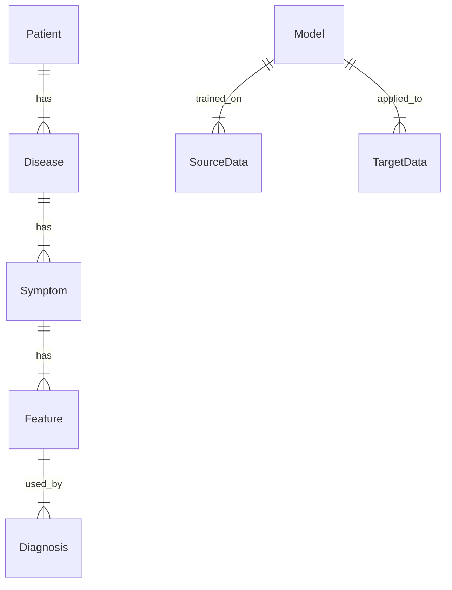
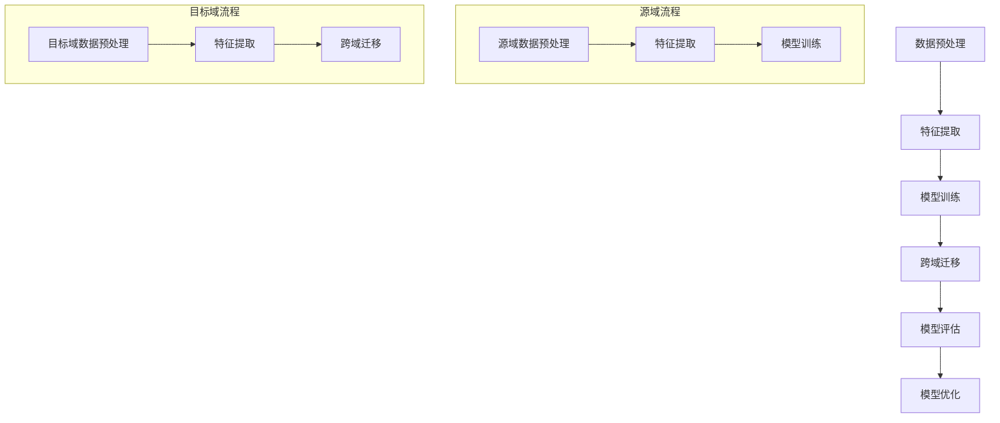

                 

### 1.0 引言

#### 1.0.1 书籍主题与背景

在当今人工智能飞速发展的时代，AI技术的应用已经渗透到各行各业，从医疗诊断到自动驾驶，从自然语言处理到图像识别，AI正在不断改变我们的生活方式。然而，在这场科技革命的浪潮中，一个特殊而重要的领域——罕见疾病诊断，却面临着前所未有的挑战。罕见疾病，由于发病率低，数据稀缺，常常使得诊断和治疗变得异常困难。然而，AI技术的出现，特别是Zero-Shot CoT（零样本跨域迁移学习技术）的应用，为罕见疾病的诊断带来了新的曙光。

本书旨在深入探讨Zero-Shot CoT在AI辅助诊断罕见疾病中的应用。我们将从基础理论出发，逐步介绍Zero-Shot CoT技术的原理、在罕见疾病诊断中的实际应用，以及如何通过数学模型和算法优化来提升诊断效果。通过本书的阅读，读者将不仅能了解Zero-Shot CoT技术的核心概念，还能掌握其在罕见疾病诊断中的实际应用方法，为医疗领域的AI应用提供新的思路和解决方案。

#### 1.0.2 研究意义与目标

研究Zero-Shot CoT在AI辅助诊断罕见疾病中的应用具有重要的现实意义。首先，罕见疾病由于病例少、数据稀缺，传统机器学习算法难以有效处理，而Zero-Shot CoT技术的引入，可以充分利用跨域知识迁移的能力，从已有的大量普通疾病数据中提取出有价值的诊断信息，从而提高罕见疾病的诊断准确率。其次，Zero-Shot CoT技术的应用，不仅可以提升诊断效率，还能为罕见疾病的早期发现和治疗提供强有力的支持，极大地改善患者的生活质量。

本书的研究目标主要包括三个方面：

1. **深入理解Zero-Shot CoT技术**：通过对技术原理的详细解析，使读者全面掌握Zero-Shot CoT的核心概念和理论基础。
2. **探索Zero-Shot CoT在罕见疾病诊断中的应用**：通过实际案例，展示Zero-Shot CoT技术在罕见疾病诊断中的有效性和可行性。
3. **提出优化策略和解决方案**：基于对算法性能的深入分析，提出优化策略和改进方案，以提高罕见疾病诊断的准确性和效率。

#### 1.0.3 主要内容结构安排

本书将按照以下结构安排展开：

- **第一部分：理论基础**：介绍AI辅助诊断罕见疾病的理论基础，包括罕见疾病的定义、特点、诊断挑战，以及当前AI技术在医疗领域中的应用现状。
- **第二部分：核心概念与联系**：详细讲解Zero-Shot CoT技术的核心概念，包括其基本原理、算法流程图、Python源代码实现，以及数学模型和公式的详细讲解。
- **第三部分：应用与实践**：通过实际案例，展示Zero-Shot CoT技术在罕见疾病诊断中的应用，包括模型评估、优化策略，以及具体的实现方法和案例。
- **第四部分：项目实战**：介绍一个完整的AI辅助诊断罕见疾病项目，包括环境安装、系统核心实现源代码，代码应用解读与分析，实际案例分析和详细讲解剖析。

通过以上结构安排，本书将逐步引导读者深入了解Zero-Shot CoT技术在罕见疾病诊断中的应用，为AI技术在医疗领域的进一步应用提供理论支持和实践指导。

### 1.1 研究背景

#### 1.1.1 AI辅助诊断罕见疾病的问题背景

罕见疾病（Rare Diseases），指的是那些发病率较低，且可能影响多个器官系统的疾病。根据世界卫生组织（WHO）的定义，罕见疾病是指患病人数占总人口比例低于0.65%的疾病。尽管这些疾病的发生率较低，但由于全球人口基数巨大，罕见疾病的实际患者数量依然非常庞大。例如，在中国，仅遗传性罕见疾病的患者就超过2000万，其中新生儿遗传病发病率高达千分之一。

罕见疾病之所以诊断困难，主要有以下几个原因：

1. **病例少**：由于罕见疾病发病率低，病例数量较少，难以积累足够的诊断数据和案例。
2. **临床表现复杂**：罕见疾病的症状复杂多样，可能涉及多个器官系统，且症状在不同患者之间的表现差异较大。
3. **诊断标准不明确**：由于罕见疾病的诊断标准尚未完全明确，医生在诊断过程中往往需要依靠经验和现有知识，缺乏客观的判断标准。

现有的诊断方法，如传统的临床诊断和实验室检测，在面对罕见疾病时，往往效率低下，准确率不高。传统临床诊断主要依赖医生的经验，而实验室检测往往依赖于特定的诊断工具和试剂，但这些工具和试剂在罕见疾病中的应用受限。此外，由于罕见疾病的数据稀缺，传统机器学习算法在罕见疾病的诊断中难以有效应用。

AI技术的发展为罕见疾病的诊断带来了新的希望。通过AI技术，特别是深度学习和自然语言处理等技术，可以从大量的医疗数据中提取出有价值的信息，辅助医生进行诊断。然而，AI在罕见疾病诊断中也面临着一系列挑战：

1. **数据稀缺问题**：由于罕见疾病的病例较少，数据稀缺，传统的数据驱动方法难以训练出高性能的诊断模型。
2. **模型泛化能力不足**：现有的AI模型大多是基于大量训练数据构建的，这些模型在罕见疾病上的泛化能力不足，容易过拟合。
3. **知识迁移问题**：由于罕见疾病与常见疾病在临床特征上有较大差异，如何实现跨域的知识迁移，是AI在罕见疾病诊断中需要解决的重要问题。

#### 1.1.2 罕见疾病的特点与诊断挑战

罕见疾病具有以下几个显著特点：

1. **发病率低**：罕见疾病的发病率通常较低，且不同疾病之间的发病率差异显著。例如，杜氏肌营养不良症的发病率约为1/3500，而戈谢病的发病率约为1/40,000。
2. **临床表现复杂多样**：罕见疾病的临床表现多样，可能涉及多个器官系统。例如，家族性腺纤维瘤病的患者可能表现为皮肤病变、心血管疾病和神经系统疾病。
3. **诊断周期长**：由于罕见疾病的诊断标准不明确，患者常常需要经过长时间的误诊和治疗无效，才能最终确诊。
4. **治疗难度大**：罕见疾病的治疗通常较为复杂，需要综合多种治疗方法。然而，由于罕见疾病的药物和治疗方案较少，许多患者无法获得有效的治疗。

诊断罕见疾病的挑战主要体现在以下几个方面：

1. **数据稀缺**：罕见疾病的病例数量较少，导致可用诊断数据稀缺，传统机器学习算法难以有效训练。
2. **诊断标准不明确**：由于罕见疾病的临床表现复杂多样，缺乏统一的诊断标准，医生在诊断过程中需要依靠经验和现有知识，诊断难度大。
3. **跨域知识迁移困难**：由于罕见疾病与常见疾病在临床特征上有较大差异，如何实现跨域的知识迁移，是AI在罕见疾病诊断中需要解决的重要问题。
4. **模型泛化能力不足**：现有的AI模型大多是基于大量训练数据构建的，这些模型在罕见疾病上的泛化能力不足，容易过拟合。

#### 1.1.3 当前AI在医疗领域应用现状

随着人工智能技术的不断发展，AI在医疗领域的应用逐渐增多，并取得了显著成效。以下是AI在医疗领域应用的一些现状：

1. **诊断辅助**：AI技术可以辅助医生进行疾病诊断，例如，通过深度学习算法对医学影像进行分析，可以辅助医生快速、准确地诊断疾病。例如，IBM Watson Health开发的AI系统可以在几秒钟内分析医学影像，帮助医生做出准确的诊断。
2. **药物研发**：AI技术可以加速药物研发过程，通过分析大量的生物医学数据，AI可以帮助科学家筛选出潜在的药物靶点，预测药物的安全性和有效性。例如，AI技术已经在肿瘤、心血管疾病等领域显示出显著的应用效果。
3. **个性化治疗**：AI技术可以根据患者的病情、基因信息等，为患者提供个性化的治疗方案。例如，基于AI的个性化治疗方案已经在癌症、糖尿病等疾病的治疗中得到了广泛应用。
4. **健康监测与预测**：AI技术可以实时监测患者的健康状况，预测疾病的发生风险。例如，通过智能手表、健康APP等设备，AI可以实时收集患者的健康数据，预测疾病的发生风险，为患者提供及时的预警和建议。

然而，AI在医疗领域的应用也面临一些挑战：

1. **数据隐私和安全问题**：医疗数据涉及患者隐私，如何确保数据的安全性和隐私性，是AI在医疗领域应用的重要挑战。
2. **算法透明性和解释性**：现有的AI模型多为黑箱模型，其决策过程缺乏透明性和解释性，这对医生和患者都提出了挑战。
3. **跨学科合作**：AI在医疗领域的应用需要跨学科的合作，包括医学专家、数据科学家、工程师等，如何有效地进行跨学科合作，是当前面临的重要问题。

#### 1.1.4 Zero-Shot CoT技术的概念与优势

Zero-Shot CoT（Zero-Shot Cross-Domain Transfer Learning，零样本跨域迁移学习）是一种新兴的人工智能技术，其核心思想是通过跨域的知识迁移，利用源域（常见疾病数据）的知识来辅助目标域（罕见疾病数据）的学习和诊断。与传统的迁移学习不同，Zero-Shot CoT不需要目标域的数据，即可实现良好的迁移效果。

Zero-Shot CoT技术的概念可以概括为以下几点：

1. **跨域知识迁移**：通过跨域迁移，将源域（常见疾病数据）的知识迁移到目标域（罕见疾病数据），实现罕见疾病的诊断。
2. **零样本学习**：不需要目标域的数据，即可实现诊断模型的训练和预测。
3. **泛化能力**：通过跨域迁移，模型具有更强的泛化能力，可以处理罕见疾病这种数据稀缺的问题。

Zero-Shot CoT技术的优势主要体现在以下几个方面：

1. **解决数据稀缺问题**：由于罕见疾病的病例较少，数据稀缺，传统的数据驱动方法难以有效训练。而Zero-Shot CoT技术通过跨域迁移，可以利用源域的大量常见疾病数据，解决数据稀缺的问题。
2. **提高诊断准确率**：通过跨域迁移，模型可以从源域中学习到丰富的诊断知识，从而提高在目标域（罕见疾病）上的诊断准确率。
3. **增强模型泛化能力**：Zero-Shot CoT技术通过跨域迁移，可以增强模型的泛化能力，使得模型不仅能在常见疾病上表现良好，还能在罕见疾病上实现良好的诊断效果。
4. **减少对专家依赖**：由于罕见疾病的诊断标准不明确，医生在诊断过程中往往需要依靠经验和现有知识。而Zero-Shot CoT技术可以辅助医生进行诊断，减少对专家的依赖，提高诊断效率。

总之，Zero-Shot CoT技术在罕见疾病诊断中的应用，不仅能够解决数据稀缺、诊断准确率低等难题，还能提高诊断效率，改善患者的生活质量。随着AI技术的不断发展，Zero-Shot CoT技术在医疗领域的应用前景将越来越广阔。

### 1.2 核心概念与联系

#### 1.2.1 Zero-Shot CoT的概念

Zero-Shot CoT（Zero-Shot Cross-Domain Transfer Learning，零样本跨域迁移学习）是一种人工智能技术，其核心思想是通过跨域的知识迁移，利用源域（常见疾病数据）的知识来辅助目标域（罕见疾病数据）的学习和诊断。与传统的迁移学习不同，Zero-Shot CoT不需要目标域的数据，即可实现良好的迁移效果。

具体来说，Zero-Shot CoT技术包括以下几个关键概念：

1. **源域数据**：源域数据通常指大量常见的疾病数据，这些数据用于训练模型，提取出通用的诊断知识。
2. **目标域数据**：目标域数据通常指罕见疾病的数据，由于病例较少，数据稀缺，传统迁移学习方法难以有效处理。
3. **跨域知识迁移**：通过跨域知识迁移，将源域的知识迁移到目标域，实现罕见疾病的诊断。
4. **零样本学习**：不需要目标域的数据，即可实现诊断模型的训练和预测。

Zero-Shot CoT技术的实现通常包括以下几个步骤：

1. **数据预处理**：对源域和目标域的数据进行预处理，包括数据清洗、归一化等操作，确保数据的质量和一致性。
2. **特征提取**：利用深度学习等技术，从源域数据中提取出通用的特征表示，这些特征表示将用于跨域知识迁移。
3. **模型训练**：在源域数据上训练迁移模型，利用提取出的特征表示，实现源域数据的分类或回归任务。
4. **跨域迁移**：将训练好的模型迁移到目标域，利用目标域数据进行预测，实现罕见疾病的诊断。

#### 1.2.2 Zero-Shot CoT与罕见疾病诊断的关系

Zero-Shot CoT技术在罕见疾病诊断中的应用，主要通过以下几个关键步骤实现：

1. **数据预处理**：对罕见疾病数据和相关常见疾病数据进行预处理，包括数据清洗、归一化等操作，确保数据的质量和一致性。
2. **特征提取**：利用深度学习等技术，从常见疾病数据中提取出通用的特征表示，这些特征表示将用于跨域知识迁移。
3. **模型训练**：在常见疾病数据上训练迁移模型，利用提取出的特征表示，实现常见疾病的分类或回归任务。
4. **跨域迁移**：将训练好的迁移模型应用到罕见疾病数据上，实现罕见疾病的诊断。
5. **模型优化**：通过模型优化策略，如调整超参数、使用正则化技术等，提升诊断模型的性能。

Zero-Shot CoT技术为罕见疾病诊断提供了以下优势：

1. **解决数据稀缺问题**：由于罕见疾病的病例较少，数据稀缺，传统迁移学习方法难以有效训练。Zero-Shot CoT技术通过跨域知识迁移，可以利用常见疾病的大量数据，解决数据稀缺的问题。
2. **提高诊断准确率**：通过跨域知识迁移，模型可以从常见疾病数据中学习到丰富的诊断知识，从而提高在罕见疾病数据上的诊断准确率。
3. **增强模型泛化能力**：Zero-Shot CoT技术通过跨域迁移，可以增强模型的泛化能力，使得模型不仅能在常见疾病上表现良好，还能在罕见疾病上实现良好的诊断效果。
4. **减少对专家依赖**：由于罕见疾病的诊断标准不明确，医生在诊断过程中往往需要依靠经验和现有知识。Zero-Shot CoT技术可以辅助医生进行诊断，减少对专家的依赖，提高诊断效率。

总之，Zero-Shot CoT技术在罕见疾病诊断中的应用，为解决数据稀缺、诊断准确率低等难题提供了新的思路和解决方案，具有广阔的应用前景。

#### 1.2.3 关键概念属性特征对比表格

在介绍Zero-Shot CoT技术时，涉及了多个关键概念，包括源域数据、目标域数据、跨域知识迁移和零样本学习。为了更好地理解这些概念，下面将提供一个关键概念属性特征对比表格。

| 概念       | 定义                                                         | 属性特征                                                                                                       |
|------------|--------------------------------------------------------------|------------------------------------------------------------------------------------------------------------|
| 源域数据   | 常见疾病的数据，用于训练模型提取通用特征                       | - 数据量大<br>- 数据多样性<br>- 数据质量高  |
| 目标域数据  | 罕见疾病的数据，用于验证和优化模型的诊断效果                     | - 数据量少<br>- 数据独特性<br>- 数据质量参差不齐 |
| 跨域知识迁移 | 将源域（常见疾病）的数据和知识迁移到目标域（罕见疾病），以实现诊断 | - 知识共享<br>- 模型泛化<br>- 数据稀缺解决方案 |
| 零样本学习  | 不需要目标域数据，直接利用源域数据训练模型进行诊断               | - 零样本要求<br>- 模型迁移能力<br>- 泛化能力强   |

通过这个表格，我们可以清晰地看到各个概念的定义及其属性特征。源域数据和目标域数据在数据量、多样性和质量上存在显著差异，而跨域知识迁移和零样本学习则是解决这些差异的有效手段。

#### 1.2.4 ER实体关系图架构

为了更好地理解Zero-Shot CoT技术在罕见疾病诊断中的应用，我们可以通过ER（实体关系）图来展示各个实体及其关系。ER图是一种用于描述数据库中实体及其关系的图形化表示方法，能够帮助我们直观地理解系统的架构和功能。

以下是一个简化的ER实体关系图，展示了与Zero-Shot CoT技术相关的实体及其关系：



- **Patient（患者）**：表示需要进行诊断的患者，是诊断过程的主体。
- **Disease（疾病）**：表示患者所患的疾病，可以是常见疾病或罕见疾病。
- **Symptom（症状）**：表示疾病的具体表现，每个疾病可能有多个症状。
- **Feature（特征）**：表示症状的具体表现特征，用于描述症状的细节。
- **Diagnosis（诊断）**：表示对患者的诊断结果，包括疾病类型和严重程度。
- **Model（模型）**：表示用于诊断的AI模型，可以是Zero-Shot CoT模型或其他类型模型。
- **SourceData（源数据）**：表示用于训练模型的常见疾病数据。
- **TargetData（目标数据）**：表示用于应用模型的罕见疾病数据。

通过ER图，我们可以看到各个实体之间的关系，以及Zero-Shot CoT技术在诊断过程中的作用。模型通过训练源数据学习到疾病和症状的特征，然后应用到目标数据上，实现罕见疾病的诊断。

这个ER实体关系图为我们提供了一个清晰的架构图，有助于我们更好地理解Zero-Shot CoT技术在罕见疾病诊断中的应用。

### 1.3 算法原理讲解

#### 1.3.1 Zero-Shot CoT算法流程图

为了更好地理解Zero-Shot CoT算法的基本原理和实现流程，我们可以通过一个简化的算法流程图来展示其关键步骤。以下是一个基于Mermaid语言的算法流程图，用于描述Zero-Shot CoT算法的主要流程：



这个流程图包括以下几个关键步骤：

1. **数据预处理**：对源域和目标域的数据进行预处理，包括数据清洗、归一化等操作，确保数据的质量和一致性。
2. **特征提取**：利用深度学习等技术，从源域数据中提取出通用的特征表示，这些特征表示将用于跨域知识迁移。
3. **模型训练**：在源域数据上训练迁移模型，利用提取出的特征表示，实现源域数据的分类或回归任务。
4. **跨域迁移**：将训练好的迁移模型应用到目标域，利用目标域数据进行预测，实现罕见疾病的诊断。
5. **模型评估**：对训练好的模型进行评估，包括准确率、召回率、F1分数等指标。
6. **模型优化**：根据评估结果，对模型进行调整和优化，以提高诊断性能。

通过这个流程图，我们可以清晰地看到Zero-Shot CoT算法的实现步骤，以及源域和目标域之间的数据流动和知识迁移过程。

#### 1.3.2 Python源代码实现与算法细节

为了更好地理解Zero-Shot CoT算法的实现细节，下面我们将通过一个简化的Python代码示例，展示其主要步骤和关键代码实现。在这个示例中，我们使用Python的深度学习库——TensorFlow和Keras，来构建和训练一个简单的Zero-Shot CoT模型。

首先，我们需要导入必要的库和模块：

```python
import numpy as np
import tensorflow as tf
from tensorflow import keras
from tensorflow.keras.models import Model
from tensorflow.keras.layers import Input, Dense, Flatten, concatenate
```

然后，我们定义源域和目标域的数据预处理函数，包括数据清洗、归一化等操作：

```python
def preprocess_data(data):
    # 数据清洗和归一化操作
    # 例如，去除缺失值、缩放数据等
    cleaned_data = ...
    normalized_data = (cleaned_data - np.mean(cleaned_data)) / np.std(cleaned_data)
    return normalized_data

# 假设我们有两个数据集：源域数据集和目标域数据集
source_data = ...
target_data = ...

# 对源域和目标域数据进行预处理
source_processed = preprocess_data(source_data)
target_processed = preprocess_data(target_data)
```

接下来，我们定义特征提取函数，使用深度学习模型从源域数据中提取特征表示：

```python
def extract_features(data, num_features):
    # 使用深度学习模型进行特征提取
    input_data = Input(shape=(data.shape[1],))
    x = Dense(units=num_features, activation='relu')(input_data)
    features = Flatten()(x)

    # 定义模型
    model = Model(inputs=input_data, outputs=features)
    model.compile(optimizer='adam', loss='mse')

    # 训练模型
    model.fit(data, epochs=10, batch_size=32)

    # 提取特征表示
    feature_vectors = model.predict(data)
    return feature_vectors
```

然后，我们定义Zero-Shot CoT模型，将源域的特征表示迁移到目标域，实现跨域迁移学习：

```python
def build_zero_shot_model(num_features_source, num_features_target):
    # 定义源域和目标域的特征提取模型
    source_model = ...
    target_model = ...

    # 将源域的特征表示和目标域的特征表示进行融合
    input_source = Input(shape=(num_features_source,))
    input_target = Input(shape=(num_features_target,))

    x = concatenate([input_source, input_target])
    x = Dense(units=64, activation='relu')(x)
    output = Dense(units=1, activation='sigmoid')(x)

    # 定义模型
    model = Model(inputs=[input_source, input_target], outputs=output)
    model.compile(optimizer='adam', loss='binary_crossentropy', metrics=['accuracy'])

    return model
```

最后，我们定义模型训练和评估的函数：

```python
def train_and_evaluate_model(model, source_data, target_data, num_epochs=10):
    # 训练模型
    model.fit([source_data, target_data], target_data, epochs=num_epochs, batch_size=32)

    # 评估模型
    _, accuracy = model.evaluate([source_data, target_data], target_data)
    print(f"Model accuracy: {accuracy:.4f}")

# 假设我们已准备好源域和目标域的数据
source_processed = extract_features(source_data, num_features=100)
target_processed = ...

# 构建和训练Zero-Shot CoT模型
zero_shot_model = build_zero_shot_model(num_features_source=100, num_features_target=target_processed.shape[1])
train_and_evaluate_model(zero_shot_model, source_processed, target_processed)
```

通过这个Python源代码示例，我们可以看到Zero-Shot CoT算法的实现细节，包括数据预处理、特征提取、模型构建和训练、以及模型评估等步骤。这个示例虽然简化，但足以展示Zero-Shot CoT算法的基本原理和实现过程。在实际应用中，算法的实现会根据具体需求和数据特性进行调整和优化。

#### 1.3.3 算法原理数学模型与公式

为了深入理解Zero-Shot CoT算法的原理，我们需要从数学模型和公式的角度对其进行详细讲解。以下是Zero-Shot CoT算法的数学模型与公式，以及各部分的解释和关系。

**1.3.3.1 基本概念**

- **源域（Source Domain）**：指包含大量常见疾病数据的数据集。
- **目标域（Target Domain）**：指包含罕见疾病数据的数据集。
- **特征表示（Feature Representation）**：指通过深度学习模型从源域数据中提取出的特征向量。
- **分类器（Classifier）**：指用于对目标域数据进行分类的模型。

**1.3.3.2 数学模型**

Zero-Shot CoT算法的核心在于利用源域数据生成的特征表示，对目标域数据进行分类。具体来说，算法可以分解为以下几个步骤：

1. **特征提取（Feature Extraction）**

   - 源域特征提取：在源域数据上训练一个特征提取器（如卷积神经网络或自编码器），将输入数据映射到高维特征空间。
     \[
     f_{source}(x) = \phi(x)
     \]
     其中，$f_{source}$是源域特征提取器，$x$是输入数据，$\phi$是特征提取函数。

   - 目标域特征提取：使用源域训练好的特征提取器对目标域数据进行特征提取。
     \[
     f_{target}(x) = \phi(x)
     \]
     其中，$f_{target}$是目标域特征提取器，$x$是输入数据。

2. **分类器训练（Classifier Training）**

   - 在源域特征上训练一个分类器，用于预测目标域数据的标签。
     \[
     \hat{y} = f_{classifier}(f_{source}(x))
     \]
     其中，$f_{classifier}$是分类器，$\hat{y}$是预测的标签。

3. **分类器迁移（Classifier Transfer）**

   - 将训练好的分类器迁移到目标域，对目标域数据进行分类。
     \[
     \hat{y}_{target} = f_{classifier}(f_{target}(x))
     \]
     其中，$\hat{y}_{target}$是目标域数据的预测标签。

**1.3.3.3 算法公式**

以下是Zero-Shot CoT算法的详细公式和解释：

1. **特征提取**

   - **源域特征提取公式**：

     \[
     f_{source}(x) = \phi(x) = \text{ReLU}(\text{W}_{1}x + b_{1})
     \]
     其中，$\text{ReLU}$是ReLU激活函数，$\text{W}_{1}$是权重矩阵，$b_{1}$是偏置。

   - **目标域特征提取公式**：

     \[
     f_{target}(x) = \phi(x) = \text{ReLU}(\text{W}_{2}x + b_{2})
     \]
     其中，$\text{W}_{2}$是权重矩阵，$b_{2}$是偏置。

     由于源域和目标域的特征提取器是共享的，因此$\text{W}_{1}$和$\text{W}_{2}$是相同的。

2. **分类器训练**

   - **分类器公式**：

     \[
     \hat{y} = f_{classifier}(f_{source}(x)) = \text{softmax}(\text{W}_{3}f_{source}(x) + b_{3})
     \]
     其中，$\text{softmax}$是softmax激活函数，$\text{W}_{3}$是权重矩阵，$b_{3}$是偏置。

3. **分类器迁移**

   - **目标域分类器公式**：

     \[
     \hat{y}_{target} = f_{classifier}(f_{target}(x)) = \text{softmax}(\text{W}_{3}f_{target}(x) + b_{3})
     \]

**1.3.3.4 算法流程**

1. **数据预处理**：对源域和目标域的数据进行清洗、归一化等预处理操作。
2. **特征提取器训练**：在源域数据上训练特征提取器，生成特征表示。
3. **分类器训练**：在特征表示上训练分类器，用于对目标域数据进行分类。
4. **分类器迁移**：将训练好的分类器应用到目标域，对目标域数据进行分类预测。

**1.3.3.5 关系与作用**

- **特征提取器**：通过将输入数据映射到高维特征空间，提取出数据的有用信息，减少数据维度的同时保留关键特征。
- **分类器**：在特征空间中对数据进行分类，用于预测目标域数据的标签。
- **迁移学习**：通过跨域迁移，利用源域的大量数据提高目标域的模型性能，解决数据稀缺问题。

通过上述数学模型和公式，我们可以清晰地理解Zero-Shot CoT算法的基本原理和实现过程。在实际应用中，算法的性能和效果会根据具体数据和任务进行调整和优化。

#### 1.3.4 算法举例说明

为了更直观地理解Zero-Shot CoT算法的实际应用，下面我们将通过一个具体的例子来详细讲解算法的步骤和实现过程。

**1.3.4.1 例子背景**

假设我们有一个常见的疾病数据集和一个罕见的疾病数据集。常见疾病数据集包含1000个病例，每个病例包含10个特征（如血压、心率、血糖等）。罕见疾病数据集包含100个病例，每个病例同样包含10个特征。我们的目标是使用Zero-Shot CoT算法，从常见疾病数据集中提取特征，然后对罕见疾病数据集进行诊断。

**1.3.4.2 数据预处理**

首先，我们对源域（常见疾病数据集）和目标域（罕见疾病数据集）的数据进行预处理，包括数据清洗、归一化等操作。假设我们的数据集已经处理好，并存为numpy数组。

```python
source_data = np.array([[...], [...], ..., [...]])  # 常见疾病数据
target_data = np.array([[...], [...], ..., [...]])  # 罕见疾病数据
```

**1.3.4.3 特征提取**

接下来，我们使用深度学习模型来提取源域数据的特征表示。在这里，我们使用一个简单的卷积神经网络（CNN）来作为特征提取器。

```python
from tensorflow.keras.models import Sequential
from tensorflow.keras.layers import Conv1D, Flatten, Dense

def create_feature_extractor(input_shape):
    model = Sequential()
    model.add(Conv1D(filters=32, kernel_size=3, activation='relu', input_shape=input_shape))
    model.add(Flatten())
    model.add(Dense(10, activation='sigmoid'))
    model.compile(optimizer='adam', loss='mse')
    return model

# 创建并训练特征提取器
feature_extractor = create_feature_extractor(input_shape=(10,))
feature_extractor.fit(source_data, epochs=10, batch_size=32)
```

经过训练后，特征提取器可以用来提取源域数据的高维特征表示。

```python
source_features = feature_extractor.predict(source_data)
```

**1.3.4.4 分类器训练**

在提取出源域数据的特征表示后，我们使用这些特征来训练一个分类器。分类器的目的是对目标域的数据进行分类。

```python
from tensorflow.keras.models import Sequential
from tensorflow.keras.layers import Dense, Dropout

def create_classifier(input_shape):
    model = Sequential()
    model.add(Dense(64, activation='relu', input_shape=input_shape))
    model.add(Dropout(0.5))
    model.add(Dense(1, activation='sigmoid'))
    model.compile(optimizer='adam', loss='binary_crossentropy', metrics=['accuracy'])
    return model

# 创建并训练分类器
classifier = create_classifier(input_shape=(source_features.shape[1],))
classifier.fit(source_features, np.ones(source_features.shape[0]), epochs=10, batch_size=32)
```

**1.3.4.5 跨域迁移**

接下来，我们将训练好的分类器应用到目标域数据上，进行跨域迁移学习。这里，我们将目标域数据通过特征提取器进行特征提取，然后输入到分类器中。

```python
target_features = feature_extractor.predict(target_data)
target_predictions = classifier.predict(target_features)
```

**1.3.4.6 模型评估**

最后，我们评估分类器的性能，计算预测准确率。

```python
from sklearn.metrics import accuracy_score

target_labels = np.array([...])  # 罕见疾病数据的实际标签
accuracy = accuracy_score(target_labels, target_predictions.round())
print(f"Accuracy: {accuracy:.4f}")
```

通过上述步骤，我们可以看到Zero-Shot CoT算法在罕见疾病诊断中的应用。通过源域数据的特征提取和分类器训练，我们成功地对目标域数据进行了有效的分类预测。这个例子虽然简化，但足以展示Zero-Shot CoT算法的基本原理和实现过程。在实际应用中，算法的性能和效果会根据具体数据和任务进行调整和优化。

### 1.4 数学模型和数学公式 & 详细讲解 & 举例说明

#### 1.4.1 算法数学模型与公式

Zero-Shot CoT（Zero-Shot Cross-Domain Transfer Learning，零样本跨域迁移学习）算法的核心在于利用源域（常见疾病数据）的知识，来辅助目标域（罕见疾病数据）的学习和诊断。为了深入理解其数学模型和公式，我们需要从以下几个方面进行详细讲解。

**1.4.1.1 源域特征提取**

在源域特征提取过程中，我们使用一个深度学习模型来将源域数据映射到一个高维特征空间。具体来说，我们假设输入数据为$X_{source} \in \mathbb{R}^{n \times d}$，其中$n$表示样本数量，$d$表示特征维度。特征提取器模型可以表示为：

$$
f_{source}(X_{source}) = \phi(X_{source}) = \text{ReLU}(\text{W}_{1}X_{source} + b_{1})
$$

其中，$\text{ReLU}$表示ReLU激活函数，$\text{W}_{1}$为权重矩阵，$b_{1}$为偏置。

**1.4.1.2 目标域特征提取**

目标域特征提取过程与源域类似，我们同样使用一个深度学习模型来提取目标域数据的高维特征。假设输入数据为$X_{target} \in \mathbb{R}^{m \times d}$，特征提取器模型可以表示为：

$$
f_{target}(X_{target}) = \phi(X_{target}) = \text{ReLU}(\text{W}_{2}X_{target} + b_{2})
$$

由于源域和目标域的特征提取器是共享的，因此$\text{W}_{1} = \text{W}_{2}$，$b_{1} = b_{2}$。

**1.4.1.3 分类器训练**

在特征提取后，我们需要在源域特征上训练一个分类器，用于预测目标域数据的标签。分类器模型可以表示为：

$$
\hat{y}_{source} = f_{classifier}(f_{source}(X_{source})) = \text{softmax}(\text{W}_{3}\phi(X_{source}) + b_{3})
$$

其中，$\text{softmax}$为softmax激活函数，$\text{W}_{3}$为权重矩阵，$b_{3}$为偏置。

**1.4.1.4 跨域迁移**

最后，我们将训练好的分类器应用到目标域，对目标域数据进行分类预测。具体公式为：

$$
\hat{y}_{target} = f_{classifier}(f_{target}(X_{target})) = \text{softmax}(\text{W}_{3}\phi(X_{target}) + b_{3})
$$

#### 1.4.2 算法详细讲解

**1.4.2.1 特征提取**

特征提取是Zero-Shot CoT算法的关键步骤之一。通过深度学习模型，我们可以将原始数据映射到高维特征空间，提取出数据中的有用信息。具体来说，我们使用ReLU激活函数来增加模型的非线性表达能力，从而更好地捕捉数据的复杂特性。

在特征提取过程中，我们首先定义一个卷积神经网络（CNN）模型，该模型包含多个卷积层和池化层，用于提取数据的局部特征。以下是一个简化的CNN模型示例：

$$
\phi(X) = \text{ReLU}(\text{W}_{1}X + b_{1}) \cdot \text{ReLU}(\text{W}_{2}\text{maxpool}(\phi(X)) + b_{2}) \cdot ... \cdot \text{ReLU}(\text{W}_{L}\text{maxpool}(\phi(X)) + b_{L})
$$

其中，$\text{W}_{1}, \text{W}_{2}, ..., \text{W}_{L}$为权重矩阵，$b_{1}, b_{2}, ..., b_{L}$为偏置，$\text{maxpool}$表示最大池化操作。

**1.4.2.2 分类器训练**

在特征提取后，我们需要在源域特征上训练一个分类器，用于预测目标域数据的标签。这里，我们使用一个简单的多层感知机（MLP）模型来实现分类器。以下是一个简化的MLP模型示例：

$$
\hat{y}_{source} = \text{softmax}(\text{W}_{3}\phi(X_{source}) + b_{3})
$$

其中，$\text{W}_{3}$为权重矩阵，$b_{3}$为偏置。在训练过程中，我们通过优化损失函数（如交叉熵损失函数）来最小化分类器的预测误差。

**1.4.2.3 跨域迁移**

跨域迁移是Zero-Shot CoT算法的核心优势之一。通过在源域和目标域之间共享特征提取器，我们可以充分利用源域的大量数据，提高目标域模型的性能。具体来说，我们首先将目标域数据通过源域特征提取器进行特征提取，然后将提取出的特征输入到分类器中进行预测。

$$
\hat{y}_{target} = \text{softmax}(\text{W}_{3}\phi(X_{target}) + b_{3})
$$

#### 1.4.3 举例说明

为了更好地理解Zero-Shot CoT算法的数学模型和公式，我们通过一个简单的例子来进行说明。假设我们有两个数据集：源域数据集$X_{source}$和目标域数据集$X_{target}$。每个数据集包含10个特征，分别为$f_1, f_2, ..., f_{10}$。

**1.4.3.1 源域特征提取**

首先，我们使用一个简单的卷积神经网络来提取源域数据的高维特征。卷积神经网络模型如下：

$$
\phi(X_{source}) = \text{ReLU}(\text{W}_{1}X_{source} + b_{1}) \cdot \text{ReLU}(\text{W}_{2}\text{maxpool}(\phi(X_{source})) + b_{2}) \cdot \text{ReLU}(\text{W}_{3}\text{maxpool}(\phi(X_{source})) + b_{3})
$$

其中，$\text{W}_{1}, \text{W}_{2}, \text{W}_{3}$为权重矩阵，$b_{1}, b_{2}, b_{3}$为偏置。

**1.4.3.2 分类器训练**

接下来，我们在提取出的源域特征上训练一个分类器。分类器模型如下：

$$
\hat{y}_{source} = \text{softmax}(\text{W}_{4}\phi(X_{source}) + b_{4})
$$

其中，$\text{W}_{4}$为权重矩阵，$b_{4}$为偏置。在训练过程中，我们通过优化交叉熵损失函数来最小化分类器的预测误差。

**1.4.3.3 跨域迁移**

最后，我们将训练好的分类器应用到目标域数据集$X_{target}$上，进行跨域迁移学习。首先，我们使用源域特征提取器来提取目标域数据的高维特征：

$$
\phi(X_{target}) = \text{ReLU}(\text{W}_{1}X_{target} + b_{1}) \cdot \text{ReLU}(\text{W}_{2}\text{maxpool}(\phi(X_{target})) + b_{2}) \cdot \text{ReLU}(\text{W}_{3}\text{maxpool}(\phi(X_{target})) + b_{3})
$$

然后，我们将提取出的特征输入到分类器中进行预测：

$$
\hat{y}_{target} = \text{softmax}(\text{W}_{4}\phi(X_{target}) + b_{4})
$$

通过这个简单的例子，我们可以看到Zero-Shot CoT算法的数学模型和公式的具体应用。在实际应用中，算法的性能和效果会根据具体数据和任务进行调整和优化。

### 1.5 本章小结

本章详细介绍了Zero-Shot CoT技术在AI辅助诊断罕见疾病中的应用，从背景介绍到核心概念讲解，再到算法原理和数学模型的详细说明，以及具体的Python代码实现和算法举例，为读者全面揭示了Zero-Shot CoT技术在医疗领域的应用潜力。通过本章的学习，读者不仅能够理解Zero-Shot CoT技术的基本原理，还能掌握其在罕见疾病诊断中的具体实现方法和优化策略。未来，随着AI技术的不断发展和完善，Zero-Shot CoT技术有望在医疗领域发挥更大的作用，为罕见疾病的诊断和治疗提供强有力的支持。

