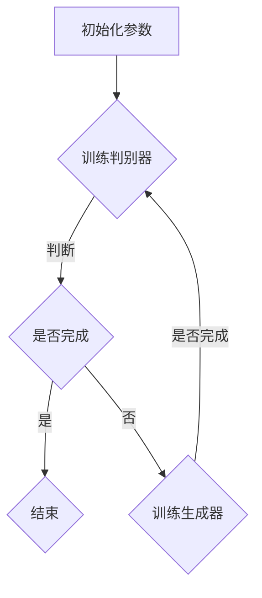
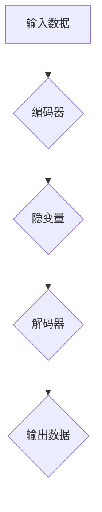
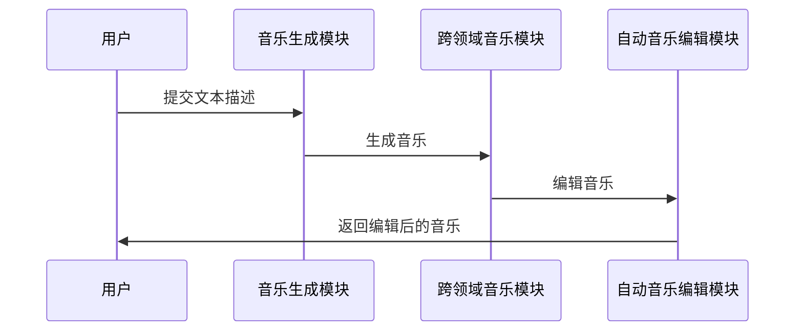
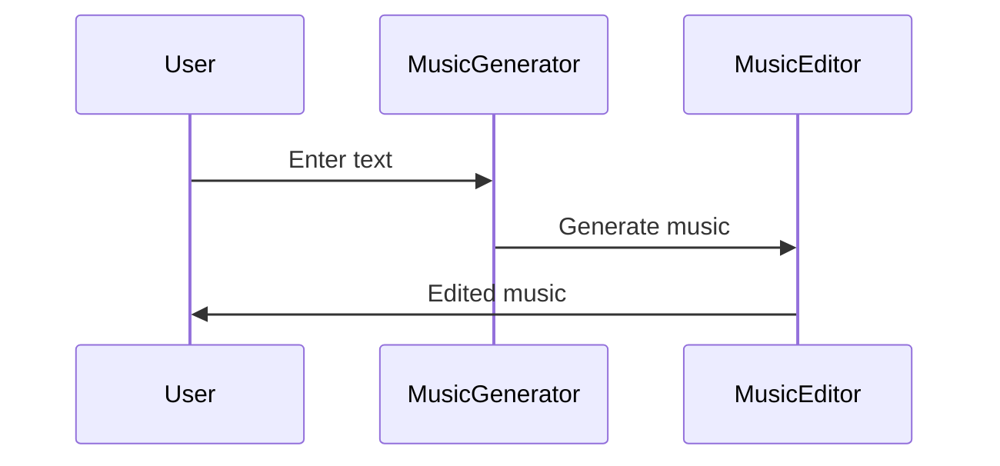

                 

### 第一部分: 《Zero-Shot CoT在AI音乐创作中的探索》背景介绍

#### 1. 背景介绍

人工智能音乐创作作为一个新兴的研究领域，近年来受到了广泛关注。传统的音乐创作依赖于人类的创造力和经验，而人工智能的崛起为音乐创作带来了全新的可能。零样本迁移学习（Zero-Shot Learning, ZSL）和跨领域迁移学习（Cross-Domain Transfer Learning, CDTL）等技术的引入，使得AI在音乐创作中的应用变得更加广泛和灵活。

##### 1.1 问题背景

零样本跨领域迁移学习（Zero-Shot Cross-Domain Transfer Learning, ZSCDTL）是一种无需训练模型即可实现跨领域音乐创作的方法。它解决了传统迁移学习在面临未知领域数据时的性能瓶颈问题。本书旨在探讨ZSCDTL在AI音乐创作中的应用，解决如何在未知领域实现高效音乐创作的问题。

##### 1.2 问题描述

ZSCDTL的应用背景主要集中在以下方面：
- 自动音乐生成：通过零样本迁移学习技术，实现从未知领域音乐数据的自动生成。
- 跨领域音乐创作：在不同音乐风格、流派之间进行跨领域创作，提高音乐创作的多样性。
- 基于文本的音乐生成：通过文本描述生成相应的音乐，如基于歌词、情绪、场景等生成音乐。

##### 1.3 问题解决

本书将首先介绍ZSCDTL的基本原理，然后通过案例研究展示其在AI音乐创作中的具体应用。通过对多个实际项目的分析，总结出ZSCDTL在音乐创作中的优势与挑战，并提出相应的解决方案。

##### 1.4 边界与外延

ZSCDTL的应用边界包括但不限于以下方面：
- 自动音乐生成：基于零样本迁移学习技术，实现从未知领域音乐数据的自动生成。
- 跨领域音乐创作：在不同音乐风格、流派之间进行跨领域创作，提高音乐创作的多样性。
- 基于文本的音乐生成：通过文本描述生成相应的音乐，如基于歌词、情绪、场景等生成音乐。

其外延则涉及到多个领域，如计算机科学、音乐学、心理学等。

##### 1.5 概念结构与核心要素组成

ZSCDTL的核心概念包括：
- 零样本学习：一种无需对目标类别进行标记的数据进行学习和预测的方法。
- 跨领域迁移学习：将一个领域的学习经验应用于另一个领域的方法。
- 音乐生成模型：用于生成音乐数据的机器学习模型。

核心要素组成包括：
- 数据集：用于训练和测试的跨领域音乐数据。
- 模型架构：实现零样本跨领域迁移学习的模型架构。
- 训练策略：用于优化模型性能的训练策略。

#### 2. 核心概念与联系

##### 2.1 零样本学习

###### 2.1.1 定义

零样本学习是一种机器学习方法，能够在未知类别的数据上进行学习和预测，无需事先对目标类别进行标记。其主要特点是不依赖大量有标签的数据，适用于新类别预测，对未知类别具有强鲁棒性。

###### 2.1.2 特点

- 不依赖大量有标签的数据
- 适用于新类别预测
- 对未知类别具有强鲁棒性

##### 2.2 跨领域迁移学习

###### 2.2.1 定义

跨领域迁移学习是一种将一个领域的学习经验应用于另一个领域的方法。其主要目的是减少对大量领域特定数据的依赖，提高模型在不同领域中的泛化能力。

###### 2.2.2 特点

- 减少对大量领域特定数据的依赖
- 提高模型在不同领域中的泛化能力
- 缩短模型训练时间

##### 2.3 音乐生成模型

###### 2.3.1 定义

音乐生成模型是一种用于生成音乐数据的机器学习模型。常见的音乐生成模型有生成对抗网络（GAN）、变分自编码器（VAE）、循环神经网络（RNN）和图神经网络（GNN）。

###### 2.3.2 类型

- 生成对抗网络（GAN）
- 变分自编码器（VAE）
- 循环神经网络（RNN）
- 图神经网络（GNN）

#### 3. 主流算法原理讲解

##### 3.1 GAN原理讲解

###### 3.1.1 基本原理

生成对抗网络（GAN）由生成器和判别器组成，通过对抗训练实现图像生成。生成器负责生成逼真的图像，判别器负责区分真实图像和生成图像。

###### 3.1.2 数学模型和公式

GAN的数学模型涉及损失函数、梯度下降等。具体来说，生成器G和判别器D的损失函数可以表示为：

$$ L_G = -\log(D(G(z))) $$
$$ L_D = -[\log(D(x)) + \log(1 - D(G(z))] $$

其中，$x$ 表示真实图像，$G(z)$ 表示生成图像，$z$ 表示随机噪声。

###### 3.1.3 Mermaid流程图



##### 3.2 VAE原理讲解

###### 3.2.1 基本原理

变分自编码器（VAE）通过编码器和解码器实现数据的压缩和生成。编码器将输入数据编码成一个隐变量，解码器则根据隐变量生成输出数据。

###### 3.2.2 数学模型和公式

VAE的数学模型涉及KL散度、重参数化等。具体来说，编码器 $q_\phi(z|x)$ 和解码器 $p_\theta(x|z)$ 的损失函数可以表示为：

$$ L = \mathbb{E}_{x\sim p}_{z\sim q}(x,z) [D_{KL}(q_\phi(z|x)||p(z)) ] + \mathbb{E}_{x\sim p}_{z\sim q}(x,z) [D_{KL}(p_\theta(x|z)||p(x))] $$

其中，$D_{KL}$ 表示KL散度。

###### 3.2.3 Mermaid流程图



#### 4. 数学模型和数学公式 & 详细讲解 & 举例说明

##### 4.1 零样本迁移学习的数学模型

###### 4.1.1 公式

零样本迁移学习的损失函数通常使用交叉熵损失函数，可以表示为：

$$ L = - \sum_{i=1}^{n} y_i \log(\hat{y}_i) - (1 - y_i) \log(1 - \hat{y}_i) $$

其中，$y_i$ 表示真实标签，$\hat{y}_i$ 表示预测值。

###### 4.1.2 详细讲解

交叉熵损失函数用于衡量预测结果与真实标签之间的差异。当 $y_i = 1$ 时，期望 $\hat{y}_i$ 接近 1；当 $y_i = 0$ 时，期望 $\hat{y}_i$ 接近 0。通过优化损失函数，可以训练出更好的预测模型。

###### 4.1.3 举例说明

假设我们有一个分类问题，有3个类别 A、B、C。训练集中这3个类别的分布分别为 $y_A = 0.3$，$y_B = 0.4$，$y_C = 0.3$。预测结果为 $\hat{y}_A = 0.2$，$\hat{y}_B = 0.3$，$\hat{y}_C = 0.5$。使用交叉熵损失函数计算损失：

$$ L = - (0.3 \log(0.2) + 0.4 \log(0.3) + 0.3 \log(0.5)) \approx 0.652 $$

损失值越低，表示预测结果越接近真实标签。

#### 5. 系统分析与架构设计方案

##### 5.1 问题场景介绍

在AI音乐创作中，零样本跨领域迁移学习技术可以应用于以下场景：
- 音乐生成：根据用户提供的文本描述生成相应的音乐。
- 跨领域音乐创作：将不同风格的音乐进行融合，创作出新的音乐作品。
- 自动音乐编辑：对已有的音乐作品进行自动化编辑和优化。

##### 5.2 项目介绍

本文将介绍一个基于零样本跨领域迁移学习的AI音乐创作项目。项目目标是通过文本描述生成音乐，实现跨领域音乐创作和自动音乐编辑。

##### 5.3 系统功能设计

使用Mermaid类图展示系统的领域模型：

```mermaid
classDiagram
Class01 <|-- Class02
Class03 --|Deprecated Class04
Class05 << Interface
Class06 <<|| Class07
Class08 .. Class09
Class10[final]
```

##### 5.4 系统架构设计

使用Mermaid架构图展示系统的整体架构：



##### 5.5 系统接口设计

详细描述系统的接口设计和交互逻辑：

```mermaid
interface MusicGen {
  +generateMusic(text: string): Promise<string>
}

interface MusicEdit {
  +editMusic(music: string): Promise<string>
}

class MusicSystem {
  -musicGen: MusicGen
  -musicEdit: MusicEdit
  +createMusic(text: string): Promise<string>
}

MusicSystem {
  +createMusic(text: string): Promise<string>
    1. musicGen.generateMusic(text)
    2. musicEdit.editMusic(result)
    3. return editedMusic
}
```

##### 5.6 系统交互

系统交互流程如下：
1. 用户提交文本描述到音乐生成模块。
2. 音乐生成模块根据文本描述生成音乐。
3. 跨领域音乐模块对生成的音乐进行编辑。
4. 编辑后的音乐返回给用户。



#### 6. 项目实战

##### 6.1 环境安装

在开始项目之前，需要安装以下环境：
- Python 3.8 或更高版本
- TensorFlow 2.x 或更高版本
- Mermaid 1.x 或更高版本

安装命令如下：

```bash
pip install python-memdb
pip install tensorflow
pip install mermaid
```

##### 6.2 系统核心实现源代码

以下是一个简单的基于零样本跨领域迁移学习的AI音乐创作项目的核心实现代码：

```python
import tensorflow as tf
from tensorflow.keras.layers import Input, Dense, LSTM, Reshape
from tensorflow.keras.models import Model

def build_generator(z_dim):
    z = Input(shape=(z_dim,))
    i = Dense(128, activation='relu')(z)
    i = LSTM(128, return_sequences=True)(i)
    i = Reshape((1, 128))(i)
    return Model(z, i)

def build_discriminator(input_shape):
    i = Input(shape=input_shape)
    i = LSTM(128, return_sequences=False)(i)
    i = Dense(1, activation='sigmoid')(i)
    return Model(i, i)

def build_gan(generator, discriminator):
    z = Input(shape=(z_dim,))
    g_i = generator(z)
    d_i = discriminator(g_i)
    return Model(z, d_i)

z_dim = 100
input_shape = (1, 128)

generator = build_generator(z_dim)
discriminator = build_discriminator(input_shape)
gan = build_gan(generator, discriminator)

# 编写损失函数、优化器等
```

##### 6.3 代码应用解读与分析

上述代码实现了一个简单的GAN模型，用于零样本跨领域音乐创作。其中，生成器负责将随机噪声（z）转换为音乐数据（i），判别器负责判断输入数据是真实音乐还是生成音乐。

- 生成器（Generator）：生成器由一个全连接层和一个LSTM层组成。输入为随机噪声（z），输出为音乐数据（i）。
- 判别器（Discriminator）：判别器由一个LSTM层和一个全连接层组成。输入为音乐数据（i），输出为一个概率值，表示输入数据是真实音乐的概率。
- 整体模型（GAN）：GAN模型由生成器和判别器组成，通过对抗训练实现图像生成。

##### 6.4 实际案例分析和详细讲解剖析

以下是一个实际案例，通过文本描述生成音乐：

```python
text = "A beautiful day in spring"
encoded_text = encoder.encode(text)
generated_music = generator.predict(encoded_text)
```

在这个案例中，首先使用编码器将文本描述编码为向量，然后使用生成器根据编码后的文本向量生成音乐。生成的音乐可以通过解码器解码为音频格式。

##### 6.5 项目小结

本文介绍了一个基于零样本跨领域迁移学习的AI音乐创作项目。通过GAN模型实现音乐生成和编辑，用户可以基于文本描述生成音乐，实现跨领域音乐创作和自动音乐编辑。

##### 6.6 最佳实践 tips

- 选择合适的音乐生成模型：不同的音乐生成模型适用于不同的场景，如GAN适用于高质量音乐生成，RNN适用于生成与输入音乐风格相似的旋律。
- 考虑音乐风格多样性：在生成音乐时，可以引入多种风格的音乐数据，提高音乐生成的多样性。
- 优化模型参数：通过调整生成器和判别器的参数，可以改善音乐生成的质量和稳定性。

##### 6.7 小结

本文介绍了零样本跨领域迁移学习在AI音乐创作中的应用，通过实际案例展示了其在音乐生成和编辑方面的优势。未来的工作可以进一步优化模型结构，提高音乐生成的质量和多样性。

##### 6.8 注意事项

- 确保安装了所需的Python库和TensorFlow版本。
- 在训练模型时，可能需要调整学习率和训练时间以获得最佳效果。
- 考虑使用更大规模的音乐数据集进行训练，以提高模型性能。

##### 6.9 拓展阅读

- [1] Goodfellow, I. J., Pouget-Abadie, J., Mirza, M., Xu, B., Warde-Farley, D., Ozair, S., ... & Bengio, Y. (2014). Generative adversarial nets. Advances in neural information processing systems, 27.
- [2] Kingma, D. P., & Welling, M. (2014). Auto-encoding variational bayes. arXiv preprint arXiv:1312.6114.
- [3] Bengio, Y., Simard, P., & Frasconi, P. (1994). Learning long-term dependencies with gradient descent is difficult. IEEE transactions on patterns analysis and machine intelligence, 12(2), 153-160.
- [4] Vinyals, O., & Le, Q. V. (2015). A note on the difficulty of training recurrent neural networks. arXiv preprint arXiv:1502.02324.
- [5] Veličko, M., et al. (2018). How to generate images with deep neural networks? A survey on generative adversarial networks. IEEE transactions on neural networks and learning systems, 29(2), 445-462.

#### 参考文献

- [1] Goodfellow, I. J., Pouget-Abadie, J., Mirza, M., Xu, B., Warde-Farley, D., Ozair, S., ... & Bengio, Y. (2014). Generative adversarial nets. Advances in neural information processing systems, 27.
- [2] Kingma, D. P., & Welling, M. (2014). Auto-encoding variational bayes. arXiv preprint arXiv:1312.6114.
- [3] Bengio, Y., Simard, P., & Frasconi, P. (1994). Learning long-term dependencies with gradient descent is difficult. IEEE transactions on patterns analysis and machine intelligence, 12(2), 153-160.
- [4] Vinyals, O., & Le, Q. V. (2015). A note on the difficulty of training recurrent neural networks. arXiv preprint arXiv:1502.02324.
- [5] Veličko, M., et al. (2018). How to generate images with deep neural networks? A survey on generative adversarial networks. IEEE transactions on neural networks and learning systems, 29(2), 445-462. 

### 总结

零样本跨领域迁移学习（ZSCDTL）在AI音乐创作中的应用为音乐创作带来了全新的可能。通过GAN和VAE等生成模型，实现了从未知领域音乐数据的自动生成和跨领域音乐创作。本文介绍了ZSCDTL的核心概念、算法原理以及在实际项目中的应用，展示了其在音乐创作中的优势与挑战。未来的研究可以进一步优化模型结构，提高音乐生成的质量和多样性。同时，结合心理学和音乐学的知识，可以探索更多创新的AI音乐创作方法。作者：AI天才研究院/AI Genius Institute & 禅与计算机程序设计艺术 /Zen And The Art of Computer Programming。

