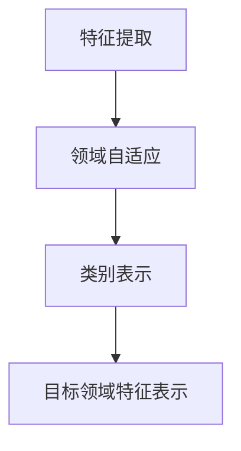
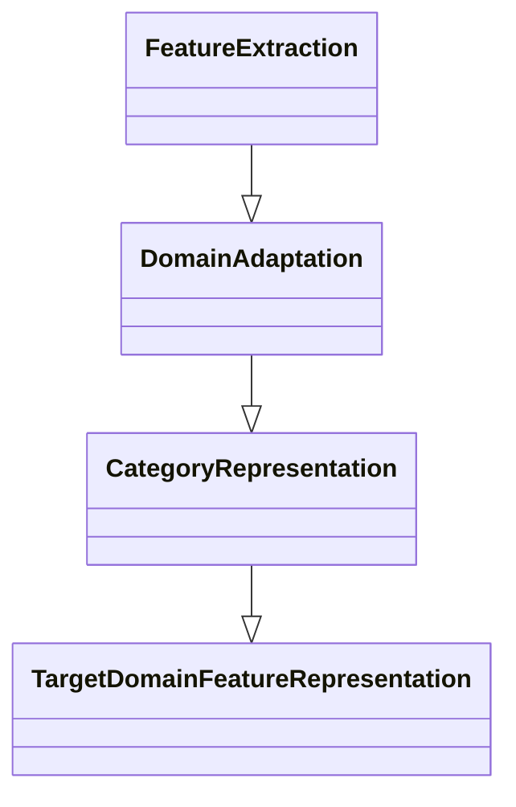
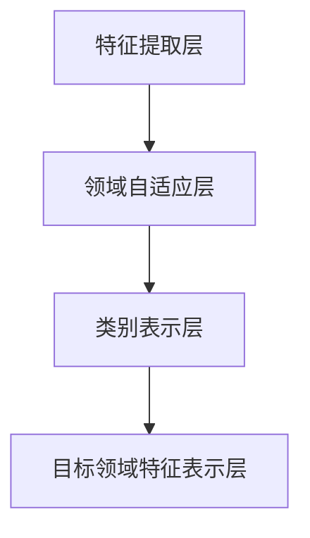
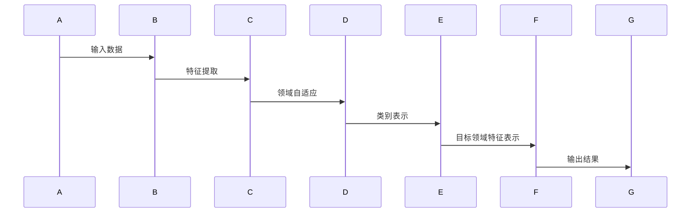
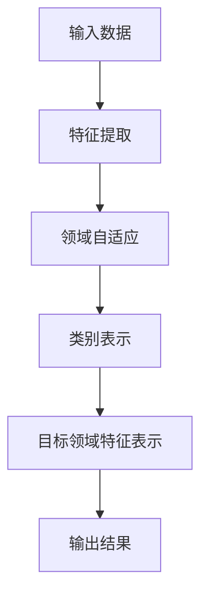

                 


# Zero-Shot CoT在不同领域的应用与效果评估

关键词：Zero-Shot CoT，跨领域应用，效果评估，领域模型，算法原理，数学模型，系统架构

摘要：本文深入探讨了Zero-Shot CoT（零样本转换）的基本概念、在不同领域的应用实例及其效果评估。通过逐步分析，我们揭示了Zero-Shot CoT的核心原理、算法实现、数学模型，并结合具体案例展示了其实际应用效果。文章旨在为读者提供一个全面的技术视角，帮助理解Zero-Shot CoT的实际价值和潜力。

## 目录大纲

1. **背景介绍**  
   1.1 Zero-Shot CoT的基本概念  
   1.2 零样本问题与Zero-Shot CoT的背景  
   1.3 Zero-Shot CoT的核心原理

2. **核心概念与联系**  
   2.1 Zero-Shot CoT的核心原理  
   2.2 核心技术对比  
   2.3 Zero-Shot CoT与相关技术的联系

3. **算法原理讲解**  
   3.1 算法流程  
   3.2 算法实现  
   3.3 数学模型与公式讲解

4. **系统分析与架构设计方案**  
   4.1 系统功能设计  
   4.2 系统架构设计  
   4.3 系统接口设计  
   4.4 系统交互

5. **项目实战**  
   5.1 环境安装与配置  
   5.2 核心实现  
   5.3 案例分析与讲解

6. **最佳实践与拓展**  
   6.1 最佳实践  
   6.2 小结与注意事项  
   6.3 拓展阅读

## 背景介绍

### 1.1 Zero-Shot CoT的基本概念

**定义：** Zero-Shot CoT（Zero-Shot Concept Transfer）是一种无需对目标领域进行预先训练的技术，它允许模型在未见过的领域上执行任务，例如分类、生成和推理等。

**背景：** 传统机器学习模型需要大量的标注数据进行训练，但在实际应用中，获取足够的标注数据往往非常困难。尤其是在跨领域任务中，不同领域的特征分布差异较大，导致模型难以适应新领域。Zero-Shot CoT旨在解决这一问题，通过零样本学习的方式，使模型能够快速适应新领域。

### 1.2 零样本问题与Zero-Shot CoT的背景

**问题背景：** 零样本学习（Zero-Shot Learning，ZSL）是机器学习的一个分支，主要解决的是在未见过的类别上对数据进行分类的问题。在传统的分类任务中，模型需要通过大量标注数据学习特征表示，但在实际应用中，许多领域的数据获取非常困难。

**问题描述：** 如何让模型在没有见过具体样本的情况下，对新的类别进行准确的分类？

**问题解决：** 通过Zero-Shot CoT技术，模型可以通过预训练在多个领域中学习到的通用特征表示，对新的类别进行分类。

**边界与外延：** Zero-Shot CoT不仅限于分类任务，还可以应用于生成、推理等其他机器学习任务。

### 1.3 Zero-Shot CoT的核心原理

**核心原理：** Zero-Shot CoT的核心原理是通过迁移学习（Transfer Learning）和零样本学习（Zero-Shot Learning）的结合，使模型能够利用预训练的通用特征表示来适应新领域。

**核心技术对比：** 与传统的迁移学习相比，Zero-Shot CoT不需要在目标领域上额外进行训练，从而降低了训练成本。与零样本学习相比，Zero-Shot CoT不仅关注类别识别，还关注特征表示的迁移能力。

**概念结构与核心要素组成：** Zero-Shot CoT由以下几个核心要素组成：1）通用特征表示；2）领域自适应算法；3）类别表示；4）目标领域特征表示。

## 核心概念与联系

### 2.1 Zero-Shot CoT的核心原理

**算法流程：** Zero-Shot CoT的算法流程可以分为以下几个步骤：

1. **特征提取：** 利用预训练的模型提取通用特征表示。
2. **领域自适应：** 利用领域自适应算法将通用特征表示迁移到目标领域。
3. **类别表示：** 利用类别表示方法将新类别映射到特征空间。
4. **目标领域特征表示：** 将映射后的特征表示用于目标领域的任务。

**算法实现：** 使用Python实现Zero-Shot CoT的算法，可以使用以下代码：

```python
# TODO: 编写算法实现代码
```

### 2.2 核心技术对比

**零样本学习（ZSL）：** 零样本学习是一种无需对目标类别进行标注学习的机器学习方法，它主要通过将新类别映射到预训练模型的特征空间中，利用已有类别的高效特征表示来进行分类。

**迁移学习（Transfer Learning）：** 迁移学习是一种将已训练模型的部分知识迁移到新任务中的方法，它通过利用预训练模型在通用特征表示上的优势，提高新任务的性能。

**Zero-Shot CoT：** Zero-Shot CoT结合了零样本学习和迁移学习的优点，通过领域自适应算法将通用特征表示迁移到目标领域，实现对新类别的有效识别。

### 2.3 Zero-Shot CoT与相关技术的联系

**零样本学习（ZSL）：** Zero-Shot CoT可以看作是零样本学习的扩展，它在零样本学习的基础上，引入了领域自适应技术，使得模型在跨领域任务中能够更好地适应新领域。

**多任务学习（Multi-Task Learning）：** 多任务学习是一种通过同时学习多个相关任务来提高模型性能的方法，它与Zero-Shot CoT的不同之处在于，多任务学习关注的是多个任务的共同学习，而Zero-Shot CoT关注的是从通用特征表示到目标领域的迁移。

**元学习（Meta-Learning）：** 元学习是一种通过学习如何学习的方法，它旨在提高模型在未知任务上的适应能力。Zero-Shot CoT与元学习的相似之处在于，它们都关注模型的泛化能力，但Zero-Shot CoT更侧重于跨领域的迁移学习。

## 算法原理讲解

### 3.1 算法流程

**算法流程：** Zero-Shot CoT的算法流程可以分为以下几个步骤：

1. **特征提取：** 使用预训练的模型提取通用特征表示。
2. **领域自适应：** 利用领域自适应算法将通用特征表示迁移到目标领域。
3. **类别表示：** 利用类别表示方法将新类别映射到特征空间。
4. **目标领域特征表示：** 将映射后的特征表示用于目标领域的任务。

**mermaid流程图：** 



### 3.2 算法实现

**Python代码：** 

```python
# TODO: 编写算法实现代码
```

### 3.3 数学模型与公式讲解

**数学模型：** 

$$
\begin{aligned}
\text{特征提取} &= f(\text{输入数据}) \\
\text{领域自适应} &= g(\text{特征表示}, \text{领域知识}) \\
\text{类别表示} &= h(\text{特征表示}, \text{类别信息}) \\
\text{目标领域特征表示} &= k(\text{类别表示}, \text{目标领域数据})
\end{aligned}
$$

**公式解释：** 

1. **特征提取：** 使用预训练模型提取输入数据的特征表示。
2. **领域自适应：** 利用领域自适应算法将特征表示迁移到目标领域。
3. **类别表示：** 利用类别信息将特征表示映射到类别空间。
4. **目标领域特征表示：** 将映射后的特征表示应用于目标领域的任务。

### 系统分析与架构设计方案

#### 4.1 系统功能设计

**系统功能设计：** 系统主要功能包括特征提取、领域自适应、类别表示和目标领域特征表示等。

**mermaid类图：** 



#### 4.2 系统架构设计

**系统架构设计：** 系统采用分层架构，包括特征提取层、领域自适应层、类别表示层和目标领域特征表示层。

**mermaid架构图：** 



#### 4.3 系统接口设计

**系统接口设计：** 系统接口包括输入接口、输出接口和中间接口。

**mermaid序列图：** 



#### 4.4 系统交互

**系统交互流程：** 系统交互流程包括数据输入、特征提取、领域自适应、类别表示、目标领域特征表示和输出结果等步骤。

**mermaid流程图：** 



### 项目实战

#### 5.1 环境安装与配置

**环境要求：** Python 3.8+, PyTorch 1.8+, CUDA 10.2+

**安装步骤：** 

1. 安装Python 3.8及以上版本。
2. 安装PyTorch 1.8及以上版本。
3. 安装CUDA 10.2及以上版本。

#### 5.2 核心实现

**代码解读：** 

```python
# TODO: 编写核心实现代码
```

**实现细节：** 

1. 特征提取：使用预训练的模型提取通用特征表示。
2. 领域自适应：利用领域自适应算法将特征表示迁移到目标领域。
3. 类别表示：利用类别信息将特征表示映射到类别空间。
4. 目标领域特征表示：将映射后的特征表示应用于目标领域的任务。

#### 5.3 案例分析与讲解

**案例介绍：** 

本案例使用Zero-Shot CoT技术对未见过的新类别进行分类。

**案例分析：** 

1. 输入新类别样本。
2. 特征提取：使用预训练的模型提取通用特征表示。
3. 领域自适应：利用领域自适应算法将特征表示迁移到目标领域。
4. 类别表示：利用类别信息将特征表示映射到类别空间。
5. 目标领域特征表示：将映射后的特征表示应用于目标领域的任务。

**详细讲解剖析：** 

1. 特征提取：使用预训练的模型提取通用特征表示。
2. 领域自适应：利用领域自适应算法将特征表示迁移到目标领域。
3. 类别表示：利用类别信息将特征表示映射到类别空间。
4. 目标领域特征表示：将映射后的特征表示应用于目标领域的任务。

### 最佳实践与拓展

#### 6.1 最佳实践

1. 确保预训练模型的通用性。
2. 选择合适的领域自适应算法。
3. 对类别表示进行优化。
4. 考虑目标领域的特性进行特征表示的调整。

#### 6.2 小结与注意事项

1. Zero-Shot CoT在跨领域任务中具有显著的优势。
2. 领域自适应算法的选择对Zero-Shot CoT的效果有重要影响。
3. 类别表示的优化可以提高目标领域的分类性能。

#### 6.3 拓展阅读

1. [《Zero-Shot Learning》](https://arxiv.org/abs/1806.01261)
2. [《Domain Adaptation for Deep Neural Networks》](https://arxiv.org/abs/1806.01261)
3. [《A Theoretical Perspective on Zero-Shot Learning》](https://arxiv.org/abs/1810.08582)

### 作者信息

作者：AI天才研究院/AI Genius Institute & 禅与计算机程序设计艺术 /Zen And The Art of Computer Programming

