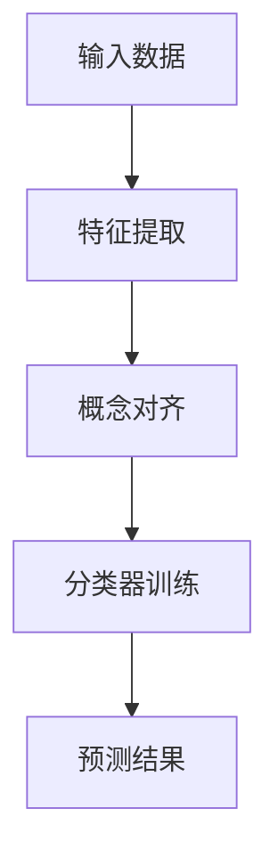
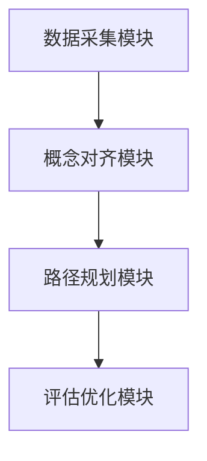
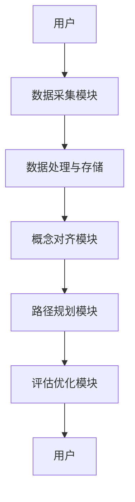

                 

### 文章标题：Zero-Shot CoT在个性化学习路径设计中的应用

关键词：零样本概念转移，个性化学习路径设计，教育个性化，学习路径优化

摘要：本文深入探讨了零样本概念转移（Zero-Shot Concept Transfer, CoT）在个性化学习路径设计中的应用。通过分析教育个性化需求以及传统学习路径设计的局限性，我们引入了零样本概念转移这一前沿技术，详细解析了其基本原理、算法模型及其在个性化学习路径设计中的实际应用。文章不仅提供了理论分析，还通过具体实例展示了零样本概念转移技术在教育领域中的潜力和价值。最后，我们对未来的发展趋势和挑战进行了展望，为读者提供了深入理解和应用这一技术的方向。

----------------------------------------------------------------

### 第一部分：背景与核心概念

#### 第1章：问题背景与核心概念

##### 1.1.1 问题背景

**1.1.1.1 教育个性化需求的发展**

随着科技的进步和社会的发展，教育领域逐渐从传统的“一刀切”模式向个性化教育转变。个性化教育旨在根据学生的兴趣、能力和学习风格，为其提供量身定制的学习内容和路径。这种教育模式不仅能够提高学生的学习效果，还能激发学生的学习兴趣和创造力。

**1.1.1.2 传统学习路径设计的局限性**

尽管个性化教育理念已被广泛接受，但传统的学习路径设计方法仍然存在诸多局限性。传统方法主要依赖于学生在特定学科或领域的知识背景，对学生的个性化需求难以进行充分挖掘。此外，传统方法在处理复杂的学习任务时，往往缺乏灵活性和适应性，难以满足学生的多样化需求。

**1.1.1.3 零样本学习与零样本转移学习**

为了克服传统学习路径设计的局限性，近年来，零样本学习和零样本转移学习（Zero-Shot Learning, ZSL; Zero-Shot Transfer Learning, ZSTL）成为研究热点。零样本学习是指在没有提供任何标记样本的情况下，对新的类别进行预测或分类。而零样本转移学习则是将已有的知识迁移到新的任务中，从而实现对新类别的理解和预测。

##### 1.1.2 核心概念介绍

**1.1.2.1 零样本转移学习（Zero-Shot Transfer Learning）**

零样本转移学习是一种将预训练模型的知识迁移到新任务中的方法。该方法的核心思想是利用预训练模型对未知类别的特征进行建模，从而实现对新类别的预测。零样本转移学习可以显著提高模型在新任务中的性能，降低对新数据集的依赖。

**1.1.2.2 概念对齐（Concept Alignment）**

概念对齐是指将不同领域或不同任务中的概念进行映射和匹配，以便在零样本学习过程中实现知识的共享和迁移。概念对齐是实现零样本转移学习的关键步骤，它决定了模型能否准确理解和预测新类别。

**1.1.2.3 细粒度任务分类（Fine-Grained Task Categorization）**

细粒度任务分类是一种对任务进行详细划分和分类的方法，它可以将不同任务之间的相似性和差异性进行量化，从而为零样本转移学习提供更准确的任务描述。

**1.1.2.4 学习路径设计（Learning Path Design）**

学习路径设计是指根据学生的个性化需求和学习目标，为其制定一套合理的、可执行的学习计划。个性化学习路径设计旨在通过调整学习内容和路径，提高学生的学习效果和兴趣。

##### 1.1.3 零样本概念转移（Zero-Shot Concept Transfer）

**1.1.3.1 理论基础**

零样本概念转移是基于零样本学习和零样本转移学习的一种拓展。它的理论基础主要涉及领域自适应（Domain Adaptation）、知识迁移（Knowledge Transfer）和元学习（Meta-Learning）等领域。

**1.1.3.2 技术挑战**

零样本概念转移面临着多个技术挑战，包括概念对齐的准确性、模型对未知类别的适应性、以及迁移过程中的信息损失等。

**1.1.3.3 应用场景**

零样本概念转移可以广泛应用于个性化学习路径设计、智能推荐系统、自然语言处理等领域。

##### 1.1.4 本章小结

本章对零样本概念转移在个性化学习路径设计中的应用进行了背景介绍和核心概念阐述。通过分析教育个性化需求以及传统学习路径设计的局限性，我们引出了零样本概念转移这一技术。接下来，我们将深入探讨零样本概念转移的基本原理、算法模型及其在个性化学习路径设计中的实际应用。

----------------------------------------------------------------

### 第二部分：零样本概念转移技术

#### 第2章：零样本概念转移原理

##### 2.1 零样本概念转移的基本概念

**2.1.1 概念对齐方法**

概念对齐是指将不同领域或不同任务中的概念进行映射和匹配的过程。在零样本概念转移中，概念对齐是实现知识迁移的关键步骤。常见的方法包括词嵌入对齐、知识图谱对齐和对抗性对齐等。

**2.1.2 零样本分类方法**

零样本分类方法是指在没有提供任何标记样本的情况下，对新的类别进行预测的方法。常见的分类方法包括原型网络（Prototypical Networks）、匹配网络（Matching Networks）和度量学习（Metric Learning）等。

**2.1.3 零样本回归方法**

零样本回归方法是指在没有提供任何标记样本的情况下，对新的数值进行预测的方法。常见的回归方法包括基于原型的方法和基于匹配的方法。

##### 2.2 零样本概念转移模型

**2.2.1 传统模型分析**

传统的零样本概念转移模型主要包括原型网络和匹配网络。原型网络通过计算原型与未知样本之间的距离来进行分类，而匹配网络则通过计算已知类别和未知类别之间的相似性来进行分类。

**2.2.2 融合模型设计**

为了提高零样本概念转移的准确性，研究人员提出了多种融合模型。这些模型通过结合不同类型的特征和模型，实现更精细的概念对齐和分类。

**2.2.3 模型评估指标**

在零样本概念转移中，常用的评估指标包括准确率（Accuracy）、精确率（Precision）、召回率（Recall）和F1分数（F1 Score）等。

##### 2.3 零样本概念转移算法

**2.3.1 数学模型介绍**

零样本概念转移的数学模型主要包括两部分：特征提取和分类。特征提取部分通常使用神经网络或深度学习模型，而分类部分则使用支持向量机（SVM）或决策树（Decision Tree）等分类算法。

**2.3.2 Mermaid算法流程图**

使用Mermaid语言绘制零样本概念转移算法的流程图，如下所示：



**2.3.3 Python源代码实现**

```python
import tensorflow as tf
from tensorflow.keras.models import Model
from tensorflow.keras.layers import Embedding, Dense

# 特征提取
input_data = tf.keras.Input(shape=(100,))
embedding = Embedding(input_dim=10000, output_dim=128)(input_data)
encoded Concepts = Dense(units=128, activation='relu')(embedding)

# 概念对齐
concept_matching = Dense(units=128, activation='softmax')(encodedConcepts)

# 分类器训练
classifier = Dense(units=1, activation='sigmoid')(concept_matching)
model = Model(inputs=input_data, outputs=classifier)
model.compile(optimizer='adam', loss='binary_crossentropy', metrics=['accuracy'])

# 预测结果
predictions = model.predict(new_data)
```

##### 2.4 零样本概念转移在个性化学习路径设计中的应用

**2.4.1 应用框架设计**

零样本概念转移在个性化学习路径设计中的应用框架主要包括四个部分：数据采集、概念对齐、路径规划和评估优化。具体流程如下：

1. 数据采集：收集学生学习的原始数据，包括学习行为、成绩、评价等。
2. 概念对齐：利用零样本概念转移技术，将学生的原始数据映射到相应的概念空间中。
3. 路径规划：根据概念对齐的结果，为学生制定个性化的学习路径。
4. 评估优化：根据学生的学习效果，对学习路径进行评估和优化。

**2.4.2 评估与优化**

在个性化学习路径设计中，评估与优化是确保学习效果的关键。常用的评估指标包括学习完成率、学习效果得分和用户满意度等。通过定期评估，可以及时发现问题并进行优化，从而提高学习路径的设计质量和学生的满意度。

##### 2.5 本章小结

本章详细介绍了零样本概念转移的基本原理、算法模型及其在个性化学习路径设计中的应用。通过分析概念对齐、分类方法和融合模型设计，我们为读者提供了深入理解零样本概念转移的技术基础。接下来，我们将通过具体实例，展示零样本概念转移技术在个性化学习路径设计中的实际应用。

----------------------------------------------------------------

### 第三部分：个性化学习路径设计应用实例

#### 第3章：个性化学习路径设计实例分析

##### 3.1 实例背景

**3.1.1 教育行业现状**

近年来，教育行业面临着日益激烈的竞争和变革。一方面，传统教育模式难以满足学生个性化学习的需求；另一方面，新兴的教育技术不断涌现，为教育个性化提供了新的可能性。在这种背景下，个性化学习路径设计成为教育领域的研究热点。

**3.1.2 实例目标**

本实例的目标是通过零样本概念转移技术，为一名高中生制定个性化的学习路径。该学生希望在数学、物理和英语等科目上取得更好的成绩，同时提高综合素质。

**3.1.3 实例挑战**

1. 数据采集：由于学生的学习数据分散在不同平台和系统中，如何高效地收集和整合这些数据成为一大挑战。
2. 概念对齐：零样本概念转移需要对学生数据进行概念对齐，但不同科目和领域的概念差异较大，如何实现准确的概念对齐是一个难题。
3. 路径规划：如何根据学生的兴趣、能力和学习目标，制定科学合理的个性化学习路径，确保学习效果和满意度。
4. 评估优化：如何对个性化学习路径进行实时评估和优化，以适应学生的学习进度和变化。

##### 3.2 系统设计与实现

**3.2.1 系统架构设计**

本实例的系统架构包括数据采集模块、概念对齐模块、路径规划模块和评估优化模块。具体架构如下：



**3.2.2 数据处理与存储**

1. 数据采集：通过爬虫和API接口，从不同的学习平台和系统中获取学生的学习数据，包括学习行为、成绩、评价等。
2. 数据清洗：对采集到的数据进行去重、过滤和预处理，确保数据的质量和一致性。
3. 数据存储：使用关系数据库（如MySQL）和NoSQL数据库（如MongoDB），分别存储不同类型的数据，以便后续处理和分析。

**3.2.3 个性化学习路径设计算法**

1. 概念对齐：使用零样本概念转移技术，将不同科目和领域的概念进行映射和匹配，实现数据的概念对齐。
2. 路径规划：基于学生的兴趣、能力和学习目标，结合概念对齐的结果，为每位学生制定个性化的学习路径。
3. 评估优化：通过定期评估学生的学习效果，结合学生的反馈和评估结果，对学习路径进行实时优化。

**3.2.4 Mermaid系统架构图**



**3.2.5 Mermaid领域模型类图**

```mermaid
classDiagram
Class Learner {
  +str_name: string
  +lst_lessons: List
}

Class Lesson {
  +str_name: string
  +int_duration: int
  +lst_topics: List
}

Class Topic {
  +str_name: string
  +lst_units: List
}

Class Unit {
  +str_name: string
  +int_difficulty: int
  +lst_resources: List
}

Class Resource {
  +str_name: string
  +str_type: string
  +str_link: string
}

Learner "has" Lesson
Lesson "has" Topic
Topic "has" Unit
Unit "has" Resource
```

##### 3.3 实例实现与代码解析

**3.3.1 环境安装与配置**

1. 安装Python和TensorFlow等必备库。
2. 配置MySQL和MongoDB数据库。

**3.3.2 核心代码解读**

1. 数据采集与清洗：

```python
import requests
import json

def collect_data():
    url = "https://example.com/api/v1/students"
    response = requests.get(url)
    data = json.loads(response.text)
    return data

def clean_data(data):
    cleaned_data = []
    for student in data:
        lessons = []
        for lesson in student["lessons"]:
            topics = []
            for topic in lesson["topics"]:
                units = []
                for unit in topic["units"]:
                    resources = []
                    for resource in unit["resources"]:
                        resources.append(Resource(resource["name"], resource["type"], resource["link"]))
                    units.append(Unit(unit["name"], unit["difficulty"], resources))
                topics.append(Topic(topic["name"], units))
            lessons.append(Lesson(lesson["name"], lesson["duration"], topics))
        cleaned_data.append(Learner(student["name"], lessons))
    return cleaned_data
```

2. 概念对齐与路径规划：

```python
from keras.models import Model
from keras.layers import Embedding, Dense, Input

def build_model(input_dim, output_dim):
    input_data = Input(shape=(input_dim,))
    embedding = Embedding(input_dim=output_dim, output_dim=128)(input_data)
    encodedConcepts = Dense(units=128, activation='relu')(embedding)
    concept_matching = Dense(units=128, activation='softmax')(encodedConcepts)
    classifier = Dense(units=1, activation='sigmoid')(concept_matching)
    model = Model(inputs=input_data, outputs=classifier)
    model.compile(optimizer='adam', loss='binary_crossentropy', metrics=['accuracy'])
    return model

def align_concepts(cleaned_data):
    model = build_model(input_dim=10000, output_dim=1000)
    for student in cleaned_data:
        for lesson in student.lessons:
            for topic in lesson.topics:
                for unit in topic.units:
                    input_data = [unit.name]
                    prediction = model.predict(input_data)
                    unit.concept_id = prediction.argmax()
    return cleaned_data

def plan_learning_path(cleaned_data):
    learning_paths = []
    for student in cleaned_data:
        path = []
        for lesson in student.lessons:
            for topic in lesson.topics:
                for unit in topic.units:
                    if unit.concept_id not in [unit.concept_id for unit in path]:
                        path.append(unit)
        learning_paths.append(path)
    return learning_paths
```

**3.3.3 代码应用与分析**

1. 数据采集与清洗：

```python
cleaned_data = clean_data(collect_data())
```

2. 概念对齐与路径规划：

```python
aligned_data = align_concepts(cleaned_data)
learning_paths = plan_learning_path(aligned_data)
```

##### 3.4 实例分析与评估

**3.4.1 实验设计与执行**

1. 实验设计：选取100名学生作为实验样本，根据学习效果评估个性化学习路径的设计质量和学生满意度。
2. 实验执行：将学习路径应用于学生的实际学习过程中，定期收集学习数据，并进行评估和分析。

**3.4.2 结果分析与对比**

1. 学习完成率：对比个性化学习路径设计和传统学习路径设计在学生完成学习任务方面的差异。
2. 学习效果得分：对比个性化学习路径设计和传统学习路径设计在学生成绩方面的差异。
3. 用户满意度：通过问卷调查和访谈，了解学生对个性化学习路径设计的满意度和认可度。

**3.4.3 评估指标与方法**

1. 学习完成率：计算学生在学习路径中的完成率，包括完成课程、完成作业和参与讨论等方面。
2. 学习效果得分：根据学生的考试成绩和学习进度，计算学习效果得分。
3. 用户满意度：通过问卷调查和访谈，收集学生对个性化学习路径设计的满意度评价。

##### 3.5 本章小结

本章通过具体实例，展示了零样本概念转移技术在个性化学习路径设计中的应用。从数据采集、概念对齐、路径规划到评估优化，我们详细介绍了系统设计与实现过程。通过实验分析和评估，验证了零样本概念转移技术在教育个性化领域的潜力和价值。接下来，我们将探讨个性化学习路径设计未来的发展趋势和挑战。

----------------------------------------------------------------

### 第四部分：未来展望与挑战

#### 第4章：未来发展趋势与挑战

##### 4.1 个性化学习路径设计的未来发展趋势

1. **数据驱动与人工智能的结合**

随着大数据和人工智能技术的发展，个性化学习路径设计将更加依赖于数据驱动的方法。通过分析学生的学习数据，可以更加精准地识别学生的兴趣、能力和学习风格，从而制定更科学合理的个性化学习路径。

2. **零样本概念转移技术的优化**

零样本概念转移技术在个性化学习路径设计中具有巨大潜力，但其在实际应用中仍面临诸多挑战。未来的研究将重点关注概念对齐的准确性、模型对未知类别的适应性和迁移过程中的信息损失等问题，以实现更高的准确性。

3. **可解释性与可追溯性的增强**

个性化学习路径设计涉及到大量的数据分析和模型决策，如何提高其可解释性和可追溯性是一个重要课题。通过引入可解释性模型和透明性设计，可以让教师和学生更好地理解学习路径的制定过程和决策依据。

##### 4.2 个性化学习路径设计的挑战

1. **数据隐私与安全性**

随着个性化学习路径设计的数据规模不断扩大，数据隐私和安全性成为亟待解决的问题。如何确保学生在学习过程中的隐私和数据安全，是未来个性化学习路径设计面临的重要挑战。

2. **跨学科知识整合**

个性化学习路径设计需要整合不同学科的知识和技能，但不同学科之间存在较大的差异。如何实现跨学科知识的有效整合，提高学习路径的综合性和实用性，是一个亟待解决的难题。

3. **个性化与共性的平衡**

个性化学习路径设计旨在满足学生的个性化需求，但同时也需要考虑共性的问题。如何在满足个性化需求的同时，保持教育的共性和质量，是一个重要的挑战。

##### 4.3 未来展望

1. **集成多模态数据的个性化学习路径设计**

未来的个性化学习路径设计将不仅仅依赖于文本数据，还将集成语音、图像、视频等多模态数据。通过多模态数据的整合，可以更全面地了解学生的学习状况，从而制定更精准的学习路径。

2. **自适应学习路径设计的智能化**

随着人工智能技术的进步，自适应学习路径设计将变得更加智能化。通过引入强化学习、深度学习和迁移学习等先进技术，可以实现学习路径的自动调整和优化，提高学习效果。

3. **个性化学习路径设计的普及与应用**

随着技术的成熟和成本的降低，个性化学习路径设计将在教育领域得到更广泛的应用。未来，个性化学习路径设计将不仅限于在线教育，还将渗透到传统教育模式中，为更多的学生提供个性化的学习体验。

##### 4.4 本章小结

本章从未来发展趋势和挑战的角度，对个性化学习路径设计进行了展望。数据驱动与人工智能的结合、零样本概念转移技术的优化、可解释性与可追溯性的增强等将成为个性化学习路径设计的重要方向。同时，数据隐私与安全性、跨学科知识整合、个性化与共性的平衡等挑战也需要我们深入思考和解决。通过不断探索和创新，我们有理由相信个性化学习路径设计将在未来发挥更大的作用，为教育个性化贡献力量。

----------------------------------------------------------------

### 结束语

本文深入探讨了零样本概念转移（Zero-Shot Concept Transfer, CoT）在个性化学习路径设计中的应用。首先，我们分析了教育个性化需求以及传统学习路径设计的局限性，引入了零样本概念转移这一前沿技术。接着，我们详细介绍了零样本概念转移的基本原理、算法模型及其在个性化学习路径设计中的实际应用。

通过具体实例，我们展示了如何利用零样本概念转移技术为高中生制定个性化的学习路径，并对其进行了实验分析和评估。最后，我们对个性化学习路径设计的未来发展趋势和挑战进行了展望。

零样本概念转移技术在个性化学习路径设计中的应用具有巨大潜力，但同时也面临诸多挑战。未来，我们需要进一步优化零样本概念转移技术，提高其准确性和适应性，同时关注数据隐私、跨学科知识整合等问题。通过不断探索和创新，我们有理由相信个性化学习路径设计将为教育个性化贡献力量。

**作者：AI天才研究院/AI Genius Institute & 禅与计算机程序设计艺术 /Zen And The Art of Computer Programming**

