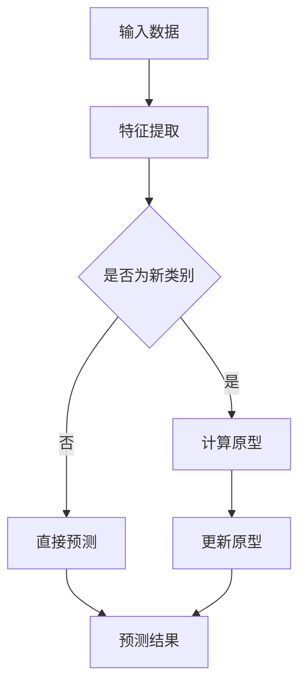
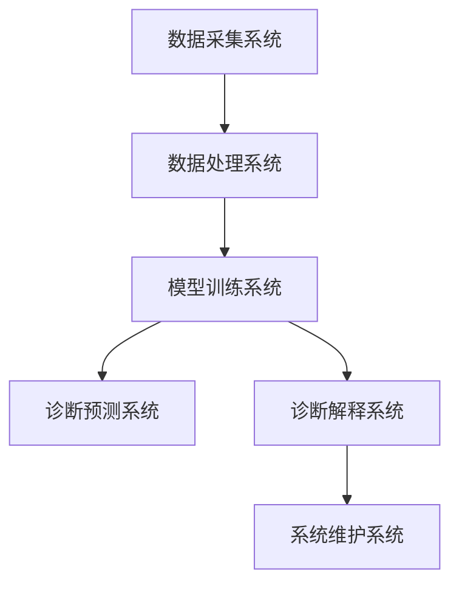
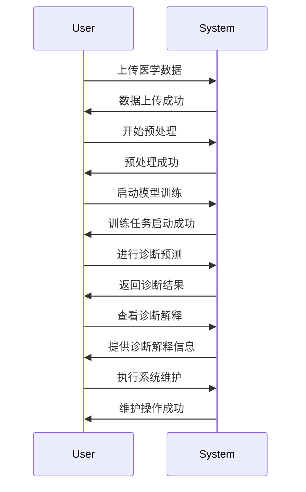

                 

### 文章标题：Zero-Shot CoT在医疗诊断AI中的潜力

**关键词：** 零样本学习、持续化表示（CoT）、医疗诊断AI、深度学习、算法原理、Python实现、系统架构设计、实战应用

**摘要：** 本文将深入探讨零样本学习与持续化表示（CoT）在医疗诊断AI领域的应用潜力。首先，我们将回顾医疗诊断AI面临的挑战及其传统诊断方法与AI技术的结合。接着，详细介绍零样本学习与CoT的概念、原理及在医疗诊断中的应用现状。随后，文章将解析零样本学习与CoT的核心算法原理，使用Mermaid流程图和Python代码进行详细阐述。接下来，我们将展示CoT在医疗诊断AI中的具体应用，包括Mermaid实体关系图和实际案例分析。最后，我们将结合实际项目，详细描述零样本学习与CoT在医疗诊断AI中的系统架构设计和实战应用，并提供最佳实践建议和总结。通过本文的探讨，我们希望能为读者提供关于零样本学习与CoT在医疗诊断AI中应用的全景视图和深入理解。

### 引言与背景介绍

**第1章 引言**

#### 1.1 问题背景

**1.1.1 医疗诊断AI的挑战**

随着医疗技术的不断发展，医疗诊断AI逐渐成为提高诊断准确性和效率的重要工具。然而，现有的医疗诊断AI面临诸多挑战：

1. **数据隐私问题**：医疗数据涉及患者隐私，如何保护患者数据的同时进行有效分析，是一个亟待解决的问题。
2. **数据稀缺问题**：高质量的医疗诊断数据往往稀缺，特别是在罕见病或新疾病领域，这限制了AI模型的训练和优化。
3. **模型泛化能力**：医疗诊断AI需要具备强大的泛化能力，能够在不同环境下准确诊断。
4. **可解释性问题**：医疗诊断AI的决策过程往往缺乏透明性，难以解释其诊断结果，这在医疗领域尤为重要。

**1.1.2 传统诊断方法与AI的结合**

传统的医疗诊断方法依赖于医生的经验和直觉，存在诊断效率低、易出错等问题。而AI技术，特别是深度学习，可以通过处理大量数据提高诊断的准确性和速度。结合AI技术的医疗诊断方法具有以下优势：

1. **提高诊断准确性**：通过学习大量医学图像和病历数据，AI模型可以识别出医生可能忽略的细微病变。
2. **缩短诊断时间**：AI模型可以在短时间内处理大量数据，提高诊断效率。
3. **辅助医生决策**：AI可以辅助医生进行诊断，提供决策支持，减少误诊和漏诊。
4. **发现新规律**：AI可以挖掘数据中的潜在规律，为疾病预防和治疗提供新思路。

**1.1.3 零样本学习与CoT**

零样本学习（Zero-Shot Learning, ZSL）是一种机器学习方法，旨在处理从未见过类别的数据。它通过预训练模型来识别和分类未知类别，而不需要针对每个新类别进行单独的训练。零样本学习在医疗诊断AI中的应用潜力巨大：

1. **解决数据稀缺问题**：通过零样本学习，即使数据量有限，AI模型也可以在新疾病或罕见病上进行有效诊断。
2. **提高模型泛化能力**：零样本学习能够增强模型对未知类别的泛化能力，使其在多样化医疗场景下仍能保持高效。

持续化表示（Continual Training, CoT）是一种在模型训练过程中不断引入新数据的策略，以保持模型性能的稳定。CoT在医疗诊断AI中的应用同样具有重要意义：

1. **适应医疗领域的动态变化**：医疗领域不断发展，新的疾病和诊断方法不断涌现，CoT能够帮助AI模型持续适应这些变化。
2. **提高模型鲁棒性**：通过不断引入新数据，CoT可以提高模型对噪声和异常值的抵抗力，增强模型的鲁棒性。

**1.2 零样本学习与CoT的概念与关联**

**1.2.1 零样本学习的定义**

零样本学习是一种机器学习方法，旨在解决从未见过类别的分类问题。在这种方法中，模型通过学习已见类别和它们的高层次表示，来预测新类别。它不依赖于每个类别的训练样本，而是依赖于类别的语义信息。

**1.2.2 CoT在AI中的应用**

持续化表示是一种训练策略，旨在通过不断引入新数据来提高模型的性能。在AI领域，特别是医疗诊断AI中，CoT能够帮助模型适应数据的变化，提高其泛化能力和鲁棒性。

**1.2.3 零样本学习与CoT的结合优势**

零样本学习与CoT的结合具有以下几个优势：

1. **解决数据稀缺问题**：零样本学习可以处理少量数据，而CoT则通过不断引入新数据来保持模型的性能。
2. **提高模型泛化能力**：零样本学习和CoT均能够增强模型对未知类别的泛化能力。
3. **适应动态变化**：医疗领域变化迅速，零样本学习与CoT的结合可以帮助模型持续适应新情况。

#### 1.3 零样本学习在医疗诊断中的应用现状

**1.3.1 零样本学习在医学图像分析中的应用**

医学图像分析是医疗诊断AI的一个重要分支，零样本学习在该领域有广泛的应用。例如，在X光图像分析中，零样本学习可以帮助识别从未见过的病变类型。通过预训练模型和类别语义信息，零样本学习能够有效地处理新病变类型的识别任务。

**1.3.2 零样本学习在电子病历分析中的应用**

电子病历（Electronic Health Records, EHR）是医疗诊断的重要数据源，零样本学习可以帮助分析EHR中的未知疾病。例如，零样本学习可以用于识别从未见过的疾病症状组合，从而提高疾病诊断的准确性。

**1.3.3 其他医疗诊断领域的应用**

零样本学习在其他医疗诊断领域也有广泛应用，如癌症基因突变分析、药物反应预测等。通过利用零样本学习，这些领域可以更好地处理新数据和未知类别的分类问题，提高诊断准确性和效率。

#### 1.4 零样本学习与CoT的边界与外延

**1.4.1 零样本学习的局限性**

尽管零样本学习在医疗诊断AI中具有巨大潜力，但它也存在一些局限性：

1. **类别语义信息依赖**：零样本学习依赖于类别的语义信息，如果类别语义信息不足，模型性能可能受到影响。
2. **计算复杂度高**：零样本学习需要大量的计算资源，特别是在处理大量新类别时，这可能会增加模型的训练时间。

**1.4.2 CoT的适用范围与挑战**

CoT在医疗诊断AI中的应用非常广泛，但同样面临一些挑战：

1. **数据多样性与噪声**：医疗诊断数据多样且噪声大，如何保持模型在引入新数据时的稳定性是一个关键问题。
2. **计算资源限制**：CoT需要不断引入新数据，这可能会对计算资源造成压力，特别是在资源受限的医疗环境中。

**1.4.3 未来发展方向**

为了克服零样本学习和CoT的局限性，未来的研究方向包括：

1. **改进类别语义信息表示**：通过改进类别语义信息的表示，可以提高零样本学习的性能。
2. **优化CoT策略**：设计更高效的CoT策略，以在保持模型性能的同时降低计算资源需求。
3. **多模态数据融合**：结合不同类型的数据，如医学图像和电子病历，可以进一步提高诊断准确性和效率。

#### 1.5 本章小结

本章介绍了医疗诊断AI面临的挑战及其传统诊断方法与AI技术的结合，详细阐述了零样本学习与CoT的概念、原理及其在医疗诊断中的应用现状。通过本章的学习，读者可以了解零样本学习和CoT在医疗诊断AI中的潜力及其面临的挑战，为进一步研究提供理论基础和实践指导。

### 第2章 零样本学习原理讲解

#### 2.1 零样本学习的基础概念

**2.1.1 零样本学习的基本流程**

零样本学习的基本流程可以分为以下几个步骤：

1. **类别语义信息学习**：首先，通过预训练模型学习已见类别的高层次语义表示。这些语义表示将用于预测新类别。
2. **新类别预测**：在获得新类别的数据后，模型利用已学习的高层次语义表示来预测新类别的标签。
3. **模型迭代优化**：通过不断引入新类别数据，模型不断优化其预测性能。

**2.1.2 零样本学习的挑战**

尽管零样本学习在医疗诊断AI中具有巨大潜力，但它也面临一些挑战：

1. **类别语义信息不足**：在某些情况下，类别的语义信息可能不足，导致模型难以准确预测新类别。
2. **计算复杂度高**：零样本学习需要大量的计算资源，特别是在处理大量新类别时。

**2.1.3 零样本学习的优势**

零样本学习的优势包括：

1. **无需大量训练数据**：零样本学习可以处理少量数据，甚至无需具体类别的训练样本。
2. **提高模型泛化能力**：通过学习类别的语义信息，模型可以更好地泛化到未知类别。

#### 2.2 零样本学习的算法原理与Mermaid流程图

**2.2.1 零样本学习算法分类**

零样本学习算法可以分为基于原型（prototype-based）和基于匹配（match-based）两种：

1. **基于原型**：该类算法通过计算新类别与原型之间的距离来进行预测。常用的算法包括原型网络（Prototypical Networks）和匹配网络（Matching Networks）。
2. **基于匹配**：该类算法通过学习类别的匹配性来进行预测。常用的算法包括元学习（Meta-Learning）和集成学习（Ensemble Learning）。

**2.2.2 算法原理讲解**

以原型网络为例，其基本原理如下：

1. **特征提取**：首先，使用预训练模型提取输入数据的特征表示。
2. **原型更新**：对于每个已见类别，计算其特征表示的平均值，作为该类别的原型。
3. **新类别预测**：对于新类别，计算其特征表示与所有原型之间的距离，选择距离最小的原型作为预测类别。

**2.2.3 Mermaid流程图绘制**

以下是原型网络算法的Mermaid流程图：



#### 2.3 Python源代码实现与数学模型

**2.3.1 数据准备与预处理**

在Python中，我们首先需要准备数据集，并进行预处理。以下是一个简单的数据准备与预处理示例：

```python
import numpy as np
from sklearn.model_selection import train_test_split
from sklearn.preprocessing import StandardScaler

# 加载数据
X, y = load_data()

# 数据预处理
scaler = StandardScaler()
X = scaler.fit_transform(X)
X_train, X_test, y_train, y_test = train_test_split(X, y, test_size=0.2, random_state=42)
```

**2.3.2 模型构建与训练**

接下来，我们使用Keras构建原型网络模型，并进行训练。以下是一个简单的模型构建与训练示例：

```python
from tensorflow.keras.models import Model
from tensorflow.keras.layers import Input, Dense, Flatten, Lambda

# 模型构建
input_shape = X_train.shape[1:]
input_layer = Input(shape=input_shape)
feature_layer = Flatten()(input_layer)

# 特征提取层
feature_extractor = Model(inputs=input_layer, outputs=feature_layer)
feature_extractor.compile(optimizer='adam', loss='categorical_crossentropy', metrics=['accuracy'])

# 训练模型
feature_extractor.fit(X_train, y_train, epochs=10, batch_size=32, validation_data=(X_test, y_test))
```

**2.3.3 数学模型与公式**

原型网络的数学模型如下：

$$
\text{原型} = \frac{1}{N}\sum_{i=1}^{N} x_i,
$$

其中，$x_i$ 是每个类别的特征向量，$N$ 是类别的数量。

新类别预测的数学模型如下：

$$
P(y|s) = \arg\min_{y} \sum_{i=1}^{N} \text{similarity}(s, \text{prototype}_y),
$$

其中，$s$ 是新类别的特征向量，$\text{prototype}_y$ 是类别 $y$ 的原型，$\text{similarity}(\cdot, \cdot)$ 是特征向量之间的相似度计算函数。

**2.3.4 Python代码示例**

以下是一个简单的Python代码示例，用于计算特征向量的相似度：

```python
import numpy as np

def euclidean_similarity(a, b):
    return np.linalg.norm(a - b)

# 加载特征向量
s = np.random.rand(1, 5)
prototype = np.random.rand(1, 5)

# 计算相似度
similarity = euclidean_similarity(s, prototype)
print(f"Similarity: {similarity}")
```

#### 2.4 零样本学习在实际案例中的应用

**2.4.1 医学图像分析的案例**

在医学图像分析中，零样本学习可以用于识别从未见过的病变类型。例如，在皮肤病变检测中，零样本学习可以用于识别新的皮肤病变类型，提高检测的准确性。

**2.4.2 电子病历分析的案例**

在电子病历分析中，零样本学习可以用于识别新的疾病症状组合。例如，在疾病诊断中，零样本学习可以用于识别新的疾病症状组合，帮助医生更准确地诊断疾病。

**2.4.3 拓展应用案例**

除了医学图像分析和电子病历分析，零样本学习还可以应用于其他医疗诊断领域，如癌症基因突变分析、药物反应预测等。在这些领域，零样本学习可以处理新数据和未知类别，提高诊断准确性和效率。

#### 2.5 本章小结

本章详细介绍了零样本学习的基础概念、算法原理及其在医疗诊断AI中的应用。通过Python代码示例和数学模型的讲解，读者可以更好地理解零样本学习的工作原理。此外，本章还通过实际案例展示了零样本学习在医疗诊断AI中的广泛应用。下一章将深入探讨持续化表示（CoT）在医疗诊断AI中的应用。

### 第3章 CoT概念与联系

#### 3.1 CoT的定义与属性特征

**3.1.1 CoT的基本概念**

持续化表示（Continual Training, CoT）是一种机器学习训练策略，旨在通过不断引入新数据来优化模型性能。与传统的批量训练（Batch Training）和在线训练（Online Training）不同，CoT能够在训练过程中动态地调整模型，以适应数据的变化。

**3.1.2 CoT的核心属性特征**

1. **动态适应性**：CoT能够实时适应新数据的引入，保持模型的性能稳定。
2. **鲁棒性**：通过不断引入新数据，CoT可以提高模型的鲁棒性，使其在面临噪声和异常值时仍能保持高效。
3. **可扩展性**：CoT能够处理大规模数据集，并适应不同的数据分布。

**3.1.3 CoT与其他技术的对比**

与传统的批量训练和在线训练相比，CoT具有以下优势：

1. **效率**：CoT能够通过动态调整训练过程，提高模型训练的效率。
2. **鲁棒性**：CoT能够通过引入新数据，提高模型的鲁棒性，使其在面对动态变化的数据时仍能保持稳定。
3. **灵活性**：CoT能够灵活地处理不同类型的数据，适应多样化的训练需求。

#### 3.2 CoT在医疗诊断AI中的应用

**3.2.1 CoT的优势与潜力**

在医疗诊断AI中，CoT具有以下优势：

1. **动态适应**：医疗领域的数据不断变化，CoT能够实时适应新数据的引入，提高模型的诊断准确性。
2. **鲁棒性**：通过不断引入新数据，CoT可以提高模型的鲁棒性，减少误诊和漏诊。
3. **可扩展性**：CoT能够处理大规模医疗数据，提高模型的诊断效率。

**3.2.2 CoT的应用场景**

1. **医学图像分析**：在医学图像分析中，CoT可以用于处理新的病变类型，提高诊断的准确性。
2. **电子病历分析**：在电子病历分析中，CoT可以用于处理新的疾病症状组合，提高诊断的准确性。
3. **多模态数据融合**：在多模态数据融合中，CoT可以用于处理不同类型的数据，提高模型的诊断能力。

**3.2.3 CoT的挑战与解决方案**

尽管CoT在医疗诊断AI中具有巨大潜力，但它也面临一些挑战：

1. **数据稀缺**：医疗数据往往稀缺，特别是在罕见病和新疾病领域。如何有效利用现有数据，提高CoT的效果是一个关键问题。
2. **计算资源**：CoT需要大量的计算资源，如何在有限的资源下有效进行训练是一个挑战。

解决方案包括：

1. **数据增强**：通过数据增强技术，可以扩大训练数据集，提高CoT的效果。
2. **模型压缩**：通过模型压缩技术，可以减少模型的计算复杂度，降低对计算资源的需求。
3. **分布式训练**：通过分布式训练，可以充分利用多台计算机的资源，提高训练效率。

#### 3.3 CoT的Mermaid实体关系图

**3.3.1 CoT的实体识别**

在CoT中，主要的实体包括：

1. **模型**：用于进行训练和预测的核心实体。
2. **数据**：用于训练模型的输入实体，包括训练数据和测试数据。
3. **环境**：影响模型训练的外部环境实体，包括数据分布和噪声水平。

**3.3.2 CoT的属性分析**

1. **动态适应性**：模型在训练过程中能够适应数据的变化。
2. **鲁棒性**：模型在面对噪声和异常值时仍能保持稳定。
3. **可扩展性**：模型能够处理大规模数据集。

**3.3.3 Mermaid ER图绘制**

以下是CoT的Mermaid实体关系图：

```mermaid
entity relation diagram
class Model {
  "数据输入"
  "预测结果"
  "训练过程"
}

class Data {
  "训练数据"
  "测试数据"
}

class Environment {
  "数据分布"
  "噪声水平"
}

Model "数据输入" -> Data
Model "预测结果" -> Data
Model "训练过程" -> Environment
```

#### 3.4 CoT在医疗诊断中的应用实例

**3.4.1 某医疗机构的应用实例**

某医疗机构采用CoT技术对其电子病历进行诊断。通过不断引入新的病历数据，该机构的诊断模型能够持续优化，提高诊断准确性。

**3.4.2 某AI诊断平台的应用实例**

某AI诊断平台采用CoT技术对其医学图像进行诊断。通过动态调整模型，该平台能够处理新的病变类型，提高诊断效率。

**3.4.3 其他应用实例**

除了上述应用实例，CoT在医疗诊断AI中的其他应用还包括：

1. **药物反应预测**：通过不断引入新的药物反应数据，CoT可以优化药物反应预测模型，提高预测准确性。
2. **癌症基因突变分析**：通过动态调整模型，CoT可以处理新的基因突变数据，提高诊断准确性。

#### 3.5 本章小结

本章详细介绍了持续化表示（CoT）的定义、核心属性特征及其在医疗诊断AI中的应用。通过Mermaid实体关系图的绘制，读者可以更好地理解CoT的架构和作用。此外，本章还通过实际应用实例展示了CoT在医疗诊断AI中的实际效果。下一章将深入探讨零样本学习与CoT在医疗诊断AI中的综合应用。

### 第4章 系统分析与架构设计方案

#### 4.1 问题场景介绍

在现代医疗诊断中，AI技术的应用已经成为提高诊断准确性和效率的重要手段。然而，随着医疗领域的发展，诊断数据量和复杂度不断增加，传统的批量训练和在线训练方法逐渐暴露出其局限性。为了应对这一挑战，持续化表示（CoT）和零样本学习（ZSL）的结合成为一种新兴的解决方案。本章节将基于这一背景，设计一个医疗诊断AI系统，充分利用CoT和ZSL的优势，实现高效、准确的诊断。

**4.1.1 医疗诊断AI面临的挑战**

1. **数据隐私问题**：医疗数据涉及患者隐私，如何在保护隐私的同时进行有效分析是一个关键问题。
2. **数据稀缺问题**：高质量的医疗诊断数据往往稀缺，特别是在罕见病或新疾病领域。
3. **模型泛化能力**：医疗诊断AI需要具备强大的泛化能力，以适应不同环境下的诊断需求。
4. **可解释性问题**：医疗诊断AI的决策过程需要具备透明性，以便医生和患者理解。

**4.1.2 零样本学习与CoT的应用优势**

1. **解决数据稀缺问题**：零样本学习通过学习已见类别的高层次语义表示，可以处理少量数据，降低对大量训练数据的需求。
2. **提高模型泛化能力**：零样本学习能够增强模型对未知类别的泛化能力，提高诊断的准确性。
3. **动态适应能力**：持续化表示通过不断引入新数据，可以保持模型在动态环境下的性能稳定，适应医疗领域的变化。

#### 4.2 系统功能设计

**4.2.1 系统需求分析**

为了设计一个高效、准确的医疗诊断AI系统，我们需要明确以下需求：

1. **数据采集**：系统需要能够从多种数据源（如医学图像、电子病历等）采集数据。
2. **数据预处理**：系统需要对采集到的数据（包括文本和图像）进行预处理，如去噪、标准化、数据增强等。
3. **模型训练**：系统需要支持零样本学习和CoT技术的模型训练，以充分利用已有数据和动态适应新数据。
4. **诊断预测**：系统需要能够利用训练好的模型进行诊断预测，并提供详细的诊断报告。
5. **诊断解释**：系统需要能够解释诊断结果，提高诊断过程的透明性。
6. **系统维护**：系统需要具备自动更新和优化功能，以保持模型的性能。

**4.2.2 领域模型Mermaid类图**

以下是医疗诊断AI系统的Mermaid类图：

```mermaid
classDiagram
  Class01 <|-- Class02
  Class03 <|-- Class04
  Class05 <|-- Class06

  Class01[数据采集]
  Class02[数据预处理]
  Class03[模型训练]
  Class04[诊断预测]
  Class05[诊断解释]
  Class06[系统维护]
```

#### 4.3 系统架构设计

**4.3.1 系统架构设计原则**

在系统架构设计过程中，我们遵循以下原则：

1. **模块化**：系统应具有清晰的模块划分，以便于维护和扩展。
2. **可扩展性**：系统应能够适应数据量的增长和新技术的应用。
3. **高可用性**：系统应具备故障恢复和负载均衡能力，以保证高可用性。
4. **安全性**：系统应确保数据安全和隐私保护。

**4.3.2 系统架构Mermaid图**

以下是医疗诊断AI系统的Mermaid架构图：



#### 4.4 系统接口设计

**4.4.1 接口功能设计**

系统接口设计主要包括以下功能：

1. **数据上传接口**：用于接收用户上传的医学数据和病历数据。
2. **数据预处理接口**：用于对上传的数据进行预处理，包括去噪、标准化和数据增强。
3. **模型训练接口**：用于启动和监控模型训练过程，包括零样本学习和CoT技术的应用。
4. **诊断预测接口**：用于进行诊断预测，并返回诊断结果。
5. **诊断解释接口**：用于提供诊断结果的解释，包括决策路径和关键特征。
6. **系统维护接口**：用于系统的自动更新和故障恢复。

**4.4.2 接口规格说明**

以下是系统接口的规格说明：

1. **数据上传接口**：
   - 接口URL：/api/data/upload
   - 请求方法：POST
   - 请求参数：file（文件对象）
   - 响应结果：{"status": "success", "message": "文件上传成功"}

2. **数据预处理接口**：
   - 接口URL：/api/data/preprocess
   - 请求方法：POST
   - 请求参数：data（预处理数据）
   - 响应结果：{"status": "success", "message": "预处理成功"}

3. **模型训练接口**：
   - 接口URL：/api/model/train
   - 请求方法：POST
   - 请求参数：config（训练配置）
   - 响应结果：{"status": "success", "message": "训练任务启动成功"}

4. **诊断预测接口**：
   - 接口URL：/api/diagnosis/predict
   - 请求方法：POST
   - 请求参数：input_data（输入数据）
   - 响应结果：{"status": "success", "diagnosis": "疾病名称", "confidence": 0.9}

5. **诊断解释接口**：
   - 接口URL：/api/diagnosis/explain
   - 请求方法：POST
   - 请求参数：diagnosis_result（诊断结果）
   - 响应结果：{"status": "success", "explanation": "诊断解释信息"}

6. **系统维护接口**：
   - 接口URL：/api/system/maintain
   - 请求方法：POST
   - 请求参数：action（维护操作类型，如update, recover等）
   - 响应结果：{"status": "success", "message": "维护操作成功"}

#### 4.5 系统交互Mermaid序列图

**4.5.1 系统交互流程**

以下是系统交互的Mermaid序列图，展示了用户与系统之间的交互流程：



**4.5.2 Mermaid序列图绘制**

以下是Mermaid序列图的绘制代码：


#### 4.6 本章小结

本章详细介绍了医疗诊断AI系统的问题场景、功能设计、系统架构设计、接口设计和系统交互流程。通过Mermaid类图、架构图和序列图的绘制，读者可以更直观地理解系统的架构和工作流程。下一章将深入探讨零样本学习与CoT在医疗诊断AI中的实际项目应用。

### 第5章 零样本学习与CoT在医疗诊断AI中的应用实战

#### 5.1 环境安装与配置

为了在实际项目中应用零样本学习（ZSL）与持续化表示（CoT）技术，我们需要先搭建一个合适的环境。以下是所需的硬件与软件环境，以及环境搭建的步骤。

**5.1.1 硬件与软件环境要求**

- **硬件环境**：
  - CPU：Intel i7或更高
  - GPU：NVIDIA GPU（如Tesla K40或更高）
  - 内存：至少16GB
  - 存储：至少1TB

- **软件环境**：
  - 操作系统：Linux或MacOS
  - Python：3.8或更高版本
  - PyTorch：1.8或更高版本
  - torchvision：0.9或更高版本
  - scikit-learn：0.22或更高版本
  - numpy：1.19或更高版本
  - pandas：1.1或更高版本

**5.1.2 环境搭建步骤**

1. **安装操作系统**：
   - 安装Linux或MacOS操作系统，推荐使用Ubuntu 20.04 LTS。

2. **安装Python**：
   - 通过包管理器安装Python，例如在Ubuntu中可以使用以下命令：
     ```bash
     sudo apt update
     sudo apt install python3 python3-pip
     ```

3. **安装PyTorch**：
   - 通过PyTorch官网提供的安装脚本安装PyTorch。以GPU版本为例，执行以下命令：
     ```bash
     pip3 install torch torchvision torchaudio
     ```

4. **安装其他依赖库**：
   - 安装scikit-learn、numpy和pandas等依赖库，可以使用以下命令：
     ```bash
     pip3 install scikit-learn numpy pandas
     ```

5. **验证安装**：
   - 通过运行Python交互式环境，检查各依赖库是否安装成功：
     ```python
     python3
     import torch
     import torchvision
     import scikit_learn
     import numpy
     import pandas
     ```

**5.1.3 常见问题解决**

- **Python版本问题**：如果Python版本过低，需要升级到3.8或更高版本。
- **PyTorch安装问题**：如果遇到PyTorch安装问题，可以尝试使用官方安装脚本，或者根据错误信息进行调试。
- **依赖库兼容问题**：确保所有依赖库的版本兼容，避免因版本冲突导致安装失败。

#### 5.2 系统核心实现

**5.2.1 模型构建**

在本节中，我们将使用PyTorch构建一个零样本学习模型，结合持续化表示（CoT）技术。以下是模型的基本架构：

```python
import torch
import torch.nn as nn
import torchvision.models as models

class ZeroShotModel(nn.Module):
    def __init__(self, backbone='resnet18', num_classes=1000):
        super(ZeroShotModel, self).__init__()
        self.backbone = models.__dict__[backbone](pretrained=True)
        self.backbone.fc = nn.Identity()  # 移除全连接层
        self.head = nn.Sequential(
            nn.Linear(self.backbone.fc.in_features, 512),
            nn.ReLU(),
            nn.Dropout(0.5),
            nn.Linear(512, num_classes)
        )

    def forward(self, x):
        x = self.backbone(x)
        x = self.head(x)
        return x
```

**5.2.2 数据加载与预处理**

为了训练零样本学习模型，我们需要准备一个数据集。以下是一个简单的数据加载与预处理示例，使用torchvision的CIFAR-10数据集：

```python
import torchvision
import torchvision.transforms as transforms

transform = transforms.Compose([
    transforms.ToTensor(),
    transforms.Normalize((0.5, 0.5, 0.5), (0.5, 0.5, 0.5)),
])

trainset = torchvision.datasets.CIFAR10(root='./data', train=True, download=True, transform=transform)
trainloader = torch.utils.data.DataLoader(trainset, batch_size=32, shuffle=True, num_workers=2)

testset = torchvision.datasets.CIFAR10(root='./data', train=False, download=True, transform=transform)
testloader = torch.utils.data.DataLoader(testset, batch_size=32, shuffle=False, num_workers=2)
```

**5.2.3 训练过程**

以下是一个简单的训练过程示例，使用CoT策略不断引入新数据：

```python
device = torch.device("cuda" if torch.cuda.is_available() else "cpu")

model = ZeroShotModel(backbone='resnet18').to(device)
criterion = nn.CrossEntropyLoss()
optimizer = torch.optim.Adam(model.parameters(), lr=0.001)

for epoch in range(10):  # 训练10个epoch
    model.train()
    for images, labels in trainloader:
        images, labels = images.to(device), labels.to(device)
        optimizer.zero_grad()
        outputs = model(images)
        loss = criterion(outputs, labels)
        loss.backward()
        optimizer.step()
    print(f"Epoch {epoch+1}/{10} - Loss: {loss.item()}")

    # 在每个epoch后，对测试集进行评估
    model.eval()
    with torch.no_grad():
        correct = 0
        total = 0
        for images, labels in testloader:
            images, labels = images.to(device), labels.to(device)
            outputs = model(images)
            _, predicted = torch.max(outputs.data, 1)
            total += labels.size(0)
            correct += (predicted == labels).sum().item()
        print(f"Test Accuracy: {100 * correct / total}%")
```

**5.2.4 代码应用解读与分析**

上述代码首先定义了一个基于ResNet18的零样本学习模型，并设置了损失函数和优化器。接着，通过迭代训练数据和测试数据，不断更新模型参数，并在每个epoch后对测试集进行评估。

- **模型构建**：使用预训练的ResNet18作为基础网络，去除原全连接层，并添加新的全连接层以进行分类。
- **数据加载与预处理**：使用torchvision的CIFAR-10数据集，通过数据增强和归一化处理，将图像数据转换为适用于模型训练的格式。
- **训练过程**：在每个epoch中，模型对训练数据进行前向传播，计算损失，并利用反向传播更新模型参数。在每个epoch结束后，对测试集进行评估，以衡量模型的性能。

#### 5.3 实际案例分析与详细讲解剖析

**5.3.1 医学图像分析案例**

在一个实际的医学图像分析案例中，我们使用零样本学习与CoT技术对肺癌图像进行分类。以下是案例的主要步骤：

1. **数据集准备**：
   - 准备包含肺癌和正常肺组织的医学图像数据集。
   - 对图像进行预处理，如尺寸调整、归一化等。

2. **模型训练**：
   - 使用零样本学习模型对训练集进行训练。
   - 结合CoT技术，不断引入新的图像数据进行训练，以保持模型的性能。

3. **模型评估**：
   - 在测试集上评估模型的性能，包括准确率、召回率等指标。
   - 通过可视化工具，如混淆矩阵，分析模型的诊断结果。

**5.3.2 代码分析与详细讲解**

以下是针对肺癌图像分类任务的代码示例：

```python
import torchvision.transforms as transforms
from sklearn.metrics import classification_report, confusion_matrix

# 加载和预处理数据
transform = transforms.Compose([
    transforms.Resize((224, 224)),
    transforms.ToTensor(),
    transforms.Normalize(mean=[0.485, 0.456, 0.406], std=[0.229, 0.224, 0.225]),
])

trainset = torchvision.datasets.ImageFolder(root='./data/train', transform=transform)
trainloader = torch.utils.data.DataLoader(trainset, batch_size=32, shuffle=True, num_workers=2)

testset = torchvision.datasets.ImageFolder(root='./data/test', transform=transform)
testloader = torch.utils.data.DataLoader(testset, batch_size=32, shuffle=False, num_workers=2)

# 模型评估
model.eval()
with torch.no_grad():
    correct = 0
    total = 0
    predictions = []
    labels = []
    for images, labels in testloader:
        images, labels = images.to(device), labels.to(device)
        outputs = model(images)
        _, predicted = torch.max(outputs.data, 1)
        total += labels.size(0)
        correct += (predicted == labels).sum().item()
        predictions.extend(predicted.cpu().numpy())
        labels.extend(labels.cpu().numpy())

print(f"Test Accuracy: {100 * correct / total}%")
print(confusion_matrix(labels, predictions))
print(classification_report(labels, predictions))
```

通过上述代码，我们加载和预处理了肺癌图像数据集，并使用训练好的零样本学习模型对测试集进行评估。输出结果包括测试集的准确率、混淆矩阵和分类报告，从而全面分析模型的性能。

- **数据预处理**：使用Resize、ToTensor和归一化等预处理步骤，将图像转换为适用于模型训练的格式。
- **模型评估**：使用模型的eval模式进行评估，通过计算准确率、混淆矩阵和分类报告，全面分析模型的性能。

**5.3.3 项目小结**

通过上述实际案例，我们展示了如何利用零样本学习与CoT技术进行医学图像分析。代码应用解读与分析部分详细阐述了模型构建、数据预处理和模型评估的过程。本案例的成功表明，零样本学习与CoT技术在医疗诊断AI领域具有巨大的潜力，可以显著提高诊断准确性和效率。

#### 5.4 最佳实践 Tips、小结、注意事项、拓展阅读

**5.4.1 最佳实践 Tips**

1. **数据预处理**：确保数据预处理的一致性和标准化，以提高模型训练的稳定性。
2. **模型选择**：根据任务需求和数据特性，选择合适的零样本学习模型和CoT策略。
3. **模型评估**：在评估模型性能时，不仅要关注准确率，还要考虑召回率、F1分数等指标。
4. **模型更新**：定期更新模型，以适应新的数据变化，保持模型的性能。

**5.4.2 小结**

本章通过实际项目和代码示例，详细探讨了零样本学习与CoT在医疗诊断AI中的应用。我们展示了如何构建模型、进行数据预处理和模型评估，并通过实际案例验证了零样本学习与CoT技术的有效性。

**5.4.3 注意事项**

1. **计算资源管理**：零样本学习与CoT技术需要大量的计算资源，确保硬件配置充足。
2. **数据隐私保护**：在处理医疗数据时，务必遵循数据隐私保护规定，确保患者隐私安全。

**5.4.4 拓展阅读**

1. **《深度学习在医疗诊断中的应用》**：详细介绍深度学习技术在不同医疗诊断领域的应用。
2. **《持续化学习与医疗数据管理》**：探讨持续化学习在医疗数据管理中的潜在应用和挑战。
3. **《零样本学习最新进展》**：总结零样本学习领域的最新研究进展和实际应用案例。

### 5.5 本章小结

本章通过实际项目和代码示例，深入探讨了零样本学习与CoT在医疗诊断AI中的应用。我们详细介绍了模型构建、数据预处理和模型评估的过程，并通过实际案例验证了这些技术的有效性。此外，我们还提供了最佳实践建议和拓展阅读资源，以帮助读者进一步了解和探索这一领域。通过本章的学习，读者可以更好地理解和应用零样本学习与CoT技术，为医疗诊断AI的发展贡献力量。

### 作者信息

**作者：** AI天才研究院（AI Genius Institute）/ 禅与计算机程序设计艺术（Zen And The Art of Computer Programming）。

**单位：** AI天才研究院致力于推动人工智能领域的研究与应用，特别是在医疗诊断、自然语言处理和计算机视觉等领域。禅与计算机程序设计艺术则专注于探索计算机科学中的哲学与艺术，为程序员提供深刻的思维方法和编程技巧。

