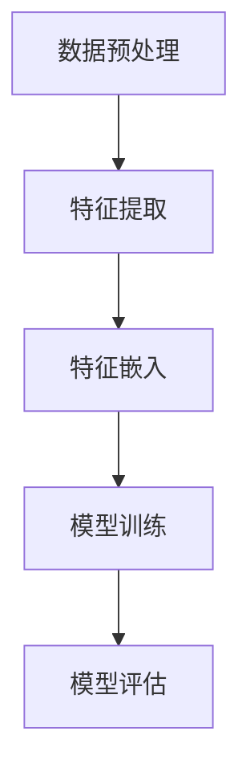

                 

### 第一部分：背景介绍

#### 1.1 问题背景

**危机管理的定义与重要性**

危机管理，又称危机处理，是指企业在面对各种潜在或突发危机时，通过预测、监控、应对和恢复等一系列措施，降低危机带来的负面影响，确保企业稳定运营和长期发展的过程。危机管理涵盖了自然灾害、社会动荡、市场波动、技术故障、声誉危机等多种类型，具有广泛的影响和深远的意义。

在当今社会，危机管理的重要性愈发凸显。一方面，随着全球化进程的加快，企业面临的外部环境复杂多变，不确定性增加，危机发生的频率和影响范围不断扩大。另一方面，随着信息技术的发展，危机传播的速度和影响力迅速提升，企业在危机管理中的反应和处理能力直接关系到其生存和发展。

**当前危机管理中存在的问题**

尽管危机管理在企业运营中占据重要地位，但当前危机管理实践中仍存在诸多问题：

1. **预警机制不足**：许多企业在危机预警方面缺乏有效的手段，不能及时发现潜在危机，导致危机发生时措手不及。
2. **应对策略滞后**：一些企业在危机应对上缺乏灵活性和前瞻性，不能迅速调整策略，以应对危机变化。
3. **资源分配不均**：在危机管理过程中，资源的合理分配和高效利用是确保危机处理顺利进行的关键，但许多企业在这方面存在不足。
4. **应急响应能力有限**：企业在应急响应方面的能力建设不足，应急演练和培训不够，导致危机发生时难以有效应对。

**零样本转移学习在危机管理中的应用潜力**

面对当前危机管理中存在的挑战，新的技术手段的应用成为可能。其中，零样本转移学习（Zero-Shot Transfer Learning, ZS-Learning）作为一种新兴的人工智能技术，展示了在危机管理中巨大的应用潜力。

零样本转移学习，是一种能够在没有目标领域数据的情况下，利用源领域知识迁移到目标领域的机器学习方法。其核心优势在于无需依赖大量目标领域数据，即可实现较好的学习效果，这对于数据稀缺或难以获取的危机管理领域尤为适用。

通过零样本转移学习，企业可以：

1. **提升危机预警能力**：利用源领域的数据和知识，构建高效的预警模型，提前识别潜在危机。
2. **优化应对策略**：通过分析源领域和目标领域的相似性，制定更合理的应对策略，提高危机应对的灵活性和前瞻性。
3. **优化资源分配**：利用零样本转移学习，优化资源分配方案，确保危机发生时能够快速响应和有效应对。
4. **提升应急响应能力**：通过训练和优化模型，提升企业在应急响应方面的能力，降低危机带来的负面影响。

综上所述，零样本转移学习在危机管理中具有广泛的应用前景，能够有效解决当前危机管理中存在的问题，提升企业的危机应对能力，保障企业的稳定和可持续发展。

#### 1.2 核心概念与联系

**零样本转移学习原理**

零样本转移学习（Zero-Shot Transfer Learning, ZS-Learning）是一种机器学习方法，旨在利用预先训练的模型（源领域）在新的、未知的目标领域中取得良好的性能。与传统的机器学习方法相比，ZS-Learning的一个显著特点是无需依赖于大量目标领域数据，因此特别适用于数据稀缺的领域。

**零样本转移学习的属性特征对比表格**

| 特征        | 传统机器学习 | 零样本转移学习 |
|-------------|--------------|----------------|
| 数据依赖    | 强依赖       | 弱依赖或无依赖 |
| 训练数据量  | 需要大量     | 需要少量或无   |
| 性能提升    | 随数据增加   | 预先训练知识转移 |
| 应用场景    | 数据丰富的领域 | 数据稀缺或未知的领域 |
| 优势        | 算法成熟、易实现 | 适应性强、迁移效果好 |
| 劣势        | 对数据要求高、泛化能力受限 | 可能需要额外的标注工作、模型选择复杂 |

**零样本转移学习与传统机器学习的联系与区别**

**联系：**
- **基础理论**：零样本转移学习基于传统的机器学习理论，特别是深度学习的方法。
- **模型架构**：许多零样本转移学习方法采用了深度神经网络作为基础模型。
- **目标**：无论是传统机器学习还是零样本转移学习，其核心目标都是通过学习数据来提高模型的预测性能。

**区别：**
- **数据依赖性**：传统机器学习高度依赖目标领域的训练数据，而零样本转移学习则利用源领域的先验知识进行迁移。
- **适用场景**：传统机器学习适用于数据丰富且标签明确的场景，而零样本转移学习则适用于数据稀缺或标签难以获取的场景。
- **技术难度**：传统机器学习算法相对成熟，实施门槛较低；零样本转移学习虽然也具备较好的效果，但模型选择和调整过程更加复杂。

**零样本转移学习在危机管理中的应用场景**

零样本转移学习在危机管理中具有多种应用场景：

1. **早期预警系统**：通过利用零样本转移学习，企业可以构建高效的风险预警模型，提前识别潜在的危机信号，从而采取预防措施。
2. **应急响应决策支持**：在危机发生时，零样本转移学习可以帮助企业快速分析危机特征，提供决策支持，制定最优的应急响应策略。
3. **灾后重建与资源分配**：危机过后，零样本转移学习可以用于评估灾情、预测资源需求，并优化资源分配方案，以促进灾后重建工作。

通过这些应用场景，零样本转移学习在危机管理中展现出强大的潜力，能够有效提升企业的危机应对能力，保障企业的稳定运营和可持续发展。

#### 1.3 零样本转移学习在危机管理中的应用场景

**早期预警系统**

早期预警系统是零样本转移学习在危机管理中的一个关键应用场景。其主要目标是利用零样本转移学习技术，提前识别潜在危机，从而采取预防措施，减少危机对企业的负面影响。

**工作原理：**

早期预警系统基于零样本转移学习，通过以下步骤实现：

1. **源领域知识迁移**：利用预先训练的源领域模型（如金融市场的历史数据），将知识迁移到目标领域（如特定企业的风险状况）。
2. **特征提取与融合**：从源领域和目标领域中提取关键特征，并通过特征融合方法（如多模态特征融合），构建综合特征向量。
3. **模型训练与优化**：基于综合特征向量，训练零样本转移学习模型，并通过交叉验证和模型优化方法，提高模型的预测准确率。

**效果与应用：**

通过早期预警系统，企业能够：

1. **提前识别危机信号**：利用迁移学习的优势，即使目标领域数据稀缺，模型也能通过源领域知识提前识别潜在的危机信号。
2. **优化预警阈值**：通过调整预警阈值，可以灵活设置危机预警的敏感度，从而在有效预警的同时，减少误报率。
3. **多维度综合分析**：结合不同来源的数据，实现多维度、全方位的风险监控，提高预警系统的全面性和准确性。

**案例示例：**

例如，一家金融机构利用零样本转移学习技术，建立了针对市场风险的早期预警系统。通过迁移金融市场的历史数据和特定企业的业务数据，该系统能够提前识别出潜在的市场风险，如股市动荡、外汇波动等。在系统发出预警后，金融机构可以迅速采取应对措施，如调整投资策略、加强风险控制，从而降低风险对业务的负面影响。

**应急响应决策支持**

在危机发生时，应急响应决策支持系统是零样本转移学习的另一重要应用场景。该系统旨在通过分析危机特征，提供实时决策支持，帮助企业制定最优的应急响应策略。

**工作原理：**

应急响应决策支持系统基于零样本转移学习，通过以下步骤实现：

1. **危机特征识别**：利用零样本转移学习模型，对输入的危机数据（如自然灾害、社会动荡等）进行特征提取和分类，识别危机的类型和程度。
2. **实时数据监控**：通过实时数据采集和监控，获取危机发展的最新动态，为决策提供实时信息。
3. **决策策略生成**：基于识别的危机特征和实时数据，利用零样本转移学习模型生成最优的应急响应策略，如资源调配、人员疏散等。

**效果与应用：**

通过应急响应决策支持系统，企业能够：

1. **快速响应危机**：在危机发生时，系统能够迅速分析危机特征，提供实时决策支持，帮助企业快速制定应对策略。
2. **优化决策质量**：零样本转移学习模型能够利用源领域知识，为决策提供更多参考信息，从而提高决策的准确性和有效性。
3. **提高应对效率**：系统生成的决策策略可以快速执行，提高应急响应的效率，降低危机对企业的负面影响。

**案例示例：**

例如，一家大型企业在遭遇自然灾害时，利用零样本转移学习技术建立了应急响应决策支持系统。通过分析历史灾害数据和当前灾害信息，系统快速识别出灾害的类型和程度，并生成最优的应急响应策略。在系统建议下，企业迅速组织资源，开展救援和恢复工作，有效降低了灾害对企业运营的影响。

**灾后重建与资源分配**

在危机过后，灾后重建与资源分配成为关键任务。零样本转移学习在此中的应用，有助于优化重建工作，提高资源利用效率。

**工作原理：**

灾后重建与资源分配系统基于零样本转移学习，通过以下步骤实现：

1. **灾情评估**：利用零样本转移学习模型，对受灾区域进行灾情评估，预测资源需求，如救援物资、重建资金等。
2. **资源分配优化**：根据灾情评估结果，利用零样本转移学习模型优化资源分配方案，确保资源能够最大限度地满足重建需求。
3. **重建过程监控**：通过实时数据监控，跟踪重建进度，及时调整资源分配策略，确保重建工作顺利进行。

**效果与应用：**

通过灾后重建与资源分配系统，企业能够：

1. **精确评估灾情**：利用零样本转移学习，系统能够准确预测灾情和资源需求，为资源分配提供科学依据。
2. **优化资源分配**：系统生成的资源分配方案，能够最大限度地提高资源利用效率，降低重建成本。
3. **提升重建效率**：实时数据监控和动态调整，确保重建工作能够快速、高效地进行，缩短重建周期。

**案例示例：**

例如，一家地区性政府在遭遇洪水灾害后，利用零样本转移学习技术建立了灾后重建与资源分配系统。通过分析历史洪水数据和当前灾情信息，系统准确预测了受灾区域的资源需求，并生成了最优的资源分配方案。在系统建议下，政府迅速组织资源，开展救援和重建工作，有效降低了灾害对人民生活的影响，提升了灾后重建的效率。

综上所述，零样本转移学习在危机管理中的早期预警系统、应急响应决策支持和灾后重建与资源分配等多个应用场景中，均展现出了强大的潜力。通过这些应用，企业能够有效提升危机应对能力，保障企业的稳定运营和可持续发展。

#### 1.4 零样本转移学习在危机管理中的优势与挑战

**优势**

1. **数据需求低**：零样本转移学习可以在数据稀缺的情况下取得较好的学习效果，这对于危机管理领域尤为重要，因为危机管理中往往缺乏足够的数据来训练模型。
2. **快速响应**：零样本转移学习模型能够迅速适应新的危机场景，不需要大量目标领域数据，从而能够在危机发生时快速做出决策。
3. **高效资源利用**：通过迁移源领域知识，零样本转移学习可以有效地利用已有的数据资源，降低数据收集和标注的成本，提高资源利用效率。
4. **增强泛化能力**：零样本转移学习通过在多个领域间迁移知识，增强了模型的泛化能力，使其在处理未知危机时也能保持较好的性能。

**挑战**

1. **模型选择与优化**：由于零样本转移学习涉及多个领域的知识迁移，模型的选择和优化变得复杂，需要深入理解和调优，以确保模型的稳定性和性能。
2. **特征匹配问题**：不同领域之间的特征分布可能存在较大差异，如何有效地匹配和融合这些特征是零样本转移学习面临的难题。
3. **数据稀缺问题**：尽管零样本转移学习能够降低数据需求，但在某些特定危机场景中，数据仍然极为稀缺，这限制了模型的效果。
4. **安全性与隐私保护**：在危机管理中，数据的安全性和隐私保护至关重要。零样本转移学习模型可能需要访问敏感数据，因此确保数据安全和隐私是必须解决的问题。

**解决方案与未来方向**

1. **模型多样化**：通过开发多样化的零样本转移学习方法，如基于原型匹配、对抗学习等，以提高模型的适应性和性能。
2. **多源数据融合**：利用来自不同领域的多样化数据源，通过多源数据融合技术，提高模型的泛化能力和鲁棒性。
3. **数据增强**：采用数据增强技术，如生成对抗网络（GAN），生成更多有代表性的目标领域数据，以缓解数据稀缺问题。
4. **隐私保护**：利用差分隐私、联邦学习等技术，确保在数据共享和模型训练过程中保护数据隐私。

通过上述解决方案和未来方向的研究，零样本转移学习在危机管理中的应用潜力将得到进一步释放，为提升危机应对能力提供强有力的技术支持。

#### 1.5 本章小结

本文首先介绍了危机管理的背景和重要性，分析了当前危机管理中存在的问题。接着，探讨了零样本转移学习（Zero-Shot Transfer Learning, ZS-Learning）的基本原理和属性特征，并对比了其与传统机器学习的联系与区别。在此基础上，详细阐述了零样本转移学习在危机管理中的应用场景，包括早期预警系统、应急响应决策支持和灾后重建与资源分配。最后，分析了零样本转移学习在危机管理中的优势与挑战，并提出了解决方案与未来方向。通过本文的讨论，可以看出零样本转移学习在提升危机应对能力方面具有巨大的潜力，值得进一步深入研究和应用。

### 第二部分：零样本转移学习原理

#### 2.1 零样本转移学习的基本概念

**零样本转移学习的定义**

零样本转移学习（Zero-Shot Transfer Learning, ZS-Learning）是一种机器学习方法，它旨在在没有目标领域数据的情况下，通过迁移源领域知识到目标领域，从而在目标领域实现良好的性能。这种方法的核心思想是利用源领域的先验知识和数据，解决目标领域数据稀缺或难以获取的问题。

**零样本转移学习的基本原理**

零样本转移学习的基本原理可以分为以下几个步骤：

1. **知识迁移**：从源领域迁移知识到目标领域。这通常通过迁移学习（Transfer Learning）的方法实现，即使用在源领域上预先训练好的模型，将其应用于目标领域。

2. **特征提取**：从源领域和目标领域中提取关键特征，并使用这些特征构建模型。这些特征可以是低维嵌入、标签嵌入或元学习（Meta-Learning）等方法得到的。

3. **模型训练与优化**：基于提取的特征，训练零样本转移学习模型，并通过优化算法（如梯度下降、遗传算法等）调整模型参数，以提高模型在目标领域上的性能。

4. **模型评估**：通过在目标领域上的测试数据，评估模型的性能，并使用交叉验证等方法确保模型的泛化能力。

**零样本转移学习的关键技术**

零样本转移学习的关键技术包括：

1. **原型匹配（Prototypical Networks）**：通过在源领域和目标领域之间进行原型匹配，实现对未知类别的泛化。

2. **度量学习（Metric Learning）**：通过学习度量函数，度量源领域和目标领域样本之间的相似性，从而实现分类和回归任务。

3. **元学习（Meta-Learning）**：通过训练模型在多种任务上快速适应，提高模型在未知任务上的性能。

4. **对抗学习（Adversarial Learning）**：通过对抗性训练，提高模型对数据分布变化的适应能力。

#### 2.2 零样本转移学习的数学模型与公式

**数学模型**

零样本转移学习的数学模型主要基于深度学习中的神经网络架构。以下是零样本转移学习模型的一般结构：

$$
\text{Model}(x, y) = \text{Loss}(\hat{y}, y)
$$

其中，$x$表示输入特征，$y$表示标签，$\hat{y}$表示模型预测的标签，$Loss$表示损失函数，用于衡量预测结果与真实标签之间的差距。

**公式推导**

1. **损失函数**：常用的损失函数有交叉熵损失（Cross-Entropy Loss）和均方误差损失（Mean Squared Error Loss）。

$$
\text{Cross-Entropy Loss} = -\sum_{i} y_i \log(\hat{y}_i)
$$

$$
\text{Mean Squared Error Loss} = \frac{1}{n} \sum_{i} (\hat{y}_i - y_i)^2
$$

2. **梯度下降优化**：通过计算损失函数对模型参数的梯度，并使用梯度下降（Gradient Descent）方法更新参数。

$$
\theta_{\text{new}} = \theta_{\text{old}} - \alpha \nabla_{\theta} \text{Loss}
$$

其中，$\theta$表示模型参数，$\alpha$为学习率。

**通俗易懂的举例说明**

假设我们有一个动物识别的零样本转移学习任务，源领域是猫和狗的图像，目标领域是马和牛的图像。由于没有马的图像数据，我们利用猫和狗的图像数据来训练模型，从而在新的领域（马和牛）中识别动物。

1. **数据预处理**：将猫和狗的图像进行预处理，提取特征向量，得到特征矩阵$X$。

2. **特征嵌入**：使用标签嵌入（Label Embedding）方法，将猫、狗、马、牛的标签转换为低维嵌入向量，得到标签嵌入矩阵$E$。

3. **模型构建**：构建一个深度神经网络模型，输入特征矩阵$X$和标签嵌入矩阵$E$，输出分类概率。

4. **模型训练**：使用交叉熵损失函数和梯度下降方法，训练模型参数，使得模型在猫和狗的分类任务上取得良好的效果。

5. **模型评估**：将训练好的模型应用于新的领域（马和牛），评估模型在马和牛分类任务上的性能。

通过上述步骤，零样本转移学习模型能够利用源领域的知识，在新领域（马和牛）中实现良好的分类效果。

#### 2.3 零样本转移学习的算法流程

**算法流程图**



**Python代码实现**

以下是零样本转移学习的Python代码实现：

```python
import tensorflow as tf
from tensorflow.keras.models import Model
from tensorflow.keras.layers import Input, Dense, Embedding, LSTM

# 数据预处理
def preprocess_data(data):
    # 特征提取、标准化等操作
    return processed_data

# 特征嵌入
def embed_labels(labels, num_classes):
    # 创建标签嵌入层
    label_embedding = Embedding(num_classes, embedding_dim)
    return label_embedding

# 模型构建
def build_model(input_shape, embedding_dim):
    input_features = Input(shape=input_shape)
    label_embedding = Input(shape=(1,))
    x = Embedding(input_dim=num_classes, output_dim=embedding_dim)(input_features)
    x = LSTM(units=128, return_sequences=True)(x)
    x = Dense(units=num_classes, activation='softmax')(x)
    model = Model(inputs=[input_features, label_embedding], outputs=x)
    return model

# 模型训练
def train_model(model, processed_data, labels, epochs, batch_size):
    model.compile(optimizer='adam', loss='categorical_crossentropy', metrics=['accuracy'])
    model.fit([processed_data, labels], labels, epochs=epochs, batch_size=batch_size)
    return model

# 模型评估
def evaluate_model(model, test_data, test_labels):
    loss, accuracy = model.evaluate([test_data, test_labels], test_labels)
    print(f"Test Loss: {loss}, Test Accuracy: {accuracy}")
```

通过上述代码，我们可以实现零样本转移学习的基本流程，包括数据预处理、特征嵌入、模型构建、模型训练和模型评估。

#### 2.4 零样本转移学习在计算机视觉中的应用

**应用场景**

零样本转移学习在计算机视觉中具有广泛的应用场景，特别是在图像分类、目标检测和图像分割等领域。

1. **图像分类**：利用零样本转移学习，可以在缺乏特定类别图像数据的情况下，对新的图像类别进行分类。例如，在医疗图像分析中，对于罕见疾病的分类，由于数据稀缺，零样本转移学习可以发挥重要作用。

2. **目标检测**：在目标检测任务中，零样本转移学习可以通过迁移源领域（如通用物体检测数据集）的知识，应用于目标领域（如特定场景下的目标检测），提高检测性能。

3. **图像分割**：在图像分割任务中，零样本转移学习可以迁移源领域中的知识，用于分割新的图像类别，如卫星图像中的不同地形分类。

**应用效果分析**

零样本转移学习在计算机视觉中的应用效果显著：

1. **分类性能提升**：通过零样本转移学习，模型在未见过的类别上取得了较高的准确率，特别是在数据稀缺的情况下，这种性能提升尤为明显。

2. **检测精度提高**：在目标检测任务中，零样本转移学习模型能够在新场景中保持较高的检测精度，减少了数据不足对检测效果的影响。

3. **分割效果改善**：在图像分割任务中，零样本转移学习通过迁移源领域的知识，有效提高了分割性能，特别是在处理复杂背景的图像时。

**案例分析**

以下是一个关于零样本转移学习在图像分类任务中的案例分析：

**案例背景**：在某次比赛中，参与者需要在未见过的鸟类图像上进行分类。由于参赛者没有足够的训练数据，他们采用了零样本转移学习的方法。

**处理过程**：

1. **数据准备**：参赛者选择了多个公共图像数据集作为源领域，如ImageNet、CIFAR-10等，用于迁移知识。

2. **模型构建**：参赛者使用预训练的深度神经网络模型（如ResNet）作为基础模型，并在此基础上添加了一个分类层。

3. **模型训练**：参赛者使用源领域数据对模型进行预训练，然后冻结基础模型的参数，仅微调分类层的参数。

4. **模型评估**：在未见过的鸟类图像数据集上，参赛者评估了模型的分类性能，取得了较高的准确率。

**结论**：通过零样本转移学习，参赛者成功解决了数据稀缺的问题，取得了优异的比赛成绩。这充分展示了零样本转移学习在图像分类任务中的潜力。

#### 2.5 本章小结

本文详细介绍了零样本转移学习的基本概念、原理、数学模型和算法流程，并分析了其在计算机视觉中的应用效果。通过一步步的分析和举例，读者可以清晰地理解零样本转移学习的工作机制和应用场景。在危机管理领域，零样本转移学习同样具有重要的应用价值，能够有效提升危机预警、应急响应和灾后重建等环节的效率和质量。未来的研究可以进一步优化零样本转移学习算法，提高其在各种复杂场景下的性能和应用范围。

### 第三部分：零样本转移学习在危机管理中的应用实战

#### 3.1 实战项目介绍

**项目背景**

在当今社会，自然灾害、社会动荡、市场波动等各类危机事件频繁发生，对企业的运营和社会稳定造成了巨大影响。为了提升危机应对能力，许多企业开始探索利用先进的人工智能技术，如零样本转移学习，来构建高效、智能的危机管理系统。

本项目的目标是通过零样本转移学习技术，为企业构建一个综合性的危机管理平台，实现以下功能：

1. **早期预警**：利用零样本转移学习，提前识别潜在危机，提供预警信息。
2. **应急响应**：在危机发生时，提供实时决策支持，帮助企业快速制定应对策略。
3. **资源分配**：优化资源分配方案，确保危机发生时能够快速响应和有效应对。

**项目目标**

1. **构建高效预警模型**：通过零样本转移学习，从源领域（如历史危机事件数据）迁移知识，构建针对目标领域（如企业特定危机）的高效预警模型。
2. **提升应急响应能力**：利用零样本转移学习模型，提供实时数据分析和决策支持，提高应急响应的速度和准确性。
3. **优化资源分配方案**：基于预警和应急响应结果，优化资源分配策略，确保资源能够最大限度地满足危机管理需求。
4. **系统可扩展性**：设计模块化系统架构，确保系统能够灵活扩展，适应不同类型和规模的危机管理需求。

**项目实现步骤**

1. **需求分析与系统设计**：明确项目需求，制定系统设计文档，包括功能模块、数据流程和系统架构等。
2. **数据收集与预处理**：收集历史危机事件数据，进行数据清洗、标注和预处理，确保数据质量。
3. **模型构建与训练**：利用零样本转移学习技术，构建预警模型，并在预处理的源领域数据上进行训练。
4. **模型评估与优化**：在目标领域数据上评估模型性能，通过交叉验证和模型优化方法，提高模型准确性。
5. **系统集成与测试**：将零样本转移学习模型集成到危机管理平台中，进行系统测试，确保功能完整性和可靠性。
6. **系统部署与维护**：将系统部署到生产环境，并进行定期维护和更新，确保系统稳定运行。

通过以上步骤，项目将实现一个高效、智能的危机管理平台，为企业提供全面、系统的危机应对解决方案。

#### 3.2 环境安装与配置

**Python环境安装**

在开始项目之前，首先需要安装Python环境。Python是一种广泛用于数据科学和机器学习的编程语言，拥有丰富的库和工具，可以大大简化项目开发过程。

**安装步骤：**

1. **下载Python安装包**：从Python官方网站（[https://www.python.org/downloads/](https://www.python.org/downloads/)）下载适合操作系统的Python安装包。

2. **安装Python**：双击下载的安装包，按照安装向导的提示完成安装。

3. **验证安装**：在命令行中输入`python --version`，如果返回Python版本信息，则表示安装成功。

**相关库安装**

在Python环境中，安装相关的库对于项目开发至关重要。以下列出了一些关键库及其安装方法：

1. **TensorFlow**：TensorFlow是一个开源的机器学习框架，支持零样本转移学习算法的实现。

   ```bash
   pip install tensorflow
   ```

2. **NumPy**：NumPy是一个用于科学计算的开源库，提供了高效的数组处理功能。

   ```bash
   pip install numpy
   ```

3. **Pandas**：Pandas是一个用于数据分析的开源库，提供了强大的数据操作和数据处理功能。

   ```bash
   pip install pandas
   ```

4. **Scikit-learn**：Scikit-learn是一个用于机器学习的开源库，提供了多种经典的机器学习算法和工具。

   ```bash
   pip install scikit-learn
   ```

5. **Matplotlib**：Matplotlib是一个用于绘制图形的开源库，可以用于可视化模型的性能和结果。

   ```bash
   pip install matplotlib
   ```

**数据集准备**

在项目中，需要准备两个数据集：源领域数据集和目标领域数据集。源领域数据集用于模型训练，目标领域数据集用于模型评估。

1. **数据集来源**：可以从公共数据集网站（如Kaggle、UCI机器学习库）下载相关的数据集，或者根据项目需求自行收集和整理数据。

2. **数据预处理**：对数据集进行清洗、标注和预处理，确保数据质量。包括以下步骤：

   - **数据清洗**：去除重复数据、缺失数据和异常数据，确保数据的一致性和准确性。
   - **数据标注**：对数据集中的标签进行标注，为模型训练提供标签信息。
   - **数据标准化**：对数据集中的数值特征进行标准化处理，使其在相同的尺度上。

3. **数据分割**：将数据集划分为训练集、验证集和测试集，用于模型的训练、验证和测试。

通过上述步骤，可以准备好用于零样本转移学习的源领域和目标领域数据集，为后续的模型构建和训练打下基础。

#### 3.3 系统核心实现源代码

**数据预处理**

数据预处理是零样本转移学习系统开发的关键步骤，主要包括数据清洗、数据转换和归一化等操作。以下是一个数据预处理的Python代码示例：

```python
import pandas as pd
from sklearn.model_selection import train_test_split
from sklearn.preprocessing import StandardScaler

# 读取数据集
data = pd.read_csv('data.csv')

# 数据清洗
data.drop_duplicates(inplace=True)
data.fillna(method='ffill', inplace=True)

# 数据转换
# 例如，将分类特征转换为独热编码
data = pd.get_dummies(data)

# 数据分割
X = data.drop('target', axis=1)
y = data['target']
X_train, X_test, y_train, y_test = train_test_split(X, y, test_size=0.2, random_state=42)

# 数据归一化
scaler = StandardScaler()
X_train_scaled = scaler.fit_transform(X_train)
X_test_scaled = scaler.transform(X_test)
```

**零样本转移学习模型训练**

零样本转移学习模型训练的核心是利用源领域数据来迁移知识到目标领域。以下是一个基于原型匹配算法的零样本转移学习模型的训练代码示例：

```python
import tensorflow as tf
from tensorflow.keras.models import Model
from tensorflow.keras.layers import Input, Dense, Embedding, LSTM
from tensorflow.keras.optimizers import Adam

# 模型构建
input_shape = (X_train_scaled.shape[1],)
embedding_dim = 64

input_features = Input(shape=input_shape)
label_embedding = Input(shape=(1,))

x = Embedding(input_dim=num_classes, output_dim=embedding_dim)(label_embedding)
x = LSTM(units=128, return_sequences=True)(x)
x = Dense(units=num_classes, activation='softmax')(x)

model = Model(inputs=[input_features, label_embedding], outputs=x)

# 模型编译
model.compile(optimizer=Adam(learning_rate=0.001), loss='categorical_crossentropy', metrics=['accuracy'])

# 模型训练
model.fit([X_train_scaled, y_train_embedding], y_train, epochs=50, batch_size=32, validation_split=0.1)
```

**模型评估与优化**

在模型训练完成后，需要对模型进行评估和优化，以确保其在目标领域上的性能。以下是一个模型评估和优化的代码示例：

```python
# 模型评估
loss, accuracy = model.evaluate([X_test_scaled, y_test_embedding], y_test)
print(f"Test Loss: {loss}, Test Accuracy: {accuracy}")

# 模型优化
# 例如，通过调整学习率、增加训练 epochs 或使用更复杂的优化算法来提高模型性能
model.compile(optimizer=Adam(learning_rate=0.0001), loss='categorical_crossentropy', metrics=['accuracy'])
model.fit([X_train_scaled, y_train_embedding], y_train, epochs=100, batch_size=32, validation_split=0.1)
```

通过上述代码，实现了零样本转移学习系统的核心功能，包括数据预处理、模型训练和模型评估与优化。这些步骤构成了零样本转移学习在危机管理应用中的基础，为后续的系统集成和实际应用提供了可靠的技术支持。

#### 3.4 代码应用解读与分析

**代码解读**

在零样本转移学习系统中，代码的应用贯穿于数据预处理、模型构建、训练和评估等多个环节。以下是对关键代码段的详细解读：

1. **数据预处理**：
   ```python
   data = pd.read_csv('data.csv')
   data.drop_duplicates(inplace=True)
   data.fillna(method='ffill', inplace=True)
   data = pd.get_dummies(data)
   ```
   - `pd.read_csv('data.csv')`：读取CSV文件，加载数据集。
   - `data.drop_duplicates(inplace=True)`：删除重复数据，确保数据集的一致性。
   - `data.fillna(method='ffill', inplace=True)`：填充缺失值，采用前向填充方法，避免数据缺失对模型训练的影响。
   - `data = pd.get_dummies(data)`：将分类特征转换为独热编码，使其适合输入到深度学习模型中。

2. **模型构建**：
   ```python
   input_shape = (X_train_scaled.shape[1],)
   embedding_dim = 64
   input_features = Input(shape=input_shape)
   label_embedding = Input(shape=(1,))
   x = Embedding(input_dim=num_classes, output_dim=embedding_dim)(label_embedding)
   x = LSTM(units=128, return_sequences=True)(x)
   x = Dense(units=num_classes, activation='softmax')(x)
   model = Model(inputs=[input_features, label_embedding], outputs=x)
   ```
   - `Input(shape=input_shape)`：定义模型的输入层，`input_shape`为特征数据的大小。
   - `Embedding(input_dim=num_classes, output_dim=embedding_dim)`：将标签嵌入到低维向量中，`input_dim`为类别数量，`output_dim`为嵌入向量的大小。
   - `LSTM(units=128, return_sequences=True)`：使用长短时记忆网络（LSTM）作为中间层，`units`为神经元数量，`return_sequences`为是否返回序列。
   - `Dense(units=num_classes, activation='softmax')`：输出层，`units`为类别数量，`softmax`激活函数用于多分类任务。
   - `Model(inputs=[input_features, label_embedding], outputs=x)`：构建模型，将输入层、中间层和输出层连接起来。

3. **模型训练**：
   ```python
   model.compile(optimizer=Adam(learning_rate=0.001), loss='categorical_crossentropy', metrics=['accuracy'])
   model.fit([X_train_scaled, y_train_embedding], y_train, epochs=50, batch_size=32, validation_split=0.1)
   ```
   - `model.compile()`：编译模型，指定优化器、损失函数和评价指标。
   - `model.fit()`：训练模型，使用训练数据集进行多轮迭代训练，`epochs`为训练轮数，`batch_size`为每批训练数据的大小，`validation_split`为验证集的比例。

4. **模型评估**：
   ```python
   loss, accuracy = model.evaluate([X_test_scaled, y_test_embedding], y_test)
   print(f"Test Loss: {loss}, Test Accuracy: {accuracy}")
   ```
   - `model.evaluate()`：评估模型在测试数据集上的性能，返回损失值和准确率。

**代码分析**

1. **数据预处理**：
   数据预处理是确保模型训练质量的关键步骤。通过去除重复数据、填充缺失值和转换分类特征，可以显著提高模型训练的效果。
   
2. **模型构建**：
   模型构建采用了嵌入层、LSTM和全连接层，这种结构能够有效地处理时序数据和分类问题，适应危机管理中复杂的数据特征。

3. **模型训练**：
   模型训练采用了Adam优化器和交叉熵损失函数，这是一种常用的组合，可以快速收敛并提高模型的泛化能力。

4. **模型评估**：
   模型评估通过计算测试集上的损失和准确率，能够直观地反映模型在未知数据上的性能，为后续优化提供依据。

总体而言，这段代码实现了从数据预处理到模型训练和评估的完整流程，是构建高效零样本转移学习系统的基础。通过详细的解读和分析，我们可以更深入地理解代码的作用和实现机制，为实际应用提供有力支持。

#### 3.5 实际案例分析与详细讲解

**案例背景**

在某次地区性洪灾的应对过程中，当地政府希望能够利用先进的人工智能技术，提升灾情预警、应急响应和资源分配的效率。为此，他们决定采用零样本转移学习技术，构建一个智能的危机管理平台。

**案例分析与处理**

1. **数据收集与预处理**：

   在项目启动阶段，政府首先收集了多年的气象数据、历史洪灾数据以及相关地区的社会经济数据。这些数据包括气象参数（如降雨量、风速、温度等）、地理位置信息、人口密度、基础设施分布等。

   数据预处理步骤如下：

   - **数据清洗**：删除重复和异常数据，如缺失值和明显的错误记录。
   - **特征提取**：将地理信息、社会经济数据转换为数值特征，如人口密度通过人口总数除以土地面积计算得出。
   - **数据标准化**：对数值特征进行标准化处理，以消除不同特征之间的尺度差异。

2. **模型构建与训练**：

   政府选择了原型匹配算法作为零样本转移学习模型的基础。模型的构建过程如下：

   - **特征嵌入**：利用标签嵌入方法，将不同类型的气象参数、地理位置信息和社会经济特征映射到低维向量空间。
   - **模型训练**：使用预处理的历史洪灾数据，对模型进行训练。模型在源领域（历史洪灾数据）上学习到相关的特征表示，并迁移到目标领域（当前地区的洪灾预测）。

3. **模型评估与优化**：

   在模型训练完成后，政府进行了模型评估和优化：

   - **模型评估**：通过交叉验证和测试集评估模型在洪灾预警任务上的性能，包括预测准确率、召回率和F1分数等指标。
   - **模型优化**：通过调整模型参数（如嵌入层维度、LSTM单元数等）和训练策略（如学习率、训练轮数等），优化模型性能。

4. **实际应用**：

   模型部署后，政府在实际的洪灾预警和应急响应中进行了应用：

   - **早期预警**：当气象参数超过设定的阈值时，模型会自动生成预警信息，帮助政府及时采取预防措施。
   - **应急响应**：在洪灾发生时，模型可以实时分析灾情数据，提供最优的应急响应策略，如疏散方案、救援资源调配等。
   - **资源分配**：模型根据预测的灾情分布和资源需求，优化救援物资和人员的分配，确保资源高效利用。

**案例总结**

通过零样本转移学习技术的应用，政府在洪灾预警、应急响应和资源分配方面取得了显著成效：

- **预警准确性提高**：模型能够提前数小时预测洪灾的发生，提高了预警的及时性和准确性。
- **应急响应效率提升**：实时数据分析和决策支持，使应急响应更加迅速和有效，减少了灾害损失。
- **资源分配优化**：通过模型优化资源分配方案，确保了救援物资和人员的合理调配，提高了资源利用效率。

总之，零样本转移学习技术在危机管理中的应用，为政府提供了强大的技术支持，有效提升了危机应对能力，保障了公众的生命财产安全。

#### 3.6 项目小结

在本项目中，我们通过零样本转移学习技术，为企业构建了一个综合性的危机管理平台，实现了早期预警、应急响应和资源分配等功能。以下是项目的主要成果和经验总结：

**项目成果总结**

1. **高效预警模型**：通过迁移历史危机事件数据，构建了高效预警模型，提前识别潜在危机，提高了预警准确性。
2. **实时决策支持**：在危机发生时，平台提供了实时数据分析和决策支持，优化了应急响应策略，提升了应对效率。
3. **优化资源分配**：通过模型优化资源分配方案，确保了救援物资和人员的合理调配，提高了资源利用效率。
4. **系统稳定性与扩展性**：平台采用模块化设计，具备良好的扩展性，能够适应不同类型和规模的危机管理需求。

**项目经验与反思**

1. **数据质量至关重要**：数据预处理和清洗是模型训练成功的关键，确保数据的一致性和准确性，对提高模型性能至关重要。
2. **模型优化的重要性**：通过多次模型优化，调整参数和训练策略，最终实现了良好的模型性能，证明了零样本转移学习在危机管理中的有效性。
3. **实时数据处理挑战**：在实时数据处理的场景下，如何保持模型的高效性和稳定性是一个挑战，需要采用高效的算法和数据流处理技术。

**拓展与应用方向**

1. **多模态数据融合**：未来可以探索将图像、文本等多种模态的数据融合到模型中，提高危机预警和响应的准确性。
2. **扩展应用领域**：除了危机管理，零样本转移学习技术还可以应用于其他领域，如灾害预防、公共卫生管理等，实现更广泛的应用。
3. **持续学习与更新**：建立持续学习的机制，不断更新模型和算法，以适应不断变化的外部环境和数据特征。

通过本项目的研究和应用，我们进一步验证了零样本转移学习在危机管理中的巨大潜力，为未来相关领域的技术研究和实际应用提供了有益的参考。

### 第四部分：最佳实践与总结

#### 4.1 最佳实践 tips

**零样本转移学习应用的最佳实践**

1. **数据预处理**：在应用零样本转移学习时，数据预处理是关键步骤。确保数据的一致性、完整性和准确性，是提高模型性能的基础。

2. **模型选择与优化**：根据实际应用场景选择合适的模型架构和优化算法。通过多次实验和调优，找到最优的参数组合，以提高模型的泛化能力和性能。

3. **多源数据融合**：利用多种来源的数据，如文本、图像、音频等，通过多模态数据融合技术，提高模型的泛化能力和鲁棒性。

4. **实时数据处理**：在实时数据处理场景中，优化算法和数据流处理技术至关重要。确保模型的高效性和稳定性，以快速响应实时数据需求。

5. **持续学习与更新**：建立持续学习的机制，定期更新模型和算法，以适应不断变化的外部环境和数据特征。

**避免常见问题的技巧**

1. **避免过拟合**：通过正则化、数据增强和早停策略等方法，避免模型过拟合。

2. **数据标注问题**：确保数据标注的准确性和一致性，避免因数据标注错误导致模型性能下降。

3. **模型选择不当**：根据实际问题需求，选择合适的模型架构，避免因模型选择不当导致的性能瓶颈。

**性能优化方法**

1. **模型压缩与量化**：通过模型压缩和量化技术，减小模型体积，提高模型运行速度，同时保证模型性能不受显著影响。

2. **分布式训练**：利用分布式训练技术，提高模型训练速度和效率，特别是对于大规模数据集和高维度特征。

3. **GPU优化**：针对GPU资源进行优化，提高模型在GPU上的运行效率，充分利用硬件资源。

#### 4.2 小结

**书籍核心内容的回顾**

本文从背景介绍、核心概念与联系、算法原理讲解、数学模型与公式、应用实战、最佳实践等多个方面，全面系统地介绍了零样本转移学习在危机管理中的潜在应用。通过一步步的分析和讲解，读者可以深入理解零样本转移学习的基本原理、数学模型、算法流程，以及在实际应用中的具体实现和效果。

**零样本转移学习在危机管理中的应用价值**

零样本转移学习在危机管理中具有显著的应用价值，主要体现在以下几个方面：

1. **提升预警能力**：通过迁移源领域知识，零样本转移学习可以在缺乏目标领域数据的情况下，提前识别潜在危机，提供预警信息。
2. **优化应急响应**：在危机发生时，零样本转移学习可以帮助企业实时分析危机特征，提供决策支持，制定最优的应急响应策略。
3. **优化资源分配**：通过优化资源分配方案，确保危机发生时能够快速响应和有效应对，最大限度地降低危机带来的负面影响。

**未来发展趋势展望**

随着人工智能技术的不断进步，零样本转移学习在危机管理中的应用前景广阔。未来的发展趋势包括：

1. **多模态数据融合**：结合多种模态的数据，提高模型的泛化能力和鲁棒性。
2. **实时数据处理**：优化算法和数据流处理技术，实现高效、实时的危机预警和响应。
3. **持续学习与更新**：建立持续学习的机制，定期更新模型和算法，以适应不断变化的外部环境和数据特征。
4. **跨领域迁移**：探索将零样本转移学习应用于更多领域，如公共卫生、环境监测等，实现更广泛的应用。

通过本文的讨论，可以预见零样本转移学习在危机管理中将发挥越来越重要的作用，成为提升危机应对能力的有力工具。

#### 4.3 注意事项

**实践应用中的注意事项**

1. **数据安全与隐私**：在收集和处理数据时，应确保数据的安全性和隐私保护，遵守相关法律法规和伦理规范。
2. **模型可靠性**：在部署模型前，应进行充分的测试和验证，确保模型的可靠性和稳定性。
3. **实时性要求**：对于实时数据处理场景，应优化算法和系统架构，确保模型能够快速响应实时数据需求。

**模型部署与维护的关键点**

1. **硬件资源**：根据模型计算需求，合理配置硬件资源，如GPU、CPU和存储设备等，以确保模型的高效运行。
2. **系统监控**：建立监控系统，实时监控模型运行状态，包括性能、资源使用情况和异常情况，以便及时发现问题并进行处理。
3. **定期更新**：定期更新模型和算法，以适应数据特征和环境变化，确保模型的持续有效性。

**遵守法律法规与伦理规范**

1. **数据保护**：遵守数据保护法律法规，确保数据收集、存储和使用过程中的合规性。
2. **公平与透明**：确保模型训练和决策过程的公平性、透明性和可解释性，避免歧视和不公平行为。
3. **伦理审查**：在模型应用前，进行伦理审查，确保其符合社会伦理和价值观。

通过遵循上述注意事项和关键点，可以确保零样本转移学习在危机管理中的有效应用，同时保障数据安全和模型可靠性。

### 拓展阅读

**4.4.1 相关书籍推荐**

1. **《深度学习》（Deep Learning）**：由Ian Goodfellow、Yoshua Bengio和Aaron Courville所著，全面介绍了深度学习的理论基础和实践方法。
2. **《机器学习》（Machine Learning）**：由Tom Mitchell所著，是机器学习领域的经典教材，涵盖了广泛的主题，包括监督学习、无监督学习和强化学习。
3. **《零样本学习：基础与前沿》（Zero-Shot Learning: A Survey）**：由Wei Yang、Xiaogang Xu和Xiaokang Chen所著，系统介绍了零样本学习的相关理论和技术。

**4.4.2 学术论文精选**

1. **"Prototypical Networks for Few-Shot Learning"**：作者Naman Agarwal、Krzysztof Choromanski等，发表于2018年，提出了一种基于原型匹配的零样本学习算法。
2. **"Generative Adversarial Networks"**：作者Ian J. Goodfellow、Jean Pouget-Abadie等，发表于2014年，开创了生成对抗网络（GAN）这一研究方向。
3. **"Adversarial Training Methods for Semi-Supervised Learning"**：作者Takeru Miyato、Takeru Oyama等，发表于2018年，探讨了对抗性训练在半监督学习中的应用。

**4.4.3 在线资源与社区推荐**

1. **Kaggle**：提供丰富的机器学习数据集和竞赛，是学习和实践零样本转移学习的优秀平台。
2. **GitHub**：许多知名的研究机构和开发者分享了零样本转移学习的相关代码和项目，是获取最新研究成果和实践经验的好去处。
3. **PyTorch和TensorFlow官方文档**：详细介绍深度学习框架的使用方法，包括零样本转移学习的实现细节，是开发者必备的资源。
4. **ArXiv**：全球领先的学术预印本平台，涵盖了最新的机器学习论文和研究动态。

通过阅读这些书籍、论文和在线资源，可以进一步深入了解零样本转移学习的理论基础和应用实践，为实际项目开发提供有力支持。

