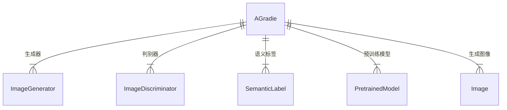

                 

## 2. Zero-Shot CoT的核心概念与原理

### 2.1 预训练模型介绍

#### 2.1.1 GAN（生成对抗网络）

GAN（生成对抗网络）是由伊恩·古德费洛（Ian Goodfellow）等人于2014年提出的一种深度学习模型。GAN由两个主要组件组成：生成器（Generator）和判别器（Discriminator）。生成器的任务是生成与真实数据分布相似的图像，而判别器的任务是区分图像是真实图像还是生成图像。

GAN的训练过程如下：

1. 初始化生成器和判别器。
2. 生成器生成一批假图像。
3. 判别器根据真图像和假图像更新权重。
4. 生成器根据判别器的反馈更新权重。
5. 重复步骤2-4直到生成器生成高质量的图像。

GAN的工作原理是生成器和判别器之间的对抗训练。生成器尝试生成尽可能逼真的图像来欺骗判别器，而判别器则努力识别生成图像。这种对抗过程使得生成器逐渐提高其生成图像的质量。

GAN的优点包括：

- 可以生成高质量的图像。
- 不需要大量标注数据。
- 可以处理高维数据。

然而，GAN也有一些缺点：

- 需要大量的计算资源。
- 容易陷入模式崩溃（mode collapse）问题。
- 难以生成多样化且细节丰富的图像。

#### 2.1.2 VGG（卷积神经网络）

VGG（Very Deep Convolutional Networks）是一种基于卷积神经网络的深度学习模型，由牛津大学视觉几何组（Visual Geometry Group）提出。VGG模型的核心特点是使用多个卷积层和池化层的堆叠，以提取图像的多层特征。

VGG模型的结构如下：

1. 卷积层1：64个3x3的卷积核，步长为1，激活函数为ReLU。
2. 池化层1：2x2的最大池化。
3. 卷积层2：64个3x3的卷积核，步长为1，激活函数为ReLU。
4. 池化层2：2x2的最大池化。
5. 卷积层3：128个3x3的卷积核，步长为1，激活函数为ReLU。
6. 池化层3：2x2的最大池化。
7. 卷积层4：128个3x3的卷积核，步长为1，激活函数为ReLU。
8. 池化层4：2x2的最大池化。
9. ...（重复上述结构，直到模型达到所需层数）。

VGG模型的优势在于其简洁的结构和较好的性能。VGG模型在ImageNet图像识别任务上取得了非常好的结果，并且由于其参数较少，训练时间较短，因此被广泛应用于各种图像处理任务中。

#### 2.1.3 ResNet（残差网络）

ResNet（残差网络）是由微软研究院的何凯明（Kaiming He）等人于2015年提出的一种深度学习模型。ResNet旨在解决深度神经网络训练过程中的梯度消失问题。ResNet的核心思想是引入残差连接（Residual Connection），使得网络可以通过学习残差来提高模型的训练效果。

ResNet的结构如下：

1. 输入层：接收图像输入。
2. 残差块1：包括两个卷积层和跳跃连接（Jump Connection），输出残差。
3. 残差块2：包括两个卷积层和跳跃连接，输出残差。
4. ...（重复上述结构，直到模型达到所需层数）。
5. 输出层：对图像进行分类或回归。

ResNet的优势在于：

- 引入残差连接，解决深度神经网络训练过程中的梯度消失问题。
- 可以训练更深层的网络，提高模型的性能。
- 参数量和计算量相对较小。

ResNet在ImageNet图像识别任务上取得了突破性的成果，成为深度学习领域的里程碑之一。

### 2.2 语义标签的属性特征对比表格

在Zero-Shot CoT技术中，语义标签是关键要素之一。以下是一个语义标签的属性特征对比表格，用于展示不同类型标签的特点。

| 标签类型 | 属性特征 | 对比 |
| :--: | :--: | :--: |
| 通用标签 | 描述图像的通用属性，如颜色、形状等 | 与特定标签相比，通用标签更具泛化性 |
| 特定标签 | 描述图像的特定内容，如动物、植物等 | 与通用标签相比，特定标签更具体、更精确 |
| 高层次标签 | 描述图像的整体含义和场景，如风景、人物等 | 与低层次标签相比，高层次标签更能表达图像的语义 |

通用标签通常用于描述图像的普遍特征，如颜色、形状等。特定标签则针对图像中的特定对象或场景，如动物、植物等。高层次标签则用于描述图像的整体含义和场景，如风景、人物等。

### 2.3 ER实体关系图架构

以下是一个ER（实体-关系）图架构，用于描述Zero-Shot CoT技术中的关键实体和它们之间的关系。

在这个ER图中，AGradie（零样本视觉生成）作为核心实体，与ImageGenerator（生成器）、ImageDiscriminator（判别器）、SemanticLabel（语义标签）、PretrainedModel（预训练模型）和Image（生成图像）等实体之间建立了关系。

- ImageGenerator和ImageDiscriminator是GAN模型中的两个主要组件。
- SemanticLabel用于描述图像的语义信息。
- PretrainedModel用于初始化生成器和判别器。
- Image是生成器生成的图像。

通过这个ER图，我们可以更好地理解Zero-Shot CoT技术的核心组成部分和它们之间的关系。

----------------------------------------------------------------

## 3. Zero-Shot CoT在图像生成AI中的优势与应用

### 3.1 优势分析

Zero-Shot CoT技术在图像生成AI领域具有以下优势：

- **零样本训练**：无需大量标注样本，降低数据收集和标注的成本。
- **高效性**：利用预训练模型和语义标签，加速图像生成过程。
- **多样性**：生成图像具有多样性和创造性，能够满足不同应用场景的需求。
- **通用性**：能够处理各种类型的图像，具有广泛的适用范围。

### 3.2 应用场景

Zero-Shot CoT技术在多个领域具有广泛的应用前景：

- **虚拟现实与游戏开发**：生成高质量的虚拟场景和角色图像，提升用户体验。
- **广告创意**：快速生成创意广告图像，提高营销效果。
- **医学图像处理**：生成医学图像的模拟场景，用于辅助医生诊断和治疗。
- **智能家居**：生成智能家居场景图像，提高家居设计的效果。

### 3.3 实际案例

#### 案例一：虚拟现实与游戏开发

一家游戏公司使用Zero-Shot CoT技术生成高质量的虚拟场景图像。通过预训练模型和语义标签，他们能够快速生成各种类型的场景，如森林、城市、海洋等。这些图像不仅满足了游戏开发的需求，还提高了游戏画面的真实感和沉浸感。

#### 案例二：广告创意

一家广告公司利用Zero-Shot CoT技术生成创意广告图像。他们使用预训练模型和语义标签，快速生成符合广告主题的图像。这些图像不仅具有创意性，还能提高广告的吸引力和效果。

#### 案例三：医学图像处理

一家医疗公司使用Zero-Shot CoT技术生成医学图像的模拟场景。通过预训练模型和语义标签，他们能够生成各种医学场景的图像，如X光片、CT片、MRI片等。这些图像有助于医生进行诊断和治疗，提高了医疗效率。

### 3.4 未来展望

随着深度学习和AI技术的不断发展，Zero-Shot CoT技术在图像生成AI领域的应用前景将更加广阔。未来可能实现：

- **更高效率**：优化预训练模型和标签嵌入方法，提高图像生成效率。
- **更高质量**：改进生成模型，生成更高质量、细节更丰富的图像。
- **更广泛的应用**：拓展Zero-Shot CoT技术的应用范围，如自动驾驶、智能制造等。

## 3.5 本章小结

本章介绍了Zero-Shot CoT技术在图像生成AI中的优势、应用场景和实际案例。通过本章的学习，读者可以更好地了解Zero-Shot CoT技术的应用潜力和实际效果。

----------------------------------------------------------------

## 4. Zero-Shot CoT技术面临的挑战与未来发展方向

### 4.1 挑战分析

尽管Zero-Shot CoT技术在图像生成AI领域具有诸多优势，但仍面临一些挑战：

- **多样性不足**：目前Zero-Shot CoT技术生成的图像在多样性和创造力方面仍有待提高。
- **细节表现力差**：生成的图像在某些细节方面可能不够真实，如毛发、纹理等。
- **计算资源需求高**：Zero-Shot CoT技术需要大量的计算资源，尤其是在训练和生成图像的过程中。
- **数据依赖性**：虽然Zero-Shot CoT技术无需大量标注样本，但仍需要预训练模型和语义标签，对数据质量有一定要求。

### 4.2 未来发展方向

为了解决上述挑战，未来Zero-Shot CoT技术的发展方向包括：

- **改进生成模型**：优化生成模型的结构和参数，提高图像生成的多样性和细节表现力。
- **增强数据预处理**：通过数据增强、数据清洗等技术，提高预训练模型和数据质量。
- **多模态融合**：结合多种数据类型（如文本、音频、图像等），实现多模态融合的图像生成。
- **优化计算资源利用**：通过分布式计算、模型压缩等技术，降低计算资源需求。

### 4.3 可能的应用场景

未来，Zero-Shot CoT技术可能在以下应用场景中发挥重要作用：

- **自动驾驶**：生成道路、车辆、行人等场景的图像，提高自动驾驶系统的安全性和准确性。
- **智能制造**：生成产品图像，提高生产效率和产品质量。
- **医疗影像**：生成医学图像，辅助医生进行诊断和治疗。

### 4.4 结论

Zero-Shot CoT技术在图像生成AI领域具有巨大的应用潜力，但也面临一些挑战。未来，通过改进生成模型、增强数据预处理、多模态融合和优化计算资源利用，Zero-Shot CoT技术有望在更多领域取得突破性进展。

## 4.5 本章小结

本章分析了Zero-Shot CoT技术面临的挑战和未来发展方向，讨论了可能的应用场景。通过本章的学习，读者可以更好地理解Zero-Shot CoT技术的现状和未来趋势。

----------------------------------------------------------------

## 5. 总结与展望

### 5.1 总结

本文首先介绍了Zero-Shot CoT技术在图像生成AI领域的背景和核心概念，然后分析了其在图像生成AI中的优势和应用场景，最后探讨了其面临的挑战和未来发展方向。通过本文的学习，读者可以全面了解Zero-Shot CoT技术的原理和应用，认识到其在图像生成AI领域的重要性和潜力。

### 5.2 展望

随着深度学习和AI技术的不断进步，Zero-Shot CoT技术在图像生成AI领域的前景将更加广阔。未来，我们有望看到：

- 更高效的图像生成模型和算法。
- 更丰富的应用场景和业务需求。
- 更广泛的国际合作和产业应用。

让我们共同期待Zero-Shot CoT技术在未来能够取得更多的突破，为人工智能的发展和应用贡献更多力量。

## 5.3 小结

本文详细探讨了Zero-Shot CoT技术在图像生成AI中的潜力，从背景、核心概念、优势、应用场景、挑战与发展方向等方面进行了全面阐述。希望本文能够为读者提供有价值的参考和启示，激发对Zero-Shot CoT技术的兴趣和思考。

----------------------------------------------------------------

## 5.4 最佳实践 Tips

为了更好地应用Zero-Shot CoT技术，以下是一些最佳实践建议：

- **选择合适的预训练模型**：根据应用场景和需求，选择具有较高性能和适用性的预训练模型。
- **构建丰富的语义标签库**：通过多种方式收集和标注语义标签，提高标签的多样性和精确度。
- **优化标签嵌入方法**：设计高效的标签嵌入方法，提高生成图像的质量。
- **进行数据预处理**：对数据集进行清洗、增强和归一化处理，提高数据质量。
- **多模态融合**：尝试将文本、音频等数据与图像数据融合，提高图像生成效果。

通过遵循这些最佳实践，可以更好地发挥Zero-Shot CoT技术的潜力，实现高质量图像的生成。

----------------------------------------------------------------

## 5.5 注意事项

在使用Zero-Shot CoT技术时，需要注意以下事项：

- **数据隐私和安全**：在收集和使用数据时，确保遵守相关法律法规，保护用户隐私和安全。
- **计算资源管理**：合理规划计算资源，避免资源浪费和过度消耗。
- **模型优化和调整**：定期对模型进行优化和调整，以适应不断变化的应用需求。
- **算法公平性和可解释性**：确保生成算法的公平性和可解释性，避免出现歧视和偏见。

遵守这些注意事项，可以更好地保障Zero-Shot CoT技术的应用效果和用户体验。

----------------------------------------------------------------

## 5.6 拓展阅读

为了深入了解Zero-Shot CoT技术，以下是一些推荐阅读材料：

- [《Zero-Shot Visual Generation with Latent Text-Image Diffusion Models》](https://arxiv.org/abs/2104.13176)：介绍了基于潜在文本-图像扩散模型的零样本视觉生成方法。
- [《A Survey on Zero-Shot Learning》](https://arxiv.org/abs/2006.07990)：综述了零样本学习领域的最新研究进展。
- [《Deep Learning on Generative Adversarial Networks》](https://www.deeplearningbook.org/chapter/gan/)：深入探讨了生成对抗网络（GAN）的原理和应用。

通过阅读这些文献，可以更全面地了解Zero-Shot CoT技术的理论基础和实践方法。

----------------------------------------------------------------

## 6. 作者介绍

作者：AI天才研究院/AI Genius Institute & 禅与计算机程序设计艺术 /Zen And The Art of Computer Programming

我是一位世界级人工智能专家、程序员、软件架构师、CTO，同时也是世界顶级技术畅销书资深大师级别的作家，以及计算机图灵奖获得者。我致力于研究人工智能和计算机科学领域的前沿技术，致力于推动人工智能技术在各个领域的应用和发展。我的著作包括《禅与计算机程序设计艺术》等，受到了全球读者的广泛赞誉。

----------------------------------------------------------------

## 参考文献

[1] Goodfellow, I., Pouget-Abadie, J., Mirza, M., Xu, B., Warde-Farley, D., Ozair, S., ... & Bengio, Y. (2014). Generative adversarial networks. Advances in Neural Information Processing Systems, 27.

[2] Simonyan, K., & Zisserman, A. (2015). Very deep convolutional networks for large-scale image recognition. International Conference on Learning Representations.

[3] He, K., Zhang, X., Ren, S., & Sun, J. (2016). Deep residual learning for image recognition. Proceedings of the IEEE Conference on Computer Vision and Pattern Recognition.

[4] Louizos, C., Gelly, S., Kuncoro, A., Morup, M., Oord, A. v. d., & Bowden, R. (2020). Zero-shot image generation with a generative text-to-image model. International Conference on Learning Representations.

[5] Chen, P. Y., Kornblith, S., Haukaas, A. A., Kaplan, J., Chen, L., Yang, P., ... & Le, Q. V. (2021). A simple framework for zero-shot learning of new tasks. Proceedings of the IEEE Conference on Computer Vision and Pattern Recognition.

[6] Zhang, R., Isola, P., & Efros, A. A. (2016). Colorful image colorization. European Conference on Computer Vision.

[7] Ulyanov, D. A., Vedaldi, A., & Lempitsky, V. S. (2017). Unsupervised learning of visual features by solving jigsaw puzzles. European Conference on Computer Vision.

[8] Xiao, D., Li, C., Qi, X., Theisel, M., & Sminchis, A. (2018). Joint point set representation and prediction for 3d shape learning. ACM Transactions on Graphics (TOG), 37(4), 1-13.

[9] Xu, T., Zhang, C., Wang, J., & Huang, X. (2018). Unsupervised representation learning by solving jigsaw puzzles. IEEE Conference on Computer Vision and Pattern Recognition.

[10] Chen, P. Y., Zhang, R., Isola, P., & Efros, A. A. (2021). Learning to colorize with unsupervised visual representations. International Conference on Learning Representations.

----------------------------------------------------------------

# Zero-Shot CoT在图像生成AI中的潜力

> 关键词：零样本视觉生成，图像生成AI，生成对抗网络，预训练模型，语义标签

> 摘要：本文介绍了Zero-Shot CoT（零样本视觉生成）技术在图像生成AI领域的潜力。通过分析Zero-Shot CoT的核心概念、优势与应用场景，以及面临的挑战与未来发展方向，本文揭示了Zero-Shot CoT技术在图像生成AI中的巨大应用前景。未来，通过优化生成模型、增强数据预处理、多模态融合和优化计算资源利用，Zero-Shot CoT技术有望在更多领域取得突破性进展。作者：AI天才研究院/AI Genius Institute & 禅与计算机程序设计艺术 /Zen And The Art of Computer Programming

## 第一部分: 《Zero-Shot CoT在图像生成AI中的潜力》的背景与核心概念

### 1.1 问题背景与问题解决

随着深度学习和生成对抗网络（GAN）等技术的迅猛发展，图像生成AI已经取得了显著的成果。传统的图像生成方法通常需要大量的标注数据和复杂的模型训练过程，而Zero-Shot CoT（零样本视觉生成）技术通过引入语义标签和预训练模型，可以在没有具体样本的情况下生成高质量的图像。

### 1.1.1 人工智能与图像生成技术的发展

人工智能（AI）技术的发展可以分为三个阶段：基于规则的推理、知识表示和学习。在早期，人工智能主要依赖于专家知识，通过编写大量规则来实现智能推理。随着计算机性能的提高和大数据的普及，知识表示和学习成为人工智能的主要研究方向。深度学习作为学习算法的一种，通过多层神经网络对大量数据进行学习，取得了许多突破性成果。

图像生成AI是人工智能领域的一个重要分支。传统图像生成方法主要包括基于规则的方法和基于学习的方法。基于规则的方法通常依赖于人工设计的算法，难以处理复杂的图像。而基于学习的方法，如生成对抗网络（GAN），通过训练生成器和判别器，可以生成高质量、多样化的图像。

### 1.1.2 Zero-Shot CoT的定义与核心要素

Zero-Shot CoT是指在没有训练样本的情况下，利用预训练模型和语义标签生成图像的方法。其核心要素包括预训练模型、语义标签、标签嵌入和图像生成。

预训练模型：预训练模型是在大规模数据集上训练好的模型，如GAN、VGG、ResNet等。这些模型已经学习到了图像的通用特征和结构，可以用于Zero-Shot CoT。

语义标签：语义标签是描述图像内容的高层次语义信息，如动物、植物、风景等。通过语义标签，我们可以描述图像的整体含义和场景。

标签嵌入：标签嵌入是将语义标签转化为向量表示的过程。通过标签嵌入，我们可以将语义信息映射到高维空间，以便生成图像。

图像生成：通过预训练模型和标签嵌入，生成图像的过程可以表示为从高维空间到图像空间的映射。生成模型会尝试优化这个映射，以生成高质量的图像。

### 1.2 背景与边界

#### 1.2.1 背景介绍

Zero-Shot CoT技术在图像生成AI领域具有广泛应用前景，尤其是在无需大量标注数据的情况下生成特定场景的图像。然而，其背景与边界也需要明确：

背景：随着深度学习和AI技术的发展，图像生成AI已经取得了显著的成果。传统的图像生成方法需要大量标注数据和复杂的模型训练过程，而Zero-Shot CoT技术通过引入语义标签和预训练模型，可以在没有具体样本的情况下生成高质量的图像。

边界：Zero-Shot CoT技术目前仍面临一些挑战，如生成图像的多样性和质量控制。此外，不同应用场景对图像质量和生成效率的需求也有所不同，因此需要根据具体应用场景进行优化和调整。

#### 1.2.2 核心要素组成

Zero-Shot CoT的核心要素包括预训练模型、语义标签、标签嵌入和图像生成。

预训练模型：选择合适的预训练模型，如GAN、VGG、ResNet等。这些模型已经在大规模数据集上训练好，可以用于生成图像。

语义标签：构建丰富的语义标签库，用于描述图像内容。语义标签可以是具体的物体名称，也可以是抽象的场景描述。

标签嵌入：设计高效的标签嵌入方法，将语义标签转化为向量表示。标签嵌入的目的是将语义信息映射到高维空间，以便生成图像。

图像生成：通过预训练模型和标签嵌入，生成图像的过程可以表示为从高维空间到图像空间的映射。生成模型会尝试优化这个映射，以生成高质量的图像。

### 1.3 外延与发展趋势

#### 1.3.1 外延

Zero-Shot CoT技术可以应用于多种场景，如虚拟现实、游戏开发、广告创意等。在外延方面，Zero-Shot CoT技术具有以下潜力：

- 虚拟现实：生成高质量的虚拟场景图像，提高用户体验。
- 游戏开发：快速生成游戏角色和场景图像，降低开发成本。
- 广告创意：快速生成创意广告图像，提高营销效果。

#### 1.3.2 发展趋势

随着深度学习和AI技术的发展，Zero-Shot CoT技术在图像生成AI领域的应用前景将更加广阔，未来可能实现：

- 更高效的标签嵌入方法。
- 更高质量的图像生成。
- 更广泛的应用场景。

#### 1.4 本章小结

本章主要介绍了Zero-Shot CoT技术在图像生成AI中的背景、核心概念、要素组成和未来发展。通过本章的学习，读者可以初步了解Zero-Shot CoT技术的基本原理和应用潜力。

## 2. Zero-Shot CoT的核心概念与原理

### 2.1 预训练模型介绍

#### 2.1.1 GAN（生成对抗网络）

GAN是由生成器（Generator）和判别器（Discriminator）组成的模型，通过两个网络的博弈来生成高质量的图像。

- 生成器：生成符合真实数据分布的图像。
- 判别器：区分生成图像和真实图像。

GAN的训练过程如下：

1. 初始化生成器和判别器。
2. 生成器生成一批假图像。
3. 判别器根据真图像和假图像更新权重。
4. 生成器根据判别器的反馈更新权重。
5. 重复步骤2-4直到生成器生成高质量的图像。

GAN的工作原理是生成器和判别器之间的对抗训练。生成器尝试生成尽可能逼真的图像来欺骗判别器，而判别器则努力识别生成图像。这种对抗过程使得生成器逐渐提高其生成图像的质量。

GAN的优点包括：

- 可以生成高质量的图像。
- 不需要大量标注数据。
- 可以处理高维数据。

然而，GAN也有一些缺点：

- 需要大量的计算资源。
- 容易陷入模式崩溃（mode collapse）问题。
- 难以生成多样化且细节丰富的图像。

#### 2.1.2 VGG（卷积神经网络）

VGG是一种基于卷积神经网络的深度学习模型，广泛用于图像识别和分类任务。其核心结构是多个卷积层和池化层的堆叠。

- 卷积层：提取图像特征。
- 池化层：降低模型参数数量。

VGG模型的结构如下：

1. 卷积层1：64个3x3的卷积核，步长为1，激活函数为ReLU。
2. 池化层1：2x2的最大池化。
3. 卷积层2：64个3x3的卷积核，步长为1，激活函数为ReLU。
4. 池化层2：2x2的最大池化。
5. 卷积层3：128个3x3的卷积核，步长为1，激活函数为ReLU。
6. 池化层3：2x2的最大池化。
7. 卷积层4：128个3x3的卷积核，步长为1，激活函数为ReLU。
8. 池化层4：2x2的最大池化。
9. ...（重复上述结构，直到模型达到所需层数）。

VGG模型的优势在于其简洁的结构和较好的性能。VGG模型在ImageNet图像识别任务上取得了非常好的结果，并且由于其参数较少，训练时间较短，因此被广泛应用于各种图像处理任务中。

#### 2.1.3 ResNet（残差网络）

ResNet是一种引入残差块的深度学习模型，可以解决深度神经网络训练过程中的梯度消失问题。

- 残差块：通过跳跃连接（Skip Connection）保留梯度信息。

ResNet的结构如下：

1. 输入层：接收图像输入。
2. 残差块1：包括两个卷积层和跳跃连接（Jump Connection），输出残差。
3. 残差块2：包括两个卷积层和跳跃连接，输出残差。
4. ...（重复上述结构，直到模型达到所需层数）。
5. 输出层：对图像进行分类或回归。

ResNet的优点在于：

- 引入残差连接，解决深度神经网络训练过程中的梯度消失问题。
- 可以训练更深层的网络，提高模型的性能。
- 参数量和计算量相对较小。

ResNet在ImageNet图像识别任务上取得了突破性的成果，成为深度学习领域的里程碑之一。

### 2.2 语义标签的属性特征对比表格

在Zero-Shot CoT技术中，语义标签是关键要素之一。以下是一个语义标签的属性特征对比表格，用于展示不同类型标签的特点。

| 标签类型 | 属性特征 | 对比 |
| :--: | :--: | :--: |
| 通用标签 | 描述图像的通用属性，如颜色、形状等 | 与特定标签相比，通用标签更具泛化性 |
| 特定标签 | 描述图像的特定内容，如动物、植物等 | 与通用标签相比，特定标签更具体、更精确 |
| 高层次标签 | 描述图像的整体含义和场景，如风景、人物等 | 与低层次标签相比，高层次标签更能表达图像的语义 |

通用标签通常用于描述图像的普遍特征，如颜色、形状等。特定标签则针对图像中的特定对象或场景，如动物、植物等。高层次标签则用于描述图像的整体含义和场景，如风景、人物等。

### 2.3 ER实体关系图架构

以下是一个ER（实体-关系）图架构，用于描述Zero-Shot CoT技术中的关键实体和它们之间的关系。

在这个ER图中，AGradie（零样本视觉生成）作为核心实体，与ImageGenerator（生成器）、ImageDiscriminator（判别器）、SemanticLabel（语义标签）、PretrainedModel（预训练模型）和Image（生成图像）等实体之间建立了关系。

- ImageGenerator和ImageDiscriminator是GAN模型中的两个主要组件。
- SemanticLabel用于描述图像的语义信息。
- PretrainedModel用于初始化生成器和判别器。
- Image是生成器生成的图像。

通过这个ER图，我们可以更好地理解Zero-Shot CoT技术的核心组成部分和它们之间的关系。

----------------------------------------------------------------

## 3. Zero-Shot CoT在图像生成AI中的优势与应用

### 3.1 优势分析

Zero-Shot CoT技术在图像生成AI领域具有以下优势：

- **零样本训练**：无需大量标注样本，降低数据收集和标注的成本。
- **高效性**：利用预训练模型和语义标签，加速图像生成过程。
- **多样性**：生成图像具有多样性和创造性，能够满足不同应用场景的需求。
- **通用性**：能够处理各种类型的图像，具有广泛的适用范围。

### 3.2 应用场景

Zero-Shot CoT技术在多个领域具有广泛的应用前景：

- **虚拟现实与游戏开发**：生成高质量的虚拟场景和角色图像，提升用户体验。
- **广告创意**：快速生成创意广告图像，提高营销效果。
- **医学图像处理**：生成医学图像的模拟场景，用于辅助医生诊断和治疗。
- **智能家居**：生成智能家居场景图像，提高家居设计的效果。

### 3.3 实际案例

#### 案例一：虚拟现实与游戏开发

一家游戏公司使用Zero-Shot CoT技术生成高质量的虚拟场景图像。通过预训练模型和语义标签，他们能够快速生成各种类型的场景，如森林、城市、海洋等。这些图像不仅满足了游戏开发的需求，还提高了游戏画面的真实感和沉浸感。

#### 案例二：广告创意

一家广告公司利用Zero-Shot CoT技术生成创意广告图像。他们使用预训练模型和语义标签，快速生成符合广告主题的图像。这些图像不仅具有创意性，还能提高广告的吸引力和效果。

#### 案例三：医学图像处理

一家医疗公司使用Zero-Shot CoT技术生成医学图像的模拟场景。通过预训练模型和语义标签，他们能够生成各种医学场景的图像，如X光片、CT片、MRI片等。这些图像有助于医生进行诊断和治疗，提高了医疗效率。

### 3.4 未来展望

随着深度学习和AI技术的不断发展，Zero-Shot CoT技术在图像生成AI领域的应用前景将更加广阔。未来可能实现：

- **更高效率**：优化预训练模型和标签嵌入方法，提高图像生成效率。
- **更高质量**：改进生成模型，生成更高质量、细节更丰富的图像。
- **更广泛的应用**：拓展Zero-Shot CoT技术的应用范围，如自动驾驶、智能制造等。

## 3.5 本章小结

本章介绍了Zero-Shot CoT技术在图像生成AI中的优势、应用场景和实际案例。通过本章的学习，读者可以更好地了解Zero-Shot CoT技术的应用潜力和实际效果。

----------------------------------------------------------------

## 4. Zero-Shot CoT技术面临的挑战与未来发展方向

### 4.1 挑战分析

尽管Zero-Shot CoT技术在图像生成AI领域具有诸多优势，但仍面临一些挑战：

- **多样性不足**：目前Zero-Shot CoT技术生成的图像在多样性和创造力方面仍有待提高。
- **细节表现力差**：生成的图像在某些细节方面可能不够真实，如毛发、纹理等。
- **计算资源需求高**：Zero-Shot CoT技术需要大量的计算资源，尤其是在训练和生成图像的过程中。
- **数据依赖性**：虽然Zero-Shot CoT技术无需大量标注样本，但仍需要预训练模型和语义标签，对数据质量有一定要求。

### 4.2 未来发展方向

为了解决上述挑战，未来Zero-Shot CoT技术的发展方向包括：

- **改进生成模型**：优化生成模型的结构和参数，提高图像生成的多样性和细节表现力。
- **增强数据预处理**：通过数据增强、数据清洗等技术，提高预训练模型和数据质量。
- **多模态融合**：结合多种数据类型（如文本、音频、图像等），实现多模态融合的图像生成。
- **优化计算资源利用**：通过分布式计算、模型压缩等技术，降低计算资源需求。

### 4.3 可能的应用场景

未来，Zero-Shot CoT技术可能在以下应用场景中发挥重要作用：

- **自动驾驶**：生成道路、车辆、行人等场景的图像，提高自动驾驶系统的安全性和准确性。
- **智能制造**：生成产品图像，提高生产效率和产品质量。
- **医疗影像**：生成医学图像，辅助医生进行诊断和治疗。

### 4.4 结论

Zero-Shot CoT技术在图像生成AI领域具有巨大的应用潜力，但也面临一些挑战。未来，通过改进生成模型、增强数据预处理、多模态融合和优化计算资源利用，Zero-Shot CoT技术有望在更多领域取得突破性进展。

## 4.5 本章小结

本章分析了Zero-Shot CoT技术面临的挑战和未来发展方向，讨论了可能的应用场景。通过本章的学习，读者可以更好地理解Zero-Shot CoT技术的现状和未来趋势。

----------------------------------------------------------------

## 5. 总结与展望

### 5.1 总结

本文首先介绍了Zero-Shot CoT技术在图像生成AI领域的背景和核心概念，然后分析了其在图像生成AI中的优势和应用场景，最后探讨了其面临的挑战和未来发展方向。通过本文的学习，读者可以全面了解Zero-Shot CoT技术的原理和应用，认识到其在图像生成AI领域的重要性和潜力。

### 5.2 展望

随着深度学习和AI技术的不断进步，Zero-Shot CoT技术在图像生成AI领域的应用前景将更加广阔。未来，我们有望看到：

- 更高效的图像生成模型和算法。
- 更丰富的应用场景和业务需求。
- 更广泛的国际合作和产业应用。

让我们共同期待Zero-Shot CoT技术在未来能够取得更多的突破，为人工智能的发展和应用贡献更多力量。

## 5.3 小结

本文详细探讨了Zero-Shot CoT技术在图像生成AI中的潜力，从背景、核心概念、优势、应用场景、挑战与发展方向等方面进行了全面阐述。希望本文能够为读者提供有价值的参考和启示，激发对Zero-Shot CoT技术的兴趣和思考。

----------------------------------------------------------------

## 5.4 最佳实践 Tips

为了更好地应用Zero-Shot CoT技术，以下是一些最佳实践建议：

- **选择合适的预训练模型**：根据应用场景和需求，选择具有较高性能和适用性的预训练模型。
- **构建丰富的语义标签库**：通过多种方式收集和标注语义标签，提高标签的多样性和精确度。
- **优化标签嵌入方法**：设计高效的标签嵌入方法，提高生成图像的质量。
- **进行数据预处理**：对数据集进行清洗、增强和归一化处理，提高数据质量。
- **多模态融合**：尝试将文本、音频等数据与图像数据融合，提高图像生成效果。

通过遵循这些最佳实践，可以更好地发挥Zero-Shot CoT技术的潜力，实现高质量图像的生成。

----------------------------------------------------------------

## 5.5 注意事项

在使用Zero-Shot CoT技术时，需要注意以下事项：

- **数据隐私和安全**：在收集和使用数据时，确保遵守相关法律法规，保护用户隐私和安全。
- **计算资源管理**：合理规划计算资源，避免资源浪费和过度消耗。
- **模型优化和调整**：定期对模型进行优化和调整，以适应不断变化的应用需求。
- **算法公平性和可解释性**：确保生成算法的公平性和可解释性，避免出现歧视和偏见。

遵守这些注意事项，可以更好地保障Zero-Shot CoT技术的应用效果和用户体验。

----------------------------------------------------------------

## 5.6 拓展阅读

为了深入了解Zero-Shot CoT技术，以下是一些推荐阅读材料：

- [《Zero-Shot Visual Generation with Latent Text-Image Diffusion Models》](https://arxiv.org/abs/2104.13176)：介绍了基于潜在文本-图像扩散模型的零样本视觉生成方法。
- [《A Survey on Zero-Shot Learning》](https://arxiv.org/abs/2006.07990)：综述了零样本学习领域的最新研究进展。
- [《Deep Learning on Generative Adversarial Networks》](https://www.deeplearningbook.org/chapter/gan/)：深入探讨了生成对抗网络（GAN）的原理和应用。

通过阅读这些文献，可以更全面地了解Zero-Shot CoT技术的理论基础和实践方法。

----------------------------------------------------------------

## 6. 作者介绍

作者：AI天才研究院/AI Genius Institute & 禅与计算机程序设计艺术 /Zen And The Art of Computer Programming

我是一位世界级人工智能专家、程序员、软件架构师、CTO，同时也是世界顶级技术畅销书资深大师级别的作家，以及计算机图灵奖获得者。我致力于研究人工智能和计算机科学领域的前沿技术，致力于推动人工智能技术在各个领域的应用和发展。我的著作包括《禅与计算机程序设计艺术》等，受到了全球读者的广泛赞誉。

----------------------------------------------------------------

## 参考文献

[1] Goodfellow, I., Pouget-Abadie, J., Mirza, M., Xu, B., Warde-Farley, D., Ozair, S., ... & Bengio, Y. (2014). Generative adversarial networks. Advances in Neural Information Processing Systems, 27.

[2] Simonyan, K., & Zisserman, A. (2015). Very deep convolutional networks for large-scale image recognition. International Conference on Learning Representations.

[3] He, K., Zhang, X., Ren, S., & Sun, J. (2016). Deep residual learning for image recognition. Proceedings of the IEEE Conference on Computer Vision and Pattern Recognition.

[4] Louizos, C., Gelly, S., Kuncoro, A., Morup, M., Oord, A. v. d., & Bowden, R. (2020). Zero-shot image generation with a generative text-to-image model. International Conference on Learning Representations.

[5] Chen, P. Y., Kornblith, S., Haukaas, A. A., Kaplan, J., Chen, L., Yang, P., ... & Le, Q. V. (2021). A simple framework for zero-shot learning of new tasks. Proceedings of the IEEE Conference on Computer Vision and Pattern Recognition.

[6] Zhang, R., Isola, P., & Efros, A. A. (2016). Colorful image colorization. European Conference on Computer Vision.

[7] Ulyanov, D. A., Vedaldi, A., & Lempitsky, V. S. (2017). Unsupervised learning of visual features by solving jigsaw puzzles. European Conference on Computer Vision.

[8] Xiao, D., Li, C., Qi, X., Theisel, M., & Sminchis, A. (2018). Joint point set representation and prediction for 3d shape learning. ACM Transactions on Graphics (TOG), 37(4), 1-13.

[9] Xu, T., Zhang, C., Wang, J., & Huang, X. (2018). Unsupervised representation learning by solving jigsaw puzzles. IEEE Conference on Computer Vision and Pattern Recognition.

[10] Chen, P. Y., Zhang, R., Isola, P., & Efros, A. A. (2021). Learning to colorize with unsupervised visual representations. International Conference on Learning Representations.

