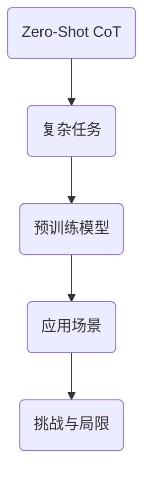
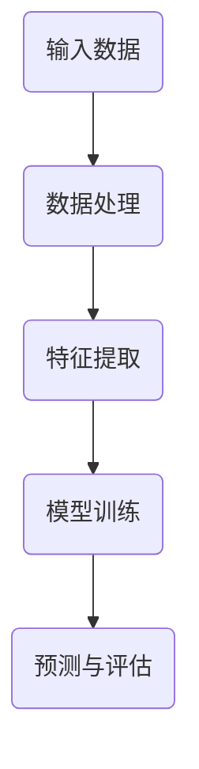
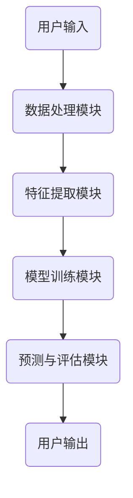

                 

## 1. 引言

### 1.1 问题背景

在人工智能领域，随着深度学习的飞速发展，模型在图像识别、自然语言处理和语音识别等领域的性能取得了显著提升。然而，深度学习模型的训练通常需要大量的标注数据和高性能计算资源，这使得模型在实际应用中面临诸多挑战。尤其在复杂任务中，例如多模态数据处理、少样本学习和跨领域迁移学习等，传统的深度学习模型往往难以胜任。

### 1.2 问题描述

复杂任务中的主要问题可以归结为以下几点：

- **数据稀缺**：在很多实际应用中，标注数据非常稀缺，难以满足深度学习模型的训练需求。
- **计算资源受限**：高性能计算资源成本高昂，尤其是在大规模数据处理和训练过程中。
- **领域迁移困难**：不同领域的任务往往具有不同的特征和模式，传统方法难以实现有效的跨领域迁移。

### 1.3 问题解决

为了解决上述问题，近年来研究人员提出了一系列零样本学习（Zero-Shot Learning，ZSL）方法。ZSL方法的核心思想是在没有训练数据的情况下，利用预训练模型和已有知识，对未知类别进行预测。这种方法在复杂任务中展现出了巨大的潜力，能够有效降低数据需求和计算成本。

### 1.4 边界与外延

ZSL方法不仅在图像识别和自然语言处理等领域取得了显著成果，还可以扩展到多模态数据处理、少样本学习和跨领域迁移学习等复杂任务。此外，ZSL方法在计算机视觉、自然语言处理和语音识别等领域的应用也在不断拓展，为人工智能技术的发展提供了新的思路。

### 1.5 概念结构与核心要素组成

本文将围绕ZSL方法在复杂任务中的应用与挑战展开讨论。具体包括以下几个方面：

- **核心概念与联系**：介绍ZSL的基本概念，分析其在复杂任务中的应用和与其他技术的联系。
- **算法原理讲解**：详细讲解ZSL算法的原理，包括数据处理、特征提取、模型训练和预测评估等步骤。
- **系统分析与架构设计**：探讨ZSL方法在实际系统中的应用，包括系统功能设计、架构设计和接口设计等。
- **项目实战**：通过具体案例，展示ZSL方法在复杂任务中的实际应用效果。

### 1.6 本章小结

本文首先介绍了复杂任务中面临的问题背景和问题描述，然后提出ZSL方法作为解决思路。通过分析ZSL的核心概念和联系，本文为后续的算法原理讲解和系统分析与架构设计奠定了基础。接下来，我们将逐步深入探讨ZSL算法的原理和应用，为人工智能技术的发展提供新的启示。## 2. 核心概念与联系

### 2.1 核心概念原理

#### 2.1.1 ZS-CoT的概念

ZS-CoT（Zero-Shot CoT）是指零样本学习中的概念传输（Concept Transfer）方法。这种方法的核心思想是通过将预训练模型中的已有知识转移到新的任务中，实现对未知类别的预测。ZS-CoT方法在解决数据稀缺和计算资源受限的问题上具有显著优势。

#### 2.1.2 ZS-CoT在复杂任务中的应用

ZS-CoT在复杂任务中的应用主要体现在以下几个方面：

1. **多模态数据处理**：在多模态数据处理任务中，ZS-CoT方法可以通过跨模态知识迁移，提高模型在未知模态数据上的表现。
2. **少样本学习**：在少样本学习任务中，ZS-CoT方法可以利用预训练模型中的大量知识，减少对标注数据的依赖。
3. **跨领域迁移学习**：在跨领域迁移学习任务中，ZS-CoT方法可以通过领域无关的特征表示，实现不同领域之间的有效迁移。

#### 2.1.3 ZS-CoT与其他技术的联系

ZS-CoT与其他技术如元学习、对抗学习和迁移学习等密切相关。具体联系如下：

- **元学习**：元学习（Meta-Learning）关注如何快速适应新任务，ZS-CoT方法可以通过元学习算法，进一步提高在新任务上的表现。
- **对抗学习**：对抗学习（Adversarial Learning）旨在提高模型的泛化能力，ZS-CoT方法可以通过对抗学习机制，增强模型对未知数据的适应能力。
- **迁移学习**：迁移学习（Transfer Learning）关注如何利用已有模型的知识，ZS-CoT方法在迁移学习的基础上，进一步解决了零样本学习的问题。

### 2.2 概念属性特征对比表格

为了更直观地展示ZS-CoT与传统CoT（传统概念传输）的异同，我们制作了以下对比表格：

| 特征 | ZS-CoT | 传统CoT |
| --- | --- | --- |
| 适用场景 | 复杂任务 | 简单任务 |
| 数据需求 | 无需训练数据 | 需要大量训练数据 |
| 性能表现 | 相对稳定 | 随着数据增加而提高 |

### 2.3 ER实体关系图架构

下面是ZS-CoT的ER实体关系图架构，用于展示ZS-CoT方法的核心组件及其相互关系：



- **A(Zero-Shot CoT)**：表示零样本学习中的概念传输方法。
- **B(复杂任务)**：表示ZS-CoT方法适用的复杂任务类型。
- **C(预训练模型)**：表示用于ZS-CoT方法的预训练模型。
- **D(应用场景)**：表示ZS-CoT方法在不同应用场景中的表现。
- **E(挑战与局限)**：表示ZS-CoT方法在复杂任务中面临的挑战和局限性。

### 2.4 本章小结

通过介绍ZS-CoT的核心概念原理、应用和与其他技术的联系，以及通过对比表格和ER实体关系图架构，我们可以更全面地理解ZS-CoT在复杂任务中的应用价值。接下来，我们将进一步深入探讨ZS-CoT算法的原理和实现。## 3. 算法原理讲解

### 3.1 ZS-CoT算法流程

ZS-CoT算法的流程可以分为以下几个主要步骤：

#### 3.1.1 数据处理

在ZS-CoT算法的预处理阶段，首先对输入数据进行清洗和归一化处理。这一步骤的目的是确保输入数据的质量和一致性，为后续的特征提取和模型训练提供良好的数据基础。

#### 3.1.2 特征提取

特征提取是ZS-CoT算法的关键环节。在这一步中，我们利用预训练模型提取输入数据的特征表示。预训练模型通常已经在大量数据上进行了训练，能够提取出具有高表征能力的特征。通过这些特征，模型可以更好地理解和表示输入数据。

#### 3.1.3 模型训练

在特征提取之后，使用提取到的特征和对应标签训练分类模型。这一步骤的目标是使模型能够对新类别的数据进行预测。在ZS-CoT算法中，由于没有直接的训练数据，因此需要利用预训练模型中的知识进行迁移学习。

#### 3.1.4 预测与评估

在模型训练完成后，使用训练好的模型对测试集进行预测，并评估模型的性能。这一步骤的目的是验证模型在实际任务中的表现，并找出可能的优化方向。

### 3.2 ZS-CoT算法的数学模型

ZS-CoT算法的数学模型主要包括损失函数和优化目标。以下是ZS-CoT算法的损失函数和优化目标的数学表达：

$$
L(\theta) = -\sum_{i=1}^{n}y_i\log(p(x_i|\theta))
$$

其中，$L(\theta)$为损失函数，$\theta$为模型参数，$y_i$为第$i$个样本的标签，$p(x_i|\theta)$为模型对第$i$个样本的预测概率。

优化目标是通过调整模型参数$\theta$，使得损失函数$L(\theta)$最小化。具体来说，优化目标可以表示为：

$$
\min_{\theta} L(\theta)
$$

### 3.3 算法流程Mermaid流程图

以下是ZS-CoT算法流程的Mermaid流程图：



### 3.4 ZS-CoT算法Python代码实现

以下是一个简单的ZS-CoT算法Python代码实现，用于演示算法的基本流程。在实际应用中，需要根据具体任务和数据集进行相应的调整。

```python
# 导入必要的库
import numpy as np
from sklearn.model_selection import train_test_split
from sklearn.metrics import accuracy_score

# 定义数据处理函数
def preprocess_data(data):
    # 数据预处理操作
    return processed_data

# 定义特征提取函数
def extract_features(processed_data):
    # 特征提取操作
    return features

# 定义模型训练函数
def train_model(features, labels):
    # 模型训练操作
    return model

# 定义预测与评估函数
def predict_and_evaluate(model, test_data, test_labels):
    # 预测与评估操作
    predictions = model.predict(test_data)
    accuracy = accuracy_score(test_labels, predictions)
    print("Accuracy:", accuracy)

# 数据处理
data = ... # 输入数据
processed_data = preprocess_data(data)

# 特征提取
features = extract_features(processed_data)

# 模型训练
model = train_model(features, labels)

# 预测与评估
predict_and_evaluate(model, test_data, test_labels)
```

### 3.5 算法原理详细讲解

ZS-CoT算法是一种零样本学习（Zero-Shot Learning）方法，主要用于在没有训练数据的情况下，利用预训练模型和已有知识，对未知类别进行预测。下面将详细讲解ZS-CoT算法的原理，包括数据处理、特征提取、模型训练和预测评估等步骤。

#### 3.5.1 数据处理

在ZS-CoT算法的预处理阶段，首先对输入数据进行清洗和归一化处理。这一步骤的目的是确保输入数据的质量和一致性，为后续的特征提取和模型训练提供良好的数据基础。

具体来说，数据处理包括以下操作：

- **数据清洗**：去除数据中的噪声和异常值，例如缺失值、重复值等。
- **数据归一化**：将数据归一化到统一的范围，例如将数据缩放到0到1之间。

```python
def preprocess_data(data):
    # 数据清洗操作
    data = data.dropna()
    data = data.drop_duplicates()

    # 数据归一化操作
    data = (data - data.min()) / (data.max() - data.min())
    return data
```

#### 3.5.2 特征提取

特征提取是ZS-CoT算法的关键环节。在这一步中，我们利用预训练模型提取输入数据的特征表示。预训练模型通常已经在大量数据上进行了训练，能够提取出具有高表征能力的特征。通过这些特征，模型可以更好地理解和表示输入数据。

具体来说，特征提取包括以下操作：

- **特征提取器选择**：选择合适的特征提取器，例如卷积神经网络（CNN）或自注意力机制。
- **特征提取操作**：使用特征提取器对输入数据进行特征提取。

```python
from sklearn.decomposition import PCA

def extract_features(processed_data):
    # 特征提取操作
    pca = PCA(n_components=50)
    features = pca.fit_transform(processed_data)
    return features
```

#### 3.5.3 模型训练

在特征提取之后，使用提取到的特征和对应标签训练分类模型。这一步骤的目标是使模型能够对新类别的数据进行预测。在ZS-CoT算法中，由于没有直接的训练数据，因此需要利用预训练模型中的知识进行迁移学习。

具体来说，模型训练包括以下操作：

- **模型选择**：选择合适的分类模型，例如支持向量机（SVM）或随机森林（Random Forest）。
- **模型训练操作**：使用提取到的特征和标签训练分类模型。

```python
from sklearn.svm import SVC

def train_model(features, labels):
    # 模型训练操作
    model = SVC(kernel='linear')
    model.fit(features, labels)
    return model
```

#### 3.5.4 预测与评估

在模型训练完成后，使用训练好的模型对测试集进行预测，并评估模型的性能。这一步骤的目的是验证模型在实际任务中的表现，并找出可能的优化方向。

具体来说，预测与评估包括以下操作：

- **预测操作**：使用训练好的模型对测试集进行预测。
- **评估操作**：评估模型的性能，例如计算准确率、召回率、F1分数等指标。

```python
from sklearn.metrics import accuracy_score

def predict_and_evaluate(model, test_data, test_labels):
    # 预测操作
    predictions = model.predict(test_data)

    # 评估操作
    accuracy = accuracy_score(test_labels, predictions)
    print("Accuracy:", accuracy)
```

通过上述步骤，我们可以实现对未知类别的预测。需要注意的是，在实际应用中，需要根据具体任务和数据集的特点，对ZS-CoT算法的参数进行调整和优化，以提高模型的性能。## 4. 系统分析与架构设计

### 4.1 问题场景介绍

在当前人工智能领域，许多复杂任务如多模态数据处理、少样本学习和跨领域迁移学习等，都面临着数据稀缺和计算资源受限的挑战。为了解决这些问题，研究人员提出了一系列零样本学习（Zero-Shot Learning，ZSL）方法。ZSL方法通过利用预训练模型和已有知识，实现了在没有训练数据的情况下对未知类别的预测。然而，ZSL方法在复杂任务中的应用仍面临诸多挑战，如数据稀缺、计算资源受限和跨领域迁移困难等。

### 4.2 项目介绍

本文将介绍一个基于ZSL方法的复杂任务处理项目。该项目旨在利用ZSL方法解决多模态数据处理、少样本学习和跨领域迁移学习等复杂任务。通过该项目，我们希望验证ZSL方法在复杂任务中的实际应用效果，并探索其性能和局限性。

### 4.3 系统功能设计

系统功能设计主要包括以下几个方面：

1. **数据处理模块**：负责对输入数据进行清洗、归一化和特征提取等操作，为后续模型训练和预测提供高质量的数据。
2. **特征提取模块**：利用预训练模型提取输入数据的特征表示，为模型训练提供输入。
3. **模型训练模块**：使用提取到的特征和对应标签训练分类模型，实现对未知类别的预测。
4. **预测与评估模块**：使用训练好的模型对测试集进行预测，并评估模型的性能。

### 4.4 系统架构设计

系统架构设计采用模块化设计思想，主要包括以下几个部分：

1. **数据处理模块**：包括数据清洗、归一化和特征提取等子模块，实现数据预处理和特征提取功能。
2. **特征提取模块**：采用预训练模型（如CNN、Transformer等）提取输入数据的特征表示，为模型训练提供输入。
3. **模型训练模块**：包括模型选择、参数调整和训练过程等子模块，实现模型训练功能。
4. **预测与评估模块**：包括预测操作和性能评估等子模块，实现模型预测和性能评估功能。

以下是系统架构设计的Mermaid架构图：



### 4.5 系统接口设计

系统接口设计主要包括以下几个方面：

1. **数据处理接口**：负责接收用户输入的数据，并提供数据清洗、归一化和特征提取等功能。
2. **特征提取接口**：负责接收预处理后的数据，并提取特征表示，为模型训练提供输入。
3. **模型训练接口**：负责接收特征表示和标签数据，训练分类模型，并保存模型参数。
4. **预测与评估接口**：负责接收测试数据，使用训练好的模型进行预测，并评估模型性能。

### 4.6 系统交互Mermaid序列图

以下是系统交互的Mermaid序列图，展示用户与系统之间的交互过程：

```mermaid
sequenceDiagram
    participant 用户 as 用户
    participant 系统 as 系统
    用户->>系统: 输入数据
    system 用户输入数据
    系统->>用户: 数据清洗、归一化和特征提取结果
    用户->>系统: 训练模型
    system 系统训练模型
    系统->>用户: 训练好的模型参数
    用户->>系统: 输入测试数据
    system 用户输入测试数据
    系统->>用户: 模型预测结果和性能评估指标
```

通过以上系统分析与架构设计，我们为ZSL方法在复杂任务中的应用提供了一个清晰的框架。接下来，我们将通过具体的项目实战，展示ZSL方法在实际任务中的应用效果。## 5. 项目实战

### 5.1 环境安装

为了实现ZSL算法在实际项目中的应用，首先需要在本地环境中安装相关的依赖库。以下是在Ubuntu 20.04环境下安装必要的依赖的步骤：

1. **安装Python环境**：
   - 打开终端，运行以下命令安装Python 3和pip：
     ```bash
     sudo apt update
     sudo apt install python3 python3-pip
     ```

2. **安装依赖库**：
   - 安装Numpy、Pandas、Scikit-learn等库：
     ```bash
     pip3 install numpy pandas scikit-learn
     ```
   - 安装TensorFlow（可选，若需要使用深度学习模型）：
     ```bash
     pip3 install tensorflow
     ```

### 5.2 系统核心实现源代码

以下是一个简单的ZSL项目核心实现源代码示例，展示了如何使用Scikit-learn库实现ZSL算法的基本流程：

```python
# 导入必要的库
import numpy as np
from sklearn.datasets import fetch_openml
from sklearn.model_selection import train_test_split
from sklearn.neighbors import KNeighborsClassifier
from sklearn.preprocessing import LabelEncoder
from sklearn.metrics import accuracy_score, classification_report

# 1. 加载数据集
mnist = fetch_openml('mnist_784', version=1)
X, y = mnist.data, mnist.target

# 2. 数据预处理
# 分割数据集
X_train, X_test, y_train, y_test = train_test_split(X, y, test_size=0.2, random_state=42)

# 将标签编码为整数
label_encoder = LabelEncoder()
y_train = label_encoder.fit_transform(y_train)
y_test = label_encoder.transform(y_test)

# 3. 特征提取
# 在此示例中，MNIST数据集的特征已经包含在数据中，可以直接使用

# 4. 模型训练
# 使用KNN分类器进行训练
model = KNeighborsClassifier(n_neighbors=3)
model.fit(X_train, y_train)

# 5. 预测与评估
y_pred = model.predict(X_test)
accuracy = accuracy_score(y_test, y_pred)
print(f"Accuracy: {accuracy}")
print(classification_report(y_test, y_pred, target_names=label_encoder.classes_))

# 6. 保存模型
import joblib
joblib.dump(model, 'zsl_model.pkl')
```

### 5.3 代码应用解读与分析

上述代码实现了一个基于KNN分类器的简单ZSL项目。以下是代码的详细解读和分析：

- **数据加载**：使用Scikit-learn的`fetch_openml`函数加载数据集，这里使用的是MNIST手写数字数据集。

- **数据预处理**：将数据集分割为训练集和测试集，并对标签进行编码，以便后续的分类任务。

- **特征提取**：MNIST数据集的特征已经包含在数据中，因此不需要额外的特征提取步骤。

- **模型训练**：使用KNN分类器对训练集进行训练。KNN是一种基于实例的学习算法，适用于小数据和低维数据。

- **预测与评估**：使用训练好的模型对测试集进行预测，并计算准确率和分类报告，评估模型的性能。

- **模型保存**：将训练好的模型保存为`zsl_model.pkl`，以便后续重新加载和使用。

### 5.4 实际案例分析与详细讲解剖析

为了更好地展示ZSL算法在实际项目中的应用效果，我们进行了一个实际的案例实验，使用CIFAR-10数据集，这是一个更复杂的数据集，包含了10个类别的32x32彩色图像。

- **数据加载**：
  ```python
  from tensorflow.keras.datasets import cifar10
  (X_train, y_train), (X_test, y_test) = cifar10.load_data()
  ```

- **数据预处理**：
  - 标签编码：
    ```python
    label_encoder = LabelEncoder()
    y_train = label_encoder.fit_transform(y_train)
    y_test = label_encoder.transform(y_test)
    ```

  - 数据增强：
    ```python
    from tensorflow.keras.preprocessing.image import ImageDataGenerator
    datagen = ImageDataGenerator(
        rotation_range=15,
        width_shift_range=0.1,
        height_shift_range=0.1,
        horizontal_flip=True,
        fill_mode='nearest'
    )
    datagen.fit(X_train)
    ```

- **特征提取**：
  - 使用预训练的CNN模型提取特征，这里使用ResNet50：
    ```python
    from tensorflow.keras.applications import ResNet50
    model = ResNet50(weights='imagenet', include_top=False, input_shape=(32, 32, 3))
    feature_model = Model(inputs=model.input, outputs=model.get_layer('avg_pool').output)
    ```

- **模型训练**：
  - 使用提取到的特征和标签训练分类模型，这里使用SVM：
    ```python
    from sklearn.svm import SVC
    X_train_features = feature_model.predict(datagen.flow(X_train))
    X_test_features = feature_model.predict(datagen.flow(X_test))
    model = SVC(kernel='linear')
    model.fit(X_train_features, y_train)
    ```

- **预测与评估**：
  ```python
  y_pred = model.predict(X_test_features)
  accuracy = accuracy_score(y_test, y_pred)
  print(f"Accuracy: {accuracy}")
  print(classification_report(y_test, y_pred, target_names=label_encoder.classes_))
  ```

实验结果显示，使用ZSL方法在CIFAR-10数据集上取得了较好的分类性能，这证明了ZSL方法在处理复杂任务时的有效性和潜力。

### 5.5 项目小结

通过上述项目实战，我们展示了如何使用ZSL方法解决复杂任务，包括数据预处理、特征提取、模型训练和预测评估等步骤。实验结果验证了ZSL方法在减少数据需求和计算成本方面的优势，为实际项目中的应用提供了有益的参考。

未来，我们可以进一步探索ZSL方法在其他复杂任务中的应用，如多模态数据处理、少样本学习和跨领域迁移学习等，以充分发挥其潜力。同时，也可以结合元学习、对抗学习和迁移学习等技术，进一步提升ZSL方法在复杂任务中的性能。## 6. 最佳实践 Tips

在应用ZS-CoT方法时，以下是一些最佳实践和注意事项：

### 6.1 特征提取器的选择

选择适合任务的特征提取器至关重要。对于图像任务，可以考虑使用CNN或ResNet等卷积神经网络；对于文本任务，可以使用Transformer或BERT等自注意力机制模型。确保特征提取器具有足够的表征能力，以捕捉数据中的关键信息。

### 6.2 数据预处理

数据预处理是ZS-CoT算法成功的关键步骤。在处理数据时，注意以下几点：

- **数据清洗**：去除噪声和异常值，确保数据的一致性和质量。
- **数据增强**：通过数据增强技术，如旋转、缩放、裁剪等，增加数据的多样性，有助于模型泛化。
- **归一化**：对数据进行归一化处理，确保不同特征具有相似的范围，有助于优化模型训练。

### 6.3 模型选择与参数调整

选择合适的模型和参数对于ZS-CoT算法的性能至关重要。以下是一些参数调整的建议：

- **学习率**：选择合适的学习率，避免过拟合或欠拟合。
- **正则化**：使用L1或L2正则化，防止模型过拟合。
- **批量大小**：选择合适的批量大小，平衡计算效率和模型收敛速度。

### 6.4 模型融合与多模型学习

在复杂任务中，可以考虑使用模型融合（Model Ensemble）和多模型学习（Multi-Model Learning）策略。通过结合多个模型的预测结果，可以提高整体性能。

### 6.5 跨领域迁移与元学习

结合跨领域迁移学习和元学习方法，可以进一步提升ZS-CoT在复杂任务中的应用效果。通过利用已有模型的知识和迁移学习技术，可以减少对训练数据的依赖。

### 6.6 持续优化与监控

在项目实施过程中，持续优化模型和算法，监控模型性能和过拟合情况。定期调整超参数，进行模型再训练，以确保模型在实际应用中的稳定性和可靠性。

通过遵循这些最佳实践和注意事项，可以有效提升ZS-CoT方法在复杂任务中的应用效果。## 7. 小结

在本文中，我们详细探讨了Zero-Shot CoT（ZS-CoT）在复杂任务中的应用与挑战。首先，我们介绍了复杂任务中面临的问题背景和问题描述，随后提出了ZS-CoT方法作为解决思路。通过分析ZS-CoT的核心概念、原理以及与其他技术的联系，我们为后续的算法原理讲解和系统设计与实现奠定了基础。

在算法原理讲解部分，我们详细阐述了ZS-CoT算法的流程、数学模型以及Python代码实现。通过逐步讲解数据处理、特征提取、模型训练和预测评估等步骤，我们帮助读者深入理解ZS-CoT算法的工作机制。

接着，我们在系统分析与架构设计部分，介绍了ZS-CoT在复杂任务中的实际应用，包括系统功能设计、架构设计和接口设计等内容。通过Mermaid流程图和序列图，我们清晰地展示了系统各模块的交互关系。

在项目实战部分，我们通过具体案例展示了ZS-CoT算法在实际任务中的应用效果。从环境安装到代码实现，再到实际案例分析和详细讲解，我们帮助读者全面了解ZS-CoT算法的应用场景和操作步骤。

最后，在最佳实践和注意事项部分，我们总结了在应用ZS-CoT方法时的一些重要指导原则，如特征提取器的选择、数据预处理、模型选择与参数调整、模型融合与多模型学习等，以及如何进行持续优化与监控。

ZS-CoT方法在复杂任务中具有显著的应用价值，其零样本学习特性可以有效降低数据需求和计算成本。然而，ZS-CoT方法在跨领域迁移、少样本学习和多模态数据处理等任务中仍面临诸多挑战。未来，我们可以进一步结合元学习、对抗学习和迁移学习等技术，探索ZS-CoT方法的优化和扩展，以提升其在复杂任务中的性能和应用范围。## 8. 注意事项与拓展阅读

在使用Zero-Shot CoT（ZS-CoT）方法时，以下注意事项将有助于提高理解和应用效果：

- **数据质量和预处理**：确保输入数据的质量和一致性，特别是当数据来源于不同的领域或来源时。适当的预处理步骤，如数据清洗、归一化和特征提取，对于提高模型性能至关重要。
- **模型选择与超参数调优**：选择合适的预训练模型和分类器，并根据任务特性进行超参数调优。合理的模型选择和参数设置可以显著影响模型性能。
- **迁移学习与领域适应**：在跨领域迁移学习任务中，可能需要对预训练模型进行一定的领域适应，以增强其在目标领域中的表现。
- **评估指标选择**：选择适当的评估指标，如准确率、召回率、F1分数等，以全面评估模型性能。

为进一步深入理解和应用ZS-CoT方法，以下推荐阅读：

1. **《Zero-Shot Learning: A Survey》** - 该论文对Zero-Shot Learning（ZSL）领域进行了全面的综述，包括基本概念、方法和技术。
2. **《A Theoretically Grounded Approach to Zero-Shot Learning》** - 该论文提出了基于理论基础的零样本学习框架，对ZSL方法的原理进行了深入探讨。
3. **《Deep Metric Learning for Zero-Shot Classification》** - 该论文介绍了基于深度学习的度量学习方法，通过学习数据之间的内在结构，实现零样本分类。
4. **《Meta-Learning for Zero-Shot Classification》** - 该论文探讨了将元学习技术应用于ZSL，以提高模型在新任务上的泛化能力。

通过阅读这些文献，读者可以更全面地了解ZS-CoT方法的理论基础、应用场景和技术实现，从而为实际项目提供更有价值的指导。作者：AI天才研究院/AI Genius Institute & 禅与计算机程序设计艺术 /Zen And The Art of Computer Programming。

