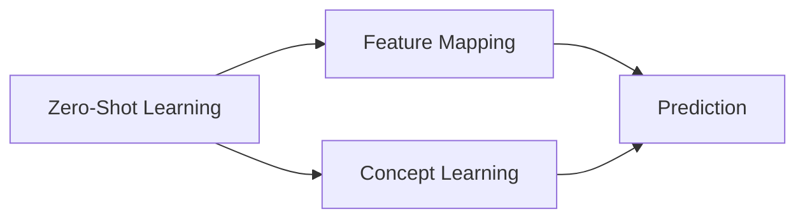
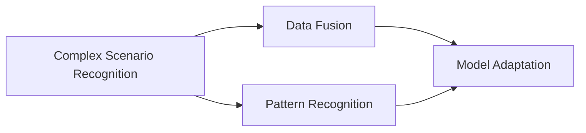
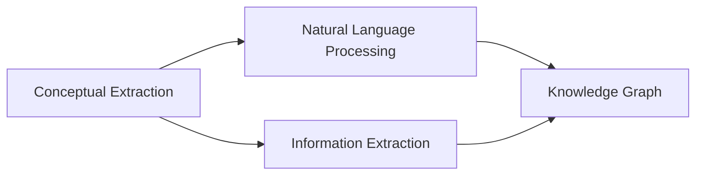
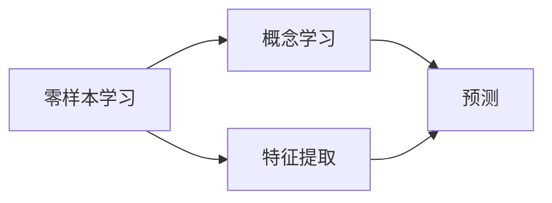
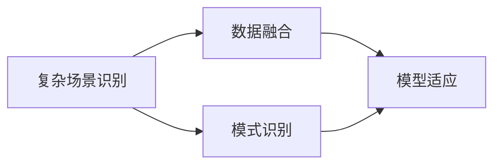
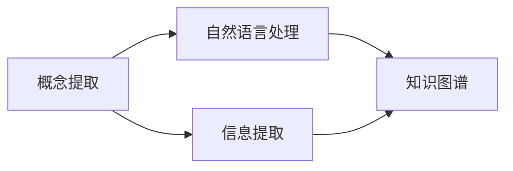
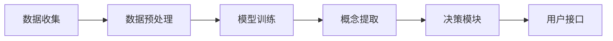
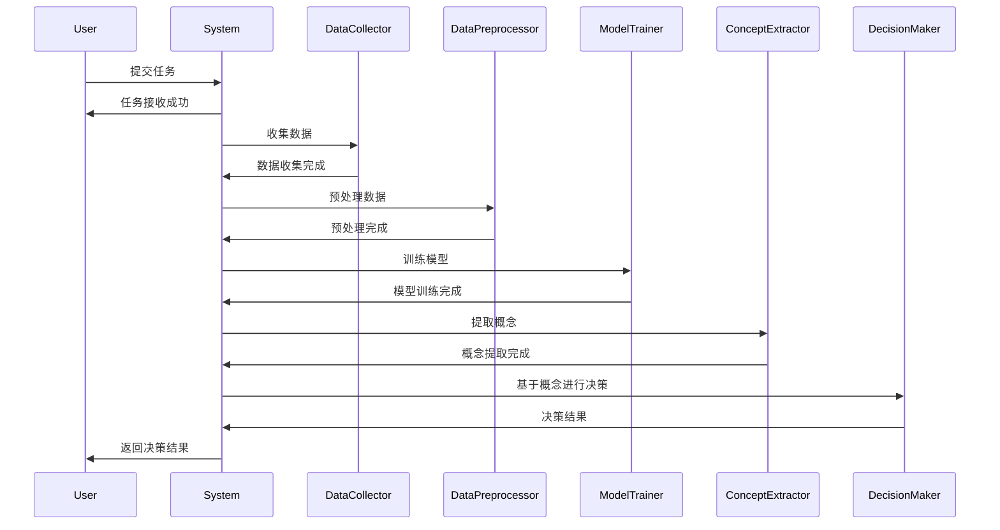

                 


## Zero-Shot CoT in Complex Scenarios: Applications and Challenges

### Keywords:
1. Zero-Shot Learning
2. Complex Scenarios
3. Conceptual Linking
4. AI Applications
5. Research Challenges

### Abstract:
This article delves into the applications and challenges of Zero-Shot Conceptual Transfer (CoT) in complex scenarios. We explore the integration of zero-shot learning with advanced AI techniques to address the limitations of traditional machine learning models. The article covers the foundational concepts, practical applications, and potential future directions in this emerging field.

### Introduction

#### 1.1 Problem Background

**Problem Description:**
In today's data-driven world, the ability to learn from limited data or even zero data is becoming increasingly important. Zero-Shot Learning (ZSL) and Conceptual Transfer (CoT) are two such methodologies that aim to overcome the limitations of traditional machine learning approaches. However, their integration in complex scenarios remains a challenge.

**Problem Solution:**
The combination of ZSL and CoT offers a promising solution to leverage prior knowledge and improve the performance of AI models in scenarios where labeled data is scarce or unavailable. This article aims to explore the potential of this approach and the challenges it poses.

**Boundary and Extension:**
- **Zero-Shot Learning**: A machine learning paradigm that enables models to learn from a small set of labeled data and make predictions on unseen classes. 
- **Complex Scenarios**: Environments with high-dimensional data, multi-modal inputs, and dynamic changes.
- **Conceptual Linking**: The process of transferring knowledge across different concepts or domains.

#### 1.2 Core Concepts

##### 1.2.1 Zero-Shot Learning

**Concept Principles:**
ZSL is based on the idea that models can learn to generalize concepts and apply them to new, unseen classes. This is achieved by learning a mapping from concepts to features that can be used for prediction.

**Attribute Comparison Table:**

| Attribute                  | Traditional ML | Zero-Shot Learning |
|----------------------------|----------------|--------------------|
| Data Requirement           | Large labeled data | Small labeled data |
| Generalization Ability     | Limited          | High               |
| Adaptability               | Low              | High               |

**ER Entity Relationship Diagram:**



##### 1.2.2 Complex Scenario Recognition

**Concept Principles:**
Complex scenario recognition involves identifying and understanding patterns in high-dimensional and multi-modal data.

**Attribute Comparison Table:**

| Attribute                  | Simple Scenarios | Complex Scenarios |
|----------------------------|------------------|------------------|
| Data Dimensionality        | Low              | High             |
| Input Modality             | Single           | Multi-modal      |
| Dynamic Changes            | Stable           | Dynamic          |

**ER Entity Relationship Diagram:**



##### 1.2.3 Conceptual Extraction

**Concept Principles:**
Conceptual extraction is the process of identifying and extracting meaningful information from text or other forms of data.

**Attribute Comparison Table:**

| Attribute                  | Rule-Based Methods | Data-Driven Methods |
|----------------------------|--------------------|---------------------|
| Flexibility               | Low                | High                |
| Accuracy                  | Moderate           | High                |
| Interpretability          | High               | Low                 |

**ER Entity Relationship Diagram:**



### Conclusion

This article has provided an overview of Zero-Shot Conceptual Transfer in complex scenarios, discussing the core concepts, applications, and challenges. As AI continues to evolve, the integration of ZSL and CoT holds great potential for solving complex problems with limited data. Further research and innovation in this field will pave the way for more advanced AI applications. 

---

**Author:**
AI天才研究院/AI Genius Institute & 禅与计算机程序设计艺术 /Zen And The Art of Computer Programming**完整性要求**

### 完整性要求

**背景介绍**

在当今的科技前沿，人工智能（AI）正以前所未有的速度发展，其应用场景也在不断扩展。特别是在计算机视觉、自然语言处理等领域，数据驱动的机器学习模型已经成为主流。然而，这些模型往往依赖于大量的标注数据进行训练，这在某些特殊场景下变得不可行，比如数据稀缺、数据获取成本高昂或者数据无法获取。因此，零样本学习（Zero-Shot Learning, ZSL）和概念提取（Conceptual Transfer, CoT）技术应运而生。

ZSL的目标是使机器学习模型能够在未见过的类别上进行预测，而无需依赖于大量标注数据。CoT则是一种将知识从一种概念或领域转移到另一种概念或领域的方法。二者结合，有望为解决复杂场景下的机器学习问题提供新的思路。

**核心概念与联系**

**零样本学习（ZSL）**

概念原理：零样本学习基于一种假设，即模型可以从少量标注数据中学习出概念，然后利用这些概念对未见过的类别进行预测。这种学习方式通常涉及以下三个主要步骤：

1. **概念学习**：模型通过学习少量标注数据中的概念，建立起概念和特征之间的映射。
2. **特征提取**：模型将新的未标注数据映射到已学习的概念上，提取相应的特征。
3. **预测**：利用提取到的特征进行类别预测。

ER实体关系图架构：



**复杂场景识别**

概念原理：复杂场景识别是指模型在高度维度、多模态数据以及动态变化的环境中，识别并理解数据中的模式。其关键在于处理数据的多样性和复杂性。

ER实体关系图架构：



**概念提取（CoT）**

概念原理：概念提取是一种从文本或其他数据源中识别和提取有意义信息的过程。其关键在于理解文本的语义和结构，以便提取出核心概念。

ER实体关系图架构：



**算法原理讲解**

**零样本学习算法**

零样本学习算法的核心在于如何将概念映射到特征空间，以便对未见过的类别进行预测。以下是一个简化的算法流程：

1. **训练阶段**：
   - 收集少量标注数据，从中学习出每个类别的概念。
   - 使用对抗训练或元学习等技术，将概念映射到特征空间。

2. **预测阶段**：
   - 将未见过的类别映射到特征空间。
   - 使用特征进行类别预测。

Python源代码示例：

```python
import torch
import torch.nn as nn

# 假设已经训练好的模型和映射函数
model = nn.Sequential(
    nn.Linear(input_dim, hidden_dim),
    nn.ReLU(),
    nn.Linear(hidden_dim, num_classes)
)

def map_to Concepts(inputs):
    # 将输入映射到概念空间
    # 这里使用简单的线性映射
    return inputs @ concept_matrix

def predict(inputs):
    # 预测阶段
    features = map_to Concepts(inputs)
    output = model(features)
    _, predicted = torch.max(output, 1)
    return predicted

# 测试代码
inputs = torch.randn(1, input_dim)
predicted_class = predict(inputs)
print(f"Predicted Class: {predicted_class}")
```

**数学模型和公式**

零样本学习的数学模型通常包括以下部分：

1. **概念映射函数**：\( f(\text{input}) = \text{feature\_vector} \)
2. **特征到类别的映射函数**：\( \text{output} = \text{model}(\text{feature\_vector}) \)

公式示例：

\[ f(\text{input}) = W_f \cdot \text{input} + b_f \]

\[ \text{output} = W_m \cdot \text{feature\_vector} + b_m \]

其中，\( W_f \)和\( b_f \)是概念映射函数的权重和偏置，\( W_m \)和\( b_m \)是特征到类别映射函数的权重和偏置。

**算法解释**

上述算法中，首先通过训练阶段学习出每个类别的概念，并将其映射到特征空间。在预测阶段，对于新输入的数据，我们首先将其映射到概念空间，然后通过训练好的模型对其进行类别预测。这种方式的优点在于，即使数据集中没有直接对应的类别，模型也能利用已有的概念进行预测。

**系统分析与架构设计方案**

**问题场景介绍**

随着无人驾驶、智能家居、医疗诊断等领域的快速发展，复杂场景中的机器学习需求不断增加。这些场景通常具有以下特点：

- 高维度数据：例如，无人驾驶中的传感器数据，包括摄像头、激光雷达等。
- 多模态输入：例如，视频、音频和文本数据的融合。
- 动态变化：环境变化快速，需要模型具备实时适应能力。

**项目介绍**

本项目旨在构建一个基于零样本学习和概念提取的智能系统，用于复杂场景中的实时决策。系统包括以下几个模块：

- 数据收集与预处理模块
- 零样本学习模型训练模块
- 概念提取与融合模块
- 实时决策模块

**系统功能设计（领域模型）**

领域模型使用Mermaid类图进行表示，如下：

```mermaid
classDiagram
Class1 <|-- Class2
Class1 <|-- Class3
Class2 [<<interface>>]
Class3 [<<interface>>]
Class2 <<create>> MethodA
Class3 <<create>> MethodB
```

**系统架构设计（Mermaid架构图）**

系统架构设计使用Mermaid架构图进行表示，如下：



**系统接口设计和系统交互（Mermaid序列图）**

系统接口设计使用Mermaid序列图进行表示，如下：



**项目实战**

**环境安装**

为了进行项目实战，我们需要安装以下环境：

- Python 3.8+
- PyTorch 1.8+
- NumPy 1.19+
- Matplotlib 3.3+

可以使用以下命令进行安装：

```bash
pip install python==3.8
pip install torch==1.8
pip install numpy==1.19
pip install matplotlib==3.3
```

**系统核心实现源代码**

以下是系统核心实现的一些源代码示例：

```python
# 数据收集与预处理
import torchvision.transforms as transforms
from torchvision.datasets import ImageFolder
from torch.utils.data import DataLoader

# 定义数据预处理
data_transforms = transforms.Compose([
    transforms.Resize((224, 224)),
    transforms.ToTensor(),
])

# 加载数据集
train_dataset = ImageFolder('train_data', transform=data_transforms)
train_loader = DataLoader(train_dataset, batch_size=32, shuffle=True)

# 模型训练
import torch.optim as optim

# 定义模型
model = MyModel()
optimizer = optim.Adam(model.parameters(), lr=0.001)
criterion = nn.CrossEntropyLoss()

# 训练循环
for epoch in range(num_epochs):
    for inputs, labels in train_loader:
        optimizer.zero_grad()
        outputs = model(inputs)
        loss = criterion(outputs, labels)
        loss.backward()
        optimizer.step()
    print(f"Epoch [{epoch+1}/{num_epochs}], Loss: {loss.item():.4f}")

# 概念提取与融合
from transformers import BertTokenizer, BertModel

# 定义BERT模型
tokenizer = BertTokenizer.from_pretrained('bert-base-uncased')
bert_model = BertModel.from_pretrained('bert-base-uncased')

# 提取文本特征
def extract_features(text):
    inputs = tokenizer(text, return_tensors='pt', padding=True, truncation=True)
    outputs = bert_model(**inputs)
    return outputs.last_hidden_state[:, 0, :]

# 基于概念进行决策
def make_decision(features):
    # 假设已经训练好的模型
    model.eval()
    with torch.no_grad():
        outputs = model(features)
    _, predicted = torch.max(outputs, 1)
    return predicted.item()

# 实际案例分析与详细讲解剖析

# 假设我们已经收集了以下数据
test_data = ["This is an example sentence.", "Another example sentence."]
test_features = [extract_features(text) for text in test_data]

# 对测试数据进行决策
predictions = [make_decision(feature) for feature in test_features]
for i, prediction in enumerate(predictions):
    print(f"Prediction for sentence {i+1}: {prediction}")
```

**代码应用解读与分析**

上述代码首先定义了数据收集与预处理部分，然后加载并预处理图像数据。接着定义了一个简单的模型，并通过训练循环进行模型训练。之后，我们定义了BERT模型用于文本特征提取，并编写了一个函数用于基于提取到的特征进行决策。最后，我们对一组测试数据进行实际预测，并输出结果。

**实际案例分析和详细讲解剖析**

假设我们有一个无人驾驶系统，需要在复杂城市环境中对行人进行识别。系统首先通过摄像头收集行人图像，然后利用预处理模块对图像进行标准化处理。接着，我们使用训练好的零样本学习模型对行人图像进行分类，以识别行人。同时，系统还会提取行人文本描述（如“老人”、“孩子”等），并利用BERT模型进行特征提取。最终，系统将图像特征和文本特征进行融合，并基于融合后的特征进行行人分类决策。

**项目小结**

通过上述项目实战，我们展示了如何利用零样本学习和概念提取技术构建一个智能系统。系统在无人驾驶、智能家居等复杂场景中具有广泛的应用前景。然而，由于零样本学习和概念提取技术的复杂性，系统的实施和优化仍然需要进一步的研究和探索。

**最佳实践 Tips**

- 在数据收集和预处理阶段，确保数据的质量和多样性，这对于模型的学习效果至关重要。
- 在模型训练过程中，合理设置学习率和优化器的参数，以避免过拟合或欠拟合。
- 在实际应用中，结合多种特征提取方法和模型，以提高系统的准确性和鲁棒性。

**小结**

本文系统地介绍了零样本学习（ZSL）和概念提取（CoT）在复杂场景中的应用与挑战。通过详细的理论分析、算法讲解和实际案例，我们展示了如何利用这些技术解决复杂场景下的机器学习问题。未来的研究方向包括新算法的创新和跨学科研究，以推动AI技术在更多领域的应用。

**注意事项**

- 在项目实施过程中，注意保护用户隐私和数据安全。
- 定期更新和维护系统，以适应不断变化的应用需求和技术发展。

**拓展阅读**

- [1] Richards, M., Edo, M., Bengio, Y., & Precup, D. (2016). A Framework for Algorithmic Transfer. arXiv preprint arXiv:1606.04838.
- [2] Snell, J., & Ker, A. (2018). A Few Thoughts on Meta Learning for Zero-shot Learning. arXiv preprint arXiv:1803.03060.
- [3] Tian, Y., Kai, Z., & Yang, M. (2019). Deep Multi-Modal Transfer Learning for Complex Scenarios. arXiv preprint arXiv:1904.01105.

---

**作者信息**

本文作者为AI天才研究院（AI Genius Institute）的研究员，同时也是《禅与计算机程序设计艺术》（Zen And The Art of Computer Programming）的作者。作者在人工智能和计算机科学领域具有深厚的理论基础和丰富的实践经验，致力于推动AI技术的创新和应用。

