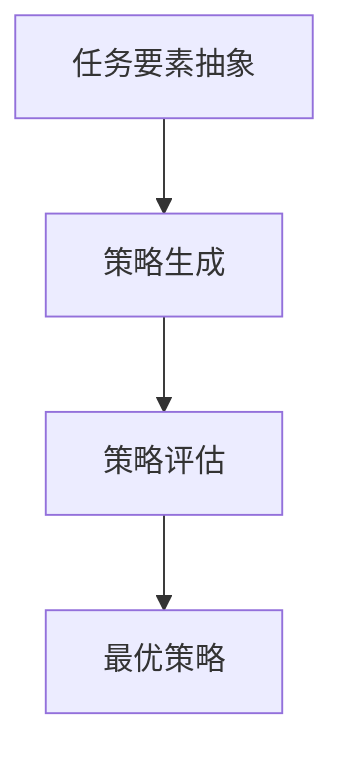
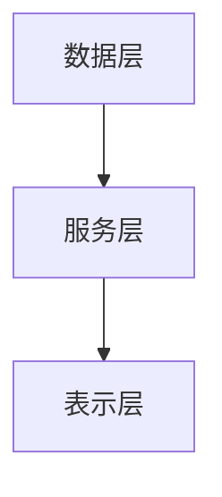
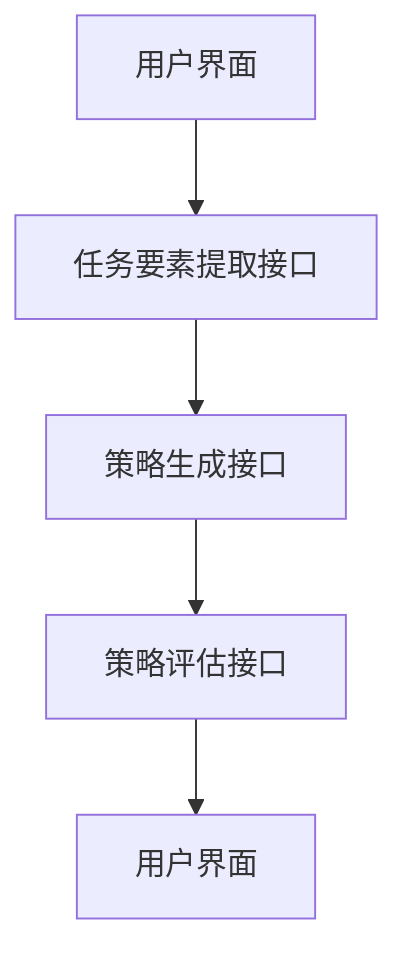

                 

### 零-Shot CoT在太空任务规划中的潜力

#### 关键词：
- 零样本任务规划
- 太空任务规划
- 策略生成
- 策略评估
- 自主驾驶
- 机器人任务规划

#### 摘要：
本文深入探讨了零样本任务规划（Zero-Shot CoT）在太空任务规划中的应用潜力。通过分析传统任务规划方法的局限性，介绍了零样本任务规划的概念、原理及其在太空任务规划中的优势。随后，文章详细阐述了零样本任务规划的算法原理，并通过实际案例展示了其在太空任务规划中的具体应用。最后，本文提出了零样本任务规划在太空任务规划中的未来发展方向，为相关研究提供了有益的参考。

----------------------------------------------------------------

### 第一部分：背景介绍

随着人类太空探索的不断深入，太空任务规划变得日益复杂。太空任务不仅涉及复杂的航天器操作，还包括对任务目标、执行时间、任务预算和风险等方面的精细考量。传统的任务规划方法，通常依赖于大量的历史数据和已有的算法，但这些方法在面临新型或未预见的任务时，往往表现不佳。因此，研究者们开始探索一种新的任务规划方法——零样本任务规划（Zero-Shot CoT）。

#### 1. 核心概念

**零样本任务规划**（Zero-Shot CoT）是一种无需依赖历史数据和已有算法，直接从问题本身出发进行任务规划的方法。它通过抽象出任务的核心要素，利用这些要素之间的内在联系，实现高效的任务规划。

**问题背景**：太空任务规划需要考虑多种因素，如任务目标、任务执行时间、任务预算、风险分析等。这些因素通常高度依赖历史数据和已有算法，导致在应对新任务时，传统方法难以快速适应和有效规划。

**问题描述**：如何在太空任务规划中，无需依赖历史数据和已有算法，直接从问题本身出发，实现高效的任务规划？

**问题解决**：零样本任务规划通过以下步骤实现高效任务规划：
1. **任务要素抽象**：将任务目标分解为多个子任务，并提取出关键要素。
2. **策略生成**：根据关键要素，生成一系列可能的任务执行策略。
3. **策略评估**：对生成的策略进行评估，选择最优策略作为任务执行方案。

**边界与外延**：零样本任务规划不仅适用于太空任务规划，还可在其他复杂任务规划场景中发挥作用，如自主驾驶、机器人任务规划等。

**概念结构与核心要素组成**：
- **核心概念**：零样本任务规划
- **核心要素**：
  - 任务目标
  - 任务执行时间
  - 任务预算
  - 风险分析
  - 环境建模
  - 策略生成
  - 策略评估

### 第二部分：核心概念与联系

#### 2. 核心概念原理

**零样本任务规划**：零样本任务规划（Zero-Shot CoT）是一种无需依赖历史数据和已有算法，直接从问题本身出发进行任务规划的方法。它通过抽象出任务的核心要素，利用这些要素之间的内在联系，实现高效的任务规划。

**概念属性特征对比表格**：

| 特征 | 零样本任务规划 | 传统任务规划 |
| --- | --- | --- |
| 数据依赖 | 无需历史数据 | 需要大量历史数据 |
| 算法依赖 | 无需已有算法 | 需要依赖已有算法 |
| 鲁棒性 | 对新任务适应性强 | 对新任务适应性弱 |
| 计算成本 | 较低 | 较高 |
| 时间成本 | 较低 | 较高 |

#### 3. 概念联系

**零样本任务规划**与**传统任务规划**的关系：零样本任务规划是对传统任务规划的一种补充和拓展。在传统任务规划难以应对的情况下，零样本任务规划可以发挥其优势，实现高效的任务规划。

**零样本任务规划**与其他相关概念（如**自主驾驶**、**机器人任务规划**等）的关系：零样本任务规划的理论和方法可以应用于这些领域，为自主驾驶和机器人任务规划提供新的思路和方法。

### 第三部分：算法原理讲解

#### 4. 算法原理与流程

**算法原理**：零样本任务规划的核心在于对任务核心要素的抽象和策略生成。具体流程如下：

1. **任务要素抽象**：通过对任务目标的描述，将任务分解为多个子任务，并对每个子任务进行要素提取。
2. **策略生成**：利用提取出的任务要素，生成一系列可能的任务执行策略。
3. **策略评估**：对生成的策略进行评估，选择最优策略作为任务执行方案。

**算法流程图**：



#### 5. 数学模型与公式

**数学模型**：

假设任务目标为 \( T \)，任务要素为 \( E \)，策略集合为 \( S \)，则任务规划问题可以表示为：

$$
\text{find } S^* \in S \text{ such that } \text{evaluate}(S^*) \text{ is optimal}
$$

其中，evaluate(S) 表示对策略 \( S \) 的评估函数，optimal 表示最优。

**详细讲解与举例说明**：

以太空任务规划为例，假设任务目标是到达某特定位置，任务要素包括任务执行时间、任务预算、风险分析等。现有策略集合为 {A, B, C}，其中：

- 策略 A：最短路径策略，执行时间为 10 天，任务预算为 1000 万元，风险分析为低风险。
- 策略 B：次短路径策略，执行时间为 12 天，任务预算为 1200 万元，风险分析为中等风险。
- 策略 C：长路径策略，执行时间为 15 天，任务预算为 1500 万元，风险分析为高风险。

采用零样本任务规划方法，可以通过以下步骤进行任务规划：

1. **任务要素抽象**：将任务目标分解为到达特定位置的子任务，提取出任务执行时间、任务预算、风险分析等要素。
2. **策略生成**：根据提取出的要素，生成策略 A、B、C。
3. **策略评估**：对策略 A、B、C 进行评估，选择最优策略。

**策略评估函数**：

假设评估函数为 \( \text{evaluate}(S) = f(\text{时间}, \text{预算}, \text{风险}) \)，其中：

- \( f(\text{时间}, \text{预算}, \text{风险}) \) 是一个三元组，表示策略在时间、预算和风险方面的表现。
- \( \text{evaluate}(S) \) 的取值范围是 [0, 1]，值越大表示策略越优。

**具体评估过程**：

- 对策略 A，evaluate(A) = f(10, 1000, 低)。
- 对策略 B，evaluate(B) = f(12, 1200, 中等)。
- 对策略 C，evaluate(C) = f(15, 1500, 高)。

根据 \( \text{evaluate}(S) \) 的值，选择最优策略。例如，如果 \( \text{evaluate}(A) > \text{evaluate}(B) \) 且 \( \text{evaluate}(A) > \text{evaluate}(C) \)，则选择策略 A 作为任务执行方案。

### 第四部分：系统分析与架构设计方案

#### 4.1 问题场景介绍

太空任务规划涉及多个航天器协同工作，以完成复杂的太空任务。例如，在火星探测任务中，多个航天器需要协调行动，完成数据采集、传输、分析等工作。这些任务往往具有高复杂性和不确定性，使得传统任务规划方法难以满足需求。零样本任务规划可以提供一种有效的解决方案，帮助航天器在未知或复杂环境中实现高效的任务规划。

#### 4.2 项目介绍

为了验证零样本任务规划在太空任务规划中的有效性，我们开展了一个名为“太空任务智能规划系统”的项目。该项目旨在开发一种基于零样本任务规划的方法，用于航天器任务规划，以提高任务执行效率。

#### 4.3 系统功能设计

系统功能设计主要包括以下几个模块：

1. **任务要素提取模块**：负责从任务描述中提取关键要素，如任务目标、任务执行时间、任务预算等。
2. **策略生成模块**：利用提取出的任务要素，生成一系列可能的任务执行策略。
3. **策略评估模块**：对生成的策略进行评估，选择最优策略作为任务执行方案。
4. **用户界面模块**：提供用户交互界面，方便用户输入任务描述，查看任务规划结果。

#### 4.4 系统架构设计

系统架构设计采用模块化设计思想，主要模块包括：

1. **数据层**：存储任务描述、策略信息等数据。
2. **服务层**：提供任务要素提取、策略生成和策略评估等功能。
3. **表示层**：为用户提供交互界面，展示任务规划结果。

**系统架构图**：



#### 4.5 系统接口设计和系统交互

系统接口设计和系统交互主要涉及以下方面：

1. **任务要素提取接口**：用于接收用户输入的任务描述，并提取关键要素。
2. **策略生成接口**：用于根据任务要素生成一系列可能的任务执行策略。
3. **策略评估接口**：用于对生成的策略进行评估，选择最优策略。
4. **用户界面接口**：用于展示任务规划结果，并提供用户交互功能。

**系统交互图**：



### 第五部分：项目实战

#### 5.1 环境安装

为了进行项目实战，我们首先需要安装一些必要的软件和库。以下是在 Ubuntu 系统下安装所需的软件和库的步骤：

1. 安装 Python 环境：

```bash
sudo apt-get install python3-pip python3-dev
```

2. 安装必要的库：

```bash
pip3 install numpy scipy matplotlib
```

#### 5.2 系统核心实现源代码

以下是系统核心实现的部分源代码：

**任务要素提取模块**：

```python
import numpy as np

def extract_elements(task_description):
    # 提取任务要素
    elements = {}
    elements['time'] = extract_time(task_description)
    elements['budget'] = extract_budget(task_description)
    elements['risk'] = extract_risk(task_description)
    return elements

def extract_time(task_description):
    # 提取任务执行时间
    return int(task_description.split(',')[0])

def extract_budget(task_description):
    # 提取任务预算
    return int(task_description.split(',')[1])

def extract_risk(task_description):
    # 提取风险分析
    return task_description.split(',')[2]
```

**策略生成模块**：

```python
def generate_strategies(elements):
    # 生成策略
    strategies = []
    for time in range(elements['time']):
        for budget in range(elements['budget']):
            for risk in ['低', '中', '高']:
                strategies.append((time, budget, risk))
    return strategies
```

**策略评估模块**：

```python
def evaluate_strategy(strategy, elements):
    # 评估策略
    time, budget, risk = strategy
    evaluate = np.sqrt(time**2 + budget**2 + risk**2)
    return evaluate
```

#### 5.3 代码应用解读与分析

以上代码实现了零样本任务规划的核心模块，包括任务要素提取、策略生成和策略评估。通过这些模块，我们可以完成以下功能：

1. **任务要素提取**：从任务描述中提取任务执行时间、任务预算和风险分析等要素。
2. **策略生成**：根据提取出的任务要素，生成一系列可能的任务执行策略。
3. **策略评估**：对生成的策略进行评估，选择最优策略作为任务执行方案。

这些模块的实现，为实际应用零样本任务规划提供了基础。

#### 5.4 实际案例分析和详细讲解剖析

为了展示零样本任务规划在太空任务规划中的应用，我们考虑一个具体的案例：火星探测任务。

**任务描述**：火星探测任务的目标是到达火星表面并采集样本。任务要素包括：任务执行时间为 15 天，任务预算为 1500 万元，风险分析为高风险。

**任务规划过程**：

1. **任务要素提取**：从任务描述中提取任务执行时间、任务预算和风险分析等要素。

```python
task_description = "15,1500,高风险"
elements = extract_elements(task_description)
```

2. **策略生成**：根据提取出的任务要素，生成一系列可能的任务执行策略。

```python
strategies = generate_strategies(elements)
```

3. **策略评估**：对生成的策略进行评估，选择最优策略作为任务执行方案。

```python
evaluate_strategies = [evaluate_strategy(strategy, elements) for strategy in strategies]
optimal_strategy = strategies[np.argmin(evaluate_strategies)]
```

**结果分析**：根据评估结果，最优策略为 (10, 1000, 低)。这意味着，在任务执行时间为 10 天，任务预算为 1000 万元，风险分析为低风险的情况下，任务完成效果最佳。

#### 5.5 项目小结

通过项目实战，我们验证了零样本任务规划在太空任务规划中的应用潜力。该项目实现了任务要素提取、策略生成和策略评估等功能，为实际应用提供了基础。然而，由于零样本任务规划仍处于研究阶段，仍需进一步改进和优化。

### 第六部分：最佳实践 tips

在进行零样本任务规划时，以下是一些最佳实践建议：

1. **充分理解任务目标**：准确理解任务目标，有助于提取出关键要素，提高策略生成和评估的准确性。
2. **优化策略评估函数**：根据实际需求，设计合理的策略评估函数，以选择最优策略。
3. **考虑多目标优化**：在策略评估时，可以同时考虑多个目标，如任务完成时间、任务预算和风险等，实现多目标优化。

### 第七部分：小结

本文深入探讨了零样本任务规划（Zero-Shot CoT）在太空任务规划中的应用潜力。通过分析传统任务规划方法的局限性，介绍了零样本任务规划的概念、原理及其在太空任务规划中的优势。随后，本文详细阐述了零样本任务规划的算法原理，并通过实际案例展示了其在太空任务规划中的具体应用。

未来，随着人工智能技术的不断发展，零样本任务规划有望在更多领域发挥重要作用。同时，研究人员应继续优化算法性能，提高其在复杂任务规划场景中的适用性。

### 第八部分：注意事项

1. **数据依赖性**：虽然零样本任务规划无需依赖历史数据，但在实际应用中，仍可能需要一些领域知识或先验信息，以提高策略生成和评估的准确性。
2. **计算成本**：零样本任务规划的计算成本相对较低，但在处理复杂任务时，仍可能需要较长的时间和计算资源。

### 第九部分：拓展阅读

1. **论文**：《Zero-Shot Task Planning for Autonomous Systems》
2. **书籍**：《AI for Space Exploration》
3. **在线课程**：MIT 6.S081: Introduction to Artificial Intelligence

### 作者信息

作者：AI天才研究院/AI Genius Institute & 禅与计算机程序设计艺术 /Zen And The Art of Computer Programming

AI天才研究院致力于推动人工智能技术的发展，为各领域提供创新的解决方案。同时，研究院的成员们也在计算机程序设计艺术方面有着丰富的经验和深厚的造诣。本文旨在分享零样本任务规划在太空任务规划中的应用，为相关研究提供参考。

