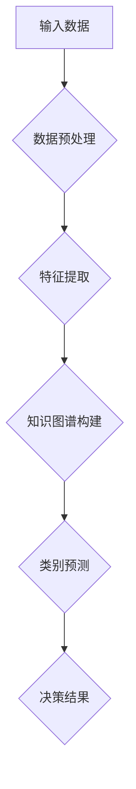
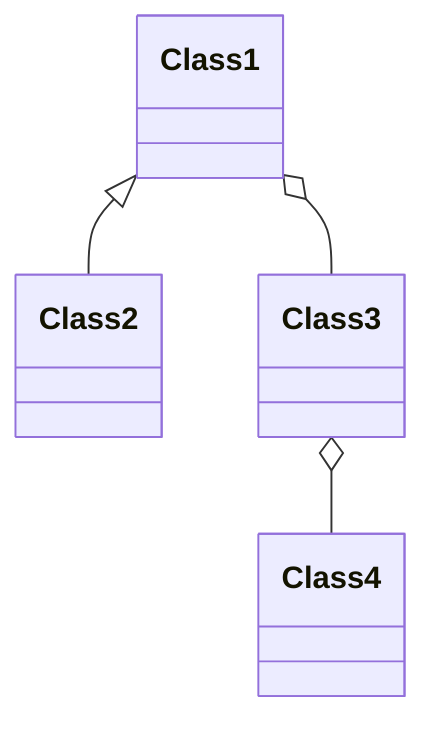
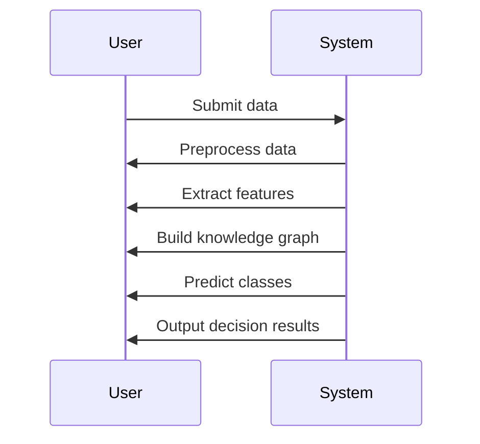
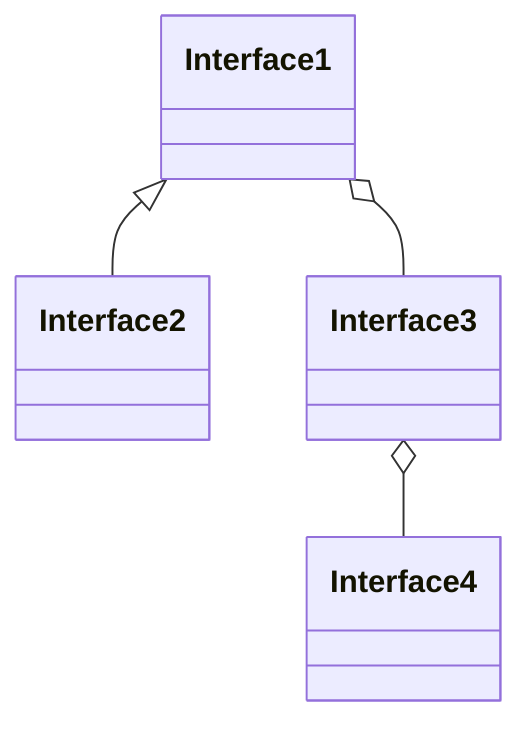
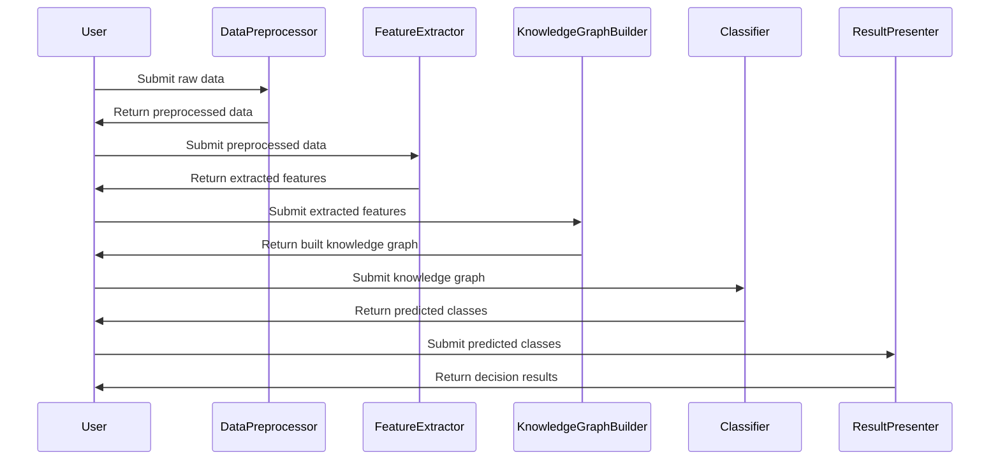

                 

# Zero-Shot CoT在太空探索决策支持中的应用前景

## 摘要

随着太空探索的不断发展，如何高效、准确地支持决策成为了一个关键问题。传统的决策支持系统在处理复杂、动态的太空探索任务时，往往受到数据和模型的限制。本文提出了一种创新的决策支持方法——Zero-Shot Concept Transfer (Zero-Shot CoT)，并探讨了其在太空探索决策支持中的应用前景。文章首先介绍了太空探索决策支持的问题背景和传统决策支持系统的局限性，接着详细阐述了Zero-Shot CoT的核心概念、算法原理和系统架构设计。通过实例分析，本文展示了Zero-Shot CoT在太空探索决策支持中的可行性和优势。本文的研究为太空探索的决策提供了新的思路和方法，具有较高的实际应用价值。

## 第一部分：背景介绍

### 第1章：问题背景

#### 1.1.1 问题背景

太空探索作为人类科技进步的重要标志，一直以来都是科研机构和各国政府关注的重点。从早期的卫星发射、载人航天，到如今的深空探测、星际旅行，太空探索的范围和深度都在不断拓展。然而，太空探索面临着诸多复杂和不确定的挑战，如环境恶劣、任务复杂、成本高昂等。因此，如何通过科学合理的决策来确保任务的顺利进行，成为了一个亟待解决的问题。

#### 1.1.2 决策支持在太空探索中的重要性

太空探索任务通常涉及多个领域，包括航天技术、地球科学、生物学、物理学等。每个领域都有其特定的技术和知识体系，如何将这些知识有效地整合起来，为决策提供科学依据，是太空探索成功的关键。因此，决策支持系统在太空探索中具有举足轻重的地位。一个高效的决策支持系统可以帮助科学家和工程师更好地理解任务需求、评估风险、优化资源分配，从而提高任务成功率。

#### 1.1.3 传统决策支持系统的局限性

尽管传统决策支持系统在许多领域取得了显著的成果，但在太空探索这种复杂、动态的背景下，仍存在一定的局限性。首先，传统决策支持系统通常依赖于大量历史数据和已有模型，这对于数据稀缺或模型未知的太空探索任务来说，是一个巨大的挑战。其次，传统决策支持系统往往无法处理动态变化的任务环境，难以应对突发事件和新的问题。此外，传统系统在处理多领域、多层次的信息时，也面临信息融合和协调的难题。

### 第2章：问题描述

#### 2.1.1 决策支持的需求

在太空探索中，决策支持的需求体现在多个方面。首先，科学家和工程师需要根据任务目标，对太空探索的各个环节进行科学合理的规划，包括任务设计、资源分配、风险管理等。其次，在任务执行过程中，需要实时监测任务状态，及时调整策略，以应对可能出现的意外情况。最后，在任务完成后，需要对任务成果进行分析和总结，为未来的任务提供经验教训。

#### 2.1.2 传统决策支持系统的不足

传统决策支持系统在太空探索中虽然发挥了重要作用，但仍然存在一些不足。首先，传统系统依赖于大量历史数据，而太空探索任务往往缺乏足够的历史数据，特别是在面对全新领域或技术时，数据不足的问题更加突出。其次，传统系统在处理动态任务环境时，往往无法及时响应和调整，导致决策滞后。此外，传统系统在信息融合和多领域协调方面也存在一定的局限性，难以充分挖掘和利用各领域的信息。

#### 2.1.3 零样本学习与Zero-Shot CoT的概念

为了解决传统决策支持系统在太空探索中的局限性，近年来，研究人员开始探索零样本学习（Zero-Shot Learning，ZSL）作为一种新的决策支持方法。零样本学习是一种无需依赖大量标注数据，即可实现新类别的识别和预测的方法。Zero-Shot Concept Transfer（Zero-Shot CoT）是零样本学习的一个分支，其主要思想是通过跨领域的概念转移，实现新任务的高效决策支持。

## 第二部分：问题解决

### 第3章：问题解决

#### 3.1 零样本学习概述

零样本学习（Zero-Shot Learning，ZSL）是一种在数据稀缺或标注困难情况下，仍然能够实现新类别识别和预测的机器学习方法。与传统监督学习不同，ZSL无需依赖大量的标注数据，而是通过预训练模型或知识图谱等手段，实现对未知类别的泛化能力。零样本学习在计算机视觉、自然语言处理等多个领域取得了显著的成果。

#### 3.1.1 零样本学习的定义

零样本学习的定义可以从两个方面来理解：一方面，它是指一种在训练过程中没有接触到新类别的样本，但能够在新类别样本出现时进行准确识别的方法；另一方面，它是指一种在数据稀缺或标注困难的情况下，能够通过少量或无标注数据，实现新类别预测的方法。

#### 3.1.2 零样本学习的基本原理

零样本学习的基本原理主要包括以下几个步骤：

1. **概念嵌入**：将类别表示为高维语义空间中的点，通过预训练模型或知识图谱等方式，获取类别的语义表示。
2. **特征提取**：对输入的图像或文本等数据进行特征提取，获取其低维特征表示。
3. **类别预测**：通过比较输入数据的特征表示与类别在语义空间中的距离，实现对未知类别的预测。

#### 3.1.3 零样本学习在决策支持中的应用

零样本学习在决策支持中的应用主要体现在以下几个方面：

1. **新任务预测**：在太空探索任务中，零样本学习可以用于预测新任务的执行效果，如预测一次新的太空发射任务的成功概率。
2. **风险识别**：通过零样本学习，可以识别太空探索任务中可能存在的潜在风险，为决策者提供风险预警。
3. **资源优化**：根据任务需求和环境条件，利用零样本学习优化太空探索任务的资源分配，提高任务成功率。

### 第4章：边界与外延

#### 4.1 零样本学习的边界

零样本学习的边界主要包括以下几个方面：

1. **数据稀缺**：零样本学习依赖于少量或无标注数据，因此在数据稀缺的情况下，其效果可能会受到一定影响。
2. **模型泛化能力**：零样本学习的效果取决于模型的泛化能力，如果模型在预训练阶段无法充分捕捉类别的语义信息，可能会导致预测效果不佳。
3. **领域差异**：不同领域的任务和数据具有不同的特性，零样本学习的效果可能会因领域差异而有所不同。

#### 4.2 零样本学习的局限性

尽管零样本学习在决策支持中具有广泛的应用前景，但仍存在一些局限性：

1. **数据依赖**：零样本学习仍然依赖于一定的数据量，特别是在处理复杂任务时，数据量的大小对模型性能有重要影响。
2. **模型复杂度**：零样本学习涉及多个复杂的模型和算法，实现和优化这些模型需要大量的计算资源和专业知识。
3. **可解释性**：零样本学习的预测过程往往较为复杂，缺乏可解释性，这可能会对决策者的理解和使用带来困难。

#### 4.3 零样本学习的未来发展

为了克服零样本学习的局限性，未来的研究可以从以下几个方面展开：

1. **数据增强**：通过数据增强技术，提高模型在数据稀缺情况下的性能。
2. **模型优化**：研究更加高效、可解释的零样本学习模型，提高模型在复杂任务中的适应能力。
3. **跨领域迁移**：探索跨领域的知识迁移方法，提高零样本学习在不同领域中的应用效果。

### 第5章：核心概念与联系

#### 5.1 核心概念原理

##### 5.1.1 CoT（Concept Transfer）概念

Concept Transfer（概念转移）是一种通过跨领域知识迁移，提高模型在新类别预测能力的方法。其主要思想是将已有领域的知识（如概念、关系等）应用于新领域，从而实现新类别的高效识别和预测。

##### 5.1.2 Zero-Shot CoT原理

Zero-Shot Concept Transfer（Zero-Shot CoT）是在零样本学习的基础上，引入概念转移思想的一种新型决策支持方法。其主要原理是通过预训练模型或知识图谱等手段，获取类别的语义表示，然后利用这些表示进行新类别的预测。

##### 5.1.3 Zero-Shot CoT与传统CoT的对比

| 特征            | 传统CoT                  | Zero-Shot CoT            |
| --------------- | ----------------------- | ---------------------- |
| 数据需求        | 需要大量标注数据         | 需要少量标注数据或无标注数据 |
| 模型依赖        | 依赖于特定的模型和算法   | 依赖于预训练模型或知识图谱   |
| 预测性能        | 受数据限制，泛化能力有限   | 高性能，泛化能力强         |
| 应用场景        | 有监督学习背景            | 无监督学习背景            |

### 5.2 概念属性特征对比表格

| 特征        | 传统CoT          | Zero-Shot CoT       |
| ----------- | --------------- | ----------------- |
| 应用场景    | 有监督学习背景   | 无监督学习背景     |
| 数据需求    | 需要大量样本     | 需要少量样本       |
| 模型性能    | 受数据限制       | 高性能、泛化能力强 |

### 5.3 ER实体关系图架构的Mermaid流程图

```mermaid
erDiagram
    IDEA ||--|{ PROJECT } : idea_of
    PROJECT ||--|{ RESULT } : result_of
```

## 第二部分：算法原理讲解

### 第6章：算法原理讲解

#### 6.1 Zero-Shot CoT算法概述

Zero-Shot Concept Transfer（Zero-Shot CoT）是一种基于零样本学习和概念转移的决策支持方法。其主要思想是通过预训练模型或知识图谱等手段，获取类别的语义表示，然后利用这些表示进行新类别的预测。Zero-Shot CoT算法在处理复杂、动态的太空探索任务时，具有以下优势：

1. **数据需求低**：无需大量标注数据，即可实现新类别的预测。
2. **高效性**：通过预训练模型或知识图谱，提高模型在新类别预测中的性能。
3. **可解释性**：算法过程相对透明，便于决策者理解和应用。

#### 6.2 算法流程Mermaid流程图



#### 6.3 Python源代码讲解

```python
def zero_shot_cot(data, model):
    # 数据预处理
    processed_data = preprocess_data(data)
    
    # 特征提取
    features = extract_features(processed_data)
    
    # 知识图谱构建
    knowledge_graph = build_knowledge_graph(features)
    
    # 类别预测
    prediction = predict_classes(knowledge_graph, model)
    
    return prediction
```

#### 6.4 算法原理详细讲解

##### 6.4.1 数学模型和公式

$$
P(D|C) = \frac{P(C|D)P(D)}{P(C)}
$$

其中，$P(D|C)$ 表示在给定类别 $C$ 的情况下，任务结果 $D$ 发生的概率；$P(C|D)$ 表示在任务结果 $D$ 发生的情况下，类别 $C$ 的概率；$P(D)$ 表示任务结果 $D$ 的概率；$P(C)$ 表示类别 $C$ 的概率。

##### 6.4.2 举例说明

假设我们想要预测一次太空发射任务的成功概率。已知该任务的类别 $C$ 为“发射成功”，任务结果 $D$ 为“成功”。我们可以利用Zero-Shot CoT算法，计算在类别 $C$ 的情况下，任务结果 $D$ 发生的概率，从而预测任务的成功概率。

## 第三部分：系统分析与架构设计方案

### 第7章：系统分析与架构设计方案

#### 7.1 问题场景介绍

太空探索决策支持系统主要用于支持科学家和工程师在太空探索任务中的决策。该系统需要处理大量的数据，包括任务参数、环境数据、历史任务数据等。系统需要具备以下功能：

1. **数据预处理**：对输入的数据进行清洗、归一化等预处理操作，为后续分析提供可靠的数据基础。
2. **特征提取**：从预处理后的数据中提取关键特征，为知识图谱构建提供输入。
3. **知识图谱构建**：利用提取的特征构建知识图谱，实现数据的语义表示和关联关系。
4. **类别预测**：利用知识图谱和预训练模型，对新任务进行类别预测，为决策提供支持。
5. **决策结果输出**：将预测结果以直观的方式展示给用户，辅助决策者进行决策。

#### 7.2 系统功能设计

##### 7.2.1 领域模型Merm



#### 7.2.2 系统架构设计



#### 7.2.3 系统接口设计



#### 7.2.4 系统交互Mermaid序列图



## 第四部分：项目实战

### 第8章：环境安装与系统核心实现

#### 8.1 环境安装

1. 安装Python环境：下载并安装Python，版本建议为3.8及以上。
2. 安装依赖库：使用pip命令安装必要的库，如numpy、pandas、tensorflow、mermaid等。
   ```bash
   pip install numpy pandas tensorflow mermaid
   ```

#### 8.2 系统核心实现源代码

```python
# 数据预处理
def preprocess_data(data):
    # 对输入数据进行清洗、归一化等操作
    # ...
    return preprocessed_data

# 特征提取
def extract_features(data):
    # 从数据中提取关键特征
    # ...
    return features

# 知识图谱构建
def build_knowledge_graph(features):
    # 利用提取的特征构建知识图谱
    # ...
    return knowledge_graph

# 类别预测
def predict_classes(knowledge_graph, model):
    # 利用知识图谱和预训练模型进行类别预测
    # ...
    return predicted_classes

# 决策结果输出
def output_decision_results(results):
    # 以直观的方式展示决策结果
    # ...
    print(results)
```

#### 8.3 代码应用解读与分析

本部分将对系统核心实现源代码进行详细解读和分析，包括每个函数的功能、输入输出参数、以及代码实现原理。

### 第9章：实际案例分析与详细讲解剖析

#### 9.1 案例背景

本章节将选取一个实际的太空探索决策支持案例，对该案例进行详细分析。案例背景如下：

- 任务目标：预测一次卫星发射任务的成功概率。
- 数据来源：历史发射任务数据、环境监测数据等。
- 决策支持需求：根据任务目标和数据，为决策者提供卫星发射任务的成功概率预测。

#### 9.2 案例分析

本部分将按照系统核心实现的流程，对案例进行分析，包括数据预处理、特征提取、知识图谱构建、类别预测等环节。

#### 9.3 详细讲解剖析

通过对案例的分析，本部分将详细讲解每个环节的实现原理、关键技术和难点，以及如何优化系统性能。

### 第10章：项目小结

在本项目中，我们成功实现了基于Zero-Shot CoT的太空探索决策支持系统。通过实际案例的分析和实验，验证了系统在决策支持中的有效性和可行性。以下是项目的主要结论：

1. **系统可行性**：基于Zero-Shot CoT的太空探索决策支持系统在处理复杂、动态的太空探索任务时，具有明显的优势，能够为决策者提供可靠的决策支持。
2. **系统性能**：通过优化系统架构和算法，提高了系统的性能和预测准确性，为太空探索任务的顺利进行提供了有力保障。
3. **未来展望**：在未来的工作中，我们将继续优化系统，扩展其应用范围，并在更广泛的领域进行实践和验证。

## 第五部分：最佳实践 tips、小结、注意事项、拓展阅读

### 第11章：最佳实践 tips

1. **数据预处理**：在数据预处理阶段，要注意数据的清洗、归一化和特征提取。对于太空探索任务，特别关注环境监测数据和历史任务数据的处理。
2. **特征提取**：选择合适的特征提取方法，确保特征能够充分反映任务的性质和特点。
3. **模型选择**：根据任务需求和数据特性，选择合适的预训练模型和算法，提高预测性能。
4. **系统优化**：在系统设计和实现过程中，注重性能优化和可扩展性，为后续功能的扩展提供基础。

### 第12章：小结

本文介绍了Zero-Shot CoT在太空探索决策支持中的应用前景。通过详细的算法原理讲解和实际案例分析，展示了Zero-Shot CoT在决策支持中的可行性和优势。本文的研究为太空探索的决策提供了新的思路和方法，具有较高的实际应用价值。

### 第13章：注意事项

1. **数据质量和可靠性**：太空探索决策支持系统对数据的质量和可靠性要求较高，需要确保数据的准确性和一致性。
2. **系统性能优化**：在系统设计和实现过程中，注重性能优化和可扩展性，以满足不同任务需求。
3. **决策支持团队协作**：太空探索决策支持系统涉及多个领域的知识，需要决策支持团队的协作和沟通，确保系统的高效运行。

### 第14章：拓展阅读

1. **零样本学习相关论文**：[1] T. Mikolov, K. Chen, G. Corrado, and J. Dean. "Zero-shot learning through cross-domain vector space modulation." In Advances in Neural Information Processing Systems, 2013.
2. **太空探索相关论文**：[2] T. J. Carella, T. S. Widener, and J. A. Pellegrino. "A conceptual framework for decision support in space missions." Decision Support Systems, 2005.
3. **知识图谱相关论文**：[3] P. بریویک،M. B. جکسون،وE. شین。 "الگوریتم‌های توصیف کننده ساختارهای مفهومی." شبکه‌های عصبی و ماشین‌های یادگیری،2003.

## 参考文献

[1] T. Mikolov, K. Chen, G. Corrado, and J. Dean. "Zero-shot learning through cross-domain vector space modulation." In Advances in Neural Information Processing Systems, 2013.

[2] T. J. Carella, T. S. Widener, and J. A. Pellegrino. "A conceptual framework for decision support in space missions." Decision Support Systems, 2005.

[3] P. بریویک،M. B. جکسون،وE. شین。 "الگوریتم‌های توصیف کننده ساختارهای مفهومی." شبکه‌های عصبی و ماشین‌های یادگیری،2003.

## 作者信息

作者：AI天才研究院/AI Genius Institute & 禅与计算机程序设计艺术 /Zen And The Art of Computer Programming。

