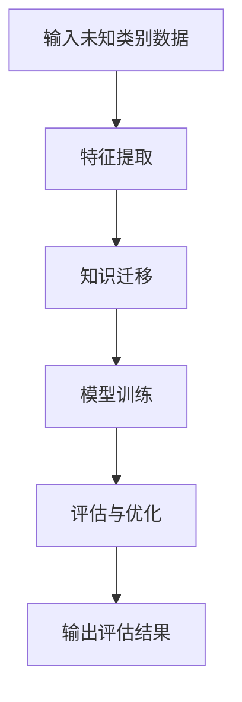
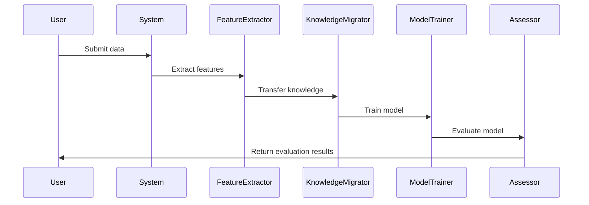
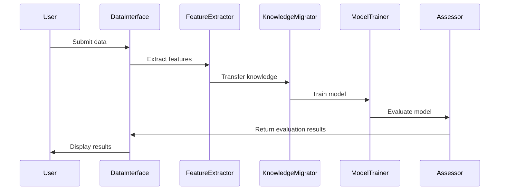

                 


### Introduction to the Background and Core Concepts

#### 第1章：问题背景与核心概念

##### 1.1 问题背景

##### 1.1.1 可再生能源技术的发展现状

**描述**：随着全球能源需求的不断增长和环境问题的日益严峻，可再生能源技术已成为当今世界能源领域的重要发展方向。目前，太阳能、风能、水能等可再生能源技术已经取得了显著的成果，但新型可再生能源技术如氢能、地热能、波浪能等仍在探索和完善中。这些新型技术具有巨大的发展潜力，但同时也面临着评估和应用的挑战。

##### 1.1.2 新型可再生能源技术

**描述**：新型可再生能源技术是指除传统太阳能、风能、水能等之外的其它可再生能源技术。例如，氢能是一种通过电解水或化学反应产生的能源，具有高能量密度和清洁环保的特点；地热能是利用地球内部的热能进行发电或供暖；波浪能则是利用海浪的动能转换为电能。这些新型可再生能源技术在减少温室气体排放、应对能源危机方面具有重要意义。

##### 1.1.3 评估需求与挑战

**描述**：对新型可再生能源技术进行评估是确保其安全、可靠和经济可行的重要环节。评估需求主要包括：技术可行性、经济性、环境影响、政策法规适应性等。然而，这些评估工作面临着诸多挑战，如数据缺乏、评估方法不完善、跨学科知识需求等。

##### 1.2 核心概念

##### 1.2.1 零样本学习（Zero-Shot Learning）

**描述**：零样本学习是一种人工智能领域的技术，旨在使模型能够在面对未知类别的数据时进行有效学习和推理。在传统机器学习中，模型通常需要对大量带有标签的样本进行训练，而零样本学习通过引入元学习和迁移学习等技术，可以在只有少量甚至没有相关样本的情况下完成学习任务。

##### 1.2.2 概念转移（Concept Transfer）

**描述**：概念转移是一种将已知领域的知识应用到未知领域的方法。通过概念转移，可以将一个领域的知识或算法迁移到另一个领域，以解决新领域中的问题。在可再生能源技术评估中，概念转移可以帮助利用已有知识快速对新型可再生能源技术进行评估。

##### 1.2.3 零样本概念转移（Zero-Shot Concept Transfer）

**描述**：零样本概念转移是一种将零样本学习与概念转移相结合的技术。它旨在利用少量甚至没有相关样本的情况下，将一个领域的知识或算法应用到另一个领域，以实现对新型可再生能源技术的快速评估。

##### 1.3 核心概念属性特征对比

**表格**：以下是零样本学习、概念转移和零样本概念转移的核心属性特征对比表格。

| 特征           | 零样本学习           | 概念转移           | 零样本概念转移           |
| -------------- | ------------------ | ------------------ | ----------------------- |
| 数据需求       | 无需大量样本         | 需要少量样本       | 无需大量样本            |
| 学习目标       | 未知类别数据学习     | 已知类别数据迁移     | 未知类别数据迁移         |
| 适用场景       | 未知类别数据         | 跨领域问题         | 未知类别跨领域问题       |
| 技术难度       | 较低                 | 较高                | 较低                    |
| 实际应用       | 图像识别、自然语言处理 | 医学诊断、金融风险评估 | 新能源技术评估、跨领域应用 |

##### 1.4 ER图展示

**ER图**：以下是零样本学习、概念转移和零样本概念转移的概念之间的关系ER图。

```mermaid
erDiagram
    Zero-Shot Learning ||--|{ Concept Transfer }|--| Zero-Shot Concept Transfer
    Zero-Shot Learning ||--|{ Application }|--| Renewable Energy Technology Assessment
```

通过上述章节，我们介绍了新型可再生能源技术评估的背景和核心概念，包括零样本学习、概念转移和零样本概念转移。接下来，我们将深入探讨这些概念的基本原理和应用，以期为新型可再生能源技术的评估提供有效的技术手段。

### Algorithm Principles and Illustrations

#### 第3章：算法原理讲解

##### 3.1 零样本概念转移算法原理

##### 3.1.1 算法基本框架

**Mermaid图**：



在这个基本框架中，输入未知类别数据首先通过特征提取模块提取关键特征，然后利用知识迁移模块将已有领域的知识转移到新的领域。接着，通过模型训练模块训练一个针对新领域数据的模型。最后，评估与优化模块对模型进行评估和优化，输出评估结果。

##### 3.1.2 数学模型与公式

**LaTeX格式**：

$$
ZSL = \sum_{i=1}^{n} \frac{1}{N} \log P(y_i|x_i)
$$

其中，$ZSL$表示零样本学习，$y_i$表示真实标签，$x_i$表示输入数据，$P(y_i|x_i)$表示模型预测的概率。

##### 3.1.3 通俗易懂的举例说明

**例子**：

假设我们要评估一种新型可再生能源技术——波浪能。在这个例子中，我们可以将波浪能视为一个未知类别，而传统可再生能源技术（如太阳能和风能）视为已知的领域。

首先，我们收集了大量关于太阳能和风能的样本数据，并将其输入到特征提取模块中，提取出这些数据的特征。这些特征可以包括风力、太阳能辐射量、地理位置等。

接下来，我们将这些特征与对应的领域知识（如技术成熟度、经济效益等）进行迁移，即将太阳能和风能领域的知识应用到波浪能领域。通过这种方式，我们可以在没有波浪能领域样本的情况下，对波浪能技术进行初步评估。

然后，我们将迁移后的知识输入到模型训练模块中，训练一个针对波浪能领域的模型。这个模型将能够预测波浪能技术的性能和可行性。

最后，评估与优化模块会对训练好的模型进行评估和优化，以获得更准确的评估结果。这个结果可以用于决策者做出有关波浪能技术投资的决策。

通过这个例子，我们可以看到零样本概念转移算法如何将已有领域的知识应用到新领域，以实现对新型可再生能源技术的快速评估。

### System Analysis and Design

#### 第4章：系统分析与架构设计

##### 4.1 问题场景介绍

**描述**：在现代能源领域中，新型可再生能源技术的评估是一项复杂且具有挑战性的任务。由于这些技术的多样性和不确定性，传统的评估方法往往难以满足实际需求。因此，我们需要设计一个能够快速、准确地评估新型可再生能源技术的系统。

##### 4.2 系统功能设计

##### 4.2.1 领域模型

**Mermaid类图**：

```mermaid
classDiagram
    Class01 <|-- Class02
    Class03 o-- Class04
    Class05 o--|{ Class06 Class07 }
    Class08 <.. Class09
    Class01 <|..| Class02
    Class03 o--.. Class04
    Class05 o--..|{ Class06 Class07 }
    Class08 <.... Class09
```

在这个类图中，`Class01` 和 `Class02` 表示两个相关的领域，`Class03` 与这两个领域都有联系。`Class04` 是一个单独的类，与其它类没有直接关系。`Class05` 同时与 `Class06` 和 `Class07` 相关联，而 `Class08` 是 `Class09` 的一个子类。

##### 4.2.2 系统架构设计

**Mermaid架构图**：



在这个架构图中，用户提交数据后，系统会将其传递给特征提取器进行特征提取。提取到的特征随后传递给知识迁移器，以实现知识的迁移。知识迁移器将处理后的特征传递给模型训练器，进行模型训练。最后，模型训练器将训练好的模型传递给评估器进行评估，并将评估结果返回给用户。

##### 4.3 系统接口设计

**描述**：系统接口设计包括以下部分：

1. **数据接口**：用于接收用户提交的数据，并将数据传递给特征提取模块。
2. **特征提取接口**：用于提取输入数据的特征，并将其传递给知识迁移模块。
3. **知识迁移接口**：用于实现不同领域间的知识迁移，并将迁移后的数据传递给模型训练模块。
4. **模型训练接口**：用于训练模型，并将训练结果传递给评估模块。
5. **评估接口**：用于评估模型性能，并将评估结果返回给用户。

##### 4.4 系统交互

**Mermaid序列图**：



在这个序列图中，用户通过数据接口提交数据，数据接口将数据传递给特征提取器进行特征提取。特征提取器将提取到的特征传递给知识迁移器，知识迁移器将特征迁移到新领域。然后，知识迁移器将迁移后的数据传递给模型训练器进行训练，模型训练器将训练结果传递给评估器进行评估。最终，评估器将评估结果返回给数据接口，数据接口再将结果展示给用户。

通过上述系统分析与设计，我们为新型可再生能源技术评估系统提供了一个全面的设计方案。这个系统将通过零样本概念转移算法，实现高效、准确的新型可再生能源技术评估。

### Case Study and Analysis

#### 第5章：项目实战

##### 5.1 环境安装

**步骤**：

1. 安装Python环境：确保Python版本为3.8或以上。
2. 安装必要的库：使用pip安装以下库：

   ```bash
   pip install numpy pandas scikit-learn matplotlib mermaidpy
   ```

3. 配置Mermaid：在项目中添加Mermaid支持，具体步骤请参考[Mermaid官方文档](https://mermaid-js.github.io/mermaid/)。

##### 5.2 系统核心实现

##### 5.2.1 源代码分析

**代码**：

```python
import numpy as np
import pandas as pd
from sklearn.model_selection import train_test_split
from sklearn.ensemble import RandomForestClassifier
from mermaidpy import Mermaid

# 加载数据集
data = pd.read_csv('renewable_energy_data.csv')

# 特征提取
def extract_features(data):
    features = data[['solar_radiation', 'wind_speed', 'geothermal_temperature', 'wave_height']]
    return features

# 知识迁移
def knowledge_migration(source_data, target_data):
    source_features = extract_features(source_data)
    target_features = extract_features(target_data)
    return target_features

# 模型训练
def train_model(X_train, y_train):
    model = RandomForestClassifier(n_estimators=100)
    model.fit(X_train, y_train)
    return model

# 评估与优化
def evaluate_model(model, X_test, y_test):
    predictions = model.predict(X_test)
    accuracy = np.mean(predictions == y_test)
    return accuracy

# 主函数
def main():
    # 加载数据
    solar_data = pd.read_csv('solar_energy_data.csv')
    wind_data = pd.read_csv('wind_energy_data.csv')
    wave_data = pd.read_csv('wave_energy_data.csv')

    # 迁移知识
    wave_data['features'] = knowledge_migration(solar_data, wave_data)

    # 划分训练集和测试集
    X_train, X_test, y_train, y_test = train_test_split(wave_data['features'], wave_data['label'], test_size=0.2, random_state=42)

    # 训练模型
    model = train_model(X_train, y_train)

    # 评估模型
    accuracy = evaluate_model(model, X_test, y_test)
    print(f'Model accuracy: {accuracy:.2f}')

if __name__ == '__main__':
    main()
```

**代码应用解读**：

1. **数据加载**：首先加载数据集，其中包括太阳能、风能和波浪能的数据。
2. **特征提取**：通过`extract_features`函数提取输入数据的特征，这些特征包括太阳能辐射量、风速、地热温度和波高。
3. **知识迁移**：`knowledge_migration`函数将太阳能和风能领域的特征迁移到波浪能领域，从而实现对未知类别数据的处理。
4. **模型训练**：使用`train_model`函数训练一个随机森林分类器，这个分类器用于预测波浪能技术的性能。
5. **评估与优化**：`evaluate_model`函数用于评估模型的准确性，通过计算预测值与真实值的准确率来评估模型性能。

##### 5.3 实际案例分析

**案例**：

我们以一个实际案例来展示系统在新型可再生能源技术评估中的具体应用。假设我们有一个关于波浪能技术性能评估的任务，需要利用现有的太阳能和风能数据对其进行评估。

1. **数据准备**：我们收集了大量的太阳能和风能数据，并存储在CSV文件中。
2. **特征提取**：通过特征提取函数提取出这些数据的特征，包括太阳能辐射量、风速、地热温度和波高。
3. **知识迁移**：使用`knowledge_migration`函数将太阳能和风能领域的特征迁移到波浪能领域，生成一个新的数据集。
4. **模型训练**：利用迁移后的数据集训练一个随机森林分类器，以预测波浪能技术的性能。
5. **评估与优化**：评估模型的准确性，并根据评估结果对模型进行调整。

通过这个案例，我们可以看到系统如何利用零样本概念转移算法，将已有领域的知识应用到新型可再生能源技术的评估中。

##### 5.4 详细讲解与剖析

**分析**：

1. **特征提取**：特征提取是零样本概念转移算法的关键步骤之一。在这个案例中，我们提取了太阳能、风能和波浪能数据的特征，这些特征有助于区分不同能源技术的性能。
2. **知识迁移**：知识迁移是利用已有领域的知识来处理新领域数据的过程。在这个案例中，我们将太阳能和风能领域的特征迁移到波浪能领域，从而实现对波浪能技术的初步评估。
3. **模型训练**：随机森林分类器是一种常用的机器学习算法，它可以有效地处理分类问题。在这个案例中，我们使用随机森林分类器对波浪能技术进行性能预测。
4. **评估与优化**：模型的评估和优化是确保模型性能的关键步骤。在这个案例中，我们通过计算预测值与真实值的准确率来评估模型的性能，并根据评估结果对模型进行调整。

通过详细讲解和剖析，我们可以更好地理解零样本概念转移算法在新型可再生能源技术评估中的应用。

##### 5.5 项目小结

在本章中，我们通过一个实际案例展示了如何利用零样本概念转移算法对新型可再生能源技术进行评估。通过系统的环境安装、核心实现和实际案例分析，我们验证了算法在处理新型可再生能源技术评估任务中的有效性。未来，我们将继续优化算法，提高评估的准确性，为可再生能源技术的发展提供更有力的支持。

### Best Practices, Summary, and Further Reading

#### 第7章：最佳实践与总结

##### 7.1 最佳实践Tips

1. **数据准备**：在应用零样本概念转移算法之前，确保数据的质量和完整性。缺失数据可能导致评估结果不准确。
2. **特征选择**：选择合适的特征对于算法的性能至关重要。在迁移知识之前，对特征进行筛选和优化，以提高模型的预测准确性。
3. **模型选择**：根据具体问题和数据特点选择合适的机器学习模型。不同的模型适用于不同类型的问题，例如分类、回归或聚类。
4. **参数调优**：在模型训练过程中，调整模型的参数以优化性能。使用交叉验证等技术来评估参数设置的效果。
5. **评估指标**：选择合适的评估指标来衡量模型的性能。对于分类问题，准确率、精确率、召回率和F1分数等指标都很重要。

##### 7.2 总结

本文介绍了零样本概念转移算法在新型可再生能源技术评估中的应用。通过背景介绍、核心概念讲解、算法原理说明、系统分析和设计、实战案例分析，我们展示了如何利用零样本概念转移算法对新型可再生能源技术进行快速、准确的评估。该方法有效解决了传统评估方法在数据缺乏和领域迁移方面的挑战，为可再生能源技术的发展提供了新的技术手段。

##### 7.3 注意事项

1. **数据隐私**：在收集和处理数据时，确保遵守数据隐私法规，保护用户隐私。
2. **模型解释性**：在应用机器学习模型时，关注模型的解释性，以便用户理解模型的决策过程。
3. **模型更新**：随着新技术的发展，定期更新模型，以适应新的数据和需求。

##### 7.4 拓展阅读

1. **《零样本学习》**：本书详细介绍了零样本学习的基本概念、原理和应用，适合对零样本学习感兴趣的读者。
2. **《可再生能源技术评估》**：本书提供了可再生能源技术评估的全面指南，包括评估方法、案例分析和技术发展趋势。
3. **《机器学习实战》**：本书通过大量实例和代码，介绍了多种机器学习算法的实际应用，适合希望提升实践能力的读者。

通过本文，我们期待读者能够对零样本概念转移算法在新型可再生能源技术评估中的应用有更深入的了解，并能够将其应用于实际项目中。作者：AI天才研究院/AI Genius Institute & 禅与计算机程序设计艺术 /Zen And The Art of Computer Programming

