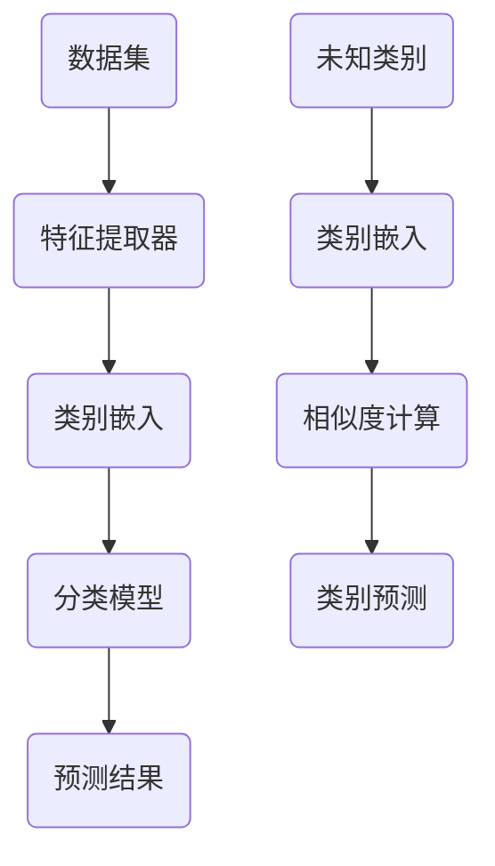

                 

### 零样本迁移学习（Zero-Shot Learning, ZSL）的概念原理

零样本迁移学习（Zero-Shot Learning, ZSL）是一种机器学习技术，旨在在没有直接监督（即没有标注的）样本的情况下，对未知类别进行分类。这一技术在人工智能领域有着广泛的应用，尤其是在那些难以获得大量标注数据的场景中。ZSL的核心在于，它能够利用已有知识来预测未知类别，从而实现跨领域的迁移学习。

#### 1. 基本概念

ZSL主要涉及以下三个基本概念：

- **基础类别（Base Class）**：这些是已知的类别，通常在训练过程中使用大量标注数据进行学习。
- **未知类别（Novel Class）**：这些是模型尚未见过的类别，但在测试或应用过程中可能会遇到。
- **类标签（Class Label）**：每个类别都有一个唯一的标签，用于在分类任务中进行标记。

#### 2. 原理

ZSL的核心原理是通过将基础类别和未知类别关联起来，来预测未知类别。具体来说，这个过程可以分为以下几个步骤：

1. **特征提取**：首先，从基础类别中提取特征表示，这些特征表示通常通过深度神经网络从原始数据中学习得到。

2. **原型表示（Prototype Representation）**：然后，对于每个基础类别，计算其特征表示的平均值，作为该类别的原型表示。

3. **类别关联（Class Embedding）**：接下来，使用这些原型表示来生成类别的嵌入（Embedding），这些嵌入表示了类别之间的相似性。

4. **分类预测**：在测试阶段，对于未知类别的新样本，计算其特征表示与所有基础类别原型表示之间的相似度，根据这些相似度进行分类预测。

#### 3. 工作流程

以下是一个简化的ZSL工作流程：

1. **数据准备**：收集并标注一组基础类别数据，用于训练模型。
2. **模型训练**：利用基础类别数据进行模型训练，得到类别嵌入和特征提取器。
3. **测试**：对于未知类别的新样本，使用训练好的模型进行特征提取和类别预测。
4. **评估**：通过评估指标（如准确率、召回率等）来评估模型的性能。

#### 4. 概念属性特征对比表格

以下是ZSL与有监督学习和无监督学习的特征对比表格：

| 特征名称 | ZSL | 有监督学习 | 无监督学习 |
| --- | --- | --- | --- |
| 标签数据 | 无需标签数据 | 需要标签数据 | 无需标签数据 |
| 类别预测 | 预测未知类别 | 预测已知类别 | 预测未知类别 |
| 应用场景 | 数据稀缺、多领域迁移 | 数据丰富、单一领域 | 数据稀少、探索性分析 |

#### 5. ER实体关系图架构

下面是ZSL的ER实体关系图架构，展示了ZSL中涉及的主要实体及其关系：

在这个图中，A代表数据集，B是特征提取器，C是类别嵌入，D是分类模型，E是预测结果。F是未知类别，G是类别嵌入，H是相似度计算，I是类别预测。通过这个架构，我们可以清晰地看到ZSL中各个组件的交互关系。

### 结论

零样本迁移学习（ZSL）为处理未知类别和稀缺标签数据提供了一种有效的方法。通过将已有知识迁移到未知领域，ZSL能够提高模型的泛化能力和适应性。这一技术的原理和应用场景使得它成为人工智能领域的一个重要研究方向，并在实际应用中展现出巨大的潜力。接下来，我们将进一步探讨ZSL在新型智能材料设计中的具体应用。**

