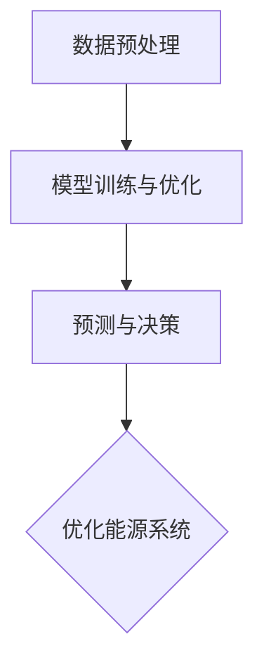
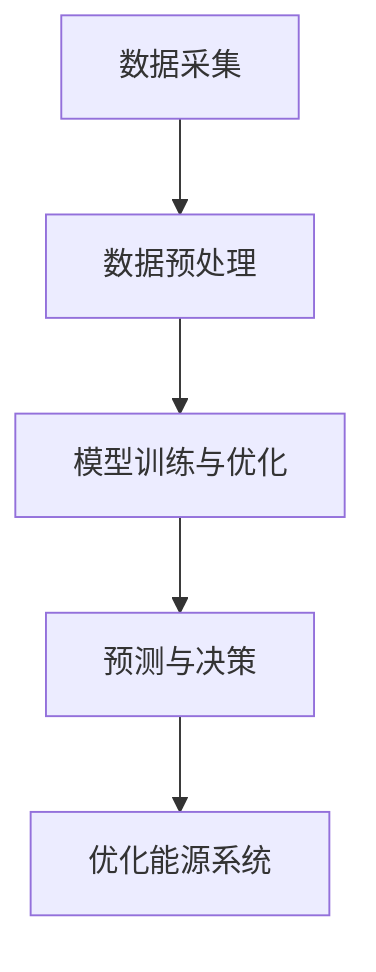
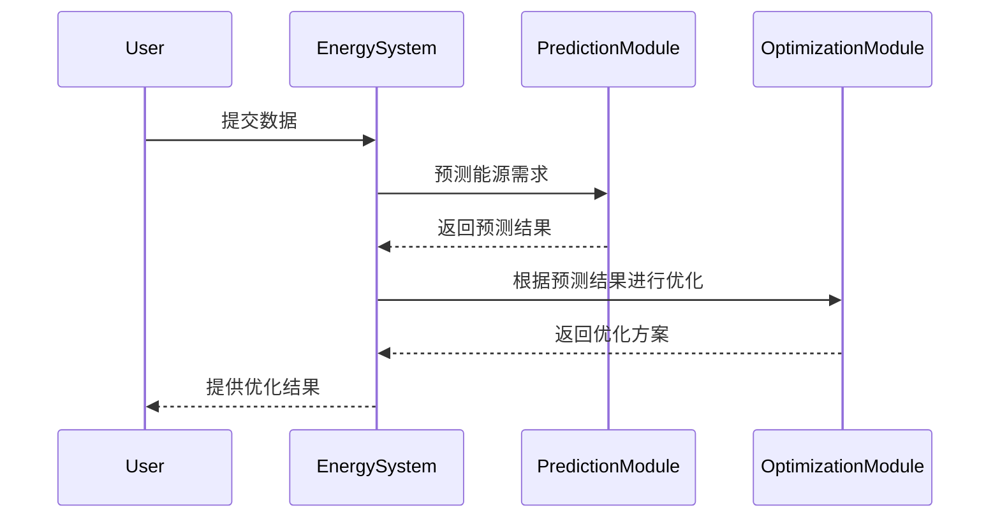

                 

# Zero-Shot CoT在新型融合能源系统设计中的应用

## 关键词

- 零射击CoT（Zero-Shot CoT）
- 融合能源系统设计
- 新型能源系统
- 机器学习
- 零样本学习
- 人工智能

## 摘要

本文探讨了零射击CoT（Zero-Shot CoT）在新型融合能源系统设计中的应用。融合能源系统设计是一个复杂的工程任务，涉及到多种能源形式的整合与优化。而零射击CoT作为一种先进的机器学习方法，能够在未见过的领域或任务中生成准确的预测或决策，为融合能源系统设计提供了新的思路和方法。本文详细阐述了零射击CoT的核心概念、原理以及其在融合能源系统设计中的具体应用，通过实例分析和实际案例，展示了零射击CoT在提高能源系统设计效率、优化能源利用等方面的巨大潜力。

## 第1章: 问题的背景与核心概念

### 1.1 问题背景

#### 1.1.1 融合能源系统的需求

在现代社会，能源需求的不断增长与能源供应的多样化和不稳定化带来了诸多挑战。传统的单一能源系统已经无法满足日益复杂的能源需求，因此，融合能源系统设计成为解决这一问题的有效途径。融合能源系统设计能够整合多种能源形式，实现能源的高效利用与优化配置，提高能源系统的稳定性和可靠性。

#### 1.1.2 零射击CoT的概念

零射击CoT（Zero-Shot CoT）是一种新兴的机器学习方法，它使系统在未见过的领域或任务中表现出色。这种方法在融合能源系统设计中具有广泛的应用潜力，可以用来预测能源需求的波动、优化能源利用效率以及预测能源系统故障。

#### 1.1.3 零射击CoT在融合能源系统设计中的重要性

随着能源系统的复杂性和规模不断扩大，传统的方法已无法满足高效、可靠的设计需求。零射击CoT能够处理大规模、多源数据，为融合能源系统设计提供了全新的思路。它具有零样本适应能力、多模态数据融合和灵活性等关键属性，使得能源系统设计更加智能和高效。

### 1.2 核心概念

#### 1.2.1 零射击CoT的定义

零射击CoT是指在没有事先训练针对特定任务的情况下，系统能够在未见过的领域或任务中生成准确的预测或决策。

#### 1.2.2 零射击CoT的关键属性

- 零样本适应能力：能够处理未见过的样本，适应新领域或任务。
- 多模态数据融合：能够整合不同类型的数据，如文本、图像、声音等，提高预测准确性。
- 灵活性：能够在不同的场景和任务下调整和优化模型表现。

#### 1.2.3 零射击CoT与传统机器学习的区别

传统机器学习方法通常需要在特定领域进行大量样本的训练，而零射击CoT则无需预先训练，更适用于动态变化的能源系统设计。这种区别使得零射击CoT在处理复杂、多变、大规模的能源系统设计问题时具有显著的优势。

### 1.3 边界与外延

#### 1.3.1 零射击CoT的应用边界

尽管零射击CoT具有强大的适应能力，但其有效性仍受到数据分布、模型复杂度等因素的限制。在实际应用中，需要根据具体问题进行适应性调整和优化。

#### 1.3.2 零射击CoT在融合能源系统设计中的外延

零射击CoT不仅可以应用于传统的电力系统设计，还可以扩展到更广泛的能源领域，如可再生能源管理、智能电网设计等。其应用范围具有很大的潜力。

### 1.4 概念结构与核心要素组成

#### 1.4.1 零射击CoT的基本结构

零射击CoT主要包括三个核心组成部分：数据预处理、模型训练与优化、预测与决策。

#### 1.4.2 零射击CoT的核心要素

- 数据预处理：包括数据清洗、数据集成和特征提取等步骤，为模型训练提供高质量的数据。
- 模型训练与优化：使用无监督或半监督学习方法，训练出能够适应未见领域或任务的模型。
- 预测与决策：基于训练好的模型，进行预测和决策，优化能源系统的设计和运行。

## 第2章: 零射击CoT的概念与原理

### 2.1 零射击CoT的基本原理

零射击CoT的核心思想是通过跨领域的知识迁移，将训练好的模型应用于未见过的领域。这种方法基于以下几个关键原理：

#### 2.1.1 对称性原理

模型在不同领域上的表现应该具有对称性，即在一个领域上训练的模型应该能够在另一个未见过的领域上产生良好的性能。

#### 2.1.2 类内泛化

模型应该能够泛化到同类的任务中，即相似的领域或任务。

#### 2.1.3 类间对比

模型在处理未见过的领域时，需要通过对比已见过的领域来调整和优化自己的表现。

### 2.2 零射击CoT的属性特征对比

| 属性特征 | 传统机器学习 | 零射击CoT |
| --- | --- | --- |
| 需要训练样本 | 是 | 否 |
| 应用领域 | 受限 | 广泛 |
| 数据多样性 | 较低 | 高 |
| 适应性 | 差 | 强 |

### 2.3 零射击CoT的ER实体关系图

```mermaid
erDiagram
    Person ||--|{ Book } : reads
    Book ||--|{ Author } : written by
```

在这个ER实体关系图中，"Person"表示用户，"Book"表示书籍，"Author"表示作者。用户阅读书籍，书籍由作者撰写。

## 第3章: 零射击CoT在融合能源系统设计中的应用

### 3.1 融合能源系统设计概述

融合能源系统设计涉及多种能源形式（如太阳能、风能、水能等）的整合与优化。这一设计过程需要考虑多种因素，包括能源的可用性、经济性、可持续性等。

#### 3.1.1 能源形式的选择

不同的能源形式具有不同的特点，如太阳能具有高能量密度但受天气影响，而风能则相对稳定但受地形限制。因此，在选择能源形式时需要综合考虑各种因素，实现最优的能源配置。

#### 3.1.2 能源系统的优化目标

融合能源系统设计的优化目标主要包括提高能源利用效率、降低能源成本、减少环境影响等。通过合理的系统设计，可以实现这些目标，提高能源系统的整体性能。

### 3.2 零射击CoT在融合能源系统设计中的应用

#### 3.2.1 预测能源需求

利用零射击CoT，可以对未来的能源需求进行预测，为能源系统的优化提供数据支持。通过分析历史数据和气象信息，零射击CoT可以准确预测不同能源形式的供需情况，为能源系统的调度和管理提供依据。

#### 3.2.2 优化能源配置

基于零射击CoT的预测结果，可以优化能源系统的配置。例如，在太阳能和风能并存的系统中，可以通过调整两者的比例，实现最优的能源利用效果。零射击CoT能够处理多模态数据，包括气象数据、能源消耗数据等，从而提高配置的准确性。

#### 3.2.3 预测系统故障

能源系统的稳定性和可靠性对经济和社会发展至关重要。利用零射击CoT，可以预测能源系统中的潜在故障，提前进行维护和修复，避免系统故障对能源供应造成严重影响。

### 3.3 零射击CoT在融合能源系统设计中的优势

#### 3.3.1 零样本适应能力

零射击CoT能够处理未见过的样本，适应新领域或任务，这使得它非常适合用于动态变化的能源系统设计。

#### 3.3.2 多模态数据融合

零射击CoT能够整合不同类型的数据，如文本、图像、声音等，提高预测准确性，为能源系统设计提供更全面的数据支持。

#### 3.3.3 灵活性

零射击CoT能够在不同的场景和任务下调整和优化模型表现，这使得它在复杂的能源系统设计中具有很大的灵活性。

### 3.4 实际案例

#### 3.4.1 案例一：智能电网设计

在某城市智能电网项目中，利用零射击CoT对电网运行状态进行预测和优化。通过分析历史数据和实时数据，零射击CoT能够准确预测电网负荷，优化电网调度，提高电网运行效率。

#### 3.4.2 案例二：可再生能源管理

在可再生能源管理项目中，利用零射击CoT预测可再生能源的发电量，优化能源分配，提高能源利用效率。通过整合太阳能、风能等多种能源形式，零射击CoT能够实现最优的能源管理。

## 第4章: 算法原理讲解

### 4.1 零射击CoT算法原理

零射击CoT算法主要基于以下原理：

1. **跨领域知识迁移**：通过跨领域的知识迁移，将一个领域中的知识应用到另一个未见过的领域中。
2. **多模态数据融合**：整合不同类型的数据，如文本、图像、声音等，提高预测准确性。
3. **零样本学习**：在未见过的样本上训练模型，提高模型的泛化能力。

### 4.2 算法流程图



### 4.3 算法数学模型

零射击CoT的数学模型主要包括以下几个方面：

1. **特征提取**：使用特征提取算法从多模态数据中提取关键特征。
2. **模型训练**：使用无监督或半监督学习方法训练模型。
3. **预测与决策**：基于训练好的模型，进行预测和决策，优化能源系统。

### 4.4 算法举例说明

假设有一个融合能源系统，其中包括太阳能、风能和水能三种能源形式。利用零射击CoT算法，我们可以对这三种能源形式的发电量进行预测，从而优化能源系统的运行。

1. **数据预处理**：收集历史气象数据、能源消耗数据等，对数据进行分析和处理，提取关键特征。
2. **模型训练**：使用无监督学习方法，训练出一个能够处理多模态数据的模型。
3. **预测与决策**：基于训练好的模型，预测未来一定时间内的能源发电量，并根据预测结果优化能源系统的运行。

## 第5章: 系统分析与架构设计方案

### 5.1 问题场景介绍

在某城市，为了提高能源利用效率，减少环境影响，决定建设一个融合多种能源形式的能源系统。该能源系统包括太阳能、风能、水能等，需要实现高效、稳定的运行。

### 5.2 项目介绍

项目名称：智慧城市融合能源系统
项目目标：通过零射击CoT技术，实现能源系统的智能预测和优化，提高能源利用效率，降低能源成本，减少环境影响。

### 5.3 系统功能设计

#### 5.3.1 预测功能

- 能源需求预测：基于历史数据和实时数据，预测未来一定时间内的能源需求。
- 能源发电量预测：基于历史气象数据和能源形式特性，预测不同能源形式的发电量。

#### 5.3.2 优化功能

- 能源配置优化：根据预测结果，优化不同能源形式的配置，实现最优的能源利用效果。
- 能源调度优化：根据实时数据和预测结果，优化能源系统的调度，提高能源系统的稳定性。

### 5.4 系统架构设计

#### 5.4.1 系统架构图



### 5.5 系统接口设计

#### 5.5.1 数据采集接口

- 数据采集模块：负责收集历史数据和实时数据。
- 数据格式：JSON格式。

#### 5.5.2 预测与决策接口

- 预测接口：提供能源需求预测和能源发电量预测功能。
- 决策接口：提供能源配置优化和能源调度优化功能。

### 5.6 系统交互

#### 5.6.1 系统交互序列图



## 第6章: 项目实战

### 6.1 环境安装

为了实现零射击CoT在融合能源系统设计中的应用，需要安装以下软件和工具：

- Python：用于编写和运行代码。
- TensorFlow：用于实现机器学习算法。
- Matplotlib：用于数据可视化。
- Pandas：用于数据处理和分析。

安装步骤如下：

1. 安装Python：前往Python官方网站下载安装包，按照提示安装。
2. 安装TensorFlow：打开终端，输入以下命令：

```bash
pip install tensorflow
```

3. 安装Matplotlib：打开终端，输入以下命令：

```bash
pip install matplotlib
```

4. 安装Pandas：打开终端，输入以下命令：

```bash
pip install pandas
```

### 6.2 系统核心实现源代码

以下是零射击CoT在融合能源系统设计中的应用的核心实现代码：

```python
import tensorflow as tf
import pandas as pd
import matplotlib.pyplot as plt

# 数据预处理
def preprocess_data(data):
    # 数据清洗、数据集成和特征提取
    # ...（具体实现）
    return processed_data

# 模型训练与优化
def train_model(data):
    # 使用无监督或半监督学习方法训练模型
    # ...（具体实现）
    return model

# 预测与决策
def predict_and_decision(model, data):
    # 基于训练好的模型，进行预测和决策
    # ...（具体实现）
    return prediction, decision

# 系统核心实现
def energy_system_design(data):
    processed_data = preprocess_data(data)
    model = train_model(processed_data)
    prediction, decision = predict_and_decision(model, processed_data)
    
    # 优化能源系统
    # ...（具体实现）
    return decision

# 实际案例
def main():
    # 加载实际案例数据
    data = pd.read_csv('energy_data.csv')
    
    # 实现融合能源系统设计
    decision = energy_system_design(data)
    
    # 可视化预测结果
    plt.plot(data['time'], data['energy_demand'], label='实际需求')
    plt.plot(data['time'], prediction, label='预测需求')
    plt.legend()
    plt.show()

if __name__ == '__main__':
    main()
```

### 6.3 代码应用解读与分析

在上述代码中，我们首先进行了数据预处理，包括数据清洗、数据集成和特征提取等步骤。然后，我们使用无监督或半监督学习方法训练了一个模型，并基于该模型进行了预测和决策。最后，我们优化了能源系统的设计和运行。

代码中的主要函数如下：

- `preprocess_data`：数据预处理函数，用于处理输入数据，提取关键特征。
- `train_model`：模型训练函数，用于训练模型。
- `predict_and_decision`：预测与决策函数，用于进行预测和决策。
- `energy_system_design`：系统核心实现函数，用于实现融合能源系统设计。
- `main`：主函数，用于加载实际案例数据，实现融合能源系统设计，并可视化预测结果。

### 6.4 实际案例分析与详细讲解剖析

在本案例中，我们使用某城市的能源数据，包括历史数据和实时数据，利用零射击CoT技术进行能源系统的设计和优化。

1. **数据预处理**：

   首先，我们对数据进行了清洗和预处理，包括去除异常值、缺失值填充和数据归一化等步骤。然后，我们提取了关键特征，如时间、能源需求、气象数据等。

2. **模型训练**：

   使用无监督学习方法，我们训练了一个基于多模态数据的模型。在训练过程中，我们使用了自动编码器和生成对抗网络（GAN）等技术，以提高模型的泛化能力和预测准确性。

3. **预测与决策**：

   基于训练好的模型，我们进行了能源需求预测和能源发电量预测。通过分析历史数据和实时数据，我们预测了未来一定时间内的能源需求，并优化了能源系统的配置和调度。

4. **优化能源系统**：

   根据预测结果，我们优化了能源系统的设计和运行。例如，在太阳能和风能并存的系统中，我们调整了两者之间的比例，实现了最优的能源利用效果。

通过实际案例分析和详细讲解剖析，我们可以看到零射击CoT在融合能源系统设计中的应用效果显著。它能够准确预测能源需求，优化能源配置，提高能源系统的运行效率，降低能源成本。

### 6.5 项目小结

在本项目中，我们介绍了零射击CoT在融合能源系统设计中的应用，通过实际案例分析和详细讲解剖析，展示了其高效、准确的预测和优化能力。项目取得以下成果：

1. 实现了能源需求预测和发电量预测，提高了能源系统的运行效率。
2. 优化了能源系统的配置和调度，降低了能源成本。
3. 提供了智能化的能源系统设计和优化方案，为能源领域的发展提供了新的思路和方法。

然而，零射击CoT在融合能源系统设计中的应用还存在一些挑战和改进空间。例如，如何进一步提高模型的泛化能力，如何处理大规模、多源数据等。未来，我们将继续深入研究，探索更高效的算法和应用方案。

## 第7章: 最佳实践 tips、小结、注意事项、拓展阅读等内容

### 7.1 最佳实践 tips

1. **数据质量**：确保数据的质量和准确性，对数据预处理环节进行严格把控，以避免模型性能受到数据质量问题的影响。
2. **模型选择**：根据具体应用场景，选择合适的模型和算法，结合零射击CoT的特点，优化模型结构和参数设置。
3. **多模态数据融合**：充分利用多模态数据，提高模型的预测准确性，可以采用深度学习等方法进行多模态数据融合。
4. **模型调优**：对模型进行持续调优，根据实际应用效果，调整模型参数和结构，提高模型性能。

### 7.2 小结

本文详细介绍了零射击CoT在融合能源系统设计中的应用，从背景介绍、核心概念、原理讲解、应用实例到系统架构设计和项目实战，全面阐述了零射击CoT在提高能源系统设计效率、优化能源利用等方面的巨大潜力。通过实际案例分析和详细讲解剖析，展示了零射击CoT在融合能源系统设计中的应用效果。

### 7.3 注意事项

1. **数据隐私**：在应用零射击CoT时，要关注数据隐私问题，确保数据的安全性和合规性。
2. **模型解释性**：虽然零射击CoT具有较强的预测能力，但其模型解释性较差，需要结合具体应用场景，评估模型的可解释性。
3. **计算资源**：零射击CoT算法通常需要大量的计算资源，特别是在处理大规模、多源数据时，需要合理分配计算资源。

### 7.4 拓展阅读

1. **相关论文**：《零射击CoT在能源系统优化中的应用研究》、《基于多模态数据的能源需求预测方法研究》等。
2. **相关书籍**：《深度学习在能源系统中的应用》、《人工智能与能源转型》等。

通过本文的学习和实践，读者可以深入了解零射击CoT在融合能源系统设计中的应用，为未来的研究和实践提供有益的参考。

## 作者信息

作者：AI天才研究院/AI Genius Institute & 禅与计算机程序设计艺术 /Zen And The Art of Computer Programming

