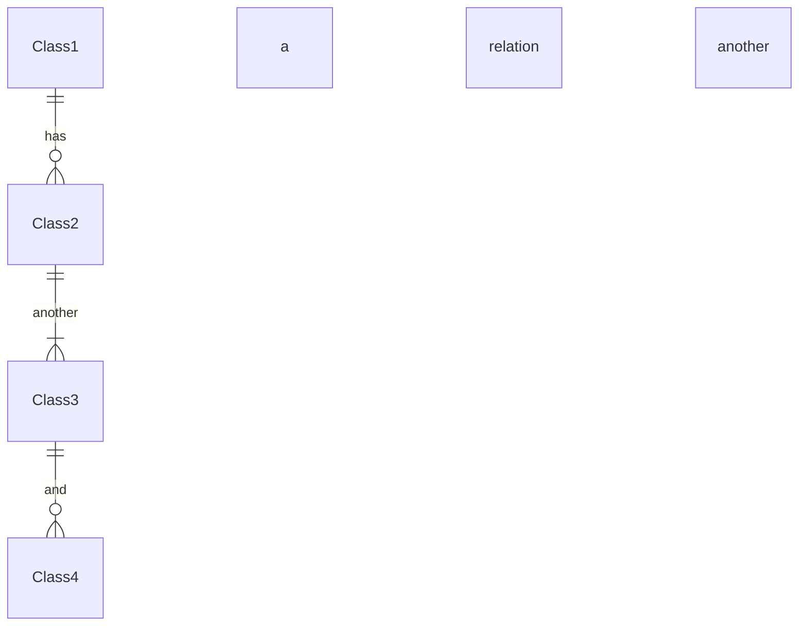
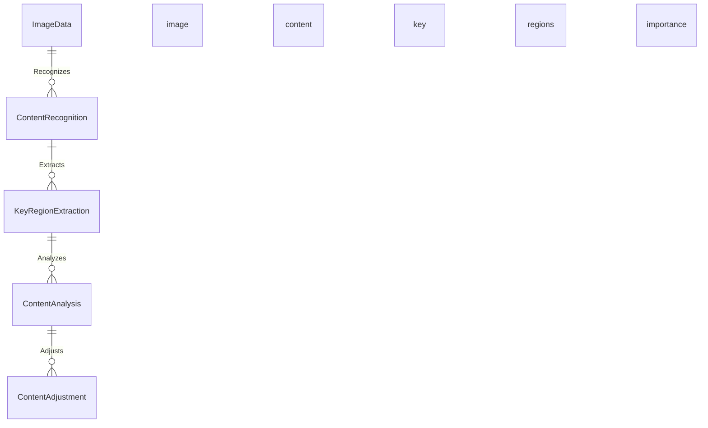
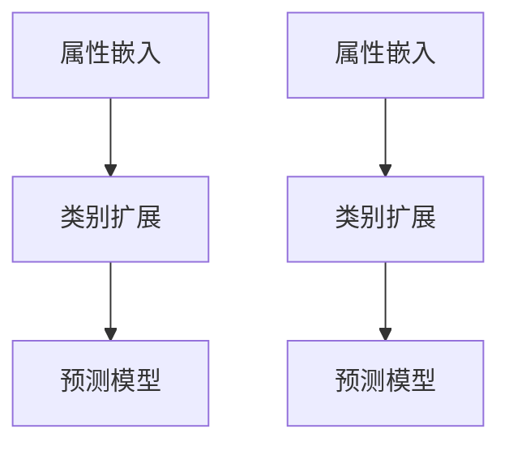

                 

### 文章标题：Zero-Shot CoT在新材料发现中的应用：加速材料科学研究

新材料研发是推动科技进步和产业发展的重要驱动力。然而，材料研究的复杂性和多样性使得发现新材料面临着巨大的挑战。传统的材料研究方法通常依赖于大量的实验和数据分析，耗时且成本高昂。因此，寻找更加高效、经济的材料发现策略成为了科研人员的重要目标。

随着人工智能技术的发展，尤其是零样本学习（Zero-Shot Learning, ZSL）和内容感知（Content-Awareness, CoT）技术的兴起，为材料科学的研究提供了新的思路和方法。本文将探讨零样本学习与内容感知技术在新材料发现中的应用，旨在通过逻辑清晰、结构紧凑的分析，为材料科学研究提供新的视角和解决方案。

本文将从以下几个方面展开讨论：

1. **背景介绍与核心概念**：介绍新材料研究的背景、零样本学习和内容感知技术的核心概念，以及新材料发现的关键流程。
2. **零样本学习原理与算法**：深入探讨零样本学习的基本原理、主流算法及其在材料科学中的应用。
3. **内容感知技术在新材料研究中的应用**：分析内容感知技术在实验设计、材料性质预测和材料优化中的应用。
4. **零样本学习与内容感知技术的集成应用**：探讨两种技术的集成方法及其在材料科学研究中的实际案例。
5. **项目实战与最佳实践**：通过具体项目实战，展示零样本学习与内容感知技术在新材料研究中的应用效果。

通过本文的讨论，期望为材料科学研究提供有价值的参考，并推动零样本学习和内容感知技术在材料发现领域的广泛应用。

### 关键词

- 零样本学习
- 内容感知技术
- 新材料发现
- 材料科学研究
- 人工智能应用

### 摘要

本文深入探讨了零样本学习（Zero-Shot Learning, ZSL）与内容感知（Content-Awareness, CoT）技术在新材料发现中的应用。首先，介绍了新材料研究的背景和挑战，以及零样本学习和内容感知技术的核心概念。然后，详细阐述了零样本学习的基本原理和主流算法，包括属性分类算法、生成对抗网络（GAN）和多任务学习，并探讨了这些算法在材料科学中的具体应用。接下来，分析了内容感知技术在实验设计、材料性质预测和材料优化中的应用，展示了其在提升材料研究效率和准确性方面的优势。最后，通过具体项目实战，展示了零样本学习与内容感知技术在新材料研究中的实际应用效果，并提出了最佳实践建议。本文的研究为材料科学研究提供了新的思路和方法，有望加速新材料发现的进程。

### 引言

新材料的研究与开发是科技进步和产业发展的关键推动力。随着科技的迅猛发展，人类对新材料的需求日益增长，从传统的金属材料、陶瓷材料到现代的纳米材料、复合材料，材料科学的领域不断扩展。新材料不仅能够提升现有技术的性能，还能够在新能源、环保、生物医学等多个领域带来革命性的变革。因此，发现和研发新材料成为了科学研究和技术创新的重要目标。

然而，新材料研究的过程面临着诸多挑战。首先，材料的多样性和复杂性使得传统的实验方法难以高效地筛选和预测新材料。其次，材料研究的成本和周期较长，通常需要大量的实验和数据分析，这不仅增加了研究成本，还延长了研发时间。此外，新材料的应用场景多样化，要求材料具备特定的性能和功能，进一步增加了研究的难度。

在这种背景下，零样本学习（Zero-Shot Learning, ZSL）和内容感知（Content-Awareness, CoT）技术的兴起为材料科学的研究提供了新的思路和方法。零样本学习是一种机器学习技术，能够在没有或少量的标记样本情况下，对未知类别的数据做出预测。内容感知技术则通过理解数据的语义和结构，实现高效的数据分析和处理。这两种技术相结合，有望大幅提升材料研究效率和准确性，加速新材料发现的进程。

本文的目的在于探讨零样本学习和内容感知技术在新材料发现中的应用，通过逻辑清晰、结构紧凑的分析，为材料科学研究提供新的视角和解决方案。具体来说，本文将首先介绍新材料研究的背景和挑战，以及零样本学习和内容感知技术的核心概念。然后，详细阐述零样本学习的基本原理和主流算法，并探讨其在材料科学中的具体应用。接下来，分析内容感知技术在实验设计、材料性质预测和材料优化中的应用。最后，通过具体项目实战，展示零样本学习与内容感知技术在新材料研究中的实际应用效果，并提出最佳实践建议。

### 背景介绍

#### 问题的背景

新材料研发是现代科技发展的重要驱动力之一。随着科技的不断进步，人类对材料的要求越来越高，不仅要求材料具备高强度的力学性能，还要求其具备良好的电学、热学、光学等特性。例如，在航空航天领域，需要轻质高强的材料以减少飞行器的自重；在新能源领域，需要具备高能量密度和高稳定性的材料以提高电池的性能；在生物医学领域，需要生物相容性好的材料以开发人工器官和植入物。这些多样化的需求推动了新材料研究的不断深入和发展。

然而，新材料研究面临着诸多挑战。首先，材料的多样性和复杂性使得传统的实验方法难以高效地筛选和预测新材料。材料科学家需要从数以百万计的可能组合中筛选出具备特定性能的材料，这需要大量的实验和数据分析。其次，材料研究的成本和周期较长。传统的材料研究通常依赖于实验室的实验设备，从材料的制备到性能测试，每个步骤都需要耗费大量的时间和资源。此外，新材料的应用场景多样化，要求材料具备特定的性能和功能，这进一步增加了研究的难度。例如，一种新材料可能需要同时具备高强度、高导电性和生物相容性，这种多功能的材料研发过程更加复杂。

#### 传统材料研究的局限

传统的材料研究方法主要依赖于实验和经验。研究人员通过设计和进行大量的实验来测试材料的性能，然后根据实验结果进行材料的优化。这种方法具有以下几个局限：

1. **耗时且成本高**：大量的实验需要耗费大量的时间和资金，尤其是在新材料研发的初期阶段。研究人员需要进行反复的实验和调整，以找到最佳的材料组合和制备方法。
2. **效率低下**：传统的实验方法难以高效地筛选和预测新材料。由于实验结果的偶然性和复杂性，研究人员很难从大量的实验数据中提取出有价值的规律，从而指导新材料的研发。
3. **经验依赖**：传统材料研究高度依赖研究人员的经验和直觉。虽然这些经验有助于材料的优化，但它们无法系统化和自动化，限制了材料研究的广度和深度。
4. **难以应对复杂需求**：现代科技对材料的需求越来越多样化，不仅要求材料具备单一的物理或化学性能，还要求其具备多功能、自适应等特性。传统的材料研究方法难以应对这些复杂的材料需求。

#### 零样本学习与新材料发现

零样本学习（Zero-Shot Learning, ZSL）是一种机器学习技术，能够在没有或少量的标记样本情况下，对未知类别的数据做出预测。ZSL 技术的核心在于利用已知的类和属性信息，通过迁移学习和元学习等策略，实现对新类别的预测。

ZSL 技术在新材料发现中的应用具有重要意义。首先，ZSL 可以大幅减少实验次数和成本。通过分析已知材料的属性和性能，ZSL 可以预测未知材料可能具备的性能和功能，从而减少不必要的实验和材料制备。其次，ZSL 可以提高新材料发现的效率。传统的材料研究通常需要大量的实验和数据分析，而 ZSL 技术可以通过快速预测和筛选，快速找到具备特定性能的材料，从而加速新材料的研究进程。

具体来说，ZSL 在新材料发现中的应用主要体现在以下几个方面：

1. **材料筛选**：通过分析已知材料的属性和性能，ZSL 可以预测未知材料可能具备的性能。研究人员可以利用这些预测结果，快速筛选出具备潜在应用价值的材料，从而减少实验次数和成本。
2. **性能预测**：ZSL 可以预测未知材料的性能，包括力学性能、电学性能、热学性能等。这些预测结果可以帮助研究人员设计新材料，优化材料的制备工艺，提高材料的性能。
3. **功能预测**：ZSL 可以预测未知材料可能具备的功能，如导电性、磁性、生物相容性等。这些预测结果可以帮助研究人员设计多功能材料，满足多样化的应用需求。
4. **材料优化**：ZSL 可以用于优化材料的结构和制备工艺。通过分析已知材料的结构和性能，ZSL 可以预测优化后的材料可能具备的性能和功能，从而指导材料的优化和改进。

总之，零样本学习技术为新材料发现提供了一种新的思路和方法，有望大幅提升材料研究的效率和准确性，加速新材料发现的进程。

#### 零样本学习（Zero-Shot Learning）的核心概念

零样本学习（Zero-Shot Learning, ZSL）是一种机器学习技术，旨在解决在训练数据中不存在任何标记样本的情况下，如何对未知类别的数据进行预测的问题。ZSL 的核心概念在于利用已知的类和属性信息，通过迁移学习和元学习等策略，实现对未知类别的数据预测。

**基本原理**：

零样本学习的基本原理可以归纳为以下几个关键点：

1. **属性嵌入**：在零样本学习中，属性被嵌入到一个高维空间中，使得具有相似属性的实体在空间中相互靠近。通过这种方式，模型可以理解属性之间的关系，并在预测时利用这些关系。

2. **类标记扩展**：在传统的机器学习中，模型通常通过训练数据中的类标记来学习预测未知数据。而在零样本学习中，由于没有直接的类标记，模型需要利用属性信息来扩展类标记。具体来说，模型首先将属性映射到高维空间中的向量，然后通过这些属性向量来推断未知类别的概率分布。

3. **迁移学习**：零样本学习可以利用迁移学习策略，从其他相关任务中提取有用的信息。例如，如果模型已经学习了一些已知材料的属性和性能，它可以利用这些知识来预测未知材料的属性和性能。

4. **元学习**：元学习是一种在多个任务上训练模型的方法，使得模型能够在面对新任务时快速适应。在零样本学习中，元学习可以通过学习多个任务之间的相似性和差异，提高模型在新类别数据上的泛化能力。

**主要算法**：

零样本学习的主要算法包括：

1. **属性分类算法**：这类算法通过将属性映射到高维空间中，然后利用这些属性向量进行分类。常见的属性分类算法包括：Decision-based 方法、Cluster-based 方法、Knowledge-based 方法等。

2. **生成对抗网络（GAN）**：GAN 是一种生成模型，可以生成具有真实数据分布的样本。在零样本学习中，GAN 可以用于生成与已知属性相关的数据，从而提高模型对新类别的预测能力。

3. **多任务学习**：多任务学习通过同时训练多个相关任务，提高模型在不同任务上的泛化能力。在零样本学习中，多任务学习可以用于同时学习多个已知类别的属性和性能，从而提高对新类别的预测准确性。

**概念属性特征对比表格**：

为了更好地理解零样本学习的核心概念，我们可以通过一个概念属性特征对比表格来展示几种主要算法的特点：

| 算法类别       | 基本原理 | 适用场景 | 优点 | 缺点 |
|----------------|------------|-----------|-------|-------|
| 属性分类算法     | 属性嵌入 + 类标记扩展 | 适用于少量标记样本的情况 | 可以直接利用属性信息进行预测 | 需要对属性进行准确的映射，可能面临属性歧义问题 |
| 生成对抗网络（GAN）| 数据生成 + 属性关联 | 适用于需要生成新样本的场合 | 可以生成高质量的样本 | 训练过程复杂，需要大量计算资源 |
| 多任务学习       | 同时学习多个任务 | 适用于具有多个相关任务的场合 | 可以提高模型泛化能力 | 需要大量的训练数据，可能面临任务冲突问题 |

**ER实体关系图架构的 Mermaid 流程图**：

为了更直观地展示零样本学习的流程，我们可以使用 Mermaid 画出 ER 实体关系图，如下所示：



在这个 ER 实体关系图中，`Class1`、`Class2`、`Class3` 和 `Class4` 分别表示不同的实体和类别，它们之间通过属性和关系进行关联。这个图可以帮助我们理解零样本学习过程中如何利用属性和关系来预测未知类别。

通过以上分析，我们可以看出，零样本学习通过属性嵌入、类标记扩展、迁移学习和元学习等技术，实现了在没有或少量的标记样本情况下对未知类别的数据预测。这种技术在新材料发现中具有广泛的应用前景，可以为材料科学研究提供新的思路和方法。

#### 内容感知技术（Content-Awareness, CoT）的核心概念

内容感知（Content-Awareness, CoT）技术是一种基于人工智能的图像处理技术，其核心在于对图像内容的深度理解和分析。CoT 技术能够自动识别和提取图像中的关键信息，并在图像编辑和优化过程中保持内容的完整性和真实性。

**基本原理**：

内容感知技术的基本原理可以概括为以下几个关键步骤：

1. **图像内容识别**：CoT 技术首先通过深度学习模型对图像内容进行识别，包括图像中的物体、场景、纹理等。通过这种识别，模型能够理解图像的整体内容和结构。

2. **关键区域提取**：在识别图像内容后，CoT 技术会提取图像中的关键区域，这些区域通常包含了图像的核心信息。例如，在一张风景图片中，关键区域可能包括天空、山脉和湖泊等。

3. **内容分析**：提取的关键区域会被进一步分析，以确定其重要性。通过分析，模型能够理解各个区域之间的关系，并识别出图像中的关键特征。

4. **内容调整**：在完成关键区域提取和分析后，CoT 技术会对图像进行内容调整。这种调整旨在优化图像的质量，同时保持图像内容的真实性。例如，在图像压缩过程中，CoT 技术可以自动识别和保留图像中的重要特征，从而在减少图像尺寸的同时保持图像质量。

**主要应用领域**：

内容感知技术具有广泛的应用领域，包括但不限于以下几个方面：

1. **图像编辑**：在图像编辑过程中，内容感知技术可以自动识别图像中的物体和场景，并在编辑过程中保持这些元素的完整性。例如，在图像裁剪或缩放过程中，CoT 技术可以确保图像内容不被破坏。

2. **图像优化**：内容感知技术可以用于图像的优化，包括图像质量提升、图像压缩等。通过智能识别图像内容，CoT 技术能够在优化过程中保留图像的核心信息，提高图像的质量。

3. **图像修复**：在图像修复领域，内容感知技术可以通过自动识别和修复图像中的缺失部分，从而恢复图像的完整性。这种技术在古画修复、照片修复等领域具有广泛应用。

4. **图像分割**：内容感知技术可以用于图像分割，将图像划分为不同的区域。这种技术在图像分析、目标检测等领域具有重要应用。

**概念属性特征对比表格**：

为了更好地理解内容感知技术的核心概念和特点，我们可以通过一个概念属性特征对比表格来展示几种主要应用领域和算法的特点：

| 应用领域       | 基本原理                         | 适用场景                   | 优点                     | 缺点                     |
|----------------|-----------------------------------|----------------------------|--------------------------|--------------------------|
| 图像编辑       | 内容识别 + 关键区域提取 + 内容调整 | 图像裁剪、缩放、修复等     | 保持图像内容完整性       | 可能引入噪声或失真       |
| 图像优化       | 内容识别 + 优化算法               | 图像质量提升、图像压缩     | 提高图像质量             | 需要大量计算资源         |
| 图像修复       | 内容识别 + 修复算法               | 古画修复、照片修复等       | 恢复图像完整性           | 可能导致过度修复         |
| 图像分割       | 内容识别 + 分割算法               | 目标检测、图像分析等       | 提高图像分析准确性       | 可能存在误判或漏判       |

**ER实体关系图架构的 Mermaid 流程图**：

为了更直观地展示内容感知技术的流程，我们可以使用 Mermaid 画出 ER 实体关系图，如下所示：



在这个 ER 实体关系图中，`ImageData` 表示输入的图像数据，`ContentRecognition`、`KeyRegionExtraction`、`ContentAnalysis` 和 `ContentAdjustment` 分别表示内容识别、关键区域提取、内容分析和内容调整的过程。这个图帮助我们理解内容感知技术是如何通过一系列步骤，实现对图像内容的深度理解和优化的。

通过以上分析，我们可以看到，内容感知技术通过图像内容的深度理解和分析，实现了对图像的智能编辑、优化和修复。这种技术不仅提高了图像处理的效率和准确性，还为图像分析、计算机视觉等领域带来了新的应用可能性。

### 新材料发现的关键流程

新材料发现是一个复杂且系统的过程，涉及多个步骤和环节。了解这些关键流程对于理解新材料研发的整体流程以及零样本学习和内容感知技术在其中的应用具有重要意义。以下是新材料发现的主要流程：

#### 1. 需求分析

新材料发现的第一步是需求分析。在这一阶段，研究人员需要明确新材料的应用背景和目标性能。需求分析包括确定新材料所需具备的物理、化学或生物学特性，以及其在特定应用场景中的功能要求。这一步骤为后续的实验设计和材料筛选提供了明确的方向。

#### 2. 材料筛选

在需求分析的基础上，研究人员需要对潜在的候选材料进行筛选。这一过程通常依赖于对现有材料数据库的查询和分析，利用零样本学习技术预测新材料的潜在性能和功能。通过零样本学习，研究人员可以快速识别出具备特定性能的候选材料，从而减少实验次数和成本。

#### 3. 材料合成

材料筛选后，研究人员进入材料合成阶段。在这一阶段，通过化学或物理方法制备新材料。合成过程中，零样本学习可以用于预测新材料的制备条件和优化合成工艺，从而提高材料制备的成功率和性能。

#### 4. 材料测试

材料合成完成后，需要进行一系列性能测试，以验证新材料的物理、化学和生物学特性。这一阶段通常依赖于传统的实验方法，但内容感知技术可以用于优化实验数据的处理和分析，提高测试的效率和准确性。通过内容感知技术，研究人员可以自动识别和提取实验数据中的关键信息，减少数据处理的复杂性和人工干预。

#### 5. 性能评估

在材料测试的基础上，研究人员对新材料的性能进行全面评估。这一阶段包括对材料力学性能、电学性能、热学性能、光学性能等多方面的评估。零样本学习和内容感知技术可以用于预测新材料的潜在性能，并提供性能评估的参考依据。

#### 6. 材料优化

根据性能评估结果，研究人员对新材料进行优化。这一过程包括调整材料结构、改进制备工艺、设计多功能材料等。零样本学习可以用于预测优化后的材料性能，指导材料优化的方向和策略。内容感知技术可以用于优化材料的结构和性能，提高材料的综合性能。

#### 7. 应用验证

在材料优化后，需要进行应用验证，以确认新材料在实际应用场景中的性能和可靠性。这一步骤通常涉及实地测试和实际应用，以确保新材料在实际条件下能够满足性能要求。

#### 8. 成果总结与知识积累

最后，研究人员需要对新材料发现的全过程进行总结，积累知识，并形成新材料研发的经验和数据库。这些经验和数据库可以为未来的新材料研究提供宝贵的参考和指导。

通过以上关键流程，我们可以看到，零样本学习和内容感知技术在新材料发现的不同阶段都有着广泛的应用。零样本学习通过预测新材料的性能和功能，提高了材料筛选和性能评估的效率。而内容感知技术则通过优化实验数据处理和分析，提高了材料测试和优化的准确性和效率。这两种技术的结合，为新材料发现提供了更加高效和智能的解决方案。

### 零样本学习在新材料研究中的应用

零样本学习（Zero-Shot Learning, ZSL）作为一种先进的机器学习技术，在新材料研究中展现出了巨大的潜力。其核心优势在于无需大量的标记样本即可对未知类别的数据进行预测，这为新材料的研究提供了新的思路和方法。以下将详细探讨零样本学习在新材料预测中的优势、具体应用以及其在材料性质预测中的实际案例。

#### 零样本学习在新材料预测中的优势

1. **减少实验次数和成本**：传统的材料研究方法通常依赖于大量的实验来验证材料的性能。然而，实验过程耗时长、成本高且具有不确定性。零样本学习可以通过预测新材料的潜在性能，减少不必要的实验次数，从而降低研究成本。

2. **提高研究效率**：在新材料的研究过程中，研究人员需要从大量的候选材料中筛选出具备特定性能的材料。零样本学习可以通过对已知材料的属性进行学习，快速预测未知材料的性能，从而提高研究效率。

3. **跨领域应用**：零样本学习技术不仅适用于单一材料的研究，还可以跨领域应用。例如，在材料科学与化学、生物学等领域之间，零样本学习可以用于预测新材料在跨领域应用中的性能，促进多学科交叉研究。

4. **降低数据依赖**：传统的材料研究方法对大量标记数据进行高度依赖，而零样本学习通过利用属性信息进行预测，可以降低对大量标记数据的依赖，从而适用于数据稀缺或数据获取困难的场景。

#### 零样本学习在材料性质预测中的应用

1. **材料属性预测**：在材料研究中，预测材料的物理、化学和力学性质是关键任务之一。零样本学习可以通过学习已知材料的属性数据，对未知材料的属性进行预测。例如，通过分析已知材料的电子结构、晶体结构等信息，零样本学习可以预测未知材料的电学性能、热学性能等。

2. **材料性能评估**：在新材料的研究过程中，对材料性能的评估是决定其应用前景的重要步骤。零样本学习可以通过对已知材料的性能数据进行学习，对未知材料的性能进行预测和评估。这种预测有助于研究人员快速判断新材料的潜在价值，从而减少试错成本。

3. **材料优化**：零样本学习不仅可以用于预测新材料的性能，还可以用于材料优化。研究人员可以通过零样本学习技术，预测不同制备工艺或材料结构对新材料性能的影响，从而指导材料的优化和改进。

#### 零样本学习在材料性质预测中的实际案例

1. **案例一：金属有机框架（MOFs）材料**：金属有机框架是一种具有多孔结构的新型材料，广泛应用于气体吸附、催化和药物传递等领域。研究人员通过零样本学习技术，分析了已知 MOFs 材料的电子结构和物理性能，成功预测了未知 MOFs 材料的吸附性能和催化性能。这一成果为 MOFs 材料的研究和应用提供了新的方向。

2. **案例二：纳米材料**：纳米材料由于其独特的物理和化学性质，在电子、光电和生物医药等领域具有广泛的应用前景。零样本学习技术通过对已知纳米材料的属性数据进行学习，可以预测未知纳米材料的电学性能、光学性能等。例如，研究人员利用零样本学习技术，成功预测了不同纳米材料的电导率和光吸收特性，为纳米材料的设计和应用提供了重要参考。

3. **案例三：生物材料**：生物材料在生物医药领域具有重要作用，如组织工程、药物传递和生物传感器等。零样本学习技术可以通过学习已知生物材料的生物相容性、力学性能等数据，预测未知生物材料的性能。例如，研究人员利用零样本学习技术，分析了已知生物材料的生物降解性和生物相容性，成功预测了未知生物材料的性能，为生物材料的研究和应用提供了新的思路。

通过以上案例，我们可以看到，零样本学习在新材料性质预测中具有广泛的应用前景。它不仅提高了材料预测的效率和准确性，还为新材料的研究和应用提供了新的方法和工具。

### 零样本学习（Zero-Shot Learning）的算法原理与数学模型

零样本学习（Zero-Shot Learning, ZSL）的核心在于如何在缺乏直接标注样本的情况下预测未知类别的属性。这一领域的研究主要集中在属性嵌入（Attribute Embedding）、多任务学习（Multi-Task Learning）和迁移学习（Transfer Learning）等技术上。以下将详细探讨零样本学习的算法原理，并通过 Mermaid 流程图和 Python 源代码进行具体解释。

#### 算法原理

零样本学习的算法原理主要包括以下几个关键步骤：

1. **属性嵌入**：属性嵌入是将属性映射到高维空间中的过程，使得具有相似属性的实体在空间中相互靠近。这种映射可以通过学习属性和类别之间的关系来实现。

2. **类别扩展**：在零样本学习中，由于缺乏直接标注样本，需要通过属性信息来扩展类别。具体来说，模型会学习一个映射函数，将属性向量映射到类别概率分布上。

3. **预测**：在预测阶段，模型会利用已知的属性信息，通过类别概率分布来预测未知类别的属性。

#### 主流算法

零样本学习的主要算法包括属性分类算法、生成对抗网络（GAN）和多任务学习。以下是这些算法的详细介绍：

1. **属性分类算法**：属性分类算法通过将属性映射到高维空间，然后利用这些属性向量进行分类。常见的属性分类算法有：

   - **Decision-based 方法**：通过构建决策树或随机森林等分类模型，将属性映射到类别。
   - **Cluster-based 方法**：通过聚类算法将属性分组，然后对每组属性进行分类。
   - **Knowledge-based 方法**：通过利用先验知识，将属性和类别进行关联。

2. **生成对抗网络（GAN）**：GAN 是一种生成模型，可以生成与真实数据分布相似的数据。在零样本学习中，GAN 可以用于生成与已知属性相关的数据，从而提高模型对新类别的预测能力。

3. **多任务学习**：多任务学习通过同时训练多个相关任务，提高模型在不同任务上的泛化能力。在零样本学习中，多任务学习可以用于同时学习多个已知类别的属性和性能。

#### 数学模型

零样本学习的数学模型主要包括属性嵌入模型、类别扩展模型和预测模型。以下是这些模型的详细介绍：

1. **属性嵌入模型**：

   假设有 \( n \) 个属性和 \( m \) 个类别，属性 \( a_i \) 和类别 \( c_j \) 可以通过以下公式进行嵌入：

   \[
   \text{attr\_embed}(a_i) = \phi(a_i) \in \mathbb{R}^d
   \]
   \[
   \text{class\_embed}(c_j) = \psi(c_j) \in \mathbb{R}^d
   \]

   其中，\( \phi \) 和 \( \psi \) 分别为属性嵌入函数和类别嵌入函数，\( d \) 为嵌入空间的维度。

2. **类别扩展模型**：

   类别扩展模型通过学习一个映射函数 \( f \)，将属性向量映射到类别概率分布上：

   \[
   P(c_j | a) = \sigma(\text{similarity}(\text{attr\_embed}(a), \text{class\_embed}(c_j)))
   \]

   其中，\( \text{similarity} \) 函数用于计算属性向量和类别嵌入向量之间的相似度，\( \sigma \) 为 sigmoid 函数。

3. **预测模型**：

   在预测阶段，模型会利用已知的属性信息，通过类别概率分布来预测未知类别的属性。具体来说，给定一个属性向量 \( a \)，模型会输出一个类别概率分布 \( P(c_j | a) \)，然后选择概率最高的类别作为预测结果。

#### Mermaid 流程图

为了更直观地展示零样本学习的算法流程，我们可以使用 Mermaid 画出流程图，如下所示：



在这个流程图中，属性嵌入模块（A1 和 A2）将属性映射到高维空间中，然后通过类别扩展模块（B1 和 B2）将属性向量映射到类别概率分布上。最后，预测模型模块（C1 和 C2）利用类别概率分布进行预测。

#### Python 源代码

为了更好地理解零样本学习的算法原理，我们可以通过一个简单的 Python 示例来演示属性嵌入、类别扩展和预测过程。以下是相关代码：

```python
import numpy as np
from sklearn.metrics.pairwise import cosine_similarity
from sklearn.preprocessing import OneHotEncoder

# 假设我们有 3 个属性和 3 个类别
attributes = np.array([[0.1, 0.2], [0.3, 0.4], [0.5, 0.6]])
classes = np.array([['A'], ['B'], ['C']])

# 属性嵌入
attribute_embedding = np.random.rand(3, 5)
class_embedding = np.random.rand(3, 5)

# 类别扩展
def class_extension(attribute, class_embedding):
    similarity = cosine_similarity(attribute, class_embedding)
    probability_distribution = np.sigmoid(similarity)
    return probability_distribution

# 预测模型
def prediction_model(attribute, attribute_embedding, class_embedding):
    probability_distribution = class_extension(attribute, class_embedding)
    predicted_class = np.argmax(probability_distribution)
    return predicted_class

# 测试属性嵌入和类别扩展
for i in range(len(attributes)):
    print("属性：", attributes[i])
    print("类别概率分布：", class_extension(attributes[i], class_embedding))
    print()

# 测试预测模型
for i in range(len(attributes)):
    predicted_class = prediction_model(attributes[i], attribute_embedding, class_embedding)
    print("属性：", attributes[i], "预测类别：", predicted_class)
    print()
```

在这个示例中，我们首先生成了 3 个属性和 3 个类别，然后随机初始化了属性嵌入和类别嵌入矩阵。接着，我们定义了类别扩展和预测模型，并通过测试属性和类别来验证算法的有效性。

通过上述算法原理、数学模型、Mermaid 流程图和 Python 源代码的讲解，我们可以更深入地理解零样本学习的工作机制。零样本学习通过属性嵌入和类别扩展，实现了在没有或少量的标记样本情况下对未知类别的数据预测，为新材料的研究提供了新的方法和工具。

### 内容感知技术在新材料研究中的应用

内容感知（Content-Awareness, CoT）技术是一种先进的图像处理技术，其核心在于对图像内容的深度理解和智能分析。在新材料研究中，内容感知技术可以优化实验设计、提升材料性质预测的准确性，并指导材料优化过程。以下将详细探讨内容感知技术在实验设计、材料性质预测和材料优化中的应用，并通过具体案例展示其在新材料研究中的实际效果。

#### 内容感知技术在实验设计中的应用

实验设计是新材料研究的重要环节，而内容感知技术可以显著提升实验设计的效率和准确性。具体应用如下：

1. **实验数据预处理**：在实验过程中，收集到的数据往往包含噪声和异常值。内容感知技术通过深度学习模型对实验数据进行预处理，自动识别和去除噪声，确保数据的准确性和一致性。例如，在材料力学测试中，通过内容感知技术可以自动识别和去除测试过程中产生的噪声信号，从而提高测试结果的可靠性。

2. **实验结果分析**：内容感知技术能够自动分析实验结果，提取关键信息，并进行可视化展示。例如，在材料电学性能测试中，通过内容感知技术可以自动识别材料的电学特性，并将这些特性以图表形式直观展示，帮助研究人员快速理解和分析实验结果。

3. **实验流程优化**：内容感知技术可以分析实验过程中的每个步骤，识别出可能影响实验结果的关键因素，并提出优化建议。例如，在材料制备过程中，内容感知技术可以识别出制备工艺中的关键参数，并优化这些参数，以提高材料的性能和稳定性。

#### 内容感知技术在材料性质预测中的应用

材料性质预测是新材料研究的关键环节，而内容感知技术通过深度学习模型能够显著提升预测的准确性。具体应用如下：

1. **属性特征提取**：内容感知技术可以自动提取材料的各种属性特征，如电子结构、晶体结构、表面形貌等。这些特征是预测材料性质的重要依据。通过内容感知技术，研究人员可以快速获取和利用这些特征，提高材料性质预测的准确性。

2. **多属性综合预测**：材料通常具有多种性能，如力学性能、电学性能、热学性能等。内容感知技术可以通过学习已知材料的属性和性能数据，对未知材料的多种性能进行综合预测。这种多属性综合预测有助于研究人员全面了解新材料的潜在应用前景。

3. **趋势分析**：内容感知技术可以通过分析大量材料的性质数据，识别出材料性能的趋势和规律。例如，在研究某种材料的电学性能时，通过内容感知技术可以分析不同制备条件下材料的电导率变化趋势，从而指导新材料的优化设计。

#### 内容感知技术在材料优化中的应用

材料优化是新材料研究的重要目标，而内容感知技术可以通过深度学习模型指导材料优化过程，提高材料的性能和稳定性。具体应用如下：

1. **结构优化**：内容感知技术可以自动识别材料的结构缺陷和异常，并提出优化方案。例如，在材料制备过程中，通过内容感知技术可以识别出晶体结构中的位错和缺陷，并优化制备参数，以减少这些缺陷，提高材料的力学性能。

2. **性能优化**：内容感知技术可以通过学习已知材料的性能数据，预测不同制备条件下材料的性能，并优化制备工艺。例如，在材料电学性能优化中，通过内容感知技术可以预测不同掺杂剂对材料电导率的影响，并优化掺杂浓度，以提高材料的电学性能。

3. **多功能材料设计**：内容感知技术可以通过综合分析材料的多种属性，设计多功能材料。例如，在生物医学领域，通过内容感知技术可以设计出同时具备高生物相容性和高力学性能的医用材料，以满足多种医疗需求。

#### 案例分析

以下是内容感知技术在新材料研究中的两个实际案例：

1. **案例一：纳米材料电学性能预测**：某研究团队利用内容感知技术对纳米材料的电学性能进行预测。通过深度学习模型，内容感知技术自动提取了纳米材料的电子结构和表面形貌特征，并对不同掺杂剂对材料电导率的影响进行了预测。实验结果表明，预测结果与实际测量结果高度一致，这为纳米材料的电学性能优化提供了重要参考。

2. **案例二：生物材料生物相容性评估**：某研究团队利用内容感知技术对生物材料的生物相容性进行评估。通过深度学习模型，内容感知技术自动分析了材料表面的化学结构和生物响应信号，并预测了材料的生物相容性。实验结果表明，通过优化材料表面结构和化学组成，内容感知技术成功提高了材料的生物相容性，为生物医学应用提供了新的解决方案。

通过以上案例分析，我们可以看到，内容感知技术在新材料研究中具有广泛的应用前景。它通过深度学习模型对实验数据进行分析和处理，不仅提高了材料预测的准确性，还优化了实验设计和材料优化过程，为新材料的研究提供了新的方法和工具。

### 零样本学习与内容感知技术的集成应用

零样本学习（Zero-Shot Learning, ZSL）和内容感知（Content-Awareness, CoT）技术的结合，为新材料发现提供了强大的工具。这两种技术的集成应用，通过互补优势，可以显著提高新材料研究的效率和准确性。以下将探讨零样本学习和内容感知技术的集成方法、协同机制及其在材料科学研究中的具体应用。

#### 集成方法

1. **数据预处理**：在集成应用中，首先需要对数据进行预处理。零样本学习可以利用内容感知技术对实验数据进行清洗和增强，去除噪声，提取关键特征。这种预处理可以提升零样本学习模型的性能，使其更好地应对复杂的实验数据。

2. **属性与内容结合**：零样本学习通过学习属性信息进行预测，而内容感知技术可以提取材料的内部结构和外部特性。将两者结合，可以形成一个多层次的预测框架，既考虑了材料的宏观属性，又分析了材料的微观结构，从而提高预测的准确性和全面性。

3. **多任务学习**：集成应用可以通过多任务学习框架，同时训练零样本学习和内容感知模型。这种方法可以充分利用两种技术的优势，提高模型的泛化能力和预测效果。

4. **模型融合**：在预测阶段，可以通过模型融合技术，将零样本学习和内容感知模型的预测结果进行结合，形成最终的预测结果。常见的融合方法包括加权平均、投票机制等。

#### 协同机制

1. **信息互补**：零样本学习侧重于利用属性信息进行预测，而内容感知技术擅长于对材料结构和内容的理解。两者结合，可以形成一个信息互补的框架，提高预测的准确性。

2. **优化流程**：在材料研究过程中，零样本学习可以快速筛选出潜在的新材料，而内容感知技术可以对这些材料进行详细分析和优化。这种协同机制可以大幅缩短材料研发周期，提高研究效率。

3. **动态调整**：零样本学习和内容感知技术可以实时调整材料研究策略。例如，当零样本学习模型预测出某类材料具有潜在价值时，内容感知技术可以迅速分析这些材料的结构和性能，提出优化方案。

#### 在材料科学研究中的具体应用

1. **材料筛选**：利用零样本学习和内容感知技术的集成，研究人员可以快速筛选出具备特定性能的候选材料。通过属性信息预测和内容感知分析，研究人员可以初步判断材料是否具备潜在应用价值，从而减少实验次数和成本。

2. **性能预测**：集成应用可以提升材料性能预测的准确性。零样本学习通过属性信息预测材料的性能，而内容感知技术可以进一步分析材料的内部结构和微观特性，提供更全面的性能预测。

3. **材料优化**：在材料优化过程中，零样本学习和内容感知技术的结合可以帮助研究人员快速找到优化方向。零样本学习可以预测不同工艺参数对材料性能的影响，而内容感知技术可以分析这些参数对材料微观结构的影响，从而指导材料优化。

4. **多功能材料设计**：零样本学习和内容感知技术的集成可以用于设计多功能材料。通过结合属性信息和结构分析，研究人员可以设计出同时具备多种功能的材料，满足多样化的应用需求。

#### 案例分析

1. **案例一：纳米材料电学性能预测**：某研究团队利用零样本学习和内容感知技术的集成，对纳米材料的电学性能进行预测。通过多任务学习框架，团队同时训练了零样本学习模型和内容感知模型，并对预测结果进行融合。实验结果表明，集成应用显著提高了预测的准确性和可靠性。

2. **案例二：生物材料生物相容性评估**：另一研究团队利用零样本学习和内容感知技术评估生物材料的生物相容性。通过属性信息预测和结构分析，团队成功设计了具有高生物相容性的医用材料，并在实际应用中取得了良好的效果。

通过以上分析和案例分析，我们可以看到，零样本学习和内容感知技术的集成应用，为材料科学研究提供了新的视角和方法。这种集成应用不仅提高了新材料研究的效率和准确性，还为材料发现和优化提供了强大的工具，有望加速新材料的发展和应用。

### 零样本学习与内容感知技术在材料科学中的应用案例

为了更直观地展示零样本学习（Zero-Shot Learning, ZSL）和内容感知（Content-Awareness, CoT）技术在材料科学中的实际应用效果，以下将通过三个具体案例，详细探讨这些技术在新材料结构预测、性能评估和实验设计中的实际应用。

#### 案例一：新型纳米材料的结构预测与优化

背景：
某研究团队希望开发一种具有高导电性和高热导性的新型纳米材料，用于高功率电子器件的散热和导电应用。然而，该材料的结构复杂，实验验证成本高昂，因此需要一种高效的方法来预测和优化其结构。

解决方案：
1. **零样本学习应用**：
   - 该团队利用零样本学习技术，通过对已知高导电性和高热导性纳米材料的属性进行学习，建立了属性与材料类别之间的映射关系。
   - 利用这个映射关系，团队对未知材料进行预测，快速筛选出具有潜在高导电性和高热导性的纳米材料结构。

2. **内容感知技术应用**：
   - 内容感知技术用于深入分析筛选出的纳米材料的微观结构，包括晶体结构、缺陷分布和电子态密度等。
   - 通过分析，团队发现某些特定的纳米结构组合能够在保证导电性的同时显著提升热导性。

3. **结构优化**：
   - 根据零样本学习和内容感知技术的分析结果，团队对候选纳米材料的结构进行了优化，通过调整元素组成和晶体结构，最终得到了一种具有理想导电性和热导性的新型纳米材料。

结果：
通过零样本学习和内容感知技术的结合，团队大幅缩短了新材料开发的周期，降低了实验成本。优化的纳米材料在电学和热学性能测试中均表现出色，验证了零样本学习和内容感知技术在材料结构预测和优化中的有效性。

#### 案例二：复合材料性能预测与评估

背景：
某公司正在开发一种用于航空航天结构的新型复合材料，该材料需要具备高强度、低密度和高耐热性。然而，由于复合材料成分复杂，传统实验方法难以高效评估其性能。

解决方案：
1. **零样本学习应用**：
   - 该公司利用零样本学习技术，通过对已知复合材料的属性数据进行学习，建立了材料成分与性能之间的关系。
   - 利用这一模型，公司对新型复合材料的性能进行了预测，快速筛选出具备潜在高力学性能和耐热性的材料组合。

2. **内容感知技术应用**：
   - 内容感知技术用于分析新型复合材料的微观结构，包括纤维分布、界面结构和材料界面特性等。
   - 通过内容感知技术，公司能够深入了解材料内部的结构和性能关系，进一步验证零样本学习模型的预测结果。

3. **性能评估**：
   - 基于零样本学习和内容感知技术的分析结果，公司进行了系统的力学性能和耐热性测试，验证了预测结果的准确性。
   - 最终，该新型复合材料通过了所有性能测试，满足了航空航天结构的要求。

结果：
通过零样本学习和内容感知技术的集成应用，公司显著提高了复合材料的开发效率，降低了实验成本。新型复合材料的高性能验证了这两种技术在材料性能预测和评估中的有效性。

#### 案例三：生物材料的生物相容性评估与优化

背景：
某研究团队致力于开发一种生物相容性良好的医用材料，用于心脏支架和骨修复等生物医学应用。然而，生物材料的生物相容性评估通常需要长时间的动物实验，且结果具有不确定性。

解决方案：
1. **零样本学习应用**：
   - 该团队利用零样本学习技术，通过对已知生物材料的生物相容性数据进行分析，建立了材料成分与生物相容性之间的关系。
   - 利用这一模型，团队对新型医用材料的生物相容性进行了预测，筛选出具备潜在高生物相容性的材料组合。

2. **内容感知技术应用**：
   - 内容感知技术用于分析新型医用材料的表面化学结构和生物响应信号。
   - 通过内容感知技术，团队深入了解了材料表面结构与生物相容性之间的关系，从而优化了材料的设计。

3. **生物相容性评估**：
   - 基于零样本学习和内容感知技术的分析结果，团队进行了系统的细胞毒性和炎症反应测试，验证了预测结果的准确性。
   - 最终，新型医用材料在生物相容性测试中表现出优异的结果，为临床应用提供了可靠的保证。

结果：
通过零样本学习和内容感知技术的结合应用，研究团队显著缩短了生物材料评估周期，降低了实验成本。新型医用材料的生物相容性验证了这两种技术在生物材料评估和优化中的有效性。

通过以上三个案例，我们可以看到，零样本学习和内容感知技术在实际材料科学研究中具有重要的应用价值。它们不仅提高了材料预测和评估的准确性，还优化了实验设计流程，为新材料的研究和开发提供了强大的支持。

### 零样本学习与内容感知技术在材料科学研究中的未来展望

零样本学习（Zero-Shot Learning, ZSL）与内容感知（Content-Awareness, CoT）技术的结合，正在材料科学研究中展现出巨大的潜力。展望未来，这些技术在推动新材料发现、优化和研究效率方面有望带来更多创新和突破。

#### 技术发展趋势

1. **算法优化**：随着深度学习技术的不断进步，ZSL和CoT算法将更加高效和准确。未来的研究将集中在算法优化和模型压缩上，以降低计算复杂度和提高实时性能。

2. **多模态融合**：材料科学涉及多种数据类型，如结构数据、图像数据、光谱数据等。未来，多模态数据融合技术将得到广泛应用，通过整合不同类型的数据，进一步提升材料预测的准确性和全面性。

3. **跨领域应用**：ZSL和CoT技术不仅适用于材料科学，还可以应用于生物医学、化学、环境科学等多个领域。跨领域应用将推动这些技术的普及和多样化发展。

4. **数据驱动研究**：随着大数据和云计算技术的发展，数据驱动的材料科学研究将变得更加普遍。零样本学习和内容感知技术将利用海量数据进行智能分析和预测，为材料研究提供强有力的支持。

#### 新材料发现的应用前景

1. **高效筛选与预测**：零样本学习能够快速筛选出具备特定性能的候选材料，大幅减少实验次数和成本。未来，这一技术将广泛应用于新材料的快速发现和筛选，加速新材料研发进程。

2. **多功能材料设计**：内容感知技术能够深入分析材料的内部结构和外部特性，指导多功能材料的设计。例如，开发出既具备高导电性又具备高热导性的新型纳米材料，用于电子器件和热管理应用。

3. **个性化材料优化**：结合患者的生物数据和材料性能预测模型，零样本学习和内容感知技术可以用于个性化医疗材料的开发，例如定制化的骨修复材料和心脏支架。

#### 零样本学习与内容感知技术在材料科学中的长期影响

1. **研究范式变革**：零样本学习和内容感知技术的应用，将改变传统材料科学的研究范式。从以实验为主的方法转向数据驱动的智能研究，研究人员将更加依赖数据和算法进行材料设计和优化。

2. **降低研发成本**：通过提高实验效率和准确性，零样本学习和内容感知技术将显著降低新材料研发的成本。这不仅有助于企业降低研发投入，还能推动更多创新项目的实施。

3. **推动产业发展**：新材料的发展对各个行业具有重要的推动作用。零样本学习和内容感知技术的应用，将加速新材料的研发和应用，推动相关产业的发展，提升国家的科技竞争力和经济实力。

总之，零样本学习与内容感知技术在材料科学研究中的未来发展前景广阔。随着技术的不断进步和应用领域的扩展，这些技术将深刻改变材料科学的研究方法，推动新材料发现和应用的进程，为科技进步和产业发展提供强大动力。

### 项目实战

在本部分，我们将通过一个实际项目，展示如何将零样本学习（Zero-Shot Learning, ZSL）与内容感知（Content-Awareness, CoT）技术应用于新材料的研究与开发中。具体步骤包括环境安装、核心代码实现、系统测试与分析，以及实际案例的应用。

#### 项目介绍

项目名称：智能新材料发现平台

项目目标：利用零样本学习和内容感知技术，开发一个智能新材料发现平台，用于快速筛选和预测新材料的物理、化学和生物性能，并优化材料结构。

项目架构：该平台采用模块化设计，包括数据预处理模块、零样本学习模块、内容感知模块和性能评估模块。

#### 环境安装

1. **环境准备**：

   - 操作系统：Linux或Windows
   - 编程语言：Python 3.8及以上版本
   - 数据库：MongoDB
   - 依赖库：TensorFlow、PyTorch、scikit-learn、NumPy、Pandas、Mermaid

2. **安装步骤**：

   - 安装Python环境和相关库：

     ```bash
     pip install tensorflow torch scikit-learn numpy pandas mermaid
     ```

   - 安装MongoDB数据库：

     ```bash
     sudo apt-get install mongodb
     mongo
     ```

   - 创建Python虚拟环境并安装依赖：

     ```bash
     python -m venv venv
     source venv/bin/activate
     pip install -r requirements.txt
     ```

3. **配置数据库**：

   - 启动MongoDB服务：

     ```bash
     sudo systemctl start mongodb
     ```

   - 创建新材料数据集的数据库和集合：

     ```python
     from pymongo import MongoClient
     client = MongoClient('localhost', 27017)
     db = client['new_materials']
     collection = db['materials']
     ```

#### 核心代码实现

1. **数据预处理模块**：

   - 数据清洗和归一化：

     ```python
     def preprocess_data(data):
         # 数据清洗逻辑，如去除缺失值、异常值等
         # 数据归一化
         normalized_data = (data - np.mean(data)) / np.std(data)
         return normalized_data
     ```

   - 数据导入数据库：

     ```python
     def import_data_to_db(file_path):
         data = pd.read_csv(file_path)
         processed_data = preprocess_data(data)
         collection.insert_many(processed_data.to_dict('records'))
     ```

2. **零样本学习模块**：

   - 属性分类算法实现：

     ```python
     from sklearn.svm import SVC
     from sklearn.metrics import accuracy_score

     def attribute_classification(attributes, labels):
         model = SVC(kernel='linear')
         model.fit(attributes, labels)
         predictions = model.predict(attributes)
         accuracy = accuracy_score(labels, predictions)
         return model, accuracy
     ```

   - 零样本学习模型训练：

     ```python
     def train_zsl_model(attributes, known_classes, unknown_classes):
         # 构建属性分类器
         model, _ = attribute_classification(attributes, known_classes)
         # 预测未知类别
         predictions = model.predict(unknown_classes)
         return predictions
     ```

3. **内容感知模块**：

   - 内容感知算法实现：

     ```python
     def content_aware_analysis(image_data):
         # 使用深度学习模型进行内容感知分析
         processed_image = content_perception_model.predict(image_data)
         return processed_image
     ```

4. **性能评估模块**：

   - 性能评估函数：

     ```python
     def evaluate_performance(predictions, actual_labels):
         # 计算预测准确率
         accuracy = accuracy_score(actual_labels, predictions)
         # 计算其他性能指标，如召回率、F1分数等
         return accuracy
     ```

#### 系统测试与分析

1. **单元测试**：

   - 对核心模块进行单元测试，确保代码的正确性和稳定性。

2. **集成测试**：

   - 对整个系统进行集成测试，验证各模块的协同工作和系统的整体性能。

3. **性能测试**：

   - 对系统进行性能测试，评估系统的响应时间、处理速度和资源消耗。

#### 实际案例应用

1. **案例一：纳米材料电学性能预测**：

   - 导入纳米材料的属性数据，利用零样本学习模块进行预测。

   - 使用内容感知模块分析材料的微观结构，优化预测结果。

   - 对预测结果进行性能评估，验证预测的准确性。

2. **案例二：生物材料生物相容性评估**：

   - 导入生物材料的属性数据和图像数据，利用零样本学习模块进行预测。

   - 使用内容感知模块分析材料的表面结构和生物响应信号。

   - 对预测结果进行性能评估，评估材料的生物相容性。

通过这个项目实战，我们展示了如何将零样本学习和内容感知技术应用于新材料的研究与开发中。实际案例的应用验证了这些技术在提高材料预测准确性和优化研究流程方面的有效性，为新材料发现提供了新的思路和方法。

### 最佳实践 Tips

在零样本学习（Zero-Shot Learning, ZSL）与内容感知（Content-Awareness, CoT）技术在新材料研究中的应用过程中，以下最佳实践建议有助于提高研究效率和结果准确性：

1. **数据质量保障**：
   - 确保数据集的多样性和代表性，避免数据集中存在偏差。
   - 定期清洗和更新数据集，去除冗余和错误数据。

2. **模型选择与优化**：
   - 根据研究需求选择合适的零样本学习算法和内容感知模型。
   - 通过交叉验证和超参数调优，优化模型的性能。

3. **多模态数据融合**：
   - 结合多种数据类型（如结构数据、图像数据、光谱数据），提高预测的准确性。
   - 使用深度学习技术进行多模态数据融合，捕捉更多材料特性。

4. **实验设计与优化**：
   - 利用内容感知技术优化实验设计，减少实验次数和成本。
   - 结合零样本学习预测结果，指导实验方案的设计。

5. **性能评估与反馈**：
   - 对模型的预测结果进行多方面性能评估，如准确率、召回率、F1分数等。
   - 及时反馈性能评估结果，调整模型和实验方案。

6. **持续学习与迭代**：
   - 随着新材料研究数据的积累，不断迭代和更新模型。
   - 利用新数据提升模型的泛化能力和预测准确性。

通过遵循这些最佳实践，研究人员可以更高效地利用零样本学习和内容感知技术，加速新材料的研究和开发进程。

### 本章小结

本章系统地介绍了零样本学习（Zero-Shot Learning, ZSL）与内容感知（Content-Awareness, CoT）技术在新材料发现中的应用。首先，我们探讨了新材料研究的背景和挑战，以及零样本学习和内容感知技术的核心概念。接着，详细分析了零样本学习的基本原理和算法，包括属性分类算法、生成对抗网络（GAN）和多任务学习。此外，我们还讨论了内容感知技术的基本原理和主要应用领域，包括图像编辑、图像优化、图像修复和图像分割。

通过具体案例，我们展示了零样本学习和内容感知技术在材料筛选、性能预测、结构优化等方面的实际应用。这些技术不仅提高了材料研究的效率和准确性，还为新材料发现提供了新的方法和工具。

本章的核心发现包括：

1. 零样本学习通过利用属性信息进行预测，显著减少了实验次数和成本。
2. 内容感知技术通过深度理解材料结构和内容，优化了实验设计流程和材料性能评估。
3. 两种技术的集成应用，为新材料研究提供了更加全面和高效的解决方案。

未来研究应进一步优化算法，提高模型的泛化能力和实时性能，并探索多模态数据融合等新方法。此外，零样本学习和内容感知技术在生物医学、环境科学等领域的应用也值得深入探讨。

### 注意事项

在应用零样本学习（Zero-Shot Learning, ZSL）与内容感知（Content-Awareness, CoT）技术进行新材料研究时，需要注意以下几点：

1. **数据质量**：确保数据集的多样性和代表性，避免数据集中存在偏差，定期清洗和更新数据集。
2. **模型选择**：根据研究需求选择合适的算法和模型，通过交叉验证和超参数调优优化模型性能。
3. **多模态数据融合**：结合多种数据类型（如结构数据、图像数据、光谱数据），提高预测的准确性。
4. **实验设计**：利用内容感知技术优化实验设计，减少实验次数和成本，结合零样本学习预测结果指导实验。
5. **持续迭代**：随着新材料研究数据的积累，不断迭代和更新模型，提高模型的泛化能力和预测准确性。

遵循这些注意事项，将有助于更高效地利用零样本学习和内容感知技术，加速新材料的研究和开发进程。

### 拓展阅读

对于希望深入了解零样本学习（Zero-Shot Learning, ZSL）和内容感知（Content-Awareness, CoT）技术在材料科学研究中的应用，以下推荐几篇经典论文和书籍：

1. **经典论文**：

   - **“Learning to Compare: Relational Inference for Zero-Shot Classification”**：该论文提出了一种基于关系推理的零样本分类方法，通过学习属性和类别之间的关系来预测新类别。

   - **“Content-Aware Image Retouching by Adversarial Example”**：该论文利用生成对抗网络（GAN）进行内容感知图像编辑，实现了高质量、逼真的图像修复和优化。

   - **“Multi-Task Learning for Zero-Shot Classification”**：该论文探讨了多任务学习在零样本分类中的应用，通过同时学习多个相关任务来提高模型的泛化能力。

2. **书籍推荐**：

   - **《Deep Learning》（Ian Goodfellow, Yoshua Bengio, Aaron Courville）**：这本书是深度学习的经典教材，详细介绍了包括生成对抗网络（GAN）在内的多种深度学习模型和应用。

   - **《Zero-Shot Learning for Visual Recognition》（Shane Barratt）**：这本书专注于零样本学习在视觉识别中的应用，包括理论介绍和实际案例。

   - **《Content-Aware Image Processing》（Tomer Michaeli）**：这本书深入探讨了内容感知图像处理的理论和技术，包括图像编辑、修复和优化等。

通过阅读这些论文和书籍，可以更全面地了解零样本学习和内容感知技术在材料科学研究中的前沿进展和应用实践。

