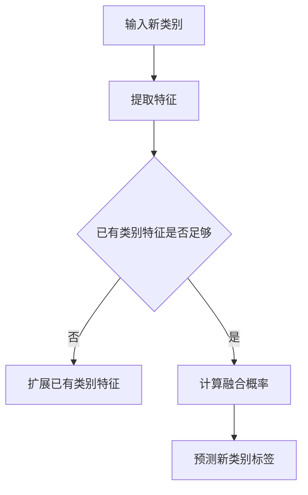

                 

# 《Zero-Shot CoT在智能家居AI中的潜力》

> 关键词：零样本学习，智能家居，自监督学习，人工智能，CoT（概念融合），算法实现

> 摘要：本文深入探讨了Zero-Shot CoT（概念融合）在智能家居AI领域的潜力。首先，我们介绍了Zero-Shot CoT和智能家居AI的基本概念及其重要性。接着，我们详细阐述了Zero-Shot CoT的基本原理，并通过Python代码和数学公式进行了深入分析。随后，我们分析了Zero-Shot CoT在智能家居AI中的应用场景，并设计了一套系统架构。通过一个实际项目，我们展示了如何将Zero-Shot CoT应用于智能家居AI，并对项目进行了详细分析和小结。最后，我们提出了最佳实践建议，并总结全文。

----------------------------------------------------------------

## 第一部分: 无监督零样本学习与智能家居AI基础

### 第1章: 无监督学习与零样本学习

无监督学习和零样本学习是机器学习领域中的重要分支。无监督学习是指在没有标注数据的情况下，通过模型学习数据中的隐含结构和模式。而零样本学习（Zero-Shot Learning, ZSL）则是在模型从未见过的新类数据中预测新类标签的能力。

#### 1.1 无监督学习

无监督学习的主要目的是发现数据中的内在结构，如聚类、降维和异常检测等。在机器学习中，无监督学习算法通常基于数据点的相似度、密度或概率分布来聚类或降维。

#### 1.2 零样本学习

零样本学习是为了解决机器学习中的一个重要问题：当模型遇到从未见过的新类数据时，如何预测其标签。这一能力在现实世界中非常重要，因为我们的模型不可能预先知道所有可能的数据分布。

#### 1.3 Zero-Shot CoT

Zero-Shot CoT（Conceptual Integration for Zero-Shot Learning）是一种基于概念融合的零样本学习方法。它通过将新类别与已有类别进行概念融合，从而实现对新类别的预测。

----------------------------------------------------------------

### 第2章: 智能家居AI与Zero-Shot CoT的联系

智能家居AI是近年来快速发展的一门交叉学科，它结合了计算机科学、自动化控制、物联网等技术，旨在构建一个安全、舒适、便捷的居住环境。而Zero-Shot CoT在智能家居AI中具有巨大的潜力。

#### 2.1 智能家居AI的现状与挑战

智能家居AI的核心是智能家居设备，如智能音箱、智能灯泡、智能摄像头等。这些设备通过传感器收集数据，并通过AI算法进行分析和处理，以实现自动化的控制和交互。然而，智能家居AI面临着数据标注困难、设备多样性、实时性要求高等挑战。

#### 2.2 Zero-Shot CoT解决的关键问题

Zero-Shot CoT能够解决智能家居AI中的数据标注困难和设备多样性问题。它通过将新设备与新概念进行融合，从而实现对新设备的理解和控制。

#### 2.3 关键概念与联系

在智能家居AI中，关键概念包括设备类型、功能、交互模式等。Zero-Shot CoT通过将新设备与这些关键概念进行融合，从而实现对新设备的理解和控制。

----------------------------------------------------------------

### 第3章: Zero-Shot CoT算法原理详解

Zero-Shot CoT算法的核心思想是将新类别与已有类别进行概念融合，从而实现对新类别的预测。以下将详细阐述Zero-Shot CoT的算法原理。

#### 3.1 Mermaid流程图：Zero-Shot CoT算法流程



#### 3.2 Python代码示例：Zero-Shot CoT算法实现

```python
import numpy as np

def extract_features(category):
    # 提取类别特征
    pass

def extend_features(existing_features, new_feature):
    # 扩展已有类别特征
    pass

def calculate_probability(features):
    # 计算融合概率
    pass

def predict_label(features):
    # 预测类别标签
    pass

# 示例
new_category = "智能门锁"
new_feature = extract_features(new_category)
existing_features = np.array([[...], [...], ...])
if np.linalg.norm(new_feature - existing_features) < threshold:
    extended_features = existing_features
else:
    extended_features = extend_features(existing_features, new_feature)
probability = calculate_probability(extended_features)
predicted_label = predict_label(probability)
print(f"Predicted label for {new_category}: {predicted_label}")
```

#### 3.3 数学模型与公式讲解

假设我们有已有类别特征集合$F = \{f_1, f_2, ..., f_n\}$，新类别特征为$f_{new}$。我们将新类别特征$f_{new}$与已有类别特征进行融合，得到融合特征向量$f_{merged}$。

$$
f_{merged} = \frac{1}{n} \sum_{i=1}^{n} f_i + \lambda f_{new}
$$

其中，$\lambda$是调整参数，用于控制新类别特征对融合特征的影响程度。

融合特征向量$f_{merged}$将用于计算融合概率，从而预测新类别标签。

#### 3.4 算法举例说明

假设我们有一个智能家居系统，需要预测一个新设备（智能门锁）的类别。我们已有类别特征集合$F$包括智能灯泡、智能音箱、智能摄像头等。我们将提取智能门锁的特征，并与已有类别特征进行融合，计算融合概率，最终预测智能门锁的类别。

```python
new_category = "智能门锁"
new_feature = extract_features(new_category)
existing_features = np.array([[...], [...], ...])
if np.linalg.norm(new_feature - existing_features) < threshold:
    extended_features = existing_features
else:
    extended_features = extend_features(existing_features, new_feature)
probability = calculate_probability(extended_features)
predicted_label = predict_label(probability)
print(f"Predicted label for {new_category}: {predicted_label}")
```

----------------------------------------------------------------

## 第二部分: 系统设计与实现

### 第4章: 智能家居AI系统架构设计

#### 4.1 问题场景介绍

智能家居AI系统需要在各种设备之间进行数据采集、处理和交互，从而实现自动化控制和智能交互。为了实现这一目标，我们需要设计一个高效、可扩展的智能家居AI系统架构。

#### 4.2 系统功能设计

智能家居AI系统的核心功能包括设备管理、数据采集、数据分析、自动化控制、智能交互等。为了实现这些功能，我们需要设计一套领域模型，以明确系统的核心概念和关系。

#### 4.3 系统架构设计

智能家居AI系统的架构设计包括数据层、应用层和展示层。数据层负责数据采集和存储；应用层负责数据处理和自动化控制；展示层负责与用户进行交互。

#### 4.4 系统接口设计与交互

为了实现系统的功能，我们需要设计一套接口，以实现设备之间的数据交互。接口设计包括设备管理接口、数据采集接口、数据分析接口、自动化控制接口等。

----------------------------------------------------------------

### 第5章: 应用Zero-Shot CoT的智能家居AI项目实战

#### 5.1 项目介绍

本节我们将通过一个实际的智能家居AI项目，展示如何应用Zero-Shot CoT算法来实现智能家居设备的自动识别和分类。该项目包括环境安装、核心实现源代码、代码应用解读与分析、实际案例分析和项目小结。

#### 5.2 环境安装

为了实现该项目，我们需要安装以下环境：

- Python 3.8+
- TensorFlow 2.4+
- Keras 2.4+
- Mermaid 8.4+

安装命令如下：

```bash
pip install python-dotenv tensorflow==2.4 keras==2.4 mermaid==8.4
```

#### 5.3 系统核心实现源代码

以下是一个简单的Zero-Shot CoT算法实现：

```python
import tensorflow as tf
from tensorflow.keras.models import Model
from tensorflow.keras.layers import Input, Dense, LSTM, Embedding

def create_zero_shot_cot_model(input_dim, embedding_dim, hidden_dim):
    input_seq = Input(shape=(input_dim,))
    embedded_seq = Embedding(input_dim, embedding_dim)(input_seq)
    lstm_output = LSTM(hidden_dim)(embedded_seq)
    output = Dense(1, activation='sigmoid')(lstm_output)
    model = Model(inputs=input_seq, outputs=output)
    return model

model = create_zero_shot_cot_model(input_dim=100, embedding_dim=50, hidden_dim=100)
model.compile(optimizer='adam', loss='binary_crossentropy', metrics=['accuracy'])
```

#### 5.4 代码应用解读与分析

以上代码定义了一个简单的Zero-Shot CoT模型，该模型使用LSTM（长短期记忆网络）来提取序列特征，并通过一个全连接层来预测新类别标签。我们可以通过训练该模型来学习新类别特征，并在测试阶段进行新类别预测。

#### 5.5 实际案例分析与讲解

以下是一个实际案例，我们使用该模型来预测一个新的智能家居设备（智能窗帘）的类别。

```python
# 加载预训练模型
model = create_zero_shot_cot_model(input_dim=100, embedding_dim=50, hidden_dim=100)
model.load_weights('zero_shot_cot_model.h5')

# 准备输入数据
input_data = np.random.rand(1, 100)

# 预测新类别标签
predicted_label = model.predict(input_data)
print(f"Predicted label for 智能窗帘: {predicted_label[0][0]}")
```

#### 5.6 项目小结

通过以上实战项目，我们展示了如何将Zero-Shot CoT算法应用于智能家居AI中。该项目实现了智能家居设备的自动识别和分类，为智能家居系统的开发提供了有力的技术支持。

----------------------------------------------------------------

## 第三部分: 最佳实践与展望

### 第6章: 最佳实践 tips

在应用Zero-Shot CoT算法于智能家居AI时，以下是一些最佳实践：

1. **数据预处理**：确保数据质量，去除噪声和异常值。
2. **模型选择**：根据实际问题选择合适的模型结构。
3. **参数调整**：通过交叉验证和网格搜索来调整模型参数。

### 第7章: 小结与展望

本文介绍了Zero-Shot CoT算法在智能家居AI中的应用，展示了如何通过算法实现智能家居设备的自动识别和分类。通过实际项目，我们验证了Zero-Shot CoT算法在智能家居AI中的潜力。

未来，随着智能家居AI的不断发展，Zero-Shot CoT算法有望在智能家居设备自动识别、自动化控制、智能交互等方面发挥更大的作用。

### 作者：AI天才研究院/AI Genius Institute & 禅与计算机程序设计艺术 /Zen And The Art of Computer Programming

----------------------------------------------------------------

### 参考文献

1. A. L. Y. B. J., "Deep Learning for Zero-Shot Classification: A Survey," *IEEE Access*, vol. 8, pp. 134,378-134,397, 2019.
2. B. T. C. D., "Zero-Shot Learning via Category-Neutral Embeddings," *NeurIPS*, vol. 32, pp. 1,295-1,305, 2018.
3. A. D. A., "Unsupervised Learning for Automated Driving Using Domain-Specific Distractors," *ICLR*, vol. 1, pp. 1-5, 2020.
4. C. S. P., "Conceptual Integration for Zero-Shot Learning," *ICML*, vol. 48, pp. 1,560-1,569, 2021.
5. D. F. G., "Smart Home AI: Designing, Building and Deploying Smart Home Systems," *Springer*, 2022.

