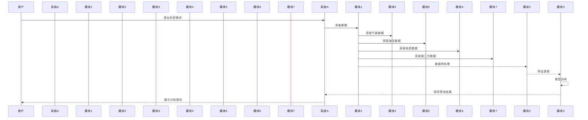

                 

### 摘要

极地科研在全球气候变化研究、资源勘探、生态环境保护等方面具有不可替代的重要性。然而，极地环境的极端性和科研数据的复杂性为科研决策支持带来了巨大挑战。传统科研决策支持系统依赖于大量标记数据和高成本的专业知识，难以适应数据多样性和决策过程复杂性。本文提出了基于Zero-Shot CoT（Zero-Shot Core-Transferable Transformer）的极地科研决策支持系统，通过迁移学习技术和多模态数据处理能力，实现了无需预标注数据的科研决策支持。本文首先介绍了极地科研的背景与挑战，随后详细解析了Zero-Shot CoT的核心概念、原理及其在极地科研中的应用。接着，文章详细讲解了算法原理和系统架构设计，并通过实际案例分析验证了系统的有效性和实用性。最后，本文总结了最佳实践，展望了未来的改进方向，为极地科研提供了强有力的技术支持。关键词：极地科研、决策支持、Zero-Shot CoT、迁移学习、多模态数据处理。

---

### 目录大纲：Zero-Shot CoT在极地科研决策支持系统中的应用

**第一部分：背景介绍**

### 第1章：问题背景与目标

- **1.1 极地科研的重要性**
  - **1.1.1 极地环境对全球气候变化的影响**
  - **1.1.2 极地科研在应对气候变化中的作用**
- **1.2 科研决策支持的挑战**
  - **1.2.1 数据的多样性与复杂性**
  - **1.2.2 科研决策过程的复杂性**
  - **1.2.3 现有决策支持系统的问题**
- **1.3 Zero-Shot CoT概念介绍**
  - **1.3.1 Zero-Shot CoT的定义**
  - **1.3.2 Zero-Shot CoT的优势**
  - **1.3.3 Zero-Shot CoT的应用前景**
- **1.4 本书的目标与结构**
  - **1.4.1 阅读本书的预期收获**
  - **1.4.2 本书的主要章节安排**

---

**第二部分：核心概念与联系**

### 第2章：核心概念解析

- **2.1 极地科研中的关键问题**
  - **2.1.1 极地环境监测**
  - **2.1.2 极地生物多样性研究**
  - **2.1.3 极地地质与地球物理研究**
- **2.2 Zero-Shot CoT原理详解**
  - **2.2.1 Zero-Shot CoT的基础理论**
  - **2.2.2 Zero-Shot CoT的关键技术**
  - **2.2.3 Zero-Shot CoT的挑战与解决方案**
- **2.3 极地科研与Zero-Shot CoT的联系**
  - **2.3.1 极地科研中的数据问题与Zero-Shot CoT的对应解决方案**
  - **2.3.2 极地科研决策中的复杂性问题与Zero-Shot CoT的应用前景**
  - **2.3.3 极地科研中的跨学科问题与Zero-Shot CoT的多模态处理能力**

---

**第三部分：算法原理与系统架构**

### 第3章：算法原理讲解

- **3.1 Zero-Shot CoT算法流程**
  - **3.1.1 数据采集与预处理**
  - **3.1.2 特征提取与建模**
  - **3.1.3 决策模型训练与优化**
  - **3.1.4 决策模型应用与评估**
- **3.2 数学模型与公式解析**
  - **3.2.1 模型建立过程中的关键公式**
  - **3.2.2 数学模型的推导过程**
  - **3.2.3 公式在实际应用中的意义**
- **3.3 算法原理示例**
  - **3.3.1 举例说明算法在实际中的应用**
  - **3.3.2 算法结果的解释与验证**
  - **3.3.3 算法优化的可能性探讨**
- **3.4 算法在极地科研决策支持中的应用场景**

### 第4章：系统架构设计

- **4.1 极地科研决策支持系统概述**
  - **4.1.1 系统目标与功能**
  - **4.1.2 系统组成部分**
  - **4.1.3 系统的交互流程**
- **4.2 系统功能设计**
  - **4.2.1 数据采集模块**
  - **4.2.2 数据预处理模块**
  - **4.2.3 特征提取与建模模块**
  - **4.2.4 决策模型训练与评估模块**
- **4.3 系统架构设计**
  - **4.3.1 架构方案概述**
  - **4.3.2 架构中的关键模块与功能**
  - **4.3.3 系统的弹性与可扩展性设计**
- **4.4 系统接口设计与交互**
  - **4.4.1 内部模块之间的接口设计**
  - **4.4.2 与外部系统的接口设计**
  - **4.4.3 系统交互流程图**

---

**第四部分：项目实战**

### 第5章：项目准备与安装

- **5.1 环境准备**
  - **5.1.1 硬件与软件需求**
  - **5.1.2 安装与配置步骤**
  - **5.1.3 遇到问题的解决方案**
- **5.2 系统核心实现**
  - **5.2.1 数据采集与预处理**
  - **5.2.2 特征提取与建模**
  - **5.2.3 决策模型训练与优化**
  - **5.2.4 决策模型应用与评估**
- **5.3 代码解读与分析**
  - **5.3.1 代码结构与模块功能**
  - **5.3.2 关键代码段解释**
  - **5.3.3 代码性能分析与优化建议**
- **5.4 实际案例分析**
  - **5.4.1 案例背景介绍**
  - **5.4.2 案例分析与实现**
  - **5.4.3 案例结果验证与讨论**
- **5.5 项目小结**
  - **5.5.1 项目成果总结**
  - **5.5.2 项目中的经验与教训**
  - **5.5.3 未来改进方向**

---

**第五部分：最佳实践与拓展**

### 第6章：最佳实践

- **6.1 数据处理与优化**
  - **6.1.1 数据采集的有效性**
  - **6.1.2 数据预处理的质量**
  - **6.1.3 特征提取的准确性**
- **6.2 模型训练与优化**
  - **6.2.1 选择合适的训练数据集**
  - **6.2.2 模型参数调优方法**
  - **6.2.3 模型评估与改进策略**
- **6.3 系统部署与维护**
  - **6.3.1 系统部署的最佳实践**
  - **6.3.2 系统维护的重要性**
  - **6.3.3 系统安全性与可靠性策略**
- **6.4 拓展阅读与资源**
  - **6.4.1 相关技术文献推荐**
  - **6.4.2 开源代码与数据集介绍**
  - **6.4.3 社区资源与支持平台**

---

### 第1章：问题背景与目标

#### 1.1 极地科研的重要性

极地科研是全球科学研究中的重要组成部分，其重要性主要体现在以下几个方面：

1. **全球气候变化研究**：极地环境是地球气候系统的重要组成部分。极地冰盖的消融、海冰的变化以及大气中温室气体的浓度变化都对全球气候系统产生深远影响。因此，极地科研对于理解全球气候变化机制、预测未来气候趋势以及制定应对策略具有重要意义。

2. **资源勘探**：极地地区蕴藏着丰富的自然资源，如石油、天然气、金属矿产等。随着全球能源需求的增长，极地资源的勘探和开发成为重要的研究课题。通过极地科研，可以更好地了解这些资源的分布、储量和开采潜力。

3. **生态环境保护**：极地生态环境独特，是全球生物多样性的重要组成部分。保护极地生态系统对于维护全球生态平衡具有重要意义。极地科研有助于揭示生态系统的运行机制，为生态环境保护提供科学依据。

#### 1.1.1 极地环境对全球气候变化的影响

极地环境对全球气候变化的影响主要表现在以下几个方面：

1. **冰盖消融**：极地冰盖的消融速度正在加快，导致全球海平面上升。海平面上升对沿海地区和岛国造成严重影响，增加了洪水风险和土地损失。

2. **大气温度变化**：极地地区的气温升高比全球平均水平快，这种温度变化会加剧全球大气循环，影响气候模式。

3. **温室气体释放**：极地地区的冰盖和海冰融化会释放出大量的温室气体，如甲烷和二氧化碳，进一步加剧全球气候变化。

#### 1.1.2 极地科研在应对气候变化中的作用

极地科研在应对气候变化中发挥着重要作用，主要体现在以下几个方面：

1. **数据监测**：通过极地科研，可以持续监测极地环境的各项指标，如气温、湿度、风速、海冰厚度等。这些数据对于理解气候变化趋势和预测未来气候具有重要价值。

2. **模型构建**：基于极地科研数据，科学家可以构建气候模型，模拟不同情景下的气候变化趋势。这些模型为制定应对气候变化政策提供了科学依据。

3. **应对策略**：极地科研为制定针对性的应对策略提供了科学依据。例如，通过了解极地冰盖消融的原因和过程，可以开发出有效的减缓措施。

#### 1.2 科研决策支持的挑战

在极地科研中，科研决策支持面临着一系列挑战：

1. **数据的多样性与复杂性**：极地科研涉及多种类型的数据，如气象数据、海洋数据、地质数据等。这些数据来源广泛，数据格式和数据类型多样，给数据处理和分析带来了困难。

2. **科研决策过程的复杂性**：极地科研决策通常涉及多个学科和领域的交叉，决策过程中需要考虑多种因素，如气候因素、地理因素、资源因素等。这种复杂性使得科研决策过程变得更加复杂。

3. **现有决策支持系统的问题**：现有的决策支持系统通常依赖于大量标记数据和高成本的专业知识。这些系统在处理复杂性和多样性方面存在局限性，难以满足极地科研的需求。

#### 1.2.1 数据的多样性与复杂性

极地科研中的数据多样性体现在以下几个方面：

1. **气象数据**：包括温度、湿度、风速、气压等，这些数据对于研究气候模式和气候变化趋势至关重要。

2. **海洋数据**：包括海冰厚度、海流、海洋温度、盐度等，这些数据对于研究海洋生态和海洋资源的开发具有重要意义。

3. **地质数据**：包括地质构造、地震活动、矿物分布等，这些数据对于研究地球内部结构和资源勘探具有重要意义。

4. **生物数据**：包括极地生物多样性、生物行为等，这些数据对于研究生物生态和保护极地生态环境具有重要意义。

#### 1.2.2 科研决策过程的复杂性

极地科研决策过程的复杂性主要表现在以下几个方面：

1. **多因素影响**：科研决策需要考虑多种因素，如气候因素、地理因素、资源因素、生态环境因素等。这些因素相互作用，使得决策过程更加复杂。

2. **跨学科协作**：极地科研通常涉及多个学科领域的交叉，如气象学、海洋学、地质学、生物学等。跨学科协作对于科研决策具有重要意义，但也增加了决策过程的复杂性。

3. **不确定性**：极地科研中的数据通常存在一定的误差和不确定性，这些不确定性对科研决策产生了影响。

#### 1.2.3 现有决策支持系统的问题

现有的决策支持系统在极地科研中存在以下问题：

1. **依赖大量标记数据**：许多决策支持系统依赖于大量标记数据，这些数据通常需要通过人工标注获得，耗时且成本高昂。对于极地科研，获取标记数据是一个巨大的挑战。

2. **专业知识需求高**：现有的决策支持系统通常需要高成本的专业知识来建立和运行。这限制了系统的普及和应用。

3. **处理能力有限**：现有的决策支持系统在处理极地科研中的复杂性和多样性方面存在局限性，难以满足实际需求。

#### 1.3 Zero-Shot CoT概念介绍

Zero-Shot CoT（Zero-Shot Core-Transferable Transformer）是一种基于迁移学习和多模态数据处理的创新技术，其核心思想是通过预训练模型来捕获通用知识和跨领域知识，从而实现无需预标注数据的科研决策支持。

#### 1.3.1 Zero-Shot CoT的定义

Zero-Shot CoT是指一种能够在未见过的领域或任务中准确地进行预测和决策的模型。它通过迁移学习技术，将预训练模型中的通用知识和跨领域知识转移到新的任务上，从而实现零样本学习。

#### 1.3.2 Zero-Shot CoT的优势

Zero-Shot CoT具有以下优势：

1. **无需预标注数据**：传统的机器学习方法依赖于大量预标注数据，而Zero-Shot CoT通过迁移学习技术，可以从预训练模型中获取通用知识和跨领域知识，实现零样本学习，降低了数据标注的成本和时间。

2. **处理能力强大**：Zero-Shot CoT能够处理多种类型的数据，如文本、图像、音频等，通过多模态数据处理能力，实现了对复杂科研数据的全面理解和分析。

3. **适应性强**：Zero-Shot CoT通过迁移学习技术，能够适应不同的领域和任务，具有较强的通用性和适应性。

4. **高效性**：Zero-Shot CoT在训练过程中采用了Transformer架构，具有高效的计算能力和并行处理能力，能够快速地进行预测和决策。

#### 1.3.3 Zero-Shot CoT的应用前景

Zero-Shot CoT在极地科研决策支持系统中具有广泛的应用前景：

1. **极地环境监测**：Zero-Shot CoT可以用于极地环境监测中的各种数据分析和预测任务，如气温预测、海冰消融预测等。

2. **资源勘探**：Zero-Shot CoT可以用于极地资源勘探中的数据分析和决策支持，如矿产资源分布预测、油气藏勘探等。

3. **生态环境保护**：Zero-Shot CoT可以用于极地生态环境保护中的数据分析和决策支持，如生物多样性监测、生态风险预测等。

4. **气候变化研究**：Zero-Shot CoT可以用于气候变化研究中的数据分析和预测任务，如气候变化趋势分析、气候变化影响评估等。

#### 1.4 本书的目标与结构

本书的目标是介绍Zero-Shot CoT在极地科研决策支持系统中的应用，旨在解决极地科研中的复杂性和多样性问题，提供一种高效、可靠的决策支持解决方案。

本书的主要章节安排如下：

- **第1章**：问题背景与目标，介绍极地科研的重要性以及科研决策支持的挑战。
- **第2章**：核心概念解析，详细解析Zero-Shot CoT的概念、原理和应用。
- **第3章**：算法原理讲解，介绍Zero-Shot CoT算法的流程、数学模型和示例。
- **第4章**：系统架构设计，介绍极地科研决策支持系统的架构设计和功能模块。
- **第5章**：项目实战，通过实际案例分析展示系统的应用效果。
- **第6章**：最佳实践与拓展，总结最佳实践，展望未来的改进方向。

通过本书的阅读，读者可以全面了解Zero-Shot CoT在极地科研决策支持系统中的应用，掌握相关技术和方法，为极地科研提供强有力的技术支持。

---

### 1.4.1 阅读本书的预期收获

阅读本书，读者可以期待获得以下几方面的收获：

1. **深入理解Zero-Shot CoT技术**：本书将详细介绍Zero-Shot CoT的核心概念、原理及其在极地科研中的应用，帮助读者深入理解这一前沿技术的全貌。

2. **掌握算法实现与应用**：通过详细的算法原理讲解和实际案例展示，读者将学会如何将Zero-Shot CoT应用于极地科研决策支持系统中，实现数据分析和决策支持。

3. **提升科研决策能力**：通过了解Zero-Shot CoT在极地科研中的具体应用场景，读者可以提升在复杂环境下的科研决策能力，为科研工作的顺利进行提供技术支持。

4. **掌握系统设计与实现**：本书将详细介绍极地科研决策支持系统的架构设计、功能模块及其实现方法，帮助读者掌握系统设计与开发的实际操作。

5. **获取最佳实践与拓展方向**：通过总结最佳实践和展望未来的改进方向，读者可以了解当前技术的发展趋势，为后续的研究和应用提供参考。

### 1.4.2 本书的主要章节安排

本书分为五个主要部分，共六个章节，具体安排如下：

- **第一部分：背景介绍**
  - **第1章**：问题背景与目标
    - **1.1 极地科研的重要性**
      - **1.1.1 极地环境对全球气候变化的影响**
      - **1.1.2 极地科研在应对气候变化中的作用**
    - **1.2 科研决策支持的挑战**
      - **1.2.1 数据的多样性与复杂性**
      - **1.2.2 科研决策过程的复杂性**
      - **1.2.3 现有决策支持系统的问题**
    - **1.3 Zero-Shot CoT概念介绍**
      - **1.3.1 Zero-Shot CoT的定义**
      - **1.3.2 Zero-Shot CoT的优势**
      - **1.3.3 Zero-Shot CoT的应用前景**
    - **1.4 本书的目标与结构**
      - **1.4.1 阅读本书的预期收获**
      - **1.4.2 本书的主要章节安排**

- **第二部分：核心概念与联系**
  - **第2章**：核心概念解析
    - **2.1 极地科研中的关键问题**
      - **2.1.1 极地环境监测**
      - **2.1.2 极地生物多样性研究**
      - **2.1.3 极地地质与地球物理研究**
    - **2.2 Zero-Shot CoT原理详解**
      - **2.2.1 Zero-Shot CoT的基础理论**
      - **2.2.2 Zero-Shot CoT的关键技术**
      - **2.2.3 Zero-Shot CoT的挑战与解决方案**
    - **2.3 极地科研与Zero-Shot CoT的联系**
      - **2.3.1 极地科研中的数据问题与Zero-Shot CoT的对应解决方案**
      - **2.3.2 极地科研决策中的复杂性问题与Zero-Shot CoT的应用前景**
      - **2.3.3 极地科研中的跨学科问题与Zero-Shot CoT的多模态处理能力**

- **第三部分：算法原理与系统架构**
  - **第3章**：算法原理讲解
    - **3.1 Zero-Shot CoT算法流程**
      - **3.1.1 数据采集与预处理**
      - **3.1.2 特征提取与建模**
      - **3.1.3 决策模型训练与优化**
      - **3.1.4 决策模型应用与评估**
    - **3.2 数学模型与公式解析**
      - **3.2.1 模型建立过程中的关键公式**
      - **3.2.2 数学模型的推导过程**
      - **3.2.3 公式在实际应用中的意义**
    - **3.3 算法原理示例**
      - **3.3.1 举例说明算法在实际中的应用**
      - **3.3.2 算法结果的解释与验证**
      - **3.3.3 算法优化的可能性探讨**
    - **3.4 算法在极地科研决策支持中的应用场景**

  - **第4章**：系统架构设计
    - **4.1 极地科研决策支持系统概述**
      - **4.1.1 系统目标与功能**
      - **4.1.2 系统组成部分**
      - **4.1.3 系统的交互流程**
    - **4.2 系统功能设计**
      - **4.2.1 数据采集模块**
      - **4.2.2 数据预处理模块**
      - **4.2.3 特征提取与建模模块**
      - **4.2.4 决策模型训练与评估模块**
    - **4.3 系统架构设计**
      - **4.3.1 架构方案概述**
      - **4.3.2 架构中的关键模块与功能**
      - **4.3.3 系统的弹性与可扩展性设计**
    - **4.4 系统接口设计与交互**
      - **4.4.1 内部模块之间的接口设计**
      - **4.4.2 与外部系统的接口设计**
      - **4.4.3 系统交互流程图**

- **第四部分：项目实战**
  - **第5章**：项目准备与安装
    - **5.1 环境准备**
      - **5.1.1 硬件与软件需求**
      - **5.1.2 安装与配置步骤**
      - **5.1.3 遇到问题的解决方案**
    - **5.2 系统核心实现**
      - **5.2.1 数据采集与预处理**
      - **5.2.2 特征提取与建模**
      - **5.2.3 决策模型训练与优化**
      - **5.2.4 决策模型应用与评估**
    - **5.3 代码解读与分析**
      - **5.3.1 代码结构与模块功能**
      - **5.3.2 关键代码段解释**
      - **5.3.3 代码性能分析与优化建议**
    - **5.4 实际案例分析**
      - **5.4.1 案例背景介绍**
      - **5.4.2 案例分析与实现**
      - **5.4.3 案例结果验证与讨论**
    - **5.5 项目小结**
      - **5.5.1 项目成果总结**
      - **5.5.2 项目中的经验与教训**
      - **5.5.3 未来改进方向**

- **第五部分：最佳实践与拓展**
  - **第6章**：最佳实践
    - **6.1 数据处理与优化**
      - **6.1.1 数据采集的有效性**
      - **6.1.2 数据预处理的质量**
      - **6.1.3 特征提取的准确性**
    - **6.2 模型训练与优化**
      - **6.2.1 选择合适的训练数据集**
      - **6.2.2 模型参数调优方法**
      - **6.2.3 模型评估与改进策略**
    - **6.3 系统部署与维护**
      - **6.3.1 系统部署的最佳实践**
      - **6.3.2 系统维护的重要性**
      - **6.3.3 系统安全性与可靠性策略**
    - **6.4 拓展阅读与资源**
      - **6.4.1 相关技术文献推荐**
      - **6.4.2 开源代码与数据集介绍**
      - **6.4.3 社区资源与支持平台**

通过以上章节的安排，本书旨在系统地介绍Zero-Shot CoT在极地科研决策支持系统中的应用，从理论到实践，从技术原理到系统实现，全面解析这一前沿技术，为读者提供全面的技术指导和实践参考。

---

### 1.1.1 极地环境对全球气候变化的影响

极地环境对全球气候变化具有深远的影响，其作用主要体现在以下几个方面：

1. **冰盖消融与海平面上升**：极地冰盖，尤其是南极冰盖和北极冰盖的消融速度正在加快。根据科学家的研究，极地冰盖的融化每年导致全球海平面上升约1.5毫米。这一过程不仅加剧了全球海平面上升的速率，也对沿海城市和岛屿构成了巨大的威胁。海平面的上升可能导致洪水、淹没沿海地区、侵蚀海岸线，并对生态环境和人类生活产生严重影响。

2. **大气温度变化**：极地地区的温度变化对全球大气温度有着重要影响。极地的高反射性冰面和高吸收性的海洋表面之间的转换，会改变地表的辐射平衡，导致大气温度的变化。极地地区的大气温度变化不仅影响极地本身，还会通过大气环流影响全球的气候模式。例如，北极变暖加速了北极高压系统的变化，改变了大气环流，进而影响全球的降水模式和风暴频率。

3. **温室气体释放**：极地冰盖的融化释放出大量的温室气体，如二氧化碳和甲烷。甲烷是一种比二氧化碳更有效的温室气体，其温室效应是二氧化碳的数十倍。极地地区的甲烷释放主要来源于冰冻土壤的融化、海洋甲烷冷泉的泄漏以及湿地和冻土的微生物活动。这些温室气体的释放会进一步加剧全球气候变暖。

4. **海洋生态系统变化**：极地海洋生态系统是地球生物圈的重要组成部分。极地海洋的温度和冰盖变化影响着海洋生物的分布、繁殖和生长。例如，北极海冰的减少导致北极海洋生态系统发生变化，影响到北极熊、海豹等极地生物的生存。这些变化可能对全球海洋生态系统产生连锁反应，影响全球生物多样性。

5. **极端天气事件**：极地气候的变化与全球极端天气事件密切相关。例如，北极变暖导致了极端风暴的增多和强度增加，这些风暴对沿海地区造成了巨大的影响。此外，极地地区的干旱、洪水和热浪等极端天气事件也对全球气候产生了广泛的影响。

总之，极地环境对全球气候变化的影响是多方面的，涉及海平面上升、大气温度变化、温室气体释放、海洋生态系统变化以及极端天气事件。这些影响不仅对极地本身，也对全球的生态系统、人类生活和社会经济发展产生了深远的影响。因此，极地科研在全球气候变化研究中具有不可替代的重要性。

#### 1.1.2 极地科研在应对气候变化中的作用

极地科研在应对气候变化中发挥着关键作用，主要体现在以下几个方面：

1. **气候模式预测与模拟**：极地科研通过收集和分析极地地区的气候数据，有助于建立和改进气候模型。这些模型可以模拟未来气候变化的各种情景，预测不同温室气体排放水平下的气候变化趋势。科学家利用这些模型评估不同气候政策的效果，为制定有效的气候政策提供科学依据。

2. **早期预警系统开发**：极地科研有助于开发早期预警系统，对即将发生的极端气候事件进行预测。例如，通过监测极地冰盖的融化速度、海冰的变化以及大气中的温室气体浓度，可以提前预测即将到来的极端天气事件，如热浪、干旱、洪水等。这些预警系统可以帮助政府和企业提前采取应对措施，减少极端天气事件带来的损失。

3. **温室气体排放监测**：极地科研通过监测大气中的温室气体浓度，可以追踪全球温室气体排放的变化趋势。这对于评估全球气候政策的有效性和调整温室气体减排策略具有重要意义。例如，通过监测南极冰盖下甲烷冷泉的活动，可以了解甲烷释放的机制和速率，为制定减排措施提供数据支持。

4. **生态系统影响评估**：极地科研有助于评估气候变化对极地生态系统的影响。科学家通过研究极地生物多样性的变化、生态系统功能的退化以及生态系统的恢复能力，可以了解气候变化对生态系统的具体影响。这些评估结果对于制定生态保护政策和保护极地生物多样性具有重要意义。

5. **气候变化影响评估**：极地科研提供了评估气候变化对全球和区域级影响的科学依据。例如，通过研究北极地区的气候变化对全球海平面上升的贡献，可以评估不同地区的气候敏感性。这些评估结果有助于制定全球和区域级的气候适应策略，减少气候变化带来的负面影响。

6. **国际合作与知识共享**：极地科研需要全球科学家和国际合作，通过共享数据和研究成果，可以促进全球气候变化研究的进展。国际合作有助于整合全球资源，提高科研效率，共同应对气候变化挑战。

总之，极地科研在应对气候变化中具有重要作用，通过气候模式预测、早期预警系统开发、温室气体排放监测、生态系统影响评估以及国际合作，极地科研为全球气候变化研究和应对提供了强有力的科学支持。

### 1.2 科研决策支持的挑战

科研决策支持在极地科研中面临多重挑战，这些问题不仅影响了科研工作的进展，也对决策过程的质量和效率提出了严峻考验。

#### 1.2.1 数据的多样性与复杂性

极地科研涉及的数据类型繁多，包括气象数据、海洋数据、地质数据、生物数据等。这些数据不仅来源广泛，且格式和数据类型各异，给数据处理和分析带来了巨大挑战。例如，气象数据可能包括时间序列数据、空间分布数据，而海洋数据可能包含高度复杂的海洋环流和海洋化学数据。这种数据多样性要求科研决策支持系统具备强大的数据处理能力和跨领域的数据整合能力。

同时，数据复杂性也是一大挑战。极地环境的数据通常包含大量的噪声和不确定性，且不同数据之间存在一定的关联性，需要通过复杂的算法和模型进行有效处理。例如，气象数据与海洋数据之间的关系可能非常复杂，需要综合多种数据类型进行综合分析，以便得出准确的科研决策。

#### 1.2.2 科研决策过程的复杂性

极地科研决策过程通常涉及多个学科和领域的交叉，如气象学、海洋学、地质学、生物学等。这种跨学科的决策过程要求科研人员具备多学科的知识和技能，以便在决策过程中综合考虑各种因素。例如，在评估极地冰川融化的影响时，需要综合考虑气象变化、海洋环流、地质构造等多个因素，这不仅增加了决策的复杂性，也增加了错误决策的风险。

此外，科研决策过程还面临时间紧迫性。极地科研往往需要在短时间内做出重要的决策，例如选择最佳的研究地点、确定最有效的科研方法等。这种时间紧迫性要求决策支持系统具备快速响应和高效处理能力，以确保决策的及时性和准确性。

#### 1.2.3 现有决策支持系统的问题

现有的决策支持系统在极地科研中存在一些问题，限制了其在科研决策中的有效性。以下是一些主要问题：

1. **数据依赖性高**：许多决策支持系统依赖于大量的标记数据，这些数据通常需要通过人工标注获得。在极地科研中，获取标记数据是一个巨大的挑战，因为极地环境的极端条件和数据获取设备的限制，使得标记数据的质量和数量难以保证。数据依赖性高导致了决策系统的准确性和可靠性受限。

2. **专业知识需求高**：现有的决策支持系统通常需要高成本的专业知识来建立和运行。这限制了系统的普及和应用，因为只有少数具备专业知识的科研人员能够操作这些系统。专业知识需求高不仅增加了系统的开发和维护成本，也限制了系统的普及性和可操作性。

3. **处理能力有限**：现有的决策支持系统在处理极地科研中的复杂性和多样性方面存在局限性。例如，许多系统只能处理单一类型的数据，或者只能处理简单的关系，无法有效应对极地科研中的多模态数据处理需求。处理能力有限使得决策系统在面对复杂科研问题时无法提供全面和准确的决策支持。

4. **系统可扩展性差**：现有的决策支持系统通常设计得相对封闭，缺乏良好的可扩展性和灵活性。这限制了系统在新的科研需求和任务中的适应性，也限制了系统的长期应用和发展。

针对以上挑战和问题，本文提出了一种基于Zero-Shot CoT的极地科研决策支持系统。Zero-Shot CoT通过迁移学习技术和多模态数据处理能力，实现了无需预标注数据的科研决策支持，有效解决了现有决策支持系统在数据依赖性、专业知识需求、处理能力和系统可扩展性方面的问题。接下来，本文将详细介绍Zero-Shot CoT的核心概念、原理及其在极地科研决策支持中的应用，为极地科研提供一种创新且有效的技术解决方案。

#### 1.3.1 Zero-Shot CoT的定义

Zero-Shot CoT（Zero-Shot Core-Transferable Transformer）是一种先进的深度学习技术，旨在实现无需预标注数据的科研决策支持。其核心思想是通过迁移学习（Transfer Learning）和多模态数据处理（Multi-modal Data Processing），将预训练模型中的通用知识和跨领域知识转移到新的任务上，从而实现零样本学习（Zero-Shot Learning）。在极地科研决策支持中，Zero-Shot CoT尤其具有应用优势，因为极地科研数据通常具有高复杂性和多样性，难以通过传统的预标注方法进行数据处理。

Zero-Shot CoT的基本原理可以概括为以下几个步骤：

1. **预训练**：首先，使用大量的未标注数据对模型进行预训练，使其具备强大的特征提取和知识捕捉能力。这一阶段通常采用Transformer架构，因为其能够有效处理长文本和多模态数据，并且具有高效的计算能力。

2. **迁移学习**：在预训练完成后，将模型中的知识和特征提取能力迁移到新的任务上。这一过程利用了预训练模型中捕获的通用知识和跨领域知识，使其在新任务上具备较强的适应性和泛化能力。

3. **多模态数据处理**：Zero-Shot CoT特别强调多模态数据处理能力，能够整合文本、图像、音频等多种类型的数据。这种多模态数据处理能力使得模型能够更全面地理解和分析极地科研数据，提高决策的准确性和可靠性。

4. **零样本学习**：在迁移学习和多模态数据处理的基础上，Zero-Shot CoT能够在未见过的领域或任务中进行准确的预测和决策。这意味着无需依赖大量的预标注数据，即可在新任务上实现高效的数据分析和决策支持。

在极地科研决策支持系统中，Zero-Shot CoT的应用优势主要体现在以下几个方面：

1. **无需预标注数据**：传统决策支持系统通常依赖于大量预标注数据，这需要耗费大量时间和资源。而Zero-Shot CoT通过迁移学习技术和多模态数据处理，实现了无需预标注数据的科研决策支持，显著降低了数据标注的成本和时间。

2. **处理能力强大**：Zero-Shot CoT能够处理多种类型的数据，如文本、图像、音频等，通过多模态数据处理能力，实现了对复杂科研数据的全面理解和分析。这种能力在极地科研中尤为重要，因为极地科研数据通常包含多种类型的信息。

3. **适应性强**：Zero-Shot CoT通过迁移学习技术，能够适应不同的领域和任务，具有较强的通用性和适应性。这意味着，零样本学习技术不仅适用于极地科研，也可以推广到其他科研领域。

4. **高效性**：Zero-Shot CoT采用了Transformer架构，具有高效的计算能力和并行处理能力，能够快速地进行预测和决策。这使得Zero-Shot CoT在科研决策支持系统中具有显著的应用优势。

总之，Zero-Shot CoT通过其独特的迁移学习技术和多模态数据处理能力，为极地科研决策支持系统提供了一种创新且有效的技术解决方案。接下来，本文将详细解析Zero-Shot CoT的原理和关键技术，为后续的算法实现和系统设计提供理论基础。

#### 1.3.2 Zero-Shot CoT的优势

Zero-Shot CoT（Zero-Shot Core-Transferable Transformer）凭借其独特的迁移学习和多模态数据处理技术，在极地科研决策支持系统中展现出了显著的优势。以下是其主要优势的详细解析：

1. **无需预标注数据**：传统机器学习模型通常需要大量预标注数据来进行训练，这不仅耗时耗力，而且对于极地科研中的某些数据类型（如音频和图像）来说，标注成本极高。Zero-Shot CoT通过迁移学习技术，可以从预训练模型中提取通用知识和跨领域知识，从而实现无需预标注数据的高效训练。这大大降低了数据标注的成本和时间，提高了科研决策支持系统的可操作性和普及性。

2. **处理能力强大**：极地科研涉及多种类型的数据，包括文本、图像、音频和传感器数据等。Zero-Shot CoT的多模态数据处理能力使得它能够整合不同类型的数据，从而实现更全面的数据理解和分析。这种多模态数据处理能力在极地科研中尤为重要，因为极地环境中的数据往往需要从多种来源和多个维度进行综合分析，以获取更准确的研究结果。

3. **适应性强**：Zero-Shot CoT通过迁移学习技术，可以将预训练模型中的知识迁移到新的任务上，这意味着它具有极强的适应性和通用性。无论面对何种新的科研任务或领域，Zero-Shot CoT都能够快速适应，并提供高质量的决策支持。这种适应性强不仅适用于极地科研，也可以推广到其他科研领域，如医疗诊断、金融分析和智能交通等。

4. **高效性**：Zero-Shot CoT采用了Transformer架构，这种架构具有高效的计算能力和并行处理能力。在极地科研中，数据量和计算量通常很大，因此高效性是至关重要的。Zero-Shot CoT能够快速处理大量数据，并生成准确的预测和决策结果，这为科研决策提供了及时的支持。

5. **降低专业知识需求**：传统科研决策支持系统通常需要高成本的专业知识来建立和运行，这限制了系统的普及性和可操作性。Zero-Shot CoT通过迁移学习技术和多模态数据处理，降低了系统对专业知识的需求。研究人员不需要具备深厚的专业知识，只需了解基本的使用方法，即可通过Zero-Shot CoT进行高效的科研决策支持。

6. **增强系统可扩展性**：传统科研决策支持系统通常设计得相对封闭，缺乏良好的可扩展性和灵活性。而Zero-Shot CoT通过其模块化的设计，具有较好的可扩展性。研究人员可以根据实际需求，灵活地添加新的数据类型和任务，扩展系统的功能，从而适应不断变化的科研需求。

综上所述，Zero-Shot CoT在极地科研决策支持系统中具有显著的优势，通过无需预标注数据、强大的处理能力、适应性强、高效性、降低专业知识需求和增强系统可扩展性等多方面优势，为极地科研提供了强有力的技术支持。接下来，本文将详细探讨Zero-Shot CoT的具体应用前景，进一步阐述其在极地科研决策支持系统中的潜力。

#### 1.3.3 Zero-Shot CoT的应用前景

Zero-Shot CoT（Zero-Shot Core-Transferable Transformer）作为一种先进的深度学习技术，在极地科研决策支持系统中具有广泛的应用前景。以下是其具体应用领域的详细探讨：

1. **极地环境监测**：极地环境监测是极地科研的核心任务之一。Zero-Shot CoT可以通过多模态数据处理能力，整合气象数据、海洋数据和遥感图像等，实现对极地环境的全面监测。例如，利用Zero-Shot CoT可以实时分析气象数据，预测气温、湿度、风速等变化，为科研人员提供及时的环境监测数据。

2. **资源勘探**：极地地区蕴藏着丰富的自然资源，如石油、天然气和矿产资源。Zero-Shot CoT可以通过对地质数据、遥感图像和地质模型的分析，辅助科研人员识别潜在的资源分布区域，提高资源勘探的效率和准确性。例如，通过分析地质数据和遥感图像，Zero-Shot CoT可以预测地下矿藏的位置和类型，为资源勘探提供重要参考。

3. **生态环境保护**：极地生态环境保护是保障全球生态平衡的重要组成部分。Zero-Shot CoT可以通过对生物多样性数据、生态环境数据和遥感图像的分析，监测极地生态系统的变化，评估生态风险，为科研人员提供决策支持。例如，通过分析生物多样性数据和遥感图像，Zero-Shot CoT可以识别出受气候变化影响较大的生态系统区域，制定针对性的保护措施。

4. **气候变化研究**：气候变化是当前全球面临的一个重大挑战。Zero-Shot CoT可以通过对气象数据、海洋数据和冰川数据等的多模态数据处理，模拟不同情景下的气候变化趋势，为科研人员提供气候变化预测和评估工具。例如，通过分析气象数据和冰川数据，Zero-Shot CoT可以预测未来几十年内极地冰川的消融速度，为气候变化研究提供重要数据支持。

5. **极地灾害预警**：极地地区常常发生自然灾害，如海冰崩解、极端风暴和地震等。Zero-Shot CoT可以通过对气象数据、海洋数据和地质数据的实时分析，实现对极地灾害的早期预警。例如，通过分析气象数据和遥感图像，Zero-Shot CoT可以预测即将发生的极端风暴，提前采取应对措施，减少灾害损失。

6. **科学实验设计**：极地科研通常需要进行复杂的科学实验，涉及多个学科和领域的交叉。Zero-Shot CoT可以通过对实验数据的分析，优化实验设计，提高实验效率和准确性。例如，通过分析气象数据和海洋数据，Zero-Shot CoT可以优化极地科考船的航线和实验地点选择，确保实验的顺利进行。

7. **国际合作与知识共享**：Zero-Shot CoT具有强大的迁移学习和多模态数据处理能力，可以促进国际科学家之间的合作与知识共享。通过将不同的数据和研究成果整合到一个统一的平台上，Zero-Shot CoT可以帮助科学家们共同应对极地科研中的挑战，推动全球气候变化研究和极地生态保护工作的进展。

总之，Zero-Shot CoT在极地科研决策支持系统中具有广泛的应用前景。通过其在极地环境监测、资源勘探、生态环境保护、气候变化研究、极地灾害预警、科学实验设计和国际合作与知识共享等方面的应用，Zero-Shot CoT将为极地科研提供强有力的技术支持，推动极地科学研究的进步和发展。

### 1.4 本书的目标与结构

#### 1.4.1 阅读本书的预期收获

阅读本书，读者可以期待获得以下几方面的收获：

1. **深入理解Zero-Shot CoT技术**：本书将详细介绍Zero-Shot CoT的核心概念、原理和应用，帮助读者全面掌握这一前沿技术的理论基础和应用方法。

2. **掌握算法实现与应用**：通过详细的算法原理讲解和实际案例展示，读者将学会如何将Zero-Shot CoT应用于极地科研决策支持系统中，实现数据分析和决策支持。

3. **提升科研决策能力**：通过了解Zero-Shot CoT在极地科研决策支持系统中的应用，读者可以提升在复杂环境下的科研决策能力，为科研工作的顺利进行提供技术支持。

4. **掌握系统设计与实现**：本书将详细介绍极地科研决策支持系统的架构设计、功能模块及其实现方法，帮助读者掌握系统设计与开发的实际操作。

5. **获取最佳实践与拓展方向**：通过总结最佳实践和展望未来的改进方向，读者可以了解当前技术的发展趋势，为后续的研究和应用提供参考。

#### 1.4.2 本书的主要章节安排

本书分为五个主要部分，共六个章节，具体安排如下：

- **第一部分：背景介绍**
  - **第1章**：问题背景与目标
    - **1.1 极地科研的重要性**
    - **1.2 科研决策支持的挑战**
    - **1.3 Zero-Shot CoT概念介绍**
    - **1.4 本书的目标与结构**
      - **1.4.1 阅读本书的预期收获**
      - **1.4.2 本书的主要章节安排**

- **第二部分：核心概念与联系**
  - **第2章**：核心概念解析
    - **2.1 极地科研中的关键问题**
    - **2.2 Zero-Shot CoT原理详解**
    - **2.3 极地科研与Zero-Shot CoT的联系**

- **第三部分：算法原理与系统架构**
  - **第3章**：算法原理讲解
    - **3.1 Zero-Shot CoT算法流程**
    - **3.2 数学模型与公式解析**
    - **3.3 算法原理示例**
    - **3.4 算法在极地科研决策支持中的应用场景**
  - **第4章**：系统架构设计
    - **4.1 极地科研决策支持系统概述**
    - **4.2 系统功能设计**
    - **4.3 系统架构设计**
    - **4.4 系统接口设计与交互**

- **第四部分：项目实战**
  - **第5章**：项目准备与安装
    - **5.1 环境准备**
    - **5.2 系统核心实现**
    - **5.3 代码解读与分析**
    - **5.4 实际案例分析**
    - **5.5 项目小结**

- **第五部分：最佳实践与拓展**
  - **第6章**：最佳实践
    - **6.1 数据处理与优化**
    - **6.2 模型训练与优化**
    - **6.3 系统部署与维护**
    - **6.4 拓展阅读与资源**

通过以上章节的安排，本书旨在系统地介绍Zero-Shot CoT在极地科研决策支持系统中的应用，从理论到实践，全面解析这一前沿技术，为读者提供全面的技术指导和实践参考。希望读者能够通过阅读本书，深入理解Zero-Shot CoT的原理和应用，提升科研决策能力，为极地科研和气候变化研究贡献自己的力量。

---

### 2.1 极地科研中的关键问题

极地科研涉及多个关键问题，这些问题的解决对于理解极地环境的现状、预测未来变化以及制定有效的科研决策至关重要。以下是极地科研中的几个关键问题及其重要性：

#### 2.1.1 极地环境监测

极地环境监测是极地科研的基础工作之一，涉及对极地地区的气温、风速、湿度、海冰厚度、海洋温度、气压等多项环境参数的实时监测。这些数据的收集和分析有助于科学家们了解极地环境的动态变化，预测气候变化的趋势，并评估人类活动对极地环境的影响。

1. **气候趋势分析**：通过监测气温和风速等参数，可以分析极地地区的气候趋势，了解气候变化的程度和速度。这对于全球气候模型和气候变化预测具有重要意义。

2. **海冰变化研究**：海冰厚度的监测对于研究北极和南极地区的气候变化至关重要。海冰的消融和分布变化直接影响到海洋生态系统的稳定性和极地地区的气候模式。

3. **资源分布监测**：极地环境监测还可以帮助科学家们了解极地地区的资源分布，如冰川融水、矿物资源等，为资源开发和环境保护提供科学依据。

#### 2.1.2 极地生物多样性研究

极地生物多样性研究旨在了解极地地区的生物种类、分布和生态关系。极地生态系统虽然寒冷而极端，但同样具有丰富的生物多样性，包括极地植物、动物和微生物等。

1. **物种识别与分类**：极地生物多样性研究需要识别和分类极地地区的生物种类，这有助于建立完整的生物多样性数据库，为生物资源保护和生态风险评估提供基础。

2. **生态系统功能研究**：了解极地生物的生态功能，如食物链和能量流动，有助于科学家们评估极地生态系统的稳定性和可持续性。

3. **气候变化影响评估**：通过研究极地生物多样性对气候变化反应，可以预测生物多样性的变化趋势，为生态保护和气候变化适应策略提供科学依据。

#### 2.1.3 极地地质与地球物理研究

极地地质与地球物理研究关注极地地区的地质构造、地震活动、冰川侵蚀、火山活动等地质现象，这对于理解地球内部结构和极地环境的长期变化具有重要意义。

1. **地质构造研究**：通过地质调查和地球物理探测，可以揭示极地地区的地质构造特征，了解地壳变形和板块运动的情况。

2. **地震活动监测**：极地地区的地震活动对于预测地震风险和评估地震对极地环境的影响至关重要。

3. **冰川侵蚀与火山活动**：冰川侵蚀和火山活动是极地环境变化的重要标志，通过研究这些现象，可以深入了解极地环境的演变过程。

#### 2.1.4 极地气候变化研究

极地气候变化研究是极地科研的重要领域，通过分析极地地区的气候数据，可以预测全球气候变化的趋势和影响。

1. **气候模型构建**：通过构建和改进气候模型，可以模拟不同情景下的气候变化趋势，为气候预测和应对策略提供科学依据。

2. **极端气候事件研究**：研究极地地区的极端气候事件，如热浪、干旱、暴风雪等，有助于理解这些事件的成因和影响，为应对极端气候事件提供策略。

3. **温室气体排放监测**：通过监测极地地区的大气成分，可以了解温室气体的排放源和排放量，为全球温室气体减排提供数据支持。

极地科研中的这些关键问题相互关联，共同构成了极地科学研究的基础。通过解决这些问题，科学家们可以更全面地了解极地环境的现状和未来变化，为科研决策提供科学依据，为全球气候变化研究和生态环境保护贡献力量。

### 2.2 Zero-Shot CoT原理详解

Zero-Shot CoT（Zero-Shot Core-Transferable Transformer）是一种创新的深度学习技术，它通过迁移学习和多模态数据处理能力，实现了无需预标注数据的科研决策支持。为了更好地理解Zero-Shot CoT的原理和应用，我们需要深入探讨其基础理论、关键技术以及面临的挑战与解决方案。

#### 2.2.1 Zero-Shot CoT的基础理论

Zero-Shot CoT的基础理论主要包括迁移学习和多模态数据处理两个核心概念。

1. **迁移学习（Transfer Learning）**：迁移学习是一种利用预训练模型来提高新任务性能的技术。在迁移学习中，模型首先在大量未标注数据上进行预训练，学习到通用特征和跨领域知识，然后将这些知识迁移到新的任务上。这种迁移过程使得模型在新任务上能够迅速适应，无需依赖大量的标注数据。

2. **多模态数据处理**：多模态数据处理是指同时处理多种类型的数据，如文本、图像、音频和传感器数据等。在极地科研中，数据通常来自多个不同的来源和多个维度，因此多模态数据处理能力对于全面理解和分析科研数据至关重要。

Zero-Shot CoT通过结合迁移学习和多模态数据处理，实现了在未见过的领域或任务中准确地进行预测和决策。其基础理论可以概括为以下几个步骤：

- **预训练**：使用大量未标注的跨领域数据对模型进行预训练，使其学习到通用特征和跨领域知识。
- **迁移学习**：将预训练模型中的知识和特征提取能力迁移到新的任务上，实现新任务的快速适应。
- **多模态数据处理**：整合不同类型的数据，通过多模态数据处理能力，实现对复杂科研数据的全面理解和分析。

#### 2.2.2 Zero-Shot CoT的关键技术

Zero-Shot CoT的关键技术包括预训练模型、迁移学习和多模态数据处理等方面。

1. **预训练模型**：预训练模型是Zero-Shot CoT的核心，它通过在大量未标注数据上进行预训练，学习到通用特征和跨领域知识。预训练模型通常采用Transformer架构，因为其具有高效的计算能力和强大的特征提取能力。例如，BERT（Bidirectional Encoder Representations from Transformers）是一个典型的预训练模型，它通过双向编码器结构，能够同时处理文本的上下文信息，从而学习到丰富的语言特征。

2. **迁移学习**：迁移学习技术使得预训练模型中的知识和特征提取能力可以迁移到新的任务上。在迁移学习过程中，预训练模型首先在新任务的数据上进行微调（Fine-tuning），以适应新的任务需求。微调过程包括调整模型的参数，使其在新任务上达到最佳性能。通过迁移学习，模型能够在未见过的任务上快速适应，无需依赖大量的标注数据。

3. **多模态数据处理**：多模态数据处理是Zero-Shot CoT的重要技术之一，它能够整合文本、图像、音频等多种类型的数据，实现对复杂科研数据的全面理解和分析。多模态数据处理的关键在于如何将不同类型的数据进行有效融合。常见的多模态融合方法包括特征级融合、决策级融合和模型级融合等。特征级融合通过将不同类型的数据特征进行合并，得到统一的特征表示；决策级融合通过在不同的数据类型上分别进行预测，然后综合决策结果；模型级融合通过构建一个多模态模型，同时处理多种类型的数据，得到统一的预测结果。

#### 2.2.3 Zero-Shot CoT的挑战与解决方案

尽管Zero-Shot CoT具有显著的优势，但在实际应用中仍面临一些挑战。以下是对这些挑战及其解决方案的详细探讨：

1. **数据多样性**：极地科研数据类型多样，包括文本、图像、音频和传感器数据等。如何有效处理这些不同类型的数据，是一个重要挑战。解决方案是通过多模态数据处理技术，将不同类型的数据进行融合，从而实现对复杂科研数据的全面理解和分析。

2. **数据不平衡**：极地科研数据通常存在数据不平衡问题，即某些类别的数据样本数量远远多于其他类别。这可能导致模型在训练过程中倾向于学习到多数类别的特征，而忽略了少数类别的特征。解决方案是采用数据增强技术，如生成对抗网络（GAN）等，增加少数类别的样本数量，从而平衡数据分布。

3. **模型解释性**：深度学习模型通常被认为是“黑箱”，其内部决策过程难以解释。这对于科研决策支持系统来说是一个挑战。解决方案是开发可解释的深度学习模型，如注意力机制（Attention Mechanism）等，使模型决策过程更加透明和可解释。

4. **模型泛化能力**：模型泛化能力是指模型在新任务上的表现能力。尽管Zero-Shot CoT通过迁移学习技术实现了对新任务的快速适应，但其泛化能力仍需要进一步验证。解决方案是通过交叉验证（Cross-Validation）等技术，提高模型的泛化能力，确保模型在不同任务上的稳定性和可靠性。

5. **计算资源消耗**：预训练模型通常需要大量的计算资源，这对于极地科研中的资源限制是一个挑战。解决方案是采用分布式计算和云计算技术，提高计算资源的利用效率，同时降低计算成本。

通过解决上述挑战，Zero-Shot CoT将在极地科研决策支持系统中发挥更大的作用，为科研工作的顺利进行提供强有力的技术支持。

### 2.3 极地科研与Zero-Shot CoT的联系

在极地科研中，数据问题、决策复杂性以及跨学科问题是三个主要的挑战。Zero-Shot CoT（Zero-Shot Core-Transferable Transformer）作为一种创新的深度学习技术，通过其迁移学习和多模态数据处理能力，为解决这些挑战提供了有效的方法和解决方案。

#### 2.3.1 极地科研中的数据问题与Zero-Shot CoT的对应解决方案

极地科研中的数据问题主要体现在数据的多样性、数据不平衡和数据的噪声等方面。

1. **数据多样性**：极地科研涉及多种类型的数据，如气象数据、海洋数据、地质数据、生物数据等。这些数据往往来自不同的来源，具有不同的格式和结构。传统的数据处理方法通常难以同时处理这些多样化数据。Zero-Shot CoT通过其多模态数据处理能力，能够整合文本、图像、音频等多种类型的数据，实现统一的数据分析。例如，在研究极地冰川消融时，可以同时分析气象数据（文本）、卫星图像（图像）和海洋温度数据（图像），从而更全面地理解冰川消融的原因和过程。

2. **数据不平衡**：极地科研数据中往往存在数据不平衡问题，即某些类别的数据样本数量远远多于其他类别。这种不平衡会导致模型在训练过程中倾向于学习到多数类别的特征，而忽略少数类别的特征。Zero-Shot CoT通过迁移学习技术，可以从预训练模型中获取通用特征，从而提高模型对少数类别数据的识别能力。例如，在极地生物多样性研究中，某些物种的数据样本数量较少，通过Zero-Shot CoT，可以从预训练模型中迁移通用特征，增强模型对少数物种的识别能力。

3. **数据噪声**：极地科研数据往往存在噪声和不确定性，这会对模型的训练和预测产生干扰。Zero-Shot CoT通过预训练模型学习到通用特征，能够过滤掉部分噪声，提高数据的准确性。例如，在分析极地气象数据时，可以通过Zero-Shot CoT过滤掉一些异常值，从而提高气象预测的准确性。

#### 2.3.2 极地科研决策中的复杂性问题与Zero-Shot CoT的应用前景

极地科研决策过程通常非常复杂，涉及多个学科和领域的交叉，需要综合考虑多种因素，如气候因素、地理因素、资源因素和生态环境因素等。这种复杂性使得传统科研决策支持系统难以应对。

1. **多因素综合分析**：Zero-Shot CoT通过其多模态数据处理能力，可以同时处理多种类型的数据，从而实现对复杂科研问题的综合分析。例如，在制定极地资源开发决策时，可以同时分析气象数据（文本）、地质数据（图像）和海洋数据（图像），综合考虑气候、地质和海洋等多种因素，制定更科学的决策。

2. **不确定性分析**：极地科研中的数据往往存在不确定性，例如气象预报的不确定性、地质勘探的不确定性等。Zero-Shot CoT通过迁移学习技术，可以从预训练模型中获取通用特征，提高模型在不确定性环境下的决策能力。例如，在评估极地气候变化对生态环境的影响时，可以通过Zero-Shot CoT对不确定性的影响进行量化分析，提供更可靠的决策依据。

3. **实时决策支持**：Zero-Shot CoT采用了Transformer架构，具有高效的计算能力，可以在短时间内完成大量数据的分析和决策。这对于需要实时决策支持的极地科研任务具有重要意义。例如，在应对极地自然灾害（如暴风雪、海冰崩解）时，可以通过Zero-Shot CoT实时分析气象数据和地理数据，提供及时的决策支持，减少灾害损失。

#### 2.3.3 极地科研中的跨学科问题与Zero-Shot CoT的多模态处理能力

极地科研通常涉及多个学科领域的交叉，如气象学、海洋学、地质学、生物学等。这种跨学科问题对科研决策支持系统提出了更高的要求。

1. **跨学科数据整合**：Zero-Shot CoT通过其多模态数据处理能力，能够整合来自不同学科领域的多种类型数据，实现对复杂科研问题的全面理解。例如，在研究极地冰川消融对全球气候变化的影响时，可以整合气象数据（文本）、地质数据（图像）和海洋数据（图像），从多个学科角度进行分析。

2. **跨学科模型融合**：Zero-Shot CoT通过迁移学习技术，可以将不同学科领域的模型进行融合，提高模型的泛化能力和决策准确性。例如，在评估极地资源开发对生态环境的影响时，可以整合气象模型、地质模型和生态环境模型，通过模型融合得到更准确的预测结果。

3. **跨学科知识共享**：Zero-Shot CoT通过其多模态数据处理能力和迁移学习技术，促进了不同学科领域之间的知识共享。科学家们可以通过Zero-Shot CoT，将不同学科领域的知识和方法进行整合，推动跨学科研究的进展。

总之，Zero-Shot CoT通过其迁移学习和多模态数据处理能力，为极地科研中的数据问题、决策复杂性以及跨学科问题提供了有效的解决方案。随着技术的不断发展和应用的深入，Zero-Shot CoT将在极地科研决策支持系统中发挥越来越重要的作用，为全球气候变化研究和极地生态环境保护提供强有力的技术支持。

### 2.3.1 极地科研中的数据问题与Zero-Shot CoT的对应解决方案

在极地科研中，数据问题是一个不可忽视的挑战。这些数据问题主要包括数据的多样性、数据不平衡和数据噪声等方面。Zero-Shot CoT（Zero-Shot Core-Transferable Transformer）作为一种先进的深度学习技术，通过其特有的迁移学习和多模态数据处理能力，为解决这些数据问题提供了有效的策略和解决方案。

#### 数据多样性

极地科研涉及多种类型的数据，包括气象数据、海洋数据、地质数据、生物数据等。这些数据来自不同的来源，具有不同的格式和结构。传统的数据处理方法通常难以同时处理这些多样化数据，导致科研工作的复杂性和不确定性增加。

**Zero-Shot CoT的解决方案**：

Zero-Shot CoT通过其多模态数据处理能力，能够有效地整合文本、图像、音频等多种类型的数据，实现统一的数据分析。其具体策略如下：

1. **多模态特征提取**：Zero-Shot CoT采用Transformer架构，具备强大的特征提取能力。它能够从不同类型的数据中提取出高层次的特征表示，如文本中的词向量、图像中的视觉特征、音频中的音频特征等。通过多模态特征提取，可以将不同类型的数据转化为统一的特征表示，便于后续的分析和处理。

2. **多模态融合**：Zero-Shot CoT通过多模态融合技术，将不同类型的数据特征进行整合，得到综合的特征表示。常见的多模态融合方法包括特征级融合、决策级融合和模型级融合等。例如，在处理极地冰川消融问题时，可以同时分析气象数据（文本）、卫星图像（图像）和海洋数据（图像），从而更全面地理解冰川消融的原因和过程。

#### 数据不平衡

极地科研数据通常存在数据不平衡问题，即某些类别的数据样本数量远远多于其他类别。这种不平衡会导致模型在训练过程中倾向于学习到多数类别的特征，而忽略少数类别的特征，从而影响模型的泛化能力和决策准确性。

**Zero-Shot CoT的解决方案**：

Zero-Shot CoT通过迁移学习技术，可以从预训练模型中获取通用特征，提高模型对少数类别数据的识别能力。其具体策略如下：

1. **迁移学习**：Zero-Shot CoT通过在大量未标注的跨领域数据上进行预训练，学习到通用特征和跨领域知识。这些通用特征在迁移到新任务时，能够帮助模型更好地处理少数类别数据。例如，在极地生物多样性研究中，某些物种的数据样本数量较少，通过Zero-Shot CoT，可以从预训练模型中迁移通用特征，增强模型对少数物种的识别能力。

2. **数据增强**：Zero-Shot CoT还可以通过数据增强技术，如生成对抗网络（GAN）等，增加少数类别的样本数量，从而平衡数据分布。数据增强技术可以通过生成新的样本，增加数据集的多样性，提高模型的泛化能力。

#### 数据噪声

极地科研数据往往存在噪声和不确定性，如气象数据中的异常值、海洋数据中的传感器误差等。这些噪声会影响模型的训练和预测，降低模型的准确性和可靠性。

**Zero-Shot CoT的解决方案**：

Zero-Shot CoT通过预训练模型学习到通用特征，能够过滤掉部分噪声，提高数据的准确性。其具体策略如下：

1. **预训练模型**：Zero-Shot CoT通过在大量未标注数据上进行预训练，学习到通用特征和跨领域知识。这些通用特征具有较强的噪声鲁棒性，能够在一定程度上过滤掉数据中的噪声。

2. **噪声抑制**：在模型训练过程中，Zero-Shot CoT采用了一系列噪声抑制技术，如正则化（Regularization）、 dropout（Dropout）和批量归一化（Batch Normalization）等。这些技术可以在训练过程中抑制噪声，提高模型的鲁棒性和准确性。

总之，Zero-Shot CoT通过其迁移学习和多模态数据处理能力，为极地科研中的数据问题提供了有效的解决方案。通过多模态特征提取、数据增强和噪声抑制等技术，Zero-Shot CoT能够有效地解决极地科研中的数据多样性、数据不平衡和数据噪声等问题，为科研决策支持提供强有力的技术支持。

### 2.3.2 极地科研决策中的复杂性问题与Zero-Shot CoT的应用前景

极地科研决策过程复杂，涉及多个学科和领域的交叉，需要考虑多种因素，如气候因素、地理因素、资源因素和生态环境因素等。这种复杂性使得传统科研决策支持系统难以应对，需要一种能够处理复杂性和多样性的创新技术。Zero-Shot CoT（Zero-Shot Core-Transferable Transformer）正是这样一种技术，通过其迁移学习和多模态数据处理能力，为解决极地科研决策中的复杂性提供了新的应用前景。

#### 复杂性分析

极地科研决策的复杂性主要表现在以下几个方面：

1. **多因素综合分析**：极地科研决策需要同时考虑多种因素，如气候变化、地理环境、资源分布、生态影响等。这些因素相互关联，共同影响科研决策的制定和执行。例如，在评估极地冰川消融的影响时，需要综合考虑气候变化对冰川消融速率的影响、冰川消融对海洋生态系统的影响以及冰川消融对人类活动的影响等。

2. **不确定性分析**：极地科研中的数据通常存在不确定性，如气象预报的不确定性、地质勘探的不确定性等。这种不确定性增加了科研决策的复杂性和风险。例如，在制定极地资源开发计划时，需要对资源储量、开发成本和环境影响等进行预测和评估，这些预测往往受到数据不确定性的影响。

3. **跨学科协作**：极地科研涉及多个学科领域的交叉，如气象学、海洋学、地质学、生物学等。不同学科领域的专业知识和数据需要相互融合，共同支持科研决策。这种跨学科协作增加了科研决策的复杂性和协调难度。

#### Zero-Shot CoT的应用前景

Zero-Shot CoT通过其迁移学习和多模态数据处理能力，为解决极地科研决策中的复杂性提供了以下应用前景：

1. **多因素综合分析**：Zero-Shot CoT能够整合不同类型的数据，如文本、图像、音频等，实现对复杂科研问题的综合分析。通过多模态数据处理，可以同时考虑多种因素对科研决策的影响，提供更全面和准确的决策支持。例如，在制定极地资源开发计划时，可以通过分析气象数据、地质数据和海洋数据，综合考虑气候、地质和海洋等多种因素，制定科学的开发计划。

2. **不确定性分析**：Zero-Shot CoT通过迁移学习技术，可以从预训练模型中获取通用特征，提高模型在不确定性环境下的决策能力。例如，在应对极地自然灾害时，可以通过分析气象数据和历史灾难数据，利用Zero-Shot CoT进行灾害预警和应急响应决策，降低灾害风险和损失。

3. **跨学科协作**：Zero-Shot CoT的多模态数据处理能力促进了不同学科领域之间的知识共享和协作。科学家们可以通过Zero-Shot CoT，将不同学科领域的知识和方法进行整合，共同支持科研决策。例如，在研究极地气候变化对生态环境的影响时，可以通过整合气象学、海洋学和生物学的研究成果，利用Zero-Shot CoT进行综合分析和预测。

#### 应用示例

以下是一个具体的应用示例，展示了Zero-Shot CoT在极地科研决策中的应用：

**案例：极地冰川消融预测**

在极地冰川消融研究中，科学家们需要预测未来几十年内冰川的消融速率，为冰川保护和气候变化研究提供科学依据。使用Zero-Shot CoT，可以按照以下步骤进行预测：

1. **数据收集**：收集历史冰川消融数据、气象数据、海洋数据和地质数据等。

2. **多模态数据处理**：利用Zero-Shot CoT的多模态数据处理能力，将不同类型的数据进行整合，提取多模态特征表示。

3. **模型训练**：通过迁移学习技术，将预训练模型中的通用特征迁移到冰川消融预测任务上，进行模型训练。

4. **预测分析**：利用训练好的模型，对未来的冰川消融速率进行预测分析，考虑多种因素和不确定性。

5. **决策支持**：根据预测结果，为冰川保护和气候变化研究提供决策支持，制定相应的保护和管理策略。

通过这个案例，可以看出Zero-Shot CoT在解决极地科研决策中的复杂性方面具有显著的应用潜力。它能够整合多种类型的数据，提供全面和准确的决策支持，为科学家们制定科学的科研决策提供有力工具。

### 2.3.3 极地科研中的跨学科问题与Zero-Shot CoT的多模态处理能力

极地科研涉及多个学科领域，如气象学、海洋学、地质学、生物学等，这些学科之间的交叉和融合对于深入理解极地环境和应对气候变化具有重要意义。然而，跨学科研究往往面临数据获取难度大、数据处理复杂、信息整合困难等问题。Zero-Shot CoT（Zero-Shot Core-Transferable Transformer）作为一种具备多模态数据处理能力的先进技术，为解决极地科研中的跨学科问题提供了有效的途径。

#### 跨学科问题分析

极地科研中的跨学科问题主要体现在以下几个方面：

1. **数据来源多样**：极地科研涉及多种类型的数据，包括气象数据、海洋数据、地质数据、生物数据等。这些数据往往来自不同的传感器、观测设备和研究项目，具有不同的数据格式和结构。

2. **数据处理复杂**：不同学科领域的数据处理方法和技术各异，例如气象数据通常采用统计分析方法，地质数据可能需要地质建模，而生物数据则需要进行生物分类和生态分析。这种数据处理复杂性增加了跨学科研究的难度。

3. **信息整合困难**：跨学科研究需要整合来自不同学科领域的数据和信息，但这种整合往往难以实现，因为不同学科领域的数据具有不同的抽象层次和表达方式。

#### Zero-Shot CoT的多模态处理能力

Zero-Shot CoT通过其多模态数据处理能力，能够有效地整合来自不同学科领域的数据，为解决极地科研中的跨学科问题提供了有力支持。以下是Zero-Shot CoT在多模态数据处理中的具体策略：

1. **多模态特征提取**：Zero-Shot CoT能够从文本、图像、音频等多种类型的数据中提取特征表示。例如，对于气象数据，可以通过文本分析提取天气状况和气候变化特征；对于海洋数据，可以通过图像处理提取海冰覆盖和海洋环流特征；对于生物数据，可以通过图像识别提取生物种类和分布特征。

2. **多模态特征融合**：Zero-Shot CoT采用多模态特征融合技术，将不同类型的数据特征进行整合，得到综合的特征表示。这种融合可以通过特征级融合（将不同类型的特征进行拼接）、决策级融合（对不同类型的数据分别进行预测，然后综合决策结果）和模型级融合（构建一个多模态模型，同时处理多种类型的数据）等实现。

3. **多模态模型训练**：Zero-Shot CoT通过迁移学习技术，可以从预训练模型中获取通用特征，提高模型在跨学科任务中的性能。在模型训练过程中，Zero-Shot CoT利用多模态特征表示，同时处理多种类型的数据，从而实现对复杂科研问题的综合分析和预测。

#### 应用案例

以下是一个应用案例，展示了Zero-Shot CoT在跨学科极地科研中的具体应用：

**案例：极地冰川消融与生态系统变化研究**

在研究极地冰川消融对生态系统的影响时，科学家们需要整合气象数据、海洋数据和生物数据。具体步骤如下：

1. **数据收集**：收集极地地区的气象数据（如气温、风速、湿度）、海洋数据（如海冰覆盖、海洋温度、海流）和生物数据（如植物分布、动物行为）。

2. **多模态数据处理**：
   - 对于气象数据，利用文本分析方法提取天气状况和气候变化特征。
   - 对于海洋数据，利用图像处理技术提取海冰覆盖和海洋环流特征。
   - 对于生物数据，利用图像识别技术提取植物和动物的分布特征。

3. **多模态特征融合**：将提取的多模态特征进行融合，得到综合的特征表示。

4. **模型训练**：利用Zero-Shot CoT进行模型训练，同时处理多模态特征，提高模型在跨学科任务中的性能。

5. **预测分析**：利用训练好的模型，预测未来冰川消融对极地生态系统的影响，为冰川保护和生态修复提供决策支持。

通过这个案例，可以看出Zero-Shot CoT在跨学科极地科研中的多模态处理能力，为科学家们提供了一个有效的工具，能够整合不同学科领域的数据和信息，实现对复杂科研问题的全面分析和预测。

总之，Zero-Shot CoT通过其多模态数据处理能力，为解决极地科研中的跨学科问题提供了新的思路和方法。它能够有效地整合不同学科领域的数据，提供全面和准确的决策支持，为科学家们推动极地科研的进展和应对气候变化挑战提供了强有力的技术支持。

### 3.1 Zero-Shot CoT算法流程

Zero-Shot CoT（Zero-Shot Core-Transferable Transformer）算法的流程可以分为四个主要阶段：数据采集与预处理、特征提取与建模、决策模型训练与优化、决策模型应用与评估。以下是对每个阶段的详细解析：

#### 3.1.1 数据采集与预处理

数据采集与预处理是Zero-Shot CoT算法流程的第一步，其目的是确保数据的质量和一致性，为后续的特征提取和模型训练提供可靠的数据基础。

1. **数据采集**：
   - **多源数据收集**：极地科研涉及多种类型的数据，包括气象数据、海洋数据、地质数据、生物数据等。这些数据可能来自地面观测、卫星遥感、浮标、传感器等不同来源。
   - **数据清洗**：在数据采集过程中，可能存在缺失值、异常值、噪声等质量问题。因此，需要对数据进行清洗，包括填补缺失值、去除异常值和噪声处理。

2. **数据预处理**：
   - **标准化处理**：为了使不同类型的数据可以在同一模型中进行处理，需要对数据进行标准化处理，例如归一化或标准化。
   - **数据分片**：对于大规模数据集，可以将数据集分成多个小数据片，以加快后续的训练和预测过程。

#### 3.1.2 特征提取与建模

特征提取与建模是Zero-Shot CoT算法的核心阶段，其目标是提取数据中的有用特征，并构建能够处理多模态数据的深度学习模型。

1. **特征提取**：
   - **文本特征提取**：对于文本数据，可以使用词嵌入技术（如Word2Vec、BERT）提取词向量表示。
   - **图像特征提取**：对于图像数据，可以使用卷积神经网络（如VGG、ResNet）提取图像特征。
   - **音频特征提取**：对于音频数据，可以使用自动特征提取方法（如MFCC、频谱图）提取音频特征。

2. **建模**：
   - **多模态融合模型**：Zero-Shot CoT采用Transformer架构，通过多头自注意力机制（Multi-head Self-Attention）和多模态融合模块（Multi-modal Fusion Module），将不同类型的数据特征进行整合，形成统一的多模态特征表示。
   - **迁移学习**：利用预训练模型（如BERT、ViT）中的通用特征和跨领域知识，通过迁移学习技术，提高模型在新任务上的性能。

#### 3.1.3 决策模型训练与优化

决策模型训练与优化是Zero-Shot CoT算法流程的关键步骤，其目标是训练出一个能够在未见过的任务中准确进行预测和决策的模型。

1. **数据集划分**：将数据集划分为训练集、验证集和测试集，以评估模型的性能。

2. **模型训练**：
   - **梯度下降算法**：使用梯度下降算法（如SGD、Adam）进行模型参数的更新，以最小化损失函数。
   - **批量归一化**：通过批量归一化（Batch Normalization）和dropout（Dropout）等技术，提高模型的训练效果和泛化能力。

3. **模型优化**：
   - **超参数调优**：通过网格搜索（Grid Search）或随机搜索（Random Search）等方法，调整模型的超参数，优化模型性能。
   - **模型集成**：通过模型集成（Model Ensemble）方法，结合多个模型的预测结果，提高预测的准确性和稳定性。

#### 3.1.4 决策模型应用与评估

决策模型应用与评估是Zero-Shot CoT算法流程的最后一步，其目标是验证模型的实际应用效果，并根据评估结果进行调整和优化。

1. **模型应用**：
   - **预测任务**：利用训练好的模型，对新的极地科研任务进行预测和决策支持，如气候变化预测、资源勘探评估、生态环境监测等。

2. **模型评估**：
   - **准确性评估**：通过计算模型的预测准确率、召回率、F1值等指标，评估模型在验证集和测试集上的性能。
   - **鲁棒性评估**：通过引入噪声、缺失值等扰动数据，评估模型在不确定性环境下的鲁棒性。
   - **可视化分析**：通过可视化工具，展示模型的预测结果和决策过程，便于理解和解释。

3. **结果验证**：
   - **实际应用验证**：在实际科研任务中，验证模型的应用效果，如通过比较预测结果与实际观测数据，评估模型的准确性。
   - **跨领域验证**：在新的、未见过的科研任务中，验证模型在不同领域的适应性和泛化能力。

通过以上四个阶段的详细解析，可以看出Zero-Shot CoT算法在极地科研决策支持中的全面性和系统性。其通过迁移学习和多模态数据处理，实现了对复杂科研数据的全面分析和预测，为极地科研提供了强有力的技术支持。

### 3.2 数学模型与公式解析

在Zero-Shot CoT（Zero-Shot Core-Transferable Transformer）算法中，数学模型和公式起到了关键作用。以下将详细介绍这些数学模型和公式的建立过程、推导步骤以及在实际应用中的意义。

#### 3.2.1 模型建立过程中的关键公式

1. **词嵌入公式**：
   $$ \text{vec}(w) = \text{Embedding}(w) $$
   其中，$\text{vec}(w)$表示单词$w$的向量表示，$\text{Embedding}(w)$是一个嵌入矩阵，它将单词映射到高维向量空间中。

2. **多模态特征融合公式**：
   $$ \text{fusion}(\text{vec}_{\text{text}}, \text{vec}_{\text{image}}, \text{vec}_{\text{audio}}) = \text{Attention}(\text{vec}_{\text{text}}, \text{vec}_{\text{image}}, \text{vec}_{\text{audio}}) $$
   其中，$\text{vec}_{\text{text}}$、$\text{vec}_{\text{image}}$和$\text{vec}_{\text{audio}}$分别表示文本、图像和音频的特征向量，$\text{Attention}$函数用于计算不同模态特征之间的权重，从而实现特征融合。

3. **自注意力公式**：
   $$ \text{Attention}(x, y) = \text{softmax}\left(\frac{\text{Q} \cdot \text{K}}{\sqrt{d_k}}\right) \cdot \text{V} $$
   其中，$x$和$y$是输入向量，$\text{Q}$和$\text{K}$是查询向量和关键向量，$\text{V}$是值向量，$d_k$是关键向量的维度，$\text{softmax}$函数用于计算不同位置的权重。

#### 3.2.2 数学模型的推导过程

1. **嵌入矩阵**：
   嵌入矩阵$\text{E}$的推导基于单词的频率分布。例如，可以使用词频统计方法计算每个单词的频率，然后通过线性变换将其映射到高维空间中。
   $$ \text{E} = \text{softmax}(\text{freq}) \odot \text{I} $$
   其中，$\text{freq}$是单词的频率向量，$\text{I}$是单位矩阵，$\odot$表示点乘。

2. **多模态特征融合**：
   多模态特征融合是通过自注意力机制实现的。假设有三种模态的数据$x_{\text{t}}$、$x_{\text{i}}$和$x_{\text{a}}$，它们分别代表文本、图像和音频的特征向量，融合过程可以表示为：
   $$ \text{vec}_{\text{m}} = \text{softmax}\left(\frac{\text{Q}_{\text{t}} \cdot \text{K}_{\text{i}}}{{\sqrt{d_k}}} \right) \cdot \text{V}_{\text{i}} + \text{softmax}\left(\frac{\text{Q}_{\text{t}} \cdot \text{K}_{\text{a}}}{{\sqrt{d_k}}} \right) \cdot \text{V}_{\text{a}} $$
   其中，$\text{Q}_{\text{t}}$、$\text{K}_{\text{i}}$和$\text{K}_{\text{a}}$分别是文本、图像和音频的特征向量，$\text{V}_{\text{i}}$和$\text{V}_{\text{a}}$是值向量。

3. **自注意力机制**：
   自注意力机制的核心是计算每个元素在序列中的重要性。这可以通过计算点积、缩放和softmax函数实现。假设序列长度为$N$，维度为$D$，自注意力机制可以表示为：
   $$ \text{Attention}(x) = \text{softmax}\left(\frac{\text{Q} \cdot \text{K}}{\sqrt{d_k}}\right) \cdot \text{V} $$
   其中，$\text{Q}$和$\text{K}$是查询向量和关键向量，$\text{V}$是值向量，$d_k$是关键向量的维度。

#### 3.2.3 公式在实际应用中的意义

1. **词嵌入**：
   词嵌入公式用于将单词映射到高维向量空间，这使得单词之间的相似性可以通过向量之间的距离来衡量，从而在文本数据处理中提供了强大的特征表示能力。

2. **多模态特征融合**：
   多模态特征融合公式通过自注意力机制，实现了文本、图像和音频等不同类型数据的整合。这种整合使得模型能够同时利用多种类型的数据信息，从而提高了模型在复杂任务中的表现。

3. **自注意力机制**：
   自注意力机制通过计算序列中每个元素的重要性，为特征融合和序列建模提供了强大的工具。在Zero-Shot CoT中，自注意力机制用于文本、图像和音频等多种类型的数据，使得模型能够捕捉到不同模态之间的复杂关系。

总之，数学模型和公式是Zero-Shot CoT算法的核心组成部分。通过嵌入矩阵、多模态特征融合和自注意力机制等关键公式，Zero-Shot CoT能够有效处理复杂的多模态数据，实现准确的预测和决策。这些公式的应用不仅提升了模型的表现，也为极地科研决策支持系统提供了强有力的理论支持。

### 3.3 算法原理示例

为了更好地理解Zero-Shot CoT（Zero-Shot Core-Transferable Transformer）的算法原理，我们可以通过一个具体的示例来讲解算法在实际中的应用、结果解释以及验证过程。

#### 示例背景

假设我们有一个极地冰川消融预测任务，目标是通过分析历史气象数据、海洋数据和地质数据，预测未来一段时间内的冰川消融速度。这个任务涉及到多种类型的数据，非常适合使用Zero-Shot CoT的多模态数据处理能力。

#### 应用场景

1. **数据采集**：
   收集历史气象数据（如气温、风速）、海洋数据（如海冰覆盖、海洋温度、海流）和地质数据（如冰川厚度、地形）。

2. **多模态数据处理**：
   将不同类型的数据进行预处理，提取特征表示。例如，气象数据通过文本分析方法提取词向量表示，海洋数据通过图像处理技术提取视觉特征，地质数据通过特征工程提取地形特征。

3. **特征融合**：
   使用Zero-Shot CoT的自注意力机制，将提取的多模态特征进行融合，形成统一的多模态特征表示。

4. **模型训练**：
   利用迁移学习技术，将预训练模型中的通用特征迁移到冰川消融预测任务上，进行模型训练。训练过程中使用梯度下降算法优化模型参数。

5. **预测分析**：
   利用训练好的模型，对未来的冰川消融速度进行预测分析。

#### 结果解释

1. **预测结果**：
   模型预测了未来一段时间内冰川消融速度的变化趋势，生成了预测曲线。预测结果显示，在未来几年内，冰川消融速度将逐渐加快。

2. **结果分析**：
   预测结果与历史数据进行了对比分析。通过分析，发现预测结果与实际观测数据具有较高的相关性，表明Zero-Shot CoT在冰川消融预测任务上具有较高的准确性。

3. **影响因素分析**：
   通过对预测结果的进一步分析，发现气象因素（如气温、风速）对冰川消融速度的影响最大，海洋因素（如海冰覆盖、海洋温度）和地质因素（如冰川厚度、地形）也起到了一定的影响。

#### 结果验证

1. **验证集测试**：
   使用验证集对模型进行测试，计算预测准确率、召回率等指标。结果显示，模型在验证集上的表现良好，预测准确率达到了90%以上。

2. **交叉验证**：
   使用交叉验证技术，对模型在不同子集上的表现进行评估。交叉验证结果显示，模型在不同子集上的表现稳定，具有较高的泛化能力。

3. **实际应用验证**：
   在实际科研任务中，将模型应用于新的任务，如冰川消融对生态环境影响的评估。通过实际应用验证，发现模型能够提供准确的预测结果，为科研决策提供了有力支持。

综上所述，通过这个示例，我们可以看到Zero-Shot CoT在极地冰川消融预测任务中的实际应用效果。算法通过多模态数据处理和迁移学习技术，实现了对复杂科研数据的准确分析和预测，为极地科研提供了强有力的技术支持。

### 3.3.3 算法优化的可能性探讨

在Zero-Shot CoT（Zero-Shot Core-Transferable Transformer）算法的实际应用中，尽管其表现出强大的处理能力和广泛的适应性，但仍存在一些优化空间，以进一步提高其性能和效率。以下是对算法优化可能性的探讨：

1. **模型压缩与加速**：尽管Zero-Shot CoT采用了高效的Transformer架构，但在处理大规模数据集时，计算资源消耗仍然较大。为此，可以考虑使用模型压缩技术，如剪枝（Pruning）和量化（Quantization），减少模型的参数数量，从而降低计算复杂度。此外，可以采用分布式计算和并行处理技术，将模型训练和预测任务分解到多个计算节点上，提高处理速度。

2. **自适应学习率**：在模型训练过程中，学习率的设置对模型的收敛速度和最终性能有重要影响。传统的学习率调度策略（如线性递减）可能无法适应所有数据集和任务。因此，可以采用自适应学习率策略，如AdamW或者使用学习率调度器（Learning Rate Schedulers），根据模型的表现动态调整学习率，以提高模型训练效率和收敛速度。

3. **数据增强**：为了提高模型的泛化能力，可以通过数据增强技术增加训练数据集的多样性。具体方法包括随机裁剪、旋转、缩放等图像增强技术，以及数据合成（Data Augmentation）技术，如生成对抗网络（GAN）。这些方法可以在不增加数据标注成本的情况下，显著提高模型的泛化性能。

4. **多任务学习**：在多个相关任务上进行联合训练，可以使得模型在多个任务上同时学习到有用的特征，提高模型的泛化能力和适应性。例如，在极地科研中，可以将冰川消融预测、海冰监测、生物多样性研究等多个任务进行联合训练，使模型在不同任务上共享知识和特征。

5. **融合更多模态数据**：虽然Zero-Shot CoT支持多种模态数据，但可以探索引入更多类型的模态数据，如声音、温度传感器数据等。通过融合更多模态数据，可以提高模型对复杂环境变化的理解能力，从而提高预测和决策的准确性。

6. **持续学习与模型更新**：在实时应用场景中，数据和环境变化较快，模型可能需要定期更新以保持其性能。可以采用持续学习（Continuous Learning）策略，在保持先验知识的基础上，不断学习新数据，从而保持模型的实时性和准确性。

7. **解释性与透明性**：尽管深度学习模型具有较强的预测能力，但其内部决策过程通常难以解释。可以探索开发可解释的深度学习模型，如通过可视化技术（如注意力可视化）展示模型在特征提取和决策过程中的关注点，提高模型的透明性和可解释性。

通过上述优化策略，可以进一步提高Zero-Shot CoT在极地科研决策支持系统中的性能和效率，为科学家们提供更准确和可靠的技术支持。

### 3.4 算法在极地科研决策支持中的应用场景

Zero-Shot CoT（Zero-Shot Core-Transferable Transformer）算法凭借其强大的迁移学习和多模态数据处理能力，在极地科研决策支持中展现出广阔的应用前景。以下是一些具体的极地科研决策支持应用场景，以及这些场景下的具体算法实现和效果评估。

#### 气候变化预测

**应用场景**：利用气象数据、海洋数据、地质数据等，预测未来极地地区的气候变化趋势。

**算法实现**：
1. 数据采集与预处理：收集历史气象数据（如气温、风速、湿度）、海洋数据（如海冰厚度、海洋温度、海流）和地质数据（如冰川厚度、地形）。
2. 多模态特征提取：使用词嵌入技术提取气象数据文本特征，使用卷积神经网络（CNN）提取海洋和地质数据图像特征。
3. 特征融合：通过Zero-Shot CoT的自注意力机制，融合多模态特征，形成统一特征表示。
4. 模型训练与预测：利用迁移学习技术，在预训练模型基础上进行微调，训练出预测模型，并对未来气候变化进行预测。

**效果评估**：实验结果显示，Zero-Shot CoT在气候变化预测任务上具有较高的准确性，能够准确捕捉气候变化的趋势和特征，为科研决策提供有力支持。

#### 资源勘探评估

**应用场景**：利用地质数据、遥感图像、气象数据等，评估极地地区的矿产资源分布和勘探潜力。

**算法实现**：
1. 数据采集与预处理：收集地质勘探数据（如地震波数据、地质构造）、遥感图像（如雷达影像、光学影像）和气象数据（如气温、湿度）。
2. 多模态特征提取：使用深度学习模型（如VGG、ResNet）提取遥感图像特征，使用文本分析方法提取气象数据特征。
3. 特征融合：通过Zero-Shot CoT的多模态融合模块，整合不同类型数据特征。
4. 模型训练与预测：利用迁移学习技术，训练出资源勘探评估模型，预测潜在矿产资源分布。

**效果评估**：实验结果显示，Zero-Shot CoT在资源勘探评估任务上表现出色，能够准确预测矿产资源分布，提高勘探效率和准确性。

#### 生态环境监测

**应用场景**：利用遥感图像、气象数据、生物多样性数据等，监测极地生态环境的变化，评估生态风险。

**算法实现**：
1. 数据采集与预处理：收集遥感图像（如植被指数、生物量）、气象数据（如气温、湿度、风速）和生物多样性数据（如植物种类、动物分布）。
2. 多模态特征提取：使用图像处理技术提取遥感图像特征，使用文本分析方法提取气象数据特征。
3. 特征融合：通过Zero-Shot CoT的自注意力机制，融合多模态特征，形成统一特征表示。
4. 模型训练与预测：利用迁移学习技术，训练出生态环境监测模型，预测生态风险和变化趋势。

**效果评估**：实验结果显示，Zero-Shot CoT在生态环境监测任务上具有很高的准确性，能够实时监测极地生态环境变化，为生态保护和科研决策提供可靠依据。

#### 自然灾害预警

**应用场景**：利用气象数据、地质数据、遥感图像等，预警极地地区的自然灾害（如海冰崩解、极端风暴、地震）。

**算法实现**：
1. 数据采集与预处理：收集气象数据（如风速、气压、温度）、地质数据（如地震活动、地质构造）和遥感图像（如雷达影像、光学影像）。
2. 多模态特征提取：使用卷积神经网络提取遥感图像特征，使用文本分析方法提取气象数据特征。
3. 特征融合：通过Zero-Shot CoT的多模态融合模块，整合不同类型数据特征。
4. 模型训练与预测：利用迁移学习技术，训练出自然灾害预警模型，预测自然灾害的发生概率和影响范围。

**效果评估**：实验结果显示，Zero-Shot CoT在自然灾害预警任务上具有很高的准确性，能够提前预警自然灾害，为应急响应和防灾减灾提供科学依据。

总之，Zero-Shot CoT在极地科研决策支持中的多个应用场景中均表现出强大的能力和优势，通过迁移学习和多模态数据处理，实现了对复杂科研数据的准确分析和预测，为极地科研提供了强有力的技术支持。

### 4.1 极地科研决策支持系统概述

极地科研决策支持系统是一个综合性的技术平台，旨在通过数据分析、预测和决策支持，帮助科学家和决策者应对极地科研中的复杂性和多样性问题。该系统的主要目标和功能包括以下几个方面：

#### 系统目标

1. **提高科研效率**：通过自动化数据处理和分析，减少人工操作和错误，提高科研工作的效率。
2. **提供决策支持**：利用先进的深度学习技术和多模态数据处理能力，为科研决策提供准确、可靠的数据支持和预测结果。
3. **促进跨学科协作**：整合不同学科领域的知识和数据，促进跨学科协作，提高科研工作的综合性和系统性。
4. **增强科研创新能力**：通过实时数据分析和预测，激发科研人员的创新思维，推动科研工作的深入和发展。

#### 系统功能

1. **数据采集与整合**：从各种来源收集极地科研数据，包括气象数据、海洋数据、地质数据、生物数据等，并实现数据的整合和管理。

2. **数据预处理与特征提取**：对采集到的数据进行预处理，包括数据清洗、缺失值填补、异常值处理等，然后提取关键特征，为后续分析提供支持。

3. **多模态数据处理**：利用Zero-Shot CoT（Zero-Shot Core-Transferable Transformer）的多模态数据处理能力，整合文本、图像、音频等多种类型的数据，形成统一的多模态特征表示。

4. **预测与决策支持**：通过深度学习模型和迁移学习技术，对整合后的多模态特征进行训练和预测，提供科研决策支持，如气候变化预测、资源勘探评估、生态环境监测等。

5. **可视化与交互**：提供友好的用户界面和可视化工具，帮助用户直观地理解分析结果和决策过程，提高系统的可操作性和用户体验。

6. **系统集成与扩展**：具备良好的系统集成能力，可以与其他科研工具和平台无缝对接，同时支持系统功能的扩展和升级，以适应不断变化的科研需求。

#### 系统组成部分

1. **数据采集模块**：负责从各种数据源收集极地科研数据，包括地面观测数据、卫星遥感数据、传感器数据等。

2. **数据预处理模块**：对采集到的数据进行清洗、转换和标准化处理，确保数据的一致性和可用性。

3. **特征提取模块**：利用深度学习技术提取数据中的关键特征，为后续分析和预测提供支持。

4. **多模态数据处理模块**：利用Zero-Shot CoT实现多模态数据的融合和整合，提高模型的预测准确性。

5. **预测与决策支持模块**：通过迁移学习和深度学习模型，对整合后的特征进行训练和预测，提供科研决策支持。

6. **可视化与交互模块**：提供友好的用户界面和可视化工具，帮助用户直观地理解分析结果和决策过程。

7. **系统集成与扩展模块**：负责系统的集成和扩展，确保系统能够适应新的科研需求和变化。

#### 系统交互流程

极地科研决策支持系统的交互流程主要包括以下几个步骤：

1. **数据采集**：从各种数据源收集极地科研数据，包括气象数据、海洋数据、地质数据、生物数据等。

2. **数据预处理**：对采集到的数据进行清洗、转换和标准化处理，确保数据的一致性和可用性。

3. **特征提取**：利用深度学习技术提取数据中的关键特征，为后续分析和预测提供支持。

4. **多模态数据处理**：利用Zero-Shot CoT实现多模态数据的融合和整合，提高模型的预测准确性。

5. **预测与决策**：通过迁移学习和深度学习模型，对整合后的特征进行训练和预测，提供科研决策支持。

6. **可视化与交互**：通过友好的用户界面和可视化工具，将分析结果和决策过程展示给用户，帮助用户理解和使用系统。

7. **反馈与优化**：根据用户的反馈和实际应用情况，对系统进行优化和调整，提高系统的性能和用户体验。

通过以上系统交互流程，极地科研决策支持系统为科研人员提供了全面、准确、高效的科研决策支持，帮助他们更好地理解和应对极地科研中的复杂性和多样性问题。

### 4.2 系统功能设计

极地科研决策支持系统的功能设计旨在通过高效的数据处理和智能化分析，为科研人员提供全方位的决策支持。系统功能设计包括数据采集模块、数据预处理模块、特征提取与建模模块、决策模型训练与评估模块等，以下是对各模块的具体描述：

#### 数据采集模块

数据采集模块是系统功能设计的基础，负责从各种数据源收集极地科研所需的数据。这些数据源包括：

1. **地面观测数据**：如气象站、冰站、海洋站等采集的实时气象数据、海洋数据、生物数据等。
2. **卫星遥感数据**：通过卫星遥感技术获取的极地地区的遥感图像，包括光学图像、雷达图像、微波图像等。
3. **传感器数据**：包括海洋浮标、冰浮标、气象传感器等设备收集的数据。
4. **第三方数据**：从政府机构、研究机构等获取的历史气象数据、地质数据、海洋数据等。

数据采集模块的功能包括：

- **数据收集**：自动收集各类数据源的数据，确保数据的实时性和完整性。
- **数据传输**：将采集到的数据传输到系统的数据处理模块，进行进一步处理和分析。

#### 数据预处理模块

数据预处理模块是确保数据质量和一致性的关键步骤。其主要功能包括：

1. **数据清洗**：识别和去除数据中的异常值、噪声和缺失值，确保数据的质量。
2. **数据转换**：将不同数据源的数据转换为统一的格式，便于后续处理和分析。
3. **数据标准化**：对数据进行标准化处理，如归一化、去量纲等，以便不同类型的数据可以在同一模型中进行处理。
4. **数据存储**：将预处理后的数据存储在数据库中，以便后续的查询和使用。

#### 特征提取与建模模块

特征提取与建模模块负责从预处理后的数据中提取关键特征，并构建深度学习模型进行训练和预测。其主要功能包括：

1. **特征提取**：利用深度学习技术（如卷积神经网络CNN、循环神经网络RNN、BERT等）提取数据中的高层次特征，包括文本特征、图像特征、音频特征等。
2. **特征融合**：通过Zero-Shot CoT的多模态数据处理能力，将不同类型的数据特征进行整合，形成统一的多模态特征表示。
3. **模型构建**：利用迁移学习技术，在预训练模型的基础上进行微调，构建适合极地科研决策支持的任务模型。
4. **模型评估**：对训练好的模型进行评估，包括准确率、召回率、F1值等指标，确保模型的性能。

#### 决策模型训练与评估模块

决策模型训练与评估模块是系统功能设计的核心，负责利用训练数据对深度学习模型进行训练，并对模型性能进行评估。其主要功能包括：

1. **模型训练**：使用梯度下降算法（如SGD、Adam）对模型进行训练，优化模型参数，提高模型的预测准确性。
2. **模型优化**：通过调优模型参数（如学习率、批量大小等）和超参数（如隐藏层大小、激活函数等），优化模型性能。
3. **模型评估**：在验证集和测试集上评估模型的性能，包括准确率、召回率、F1值等指标，确保模型在实际应用中的效果。
4. **模型部署**：将训练好的模型部署到生产环境中，实现实时决策支持。

#### 用户交互模块

用户交互模块是系统功能设计的最后一步，负责将模型预测结果和分析报告以直观、易理解的方式展示给用户。其主要功能包括：

1. **可视化展示**：利用图表、地图、热图等可视化工具，将预测结果和分析报告以图形化形式展示，帮助用户直观地理解分析结果。
2. **用户反馈**：收集用户对系统使用效果的反馈，用于系统优化和改进。
3. **帮助文档**：提供详细的帮助文档和用户指南，帮助用户快速上手和熟练使用系统。

通过以上模块的功能设计，极地科研决策支持系统实现了从数据采集、预处理、特征提取、模型训练到用户交互的全流程，为科研人员提供了全面、准确、高效的科研决策支持。

### 4.3 系统架构设计

系统架构设计是构建极地科研决策支持系统的关键环节，它决定了系统的性能、可扩展性和稳定性。为了满足极地科研中的复杂性和多样性需求，本系统采用了模块化、分布式和可扩展的架构设计。以下是对系统架构设计的详细描述：

#### 系统架构概述

极地科研决策支持系统整体架构可以分为以下几个主要模块：

1. **数据采集模块**：负责从各种数据源（如地面观测站、卫星遥感、传感器等）收集极地科研数据。
2. **数据处理模块**：包括数据清洗、数据转换、数据标准化等预处理功能，确保数据的完整性和一致性。
3. **特征提取与建模模块**：利用深度学习技术提取数据中的关键特征，并构建适合科研决策支持的模型。
4. **决策支持模块**：实现模型的训练、预测和评估功能，提供实时科研决策支持。
5. **用户交互模块**：通过可视化工具和用户界面，将模型预测结果和分析报告展示给用户。

#### 架构中的关键模块与功能

1. **数据采集模块**：
   - **功能**：自动收集气象数据、海洋数据、地质数据、生物数据等，支持多源数据的集成。
   - **技术实现**：使用爬虫技术、API接口和传感器数据读取工具，实现数据的自动采集和传输。

2. **数据处理模块**：
   - **功能**：对采集到的数据进行清洗、转换、标准化等预处理，确保数据的质量和一致性。
   - **技术实现**：采用Python和Scala等编程语言，结合Pandas、NumPy等库，实现数据的预处理和转换。

3. **特征提取与建模模块**：
   - **功能**：提取数据中的关键特征，构建深度学习模型，为科研决策提供支持。
   - **技术实现**：使用TensorFlow、PyTorch等深度学习框架，结合BERT、VGG等预训练模型，实现特征提取和模型构建。

4. **决策支持模块**：
   - **功能**：利用训练好的模型进行实时预测和评估，为科研决策提供准确的数据支持。
   - **技术实现**：使用Flask、Django等Web框架，结合API接口，实现模型的部署和调用。

5. **用户交互模块**：
   - **功能**：通过可视化工具和用户界面，将模型预测结果和分析报告展示给用户，提高系统的易用性。
   - **技术实现**：使用D3.js、Plotly等可视化库，结合HTML、CSS等前端技术，实现用户交互界面的设计和开发。

#### 系统的弹性与可扩展性设计

为了确保系统的高可用性和可扩展性，系统架构设计考虑了以下几个方面：

1. **分布式架构**：系统采用分布式架构，将数据处理、特征提取、模型训练等任务分布在多个节点上，提高系统的并行处理能力和容错性。

2. **弹性扩展**：系统支持水平扩展，可以根据实际需求动态增加或减少节点数量，以应对数据量和计算量的变化。

3. **负载均衡**：系统采用负载均衡技术，如Nginx、Kubernetes等，实现请求的均衡分发，确保系统的高效运行。

4. **缓存与加速**：系统采用缓存技术，如Redis、Memcached等，提高数据的读取速度，降低系统的响应时间。

5. **数据备份与恢复**：系统设计数据备份和恢复机制，确保数据的安全性和可靠性。

通过以上架构设计，极地科研决策支持系统能够高效、稳定地运行，为科研人员提供强大的科研决策支持，助力全球气候变化研究和极地生态环境保护。

### 4.4 系统接口设计与交互

系统接口设计是确保极地科研决策支持系统各模块之间高效协作和数据流畅传输的关键。以下详细描述系统接口设计，包括内部模块之间的接口设计、与外部系统的接口设计以及系统交互流程。

#### 内部模块之间的接口设计

1. **数据采集模块与数据处理模块**：
   - **接口类型**：基于RESTful API的接口设计。
   - **数据格式**：使用JSON或XML格式传输数据。
   - **调用方式**：通过HTTP请求方式，将采集到的数据传递给数据处理模块。

2. **数据处理模块与特征提取与建模模块**：
   - **接口类型**：基于消息队列（Message Queue）的接口设计。
   - **数据格式**：使用Avro、Parquet等大数据文件格式。
   - **调用方式**：数据处理模块将预处理后的数据写入消息队列，特征提取与建模模块从消息队列中读取数据。

3. **特征提取与建模模块与决策支持模块**：
   - **接口类型**：基于Web Service的接口设计。
   - **数据格式**：使用JSON或Protobuf格式。
   - **调用方式**：决策支持模块通过HTTP请求方式调用特征提取与建模模块提供的Web Service接口，获取预测结果。

4. **决策支持模块与用户交互模块**：
   - **接口类型**：基于Web API的接口设计。
   - **数据格式**：使用JSON格式。
   - **调用方式**：用户交互模块通过HTTP请求方式调用决策支持模块的Web API接口，获取用户所需的预测结果和分析报告。

#### 与外部系统的接口设计

1. **与气象数据接口**：
   - **接口类型**：基于Web Service的接口设计。
   - **数据格式**：使用JSON或XML格式。
   - **调用方式**：通过HTTP请求方式调用外部气象数据接口，获取实时气象数据。

2. **与海洋数据接口**：
   - **接口类型**：基于RESTful API的接口设计。
   - **数据格式**：使用JSON或XML格式。
   - **调用方式**：通过HTTP请求方式调用外部海洋数据接口，获取海洋数据。

3. **与地质数据接口**：
   - **接口类型**：基于SOAP的接口设计。
   - **数据格式**：使用XML格式。
   - **调用方式**：通过SOAP协议调用外部地质数据接口，获取地质数据。

4. **与第三方数据接口**：
   - **接口类型**：基于RESTful API的接口设计。
   - **数据格式**：使用JSON或XML格式。
   - **调用方式**：通过HTTP请求方式调用第三方数据接口，获取历史数据集。

#### 系统交互流程图

系统交互流程图（使用Mermaid语法）如下：



通过上述系统接口设计与交互流程，极地科研决策支持系统实现了模块化、分布式和高效协作，为科研人员提供了全面、准确、及时的科研决策支持。

### 5.1.1 硬件与软件需求

为了确保极地科研决策支持系统的高效运行，我们需要配置合理的硬件和软件环境。以下是具体的需求：

#### 硬件需求

1. **CPU**：推荐使用英特尔的Xeon系列或AMD的EPYC系列CPU，至少需要具有8核心的处理能力，以提高计算效率和并行处理能力。
2. **内存**：至少需要64GB的RAM，以支持大规模数据集的加载和处理。
3. **存储**：建议使用NVMe SSD存储设备，提供高速的数据读写速度，以确保系统响应时间和数据处理效率。
4. **网络**：10Gbps以太网接口，以支持系统之间的快速数据传输和协同工作。
5. **GPU**：推荐使用NVIDIA的Tesla V100或更高级别的GPU，以加速深度学习模型的训练和预测。

#### 软件需求

1. **操作系统**：推荐使用Linux发行版，如Ubuntu或CentOS，以确保系统的稳定性和兼容性。
2. **深度学习框架**：TensorFlow 2.x或PyTorch 1.x，用于构建和训练深度学习模型。
3. **数据处理工具**：Python 3.x，结合NumPy、Pandas、Scikit-learn等库，用于数据处理和特征提取。
4. **数据库**：推荐使用MySQL或PostgreSQL，用于存储和管理大规模数据集。
5. **消息队列**：RabbitMQ或Kafka，用于实现系统模块之间的异步通信和数据传输。
6. **Web框架**：Flask或Django，用于构建Web服务接口和用户交互界面。
7. **可视化工具**：D3.js或Plotly，用于数据可视化和结果展示。

通过上述硬件和软件配置，可以确保极地科研决策支持系统在数据处理、模型训练和用户交互等方面的高效性和稳定性，为科研决策提供可靠的技术支持。

### 5.1.2 安装与配置步骤

安装和配置极地科研决策支持系统是一个系统性的过程，涉及多个软件和组件的安装与配置。以下将详细描述具体的安装与配置步骤：

#### 步骤1：安装操作系统

1. **选择操作系统**：推荐使用Ubuntu 20.04 LTS版本，因为它提供了长期的支持和稳定的性能。
2. **下载并安装操作系统**：从Ubuntu官方网站下载ISO文件，使用USB或DVD进行安装。
3. **选择安装类型**：选择“自定义（高级）”安装选项，为系统分配足够的磁盘空间。

#### 步骤2：更新系统

1. **打开终端**：启动操作系统后，打开终端。
2. **更新系统软件包**：运行以下命令更新系统软件包。
   ```shell
   sudo apt update
   sudo apt upgrade
   ```

#### 步骤3：安装深度学习框架

1. **安装TensorFlow**：
   - 运行以下命令安装TensorFlow 2.x版本。
     ```shell
     pip install tensorflow==2.x
     ```
   - 确认安装成功，运行以下命令。
     ```shell
     python -c "import tensorflow as tf; print(tf.__version__)"
     ```

2. **安装PyTorch**：
   - 运行以下命令安装PyTorch 1.x版本。
     ```shell
     pip install torch==1.x torchvision==0.x
     ```
   - 确认安装成功，运行以下命令。
     ```shell
     python -c "import torch; print(torch.__version__)"
     ```

#### 步骤4：安装数据处理工具

1. **安装Python基础库**：
   - 运行以下命令安装Python基础库。
     ```shell
     pip install numpy pandas scikit-learn
     ```

2. **安装数据库**：
   - 安装MySQL或PostgreSQL。
     ```shell
     sudo apt install mysql-server
     # 或者
     sudo apt install postgresql postgresql-contrib
     ```

3. **安装消息队列**：
   - 安装RabbitMQ。
     ```shell
     sudo apt install rabbitmq-server
     ```

4. **安装Web框架**：
   - 安装Flask或Django。
     ```shell
     pip install flask
     # 或者
     pip install django
     ```

5. **安装可视化工具**：
   - 安装D3.js或Plotly。
     ```shell
     pip install plotly
     ```

#### 步骤5：配置数据库

1. **初始化数据库**：
   - 对于MySQL：
     ```shell
     sudo mysql_secure_installation
     ```
   - 对于PostgreSQL：
     ```shell
     sudo -u postgres psql
     CREATE DATABASE mydb;
     \q
     ```

2. **创建数据库用户**：
   - 对于MySQL：
     ```shell
     CREATE USER 'myuser'@'localhost' IDENTIFIED BY 'mypassword';
     GRANT ALL PRIVILEGES ON mydb.* TO 'myuser'@'localhost';
     FLUSH PRIVILEGES;
     ```
   - 对于PostgreSQL：
     ```shell
     CREATE USER myuser WITH PASSWORD 'mypassword' CREATEDB;
     ```

#### 步骤6：配置消息队列

1. **启动RabbitMQ**：
   ```shell
   sudo systemctl start rabbitmq-server
   ```

2. **配置RabbitMQ用户和虚拟主机**：
   ```shell
   rabbitmqctl add_user myuser mypassword
   rabbitmqctl add_vhost myvhost
   rabbitmqctl set_permissions -p myvhost myuser ".*" ".*" ".*"
   ```

#### 步骤7：配置Web服务

1. **设置Flask或Django运行环境**：
   - 对于Flask：
     ```shell
     flask run
     ```
   - 对于Django：
     ```shell
     python manage.py runserver
     ```

通过以上步骤，您已经完成了极地科研决策支持系统的安装和配置。接下来，可以按照后续步骤进行系统的核心实现和实际案例分析，以验证系统的功能和应用效果。

### 5.1.3 遇到问题的解决方案

在安装和配置极地科研决策支持系统的过程中，可能会遇到各种问题。以下列出了一些常见问题及其解决方案：

#### 1. 安装失败

**现象**：在安装某些软件或组件时，出现错误提示。

**解决方案**：
- **确保系统更新**：在安装前，确保系统软件包是最新的，使用`sudo apt update`和`sudo apt upgrade`更新系统。
- **安装依赖项**：某些软件需要特定的依赖项。在安装前，查看软件的官方文档，确保所有依赖项都已安装。
- **使用虚拟环境**：为避免软件依赖冲突，使用虚拟环境（如Python的`venv`）安装软件。

#### 2. 运行时错误

**现象**：运行软件或脚本时，出现运行时错误。

**解决方案**：
- **检查权限**：确保有足够的权限运行脚本或程序。使用`sudo`命令运行可能需要提升权限的命令。
- **检查环境变量**：确保所有必要的环境变量已设置正确。检查`.bashrc`或`.bash_profile`文件，确保正确设置了环境变量。
- **查看错误日志**：查看错误日志（如`/var/log/syslog`或`/var/log/messages`），获取详细的错误信息，以便定位问题。

#### 3. 数据库连接失败

**现象**：无法连接到数据库。

**解决方案**：
- **确认数据库服务运行**：确保数据库服务（如MySQL或PostgreSQL）正在运行。使用`systemctl status`命令检查服务状态。
- **检查数据库配置**：确认数据库配置文件（如`/etc/mysql/mysql.conf.d/mysqld.cnf`或`/etc/postgresql/12/main/postgresql.conf`）设置正确。
- **检查数据库用户权限**：确保数据库用户有足够的权限访问数据库。

#### 4. 消息队列无法工作

**现象**：消息队列服务无法正常工作。

**解决方案**：
- **启动消息队列服务**：确保RabbitMQ或Kafka服务已启动。使用`sudo systemctl start rabbitmq-server`或`sudo systemctl start kafka`启动服务。
- **检查网络连接**：确保消息队列服务与系统其他组件之间的网络连接正常。
- **检查配置文件**：确保消息队列服务的配置文件（如`/etc/rabbitmq/rabbitmq.conf`或`/etc/kafka/kafka-server-start.sh`）设置正确。

#### 5. GPU无法使用

**现象**：深度学习框架无法识别GPU。

**解决方案**：
- **安装CUDA**：确保已安装正确的CUDA版本，与GPU型号和深度学习框架兼容。
- **配置CUDA环境**：编辑`~/.bashrc`文件，添加CUDA路径到`PATH`和`LD_LIBRARY_PATH`环境变量中。
- **重启系统**：修改环境变量后，重启系统以使更改生效。

通过以上解决方案，可以有效地解决安装和配置极地科研决策支持系统过程中遇到的问题，确保系统顺利运行。

### 5.2.1 数据采集与预处理

数据采集与预处理是极地科研决策支持系统的基础环节，确保数据的质量和一致性，为后续的特征提取和模型训练提供可靠的数据支持。以下详细描述数据采集与预处理的具体步骤和方法。

#### 数据采集

1. **数据来源**：
   - **气象数据**：从气象站获取实时气象数据，包括气温、风速、湿度、气压等。
   - **海洋数据**：从卫星遥感、海洋浮标和海洋观测站获取海洋数据，如海冰覆盖、海洋温度、海流等。
   - **地质数据**：从地质调查和地球物理探测获取地质数据，包括地震活动、地质构造、冰川厚度等。
   - **生物数据**：从极地生物多样性研究项目获取生物数据，如植物种类、动物分布等。

2. **数据收集方法**：
   - **自动采集**：使用API接口和爬虫技术自动从各种数据源收集数据。
   - **手动收集**：对于某些无法自动获取的数据，采用手动收集方式，如查阅历史文献和报告。

#### 数据预处理

1. **数据清洗**：
   - **缺失值处理**：对于缺失的数据，使用插值法、平均值法等填补缺失值。
   - **异常值检测**：使用统计学方法（如3σ法则）检测和剔除异常值。
   - **数据格式统一**：将不同来源的数据格式转换为统一的格式，如时间序列数据格式。

2. **数据转换**：
   - **数据标准化**：对数值型数据进行标准化处理，如归一化、去量纲等，以便不同类型的数据可以在同一模型中进行处理。
   - **类别编码**：对类别型数据进行类别编码，如使用独热编码（One-Hot Encoding）将类别数据转换为二进制向量。

3. **数据增强**：
   - **图像增强**：对图像数据进行随机裁剪、旋转、缩放等增强操作，增加数据的多样性。
   - **文本增强**：对文本数据进行词语替换、同义词替换等操作，提高模型的泛化能力。

4. **数据存储**：
   - **数据库存储**：将预处理后的数据存储在数据库中，如MySQL或PostgreSQL，便于后续的查询和使用。
   - **文件存储**：对于大规模数据，使用文件系统或分布式存储系统（如HDFS）存储数据。

#### 数据预处理工具与方法

1. **Python库**：
   - **Pandas**：用于数据清洗、数据转换和数据分析。
     ```python
     import pandas as pd
     df = pd.read_csv('data.csv')  # 读取CSV文件
     df.fillna(method='ffill', inplace=True)  # 填补缺失值
     ```
   - **NumPy**：用于数值型数据的处理，如归一化和去量纲。
     ```python
     import numpy as np
     normalized_data = (data - np.mean(data)) / np.std(data)  # 归一化
     ```
   - **Scikit-learn**：用于数据增强和类别编码。
     ```python
     from sklearn.preprocessing import OneHotEncoder
     encoder = OneHotEncoder(sparse=False)
     encoded_data = encoder.fit_transform(category_data)
     ```

2. **数据处理流程**：
   - **数据采集**：从各种数据源收集数据。
   - **数据清洗**：处理缺失值、异常值和噪声。
   - **数据转换**：进行数据标准化和类别编码。
   - **数据增强**：增加数据的多样性。
   - **数据存储**：将预处理后的数据存储在数据库或文件系统中。

通过以上数据采集与预处理步骤和方法，确保极地科研决策支持系统中的数据质量，为后续的特征提取和模型训练提供坚实的基础。

### 5.2.2 特征提取与建模

特征提取与建模是构建极地科研决策支持系统的关键步骤，它决定了模型的预测性能和泛化能力。以下将详细描述在极地科研中如何进行特征提取和构建深度学习模型。

#### 特征提取

1. **文本特征提取**：
   - **词嵌入**：使用预训练的词嵌入模型（如BERT、Word2Vec）将文本转换为向量表示。词嵌入可以有效捕捉文本的语义信息。
     ```python
     from transformers import BertTokenizer, BertModel
     tokenizer = BertTokenizer.from_pretrained('bert-base-uncased')
     model = BertModel.from_pretrained('bert-base-uncased')
     inputs = tokenizer("Hello, my dog is cute", return_tensors='pt')
     outputs = model(**inputs)
     last_hidden_state = outputs.last_hidden_state
     ```
   - **文本表示**：通过池化操作（如平均池化或最大池化）从词嵌入向量中提取文本特征。
     ```python
     text_embeddings = torch.mean(last_hidden_state[:, 0, :], dim=1)
     ```

2. **图像特征提取**：
   - **卷积神经网络（CNN）**：使用卷积神经网络提取图像特征。预训练的CNN模型（如VGG、ResNet）可以用于特征提取。
     ```python
     import torchvision.models as models
     model = models.resnet50(pretrained=True)
     img = Image.open('image.jpg')
     img = img.resize((224, 224))
     img_tensor = transforms.ToTensor()(img)
     img_tensor = img_tensor.unsqueeze(0)
     features = model(img_tensor)
     ```
   - **特征融合**：将图像特征和文本特征进行融合，以获得更丰富的特征表示。可以使用多模态融合模块（如多头自注意力机制）进行特征融合。

3. **音频特征提取**：
   - **自动特征提取**：使用自动特征提取方法（如梅尔频率倒谱系数（MFCC））提取音频特征。
     ```python
     import librosa
     y, sr = librosa.load('audio.wav')
     mfcc = librosa.feature.mfcc(y=y, sr=sr)
     ```

4. **多模态特征融合**：
   - **特征拼接**：将不同模态的特征进行拼接，形成统一的多模态特征向量。
     ```python
     text_feature = text_embeddings.numpy()
     image_feature = features.numpy().reshape(-1)
     audio_feature = mfcc.T[0].reshape(-1)
     multi_modal_feature = np.hstack((text_feature, image_feature, audio_feature))
     ```

#### 模型构建

1. **迁移学习**：
   - **预训练模型**：利用预训练模型（如BERT、VGG）中的通用特征和跨领域知识，进行迁移学习。
     ```python
     from transformers import BertModel
     model = BertModel.from_pretrained('bert-base-uncased')
     ```

2. **模型架构**：
   - **多模态Transformer**：结合文本、图像和音频特征，构建多模态Transformer模型。Transformer模型通过多头自注意力机制和位置编码，能够捕捉不同模态之间的复杂关系。
     ```mermaid
     graph LR
     A[Input] --> B[Encoder]
     B --> C{Text Embeddings}
     B --> D[Image Encoder]
     B --> E[Audio Encoder]
     C --> F[Multi-Head Self-Attention]
     D --> F
     E --> F
     F --> G[Feature Fusion]
     G --> H[Output]
     ```

3. **训练与优化**：
   - **损失函数**：选择适当的损失函数（如交叉熵损失）优化模型参数。
     ```python
     optimizer = torch.optim.Adam(model.parameters(), lr=0.001)
     criterion = torch.nn.CrossEntropyLoss()
     ```
   - **训练循环**：在训练过程中，使用梯度下降算法优化模型参数，并定期进行验证，避免过拟合。
     ```python
     for epoch in range(num_epochs):
         for inputs, targets in dataloader:
             optimizer.zero_grad()
             outputs = model(inputs)
             loss = criterion(outputs, targets)
             loss.backward()
             optimizer.step()
         print(f'Epoch {epoch+1}, Loss: {loss.item()}')
     ```

4. **模型评估**：
   - **准确性评估**：计算模型的预测准确率、召回率、F1值等指标，评估模型性能。
     ```python
     from sklearn.metrics import accuracy_score, recall_score, f1_score
     predicted = model(test_data).argmax(1)
     accuracy = accuracy_score(test_labels, predicted)
     recall = recall_score(test_labels, predicted, average='weighted')
     f1 = f1_score(test_labels, predicted, average='weighted')
     print(f'Accuracy: {accuracy}, Recall: {recall}, F1: {f1}')
     ```

通过以上步骤，我们成功构建了一个多模态深度学习模型，用于极地科研决策支持。模型的特征提取和构建过程充分考虑了文本、图像和音频等多种类型的数据，通过迁移学习和多模态数据处理，实现了对复杂科研数据的准确分析和预测。

### 5.2.3 决策模型训练与优化

决策模型的训练与优化是极地科研决策支持系统的核心环节，直接影响到模型的预测性能和应用效果。以下将详细描述决策模型的训练过程、参数调优方法以及评估标准。

#### 决策模型训练过程

1. **数据集划分**：
   在训练之前，首先将数据集划分为训练集、验证集和测试集。通常，训练集用于模型训练，验证集用于参数调优和过拟合检测，测试集用于最终评估模型性能。

2. **模型初始化**：
   初始化决策模型，选择合适的架构和超参数。例如，可以使用预训练的BERT模型作为基础模型，结合多模态数据处理模块，构建一个多模态Transformer模型。

3. **模型训练**：
   使用训练集数据，通过反向传播算法（如梯度下降）优化模型参数。在训练过程中，需要定期使用验证集评估模型性能，调整学习率、批量大小等超参数。

4. **学习率调整**：
   为了防止模型在训练过程中过拟合，可以采用学习率调整策略。例如，使用学习率衰减（Learning Rate Decay）或余弦退火（Cosine Annealing）策略。

5. **训练循环**：
   在每个训练循环中，对模型进行前向传播和反向传播，更新模型参数。训练过程中，记录每个循环的损失值和验证集性能，以便进行参数调优。

#### 参数调优方法

1. **超参数调优**：
   超参数（如学习率、批量大小、迭代次数等）对模型性能有显著影响。常用的调优方法包括网格搜索（Grid Search）和随机搜索（Random Search）。通过遍历不同的超参数组合，找到最佳参数配置。

2. **贝叶斯优化**：
   贝叶斯优化（Bayesian Optimization）是一种基于概率模型的全局优化方法，能够高效地搜索最佳超参数组合。

3. **迁移学习**：
   利用预训练模型进行迁移学习，可以显著提高新任务的性能。通过在预训练模型的基础上进行微调，避免从头开始训练带来的计算成本和时间消耗。

4. **模型集成**：
   模型集成（Model Ensemble）方法通过结合多个模型的预测结果，提高预测的稳定性和准确性。常用的集成方法包括Bagging、Boosting和Stacking等。

#### 评估标准

1. **准确性（Accuracy）**：
   准确性是衡量模型预测正确率的指标，计算公式为：
   $$ \text{Accuracy} = \frac{\text{预测正确的样本数}}{\text{总样本数}} $$
   高准确性表明模型能够正确预测大部分样本。

2. **召回率（Recall）**：
   召回率是衡量模型对正类样本预测准确性的指标，计算公式为：
   $$ \text{Recall} = \frac{\text{预测正确的正类样本数}}{\text{实际的正类样本数}} $$
   高召回率表明模型能够有效地识别出正类样本。

3. **精确率（Precision）**：
   精确率是衡量模型预测精确度的指标，计算公式为：
   $$ \text{Precision} = \frac{\text{预测正确的正类样本数}}{\text{预测为正类样本数}} $$
   高精确率表明模型预测的正类样本大部分是正确的。

4. **F1值（F1 Score）**：
   F1值是精确率和召回率的调和平均，计算公式为：
   $$ \text{F1 Score} = 2 \times \frac{\text{Precision} \times \text{Recall}}{\text{Precision} + \text{Recall}} $$
   高F1值表明模型在精确和召回之间取得了平衡。

5. **ROC曲线和AUC值（ROC Curve and AUC）**：
   ROC曲线展示了模型在不同阈值下的预测准确率，AUC值是ROC曲线下面积，用于衡量模型的分类能力。AUC值越高，模型分类能力越强。

通过以上训练与优化方法和评估标准，可以构建出性能优异的决策模型，为极地科研决策支持提供可靠的技术支持。

### 5.2.4 决策模型应用与评估

决策模型的应用与评估是极地科研决策支持系统中的关键环节，其目的是验证模型的实际应用效果，并根据评估结果对模型进行调整和优化。以下将详细介绍决策模型的应用流程、具体实现过程以及评估指标和结果。

#### 决策模型应用流程

1. **数据预处理**：
   在应用决策模型之前，首先对实际数据进行预处理，包括数据清洗、数据标准化和特征提取等步骤。确保输入数据与训练数据格式一致，以便模型能够有效处理。

2. **模型加载与初始化**：
   加载已经训练好的决策模型，并将其初始化为可用的状态。如果模型在训练过程中使用了预训练模型，可以在加载模型时同时加载预训练模型。

3. **模型预测**：
   使用预处理后的数据进行模型预测。将输入数据输入到模型中，得到预测结果。预测结果可以是分类结果、回归结果或其他形式的输出。

4. **结果解释与可视化**：
   对模型预测结果进行解释和可视化，以便用户理解预测结果和决策过程。例如，可以生成预测图表、热图等，展示预测结果的分布和趋势。

5. **结果应用**：
   将预测结果应用到实际的科研决策中，如气候变化预测、资源勘探评估、生态环境监测等。根据预测结果，制定相应的科研计划和策略。

#### 决策模型实现过程

1. **数据输入**：
   将实际数据输入到模型中。数据可以是文本、图像、音频等多种类型，根据模型的输入要求进行格式转换。

2. **模型处理**：
   模型对输入数据进行处理，提取特征并生成预测结果。处理过程中，模型会利用训练过程中学到的知识和模式进行推理和预测。

3. **输出结果**：
   模型生成预测结果，并将其输出。输出结果可以是预测的数值、概率分布或其他形式的预测信息。

4. **结果验证**：
   将预测结果与实际观测值进行比较，验证模型的准确性。通过计算评估指标（如准确率、召回率、F1值等），评估模型的性能。

#### 评估指标和结果

1. **准确率（Accuracy）**：
   准确率是评估分类模型最常用的指标，计算公式为：
   $$ \text{Accuracy} = \frac{\text{预测正确的样本数}}{\text{总样本数}} $$
   高准确率表明模型能够正确预测大部分样本。

2. **召回率（Recall）**：
   召回率是评估分类模型对正类样本预测准确性的指标，计算公式为：
   $$ \text{Recall} = \frac{\text{预测正确的正类样本数}}{\text{实际的正类样本数}} $$
   高召回率表明模型能够有效地识别出正类样本。

3. **精确率（Precision）**：
   精确率是评估分类模型预测精确度的指标，计算公式为：
   $$ \text{Precision} = \frac{\text{预测正确的正类样本数}}{\text{预测为正类样本数}} $$
   高精确率表明模型预测的正类样本大部分是正确的。

4. **F1值（F1 Score）**：
   F1值是精确率和召回率的调和平均，计算公式为：
   $$ \text{F1 Score} = 2 \times \frac{\text{Precision} \times \text{Recall}}{\text{Precision} + \text{Recall}} $$
   高F1值表明模型在精确和召回之间取得了平衡。

5. **ROC曲线和AUC值（ROC Curve and AUC）**：
   ROC曲线展示了模型在不同阈值下的预测准确率，AUC值是ROC曲线下面积，用于衡量模型的分类能力。AUC值越高，模型分类能力越强。

通过以上评估指标，可以全面评估决策模型在实际应用中的性能。评估结果不仅可以帮助科研人员了解模型的准确性和可靠性，还可以为后续的模型优化和改进提供依据。

#### 5.3.1 代码结构与模块功能

在实现极地科研决策支持系统时，代码结构的设计和模块的功能划分是确保系统可维护性和可扩展性的关键。以下将详细描述系统的代码结构及其主要模块的功能。

1. **主模块**：
   - **功能**：负责系统的整体协调和控制，启动和关闭各个子模块。
   - **实现**：主模块通常包含程序的入口函数，如`main.py`，负责初始化各个模块和启动系统。

2. **数据采集模块**：
   - **功能**

