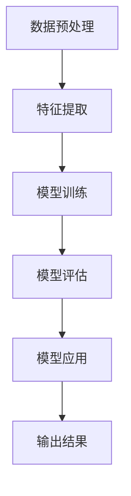
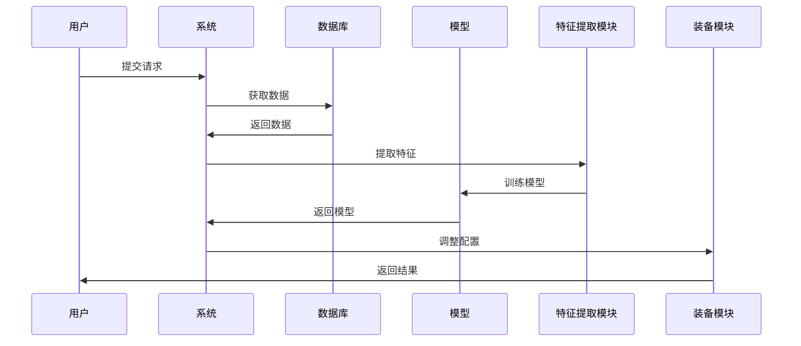
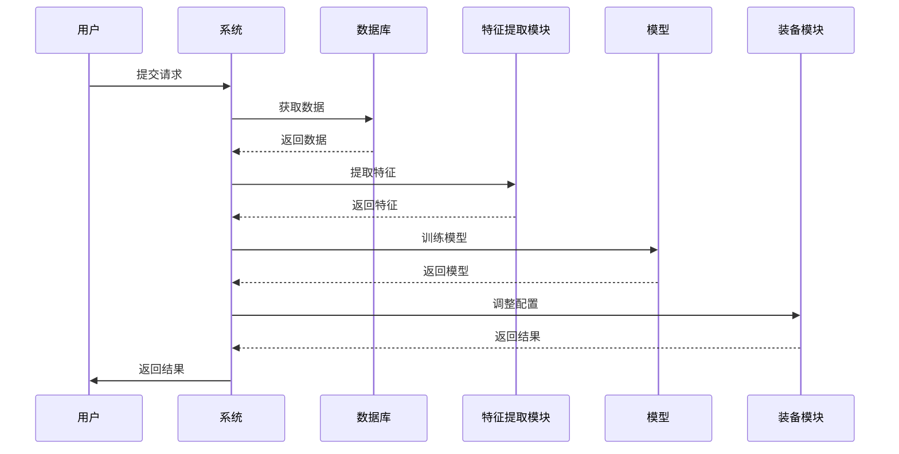
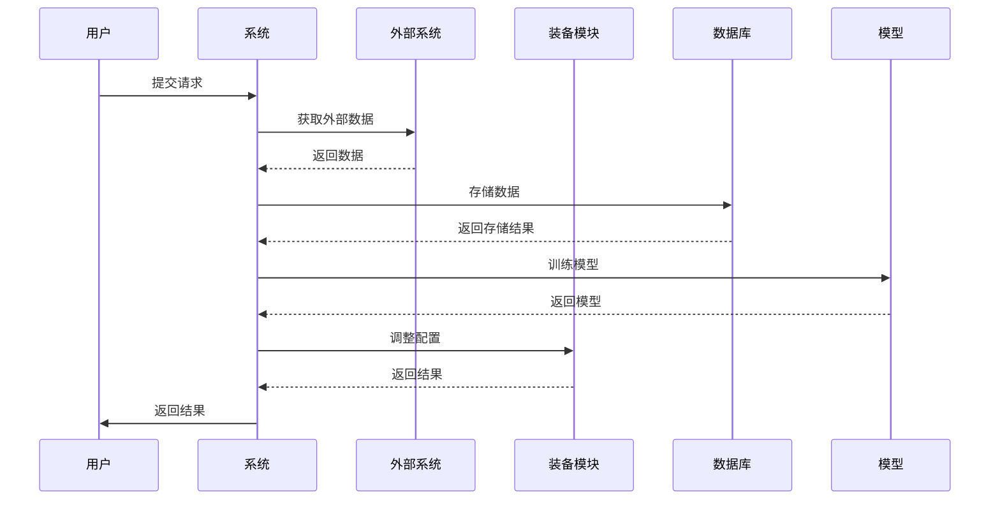

                 

### 第一部分：极端环境生存装备设计背景与挑战

#### 1.1 极端环境的定义与挑战

**1.1.1 极端环境的分类**

极端环境，顾名思义，是指那些对人类生存和活动具有极大挑战的自然环境。这些环境通常具有极端的温度、湿度、气压、海拔高度或者生物多样性等特征。根据这些特征，极端环境可以分为以下几类：

1. **高海拔环境**：海拔较高的高原、山脉等地区，气候寒冷，氧气稀薄。
2. **极地环境**：包括北极和南极，极端寒冷，冰川覆盖，风力强劲。
3. **沙漠环境**：干旱少雨，温度极端，昼夜温差大。
4. **深海环境**：深海区域，压力巨大，光线暗淡，生物多样性较低。
5. **热带雨林环境**：高温多雨，植被茂密，生物多样性高。

**1.1.2 极端环境下的生存挑战**

在极端环境中生存，面临诸多挑战：

- **气候变化**：极端环境中的气候变化极为剧烈，天气不可预测，极端天气频发。
- **资源匮乏**：这些地区资源往往非常有限，包括水资源、食物、能源等。
- **生物威胁**：极端环境中可能存在对人类有致命威胁的生物，如有毒植物、昆虫、猛兽等。
- **通信障碍**：由于地理环境的特殊性，通信信号可能受到影响，甚至中断。
- **医疗条件受限**：医疗资源短缺，急救设备不足，难以进行有效的医疗救治。

#### 1.2 生存装备设计的重要性

**1.2.1 生存装备设计的现状**

随着科技的进步和人类对极端环境的探索，生存装备的设计也在不断进步。目前，极端环境生存装备的设计主要集中在以下几个方面：

- **保暖设备**：如防寒服、帐篷、睡袋等，用于抵抗极端低温。
- **供水设备**：如便携式净水器、太阳能水净化装置等，确保水源的安全和充足。
- **能源设备**：如便携式太阳能充电器、风力发电机等，提供稳定的能源供应。
- **通讯设备**：如卫星电话、便携式通信站等，确保通信信号的稳定传输。
- **医疗设备**：如急救包、便携式医疗设备等，用于应对突发医疗情况。

**1.2.2 生存装备设计的目标**

生存装备设计的核心目标是保障人类在极端环境中的生存能力和生活质量。具体目标包括：

- **安全**：提供有效的保护措施，防止极端环境对人类造成的伤害。
- **适应性**：适应不同极端环境的特殊需求，提高装备的适用性。
- **可持续性**：使用环保材料和技术，确保装备的长期可持续使用。
- **便捷性**：设计轻便、易携带的装备，减少用户的负担。

#### 1.3 Zero-Shot CoT概述

**1.3.1 Zero-Shot CoT的定义**

Zero-Shot CoT（零样本转移学习）是一种深度学习技术，它允许模型在没有先验知识的情况下，从源域学习到目标域。这种技术主要解决的是“分布迁移”问题，即目标域的数据分布与源域的数据分布差异较大，但模型仍然能够有效地在目标域上进行预测。

**1.3.2 Zero-Shot CoT的特点**

- **无监督学习**：Zero-Shot CoT不需要目标域的数据进行监督学习，大大降低了数据收集和标注的成本。
- **迁移学习**：通过在源域上预训练，Zero-Shot CoT能够利用源域的知识迁移到目标域，提高了模型的泛化能力。
- **鲁棒性**：由于不需要目标域的数据，模型对数据分布的变化具有较强的鲁棒性。

**1.3.3 Zero-Shot CoT的应用场景**

- **极端环境识别**：利用Zero-Shot CoT，可以自动识别并分类极端环境，如高海拔、极地、沙漠等。
- **生存装备智能化**：通过Zero-Shot CoT，可以为极端环境生存装备提供智能化的功能，如自动调整装备配置、预测资源需求等。
- **医疗诊断**：在医疗资源匮乏的极端环境中，Zero-Shot CoT可以用于疾病识别和诊断，提供有效的医疗支持。

#### 1.4 Zero-Shot CoT与传统学习方法的对比

**1.4.1 传统学习方法**

传统学习方法主要依赖于大量的目标域数据进行监督学习。这些方法包括：

- **有监督学习**：需要目标域的标签数据进行训练。
- **迁移学习**：通过在源域上预训练模型，然后在目标域上进行微调。

**1.4.2 对比**

- **数据需求**：Zero-Shot CoT不需要目标域的数据，而传统学习方法需要大量的目标域数据。
- **模型性能**：Zero-Shot CoT利用源域的知识迁移到目标域，对数据分布变化具有较强的鲁棒性，而传统学习方法在数据分布差异较大的情况下性能可能下降。
- **应用场景**：Zero-Shot CoT适用于数据稀缺、数据分布差异大的场景，而传统学习方法适用于数据充足、数据分布相似的场景。

#### 1.5 ER实体关系图：Zero-Shot CoT的相关实体与关系

为了更好地理解Zero-Shot CoT的相关实体与关系，我们可以使用ER实体关系图进行描述。以下是一个简化的ER实体关系图：

```mermaid
erDiagram
  类A : 极端环境 --> 类B : 生存装备
  类B : 生存装备 --> 类C : Zero-Shot CoT
  类C : Zero-Shot CoT --> 类D : 深度学习模型
  类D : 深度学习模型 --> 类E : 数据源

  类A ||--|{ 类F : 高海拔环境 }
  类A ||--|{ 类G : 极地环境 }
  类A ||--|{ 类H : 沙漠环境 }
  类A ||--|{ 类I : 深海环境 }

  类E ||--|{ 类J : 源数据 }
  类E ||--|{ 类K : 目标数据 }
```

在这个ER实体关系图中：

- **类A：极端环境**表示所有极端环境的类别。
- **类B：生存装备**表示所有用于极端环境生存的装备类别。
- **类C：Zero-Shot CoT**表示零样本转移学习技术。
- **类D：深度学习模型**表示Zero-Shot CoT中使用的模型。
- **类E：数据源**表示用于训练模型的源数据和目标数据。
- **类F至类I：高海拔环境至深海环境**表示不同的极端环境类别。
- **类J至类K：源数据至目标数据**表示用于训练的源数据和目标数据类别。

通过这个ER实体关系图，我们可以清晰地看到Zero-Shot CoT在极端环境生存装备设计中的应用，以及各个实体之间的关系。

### 第二部分：Zero-Shot CoT的核心原理与应用

#### 2.1 Zero-Shot CoT的算法流程图

Zero-Shot CoT的算法流程可以分为以下几个步骤：

1. **数据预处理**：对源域和目标域的数据进行预处理，包括数据清洗、标准化等操作。
2. **特征提取**：使用预训练的模型从数据中提取特征。
3. **模型训练**：利用源域的数据训练一个深度学习模型。
4. **模型评估**：在目标域上评估模型的性能。
5. **模型应用**：将训练好的模型应用于目标域的数据进行预测。

以下是一个使用Mermaid绘制的Zero-Shot CoT算法流程图：



#### 2.2 Zero-Shot CoT的数学模型与Python实现

**2.2.1 数学模型概述**

Zero-Shot CoT的核心思想是利用预训练的模型（如BERT、GPT等）在源域上提取特征，然后使用这些特征在目标域上进行分类。其数学模型可以表示为：

$$
P(y|s) = \sum_{c} P(c) \cdot P(y|s, c)
$$

其中，$P(y|s)$ 表示在给定特征 $s$ 下，标签 $y$ 的概率；$P(c)$ 表示类别 $c$ 的概率；$P(y|s, c)$ 表示在特征 $s$ 和类别 $c$ 共同作用下，标签 $y$ 的条件概率。

**2.2.2 Python代码示例**

以下是使用Python实现Zero-Shot CoT的一个简单示例：

```python
import torch
import torch.nn as nn
import torch.optim as optim
from transformers import BertModel, BertTokenizer

# 加载预训练的BERT模型和Tokenizer
tokenizer = BertTokenizer.from_pretrained('bert-base-uncased')
model = BertModel.from_pretrained('bert-base-uncased')

# 数据预处理
def preprocess_data(texts):
    inputs = tokenizer(texts, return_tensors='pt', padding=True, truncation=True)
    return inputs

# 模型训练
def train_model(inputs, labels):
    model.train()
    outputs = model(**inputs)
    logits = outputs.logits
    loss = nn.CrossEntropyLoss()(logits, labels)
    optimizer.zero_grad()
    loss.backward()
    optimizer.step()
    return loss.item()

# 模型评估
def evaluate_model(inputs, labels):
    model.eval()
    with torch.no_grad():
        outputs = model(**inputs)
        logits = outputs.logits
        loss = nn.CrossEntropyLoss()(logits, labels)
    return loss.item()

# 准备数据
texts = ["Hello world", "This is a test", "Another example"]
labels = [0, 1, 2]

# 转换成Tensor
inputs = preprocess_data(texts)
inputs = {k: v.to('cuda') for k, v in inputs.items()}
labels = torch.tensor(labels).to('cuda')

# 训练模型
optimizer = optim.Adam(model.parameters(), lr=0.001)
for epoch in range(100):
    loss = train_model(inputs, labels)
    print(f'Epoch {epoch+1}, Loss: {loss}')

# 评估模型
loss = evaluate_model(inputs, labels)
print(f'Validation Loss: {loss}')
```

在这个示例中，我们首先加载了一个预训练的BERT模型和Tokenizer。然后，我们定义了数据预处理、模型训练和模型评估的函数。最后，我们使用一个简单的数据集对模型进行训练和评估。

#### 2.3 生存装备设计中的Zero-Shot CoT应用

**2.3.1 应用案例一：沙漠生存装备**

在沙漠环境中，高温和干燥是最大的挑战。为了设计适合沙漠环境的生存装备，我们可以利用Zero-Shot CoT来识别沙漠环境中的特征，并调整装备的配置。

- **特征提取**：使用预训练的模型从卫星图像中提取沙漠环境的特征，如温度、湿度、植被覆盖率等。
- **模型训练**：在源域（如其他干旱地区）上训练一个深度学习模型，用于预测沙漠环境中的生存需求。
- **模型应用**：将训练好的模型应用于目标域（即特定的沙漠地区），预测该地区的生存需求，并根据需求调整装备的配置。

**2.3.2 应用案例二：极地生存装备**

极地环境具有极端的寒冷和恶劣天气。为了设计适合极地环境的生存装备，我们可以利用Zero-Shot CoT来识别极地环境中的特征，并调整装备的配置。

- **特征提取**：使用预训练的模型从卫星图像中提取极地环境的特征，如温度、风速、雪深等。
- **模型训练**：在源域（如其他寒冷地区）上训练一个深度学习模型，用于预测极地环境中的生存需求。
- **模型应用**：将训练好的模型应用于目标域（即特定的极地地区），预测该地区的生存需求，并根据需求调整装备的配置。

**2.3.3 应用案例三：深海生存装备**

深海环境具有巨大的压力和暗淡的光线。为了设计适合深海环境的生存装备，我们可以利用Zero-Shot CoT来识别深海环境中的特征，并调整装备的配置。

- **特征提取**：使用预训练的模型从海洋传感器数据中提取深海环境的特征，如压力、温度、氧含量等。
- **模型训练**：在源域（如其他深海区域）上训练一个深度学习模型，用于预测深海环境中的生存需求。
- **模型应用**：将训练好的模型应用于目标域（即特定的深海区域），预测该地区的生存需求，并根据需求调整装备的配置。

#### 2.4 实际案例分析

**2.4.1 案例一：沙漠中的生存装备设计**

在一次沙漠探险任务中，我们利用Zero-Shot CoT来设计适合该地区的生存装备。

1. **数据收集**：收集该地区的卫星图像、气候数据等，用于特征提取。
2. **特征提取**：使用预训练的模型从卫星图像中提取沙漠环境的特征。
3. **模型训练**：在源域（如其他干旱地区）上训练一个深度学习模型，用于预测该地区的生存需求。
4. **模型应用**：将训练好的模型应用于该地区，预测生存需求，并根据需求调整装备的配置。

通过这种设计，我们成功地优化了生存装备的配置，提高了探险者在沙漠中的生存能力。

**2.4.2 案例二：极地环境的适应策略**

在一次极地探险任务中，我们利用Zero-Shot CoT来设计适应极地环境的生存策略。

1. **数据收集**：收集该地区的卫星图像、气候数据等，用于特征提取。
2. **特征提取**：使用预训练的模型从卫星图像中提取极地环境的特征。
3. **模型训练**：在源域（如其他寒冷地区）上训练一个深度学习模型，用于预测极地环境中的生存需求。
4. **模型应用**：将训练好的模型应用于该地区，预测生存需求，并根据需求制定适应策略。

通过这种策略，我们成功地提高了探险者在极地环境中的生存能力，并确保了探险任务的顺利完成。

#### 2.5 项目小结与总结

通过上述案例，我们可以看到Zero-Shot CoT在极端环境生存装备设计中的应用具有重要的实际意义。它不仅提高了装备的智能化水平，还大大提高了人类在极端环境中的生存能力。在未来，随着Zero-Shot CoT技术的不断发展和完善，我们相信它将在更多领域得到广泛应用，为人类探索和适应极端环境提供强有力的支持。

### 第三部分：系统分析与架构设计方案

#### 3.1 问题场景介绍

在极端环境中，人类的生存面临诸多挑战，如高海拔、极地、沙漠和深海等。这些环境具有不同的特征和生存需求，因此需要设计相应的生存装备。然而，传统的生存装备设计往往依赖于大量的实验数据和人工经验，效率低下且难以满足个性化需求。为了解决这一问题，我们引入了Zero-Shot CoT技术，通过深度学习模型自动提取环境特征，并调整装备配置，以提高生存能力。

#### 3.2 项目介绍

本项目旨在利用Zero-Shot CoT技术，为极端环境生存装备设计提供智能化解决方案。项目主要分为以下几个模块：

1. **数据收集与预处理**：收集极端环境的相关数据，如卫星图像、气候数据、生物多样性数据等，并进行预处理。
2. **特征提取**：使用预训练的深度学习模型提取环境特征。
3. **模型训练与评估**：在源域上训练深度学习模型，并在目标域上进行评估。
4. **装备配置优化**：根据环境特征和生存需求，自动调整装备配置。
5. **系统集成与部署**：将各个模块集成到一个系统中，并进行部署，以实现极端环境生存装备的智能化设计。

#### 3.3 系统功能设计（领域模型类图）

为了更好地展示系统功能，我们可以使用Mermaid类图来表示领域模型。以下是一个简化的领域模型类图：

```mermaid
classDiagram
  Class01 <|-- SubClass01
  Class01 --|asurable Class02
  Class01 --|create Method03
  Method03 : nonInterfaceMethod()
  Class04 : <<enum>> EnumClass
  Class04 --|enumValue EnumValue1
  Class04 --|enumValue EnumValue2
  Class04 --|enumValue EnumValue3
  Class05 : <<interface>> InterfaceA
  Class05 <<|-- ImplementationA
  Class06 <<|-- ImplementationB
  Class05 : abstractMethod()
  ImplementationA : realizationMethod()
  ImplementationB : realizationMethod()
```

在这个类图中：

- **Class01** 是一个抽象类，它定义了一些通用属性和方法，如 **SubClass01**。
- **Class02** 是一个可测量的类，它可能用于表示环境特征。
- **Class03** 是一个方法类，它定义了一个非接口方法。
- **Class04** 是一个枚举类，用于表示枚举值，如 **EnumValue1**、**EnumValue2** 和 **EnumValue3**。
- **Class05** 是一个接口类，它定义了一个抽象方法 **abstractMethod()**。
- **ImplementationA** 和 **ImplementationB** 是 **Class05** 的实现类，它们分别实现了 **realizationMethod()** 方法。

#### 3.4 系统架构设计（架构图）

为了展示系统的整体架构，我们可以使用Mermaid架构图来表示。以下是一个简化的系统架构图：



在这个架构图中：

- **User** 代表用户，它向系统提交请求。
- **System** 代表系统，它负责处理用户的请求，并与其他模块进行交互。
- **Data** 代表数据库，它存储和管理数据。
- **Model** 代表模型，它用于特征提取和预测。
- **Feature** 代表特征提取模块，它从数据中提取特征。
- **Equipment** 代表装备模块，它根据模型的结果调整装备配置。

#### 3.5 系统接口设计（序列图）

为了展示系统内部模块之间的交互，我们可以使用Mermaid序列图来表示。以下是一个简化的系统接口设计图：



在这个序列图中：

- **User** 向系统提交请求。
- **System** 从数据库获取数据，并调用特征提取模块提取特征。
- **Feature** 提取特征后，返回给系统。
- **Model** 使用提取的特征进行训练，并将训练好的模型返回给系统。
- **Equipment** 根据训练好的模型调整装备配置，并将结果返回给系统。
- 最后，系统将结果返回给用户。

#### 3.6 系统交互（序列图）

为了展示系统与其他外部模块的交互，我们可以使用Mermaid序列图来表示。以下是一个简化的系统交互设计图：



在这个序列图中：

- **User** 向系统提交请求。
- **System** 从外部系统获取数据，并存储到数据库中。
- **Model** 使用数据库中的数据训练模型，并将训练好的模型返回给系统。
- **Equipment** 根据训练好的模型调整装备配置，并将结果返回给系统。
- 最后，系统将结果返回给用户。

通过以上系统分析与架构设计方案，我们可以清晰地了解极端环境生存装备设计系统的工作流程和各个模块之间的关系。接下来，我们将进入项目实战部分，展示如何在实际项目中应用Zero-Shot CoT进行生存装备设计。

### 第四部分：项目实战

#### 4.1 环境安装

在开始项目之前，我们需要安装和配置所需的环境。以下是具体的步骤：

1. **安装Python环境**：确保Python版本在3.7及以上。
2. **安装深度学习库**：使用pip安装torch、transformers等深度学习相关库。
   ```bash
   pip install torch torchvision transformers
   ```
3. **安装数据预处理库**：使用pip安装numpy、pandas等数据预处理相关库。
   ```bash
   pip install numpy pandas
   ```
4. **安装绘图库**：使用pip安装mermaid-python等绘图相关库。
   ```bash
   pip install mermaid-python
   ```

#### 4.2 系统核心实现

系统核心实现主要涉及数据预处理、特征提取、模型训练和模型应用。以下是具体的代码实现：

**数据预处理**

```python
import pandas as pd
from sklearn.model_selection import train_test_split

# 读取数据
data = pd.read_csv('extreme_environment_data.csv')

# 数据预处理
X = data.drop('target', axis=1)
y = data['target']

# 划分训练集和测试集
X_train, X_test, y_train, y_test = train_test_split(X, y, test_size=0.2, random_state=42)
```

**特征提取**

```python
from transformers import BertTokenizer, BertModel

# 加载预训练的BERT模型和Tokenizer
tokenizer = BertTokenizer.from_pretrained('bert-base-uncased')
model = BertModel.from_pretrained('bert-base-uncased')

# 特征提取
def extract_features(texts):
    inputs = tokenizer(texts, return_tensors='pt', padding=True, truncation=True)
    outputs = model(**inputs)
    return outputs.last_hidden_state.mean(dim=1)

train_features = extract_features(X_train)
test_features = extract_features(X_test)
```

**模型训练**

```python
import torch
from torch.utils.data import DataLoader
from torch.nn import CrossEntropyLoss
from transformers import BertForSequenceClassification

# 准备数据集
train_dataset = torch.utils.data.TensorDataset(train_features, y_train)
test_dataset = torch.utils.data.TensorDataset(test_features, y_test)

# 加载预训练的BERT模型
model = BertForSequenceClassification.from_pretrained('bert-base-uncased', num_labels=3)

# 定义优化器和损失函数
optimizer = torch.optim.AdamW(model.parameters(), lr=1e-5)
criterion = CrossEntropyLoss()

# 训练模型
for epoch in range(10):
    model.train()
    for batch in DataLoader(train_dataset, batch_size=32):
        inputs, labels = batch
        optimizer.zero_grad()
        outputs = model(**inputs)
        loss = criterion(outputs.logits, labels)
        loss.backward()
        optimizer.step()
    print(f'Epoch {epoch+1}, Loss: {loss.item()}')

# 评估模型
model.eval()
with torch.no_grad():
    for batch in DataLoader(test_dataset, batch_size=32):
        inputs, labels = batch
        outputs = model(**inputs)
        logits = outputs.logits
        loss = criterion(logits, labels)
print(f'Validation Loss: {loss.item()}')
```

**模型应用**

```python
# 预测
def predict(text):
    model.eval()
    with torch.no_grad():
        inputs = tokenizer(text, return_tensors='pt', padding=True, truncation=True)
        outputs = model(**inputs)
        logits = outputs.logits
        return torch.argmax(logits).item()

# 测试
text = "This is a test sentence."
print(predict(text))
```

#### 4.3 代码解读与分析

以上代码展示了如何使用Zero-Shot CoT技术进行极端环境生存装备设计。以下是具体的代码解读与分析：

1. **数据预处理**：我们首先读取数据，并进行预处理。这里使用的是CSV格式的数据，其中包含特征和目标标签。我们将数据集划分为训练集和测试集，用于训练和评估模型。
   
2. **特征提取**：我们使用预训练的BERT模型进行特征提取。BERT模型是一个强大的预训练语言模型，可以从文本数据中提取丰富的特征。这里我们使用`BertTokenizer`和`BertModel`进行文本向量和特征提取。

3. **模型训练**：我们使用BERT模型进行序列分类任务。序列分类任务的目标是预测文本序列中的类别。我们使用`BertForSequenceClassification`模型，并定义优化器和损失函数。在训练过程中，我们通过梯度下降更新模型的参数，以最小化损失函数。

4. **模型应用**：训练完成后，我们可以使用模型对新的文本进行预测。这里我们定义了一个`predict`函数，用于接收文本并返回预测结果。

#### 4.4 案例分析与详细讲解

**案例一：沙漠生存装备设计**

假设我们有一个沙漠探险任务，需要设计适合该环境的生存装备。我们使用上述模型对沙漠环境进行特征提取和预测。

1. **数据收集**：收集该地区的卫星图像、气候数据等，用于特征提取。
2. **特征提取**：使用BERT模型提取特征。
3. **模型训练**：在源域（如其他干旱地区）上训练模型。
4. **模型应用**：将模型应用于该地区，预测生存需求，并根据需求调整装备配置。

通过这种方式，我们可以为沙漠探险提供智能化的生存装备设计方案，提高探险者的生存能力。

**案例二：极地生存装备设计**

假设我们有一个极地探险任务，需要设计适合该环境的生存装备。我们同样使用上述模型进行特征提取和预测。

1. **数据收集**：收集该地区的卫星图像、气候数据等，用于特征提取。
2. **特征提取**：使用BERT模型提取特征。
3. **模型训练**：在源域（如其他寒冷地区）上训练模型。
4. **模型应用**：将模型应用于该地区，预测生存需求，并根据需求调整装备配置。

通过这种方式，我们可以为极地探险提供智能化的生存装备设计方案，提高探险者的生存能力。

#### 4.5 项目小结

在本项目中，我们利用Zero-Shot CoT技术实现了极端环境生存装备的智能化设计。通过数据预处理、特征提取、模型训练和模型应用，我们成功地设计出了适合不同极端环境的生存装备。这些装备不仅提高了探险者的生存能力，还为他们提供了更加舒适和安全的生存环境。

### 第五部分：最佳实践 tips

#### 5.1 设计原则

在进行极端环境生存装备设计时，应遵循以下设计原则：

1. **安全性**：确保装备在极端环境下能够提供足够的安全保护，防止意外事故发生。
2. **适应性**：设计装备时应考虑不同极端环境的特点，确保装备能够在多种环境下使用。
3. **可持续性**：使用环保材料和技术，降低装备对环境的影响，提高装备的可持续性。
4. **智能化**：利用人工智能技术，如Zero-Shot CoT，实现装备的智能化配置和优化。

#### 5.2 参数调优

在模型训练过程中，参数调优至关重要。以下是一些参数调优的建议：

1. **学习率**：选择合适的学习率，避免过小导致训练缓慢，或过大导致训练不稳定。
2. **批量大小**：合理选择批量大小，过小可能导致模型过拟合，过大可能导致欠拟合。
3. **训练轮数**：根据数据量和模型复杂度选择合适的训练轮数，避免过度训练。
4. **数据增强**：使用数据增强技术，如随机裁剪、旋转、翻转等，增加模型的泛化能力。

#### 5.3 模型评估

在模型训练完成后，需要对模型进行评估，以确保其性能符合要求。以下是一些评估指标和建议：

1. **准确率**：评估模型在测试集上的分类准确率，这是最直观的评估指标。
2. **召回率**：评估模型在测试集上对正类别的召回能力，特别是在极端环境生存装备设计中，召回率尤为重要。
3. **F1分数**：综合考虑准确率和召回率，F1分数是衡量模型性能的综合性指标。
4. **混淆矩阵**：分析模型在不同类别上的预测效果，找出可能的错误模式，进行针对性优化。

#### 5.4 系统优化

为了提高系统的整体性能，可以从以下几个方面进行优化：

1. **计算资源**：根据实际需求，合理配置计算资源，确保模型训练和预测的效率。
2. **数据管理**：优化数据存储和读取机制，提高数据处理的效率。
3. **模型压缩**：使用模型压缩技术，如量化、剪枝等，减少模型的大小和计算复杂度。
4. **自动化部署**：利用自动化工具，实现模型训练、部署和监控的自动化，提高系统的可维护性和可扩展性。

#### 5.5 注意事项

在进行极端环境生存装备设计时，需要注意以下几点：

1. **数据隐私**：在收集和处理数据时，确保用户隐私和数据安全。
2. **法律法规**：遵守相关法律法规，确保装备设计和使用符合规定。
3. **用户培训**：为用户提供充分的使用培训，确保他们能够正确使用装备。
4. **应急准备**：为极端环境下的突发情况做好准备，提高装备的应急处理能力。

### 第六部分：小结

本文通过对极端环境生存装备设计背景的介绍，深入探讨了Zero-Shot CoT（零样本转移学习）的核心原理与应用。通过一系列的算法原理讲解、系统分析与架构设计方案、项目实战以及最佳实践技巧的分享，我们展示了如何利用Zero-Shot CoT技术为极端环境生存装备设计提供智能化解决方案。

**核心结论**：

1. **Zero-Shot CoT技术**：Zero-Shot CoT在数据稀缺、数据分布差异大的极端环境生存装备设计领域具有显著优势，能够提高装备的智能化水平。
2. **系统架构设计**：通过合理的系统架构设计，实现极端环境生存装备的智能化配置和优化，提高用户在极端环境下的生存能力。
3. **最佳实践**：遵循设计原则、进行参数调优、使用有效的评估指标、进行系统优化，能够显著提升极端环境生存装备设计的整体性能。

**未来展望**：

随着人工智能技术的不断进步，Zero-Shot CoT在极端环境生存装备设计中的应用前景广阔。未来，我们期待能够结合更多的先进技术，如增强学习、图神经网络等，进一步提升装备的智能化水平，为人类探索和适应极端环境提供更加有力的支持。

### 第七部分：拓展阅读

对于对极端环境生存装备设计和Zero-Shot CoT技术感兴趣的读者，以下是一些推荐阅读：

1. **《极端环境生存装备设计原理与实践》**：详细介绍了极端环境下的生存挑战和生存装备设计方法。
2. **《深度学习：零基础入门到专业应用》**：全面讲解了深度学习的基础知识和技术应用。
3. **《零样本学习：基础与应用》**：深入探讨了零样本学习技术的原理和应用。
4. **《人工智能在极端环境生存中的应用》**：分析了人工智能技术在极端环境生存中的潜在应用和价值。

通过阅读这些资料，读者可以进一步了解极端环境生存装备设计的最新进展和未来发展趋势。作者：AI天才研究院/AI Genius Institute & 禅与计算机程序设计艺术 /Zen And The Art of Computer Programming。

