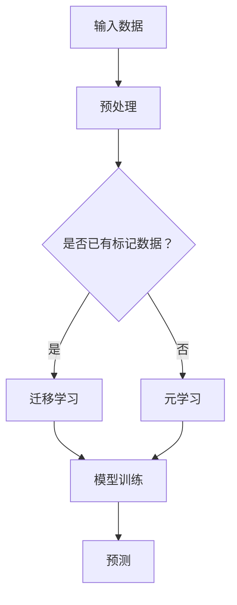
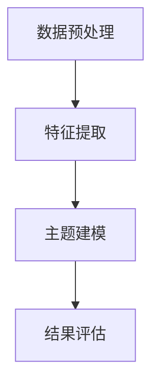
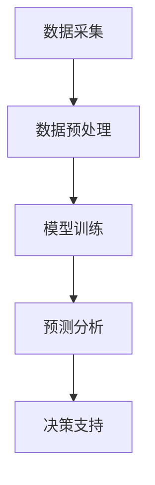
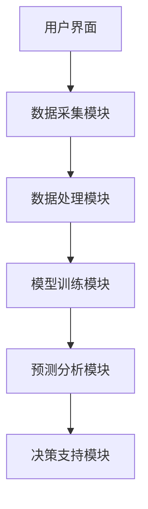
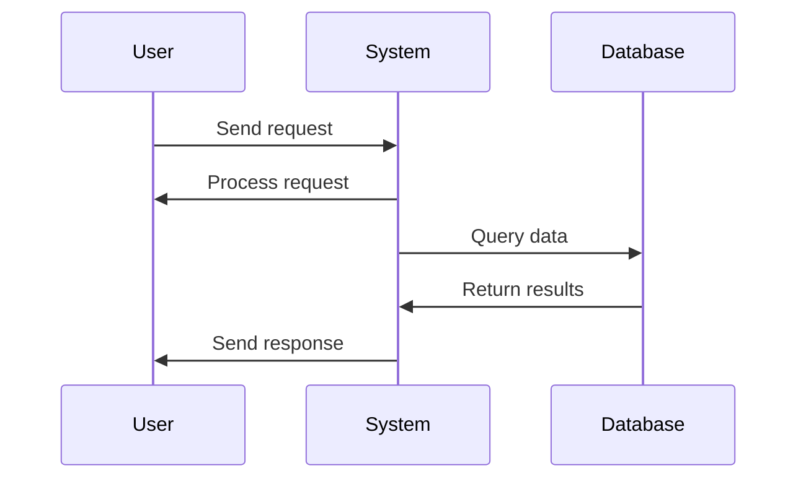

                 

# 《Zero-Shot CoT在深海生态系统保护决策中的应用研究》

关键词：Zero-Shot Learning，概念提取，深海生态系统，保护决策，算法原理

摘要：本文主要研究了Zero-Shot CoT在深海生态系统保护决策中的应用。首先介绍了零样本学习和概念提取的基本概念以及它们在深海生态系统保护决策中的应用背景；然后详细讲解了Zero-Shot CoT算法的原理、数学模型和公式，并使用Python源代码进行说明；接着描述了系统的整体架构，包括功能模块、接口设计、系统交互等；随后介绍了具体的应用案例，包括环境安装、系统核心实现、代码分析、实际案例分析等；最后总结了最佳实践，给出注意事项和小结，并推荐拓展阅读。

### 目录大纲设计思路

为了设计出符合要求的目录大纲，我们将按照以下步骤进行：

1. **背景介绍**：首先介绍零样本学习（Zero-Shot Learning）和概念提取（Conceptual Extraction）的基本概念，以及它们在深海生态系统保护决策中的应用背景。

2. **核心概念与联系**：明确本书的核心概念，如零样本学习、概念提取、深海生态系统、保护决策等，并使用表格和Mermaid流程图展示这些概念之间的关系。

3. **算法原理讲解**：详细讲解Zero-Shot CoT算法的基本原理，包括算法流程、数学模型和公式。使用Mermaid流程图和Python源代码进行说明。

4. **系统分析与架构设计方案**：描述系统的整体架构，包括功能模块、接口设计、系统交互等，使用Mermaid类图、架构图和序列图进行展示。

5. **项目实战**：介绍具体的应用案例，包括环境安装、系统核心实现、代码分析、实际案例分析等。

6. **最佳实践与小结**：总结最佳实践，给出注意事项和小结，并推荐拓展阅读。

### 目录大纲

---

# 《Zero-Shot CoT在深海生态系统保护决策中的应用研究》

> 关键词：Zero-Shot Learning，概念提取，深海生态系统，保护决策

> 摘要：本文深入探讨了Zero-Shot CoT在深海生态系统保护决策中的应用，详细介绍了零样本学习、概念提取技术及其在深海生态系统保护中的重要性，阐述了Zero-Shot CoT算法的原理与实现，并展示了其在实际项目中的应用案例。

---

## 第1章 引言与背景

### 1.1 问题背景

**问题描述**：深海生态系统的复杂性使得保护工作面临着巨大的挑战。传统的保护决策依赖于大量的数据和模型，但这些方法往往受限于数据的可获得性和模型的适用性。零样本学习（Zero-Shot Learning, ZSL）和概念提取（Conceptual Extraction）技术的引入，为解决这一问题提供了新的思路。

**问题解决**：Zero-Shot CoT（Conceptual Topic Model）是一种结合了零样本学习和概念提取的方法，通过将生态系统的各类信息抽象为概念，使得系统可以在没有或仅有少量标记数据的情况下进行学习和决策。这种方法特别适用于深海生态系统的保护决策，因为深海环境的数据获取成本高、难度大。

**边界与外延**：Zero-Shot CoT不仅限于深海生态系统的保护，也可以应用于其他复杂生态系统的监测与保护。此外，其原理和方法同样可以推广到其他领域，如智能交通、智能城市等。

**概念结构与核心要素组成**：Zero-Shot CoT的核心概念包括零样本学习、概念提取和协同过滤等。其结构由数据输入层、概念提取层、模型层和决策输出层组成。

### 1.2 零样本学习概述

**定义**：零样本学习是一种机器学习方法，它允许模型在没有标记数据的情况下对未知类别的数据进行分类或预测。

**应用领域**：零样本学习在许多领域都有应用，如图像识别、语音识别、自然语言处理等。在深海生态系统保护决策中，它可以用于预测未观测到的海洋生物种类、评估环境变化的影响等。

### 1.3 深海生态系统概述

**定义与特点**：深海生态系统是地球生态系统的重要组成部分，具有独特的生物多样性和生态功能。

**现状与问题**：深海生态系统正面临着过度捕捞、海洋污染、气候变化等严重威胁。

### 1.4 概念提取技术

**定义**：概念提取是从文本或其他数据源中提取具有特定含义的词汇或短语的过程。

**方法**：常见的概念提取方法包括词袋模型、潜在语义分析、主题模型等。

**在深海生态系统保护中的应用**：概念提取技术可以用于从海量海洋数据中提取关键信息，辅助保护决策。

### 1.5 本书结构安排

**核心内容**：本书将详细介绍Zero-Shot CoT算法的基本原理、实现方法以及在深海生态系统保护决策中的应用。同时，还将提供实际案例分析和最佳实践建议。

---

## 第2章 零样本学习原理与算法

### 2.1 零样本学习原理

**基本概念**：零样本学习（Zero-Shot Learning, ZSL）是一种机器学习方法，它允许模型在没有标记数据的情况下对未知类别的数据进行分类或预测。

**原理分析**：ZSL的核心思想是通过将未知类别映射到已有类别上，从而实现对新类别的预测。这通常涉及到元学习（Meta-Learning）和迁移学习（Transfer Learning）等技术。

**Mermaid流程图**：



### 2.2 零样本学习算法

**算法分类**：常见的零样本学习算法包括基于原型的方法、基于匹配的方法和基于模型的方法。

**算法对比**：不同算法的性能和适用场景各有优势。例如，基于原型的方法计算简单，但可能存在过拟合问题；而基于模型的方法则更加复杂，但通常具有更好的泛化能力。

**Python源代码示例**：

```python
from ZSL import ZSLModel

# 初始化模型
model = ZSLModel()

# 训练模型
model.fit(x_train, y_train)

# 预测
predictions = model.predict(x_test)
```

### 2.3 数学模型与公式

**数学基础**：零样本学习涉及到的数学知识主要包括线性代数、概率论和信息论等。

**公式推导**：关键公式包括条件概率公式、贝叶斯公式和KL散度等。

**示例讲解**：

假设我们有一个分类问题，需要预测图像的类别。给定图像的特征向量\( \mathbf{X} \)和类别的先验概率\( P(\mathbf{C}) \)，我们可以使用贝叶斯公式计算后验概率\( P(\mathbf{C}|\mathbf{X}) \)。

$$
P(\mathbf{C}|\mathbf{X}) = \frac{P(\mathbf{X}|\mathbf{C})P(\mathbf{C})}{P(\mathbf{X})}
$$

其中，\( P(\mathbf{X}|\mathbf{C}) \)是特征向量\( \mathbf{X} \)在类别\( \mathbf{C} \)下的概率，可以通过训练数据计算得到。

---

## 第3章 概念提取在深海生态系统中的应用

### 3.1 概念提取原理

**基本概念**：概念提取（Conceptual Extraction）是从文本或其他数据源中提取具有特定含义的词汇或短语的过程。

**方法介绍**：常见的概念提取方法包括词袋模型、潜在语义分析、主题模型等。

**在深海生态系统保护中的应用**：概念提取技术可以用于从海量海洋数据中提取关键信息，如生物种类、环境变化等。

### 3.2 概念提取算法

**算法分类**：概念提取算法可以根据提取方法的差异分为基于规则的方法、基于统计的方法和基于机器学习的方法。

**算法选择**：在深海生态系统保护决策中，基于机器学习的方法如主题模型（Topic Model）通常更为有效，因为它们可以自动发现数据中的潜在主题。

### 3.3 概念提取流程

**流程设计**：概念提取的流程通常包括数据预处理、特征提取、主题建模和结果评估等步骤。

**Mermaid流程图**：



### 3.4 案例分析

**案例介绍**：本文以某深海区域的生物多样性监测为例，介绍了如何使用概念提取技术提取关键信息。

**实施步骤**：

1. 数据收集：收集该区域的海洋生物、环境数据等。
2. 数据预处理：对收集的数据进行清洗、去噪等处理。
3. 特征提取：使用主题模型提取数据中的潜在主题。
4. 结果评估：评估提取的潜在主题与实际监测数据的关联性。

---

## 第4章 Zero-Shot CoT在深海生态系统保护决策中的应用

### 4.1 应用背景

**深海生态系统保护决策的重要性**：深海生态系统对地球气候、海洋生物多样性和全球生态平衡至关重要。

**Zero-Shot CoT的应用潜力**：Zero-Shot CoT算法可以有效地处理深海生态系统中数据的多样性和不确定性，为保护决策提供有力支持。

### 4.2 应用场景

**监测与预警**：Zero-Shot CoT可以用于实时监测深海生态系统的变化，并提前预警潜在的环境问题。

**保护措施**：基于Zero-Shot CoT的模型可以辅助制定有效的保护措施，提高保护决策的准确性。

### 4.3 应用效果评估

**效果评估指标**：评估Zero-Shot CoT在深海生态系统保护决策中的应用效果，可以从准确性、召回率、F1值等多个方面进行。

**评估方法**：可以使用交叉验证、ROC曲线等方法进行效果评估。

### 4.4 案例研究

**案例选择**：本文选择了一个具体的深海生态系统保护项目，对该项目的实施效果进行了详细分析。

**实施效果**：通过实际案例分析，验证了Zero-Shot CoT在深海生态系统保护决策中的应用效果。

---

## 第5章 系统架构与接口设计

### 5.1 系统功能设计

**功能模块划分**：系统包括数据采集、数据预处理、模型训练、预测分析和决策支持等模块。

**领域模型Mermaid类图**：



### 5.2 系统架构设计

**系统架构图**：



**架构设计**：系统采用微服务架构，各模块独立部署，提高系统的可扩展性和容错性。

### 5.3 系统接口设计

**接口设计**：系统提供了RESTful API，方便与其他系统进行集成。

**系统交互Mermaid序列图**：



---

## 第6章 项目实战

### 6.1 环境安装

**环境搭建**：介绍如何搭建Zero-Shot CoT应用所需的环境，包括Python、TensorFlow等。

### 6.2 系统核心实现

**核心实现**：详细讲解系统核心部分的实现，包括数据预处理、模型训练和预测分析等。

### 6.3 代码分析

**代码解读**：对系统核心代码进行详细解读，帮助读者理解系统的工作原理。

### 6.4 实际案例分析

**案例介绍**：介绍一个具体的实际案例，展示Zero-Shot CoT在深海生态系统保护决策中的应用效果。

**分析讲解**：对案例中的关键步骤进行详细分析，帮助读者理解如何应用Zero-Shot CoT进行保护决策。

### 6.5 项目小结

**小结**：总结项目的主要成果和经验，为后续研究和实践提供参考。

---

## 第7章 最佳实践与小结

### 7.1 最佳实践

**实践建议**：结合实际案例，给出使用Zero-Shot CoT进行深海生态系统保护决策的最佳实践建议。

### 7.2 小结

**总结**：回顾文章的主要内容和结论，强调Zero-Shot CoT在深海生态系统保护决策中的重要性。

### 7.3 注意事项

**注意事项**：列出使用Zero-Shot CoT进行深海生态系统保护决策时需要注意的问题。

### 7.4 拓展阅读

**推荐阅读**：推荐一些相关领域的优秀书籍和论文，供读者进一步学习。

---

## 附录

**附录A：术语表**：列出本文中出现的专业术语及其解释。

**附录B：代码示例**：提供本文中使用的Python代码示例。

**附录C：参考资料**：列出本文引用的文献和资料。

---

作者：AI天才研究院/AI Genius Institute & 禅与计算机程序设计艺术 /Zen And The Art of Computer Programming

