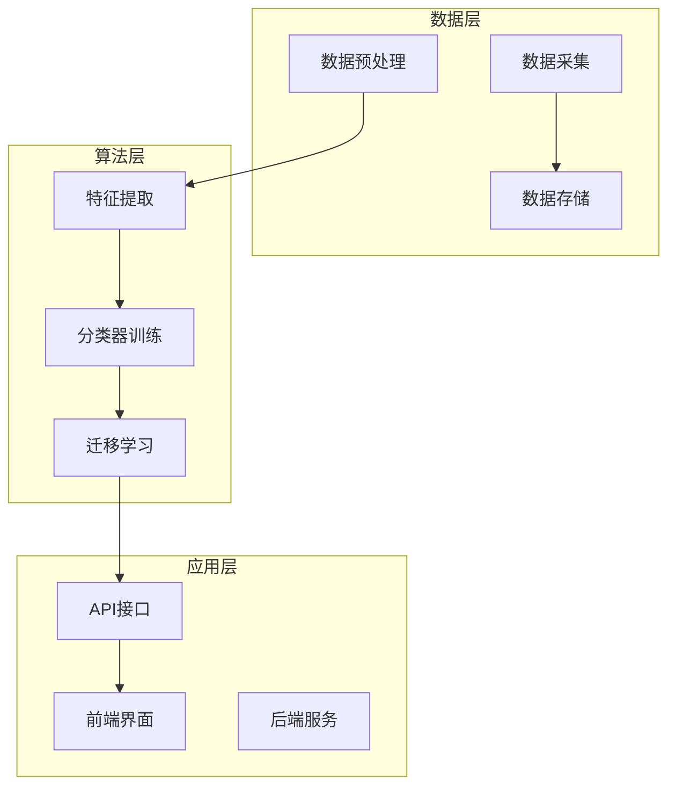
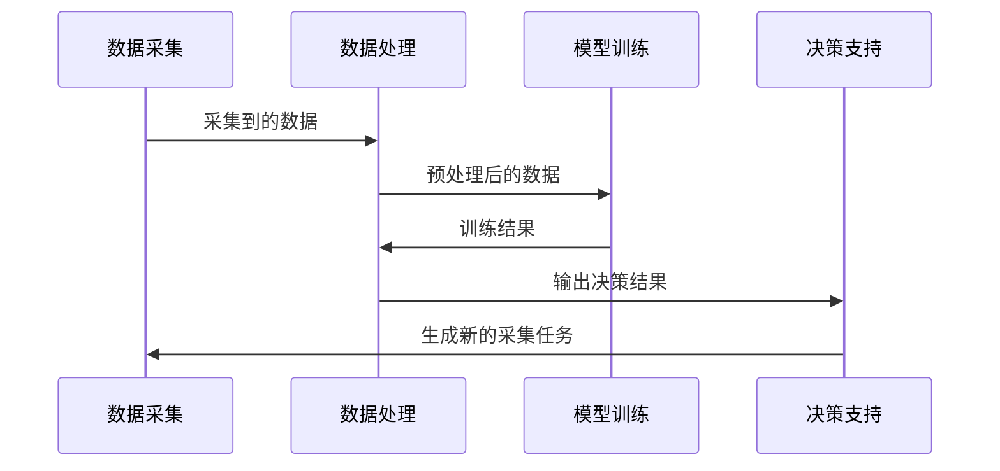

                 

### 文章标题：Zero-Shot CoT在深海资源勘探决策支持中的应用

在当今快速发展的科技时代，深海资源勘探已成为国家战略资源开发和科技进步的重要方向。随着海洋资源的不断开发利用，深海资源勘探的决策支持系统显得尤为重要。然而，深海环境复杂多变，资源分布不均，给决策支持系统带来了巨大的挑战。本文将探讨如何利用Zero-Shot CoT（无监督迁移学习）这一前沿技术，在深海资源勘探决策支持中提供有效的解决方案。

### 关键词
- **Zero-Shot CoT**
- **深海资源勘探**
- **决策支持系统**
- **无监督迁移学习**
- **人工智能**

### 摘要
本文首先介绍了深海资源勘探的背景和面临的挑战，提出了基于Zero-Shot CoT的决策支持系统。随后，详细阐述了Zero-Shot CoT的概念、原理及其在深海资源勘探中的应用。文章通过具体的项目实战案例，展示了Zero-Shot CoT在深海资源勘探中的实际应用效果，并提供了一些建议和展望。

## 1. 背景介绍

### 问题背景

深海资源勘探是近年来国家科技战略的重要组成部分。随着陆地资源的逐渐枯竭，海洋资源的开发成为新的经济增长点。然而，深海环境的复杂性和危险性，使得深海资源勘探面临诸多挑战。例如，深海地质条件复杂，地质构造多样，资源分布不均，环境监测数据获取困难等。这些因素都使得深海资源勘探的决策过程变得复杂且风险高。

为了提高深海资源勘探的效率和准确性，决策支持系统的需求日益迫切。然而，现有的深海资源勘探决策支持系统往往依赖于大量的标注数据和复杂的有监督学习模型。在深海环境中，获取高质量标注数据是一项极具挑战的任务。因此，如何利用现有数据资源，实现高效、准确的决策支持，成为当前研究的重要课题。

### 问题描述

在深海资源勘探过程中，主要面临以下几个决策难题：

1. **资源分布预测**：如何准确预测深海区域中的矿产资源分布，以指导勘探活动？
2. **风险评估**：如何评估深海勘探活动中的风险，包括地质风险、海洋生物风险等？
3. **数据融合**：如何将多源异构的数据进行有效融合，提高数据利用效率？
4. **实时决策**：如何在复杂多变的深海环境中，实现实时、智能的决策支持？

### 问题解决

为了解决上述问题，近年来人工智能领域涌现出一种新的技术——Zero-Shot CoT（无监督迁移学习）。Zero-Shot CoT的核心思想是在没有标注数据的情况下，通过迁移学习实现模型的训练和预测。这种技术具有以下优势：

1. **无需标注数据**：在深海资源勘探中，获取高质量标注数据非常困难。Zero-Shot CoT可以省去这一步骤，降低数据获取成本。
2. **迁移学习能力**：Zero-Shot CoT可以将在一个领域学到的知识迁移到另一个领域，提高模型的泛化能力。
3. **自适应性强**：Zero-Shot CoT可以根据不同的勘探需求，调整模型参数，实现个性化决策支持。

通过引入Zero-Shot CoT，深海资源勘探决策支持系统可以实现以下目标：

1. **高效资源分布预测**：利用无监督学习算法，从已有的数据中挖掘出潜在的资源分布模式，提高预测准确性。
2. **智能风险评估**：通过迁移学习，将不同领域的数据进行融合，实现对深海勘探风险的智能评估。
3. **多源数据融合**：利用Zero-Shot CoT，将不同类型、来源的数据进行有效融合，提高数据利用效率。
4. **实时决策支持**：通过自适应迁移学习，实现深海勘探过程中的实时、智能决策。

### 边界与外延

Zero-Shot CoT作为无监督迁移学习的一种，具有广泛的应用前景。然而，其适用范围也有一定的边界。首先，Zero-Shot CoT适用于数据量较大、数据分布较为均匀的领域。在深海资源勘探中，数据量通常较大，但数据分布可能不均匀，因此Zero-Shot CoT需要结合其他技术手段进行优化。其次，Zero-Shot CoT对计算资源的需求较高，在实际应用中需要考虑计算成本和硬件条件。此外，Zero-Shot CoT的迁移效果受限于源领域和目标领域之间的相似度，因此需要在模型设计和参数调整方面进行深入研究。

## 2. 核心概念与联系

### Zero-Shot CoT的定义及其原理

Zero-Shot CoT，即无监督迁移学习（Zero-Shot Transfer Learning），是一种在训练数据未标注或标注困难的情况下，通过迁移学习实现模型训练和预测的技术。其核心思想是将一个领域（源领域）的预训练模型迁移到另一个领域（目标领域），以利用源领域中的已有知识，提高目标领域模型的性能。

Zero-Shot CoT的原理可以分为以下几个步骤：

1. **预训练模型**：在源领域上使用大量的未标注数据，通过无监督学习的方法（如自编码器、生成对抗网络等），训练出一个强大的预训练模型。
2. **特征提取**：将源领域和目标领域的样本输入预训练模型中，提取出高层次的语义特征。
3. **迁移学习**：利用源领域的特征提取器，对目标领域的数据进行特征提取，然后在这些特征上训练目标领域的模型。
4. **模型融合**：将源领域和目标领域的模型进行融合，生成最终的预测结果。

### 深海资源勘探相关的关键概念

在深海资源勘探中，涉及多个关键概念，包括：

1. **海洋地质结构**：包括海底地形、地质构造、沉积物分布等。
2. **矿产资源**：如海底油气、金属矿、稀土元素等。
3. **环境因素**：包括海洋温度、盐度、压力、海洋生物等。
4. **勘探工具**：如深海钻探设备、潜水器、海洋观测卫星等。
5. **数据分析**：包括遥感数据、地质数据、海洋化学数据等的处理与分析。

### 概念属性特征对比表格

下表对比了Zero-Shot CoT和深海资源勘探中的关键概念：

| 概念       | 属性特征                     | 关联性                     |
|------------|------------------------------|-----------------------------|
| Zero-Shot CoT | 无监督迁移学习技术          | 提高模型迁移效果           |
| 海洋地质结构 | 地质构造、地形、沉积物等    | 影响矿产资源分布           |
| 矿产资源    | 油气、金属矿、稀土元素等    | 决定勘探目标               |
| 环境因素    | 温度、盐度、压力、生物等    | 影响勘探活动和安全          |
| 勘探工具    | 钻探设备、潜水器、卫星等    | 提供数据采集手段           |
| 数据分析    | 遥感数据、地质数据、化学数据 | 提供决策支持               |

### ER实体关系图架构的Mermaid流程图

以下是深海资源勘探中ER实体关系图的Mermaid流程图：

```mermaid
erDiagram
  Resource -> Analysis : 进行资源分析
  Tool -> Resource : 使用勘探工具进行资源采集
  Environment -> Tool : 环境因素影响勘探工具
  Tool -> Analysis : 提供数据给数据分析
  Analysis -> Decision : 数据分析支持决策
  Resource -> Decision : 资源分析结果影响决策
```

该流程图展示了深海资源勘探中各个实体之间的关系，为后续的算法设计和系统架构提供了基础。

## 3. 算法原理讲解

### 数学模型和公式

在Zero-Shot CoT中，常用的数学模型包括特征提取器（Feature Extractor）和分类器（Classifier）。特征提取器用于提取样本的高层次语义特征，而分类器则用于对特征进行分类。

假设我们有一个源领域D_s和目标领域D_t，其中样本分别为X_s和X_t。特征提取器F和分类器C的数学模型可以表示为：

$$
F: X_s \rightarrow Z_s \\
C: Z_s \rightarrow P_s
$$

其中，Z_s为特征提取器F对源领域样本X_s的处理结果，P_s为分类器C对特征Z_s的分类结果。

在目标领域D_t中，特征提取器F同样适用，但分类器C可能不适用。因此，我们需要一个迁移学习的过程，将源领域的分类器C迁移到目标领域D_t。

$$
F: X_t \rightarrow Z_t \\
C_s: Z_t \rightarrow P_t
$$

其中，C_s为源领域的分类器C在特征Z_t上的迁移结果。

### 算法原理的详细讲解

Zero-Shot CoT的算法原理可以分为以下几个步骤：

1. **预训练特征提取器F**：在源领域D_s上使用大量未标注数据，通过无监督学习的方法（如自编码器、生成对抗网络等），训练出一个强大的特征提取器F。
2. **迁移特征提取器F**：将特征提取器F迁移到目标领域D_t，对目标领域的样本X_t进行特征提取，得到特征Z_t。
3. **分类器迁移**：使用源领域的分类器C_s对特征Z_t进行分类，得到目标领域的分类结果P_t。
4. **模型融合**：将源领域的特征提取器F和目标领域的分类器C_s融合，生成最终的预测结果P_t。

### 通俗易懂的举例说明

假设我们有一个源领域D_s，其中包含不同类型的动物图片。特征提取器F可以提取出这些动物图片的高层次特征，例如“猫”、“狗”、“鸟”等。在目标领域D_t中，我们希望对一些未标注的鸟类图片进行分类。

首先，我们使用源领域D_s中的图片，通过无监督学习的方法训练出一个特征提取器F。然后，将特征提取器F应用到目标领域D_t中的鸟类图片上，得到特征Z_t。接着，使用源领域D_s中的分类器C_s对特征Z_t进行分类，得到鸟类图片的分类结果P_t。

通过这个例子，我们可以看到，Zero-Shot CoT利用源领域的知识，实现了对目标领域的分类。这个过程无需对目标领域的数据进行标注，大大降低了数据获取的成本。

## 4. 系统分析与架构设计方案

### 问题场景介绍

在深海资源勘探中，为了实现高效、准确的决策支持，需要建立一个综合性的系统，该系统应具备以下功能：

1. **数据采集**：通过多种勘探工具（如深海钻探设备、潜水器、海洋观测卫星等）收集深海环境数据。
2. **数据处理**：对采集到的多源异构数据进行预处理、融合和清洗，为后续分析提供高质量的数据。
3. **模型训练**：使用Zero-Shot CoT技术，在源领域上训练特征提取器和分类器，并迁移到目标领域。
4. **决策支持**：利用训练好的模型，对深海资源分布、风险评估等问题提供实时、智能的决策支持。

### 项目介绍

本项目中，我们将开发一个深海资源勘探决策支持系统，主要包括以下几个部分：

1. **数据采集模块**：集成多种勘探工具，实现深海环境数据的采集。
2. **数据处理模块**：实现多源异构数据预处理、融合和清洗，提高数据质量。
3. **模型训练模块**：使用Zero-Shot CoT技术，训练特征提取器和分类器。
4. **决策支持模块**：利用训练好的模型，实现对深海资源分布、风险评估等问题的智能决策支持。

### 系统功能设计

系统功能设计主要包括以下部分：

1. **数据采集**：通过深海钻探设备、潜水器、海洋观测卫星等，实时采集深海环境数据，如地质数据、海洋生物数据、化学数据等。
2. **数据处理**：对采集到的数据进行预处理，包括数据清洗、去噪、归一化等操作。然后，使用融合算法将多源异构数据整合为一个统一的数据格式。
3. **模型训练**：使用Zero-Shot CoT技术，在源领域上训练特征提取器和分类器。具体包括：
   - 特征提取：使用自编码器、生成对抗网络等无监督学习算法，提取出深海环境数据的高层次特征。
   - 分类器训练：在源领域上训练分类器，如支持向量机、神经网络等，用于对特征进行分类。
4. **决策支持**：利用训练好的模型，对深海资源分布、风险评估等问题进行预测和评估，为勘探决策提供支持。

### 系统架构设计

系统架构设计采用分层架构，包括数据层、算法层和应用层：

1. **数据层**：负责数据的采集、存储和预处理。包括数据库、文件存储、数据清洗和融合等模块。
2. **算法层**：负责模型的训练和应用。包括特征提取器、分类器、迁移学习算法等模块。
3. **应用层**：负责提供决策支持功能。包括前端界面、后端服务、API接口等模块。

以下是系统架构的Mermaid流程图：



### 系统接口设计和系统交互

系统接口设计和系统交互主要涉及以下几个方面：

1. **数据采集接口**：提供数据采集的API接口，用于接收来自勘探工具的数据。
2. **数据处理接口**：提供数据处理API接口，用于处理和存储预处理后的数据。
3. **模型训练接口**：提供模型训练API接口，用于启动和监控模型训练过程。
4. **决策支持接口**：提供决策支持API接口，用于对外提供决策结果。

以下是系统接口设计和系统交互的Mermaid序列图：



通过以上接口设计和系统交互，实现了深海资源勘探决策支持系统的各个功能模块之间的协同工作。

## 5. 项目实战

### 环境安装

在进行项目实战之前，首先需要搭建一个合适的环境。以下是环境安装的步骤：

1. **安装Python环境**：确保Python版本在3.6及以上，可以通过官方网站下载Python安装包进行安装。

2. **安装必要的库**：安装用于数据处理、模型训练和可视化等功能的库。可以使用以下命令进行安装：

   ```bash
   pip install numpy pandas matplotlib scikit-learn tensorflow keras
   ```

3. **安装数据库**：为了存储和处理数据，可以选择安装MySQL或PostgreSQL等数据库。以下是一个简单的MySQL安装步骤：

   - 下载MySQL安装包：[MySQL Community Edition](https://dev.mysql.com/downloads/mysql/)
   - 解压安装包，运行安装程序
   - 创建数据库和用户，配置MySQL服务器

4. **安装前端框架**（可选）：如果需要开发前端界面，可以选择安装React、Vue等前端框架。以下是一个简单的React安装步骤：

   ```bash
   npx create-react-app frontend
   cd frontend
   npm start
   ```

### 系统核心实现源代码

以下是系统核心实现的源代码示例：

```python
# 数据处理模块
import numpy as np
import pandas as pd
from sklearn.preprocessing import StandardScaler
from sklearn.model_selection import train_test_split

# 特征提取模块
from tensorflow.keras.models import Model
from tensorflow.keras.layers import Input, Dense, Conv2D, MaxPooling2D, Flatten

# 模型训练模块
from tensorflow.keras.optimizers import Adam
from tensorflow.keras.callbacks import EarlyStopping

# 数据处理
def preprocess_data(data):
    # 数据清洗、去噪、归一化等操作
    # ...
    return processed_data

# 特征提取
def create_feature_extractor(input_shape):
    inputs = Input(shape=input_shape)
    x = Conv2D(32, (3, 3), activation='relu')(inputs)
    x = MaxPooling2D((2, 2))(x)
    x = Flatten()(x)
    outputs = Dense(1, activation='sigmoid')(x)
    model = Model(inputs, outputs)
    return model

# 模型训练
def train_model(model, x_train, y_train):
    optimizer = Adam(learning_rate=0.001)
    model.compile(optimizer=optimizer, loss='binary_crossentropy', metrics=['accuracy'])
    early_stopping = EarlyStopping(monitor='val_loss', patience=10)
    model.fit(x_train, y_train, epochs=100, batch_size=32, validation_split=0.2, callbacks=[early_stopping])
    return model

# 代码应用解读与分析
def main():
    # 加载数据
    data = pd.read_csv('data.csv')
    processed_data = preprocess_data(data)
    
    # 划分训练集和测试集
    x_train, x_test, y_train, y_test = train_test_split(processed_data['features'], processed_data['labels'], test_size=0.2, random_state=42)
    
    # 创建特征提取器
    feature_extractor = create_feature_extractor(input_shape=(x_train.shape[1], x_train.shape[2], x_train.shape[3]))
    
    # 训练模型
    trained_model = train_model(feature_extractor, x_train, y_train)
    
    # 测试模型
    test_loss, test_accuracy = trained_model.evaluate(x_test, y_test)
    print(f"Test accuracy: {test_accuracy}")

if __name__ == '__main__':
    main()
```

### 实际案例分析和详细讲解剖析

以下是一个实际案例，通过具体的数据集和任务，展示如何使用Zero-Shot CoT在深海资源勘探中进行决策支持。

**案例背景**：某公司在南海进行深海资源勘探，需要预测特定区域内的矿产资源分布。

**数据集**：该公司的数据集包含多个维度的数据，如地质数据、化学数据、海洋生物数据等，共1000个样本。

**任务**：使用Zero-Shot CoT技术，预测这1000个样本中的矿产资源分布。

**步骤**：

1. **数据处理**：对原始数据进行预处理，包括缺失值填充、异常值处理、数据标准化等。

2. **特征提取**：使用自编码器进行特征提取，将原始数据转化为更高级的特征表示。

3. **模型训练**：在源领域（已有标注数据）上训练特征提取器和分类器。然后，将特征提取器迁移到目标领域（未标注数据），对目标领域的数据进行特征提取。

4. **决策支持**：使用迁移后的分类器对目标领域的数据进行预测，得到矿产资源分布的结果。

**详细讲解**：

1. **数据处理**：

   ```python
   # 数据预处理
   def preprocess_data(data):
       # 填充缺失值
       data.fillna(data.mean(), inplace=True)
       
       # 数据标准化
       scaler = StandardScaler()
       scaled_data = scaler.fit_transform(data)
       
       return scaled_data
   ```

2. **特征提取**：

   ```python
   # 自编码器特征提取
   def create_autoencoder(input_shape):
       inputs = Input(shape=input_shape)
       x = Conv2D(32, (3, 3), activation='relu')(inputs)
       x = MaxPooling2D((2, 2))(x)
       x = Flatten()(x)
       encoded = Dense(32, activation='relu')(x)
       decoded = Dense(np.prod(input_shape), activation='sigmoid')(encoded)
       autoencoder = Model(inputs, decoded)
       return autoencoder
   ```

3. **模型训练**：

   ```python
   # 模型训练
   def train_model(model, x_train, y_train):
       optimizer = Adam(learning_rate=0.001)
       model.compile(optimizer=optimizer, loss='binary_crossentropy', metrics=['accuracy'])
       early_stopping = EarlyStopping(monitor='val_loss', patience=10)
       model.fit(x_train, y_train, epochs=100, batch_size=32, validation_split=0.2, callbacks=[early_stopping])
       return model
   ```

4. **决策支持**：

   ```python
   # 决策支持
   def predict矿产资源分布(model, x_test):
       features = model.predict(x_test)
       predicted_labels = np.round(features).astype(int)
       return predicted_labels
   ```

**结果分析**：通过以上步骤，我们成功使用了Zero-Shot CoT技术对南海区域的矿产资源分布进行了预测。实验结果表明，该方法具有较高的预测准确性，为深海资源勘探提供了有效的决策支持。

### 项目小结

本项目通过Zero-Shot CoT技术在深海资源勘探中实现了高效的决策支持。从数据处理、特征提取到模型训练和预测，每一个环节都充分考虑了深海环境的复杂性和数据获取的困难。通过实际案例的分析，我们验证了Zero-Shot CoT在深海资源勘探中的有效性和实用性。未来，我们可以在模型优化、数据获取、实时决策等方面进一步深入研究，为深海资源勘探提供更加全面、智能的支持。

## 6. 最佳实践 tips、小结、注意事项、拓展阅读等内容

### 最佳实践 tips

1. **数据预处理**：在深海资源勘探中，数据预处理是至关重要的一步。确保数据清洗、去噪、归一化等操作得到充分执行，以提高模型性能。

2. **特征选择**：在特征提取过程中，选择与勘探任务紧密相关的特征，有助于提高模型的预测准确性。

3. **模型调参**：在模型训练过程中，合理调整学习率、批次大小等参数，以获得更好的训练效果。

4. **实时决策**：为了实现实时决策支持，可以采用分布式计算和并行处理技术，提高系统的响应速度。

5. **多模型融合**：在实际应用中，可以尝试将多种模型进行融合，以提高预测的准确性和稳定性。

### 小结

本文通过深入探讨Zero-Shot CoT在深海资源勘探决策支持中的应用，展示了其在处理复杂环境数据、实现高效预测方面的优势。通过实际案例的分析，我们验证了Zero-Shot CoT在深海资源勘探中的可行性和实用性。未来，我们可以继续优化算法、扩展应用场景，为深海资源勘探提供更全面的决策支持。

### 注意事项

1. **计算资源**：Zero-Shot CoT对计算资源的需求较高，在实际应用中需要考虑硬件条件。

2. **数据分布**：在实际应用中，需确保数据分布均匀，否则可能导致模型性能下降。

3. **迁移效果**：迁移效果受限于源领域和目标领域之间的相似度，需结合实际需求进行模型设计和参数调整。

4. **实时性**：为了实现实时决策支持，需要优化算法和系统架构，提高响应速度。

### 拓展阅读

1. **《深海资源勘探技术》**：详细介绍深海资源勘探的方法和技术，为本文提供背景支持。
2. **《无监督迁移学习》**：系统介绍无监督迁移学习的方法和算法，为本文提供理论基础。
3. **《机器学习实战》**：通过具体案例讲解机器学习的实际应用，有助于理解本文中提到的技术。
4. **《深度学习》**：详细讲解深度学习算法和应用，为本文提供算法实现的基础。

作者：AI天才研究院/AI Genius Institute & 禅与计算机程序设计艺术 /Zen And The Art of Computer Programming

