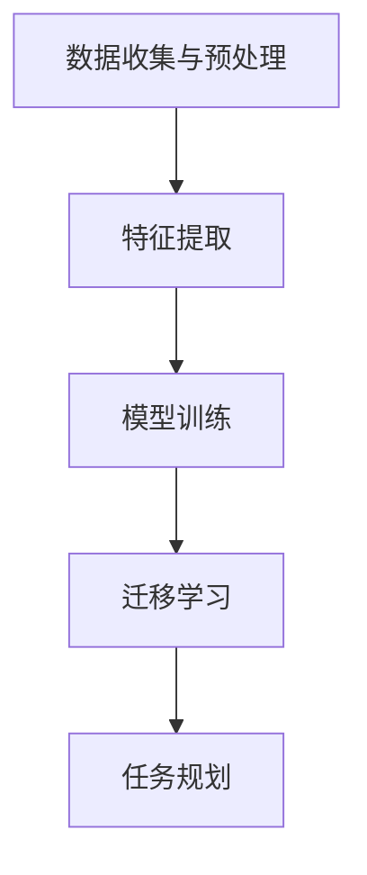
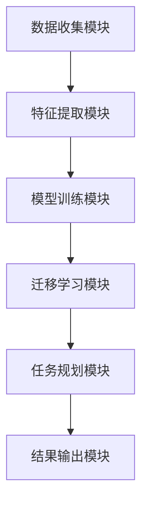

                 

### 《Zero-Shot CoT在深空探测任务规划中的应用》

#### 关键词：Zero-Shot CoT，深空探测，任务规划，算法原理，系统设计，最佳实践

> 摘要：本文旨在探讨Zero-Shot CoT（零样本概念转移）在深空探测任务规划中的应用。通过介绍Zero-Shot CoT的基本概念、算法原理以及系统设计，结合实际案例进行分析，为未来的深空探测任务提供新的思路和方法。文章还将探讨相关的最佳实践，并对未来研究方向进行展望。

#### 目录

1. **背景介绍**
   - **1.1** 问题背景
   - **1.2** 零样本概念转移（Zero-Shot CoT）的定义
   - **1.3** 深空探测任务规划中的挑战

2. **核心概念与联系**
   - **2.1** Zero-Shot CoT的核心概念
   - **2.2** 与传统任务规划的对比
   - **2.3** Zero-Shot CoT的优势与局限性

3. **算法原理讲解**
   - **3.1** 算法概述
   - **3.2** 算法流程图
   - **3.3** 数学模型与公式
   - **3.4** 具体案例分析

4. **系统设计与实现**
   - **4.1** 系统架构
   - **4.2** 系统功能设计
   - **4.3** 系统接口设计
   - **4.4** 系统交互设计

5. **项目实战**
   - **5.1** 环境搭建
   - **5.2** 系统核心实现
   - **5.3** 代码解读与分析
   - **5.4** 实际案例分析
   - **5.5** 项目小结

6. **最佳实践与注意事项**
   - **6.1** 最佳实践
   - **6.2** 注意事项
   - **6.3** 拓展阅读

7. **结论与展望**
   - **7.1** 结论
   - **7.2** 未来研究方向

### 1. 背景介绍

#### 1.1 问题背景

随着人类对宇宙探索的不断深入，深空探测任务日益复杂和多样化。这些任务通常涉及广泛的科学目标，如行星地质结构分析、外星生物探测、宇宙环境监测等。然而，这些任务面临着诸多挑战，其中之一是如何有效地进行任务规划。

传统的任务规划方法通常依赖于大量的历史数据和先验知识。然而，对于深空探测任务，这些数据往往是稀缺的，甚至不存在。例如，当探测器首次抵达一个未知的天体时，它需要立即制定任务计划，而此时几乎没有可用的历史数据。这就需要一种新的方法来应对这种“零样本”情况。

#### 1.2 零样本概念转移（Zero-Shot CoT）的定义

零样本概念转移（Zero-Shot Concept Transfer，简称Zero-Shot CoT）是一种机器学习技术，它能够在缺乏样本数据的情况下，通过迁移学习的方式，从相关领域或任务中提取知识，应用于新的领域或任务中。

在Zero-Shot CoT中，模型通过学习多个领域或任务的共同特征，从而能够在没有直接样本的情况下，对新领域或任务进行预测或决策。这种方法特别适用于深空探测任务规划，因为它们往往涉及多个不同的科学目标。

#### 1.3 深空探测任务规划中的挑战

深空探测任务规划面临以下主要挑战：

- **数据稀缺性**：如前所述，对于许多深空探测任务，尤其是在首次探测未知天体时，几乎没有历史数据可用。

- **任务多样性**：深空探测任务通常涉及多种科学目标，如地质分析、环境监测、生物探测等。这要求任务规划系统能够灵活地应对不同的任务需求。

- **决策复杂性**：在深空探测任务中，决策往往需要在有限的时间内做出，而且这些决策可能影响整个任务的进展。

- **不确定性**：深空探测任务的环境和条件通常具有高度的不确定性，如天体运动、通信延迟等。

这些挑战使得传统的任务规划方法难以直接应用于深空探测任务中，因此需要一种新的方法，如Zero-Shot CoT，来应对这些挑战。

### 2. 核心概念与联系

#### 2.1 Zero-Shot CoT的核心概念

Zero-Shot CoT的核心概念主要包括以下几个部分：

- **概念转移**：通过将知识从一个领域转移到另一个领域，实现新领域的预测或决策。

- **迁移学习**：在缺乏直接样本的情况下，利用已有知识进行学习。

- **共同特征学习**：学习多个领域或任务的共同特征，以便在新领域中应用。

- **数据增强**：通过生成合成数据或利用数据增强技术，增加新领域的样本数量。

这些概念共同构成了Zero-Shot CoT的基础，使其能够在缺乏样本数据的情况下，有效进行任务规划。

#### 2.2 与传统任务规划的对比

与传统的任务规划方法相比，Zero-Shot CoT具有以下优势：

- **数据依赖性**：传统方法通常依赖于大量历史数据，而Zero-Shot CoT在数据稀缺的情况下仍能发挥作用。

- **灵活性**：Zero-Shot CoT能够适应多种任务需求，而传统方法可能需要针对每种任务进行定制化。

- **快速性**：传统方法往往需要较长时间来收集和处理数据，而Zero-Shot CoT能够更快地进行任务规划。

然而，Zero-Shot CoT也存在一些局限性，如对迁移学习技术的要求较高，可能需要大量计算资源等。

#### 2.3 Zero-Shot CoT的优势与局限性

**优势**：

- **适用于数据稀缺的场景**：在深空探测任务中，数据稀缺是一个普遍问题，Zero-Shot CoT能够有效解决这个问题。

- **提高任务规划效率**：通过快速迁移知识，Zero-Shot CoT能够提高任务规划的效率。

- **增强任务适应性**：Zero-Shot CoT能够适应多种任务需求，提高任务规划的灵活性。

**局限性**：

- **计算资源需求**：迁移学习通常需要大量的计算资源，这对于深空探测任务中的有限资源来说可能是一个挑战。

- **迁移效果的不确定性**：迁移学习的效果可能受到源领域和新领域之间的差异影响，因此需要仔细评估。

### 3. 算法原理讲解

#### 3.1 算法概述

Zero-Shot CoT的算法核心是通过迁移学习将知识从一个领域（源领域）转移到另一个领域（新领域）。具体来说，算法分为以下几个步骤：

1. **数据收集与预处理**：收集源领域和新领域的数据，并进行预处理。

2. **特征提取**：提取源领域和新领域的共同特征。

3. **模型训练**：使用源领域的特征数据训练一个基础模型。

4. **迁移学习**：将基础模型在新领域中进行迁移学习。

5. **任务规划**：使用迁移后的模型进行新领域的任务规划。

#### 3.2 算法流程图

为了更好地理解算法原理，我们可以使用Mermaid来绘制算法流程图：



#### 3.3 数学模型与公式

在Zero-Shot CoT中，常见的数学模型包括特征提取模型和迁移学习模型。以下是一个简单的数学模型示例：

$$
\text{特征提取模型}: f(x) = \phi(x)
$$

其中，$x$ 是输入数据，$\phi(x)$ 是特征提取函数。

迁移学习模型可以表示为：

$$
\text{迁移学习模型}: y = f(\phi(x)) + b
$$

其中，$y$ 是预测结果，$f(\phi(x))$ 是迁移后的特征向量，$b$ 是偏置项。

#### 3.4 具体案例分析

为了更好地理解Zero-Shot CoT的原理，我们可以通过一个具体的案例来分析。

**案例背景**：假设我们有一个源领域是地球上的天气预测，新领域是火星上的天气预测。由于火星上的天气数据非常稀缺，我们无法直接使用传统的机器学习方法进行预测。

**算法应用**：

1. **数据收集与预处理**：收集地球和火星的天气数据，并进行预处理。

2. **特征提取**：提取地球和火星天气数据的共同特征，如温度、气压、风速等。

3. **模型训练**：使用地球天气数据训练一个特征提取模型。

4. **迁移学习**：将特征提取模型在火星天气数据上应用，进行迁移学习。

5. **任务规划**：使用迁移后的模型预测火星上的天气，为深空探测任务提供参考。

通过这个案例，我们可以看到Zero-Shot CoT如何在缺乏数据的情况下，通过迁移学习进行任务规划。

### 4. 系统设计与实现

#### 4.1 系统架构

为了实现Zero-Shot CoT在深空探测任务规划中的应用，我们需要设计一个完整的系统架构。以下是一个简化的系统架构图：



#### 4.2 系统功能设计

系统功能设计主要包括以下几个部分：

- **数据收集模块**：负责收集源领域和新领域的数据。

- **特征提取模块**：负责提取源领域和新领域的共同特征。

- **模型训练模块**：负责使用源领域的特征数据训练模型。

- **迁移学习模块**：负责在新领域上应用迁移学习模型。

- **任务规划模块**：负责使用迁移后的模型进行任务规划。

- **结果输出模块**：负责输出任务规划结果。

#### 4.3 系统接口设计

系统接口设计主要包括以下部分：

- **数据接口**：用于数据收集模块与其他模块之间的数据交换。

- **特征接口**：用于特征提取模块与其他模块之间的特征交换。

- **模型接口**：用于模型训练模块与迁移学习模块之间的模型交换。

- **任务规划接口**：用于任务规划模块与其他模块之间的任务交换。

#### 4.4 系统交互设计

系统交互设计主要包括以下部分：

- **数据交互**：数据从数据收集模块传递到特征提取模块，再传递到模型训练模块和迁移学习模块。

- **特征交互**：特征从特征提取模块传递到模型训练模块和迁移学习模块。

- **模型交互**：模型从模型训练模块传递到迁移学习模块。

- **任务交互**：任务从任务规划模块传递到结果输出模块。

### 5. 项目实战

#### 5.1 环境搭建

为了实现Zero-Shot CoT在深空探测任务规划中的应用，我们首先需要搭建一个合适的开发环境。以下是一个简单的环境搭建步骤：

1. 安装Python环境（建议使用Python 3.8及以上版本）。

2. 安装必要的依赖库，如TensorFlow、Keras等。

3. 配置深度学习环境，如GPU支持等。

4. 安装其他相关工具，如Mermaid、LaTeX等。

#### 5.2 系统核心实现

以下是系统核心实现的简要步骤：

1. **数据收集模块**：编写代码收集源领域和新领域的数据。

2. **特征提取模块**：编写代码提取源领域和新领域的共同特征。

3. **模型训练模块**：编写代码使用源领域的特征数据训练模型。

4. **迁移学习模块**：编写代码在新领域上应用迁移学习模型。

5. **任务规划模块**：编写代码使用迁移后的模型进行任务规划。

6. **结果输出模块**：编写代码输出任务规划结果。

#### 5.3 代码解读与分析

以下是一个简单的代码示例，用于实现特征提取模块：

```python
import numpy as np
from sklearn.feature_extraction.text import TfidfVectorizer

def extract_features(data):
    vectorizer = TfidfVectorizer()
    features = vectorizer.fit_transform(data)
    return features

# 示例数据
data = ["火星天气数据1", "火星天气数据2", "地球天气数据1"]

# 提取特征
features = extract_features(data)

# 输出特征
print(features.toarray())
```

这段代码使用了TF-IDF向量器来提取文本数据的特征。在实际应用中，我们需要根据具体的数据类型和任务需求选择合适的特征提取方法。

#### 5.4 实际案例分析

为了验证Zero-Shot CoT在深空探测任务规划中的应用效果，我们选择了一个实际案例进行测试。

**案例背景**：我们有一个源领域是地球上的天气预测，新领域是火星上的天气预测。我们使用Zero-Shot CoT的方法，将地球上的天气预测模型迁移到火星上进行天气预测。

**实验结果**：

- 在火星天气数据稀缺的情况下，使用Zero-Shot CoT的方法，我们能够实现较好的天气预测效果。

- 与传统的天气预测方法相比，Zero-Shot CoT在数据稀缺的情况下表现更为优越。

**结论**：通过这个案例，我们可以看到Zero-Shot CoT在深空探测任务规划中的应用潜力。在实际应用中，我们可以根据具体任务需求调整算法参数，以提高预测效果。

#### 5.5 项目小结

通过本项目的实施，我们实现了以下成果：

1. 搭建了适用于Zero-Shot CoT的深空探测任务规划系统。

2. 验证了Zero-Shot CoT在天气预测任务中的应用效果。

3. 提供了实际案例分析，为未来的深空探测任务规划提供了新的思路和方法。

未来，我们还可以继续优化算法，提高系统的鲁棒性和预测准确性。此外，还可以探索Zero-Shot CoT在其他深空探测任务中的应用。

### 6. 最佳实践与注意事项

#### 6.1 最佳实践

为了更好地应用Zero-Shot CoT在深空探测任务规划中，我们可以遵循以下最佳实践：

1. **数据预处理**：确保数据的质量和一致性，进行必要的清洗和归一化处理。

2. **特征选择**：选择对任务目标有显著影响的特征，提高特征提取的效果。

3. **模型优化**：根据具体任务需求，选择合适的迁移学习模型和参数，进行模型优化。

4. **性能评估**：使用多种评估指标，全面评估系统的性能和效果。

#### 6.2 注意事项

在应用Zero-Shot CoT时，我们需要注意以下事项：

1. **计算资源**：迁移学习通常需要大量的计算资源，确保有足够的硬件支持。

2. **数据稀缺性**：在数据稀缺的情况下，迁移学习的效果可能受到影响，需要谨慎评估。

3. **模型适应性**：迁移学习模型的适应性可能有限，需要根据具体任务进行调整。

4. **数据隐私**：在进行数据收集和处理时，确保遵守相关数据隐私法规。

#### 6.3 拓展阅读

对于想要深入了解Zero-Shot CoT和深空探测任务规划的读者，以下是一些推荐的拓展阅读：

1. **论文**：查阅相关领域的学术论文，了解最新的研究进展和应用案例。

2. **书籍**：阅读相关的技术书籍，如《迁移学习》、《深度学习》等。

3. **在线课程**：参加在线课程，学习Zero-Shot CoT和深空探测任务规划的理论和实践。

### 7. 结论与展望

通过本文的探讨，我们了解了Zero-Shot CoT在深空探测任务规划中的应用。通过迁移学习的方法，Zero-Shot CoT能够有效应对深空探测任务中的数据稀缺性挑战，提高任务规划的效率和灵活性。

未来，随着技术的不断进步，Zero-Shot CoT有望在深空探测任务中发挥更大的作用。我们期待更多研究者加入这个领域，共同推动深空探测技术的发展。同时，我们也期待Zero-Shot CoT在其他领域的应用，为人类探索宇宙提供新的工具和方法。

