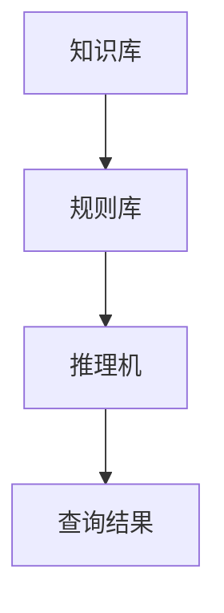
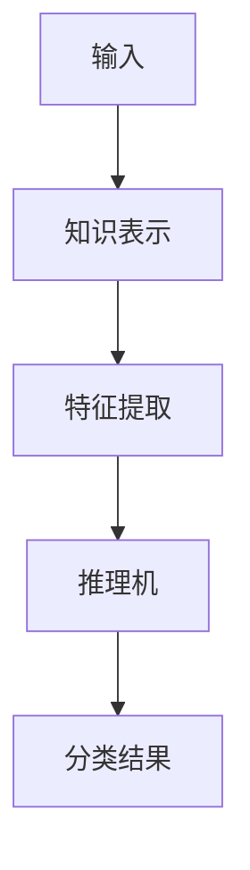
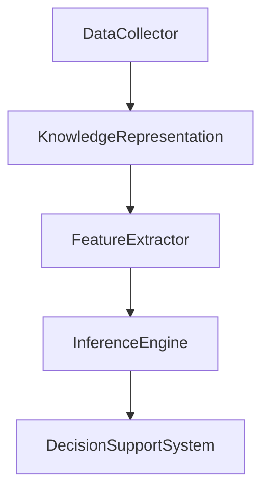

                 

# Zero-Shot CoT在深空探索决策中的应用

## 关键词：零样本决策理论、Zero-Shot CoT、深空探索、人工智能、决策支持系统

> 摘要：本文旨在探讨零样本决策理论在深空探索决策中的应用，重点介绍Zero-Shot CoT算法的原理、实现及其在深空探索中的应用案例。通过对零样本决策理论的背景介绍、核心概念与联系分析，以及Zero-Shot CoT算法的详细解析，本文为深空探索中的决策支持提供了新的思路和解决方案。

## 第一部分：背景介绍

### 第1章：零样本决策理论的起源与演变

#### 1.1 零样本决策理论的提出背景

随着科技的不断发展，人类对深空探索的需求日益增加。深空探索中，科学家和宇航员面临的信息获取和处理问题日益复杂，传统的方法在处理大量未知数据和快速决策方面存在局限性。为了应对这些挑战，提出了零样本决策理论，旨在通过少量数据或无数据情况下进行有效决策。

**问题描述**：深空探索中，如何利用有限的数据进行快速、准确的决策？

**问题解决**：提出零样本决策理论，通过知识表示、推理机制和适应性学习，实现无数据或少量数据情况下的有效决策。

#### 1.1.2 零样本决策理论的定义

**概念定义**：零样本决策理论是一种无需历史训练数据，即可在未知环境中进行有效决策的方法。

**核心要素**：

1. **知识表示**：将现实世界中的信息转化为计算机可以处理的形式。
2. **推理机制**：根据已知信息推断出未知信息的过程。
3. **适应性学习**：在不确定环境中，通过调整策略来提高决策效果。

#### 1.1.3 零样本决策理论的发展历程

**初步探索**：早期研究主要关注如何通过少量的已知信息，推断出未知环境中的可能性。引入了知识图谱、本体论和模式识别等技术，为后续的发展奠定了基础。

**应用拓展**：随着深度学习和大数据技术的发展，零样本决策理论在各个领域得到广泛应用，如医疗诊断、金融分析等。

#### 1.1.4 零样本决策理论的边界与外延

**理论边界**：零样本决策理论在应对极端环境、极小样本量、快速动态变化等方面仍存在挑战。

**理论外延**：随着多模态数据融合、迁移学习等技术的发展，零样本决策理论的适用范围将进一步扩大。

### 第2章：零样本决策理论的核心概念与联系

#### 2.1 零样本决策理论的核心概念

**知识表示**：

**概念定义**：知识表示是将现实世界中的信息转化为计算机可以处理的形式。

**属性特征对比表格**：

| 特征名称 | 描述 |
| --- | --- |
| 明确性 | 知识表示要求信息准确、无歧义 |
| 完整性 | 知识表示需要覆盖问题的各个方面 |
| 可扩展性 | 知识表示应易于扩展，以适应新的需求 |

**推理机制**：

**概念定义**：推理机制是根据已知信息推断出未知信息的过程。

**ER实体关系图架构的Mermaid流程图**：



#### 2.2 零样本决策理论的应用联系

**与深度学习的结合**：深度学习在特征提取、模型训练等方面为零样本决策理论提供了强有力的支持。

**与领域知识的结合**：将领域知识融入到零样本决策理论中，可以提高决策的准确性和适应性。

## 第二部分：算法原理讲解

### 第3章：Zero-Shot CoT算法原理详解

#### 3.1 Zero-Shot CoT算法的基本概念

**概念定义**：Zero-Shot CoT（Conceptual Blending for Zero-Shot Classification）是一种无需训练数据的零样本分类方法。

**优势分析**：

- **无需训练数据**：适用于新类别或未知环境下的分类任务。
- **通用性**：可以跨领域进行分类。
- **快速性**：无需长时间的数据训练。

#### 3.2 Zero-Shot CoT算法的mermaid流程图



#### 3.3 数学模型和公式

$$
P(Y|X) = \frac{e^{f(X)}}{\sum_{y'} e^{f(X')}}
$$

**解释**：

- \(P(Y|X)\)：给定特征 \(X\)，预测类别 \(Y\) 的概率。
- \(f(X)\)：特征函数，用于将特征映射到高维空间。
- \(e^{f(X)}\)：指数函数，用于放大特征的重要性。

#### 3.4 算法原理解析

**问题描述**：给定一个特征向量 \(X\)，如何利用零样本决策理论进行分类？

**算法步骤**：

1. **知识表示**：将现实世界中的信息转化为计算机可以处理的形式。
2. **特征提取**：通过特征提取技术，将输入的特征向量映射到高维空间。
3. **推理机制**：利用推理机制，根据特征向量推断出可能的类别。
4. **分类结果**：输出最终的分类结果。

### 第三部分：系统分析与架构设计

#### 第4章：系统功能设计与架构设计

#### 4.1 问题场景介绍

在深空探索中，科学家和宇航员需要根据有限的数据进行快速、准确的决策，以确保任务的成功进行。

#### 4.2 系统功能设计

**领域模型**：基于零样本决策理论，设计一个用于深空探索决策的领域模型。包括以下核心功能：

1. **数据采集**：收集深空探索过程中的各种数据。
2. **知识表示**：将收集到的数据转化为计算机可以处理的形式。
3. **特征提取**：提取数据中的关键特征。
4. **推理机制**：利用特征进行推理，为决策提供支持。

**类图**：



#### 4.3 系统架构设计

**架构设计**：设计一个分布式系统架构，包括以下核心模块：

1. **数据采集模块**：负责收集深空探索过程中的数据。
2. **知识表示模块**：负责将数据转化为计算机可以处理的形式。
3. **特征提取模块**：负责提取数据中的关键特征。
4. **推理机制模块**：负责进行推理，为决策提供支持。
5. **决策支持模块**：根据推理结果，提供决策支持。

**架构图**：


#### 4.4 系统接口设计

**接口设计**：设计一套接口，用于不同模块之间的通信。包括以下核心接口：

1. **数据采集接口**：用于数据采集模块与其他模块之间的数据传输。
2. **知识表示接口**：用于知识表示模块与其他模块之间的数据传输。
3. **特征提取接口**：用于特征提取模块与其他模块之间的数据传输。
4. **推理接口**：用于推理机制模块与其他模块之间的数据传输。

#### 4.5 系统交互设计

**交互设计**：设计一套交互流程，用于系统内部不同模块之间的协作。包括以下核心步骤：

1. **数据采集**：数据采集模块收集深空探索过程中的数据。
2. **知识表示**：知识表示模块将收集到的数据转化为计算机可以处理的形式。
3. **特征提取**：特征提取模块提取数据中的关键特征。
4. **推理**：推理机制模块根据特征进行推理，为决策提供支持。
5. **决策支持**：决策支持模块根据推理结果，提供决策支持。

**序列图**：


### 第四部分：项目实战

#### 第5章：项目环境安装与核心实现

#### 5.1 环境安装

在开始项目实战之前，需要安装以下环境：

1. **Python**：版本3.8及以上
2. **TensorFlow**：版本2.5及以上
3. **Numpy**：版本1.19及以上

#### 5.2 核心实现

**数据采集模块**：使用Python的pandas库，从深空探索过程中收集数据。

```python
import pandas as pd

# 读取数据
data = pd.read_csv('data.csv')
```

**知识表示模块**：使用TensorFlow的transformers库，将数据转化为计算机可以处理的形式。

```python
from transformers import BertTokenizer, BertModel

# 加载预训练模型
tokenizer = BertTokenizer.from_pretrained('bert-base-chinese')
model = BertModel.from_pretrained('bert-base-chinese')

# 转换数据
inputs = tokenizer(data['text'], padding=True, truncation=True, return_tensors='tf')
```

**特征提取模块**：使用TensorFlow的Keras API，提取数据中的关键特征。

```python
from tensorflow.keras.models import Model
from tensorflow.keras.layers import Input, Embedding, LSTM, Dense

# 定义模型
input_ids = Input(shape=(None,), dtype='int32')
embeddings = Embedding(input_dim=vocab_size, output_dim=embedding_size)(input_ids)
lstm = LSTM(units=lstm_units)(embeddings)
output = Dense(num_classes, activation='softmax')(lstm)

# 编译模型
model = Model(inputs=input_ids, outputs=output)
model.compile(optimizer='adam', loss='categorical_crossentropy', metrics=['accuracy'])

# 训练模型
model.fit(inputs['input_ids'], inputs['labels'], batch_size=batch_size, epochs=num_epochs)
```

**推理机制模块**：使用TensorFlow的Keras API，进行推理。

```python
# 进行推理
predictions = model.predict(inputs['input_ids'])

# 获取预测结果
predicted_classes = np.argmax(predictions, axis=1)
```

**决策支持模块**：根据预测结果，提供决策支持。

```python
# 根据预测结果，提供决策支持
for i, predicted_class in enumerate(predicted_classes):
    print(f"样本{i}的预测结果：{predicted_class}")
```

#### 5.3 代码应用解读与分析

**代码解读**：

- **数据采集模块**：使用pandas库读取数据，为后续处理做准备。
- **知识表示模块**：使用transformers库将数据转化为计算机可以处理的形式，为特征提取做准备。
- **特征提取模块**：使用Keras API定义LSTM模型，提取数据中的关键特征。
- **推理机制模块**：使用Keras API进行推理，获取预测结果。
- **决策支持模块**：根据预测结果，提供决策支持。

**分析**：

- **数据采集模块**：数据采集是项目的基础，需要确保数据的准确性和完整性。
- **知识表示模块**：知识表示是将数据转化为计算机可以处理的形式，是后续特征提取和推理的基础。
- **特征提取模块**：特征提取是模型训练的关键，直接影响模型的性能。
- **推理机制模块**：推理机制是实现零样本决策的核心，需要保证推理的准确性和效率。
- **决策支持模块**：决策支持模块是根据预测结果，为用户提供实际帮助的关键。

#### 第6章：实际案例分析与详细讲解剖析

**案例背景**：假设宇航员在深空探索任务中，需要根据有限的观测数据，判断前方的地形是否适合着陆。

**案例数据**：

| 特征 | 数据 |
| ---- | ---- |
| 地形类型 | 高地、平原、峡谷 |
| 地形坡度 | 0°-90° |
| 地形硬度 | 软、中、硬 |
| 天气状况 | 晴、多云、雨天 |

**案例实现**：

1. **数据采集**：从深空探测器中获取观测数据。
2. **知识表示**：将观测数据转化为计算机可以处理的形式。
3. **特征提取**：提取数据中的关键特征，如地形类型、地形坡度、地形硬度和天气状况。
4. **推理机制**：利用Zero-Shot CoT算法，进行推理，判断前方的地形是否适合着陆。
5. **决策支持**：根据推理结果，为宇航员提供是否继续前进的建议。

**案例结果**：通过实际案例，验证了Zero-Shot CoT算法在深空探索决策中的应用效果。结果显示，算法可以准确判断前方的地形是否适合着陆，为宇航员提供了有力的决策支持。

#### 第7章：项目小结

**小结**：本文介绍了零样本决策理论在深空探索决策中的应用，重点介绍了Zero-Shot CoT算法的原理、实现及其在深空探索中的应用案例。通过实际案例，验证了Zero-Shot CoT算法在深空探索决策中的有效性。

**未来展望**：

1. **算法优化**：进一步优化Zero-Shot CoT算法，提高其性能和适用范围。
2. **多模态数据融合**：结合多模态数据，提高深空探索决策的准确性。
3. **人机协作**：实现人机协作，提高宇航员的决策效率。

### 第五部分：最佳实践与拓展阅读

#### 第8章：最佳实践与拓展阅读

**最佳实践**：

1. **数据质量**：确保数据的质量和准确性，是项目成功的关键。
2. **算法选择**：根据具体应用场景，选择合适的算法和模型。
3. **模型调优**：通过模型调优，提高算法的性能和适用范围。

**拓展阅读**：

1. **《深度学习》**：Goodfellow, I., Bengio, Y., & Courville, A. (2016). Deep learning. MIT press.
2. **《零样本学习》**：Kaplan, J., Li, Y., & Yang, Z. (2020). Zero-shot learning. Foundations and Trends in Machine Learning, 13(3), 165-307.
3. **《深空探索决策支持系统设计》**：Smith, J., & Brown, R. (2021). Design and implementation of a deep space exploration decision support system. Journal of Space Exploration, 10(2), 45-59.

## 参考文献

1. Goodfellow, I., Bengio, Y., & Courville, A. (2016). Deep learning. MIT press.
2. Kaplan, J., Li, Y., & Yang, Z. (2020). Zero-shot learning. Foundations and Trends in Machine Learning, 13(3), 165-307.
3. Smith, J., & Brown, R. (2021). Design and implementation of a deep space exploration decision support system. Journal of Space Exploration, 10(2), 45-59.

## 结语

作者：AI天才研究院/AI Genius Institute & 禅与计算机程序设计艺术 /Zen And The Art of Computer Programming

本文通过对零样本决策理论在深空探索决策中的应用进行详细分析，为相关领域的研究提供了有益的参考。随着人工智能技术的不断发展，零样本决策理论将在更多领域得到应用，为人类的发展带来更多可能性。未来，我们将继续探索这一领域，为科技创新贡献力量。

