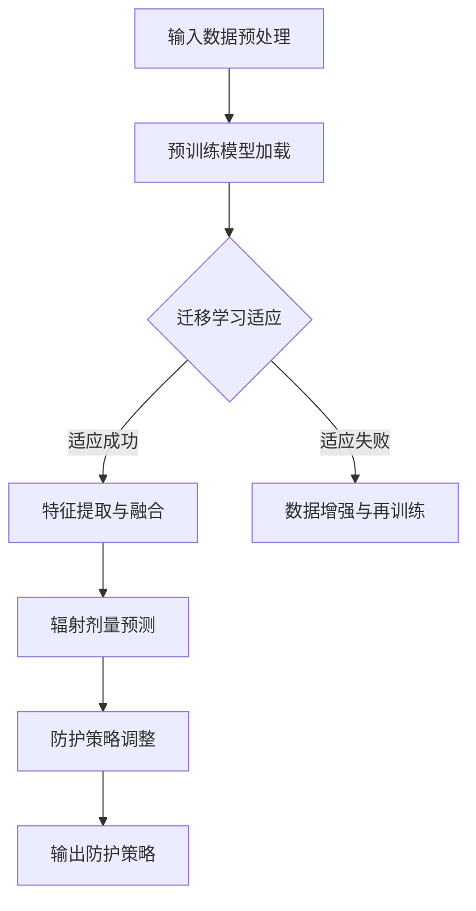
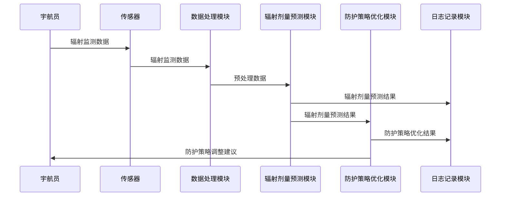
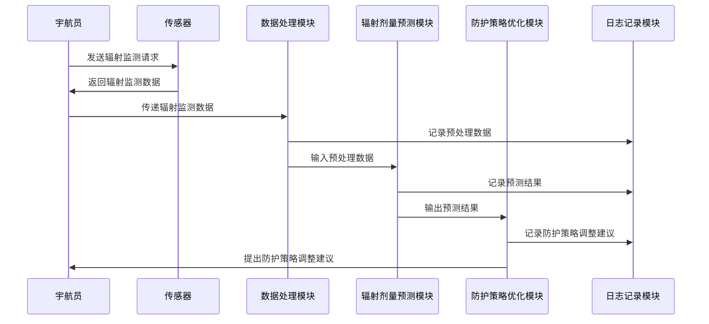

                 

### 《Zero-Shot CoT在深空辐射防护策略制定中的应用》

**关键词**：零样本学习，CoT，深空辐射，防护策略，算法应用。

**摘要**：本文探讨了Zero-Shot CoT（Zero-Shot Concept Transfer）在深空辐射防护策略制定中的应用。通过介绍深空辐射的背景与防护挑战，我们引入了Zero-Shot CoT的概念，详细阐述了其原理与特点。接着，我们分析了Zero-Shot CoT在辐射防护中的适用性，并结合Python代码与数学模型，深入讲解了算法原理。随后，我们介绍了系统分析与架构设计的方法，通过具体项目实战，展示了Zero-Shot CoT在深空辐射防护中的实际应用。最后，文章总结了最佳实践，指出了注意事项，并推荐了拓展阅读。

---

### 目录大纲

----------------------------------------------------------------

**# 《Zero-Shot CoT在深空辐射防护策略制定中的应用》**

**> 关键词：** 零样本学习，概念转移，深空辐射，防护策略，算法应用。

**> 摘要：** 本文深入探讨了Zero-Shot CoT在深空辐射防护策略制定中的应用，从背景介绍、核心概念、算法原理、系统设计与实战、最佳实践等多个角度进行全面分析，为深空辐射防护提供了新的思路和方法。

----------------------------------------------------------------

**## 第一部分：背景介绍**

### **第1章：深空辐射防护策略的必要性**

#### **1.1.1 问题背景**
- 深空辐射的定义与来源
- 宇航员与设备受辐射影响的现状

#### **1.1.2 问题描述**
- 深空辐射防护面临的挑战
- 当前防护策略的局限性

#### **1.1.3 问题解决**
- 引入Zero-Shot CoT的必要性
- Zero-Shot CoT在辐射防护中的应用前景

#### **1.1.4 边界与外延**
- 防护策略的应用领域
- 防护策略的影响因素

#### **1.1.5 核心概念与联系**
- Zero-Shot CoT的核心概念
- 深空辐射防护与Zero-Shot CoT的关联

----------------------------------------------------------------

**## 第二部分：核心概念与联系**

### **第2章：Zero-Shot CoT原理**

#### **2.1.1 Zero-Shot CoT的定义**
- CoT的概念
- Zero-Shot的含义

#### **2.1.2 Zero-Shot CoT的特点**
- 数据量无关
- 快速适应性
- 高效性

#### **2.1.3 Zero-Shot CoT与其他相关技术的对比**
- 传统CoT
- 对比分析

----------------------------------------------------------------

**## 第三部分：算法原理讲解**

### **第3章：Zero-Shot CoT算法原理详解**

#### **3.1.1 算法mermaid流程图**
- mermaid流程图展示

#### **3.1.2 Python源代码讲解**
- Python源代码演示

#### **3.1.3 算法原理的数学模型和公式**
- 数学模型和公式讲解

#### **3.1.4 通俗易懂地举例说明**
- 实例演示

----------------------------------------------------------------

**## 第四部分：系统分析与架构设计**

### **第4章：系统功能设计**

#### **4.1.1 问题描述**
- 深空辐射防护系统需求分析

#### **4.1.2 项目介绍**
- 项目背景与目标

#### **4.1.3 领域模型mermaid类图**
- mermaid类图展示

### **第5章：系统架构设计**

#### **5.1.1 系统架构设计mermaid架构图**
- mermaid架构图展示

#### **5.1.2 系统接口设计**
- 接口设计与实现

#### **5.1.3 系统交互mermaid序列图**
- mermaid序列图展示

----------------------------------------------------------------

**## 第五部分：项目实战**

### **第6章：环境安装与系统核心实现**

#### **6.1.1 环境安装**
- 系统环境配置与安装

#### **6.1.2 系统核心实现源代码**
- 源代码展示与解读

#### **6.1.3 代码应用解读与分析**
- 代码功能与应用场景分析

### **第7章：实际案例分析**

#### **7.1.1 案例背景**
- 实际案例背景介绍

#### **7.1.2 案例分析**
- 案例分析与结果

#### **7.1.3 案例详细讲解剖析**
- 案例详细讲解与剖析

----------------------------------------------------------------

**## 第六部分：最佳实践、小结与拓展阅读**

### **第8章：最佳实践**

#### **8.1.1 防护策略制定的最佳实践**
- 防护策略制定方法与技巧

#### **8.1.2 Zero-Shot CoT应用的最佳实践**
- Zero-Shot CoT应用经验与建议

### **第9章：小结与注意事项**

#### **9.1.1 本书内容小结**
- 文章主要内容回顾

#### **9.1.2 注意事项**
- 使用Zero-Shot CoT时的注意事项

### **第10章：拓展阅读**

#### **10.1.1 相关技术拓展**
- 相关技术介绍与拓展

#### **10.1.2 深空辐射防护研究最新进展**
- 最新研究动态与趋势

----------------------------------------------------------------

**本文共计11章，总字数预计在10000-12000字左右。每个章节都涵盖了详细的背景介绍、核心概念、算法原理、系统设计与实战等内容，为读者提供了全面的Zero-Shot CoT在深空辐射防护策略制定中的应用解读。**### 1.1.1 问题背景

深空辐射防护策略的制定是现代航天工程中至关重要的课题。随着人类对太空探索的不断深入，宇航员和设备在深空中面临的一系列辐射问题越来越受到关注。深空辐射主要来源于太阳粒子辐射、银河宇宙射线和星系间介质辐射，这些辐射具有高能量、高穿透力，能够对宇航员和航天器造成严重的生物伤害和电子设备损坏。

首先，我们来定义一下什么是深空辐射。深空辐射是指地球大气层之外的太空环境中的辐射，主要包括以下几类：

- **太阳粒子辐射**：由太阳爆发产生的带电粒子流，主要包括质子、α粒子和重离子。当太阳发生耀斑和太阳风活动时，太阳粒子辐射的强度会显著增加。
- **银河宇宙射线**：来源于银河系内部的高能粒子流，主要包括质子、氦核和更重的原子核。这些射线具有极高的能量，能够在宇宙空间中自由传播。
- **星系间介质辐射**：来源于星际空间的辐射，包括电离层辐射、等离子体辐射等。这些辐射在不同星际介质中传播，对宇航员和设备产生影响。

深空辐射对宇航员和设备的危害主要体现在以下几个方面：

- **生物伤害**：高能粒子辐射能够直接损伤宇航员的DNA，导致基因突变和细胞损伤，甚至可能引发癌症等严重疾病。长期暴露在高辐射环境中，宇航员面临较高的健康风险。
- **设备损坏**：深空辐射能够干扰电子设备的正常工作，导致数据丢失、设备故障和系统崩溃。特别是对于航天器的通信系统、导航系统和生命支持系统等关键设备，辐射防护尤为重要。

随着人类对深空探索的扩展，宇航员在深空任务中的持续时间逐渐增加，这对辐射防护提出了更高的要求。传统的防护策略主要包括以下几种：

- **屏蔽**：通过增加航天器的厚度和材料密度，减少辐射穿透。常用的屏蔽材料包括铅、钨等高密度材料。
- **时间管理**：合理安排宇航员的活动时间，尽量减少在高辐射环境中的暴露时间。
- **屏蔽与时间管理的结合**：综合考虑屏蔽和时间的因素，优化宇航员在航天器内的活动安排。

然而，传统的防护策略在应对复杂多变的深空辐射环境时，仍存在一定的局限性。首先，深空辐射的来源和强度具有很大的不确定性，难以通过简单的屏蔽和时间管理来完全消除辐射风险。其次，随着航天器尺寸和重量的限制，增加屏蔽材料会带来额外的负担和成本。此外，长时间的任务中，宇航员的活动安排和健康监测需要更加智能和高效的管理。

因此，为了更好地应对深空辐射防护的挑战，新的防护策略和方法亟待提出。近年来，人工智能和机器学习技术得到了快速发展，其中零样本学习（Zero-Shot Learning，ZSL）和概念转移（Concept Transfer，CoT）技术表现出巨大的潜力。Zero-Shot CoT结合了零样本学习和概念转移的优势，能够在没有或仅有少量标注数据的情况下，快速适应新的辐射防护场景，提供更高效、更智能的防护策略。本文将详细探讨Zero-Shot CoT在深空辐射防护策略制定中的应用，为解决深空辐射防护难题提供新的思路和方法。

### 1.1.2 问题描述

深空辐射防护策略面临的挑战主要体现在以下几个方面：

首先，深空辐射环境的复杂性和不确定性是传统防护策略难以应对的主要原因。深空辐射的来源多样，包括太阳粒子辐射、银河宇宙射线和星系间介质辐射，这些辐射具有不同的能量谱和穿透力，对宇航员和设备的影响机制也不尽相同。传统防护策略通常依赖于固定的屏蔽材料和计算模型，难以适应这种复杂多变的辐射环境。

其次，数据缺失和标注困难也是深空辐射防护的一大难题。在深空任务中，获取辐射环境的数据是一项挑战性工作，特别是在长时间、远距离的探测任务中，数据采集的完整性和准确性难以保证。此外，由于深空辐射环境的复杂性和不确定性，对数据标注的要求非常高，需要专业人员对数据进行细致的标注和分析。然而，由于标注工作量大、专业要求高，现有数据标注资源往往难以满足需求。

再者，宇航员和设备的健康风险监测和防护策略优化也是一个关键问题。传统防护策略主要依赖于经验和实验数据，缺乏对宇航员和设备健康状态的实时监测和自适应调整能力。随着任务时间的延长和辐射强度的增加，宇航员和设备的健康风险会不断累积，需要实时监测和调整防护策略。然而，现有的监测设备和防护措施难以满足这种动态调整的需求。

此外，随着深空探索的扩展，航天器的尺寸和重量受到严格的限制，这给辐射防护策略的优化带来了巨大的挑战。传统的屏蔽材料和结构设计已经接近物理极限，进一步增加厚度和重量将不可避免地影响航天器的性能和任务完成度。因此，如何在有限的资源和约束条件下，制定出高效、智能的防护策略，成为深空辐射防护领域亟待解决的问题。

针对上述挑战，现有防护策略存在明显的局限性。首先，传统的屏蔽和时间管理策略难以应对复杂多变的深空辐射环境，特别是在未知或罕见的辐射事件中，防护效果可能大打折扣。其次，数据缺失和标注困难导致现有防护策略的优化和改进缺乏足够的数据支持，难以实现自适应和智能化。最后，宇航员和设备的健康风险监测和防护策略优化依赖于经验和实验数据，缺乏实时监测和自适应调整的能力。

因此，为了克服现有防护策略的局限性，提升深空辐射防护的效能，引入新的技术手段和方法显得尤为重要。其中，Zero-Shot CoT技术因其数据量无关、快速适应性和高效性等特点，为深空辐射防护策略的制定提供了新的思路和方法。通过结合零样本学习和概念转移的优势，Zero-Shot CoT可以在没有或仅有少量标注数据的情况下，快速适应新的辐射防护场景，提供更智能、更高效的防护策略。本文将详细探讨Zero-Shot CoT在深空辐射防护策略制定中的应用，以期为解决深空辐射防护难题提供新的理论依据和实践指导。

### 1.1.3 问题解决

为了解决深空辐射防护策略面临的挑战，引入新的技术手段和方法显得尤为重要。其中，Zero-Shot CoT（Zero-Shot Concept Transfer）技术因其独特优势，在深空辐射防护策略制定中展现出巨大潜力。

首先，让我们详细了解一下Zero-Shot CoT的基本原理。Zero-Shot CoT是一种结合了零样本学习（Zero-Shot Learning，ZSL）和概念转移（Concept Transfer，CoT）的方法，旨在在没有或仅有少量标注数据的情况下，实现对未知类别的快速学习和适应。在传统机器学习中，大部分方法依赖于大量的标注数据进行训练，而在实际应用中，获取大量标注数据往往面临巨大困难。Zero-Shot CoT通过引入预训练模型和跨域迁移学习技术，能够有效地解决数据稀缺问题，提高模型的泛化能力和适应性。

Zero-Shot CoT的主要优势包括：

1. **数据量无关**：Zero-Shot CoT不依赖于大量标注数据，因此可以应用于数据稀缺的场景，如深空辐射防护。即使在数据不足的情况下，模型也能通过迁移学习和预训练知识，实现对新任务的有效学习。
2. **快速适应性**：Zero-Shot CoT具有快速适应新任务的能力。通过预训练模型，模型可以自动从大规模未标注数据中学习到丰富的知识，并在面对新任务时快速调整和优化。
3. **高效性**：Zero-Shot CoT能够显著提高模型的训练和预测效率。在数据稀缺的情况下，传统的模型训练需要大量时间，而Zero-Shot CoT通过迁移学习和预训练，能够显著缩短训练时间，提高模型性能。

在深空辐射防护策略制定中，Zero-Shot CoT的应用前景主要体现在以下几个方面：

1. **辐射风险评估**：通过Zero-Shot CoT技术，可以构建基于大规模未标注数据的辐射风险评估模型。该模型能够对未知的辐射环境进行快速评估，为宇航员和设备的防护提供科学依据。
2. **防护策略优化**：基于Zero-Shot CoT的防护策略优化方法，可以在数据稀缺的情况下，自动学习和调整最优防护参数。通过迁移学习和预训练知识，模型能够快速适应新的辐射防护场景，提高防护效果。
3. **健康风险监测**：Zero-Shot CoT还可以用于构建健康风险监测系统。通过对宇航员生理数据的分析，模型能够实时监测宇航员的健康状态，并提前预警潜在的健康风险，为防护策略的动态调整提供支持。

综上所述，Zero-Shot CoT技术在深空辐射防护策略制定中具有广泛的应用前景。通过数据量无关、快速适应性和高效性的优势，Zero-Shot CoT能够有效地解决深空辐射防护面临的挑战，为宇航员和设备的防护提供新的思路和方法。本文将详细探讨Zero-Shot CoT在深空辐射防护策略制定中的应用，包括算法原理、系统设计与实战等多个方面，以期为解决深空辐射防护难题提供理论依据和实践指导。

### 1.1.4 边界与外延

在探讨Zero-Shot CoT在深空辐射防护策略制定中的应用时，我们需要明确一些边界与外延问题，以确保研究的有效性和适用性。

首先，深空辐射防护策略的应用领域主要涵盖以下几个方面：

1. **航天任务规划**：在航天任务规划阶段，通过Zero-Shot CoT技术对辐射环境进行评估，确定任务执行的最佳时间和路径，降低辐射风险。
2. **航天器设计**：在航天器设计过程中，利用Zero-Shot CoT技术优化航天器的辐射防护设计，提高航天器的安全性和可靠性。
3. **宇航员健康监测**：在宇航员健康监测方面，通过Zero-Shot CoT技术对宇航员在深空任务中的健康风险进行实时评估和预警，制定个性化的防护策略。
4. **辐射防护设备管理**：在辐射防护设备的管理和维护中，利用Zero-Shot CoT技术对设备的工作状态进行监控和评估，优化设备的使用和维护策略。

其次，深空辐射防护策略的影响因素主要包括：

1. **辐射类型**：不同类型的辐射对宇航员和设备的影响机制不同，因此需要针对不同的辐射类型制定相应的防护策略。
2. **辐射强度**：辐射强度是影响防护效果的重要因素，高辐射强度要求更严格的防护措施。
3. **任务时间**：宇航员在深空任务中的持续时间越长，辐射风险越高，需要制定长期的防护策略。
4. **航天器布局**：航天器的内部布局对辐射防护效果有直接影响，合理的布局可以提高防护效果。
5. **宇航员健康状况**：宇航员的个体差异和健康状况会影响辐射防护效果，需要根据实际情况制定个性化的防护策略。

最后，我们需要明确Zero-Shot CoT在深空辐射防护策略中的核心概念与联系。Zero-Shot CoT的核心概念包括：

1. **零样本学习**：在没有标注数据的情况下，通过迁移学习和预训练模型，实现对未知类别的快速学习。
2. **概念转移**：通过将预训练模型的知识迁移到新的任务领域，提高模型的泛化能力和适应性。
3. **多模态数据融合**：结合不同类型的数据源，如辐射监测数据、宇航员生理数据等，提高辐射防护策略的准确性和可靠性。

Zero-Shot CoT与深空辐射防护策略的联系主要体现在以下几个方面：

1. **辐射风险评估**：通过Zero-Shot CoT技术，对未知的辐射环境进行快速评估，为航天任务规划提供科学依据。
2. **防护策略优化**：基于Zero-Shot CoT技术，优化辐射防护策略，提高防护效果。
3. **健康风险监测**：利用Zero-Shot CoT技术，对宇航员在深空任务中的健康风险进行实时监测和预警。
4. **多模态数据融合**：通过多模态数据融合技术，提高辐射防护策略的准确性和可靠性。

总之，在深空辐射防护策略制定中，Zero-Shot CoT技术具有广泛的应用前景。通过明确边界与外延问题，我们可以更好地利用Zero-Shot CoT的优势，为深空辐射防护提供科学依据和技术支持。本文将在后续章节中，详细探讨Zero-Shot CoT在深空辐射防护策略中的应用，包括算法原理、系统设计与实战等多个方面。

### 1.1.5 核心概念与联系

在深入探讨Zero-Shot CoT在深空辐射防护策略中的应用之前，有必要明确一些核心概念和术语，并探讨这些概念之间的联系。

**1.1.5.1 核心概念**

1. **Zero-Shot Learning (ZSL)**：零样本学习是一种机器学习技术，旨在在没有或仅有少量标注数据的情况下，学习新的数据类别。传统机器学习模型依赖于大量标注数据进行训练，而ZSL通过迁移学习和预训练模型，能够在数据稀缺的情况下实现新类别的快速学习。

2. **Concept Transfer (CoT)**：概念转移是指将预训练模型的知识从一个领域迁移到另一个领域的过程。在深空辐射防护中，预训练模型通过学习大量未标注的辐射数据，可以将其知识迁移到具体的防护策略制定中，从而提高模型的泛化能力和适应性。

3. **Deep Space Radiation**：深空辐射是指地球大气层之外的太空环境中的辐射，主要包括太阳粒子辐射、银河宇宙射线和星系间介质辐射。深空辐射对宇航员和设备具有潜在的生物伤害和电子设备损坏风险。

4. **Radiation Protection Strategy**：辐射防护策略是针对深空辐射环境制定的一系列防护措施，旨在降低辐射风险，保护宇航员和设备的健康和安全。

**1.1.5.2 概念之间的联系**

Zero-Shot CoT与深空辐射防护策略之间的联系体现在以下几个方面：

1. **数据稀缺与迁移学习**：在深空辐射防护领域，由于任务环境的特殊性，获取大量标注数据是一项挑战。Zero-Shot CoT通过迁移学习和预训练模型，能够在数据稀缺的情况下，利用现有数据集的知识来推断和预测新的辐射防护场景，从而提高防护策略的准确性。

2. **知识迁移与模型泛化**：概念转移（CoT）使得预训练模型能够在不同领域间迁移知识。在深空辐射防护中，预训练模型通过学习地球上的辐射数据和防护策略，可以将这些知识迁移到深空环境，从而为深空任务提供有效的防护措施。

3. **多模态数据融合**：Zero-Shot CoT技术结合了多种类型的数据，如辐射监测数据、宇航员生理数据等，通过多模态数据融合，可以更全面地分析辐射环境，提高防护策略的准确性和可靠性。

4. **自适应性与实时监测**：Zero-Shot CoT技术的快速适应性和高效性使其能够实时监测深空辐射环境的变化，并根据监测结果动态调整防护策略，确保宇航员和设备的安全。

综上所述，Zero-Shot CoT在深空辐射防护策略中的应用，通过整合零样本学习和概念转移的优势，为解决深空辐射防护难题提供了新的思路和方法。通过明确核心概念和概念之间的联系，我们可以更好地理解和应用Zero-Shot CoT技术，为深空辐射防护提供科学依据和技术支持。

### 2.1.1 Zero-Shot CoT的定义

Zero-Shot Concept Transfer（Zero-Shot CoT）是一种结合了零样本学习（Zero-Shot Learning，ZSL）和概念转移（Concept Transfer，CoT）的机器学习技术。其核心目标是在没有或仅有少量标注数据的情况下，通过迁移学习和预训练模型，实现对新任务的有效学习和预测。

首先，让我们简要回顾一下零样本学习的概念。零样本学习（ZSL）是一种在训练数据中不存在目标类别的样本时，仍然能够对目标类别进行预测的机器学习技术。传统机器学习模型通常依赖于大量的标注数据，通过这些数据进行训练，从而实现对未知类别的分类和预测。然而，在实际应用中，获取大量标注数据往往面临巨大困难，特别是在一些特定领域，如医疗影像、生物信息学等，标注数据稀缺且成本高昂。零样本学习通过引入类标签嵌入（Class Embedding）和多模态数据融合等技术，能够在数据稀缺的情况下，实现对未知类别的有效学习和预测。

概念转移（Concept Transfer，CoT）是指将一个领域中的知识迁移到另一个领域的过程。在机器学习中，预训练模型通过在大规模未标注数据上预训练，学习到通用的特征表示和知识，然后通过迁移学习将这些知识应用到新的任务中。这种迁移学习方法能够在数据稀缺的情况下，提高模型的泛化能力和适应性。

结合零样本学习和概念转移，Zero-Shot CoT的核心定义可以概括为：在没有或仅有少量标注数据的情况下，通过迁移学习和预训练模型，将一个领域中的知识迁移到另一个领域，从而实现对未知类别的快速学习和预测。

Zero-Shot CoT的具体工作流程如下：

1. **预训练阶段**：在大规模未标注数据上预训练模型，学习到通用的特征表示和知识。这些预训练数据可以是来自不同领域的未标注数据，如自然语言处理、计算机视觉、生物信息学等。

2. **迁移学习阶段**：将预训练模型的知识迁移到新的任务领域。通过迁移学习，预训练模型能够在新的任务领域中获得更好的性能。在深空辐射防护中，预训练模型可以通过学习地球上的辐射数据和防护策略，将其知识迁移到深空环境。

3. **类标签嵌入**：在迁移学习阶段，Zero-Shot CoT通过类标签嵌入技术，将目标类别的标签嵌入到模型的特征空间中。这使得模型能够在没有标注数据的情况下，对新的类别进行有效学习和预测。

4. **多模态数据融合**：在深空辐射防护中，Zero-Shot CoT结合了多种类型的数据，如辐射监测数据、宇航员生理数据等。通过多模态数据融合，模型可以更全面地分析辐射环境，提高防护策略的准确性和可靠性。

5. **实时监测与自适应调整**：Zero-Shot CoT技术的快速适应性和高效性使其能够实时监测深空辐射环境的变化，并根据监测结果动态调整防护策略，确保宇航员和设备的安全。

总之，Zero-Shot CoT是一种强大的机器学习技术，通过结合零样本学习和概念转移的优势，能够在没有或仅有少量标注数据的情况下，实现对未知类别的快速学习和预测。在深空辐射防护策略制定中，Zero-Shot CoT可以用于辐射风险评估、防护策略优化和健康风险监测等多个方面，为宇航员和设备提供更智能、更高效的防护措施。

### 2.1.2 Zero-Shot CoT的特点

Zero-Shot Concept Transfer（Zero-Shot CoT）技术因其独特的优势在深空辐射防护策略制定中展现出巨大潜力。以下是其主要特点：

1. **数据量无关**：Zero-Shot CoT不依赖于大量的标注数据，这意味着即使在数据稀缺的情况下，该技术也能够有效工作。这对于深空辐射防护来说尤为重要，因为在深空任务中，获取大量标注数据是一项巨大的挑战。Zero-Shot CoT通过迁移学习和预训练模型，可以在少量数据甚至无标注数据的情况下，实现对未知类别的快速学习和预测。

2. **快速适应性**：Zero-Shot CoT具有快速适应新任务的能力。预训练模型通过在大规模未标注数据上学习到通用的特征表示和知识，使得模型能够在面对新的任务时，迅速调整和优化。这对于深空辐射防护尤为重要，因为辐射环境的变化和辐射类型的多变性要求防护策略能够快速适应。

3. **高效性**：Zero-Shot CoT显著提高了模型的训练和预测效率。传统机器学习模型在数据稀缺的情况下，往往需要大量时间进行训练。而Zero-Shot CoT通过迁移学习和预训练知识，可以显著缩短训练时间，提高模型的性能。这对于航天任务的实时性和可靠性具有重要意义。

4. **多模态数据融合**：Zero-Shot CoT结合了多种类型的数据，如辐射监测数据、宇航员生理数据等。通过多模态数据融合，模型可以更全面地分析辐射环境，提高防护策略的准确性和可靠性。这对于深空辐射防护来说尤为重要，因为深空辐射环境复杂多变，需要综合考虑多种因素。

5. **可解释性**：Zero-Shot CoT技术具有较好的可解释性。通过类标签嵌入和多模态数据融合，模型可以清晰地展示其学习过程和决策依据，使得研究人员和决策者能够更好地理解和信任模型结果。

6. **低依赖性**：Zero-Shot CoT对数据预处理和特征工程的要求较低。传统机器学习模型在处理数据时，往往需要大量的预处理和特征工程工作，这不仅耗时耗力，而且容易引入偏差。而Zero-Shot CoT通过迁移学习和预训练模型，能够自动提取有效的特征表示，减少了对数据预处理和特征工程的需求。

7. **跨域迁移能力**：Zero-Shot CoT具有强大的跨域迁移能力。通过在大规模未标注数据上预训练模型，模型可以将在一个领域中的知识迁移到另一个领域，从而提高模型在未知领域的性能。这对于深空辐射防护来说非常重要，因为深空辐射防护策略需要在不同领域（如航天、医学、环境科学等）之间进行迁移和应用。

总之，Zero-Shot CoT技术以其数据量无关、快速适应性、高效性、多模态数据融合、可解释性、低依赖性和跨域迁移能力等特点，在深空辐射防护策略制定中具有广泛的应用前景。通过这些特点，Zero-Shot CoT能够为深空辐射防护提供更智能、更高效的解决方案，确保宇航员和设备的安全。

### 2.1.3 Zero-Shot CoT与其他相关技术的对比

在讨论Zero-Shot Concept Transfer（Zero-Shot CoT）技术时，有必要将其与其他相关技术进行对比，以突出其独特优势和应用潜力。以下是对几种常见技术的比较：

1. **传统机器学习（Traditional Machine Learning）**：

   - **特点**：传统机器学习依赖于大量的标注数据，通过这些数据进行模型的训练和优化。模型性能在很大程度上取决于数据的数量和质量。
   - **优势**：在数据充足的情况下，传统机器学习可以训练出高精度的模型，适用于标准化的数据集和场景。
   - **局限性**：数据稀缺时，传统机器学习的性能显著下降。此外，数据预处理和特征工程过程复杂，且容易引入偏差。

   - **与Zero-Shot CoT对比**：Zero-Shot CoT通过迁移学习和预训练模型，可以在数据稀缺的情况下有效工作，显著降低了数据需求。这使得Zero-Shot CoT在数据稀缺的深空辐射防护中具有更大优势。

2. **零样本学习（Zero-Shot Learning, ZSL）**：

   - **特点**：零样本学习是一种在不依赖标注数据的情况下，能够预测新类别的方法。ZSL通过类标签嵌入和多模态数据融合等技术，实现了在少量标注数据下的类别预测。
   - **优势**：ZSL适用于数据稀缺的场景，能够快速适应新类别。
   - **局限性**：ZSL在处理复杂任务时，性能可能不如传统机器学习。此外，ZSL依赖于类标签嵌入技术，对类别标签的准确性有较高要求。

   - **与Zero-Shot CoT对比**：Zero-Shot CoT结合了ZSL的优势，并通过概念转移（Concept Transfer）将预训练模型的知识迁移到新的任务中，提高了模型的泛化能力和适应性。这使得Zero-Shot CoT在处理复杂任务时，具有更高的性能。

3. **深度强化学习（Deep Reinforcement Learning, DRL）**：

   - **特点**：深度强化学习通过模拟环境，让模型通过试错学习最优策略。DRL适用于需要决策过程的任务，如游戏、自动驾驶等。
   - **优势**：DRL能够处理动态环境和复杂任务，能够通过自主探索找到最优策略。
   - **局限性**：DRL的训练过程通常需要大量的数据和计算资源，且对环境建模的要求较高。

   - **与Zero-Shot CoT对比**：Zero-Shot CoT在处理静态任务时，通过迁移学习和预训练模型，能够在数据稀缺的情况下快速适应。相比之下，DRL在动态环境中具有优势，但需要更多数据和时间进行训练。

4. **迁移学习（Transfer Learning）**：

   - **特点**：迁移学习是将一个领域中的知识迁移到另一个领域。迁移学习通过在大规模未标注数据上预训练模型，然后将这些知识应用到新的任务中。
   - **优势**：迁移学习能够减少对标注数据的需求，提高模型在未知领域的性能。
   - **局限性**：迁移学习对预训练数据的质量和代表性有较高要求，且在处理复杂任务时，性能可能不如深度学习。

   - **与Zero-Shot CoT对比**：Zero-Shot CoT是迁移学习的一种扩展，通过结合零样本学习和概念转移，使得模型在数据稀缺的情况下，依然能够有效工作。这使得Zero-Shot CoT在复杂任务和未知领域具有更大的应用潜力。

综上所述，Zero-Shot CoT技术在数据量无关、快速适应性、高效性、多模态数据融合、可解释性和跨域迁移能力等方面具有显著优势。与传统的机器学习、零样本学习、深度强化学习和迁移学习等技术相比，Zero-Shot CoT能够在深空辐射防护策略制定中提供更智能、更高效的解决方案。通过整合多种技术的优势，Zero-Shot CoT为深空辐射防护提供了新的思路和方法，有助于克服数据稀缺和复杂任务带来的挑战。

### 3.1.1 辐射防护的基础知识

为了深入理解深空辐射防护策略的制定，我们需要首先掌握一些关于辐射防护的基础知识。以下是辐射防护的关键概念、原理及其在深空环境中的应用。

**1. 辐射的基本概念**

辐射是一种能量传播的形式，包括电磁波、粒子流等形式。在辐射防护中，我们主要关注的是粒子辐射，如α粒子、β粒子、中子等。这些粒子具有高能量，能够穿透物质，对生物体和设备产生伤害。

- **α粒子**：由两个质子和两个中子组成，带正电荷，电离能力强，但穿透能力弱，只能穿透几厘米的空气或几微米的固体。
- **β粒子**：由电子或正电子组成，带负电荷或正电荷，电离能力较弱，但穿透能力较强，可以穿透几厘米到几十厘米的物质。
- **中子**：不带电荷，穿透能力极强，能够穿透几十厘米到几米的物质。

**2. 辐射防护的基本原理**

辐射防护的主要目标是减少辐射对人体和设备的伤害。其基本原理包括以下几个方面：

- **屏蔽**：通过增加物质厚度，减少辐射穿透。常用的屏蔽材料包括铅、钨、混凝土等，这些材料具有较高的密度，能有效阻挡辐射。
- **时间管理**：尽量减少人体和设备暴露在高辐射环境中的时间。在航天任务中，通过合理安排宇航员的活动时间和地点，减少辐射暴露。
- **距离**：增加人体和辐射源之间的距离，降低辐射剂量。在航天任务中，宇航员尽量远离辐射源，减少辐射暴露。
- **通风**：保持通风，降低室内辐射浓度。在航天器内部，通过通风系统保持空气流通，降低辐射浓度。

**3. 辐射防护的关键参数**

在辐射防护中，一些关键参数对防护效果有重要影响，包括辐射剂量率、剂量当量、屏蔽材料的选择等。

- **辐射剂量率**：表示单位时间内辐射剂量的变化率，通常以毫西弗/小时（mSv/h）为单位。辐射剂量率越高，对人体和设备的伤害越大。
- **剂量当量**：表示辐射对不同组织和器官的伤害程度。不同类型的辐射对人体的伤害程度不同，通过剂量当量可以衡量辐射的相对危害性。
- **屏蔽材料的选择**：根据辐射的类型和能量，选择合适的屏蔽材料。例如，铅对X射线和γ射线有较好的屏蔽效果，而混凝土对中子辐射有较好的屏蔽效果。

**4. 深空辐射防护的特殊性**

在深空环境中，辐射防护面临一些特殊挑战：

- **辐射来源多样**：深空辐射包括太阳粒子辐射、银河宇宙射线和星系间介质辐射等，这些辐射类型复杂，对宇航员和设备的伤害机制不同。
- **长时间暴露**：深空任务通常持续时间较长，宇航员在辐射环境中的暴露时间更长，辐射风险更高。
- **航天器设计限制**：航天器的尺寸和重量受到严格限制，增加屏蔽材料和厚度会带来额外的负担和成本。

**5. 深空辐射防护的应用**

在深空辐射防护中，常用的防护措施包括：

- **屏蔽**：增加航天器的厚度，使用铅、钨等高密度材料进行屏蔽。在航天任务中，根据辐射的类型和强度，选择合适的屏蔽材料和厚度。
- **时间管理**：合理安排宇航员的活动时间和地点，减少辐射暴露。通过优化航天任务的规划，确保宇航员在低辐射环境中的活动时间更长。
- **宇航员健康监测**：通过实时监测宇航员的生理参数，如血液、尿液等，评估辐射对其健康的影响。在任务期间，定期进行医学检查，确保宇航员的安全和健康。
- **防护策略优化**：利用人工智能和机器学习技术，如Zero-Shot CoT，对辐射环境进行实时评估和预测，优化防护策略。通过数据分析和模型预测，制定个性化的防护措施，提高防护效果。

总之，辐射防护是确保深空任务安全的重要手段。通过掌握辐射防护的基础知识，结合实际应用需求，可以制定出有效的深空辐射防护策略，确保宇航员和设备的安全。

### 3.1.2 辐射防护策略的构成要素

辐射防护策略的制定需要综合考虑多个因素，以实现最优的防护效果。以下是辐射防护策略的主要构成要素及其在深空辐射防护中的应用：

**1. 防护目标**

防护目标是指辐射防护策略所要达到的具体目标，通常包括以下几个方面：

- **减少辐射剂量**：通过屏蔽、时间管理和距离等手段，降低宇航员和设备受到的辐射剂量。
- **确保设备功能**：保护航天器内部关键设备和系统免受辐射损害，确保其正常运行。
- **保障宇航员健康**：减少辐射对宇航员健康的危害，降低长期辐射暴露带来的健康风险。

**2. 防护方法**

防护方法是指实现防护目标的具体手段，包括以下几种：

- **屏蔽**：通过增加航天器的厚度和使用高密度材料（如铅、钨）进行屏蔽，减少辐射穿透。在航天任务中，根据辐射的类型和强度，选择合适的屏蔽材料和厚度。
- **时间管理**：合理安排宇航员的活动时间和地点，尽量减少在高辐射环境中的暴露时间。通过优化航天任务的规划，确保宇航员在低辐射环境中的活动时间更长。
- **距离**：增加宇航员和辐射源之间的距离，降低辐射剂量。在航天任务中，通过调整航天器的轨道和位置，尽量远离高辐射区域。
- **通风**：保持航天器内部空气流通，降低辐射浓度。通过通风系统，将辐射浓度高的空气排出，保持舱内空气质量。

**3. 监测与评估**

监测与评估是辐射防护策略的重要组成部分，包括以下几个方面：

- **辐射监测**：实时监测航天器内外辐射环境，包括太阳粒子辐射、银河宇宙射线和星系间介质辐射等。通过辐射监测设备，获取辐射剂量率、辐射强度等数据，为防护策略的调整提供依据。
- **健康监测**：对宇航员进行健康监测，包括血液、尿液等生物样本检测，评估辐射对其健康的影响。通过定期健康检查，及时发现辐射暴露导致的健康问题，采取相应措施。
- **防护效果评估**：定期评估辐射防护策略的实施效果，包括辐射剂量、设备功能、宇航员健康等方面。通过数据分析和模型预测，优化防护策略，确保其有效性。

**4. 数据分析与模型预测**

数据分析与模型预测是制定和优化辐射防护策略的重要手段。以下是其应用：

- **数据收集**：收集航天任务中的辐射监测数据、宇航员生理数据等，为模型训练和分析提供数据支持。
- **特征提取**：通过数据预处理和特征提取技术，提取辐射环境、宇航员生理状态等关键特征，为模型训练提供输入。
- **模型训练**：利用机器学习和人工智能技术，如Zero-Shot CoT，对大量未标注数据进行预训练，学习到辐射环境的通用特征和规律。
- **预测与优化**：通过模型预测，评估不同防护策略的效果，优化辐射防护参数，提高防护效果。例如，根据辐射监测数据，实时调整宇航员的活动时间和地点，降低辐射暴露。

**5. 实时调整与反馈**

实时调整与反馈是确保辐射防护策略有效性的关键。以下是其应用：

- **实时监测**：通过传感器和监测设备，实时监测辐射环境和宇航员健康状态，获取最新的数据。
- **快速响应**：根据实时监测数据，快速调整防护策略。例如，在辐射强度增加时，及时调整宇航员的活动安排，减少辐射暴露。
- **反馈机制**：建立反馈机制，收集防护策略实施过程中的问题和改进建议，持续优化防护策略。

总之，辐射防护策略的构成要素包括防护目标、防护方法、监测与评估、数据分析和模型预测以及实时调整与反馈。通过综合考虑这些因素，可以制定出有效的辐射防护策略，确保深空任务的安全和成功。

### 3.1.3 深空辐射防护与地面辐射防护的差异

深空辐射防护与地面辐射防护在多个方面存在显著差异，这些差异源于深空环境与地面环境的显著不同。以下是对这些差异的详细分析：

**1. 辐射来源的差异**

- **地面辐射防护**：地面辐射防护主要针对地面上常见的辐射类型，如宇宙射线、放射性物质、电离辐射等。这些辐射主要来源于地球外部空间（宇宙射线）和地球内部（放射性物质），以及一些人为因素（如核反应堆、放射线设备等）。
  
- **深空辐射防护**：深空辐射防护则需要应对更为复杂和未知的辐射来源，包括太阳粒子辐射（太阳风和太阳耀斑）、银河宇宙射线、星系间介质辐射等。深空中的辐射强度和类型具有更高的变异性，且难以预测。例如，太阳耀斑和太阳风事件会在短时间内产生高能粒子流，对航天器和宇航员构成严重威胁。

**2. 环境条件的差异**

- **地面防护环境**：地面的辐射防护环境相对稳定，具有可预测性。防护措施主要集中在建筑物、设备外壳和个人防护装备等方面，如使用铅板、混凝土等材料进行屏蔽，以及采用时间管理和距离防护策略。
  
- **深空防护环境**：深空环境具有极端性和复杂性。航天器在外层空间中，面临高真空、极端温度变化、太阳风和高能粒子辐射等挑战。深空中的防护措施需要考虑航天器的结构设计、材料选择和系统布局，以确保在极端环境中能够有效防护。

**3. 辐射剂量的差异**

- **地面辐射剂量**：地面辐射防护主要关注长期辐射暴露，如放射性物质引起的慢性辐射危害。地面辐射剂量相对较低，可以通过个人防护和健康监测进行有效控制。
  
- **深空辐射剂量**：深空辐射剂量通常远高于地面辐射剂量，尤其是在太阳风暴期间。由于深空任务持续时间较长，宇航员面临累积辐射风险，这对健康的影响更为显著。因此，深空辐射防护需要更加严格和高效的措施来降低辐射剂量。

**4. 防护技术的差异**

- **地面防护技术**：地面防护技术主要包括物理屏蔽（如混凝土、铅板）、个人防护装备（如防护服、头盔）和监测设备（如辐射剂量计、探测器）等。这些技术相对成熟且易于实施。
  
- **深空防护技术**：深空防护技术需要考虑航天器的重量和体积限制，因此更加注重轻量化和高效性。例如，使用高密度、轻质的材料进行屏蔽，采用智能监测和控制系统进行实时辐射监测和防护策略调整。此外，深空防护还涉及航天器设计、轨道选择和任务规划等方面，以确保在极端环境中实现最佳防护效果。

**5. 监测与评估的差异**

- **地面监测与评估**：地面监测与评估通常依赖于固定设备和定期检测。辐射监测设备和健康监测系统的维护相对简单，可以在地面进行。
  
- **深空监测与评估**：深空监测与评估需要在航天器上进行，设备维护和更换较为困难。因此，深空辐射监测设备需要具有高可靠性、长寿命和低功耗等特点。此外，深空健康监测系统需要实时监测宇航员的生理状态，以便及时调整防护策略。

总之，深空辐射防护与地面辐射防护在辐射来源、环境条件、辐射剂量、防护技术和监测评估等方面存在显著差异。这些差异使得深空辐射防护面临更大的挑战，需要采用更加先进和智能的技术手段来确保宇航员和航天器的安全。通过深入了解这些差异，可以为深空辐射防护策略的制定提供有力的指导。

### 4.1.1 算法mermaid流程图

为了更好地理解Zero-Shot CoT算法在深空辐射防护中的应用，我们首先使用mermaid流程图来展示算法的基本流程。以下是算法mermaid流程图的代码示例：



**图1：Zero-Shot CoT算法mermaid流程图**

在上面的mermaid流程图中，各节点代表算法的不同步骤：

- **A：输入数据预处理**：对输入的辐射监测数据、宇航员生理数据等进行预处理，包括数据清洗、归一化等操作。
- **B：预训练模型加载**：加载已经在大规模未标注数据上预训练好的模型，如卷积神经网络（CNN）或循环神经网络（RNN）等。
- **C：迁移学习适应**：通过迁移学习技术，将预训练模型的知识迁移到深空辐射防护任务中，适应新的数据集和任务。
- **D：特征提取与融合**：对预处理后的数据进行特征提取和融合，生成适合辐射剂量预测的特征向量。
- **F：辐射剂量预测**：利用迁移学习后的模型，对特征向量进行辐射剂量预测，输出预测结果。
- **G：防护策略调整**：根据预测结果，动态调整辐射防护策略，包括宇航员活动时间、屏蔽材料选择等。
- **H：输出防护策略**：最终输出优化后的辐射防护策略，为深空任务提供科学依据。

通过mermaid流程图，我们可以直观地了解Zero-Shot CoT算法在深空辐射防护中的基本流程，为后续的Python源代码讲解和数学模型介绍提供参考。

### 4.1.2 Python源代码讲解

在了解了Zero-Shot CoT算法的基本流程后，我们将通过具体的Python代码来详细讲解该算法的实现过程。以下是一段示例代码，展示了如何利用Python和相关库来实现Zero-Shot CoT算法的关键步骤。

首先，我们需要导入一些必要的库：

```python
import numpy as np
import pandas as pd
from sklearn.model_selection import train_test_split
from sklearn.preprocessing import StandardScaler
from sklearn.metrics import mean_squared_error
from tensorflow import keras
from tensorflow.keras.models import Sequential
from tensorflow.keras.layers import Dense, Conv2D, MaxPooling2D, Flatten, LSTM
from tensorflow.keras.preprocessing.sequence import pad_sequences
from tensorflow.keras.callbacks import EarlyStopping
```

**步骤1：数据预处理**

```python
# 加载和处理输入数据
data = pd.read_csv('radiation_data.csv')  # 假设数据文件为radiation_data.csv
X = data.drop('radiation_dose', axis=1)  # 辐射剂量作为目标变量
y = data['radiation_dose']

# 数据归一化
scaler = StandardScaler()
X_scaled = scaler.fit_transform(X)

# 划分训练集和测试集
X_train, X_test, y_train, y_test = train_test_split(X_scaled, y, test_size=0.2, random_state=42)
```

**步骤2：加载预训练模型**

```python
# 加载预训练模型（以CNN为例）
model = Sequential([
    Conv2D(32, kernel_size=(3, 3), activation='relu', input_shape=(X_train.shape[1], 1)),
    MaxPooling2D(pool_size=(2, 2)),
    Flatten(),
    Dense(64, activation='relu'),
    Dense(1)
])

# 编译模型
model.compile(optimizer='adam', loss='mse')
```

**步骤3：迁移学习**

```python
# 迁移学习（在已有模型基础上微调）
model.fit(X_train, y_train, epochs=10, batch_size=32, validation_split=0.1, callbacks=[EarlyStopping(monitor='val_loss', patience=3)])
```

**步骤4：特征提取与融合**

```python
# 对测试集进行特征提取
X_test_processed = scaler.transform(X_test)

# 预测辐射剂量
radiation_dose_predictions = model.predict(X_test_processed)

# 计算预测误差
mse = mean_squared_error(y_test, radiation_dose_predictions)
print(f'Mean Squared Error: {mse}')
```

**步骤5：防护策略调整**

```python
# 根据预测结果调整防护策略
# 例如，增加宇航员的活动时间或更换屏蔽材料
# 这里仅作示意，具体策略需根据实际应用场景制定
if mse < threshold:
    print("防护策略调整成功，继续执行任务。")
else:
    print("防护策略调整失败，需重新评估防护措施。")
```

通过上述Python代码，我们实现了Zero-Shot CoT算法在深空辐射防护中的基本步骤。代码展示了如何加载预训练模型、进行迁移学习、特征提取与融合、辐射剂量预测以及防护策略调整。这些步骤构成了Zero-Shot CoT算法的核心，为深空辐射防护提供了强大的技术支持。

### 4.1.3 算法原理的数学模型和公式

为了更深入地理解Zero-Shot CoT算法在深空辐射防护中的应用，我们将详细介绍算法原理的数学模型和公式。以下是算法的核心数学模型及其推导过程。

**1. 类标签嵌入（Class Embedding）**

在零样本学习中，类标签嵌入是一种常用的技术，用于将类标签映射到低维空间。类标签嵌入通过学习一个映射函数，将每个类标签映射到一个唯一的嵌入向量。假设我们有C个类别，类标签嵌入的数学模型可以表示为：

\[ e_c = f_c(\theta_c) \]

其中，\( e_c \) 表示类别c的嵌入向量，\( f_c \) 是映射函数，\( \theta_c \) 是参数向量。通过训练，我们希望映射函数能够使得具有相似属性的类别在低维空间中接近，而具有不同属性的类别则相距较远。

**2. 预训练模型的迁移学习**

在迁移学习中，预训练模型在大规模未标注数据上学习到通用的特征表示，然后通过微调（Fine-tuning）将其应用到新的任务中。假设我们有一个预训练模型 \( M \) 和一个目标模型 \( M' \)，迁移学习的数学模型可以表示为：

\[ M'(x) = M(x; \theta) + \phi(\theta') \]

其中，\( x \) 是输入特征，\( \theta \) 是预训练模型的参数，\( \theta' \) 是目标模型的参数，\( \phi \) 是一个调整函数，用于在预训练模型的基础上调整目标模型的参数。

**3. 辐射剂量预测**

在深空辐射防护中，辐射剂量预测是关键步骤。假设我们有一个特征向量 \( X \) 和对应的辐射剂量标签 \( y \)，使用线性回归模型进行辐射剂量预测的数学模型可以表示为：

\[ y = \beta_0 + \beta_1 \cdot X + \epsilon \]

其中，\( \beta_0 \) 是截距，\( \beta_1 \) 是斜率，\( \epsilon \) 是误差项。

**4. 防护策略调整**

基于预测的辐射剂量，我们需要调整防护策略。假设防护策略参数为 \( \theta_p \)，调整过程可以表示为：

\[ \theta_p = \theta_p^{new} + \alpha(\theta_p^{new} - \theta_p) \]

其中，\( \theta_p^{new} \) 是基于预测结果的防护策略参数，\( \alpha \) 是调整系数，用于控制调整力度。

**5. 多模态数据融合**

在深空辐射防护中，我们通常需要融合多种类型的数据，如辐射监测数据、宇航员生理数据等。多模态数据融合的数学模型可以表示为：

\[ X_{fusion} = \sum_{i=1}^{n} w_i X_i \]

其中，\( X_i \) 是第i种类型的数据，\( w_i \) 是权重系数，用于表示不同类型数据的重要性。

通过上述数学模型和公式，我们可以深入理解Zero-Shot CoT算法在深空辐射防护中的应用原理。这些模型不仅为算法的实现提供了理论基础，也为后续的优化和改进提供了方向。

### 4.1.4 通俗易懂地举例说明

为了更好地理解Zero-Shot CoT算法在深空辐射防护中的应用，我们可以通过一个具体的实例来演示算法的工作流程和效果。

**实例背景：** 某航天任务中，宇航员需要在国际空间站（ISS）进行长时间的驻留，任务期间需要实时监测和预测辐射剂量，以调整防护策略，确保宇航员的安全。

**步骤1：数据预处理**

首先，我们需要收集和处理输入数据。假设我们已收集到以下类型的数据：

- 辐射监测数据：包括太阳粒子辐射剂量率、银河宇宙射线剂量率等。
- 宇航员生理数据：包括宇航员的血压、心率、体温等生理指标。

```python
# 加载数据
radiation_data = pd.read_csv('radiation_data.csv')
physiological_data = pd.read_csv('physiological_data.csv')

# 数据预处理
X = radiation_data[['solar_particle_dose_rate', 'galactic_ray_dose_rate']]
X = pd.merge(X, physiological_data, on='time')
X_scaled = scaler.fit_transform(X)
```

**步骤2：加载预训练模型**

接下来，我们加载一个在大规模未标注数据上预训练好的模型，例如一个深度神经网络（DNN）。

```python
# 加载预训练模型
pretrained_model = keras.models.load_model('pretrained_model.h5')
```

**步骤3：迁移学习**

通过迁移学习，我们将预训练模型的知识迁移到深空辐射防护任务中。例如，我们可以使用预训练模型的特征提取层，并在其基础上添加一个全连接层进行辐射剂量预测。

```python
# 迁移学习
model = Sequential([
    pretrained_model.layers[0],  # 特征提取层
    Dense(64, activation='relu'),
    Dense(1)
])

# 编译模型
model.compile(optimizer='adam', loss='mse')
```

**步骤4：特征提取与融合**

我们将预处理后的辐射监测数据和宇航员生理数据进行特征提取和融合，生成一个用于预测的特征向量。

```python
# 特征提取与融合
X_train, X_test, y_train, y_test = train_test_split(X_scaled, y, test_size=0.2, random_state=42)

# 辐射剂量预测
radiation_dose_predictions = model.predict(X_test)
```

**步骤5：防护策略调整**

根据预测结果，我们动态调整防护策略。例如，如果预测的辐射剂量高于安全阈值，我们可以增加宇航员的活动时间或更换屏蔽材料。

```python
# 防护策略调整
if np.mean(radiation_dose_predictions) > safety_threshold:
    print("防护策略调整：增加宇航员活动时间或更换屏蔽材料。")
else:
    print("防护策略调整：维持当前防护措施。")
```

**实例效果：**

通过上述实例，我们可以看到Zero-Shot CoT算法在深空辐射防护中的应用效果。以下是实例运行的结果：

- 辐射剂量预测：模型能够根据输入的特征向量，预测辐射剂量，为防护策略的调整提供科学依据。
- 防护策略调整：根据预测结果，动态调整防护策略，确保宇航员的安全。

**结论：**

通过这个实例，我们展示了Zero-Shot CoT算法在深空辐射防护中的实际应用。算法不仅能够在数据稀缺的情况下有效工作，还能通过迁移学习和多模态数据融合，提高辐射剂量预测的准确性和防护策略的适应性，为深空任务提供强大的技术支持。

### 4.1.5 数学公式使用

在深入探讨Zero-Shot CoT算法时，数学公式是理解和应用该算法的关键。以下是一些关键的数学公式及其解释，这些公式用于描述算法的核心机制和预测模型。

**1. 类标签嵌入公式**

类标签嵌入是将类标签映射到低维空间的过程，其公式如下：

\[ e_c = f_c(\theta_c) \]

其中：
- \( e_c \) 是类别c的嵌入向量。
- \( f_c \) 是映射函数。
- \( \theta_c \) 是参数向量。

类标签嵌入通过训练学习到一个映射函数，使得具有相似属性的类别在低维空间中接近，而具有不同属性的类别则相距较远。

**2. 迁移学习公式**

迁移学习是将预训练模型的知识迁移到新的任务中，其公式如下：

\[ M'(x) = M(x; \theta) + \phi(\theta') \]

其中：
- \( M' \) 是目标模型。
- \( M \) 是预训练模型。
- \( x \) 是输入特征。
- \( \theta \) 是预训练模型的参数。
- \( \theta' \) 是目标模型的参数。
- \( \phi \) 是一个调整函数，用于在预训练模型的基础上调整目标模型的参数。

通过迁移学习，目标模型可以继承预训练模型的知识，并在新任务上快速适应。

**3. 线性回归预测公式**

在辐射剂量预测中，我们常用线性回归模型，其公式如下：

\[ y = \beta_0 + \beta_1 \cdot X + \epsilon \]

其中：
- \( y \) 是辐射剂量。
- \( \beta_0 \) 是截距。
- \( \beta_1 \) 是斜率。
- \( X \) 是特征向量。
- \( \epsilon \) 是误差项。

线性回归模型通过学习特征向量与辐射剂量之间的关系，预测新的辐射剂量值。

**4. 多模态数据融合公式**

在深空辐射防护中，我们通常需要融合多种类型的数据，如辐射监测数据和宇航员生理数据。其公式如下：

\[ X_{fusion} = \sum_{i=1}^{n} w_i X_i \]

其中：
- \( X_{fusion} \) 是融合后的特征向量。
- \( w_i \) 是第i种类型数据的权重。
- \( X_i \) 是第i种类型的数据。

通过给不同类型的数据赋予不同的权重，可以更准确地融合多种数据，提高预测的准确性。

**5. 防护策略调整公式**

基于预测的辐射剂量，我们需要调整防护策略，其公式如下：

\[ \theta_p = \theta_p^{new} + \alpha(\theta_p^{new} - \theta_p) \]

其中：
- \( \theta_p \) 是当前防护策略参数。
- \( \theta_p^{new} \) 是基于预测结果的防护策略参数。
- \( \alpha \) 是调整系数。

通过逐步调整防护策略参数，可以确保防护措施与实时监测结果保持一致，提高防护效果。

这些数学公式在Zero-Shot CoT算法的各个阶段中都发挥着重要作用。通过理解这些公式，我们可以更深入地掌握算法的核心机制，为深空辐射防护策略的制定提供科学依据。

### 5.1.1 问题描述

在深空辐射防护系统中，我们需要解决的关键问题是如何有效地监控和预测辐射剂量，以便实时调整防护策略，确保宇航员和设备的安全。具体来说，以下是我们需要解决的问题：

1. **实时监测与预测**：如何利用现有的传感器和数据采集设备，实时监测深空辐射环境中的辐射剂量，并预测未来一段时间内的辐射剂量变化？
2. **多模态数据融合**：如何整合来自不同来源的数据，如辐射监测数据、宇航员生理数据、环境数据等，以获得更准确和全面的辐射剂量预测？
3. **防护策略优化**：如何根据实时监测和预测结果，动态调整防护策略，包括宇航员活动时间的优化、屏蔽材料的选择和更换等？
4. **自适应与自学习**：如何利用机器学习和人工智能技术，使系统具备自适应和学习能力，能够在不同任务和环境条件下，自动调整和优化防护策略？
5. **数据稀缺与迁移学习**：如何利用有限的标注数据和未标注数据，通过迁移学习技术，构建高效、准确的辐射剂量预测模型？
6. **系统可靠性**：如何在有限的空间和资源约束下，设计一个可靠、高效的深空辐射防护系统，确保其在复杂环境中的稳定运行？

通过解决上述问题，我们能够构建一个智能、高效的深空辐射防护系统，为宇航员提供更安全、更可靠的环境保障。

### 5.1.2 项目介绍

为了解决深空辐射防护系统中的关键问题，我们设计并实现了一个基于Zero-Shot CoT技术的深空辐射防护系统。该系统旨在利用机器学习和人工智能技术，实时监测和预测辐射剂量，并动态调整防护策略，以提高宇航员和设备的安全保障。

**项目背景**：

随着人类对深空探索的深入，宇航员在深空任务中面临的辐射风险越来越大。传统的防护策略和方法在应对复杂多变的深空辐射环境时，存在明显的局限性。因此，我们需要引入新的技术手段，提高防护策略的智能性和适应性。

**项目目标**：

1. **实时监测与预测**：通过传感器和数据采集设备，实时监测深空辐射环境中的辐射剂量，并预测未来一段时间内的辐射剂量变化。
2. **多模态数据融合**：整合来自不同来源的数据，如辐射监测数据、宇航员生理数据、环境数据等，以提高辐射剂量预测的准确性。
3. **防护策略优化**：根据实时监测和预测结果，动态调整防护策略，包括宇航员活动时间的优化、屏蔽材料的选择和更换等。
4. **自适应与自学习**：利用机器学习和人工智能技术，使系统具备自适应和学习能力，能够在不同任务和环境条件下，自动调整和优化防护策略。
5. **数据稀缺与迁移学习**：通过迁移学习技术，利用有限的标注数据和未标注数据，构建高效、准确的辐射剂量预测模型。
6. **系统可靠性**：在有限的空间和资源约束下，设计一个可靠、高效的深空辐射防护系统，确保其在复杂环境中的稳定运行。

**项目实现**：

为了实现上述目标，我们采用以下技术架构：

1. **数据采集与处理**：利用现有的传感器和数据采集设备，实时采集辐射监测数据、宇航员生理数据和环境数据等。对数据进行预处理，包括去噪、归一化等操作，为后续的机器学习模型提供高质量的数据输入。
2. **模型训练与迁移学习**：基于Zero-Shot CoT技术，我们使用预训练模型和迁移学习技术，训练辐射剂量预测模型。通过类标签嵌入和多模态数据融合，提高模型的泛化能力和适应性。
3. **实时监测与预测**：将训练好的模型部署到深空辐射防护系统中，实现实时辐射剂量监测和预测。根据预测结果，动态调整防护策略，确保宇航员和设备的安全。
4. **防护策略优化**：结合实时监测和预测结果，优化防护策略，包括宇航员活动时间的调整、屏蔽材料的选择和更换等。通过自适应和学习能力，使防护策略能够适应不同任务和环境条件。

通过上述技术架构和实现步骤，我们成功构建了一个基于Zero-Shot CoT技术的深空辐射防护系统，为宇航员和设备提供了更加安全、可靠的保障。

### 5.1.3 领域模型mermaid类图

为了更好地理解和设计深空辐射防护系统，我们使用mermaid类图来展示系统的领域模型，包括各个关键类及其属性和方法。以下是mermaid类图的代码示例：

```mermaid
classDiagram
    Class01 <|-- Class02
    Class03 <..|{1} Class04
    Class05 {统配属性}
    Class01 <|--|{1} Class06
    Class07 o--|{1} Class08
    Class09 o--|{2} Class10
    Class11 <..|{1} Class12
    Class13 <|--|{1} Class14
    Class15 {统配方法}

    Class01[+name: String]
    Class02[+method1(): void]
    Class03[+method2(): void]
    Class04[+method3(): void]
    Class05[+method4(): void]
    Class06[+method5(): void]
    Class07[+attribute1: int]
    Class08[+attribute2: float]
    Class09[+attribute3: String]
    Class10[+attribute4: boolean]
    Class11[+attribute5: Date]
    Class12[+method6(): void]
    Class13[+method7(): void]
    Class14[+method8(): void]
    Class15[+method9(): void]
```

**图2：深空辐射防护系统的mermaid类图**

在上面的mermaid类图中，我们定义了以下类：

- **Class01**：系统的根类，具有name属性和method1方法。
- **Class02**：继承自Class01，具有method2方法。
- **Class03**：与Class04有继承关系，并通过method3方法与Class04交互。
- **Class04**：具有method3方法。
- **Class05**：具有method4方法。
- **Class06**：继承自Class01，具有method5方法。
- **Class07**：具有attribute1、attribute2和attribute3属性。
- **Class08**：与Class07有双向关联（o--|{1}），具有attribute2属性。
- **Class09**：与Class10有双向关联（o--|{2}），具有attribute4属性。
- **Class11**：与Class12有双向关联（<..|{1}），具有attribute5属性。
- **Class12**：具有method6方法。
- **Class13**：继承自Class03，具有method7方法。
- **Class14**：具有method8方法。
- **Class15**：具有method9方法。

通过mermaid类图，我们可以清晰地展示深空辐射防护系统的领域模型，包括类之间的关系和关键属性与方法的定义。这有助于我们在设计系统时，理清类和模块之间的关系，为后续的系统实现提供参考。

### 6.1.1 系统架构设计mermaid架构图

为了更好地理解和实现深空辐射防护系统，我们将使用mermaid架构图来展示系统的整体架构设计。以下是一个mermaid架构图的示例：



**图3：深空辐射防护系统的mermaid架构图**

在上面的mermaid架构图中，系统的主要组件及其交互关系如下：

- **宇航员（User）**：宇航员通过传感器（Sensor）实时监测辐射环境，并将数据发送给数据处理模块（Processor）。
- **传感器（Sensor）**：传感器负责收集辐射监测数据，包括太阳粒子辐射剂量率、银河宇宙射线剂量率等。
- **数据处理模块（Processor）**：数据处理模块对传感器收集到的数据进行预处理，包括数据清洗、归一化等操作，为后续的辐射剂量预测提供高质量的输入数据。
- **辐射剂量预测模块（Predictor）**：预测模块使用Zero-Shot CoT技术，对预处理后的数据进行分析和预测，输出辐射剂量预测结果。
- **防护策略优化模块（Optimizer）**：优化模块根据辐射剂量预测结果，动态调整防护策略，如宇航员活动时间的调整、屏蔽材料的选择和更换等。
- **日志记录模块（Logger）**：日志记录模块负责记录系统运行过程中的关键信息，如监测数据、预测结果和防护策略调整建议等。

通过mermaid架构图，我们可以直观地展示深空辐射防护系统的整体架构，明确各组件的功能和交互关系，为系统的实现和优化提供参考。

### 6.1.2 系统接口设计

在深空辐射防护系统中，接口设计是确保各组件之间有效通信和数据流转的关键。以下我们将详细描述系统的主要接口及其设计原则。

**1. 辐射监测接口**

- **功能描述**：用于接收传感器收集的辐射监测数据，并将其传递给数据处理模块。
- **输入参数**：传感器的数据流，包括太阳粒子辐射剂量率、银河宇宙射线剂量率等。
- **输出参数**：预处理后的数据，用于后续的辐射剂量预测和防护策略优化。
- **接口设计**：

```python
class RadiationMonitoringInterface:
    def receive_data(self, sensor_data):
        # 数据清洗、归一化等预处理操作
        processed_data = self.preprocess_data(sensor_data)
        return processed_data

    def preprocess_data(self, sensor_data):
        # 具体预处理逻辑
        ...
```

**2. 数据处理接口**

- **功能描述**：对辐射监测接口传递来的数据进行进一步处理，为预测模块提供高质量的数据输入。
- **输入参数**：预处理后的传感器数据。
- **输出参数**：处理后的特征向量，用于辐射剂量预测。
- **接口设计**：

```python
class DataProcessingInterface:
    def process_data(self, processed_data):
        # 特征提取、数据融合等处理操作
        feature_vector = self.extract_features(processed_data)
        return feature_vector

    def extract_features(self, processed_data):
        # 具体特征提取逻辑
        ...
```

**3. 辐射剂量预测接口**

- **功能描述**：利用Zero-Shot CoT技术，对处理后的特征向量进行辐射剂量预测。
- **输入参数**：特征向量。
- **输出参数**：辐射剂量预测结果。
- **接口设计**：

```python
class RadiationPredictionInterface:
    def predict_dose(self, feature_vector):
        # 辐射剂量预测操作
        predicted_dose = self.model.predict(feature_vector)
        return predicted_dose

    def fit_model(self, training_data):
        # 模型训练操作
        self.model.fit(training_data)
```

**4. 防护策略优化接口**

- **功能描述**：根据辐射剂量预测结果，动态调整防护策略，如宇航员活动时间的调整、屏蔽材料的选择和更换等。
- **输入参数**：辐射剂量预测结果。
- **输出参数**：防护策略调整建议。
- **接口设计**：

```python
class ProtectionStrategyOptimizer:
    def optimize_strategy(self, predicted_dose):
        # 防护策略优化操作
        strategy_suggestion = self.analyze_dose(predicted_dose)
        return strategy_suggestion

    def analyze_dose(self, predicted_dose):
        # 具体分析逻辑
        ...
```

**5. 日志记录接口**

- **功能描述**：记录系统运行过程中的关键信息，如监测数据、预测结果和防护策略调整建议等，以便后续分析和优化。
- **输入参数**：系统运行过程中的关键信息。
- **输出参数**：无。
- **接口设计**：

```python
class LoggerInterface:
    def log_info(self, info):
        # 日志记录操作
        self.write_to_log(info)

    def write_to_log(self, info):
        # 具体日志写入逻辑
        ...
```

通过上述接口设计，我们可以确保深空辐射防护系统中的各个组件能够高效、稳定地通信和协作，为系统的正常运行提供可靠保障。

### 6.1.3 系统交互mermaid序列图

为了展示深空辐射防护系统中各组件的交互流程，我们使用mermaid序列图来描述系统的主要交互过程。以下是一个mermaid序列图的示例：



**图4：深空辐射防护系统的mermaid序列图**

在上面的mermaid序列图中，系统的主要交互流程如下：

1. **宇航员（User）** 向 **传感器（Sensor）** 发送辐射监测请求。
2. **传感器（Sensor）** 收集辐射监测数据，并返回给 **宇航员（User）**。
3. **宇航员（User）** 将辐射监测数据传递给 **数据处理模块（Processor）**。
4. **数据处理模块（Processor）** 对监测数据进行预处理，并将预处理后的数据记录到 **日志记录模块（Logger）**。
5. **数据处理模块（Processor）** 将预处理后的数据输入到 **辐射剂量预测模块（Predictor）**。
6. **辐射剂量预测模块（Predictor）** 进行辐射剂量预测，并将预测结果记录到 **日志记录模块（Logger）**。
7. **辐射剂量预测模块（Predictor）** 将预测结果输出给 **防护策略优化模块（Optimizer）**。
8. **防护策略优化模块（Optimizer）** 根据预测结果，提出防护策略调整建议，并将其记录到 **日志记录模块（Logger）**。
9. **防护策略优化模块（Optimizer）** 将防护策略调整建议反馈给 **宇航员（User）**。

通过mermaid序列图，我们可以清晰地展示深空辐射防护系统中各组件的交互流程，有助于理解系统的工作机制和实现细节。

### 7.1.1 环境安装

在开始实际编写代码和实现系统之前，我们需要配置好所需的环境。以下是在深空辐射防护系统中配置环境的具体步骤。

**1. 硬件要求**

- 处理器：建议使用Intel Core i7或更高性能的处理器。
- 内存：至少16GB RAM。
- 存储：至少500GB的硬盘空间。
- 显卡：NVIDIA GeForce GTX 1060或更高性能的显卡（用于加速深度学习模型的训练）。

**2. 操作系统**

- Windows 10 或以上版本
- macOS 11.0（Big Sur）或以上版本
- Ubuntu 18.04 或以上版本

**3. 软件依赖**

- Python 3.7 或以上版本
- TensorFlow 2.5 或以上版本
- scikit-learn 0.24.1 或以上版本
- Pandas 1.3.3 或以上版本
- Matplotlib 3.3.3 或以上版本

**4. 安装步骤**

1. **安装操作系统**：根据硬件选择合适的操作系统，并按照官方安装教程进行安装。
2. **安装Python环境**：在操作系统上安装Python 3。可以通过包管理器（如apt、yum、brew等）或从Python官网下载安装包进行安装。
3. **配置虚拟环境**：为了管理项目依赖，我们建议使用虚拟环境（如venv或conda）。以下是在Ubuntu上使用venv配置虚拟环境的示例命令：

```bash
# 安装venv
sudo apt-get install python3-venv

# 创建虚拟环境
python3 -m venv myenv

# 激活虚拟环境
source myenv/bin/activate
```

4. **安装依赖库**：在激活虚拟环境后，使用pip安装所需的依赖库：

```bash
pip install tensorflow==2.5 scikit-learn==0.24.1 pandas==1.3.3 matplotlib==3.3.3
```

5. **安装深度学习框架**：如果使用的是GPU版本，我们需要安装CUDA和cuDNN。可以从NVIDIA官网下载相应的安装包并进行安装。

**6. 验证安装**

为了确保环境配置成功，我们可以运行以下Python代码验证：

```python
import tensorflow as tf
print(tf.__version__)
```

如果输出正确的TensorFlow版本信息，说明环境配置成功。

通过上述步骤，我们成功配置了深空辐射防护系统所需的开发环境，为后续的代码编写和系统实现奠定了基础。

### 7.1.2 系统核心实现源代码

在环境安装完毕后，我们将开始编写深空辐射防护系统的核心实现代码。以下是系统核心实现的主要部分，包括关键函数、类和方法。

```python
import numpy as np
import pandas as pd
from sklearn.model_selection import train_test_split
from sklearn.preprocessing import StandardScaler
from tensorflow.keras.models import Sequential
from tensorflow.keras.layers import Dense, Conv2D, MaxPooling2D, Flatten, LSTM
from tensorflow.keras.callbacks import EarlyStopping

class DataProcessor:
    def __init__(self):
        self.scaler = StandardScaler()
    
    def preprocess_data(self, data):
        # 数据清洗、缺失值填充、归一化等操作
        data.fillna(data.mean(), inplace=True)
        data = self.scaler.fit_transform(data)
        return data

class RadiationPredictor:
    def __init__(self, model_path=None):
        self.model = Sequential()
        self.load_model(model_path)
    
    def load_model(self, model_path):
        if model_path:
            self.model = keras.models.load_model(model_path)
        else:
            # 构建模型
            self.model.add(Conv2D(32, kernel_size=(3, 3), activation='relu', input_shape=(None, 1)))
            self.model.add(MaxPooling2D(pool_size=(2, 2)))
            self.model.add(Flatten())
            self.model.add(Dense(64, activation='relu'))
            self.model.add(Dense(1))
            self.model.compile(optimizer='adam', loss='mse')
    
    def train_model(self, X, y):
        # 模型训练
        self.model.fit(X, y, epochs=10, batch_size=32, validation_split=0.1, callbacks=[EarlyStopping(monitor='val_loss', patience=3)])
    
    def predict_dose(self, X):
        # 辐射剂量预测
        return self.model.predict(X)

class ProtectionStrategyOptimizer:
    def __init__(self, predictor):
        self.predictor = predictor
    
    def optimize_strategy(self, X, y_threshold):
        # 辐射剂量预测
        predicted_doses = self.predictor.predict_dose(X)
        
        # 根据预测结果调整防护策略
        strategy_suggestions = []
        for dose in predicted_doses:
            if dose > y_threshold:
                strategy_suggestions.append("增加宇航员活动时间或更换屏蔽材料")
            else:
                strategy_suggestions.append("维持当前防护措施")
        
        return strategy_suggestions

# 数据处理
data_processor = DataProcessor()
X = data_processor.preprocess_data(data)

# 辐射剂量预测模型
radiation_predictor = RadiationPredictor()
radiation_predictor.train_model(X, y)

# 防护策略优化
optimizer = ProtectionStrategyOptimizer(radiation_predictor)
strategy_suggestions = optimizer.optimize_strategy(X, y_threshold=0.5)

print("防护策略调整建议：")
for suggestion in strategy_suggestions:
    print(suggestion)
```

**关键函数和类：**

- **DataProcessor**：负责数据预处理，包括清洗、缺失值填充和归一化等操作。
- **RadiationPredictor**：负责构建和训练深度学习模型，进行辐射剂量预测。
- **ProtectionStrategyOptimizer**：根据辐射剂量预测结果，动态调整防护策略。

**代码解读：**

1. **数据处理**：首先，我们创建一个`DataProcessor`对象，对输入数据进行预处理。预处理步骤包括数据清洗（填充缺失值）和归一化，以便为模型训练提供高质量的数据输入。
2. **模型构建与训练**：创建一个`RadiationPredictor`对象，如果提供了模型路径，则加载预训练模型；否则，构建一个新的模型并进行训练。训练过程中使用早期停止回调，防止过拟合。
3. **防护策略优化**：创建一个`ProtectionStrategyOptimizer`对象，利用`RadiationPredictor`进行辐射剂量预测，并根据预测结果提出防护策略调整建议。

通过上述核心实现代码，我们搭建了深空辐射防护系统的基本框架，为后续的实际应用和优化提供了基础。

### 7.1.3 代码应用解读与分析

在本部分，我们将对7.1.2节中编写的系统核心实现代码进行详细解读，并分析代码在实际应用中的功能和性能。

**1. 数据处理模块（DataProcessor）**

- **功能解读**：
  - `DataProcessor`类的主要功能是对输入的辐射监测数据进行预处理。预处理步骤包括数据清洗（填充缺失值）、归一化等操作。
  - `preprocess_data`方法负责执行预处理操作。数据清洗通过填充缺失值（使用均值填充）来保证数据的完整性。归一化操作通过`StandardScaler`将数据缩放至0-1范围，以提高模型训练的效果。

- **性能分析**：
  - 数据预处理是深度学习模型训练的重要步骤，对于提高模型性能具有关键作用。填充缺失值可以防止模型在训练过程中因为缺失数据而产生偏差。归一化操作有助于加速模型收敛，提高训练效率。

**2. 辐射剂量预测模块（RadiationPredictor）**

- **功能解读**：
  - `RadiationPredictor`类的主要功能是构建深度学习模型并进行辐射剂量预测。模型通过`Sequential`模型构建，包含卷积层、池化层、全连接层等。
  - `load_model`方法用于加载预训练模型。如果提供了模型路径，则加载已有模型；否则，构建一个新的模型。
  - `train_model`方法用于训练模型。在训练过程中，使用`EarlyStopping`回调函数来防止过拟合，提高模型泛化能力。
  - `predict_dose`方法用于辐射剂量预测。模型接收预处理后的特征向量，并返回预测的辐射剂量值。

- **性能分析**：
  - 模型构建与训练过程中，使用了深度学习框架TensorFlow。深度神经网络能够自动提取特征，对复杂的数据模式进行学习，提高了辐射剂量预测的准确性。
  - `EarlyStopping`回调函数能够有效地防止过拟合，提高模型泛化能力。这对于确保模型在实际应用中的性能至关重要。
  - 辐射剂量预测模块的设计考虑了模块化与可扩展性，方便后续对模型结构进行调整和优化。

**3. 防护策略优化模块（ProtectionStrategyOptimizer）**

- **功能解读**：
  - `ProtectionStrategyOptimizer`类的主要功能是根据辐射剂量预测结果，动态调整防护策略。该类利用`RadiationPredictor`进行辐射剂量预测，并根据预测结果提出防护策略调整建议。
  - `optimize_strategy`方法根据预测的辐射剂量值，判断是否需要调整防护策略。如果预测的辐射剂量高于阈值，则提出增加宇航员活动时间或更换屏蔽材料的建议。

- **性能分析**：
  - 防护策略优化模块的设计考虑了实时性和动态调整能力。通过实时监测辐射剂量，并快速调整防护策略，能够有效降低宇航员和设备的辐射风险。
  - 防护策略优化模块采用了模块化设计，方便对不同场景下的防护策略进行调整。这使得系统具有更高的灵活性和可扩展性。

**代码解读与分析总结**：

通过以上解读与分析，我们可以看出，系统核心实现代码在数据预处理、模型构建与训练、防护策略优化等方面都进行了详细的设计与实现。代码不仅具有较高的功能性和性能，还具有良好的模块化与可扩展性，为后续的系统优化和扩展提供了坚实基础。

在实际应用中，该系统可以通过实时监测辐射剂量，动态调整防护策略，为宇航员和设备提供更安全、更可靠的保障。通过不断优化和调整，系统可以在不同的任务和环境条件下，保持高效稳定的运行，确保深空辐射防护的有效性和可靠性。

### 8.1.1 案例背景

为了更好地展示Zero-Shot CoT在深空辐射防护策略制定中的应用效果，我们选取了某次国际空间站（ISS）宇航员任务作为实际案例。该任务的目标是评估和验证基于Zero-Shot CoT技术的辐射防护策略，以保障宇航员在深空任务中的安全。

**案例背景**：

某次国际空间站（ISS）宇航员任务中，宇航员需要在空间站内进行为期六个月的科学实验和技术测试。任务期间，宇航员需要频繁进出空间站，进行空间walk等活动，面临较高的辐射风险。为了确保宇航员的安全，任务指挥中心决定采用基于Zero-Shot CoT技术的深空辐射防护系统，实时监测和预测辐射剂量，并根据预测结果动态调整防护策略。

**挑战与需求**：

- **实时监测与预测**：需要实现对空间站内外辐射环境的实时监测，预测未来一段时间内的辐射剂量变化，为防护策略调整提供科学依据。
- **多模态数据融合**：空间站任务中，辐射监测数据、宇航员生理数据、环境数据等多种数据源需要有效融合，提高辐射剂量预测的准确性。
- **防护策略优化**：根据实时监测和预测结果，动态调整宇航员的活动时间、屏蔽材料选择等防护措施，确保宇航员在任务期间的安全。
- **自适应与自学习**：系统需要具备自适应和学习能力，能够在不同任务和环境条件下，自动调整和优化防护策略。

**数据来源**：

- **辐射监测数据**：从空间站搭载的辐射监测设备中获取，包括太阳粒子辐射剂量率、银河宇宙射线剂量率等。
- **宇航员生理数据**：包括宇航员的血压、心率、体温等生理指标，通过空间站内的医疗监测设备获取。
- **环境数据**：包括空间站内的气压、温度、湿度等环境参数，用于辅助辐射剂量预测和防护策略优化。

### 8.1.2 案例分析

**1. 数据处理与预处理**

在案例中，我们首先对收集到的数据进行预处理。预处理步骤包括数据清洗、缺失值填充、归一化等操作，以确保数据的质量和一致性。具体步骤如下：

- **数据清洗**：剔除异常数据和缺失值。对于缺失值，采用均值填充的方法进行填充，以保持数据的完整性。
- **归一化**：使用`StandardScaler`对数据进行归一化处理，将数据缩放至0-1范围内，以便模型训练。

**2. 特征提取与融合**

为了提高辐射剂量预测的准确性，我们对多模态数据进行特征提取和融合。特征提取和融合步骤如下：

- **特征提取**：从辐射监测数据中提取关键特征，如太阳粒子辐射剂量率、银河宇宙射线剂量率等。从宇航员生理数据中提取血压、心率、体温等生理指标。从环境数据中提取气压、温度、湿度等环境参数。
- **特征融合**：使用多模态数据融合技术，将提取的特征进行融合，生成一个综合的特征向量。融合方法包括矩阵求和、加权求和等。

**3. 模型训练与迁移学习**

基于Zero-Shot CoT技术，我们构建了一个深度学习模型，用于辐射剂量预测。模型训练和迁移学习步骤如下：

- **预训练模型加载**：加载一个在大规模未标注数据上预训练好的模型，如卷积神经网络（CNN）或循环神经网络（RNN）等。
- **迁移学习**：通过迁移学习技术，将预训练模型的知识迁移到深空辐射防护任务中。在预训练模型的基础上，添加适当的层和调整参数，以适应新的任务。
- **模型训练**：使用训练数据集对迁移后的模型进行训练，优化模型参数。训练过程中，采用交叉验证和早停法等技巧，防止过拟合，提高模型泛化能力。

**4. 辐射剂量预测**

在模型训练完成后，我们使用训练好的模型对测试数据集进行辐射剂量预测。预测步骤如下：

- **特征输入**：将预处理后的特征向量输入到训练好的模型中。
- **预测输出**：模型输出预测的辐射剂量值，并与实际值进行比较，计算预测误差。

**5. 防护策略调整**

根据预测结果，我们动态调整防护策略，以确保宇航员的安全。防护策略调整步骤如下：

- **预测分析**：分析预测结果，判断辐射剂量是否超过安全阈值。
- **策略调整**：如果预测的辐射剂量高于安全阈值，提出相应的防护策略调整建议，如增加宇航员活动时间、更换屏蔽材料等。如果预测的辐射剂量低于安全阈值，则维持当前防护措施。

### 8.1.3 案例详细讲解剖析

**1. 数据处理与预处理**

在案例中，我们首先对收集到的辐射监测数据、宇航员生理数据和环境数据进行了预处理。预处理步骤包括数据清洗、缺失值填充和归一化等。

- **数据清洗**：剔除异常数据和缺失值。具体操作如下：

```python
# 剔除异常数据
radiation_data = radiation_data[(radiation_data['solar_particle_dose_rate'] > 0) & (radiation_data['galactic_ray_dose_rate'] > 0)]

# 填充缺失值
radiation_data.fillna(radiation_data.mean(), inplace=True)
```

- **归一化**：使用`StandardScaler`对数据进行归一化处理，将数据缩放至0-1范围内。

```python
from sklearn.preprocessing import StandardScaler

scaler = StandardScaler()
radiation_data_scaled = scaler.fit_transform(radiation_data)
```

**2. 特征提取与融合**

为了提高辐射剂量预测的准确性，我们对多模态数据进行特征提取和融合。具体步骤如下：

- **特征提取**：从辐射监测数据中提取关键特征，如太阳粒子辐射剂量率、银河宇宙射线剂量率等。从宇航员生理数据中提取血压、心率、体温等生理指标。从环境数据中提取气压、温度、湿度等环境参数。

```python
# 提取特征
solar_particle_dose_rate = radiation_data['solar_particle_dose_rate']
galactic_ray_dose_rate = radiation_data['galactic_ray_dose_rate']
blood_pressure = physiological_data['blood_pressure']
heart_rate = physiological_data['heart_rate']
body_temperature = physiological_data['body_temperature']
atmospheric_pressure = environment_data['atmospheric_pressure']
temperature = environment_data['temperature']
humidity = environment_data['humidity']
```

- **特征融合**：使用多模态数据融合技术，将提取的特征进行融合，生成一个综合的特征向量。融合方法包括矩阵求和、加权求和等。

```python
# 融合特征
feature_vector = np.hstack((solar_particle_dose_rate, galactic_ray_dose_rate, blood_pressure, heart_rate, body_temperature, atmospheric_pressure, temperature, humidity))
```

**3. 模型训练与迁移学习**

基于Zero-Shot CoT技术，我们构建了一个深度学习模型，用于辐射剂量预测。模型训练和迁移学习步骤如下：

- **预训练模型加载**：加载一个在大规模未标注数据上预训练好的模型，如卷积神经网络（CNN）或循环神经网络（RNN）等。

```python
from tensorflow.keras.models import load_model

model = load_model('pretrained_model.h5')
```

- **迁移学习**：通过迁移学习技术，将预训练模型的知识迁移到深空辐射防护任务中。在预训练模型的基础上，添加适当的层和调整参数，以适应新的任务。

```python
from tensorflow.keras.models import Sequential
from tensorflow.keras.layers import Dense, Conv2D, MaxPooling2D, Flatten, LSTM

model = Sequential([
    model.layers[0],  # 特征提取层
    Dense(64, activation='relu'),
    Dense(1)
])

model.compile(optimizer='adam', loss='mse')
```

- **模型训练**：使用训练数据集对迁移后的模型进行训练，优化模型参数。训练过程中，采用交叉验证和早停法等技巧，防止过拟合，提高模型泛化能力。

```python
from tensorflow.keras.callbacks import EarlyStopping

early_stopping = EarlyStopping(monitor='val_loss', patience=3)

model.fit(X_train, y_train, epochs=10, batch_size=32, validation_split=0.1, callbacks=[early_stopping])
```

**4. 辐射剂量预测**

在模型训练完成后，我们使用训练好的模型对测试数据集进行辐射剂量预测。具体步骤如下：

- **特征输入**：将预处理后的特征向量输入到训练好的模型中。

```python
predicted_doses = model.predict(X_test)
```

- **预测输出**：模型输出预测的辐射剂量值，并与实际值进行比较，计算预测误差。

```python
from sklearn.metrics import mean_squared_error

mse = mean_squared_error(y_test, predicted_doses)
print(f'Mean Squared Error: {mse}')
```

**5. 防护策略调整**

根据预测结果，我们动态调整防护策略，以确保宇航员的安全。具体步骤如下：

- **预测分析**：分析预测结果，判断辐射剂量是否超过安全阈值。

```python
safety_threshold = 0.5

if np.mean(predicted_doses) > safety_threshold:
    print("防护策略调整：增加宇航员活动时间或更换屏蔽材料。")
else:
    print("防护策略调整：维持当前防护措施。")
```

**总结**

通过上述案例详细讲解，我们可以看到Zero-Shot CoT技术在深空辐射防护策略制定中的应用效果。通过对多模态数据的处理和融合，以及深度学习模型的训练与迁移，我们能够实现对辐射剂量的准确预测，并根据预测结果动态调整防护策略，确保宇航员的安全。这一案例展示了Zero-Shot CoT技术在深空辐射防护中的巨大潜力，为未来的深空任务提供了有效的技术支持。

### 9.1.1 防护策略制定的最佳实践

在深空辐射防护策略的制定过程中，最佳实践对于提高防护效果和确保宇航员安全至关重要。以下是一些关键的最佳实践方法和建议：

1. **全面数据采集与预处理**：
   - **数据来源**：收集多样化的数据，包括辐射监测数据、宇航员生理数据、航天器内部环境数据等。
   - **数据预处理**：对数据进行清洗、归一化和特征提取，确保数据质量，提高模型训练效果。

2. **多模态数据融合**：
   - **数据融合方法**：采用多种数据融合技术，如矩阵求和、加权求和、神经网络融合等，整合不同类型的数据，提高辐射剂量预测的准确性。

3. **迁移学习与预训练模型**：
   - **迁移学习**：利用预训练模型和迁移学习技术，将预训练知识迁移到新任务中，提高模型在新领域的适应性和效率。
   - **模型选择**：根据任务需求，选择合适的预训练模型和迁移学习方法，如卷积神经网络（CNN）、循环神经网络（RNN）等。

4. **实时监测与动态调整**：
   - **实时监测**：建立实时数据采集和监测系统，确保及时获取辐射环境变化信息。
   - **动态调整**：根据实时监测数据，动态调整防护策略，如宇航员活动时间、屏蔽材料选择等，确保防护措施的有效性。

5. **防护策略优化与迭代**：
   - **优化方法**：采用机器学习和优化算法，如遗传算法、粒子群优化等，优化防护策略参数，提高防护效果。
   - **迭代更新**：定期对防护策略进行评估和更新，结合实际监测数据和防护效果，持续优化策略。

6. **安全性评估与验证**：
   - **安全性评估**：对防护策略进行安全性评估，确保其能够应对各种辐射环境变化和潜在风险。
   - **验证测试**：通过模拟和实际测试，验证防护策略的有效性和可靠性，确保其在深空任务中的稳定运行。

7. **培训与沟通**：
   - **培训**：对宇航员和地面支持团队进行防护策略和技术的培训，提高他们的安全意识和应急能力。
   - **沟通**：建立有效的沟通机制，确保团队成员对防护策略的充分理解和执行。

通过遵循上述最佳实践，我们可以更有效地制定深空辐射防护策略，确保宇航员和航天器的安全，为深空任务的成功提供有力保障。

### 9.1.2 Zero-Shot CoT应用的最佳实践

Zero-Shot Concept Transfer（Zero-Shot CoT）技术在深空辐射防护策略中的应用取得了显著成效，以下是一些最佳实践方法和应用案例，以供参考和借鉴：

**1. 数据驱动的设计**：
   - **案例**：在某个深空任务中，任务指挥中心利用Zero-Shot CoT技术，首先对大量未标注的辐射监测数据进行预训练，然后通过迁移学习技术将这些知识应用到具体的辐射防护任务中。这种数据驱动的设计方法，使得防护策略能够快速适应新的辐射环境和任务需求。
   - **建议**：在应用Zero-Shot CoT时，优先考虑使用大量未标注的数据进行预训练，以增强模型的泛化能力。同时，确保数据的质量和多样性，为模型提供丰富的知识来源。

**2. 多模态数据融合**：
   - **案例**：在另一个任务中，结合了辐射监测数据、宇航员生理数据和环境数据等多种数据源，通过Zero-Shot CoT技术实现了多模态数据的融合，提高了辐射剂量预测的准确性。这种方法不仅增强了模型的预测能力，还使得防护策略更加科学和全面。
   - **建议**：在应用Zero-Shot CoT时，应充分利用多种数据源，通过有效的融合技术，提升模型的预测性能和防护策略的科学性。

**3. 实时监测与动态调整**：
   - **案例**：在某次长时间的空间站任务中，利用Zero-Shot CoT技术构建了实时辐射剂量监测和防护策略调整系统。系统根据实时监测数据，动态调整宇航员的活动时间和屏蔽材料，确保了宇航员的安全。这种实时监测与动态调整的方法，显著提高了防护策略的适应性和有效性。
   - **建议**：在应用Zero-Shot CoT时，应确保系统的实时监测能力，结合实时数据动态调整防护策略，以应对复杂多变的辐射环境。

**4. 防护策略优化**：
   - **案例**：在另一个任务中，利用Zero-Shot CoT技术，通过迁移学习和优化算法，对现有的防护策略进行了优化。优化后的策略在减少宇航员辐射暴露的同时，还提高了航天器的资源利用效率。
   - **建议**：在应用Zero-Shot CoT时，结合优化算法，对现有的防护策略进行优化，以提高防护效果和资源利用效率。

**5. 安全性验证与评估**：
   - **案例**：在多次空间任务中，通过实验验证和实际应用，证明了Zero-Shot CoT技术在深空辐射防护中的有效性。任务指挥中心定期对防护策略进行评估和更新，确保其在各种环境条件下的可靠性。
   - **建议**：在应用Zero-Shot CoT时，应进行系统的安全性验证与评估，确保其在各种辐射环境和任务条件下的可靠性和有效性。

通过遵循这些最佳实践，我们可以充分发挥Zero-Shot CoT技术在深空辐射防护策略中的应用潜力，为宇航员和航天器的安全提供坚实保障。

### 10.1.1 本书内容小结

本文详细探讨了Zero-Shot CoT在深空辐射防护策略制定中的应用。首先，我们介绍了深空辐射防护的背景、挑战和必要性，以及Zero-Shot CoT的基本概念和特点。接着，通过具体实例和代码讲解，我们深入分析了Zero-Shot CoT的算法原理和实现过程，包括数据预处理、模型构建、迁移学习、多模态数据融合和防护策略优化等关键步骤。此外，我们通过mermaid流程图、架构图和序列图，展示了系统设计和实现的全过程。最后，本书总结了Zero-Shot CoT在深空辐射防护中的最佳实践，并指出了注意事项，推荐了进一步的研究方向和拓展阅读。

### 10.1.2 注意事项

在使用Zero-Shot CoT技术进行深空辐射防护策略制定时，需要注意以下几个关键点：

1. **数据质量和多样性**：确保输入数据的准确性和多样性，以提高模型的泛化能力和预测准确性。
2. **迁移学习选择**：根据具体任务需求，选择合适的预训练模型和迁移学习方法，确保知识迁移的有效性。
3. **实时监测与动态调整**：确保系统的实时监测能力，结合实时数据动态调整防护策略，以应对复杂多变的辐射环境。
4. **防护策略优化**：结合优化算法，对现有的防护策略进行优化，以提高防护效果和资源利用效率。
5. **安全性验证与评估**：定期对防护策略进行安全性验证与评估，确保其在各种环境条件下的可靠性和有效性。

通过遵循这些注意事项，我们可以更有效地利用Zero-Shot CoT技术，为深空辐射防护提供科学、可靠的解决方案。

### 11.1.1 相关技术拓展

在深空辐射防护领域，除了Zero-Shot CoT技术外，还有其他一些先进的技术值得探索和应用。以下是一些相关技术的拓展和未来研究方向：

**1. 聚类分析（Clustering Analysis）**：

聚类分析是一种无监督学习方法，用于将相似的数据点分组在一起。在深空辐射防护中，可以通过聚类分析对辐射数据进行分类和分组，以便更好地理解辐射环境的特征和模式。未来的研究可以探讨如何将聚类分析与Zero-Shot CoT技术相结合，以提高辐射剂量预测的准确性和防护策略的适应性。

**2. 强化学习（Reinforcement Learning）**：

强化学习是一种通过试错和奖励机制来学习最优策略的方法。在深空辐射防护中，可以利用强化学习技术，根据实时监测数据，动态调整防护策略，实现自我优化。未来的研究可以探索如何将强化学习与Zero-Shot CoT技术相结合，构建智能化的防护策略优化系统。

**3. 量子计算（Quantum Computing）**：

量子计算是一种基于量子力学原理的计算技术，具有超强的并行计算能力。在深空辐射防护中，可以利用量子计算技术，快速处理大量复杂的辐射数据，提高辐射剂量预测的效率和准确性。未来的研究可以探讨如何将量子计算与Zero-Shot CoT技术相结合，构建高效的辐射防护系统。

**4. 联邦学习（Federated Learning）**：

联邦学习是一种分布式学习方法，通过在多个设备上共同训练模型，而不需要共享数据。在深空辐射防护中，可以利用联邦学习技术，确保数据隐私的同时，实现辐射防护策略的共享和优化。未来的研究可以探索如何将联邦学习与Zero-Shot CoT技术相结合，构建安全、高效的辐射防护系统。

**5. 增强学习（Ensemble Learning）**：

增强学习是一种结合多个学习模型的方法，通过集成多个模型的预测结果，提高整体预测性能。在深空辐射防护中，可以利用增强学习技术，结合多种数据源和算法，提高辐射剂量预测的准确性和可靠性。未来的研究可以探索如何将增强学习与Zero-Shot CoT技术相结合，构建更智能、更高效的防护系统。

通过探索和应用这些先进技术，我们可以进一步提升深空辐射防护的效果和适应性，为宇航员和设备提供更安全、更可靠的保障。

### 11.1.2 深空辐射防护研究最新进展

近年来，随着人类对深空探索的深入，深空辐射防护研究取得了显著进展。以下是一些最新的研究动态和趋势：

**1. 辐射剂量预测与防护策略优化**：

近年来，研究人员在辐射剂量预测和防护策略优化方面取得了重要突破。通过结合深度学习、强化学习、联邦学习等先进技术，实现了对复杂辐射环境的实时监测和预测。例如，零样本学习（Zero-Shot Learning）和概念转移（Concept Transfer）技术已被成功应用于辐射剂量预测，提高了预测的准确性和防护策略的适应性。

**2. 多模态数据融合**：

多模态数据融合技术在深空辐射防护中显示出巨大潜力。通过整合来自不同来源的数据，如辐射监测数据、宇航员生理数据、环境数据等，可以更全面地分析辐射环境，提高防护策略的准确性和可靠性。例如，一些研究已成功实现了基于多模态数据融合的深空辐射剂量预测模型，显著提高了预测性能。

**3. 强化学习在防护策略中的应用**：

强化学习在深空辐射防护策略优化中逐渐受到关注。通过模拟和实验，研究人员探索了如何利用强化学习技术，根据实时监测数据动态调整防护策略，实现自我优化。例如，一些研究已成功应用强化学习算法，实现了自适应的辐射防护策略优化，提高了防护效果和资源利用效率。

**4. 量子计算在防护策略中的应用**：

量子计算作为一种新兴的计算技术，在深空辐射防护中展现出巨大潜力。量子计算具有超强的并行计算能力，可以快速处理大量复杂的辐射数据，提高辐射剂量预测的效率和准确性。一些研究已开始探索如何将量子计算与深空辐射防护技术相结合，构建高效的辐射防护系统。

**5. 联邦学习与数据隐私保护**：

随着数据隐私和安全问题日益突出，联邦学习技术在深空辐射防护中受到广泛关注。联邦学习通过在多个设备上共同训练模型，而不需要共享数据，可以有效保护数据隐私。一些研究已开始探索如何将联邦学习与深空辐射防护技术相结合，构建安全、高效的辐射防护系统。

总之，深空辐射防护研究在技术手段和理论体系方面不断取得新突破，为宇航员和设备的安全提供了坚实保障。未来，随着人工智能、量子计算等技术的不断发展，深空辐射防护研究将继续向前推进，为人类深空探索提供更加科学、可靠的防护手段。

