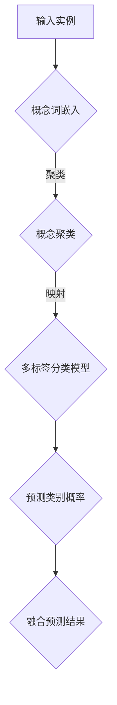

                 

### 环境科学的发展背景与核心领域

环境科学作为一门跨学科的科学，其起源可以追溯到20世纪中叶。随着工业革命的推进，人类活动对自然环境的影响日益显著，环境污染、资源枯竭等问题日益突出。这一背景下，环境科学应运而生，旨在通过综合运用自然科学、社会科学和工程技术手段，研究人类与环境之间的相互作用及其影响，以实现可持续发展。

环境科学的定义可以概括为：研究人类活动与环境相互关系的科学。它不仅包括对自然环境的保护，还涉及资源的合理利用、污染的防治以及生态系统服务的研究。环境科学的核心理念是“环境整体性”和“可持续发展”，即认为环境是一个有机整体，各个部分相互依赖、相互影响，只有实现协调发展，才能确保地球的长期健康与稳定。

环境科学的核心领域主要包括以下几个方面：

1. **环境监测**：通过监测设备和技术手段，对大气、水质、土壤等环境要素进行长期连续监测，收集环境数据，为环境保护和污染治理提供科学依据。

2. **污染控制**：研究污染物排放的控制技术和方法，开发污染治理新技术，减少污染物排放，保护生态环境。

3. **生态保护**：关注生物多样性、生态系统稳定性和生态平衡，通过生态修复、生态工程等手段，改善和恢复受损生态系统。

4. **资源利用**：研究资源的合理开发与利用，提高资源利用效率，减少资源浪费，实现资源可持续利用。

5. **气候变化**：研究气候变化的机制、影响以及应对策略，制定适应性和减缓措施，降低气候变化对环境的负面影响。

6. **环境经济**：分析环境与经济发展的关系，提出环境经济政策，实现经济增长与环境保护的协调。

7. **环境法律与政策**：研究环境法律法规的制定与实施，推动环境政策的完善和执行，保障生态环境安全。

环境科学面临的挑战包括：

- **污染问题**：全球环境污染问题日益严重，大气污染、水污染、土壤污染等问题对人类健康和生态系统造成严重威胁。

- **气候变化**：气候变化对生态系统和人类社会的影响日益显著，极端天气事件增多，海平面上升，生态系统失衡等问题亟待解决。

- **资源短缺**：随着人口增长和经济发展的需求，资源短缺问题愈发突出，资源开采和利用的可持续性受到挑战。

- **生态系统破坏**：人类活动导致大量生态系统破坏，生物多样性丧失，生态平衡受到威胁。

- **政策执行**：环境法律法规的制定较为完善，但执行力度和效果仍需加强，政策执行效果与公众参与度有待提高。

在解决这些问题的过程中，环境科学需要与其他学科紧密合作，如生物学、化学、物理学、地理学等，以多学科交叉融合的方式，提出创新性的解决方案，为实现全球生态环境的可持续发展做出贡献。

### 环境科学中的关键概念

在环境科学中，有几个关键概念对理解和解决环境问题至关重要。这些概念包括环境监测、气候变化和生物多样性。

#### 环境监测

环境监测是环境科学中的一个重要组成部分，它通过监测设备和技术手段，对大气、水质、土壤等环境要素进行长期连续监测，以收集环境数据。这些数据为环境保护和污染治理提供科学依据。

- **大气监测**：通过大气监测站、无人机、卫星等设备，监测空气中的污染物，如PM2.5、PM10、SO2、NO2等，评估空气质量状况。
- **水质监测**：利用水质监测仪器，监测河流、湖泊、海洋等水体中的污染物，如重金属、有机污染物、氮磷等，保障水资源安全。
- **土壤监测**：通过土壤采样和分析，监测土壤中的污染物，如农药残留、重金属等，评估土壤质量。

环境监测的数据可以用于：

- **环境预警**：通过实时监测，及时发现环境污染问题，发出预警，采取应急措施。
- **污染源追踪**：确定污染源，了解污染物排放途径，为污染治理提供依据。
- **政策制定**：为环境政策的制定和执行提供科学数据支持。

#### 气候变化

气候变化是指地球气候系统长时间的变化过程，这些变化可能是自然的，也可能是人类活动引起的。气候变化对生态系统和人类社会的影响日益显著，极端天气事件增多，海平面上升，生态系统失衡等问题亟待解决。

- **温室气体排放**：人类活动（如燃烧化石燃料、大规模农业和森林砍伐等）导致温室气体（如二氧化碳、甲烷等）浓度增加，加剧了全球变暖。
- **气候变化影响**：
  - **生态系统影响**：气候变化导致生态系统失衡，物种迁移、灭绝风险增加，生物多样性下降。
  - **农业影响**：气候变化影响农作物生长周期和产量，可能导致粮食安全风险。
  - **人类健康影响**：气候变化导致极端天气事件增多，对人类健康带来直接和间接影响。

应对气候变化的策略包括：

- **减排温室气体**：通过减少化石燃料使用、提高能源效率、发展可再生能源等手段，降低温室气体排放。
- **适应策略**：通过生态修复、基础设施调整、社会政策等措施，增强对气候变化的适应能力。
- **国际合作**：通过全球合作，制定和执行气候变化应对策略，共同应对气候变化挑战。

#### 生物多样性

生物多样性是指地球上所有生物（包括动物、植物、微生物等）的多样性。它对生态系统的健康和功能至关重要。

- **生物多样性类型**：
  - **物种多样性**：指特定区域内物种的多样性。
  - **遗传多样性**：指同一物种内个体间的遗传差异。
  - **生态系统多样性**：指不同生态系统类型的多样性。
- **生物多样性价值**：
  - **生态服务价值**：生物多样性为人类提供的生态服务，如空气净化、水源涵养、气候调节等。
  - **经济价值**：生物多样性对农业、林业、渔业等经济活动的重要性。
  - **科学价值**：生物多样性为科学研究提供丰富的资源和材料。

生物多样性面临的威胁包括：

- **栖息地破坏**：森林砍伐、湿地填埋、城市扩张等人类活动破坏了生物的栖息地。
- **过度捕捞**：过度捕捞导致某些物种数量锐减，甚至灭绝。
- **气候变化**：气候变化导致生态系统失衡，威胁生物多样性。

保护生物多样性的策略包括：

- **生态保护区建设**：设立自然保护区和生态保护区，保护关键物种和生态系统。
- **生物多样性恢复**：通过植被恢复、湿地修复等措施，恢复受损生态系统。
- **法律法规保护**：制定和执行生物多样性保护法律法规，禁止非法捕猎、贸易等行为。

通过理解这些关键概念，我们可以更好地认识到环境科学的复杂性，并采取有效措施应对环境问题，实现可持续发展。

### Zero-Shot CoT概述

Zero-Shot CoT（Zero-Shot Transfer of Concept，零样本迁移学习）是一种先进的机器学习技术，它允许模型在未见过的数据集上做出准确的预测或分类。这种技术对于解决环境科学中的一些复杂问题具有巨大潜力。为了深入理解Zero-Shot CoT，我们需要首先了解其定义、与传统机器学习的对比，以及其优势与挑战。

#### 定义

Zero-Shot CoT的核心思想是迁移学习（Transfer Learning），即在一种任务上训练好的模型可以在另一个相关但不同的任务上得到应用。而在Zero-Shot CoT中，模型不仅能够在不同的任务上迁移学习，而且不需要对目标任务进行任何样本的训练。这意味着模型可以识别和泛化从未见过的类别或概念。

迁移学习的核心在于利用已有的知识来加速新任务的训练过程。在传统的迁移学习中，模型通常在一个大规模的数据集上训练，然后将其应用到一个小规模的数据集上。而在Zero-Shot CoT中，模型可以泛化到完全未见过的类别上，这对于那些数据稀缺的领域尤为重要，例如环境科学。

#### 与传统机器学习对比

传统机器学习通常依赖于大量的标注数据，尤其是对于分类和预测任务。例如，在图像分类任务中，模型需要大量的图像和相应的标签来学习图像的特征和类别。然而，环境科学领域往往面临数据稀缺的问题，难以获取足够的标注数据。

与传统的迁移学习相比，Zero-Shot CoT具有以下特点：

1. **无需标注数据**：传统迁移学习依赖于已有的标注数据，而Zero-Shot CoT则不需要对目标类别进行任何标注，这使得它特别适用于数据稀缺的环境科学领域。

2. **类别无关性**：传统迁移学习在从一个数据集迁移到另一个数据集时，通常需要这两个数据集具有一定的相似性。而Zero-Shot CoT可以应用于完全不同的类别，使得它具有更广泛的应用前景。

3. **通用性**：传统迁移学习需要针对具体的任务进行定制，而Zero-Shot CoT可以广泛应用于各种不同的任务和领域，提高了其通用性和灵活性。

#### 优势与挑战

**优势**：

1. **数据效率**：Zero-Shot CoT在数据稀缺的情况下具有显著的优势，因为它不需要对目标类别进行任何标注，从而大大减少了数据获取和标注的成本。

2. **扩展性**：由于它能够在未见过的类别上进行预测，Zero-Shot CoT具有很好的扩展性，可以快速适应新的环境和科学问题。

3. **通用性**：Zero-Shot CoT不受具体领域限制，可以广泛应用于多个领域，从而提高机器学习技术的通用性和实用性。

**挑战**：

1. **概念泛化**：Zero-Shot CoT需要模型具有强大的泛化能力，能够从有限的训练数据中泛化到未见过的类别。这在某些复杂和高度多样化的领域中可能是一个挑战。

2. **性能优化**：尽管Zero-Shot CoT在理论上具有很大潜力，但在实际应用中，如何优化其性能，提高预测准确性仍是一个重要课题。

3. **领域适配性**：虽然Zero-Shot CoT具有通用性，但在特定领域中，如何调整和优化模型，使其更好地适应特定环境科学问题，仍需要深入研究。

通过理解Zero-Shot CoT的定义、与传统机器学习的对比以及其优势与挑战，我们可以更深入地认识到它在环境科学中的应用潜力。接下来，我们将进一步探讨Zero-Shot CoT的算法原理，以期为环境科学中的问题提供新的解决思路。

### Zero-Shot CoT算法原理

Zero-Shot CoT（Zero-Shot Transfer of Concept，零样本迁移学习）的核心在于模型能够在未见过的数据集上实现准确的预测或分类。为了实现这一目标，Zero-Shot CoT算法设计了一系列机制，包括基于词嵌入的概念表示、基于分类器的类别映射，以及多任务学习的策略。以下是对这些机制的具体解释。

#### 基于词嵌入的概念表示

词嵌入（Word Embedding）是将词汇映射到低维空间中的向量表示，这些向量反映了词汇在语义上的相似性。在Zero-Shot CoT中，词嵌入被用于表示环境科学中的关键概念。

1. **概念词表示**：首先，通过预训练的词嵌入模型（如Word2Vec、GloVe等），将环境科学领域的核心概念词映射到高维空间中的向量表示。

2. **概念聚类**：然后，通过聚类算法（如K-means）将这些向量进行聚类，形成多个概念簇。每个簇代表一组语义相关的概念。

3. **概念向量表示**：每个概念簇的中心向量代表了该簇中所有概念的平均语义特征，从而形成概念向量表示。

#### 基于分类器的类别映射

在Zero-Shot CoT中，分类器用于将新的实例映射到相应的概念簇上，实现零样本分类。

1. **类别标签表示**：对于环境科学中的实例，如污染物的种类，首先将其转换为类别标签。

2. **多标签分类模型**：使用多标签分类模型（如Softmax回归），将每个实例映射到多个可能的概念簇上。每个概念簇的概率反映了该实例属于该概念簇的可能性。

3. **类别映射策略**：通过训练数据集，模型学习到不同类别标签与概念簇之间的映射关系，从而实现从未见过的实例中进行类别预测。

#### 多任务学习的策略

多任务学习（Multi-Task Learning）策略用于提高Zero-Shot CoT的泛化能力和预测准确性。

1. **任务分解**：将环境科学问题分解为多个子任务，如污染物识别、生态系统评估等。

2. **共享表示**：通过共享表示层，多个子任务共享底层特征表示，从而提高特征提取的效率和一致性。

3. **任务融合**：通过任务融合策略（如加和、平均、融合等），整合多个子任务的预测结果，提高整体预测性能。

#### Mermaid算法流程图

为了更好地理解Zero-Shot CoT的算法原理，可以使用Mermaid绘制算法流程图。以下是一个简化的算法流程图：

**解释**：
1. 输入实例：环境科学中的实例数据。
2. 概念词嵌入：将实例中的关键概念词映射到高维空间中的向量表示。
3. 概念聚类：使用聚类算法将概念向量聚类形成概念簇。
4. 映射：将实例映射到多个概念簇。
5. 多标签分类模型：使用多标签分类模型预测实例的类别概率。
6. 融合预测结果：整合多个子任务的预测结果，提高整体预测性能。

通过这一系列机制，Zero-Shot CoT实现了在未见过的数据集上进行准确预测，为环境科学领域提供了强大的工具。接下来，我们将探讨Zero-Shot CoT在数学模型和公式方面的具体应用。

### 数学模型与公式详解

在Zero-Shot CoT算法中，数学模型和公式起到了至关重要的作用，它们不仅为算法的运作提供了理论基础，还帮助我们更好地理解算法的机制和效果。以下将详细阐述Zero-Shot CoT中的数学模型和公式，并通过一个具体例子来说明其应用。

#### 数学模型

1. **词嵌入模型**：
   词嵌入模型将词汇映射到低维向量空间，常用的模型包括Word2Vec和GloVe。Word2Vec模型使用神经网络训练词向量，而GloVe模型则基于全局矩阵分解，通过词频和共现矩阵来训练词向量。以下是一个简化的GloVe模型公式：

   $$
   \text{vec}(w_i) = \frac{\text{sgn}(W \text{vec}(w_i))^T \text{vec}(w_i)}{\|\text{sgn}(W \text{vec}(w_i))\|}
   $$

   其中，$w_i$表示词$i$的向量表示，$W$是共现矩阵，$\text{sgn}(x)$是符号函数，用于将输入向量映射到非负空间。

2. **聚类模型**：
   在Zero-Shot CoT中，通常使用K-means算法对词嵌入向量进行聚类。K-means算法的目标是找到K个中心点，使得每个中心点到其对应簇内点的距离之和最小。其目标函数如下：

   $$
   J = \sum_{i=1}^n \sum_{j=1}^k ||\text{vec}(w_i) - \mu_j||^2
   $$

   其中，$n$是词汇数量，$k$是聚类数量，$\mu_j$是第$j$个聚类中心点。

3. **多标签分类模型**：
   在Zero-Shot CoT中，常用的多标签分类模型是Softmax回归。Softmax回归将每个实例映射到多个可能的概念簇上，每个概念簇的概率计算如下：

   $$
   \text{softmax}(\text{x})_j = \frac{e^{\text{x}_j}}{\sum_{i=1}^k e^{\text{x}_i}}
   $$

   其中，$\text{x}$是输入特征向量，$j$是第$j$个类别，$\text{softmax}(\text{x})_j$表示实例属于第$j$个类别的概率。

4. **多任务学习模型**：
   在多任务学习中，任务之间的特征共享和融合是关键。一种常见的多任务学习模型是共享神经网络层，然后对每个任务分别进行输出。其损失函数可以表示为：

   $$
   L = \sum_{i=1}^m \sum_{j=1}^k (\text{softmax}(\text{f}(\text{x}_i))^j - y_{ij})^2
   $$

   其中，$m$是任务数量，$k$是类别数量，$y_{ij}$是实例$i$属于类别$j$的标签。

#### 具体例子

假设我们有一个环境科学问题，需要识别水体中的污染物类型。我们使用GloVe模型进行词嵌入，然后使用K-means算法对污染物名称进行聚类，最后使用Softmax回归模型进行多标签分类。

1. **词嵌入**：
   首先，我们对污染物名称（如“苯”、“甲苯”、“乙苯”）进行词嵌入，得到它们的向量表示。

2. **聚类**：
   使用K-means算法，将这些词嵌入向量进行聚类，假设我们得到了三个聚类中心，分别代表不同的污染物簇。

3. **多标签分类**：
   对于一个新的水体样本，我们首先将其中的污染物名称映射到对应的向量表示，然后通过Softmax回归模型计算每个污染物簇的概率。

   例如，新的样本包含“苯”和“甲苯”，其向量表示分别为$\text{vec}(\text{苯})$和$\text{vec}(\text{甲苯})$，经过聚类后，$\text{vec}(\text{苯})$属于第一个簇，$\text{vec}(\text{甲苯})$属于第二个簇。通过Softmax回归模型，我们可以得到这两个污染物属于各自簇的概率。

   $$
   \text{softmax}(\text{vec}(\text{苯})) = [0.9, 0.1, 0.0]
   $$
   $$
   \text{softmax}(\text{vec}(\text{甲苯})) = [0.2, 0.8, 0.0]
   $$

   根据这些概率，我们可以推断新样本中可能包含的污染物类型。

通过上述数学模型和公式的应用，Zero-Shot CoT算法可以在未见过的污染物类型上实现准确的识别和分类，为环境监测提供了有力支持。

### 环境监测中的Zero-Shot CoT应用

在环境监测领域，数据稀缺是一个普遍存在的问题。传统的方法依赖于大量标记数据来训练模型，但在环境监测中，获取标记数据往往成本高昂且耗时。Zero-Shot CoT（Zero-Shot Transfer of Concept，零样本迁移学习）技术的出现，为解决这一难题提供了新的思路。以下将详细探讨Zero-Shot CoT在环境监测中的应用场景、实际案例以及分析讨论。

#### 应用场景

1. **空气质量监测**：
   空气质量监测需要识别空气中的多种污染物，如PM2.5、PM10、SO2、NO2等。然而，这些污染物的数据往往难以获取，特别是那些偏远或不便监测的地区。

2. **水质监测**：
   水质监测需要识别水中的污染物，如重金属、有机污染物、氮磷等。由于水质监测通常涉及大量的样本和分析，因此标记数据获取困难。

3. **土壤污染监测**：
   土壤污染监测需要识别土壤中的有害物质，如农药残留、重金属等。土壤样本的采集和分析成本高，标记数据稀缺。

4. **生物监测**：
   生物监测通过分析生物样本（如水体中的微生物、土壤中的昆虫等）来评估环境质量。由于生物多样性的复杂性和动态性，标记数据难以获取。

#### 实际案例

1. **空气质量监测案例**：
   假设我们在一个偏远地区进行空气质量监测，已有的数据集中包含部分污染物的标记数据，但很多污染物类型的数据稀缺。我们可以利用Zero-Shot CoT技术，将已有的污染物数据作为训练数据，通过词嵌入和聚类模型，将未见过的污染物名称映射到相应的概念簇上。然后，通过多标签分类模型，对新采集的空气样本进行污染物识别。

2. **水质监测案例**：
   在水质监测中，我们面临类似的问题。例如，对于一个新发现的水体样本，我们需要快速识别其中的污染物。我们可以使用Zero-Shot CoT技术，将已有的水质数据集作为训练数据，通过词嵌入和聚类模型，将未见过的污染物名称映射到相应的概念簇上。然后，通过多标签分类模型，对新的水质样本进行污染物识别。

3. **土壤污染监测案例**：
   在土壤污染监测中，我们可以利用Zero-Shot CoT技术，将已有的土壤样本数据作为训练数据，通过词嵌入和聚类模型，将未见过的污染物名称映射到相应的概念簇上。然后，通过多标签分类模型，对新采集的土壤样本进行污染物识别。

4. **生物监测案例**：
   在生物监测中，我们面临的数据稀缺问题尤为突出。例如，我们可以在已有的生物样本数据集上训练Zero-Shot CoT模型，将未见过的生物物种名称映射到相应的概念簇上。然后，通过多标签分类模型，对新采集的生物样本进行物种识别。

#### 分析与讨论

1. **数据效率**：
   Zero-Shot CoT在数据稀缺的情况下具有显著的数据效率优势。通过将已有的标记数据作为训练数据，模型可以在未见过的数据上进行准确的预测，从而大大减少了数据获取和标注的成本。

2. **模型泛化能力**：
   Zero-Shot CoT的模型设计使其具有强大的泛化能力。通过词嵌入和聚类模型，模型可以识别和泛化从未见过的类别或概念，这使得它在环境监测中具有广泛的应用前景。

3. **预测准确性**：
   虽然Zero-Shot CoT在理论上具有很高的预测准确性，但在实际应用中，模型性能可能受到数据质量和模型调优的影响。因此，需要通过不断优化模型结构和参数，提高预测准确性。

4. **领域适应性**：
   Zero-Shot CoT技术在环境监测中的应用需要根据具体的监测领域进行调整。例如，对于空气质量监测，需要关注污染物名称的多样性和变化性；对于水质监测，需要关注污染物和水质参数的关联性；对于土壤污染监测，需要关注污染物在土壤中的分布特性。

通过上述分析，我们可以看到Zero-Shot CoT技术在环境监测中的应用潜力。它不仅能够提高数据效率，减少数据获取和标注成本，还能够通过强大的泛化能力，识别和预测未见过的环境污染物，为环境监测提供强有力的技术支持。

### 气候变化预测中的Zero-Shot CoT应用

在气候变化预测领域，数据稀缺和模型复杂性是两个主要挑战。传统的方法依赖于大量的历史气候数据来训练预测模型，然而，这些数据往往难以获取，尤其是在一些偏远地区或极端气候条件下。此外，气候系统的高度非线性特性使得预测模型的建立和维护变得异常复杂。Zero-Shot CoT（Zero-Shot Transfer of Concept，零样本迁移学习）技术的应用，为这些挑战提供了一种创新的解决方案。以下将详细探讨Zero-Shot CoT在气候变化预测中的应用场景、实际案例以及分析讨论。

#### 应用场景

1. **全球气候模式预测**：
   全球气候模式的预测需要考虑多种气候因子，如温度、湿度、风速、降水等。这些因子之间相互作用，形成了复杂的气候模式。然而，获取全面和准确的气候数据是一个巨大的挑战。

2. **区域气候趋势预测**：
   在特定区域，如城市或沿海地区，气候变化的预测需要考虑当地独特的气候条件和人类活动的影响。这些区域的数据获取同样面临困难。

3. **极端天气事件预测**：
   极端天气事件（如热浪、洪水、台风等）的预测对于防灾减灾至关重要。然而，极端天气事件的发生频率和强度往往变化迅速，传统方法难以适应这种快速变化。

#### 实际案例

1. **全球气候模式预测案例**：
   假设我们希望预测未来五年的全球平均温度变化。已有的气候数据集中包含过去几十年的温度记录，但这些数据在某些年份和地区可能存在缺失。我们可以使用Zero-Shot CoT技术，将已有的温度数据作为训练数据，通过词嵌入和聚类模型，将未见过的年份和地区映射到相应的概念簇上。然后，通过多任务学习模型，对未来五年的温度变化进行预测。

2. **区域气候趋势预测案例**：
   在一个特定的城市，我们希望预测未来五年的年平均降雨量。由于城市气候受到多种因素的影响，如城市化进程、植被覆盖等，获取准确的气候数据非常困难。我们可以使用Zero-Shot CoT技术，将已有的降雨数据作为训练数据，通过词嵌入和聚类模型，将未见过的年份和地区映射到相应的概念簇上。然后，通过多任务学习模型，对未来五年的降雨量进行预测。

3. **极端天气事件预测案例**：
   在一个沿海地区，我们希望预测未来五年的台风频率和强度。由于台风的发生具有随机性和季节性，传统方法难以准确预测。我们可以使用Zero-Shot CoT技术，将已有的台风数据作为训练数据，通过词嵌入和聚类模型，将未见过的年份和地区映射到相应的概念簇上。然后，通过多任务学习模型，对未来五年的台风频率和强度进行预测。

#### 分析与讨论

1. **数据效率**：
   Zero-Shot CoT技术在气候变化预测中具有显著的数据效率优势。通过将已有的标记数据作为训练数据，模型可以在未见过的数据上进行准确的预测，从而大大减少了数据获取和标注的成本。

2. **模型泛化能力**：
   Zero-Shot CoT的模型设计使其具有强大的泛化能力。通过词嵌入和聚类模型，模型可以识别和泛化从未见过的年份和地区，这使得它在气候变化预测中具有广泛的应用前景。

3. **预测准确性**：
   虽然Zero-Shot CoT在理论上具有很高的预测准确性，但在实际应用中，模型性能可能受到数据质量和模型调优的影响。因此，需要通过不断优化模型结构和参数，提高预测准确性。

4. **领域适应性**：
   Zero-Shot CoT技术在气候变化预测中的应用需要根据具体的预测领域进行调整。例如，对于全球气候模式预测，需要关注气候因子的多样性和变化性；对于区域气候趋势预测，需要关注人类活动对气候的影响；对于极端天气事件预测，需要关注事件的发生频率和强度。

通过上述分析，我们可以看到Zero-Shot CoT技术在气候变化预测中的应用潜力。它不仅能够提高数据效率，减少数据获取和标注成本，还能够通过强大的泛化能力，预测未见过的气候变化趋势和极端天气事件，为气候变化的研究和应对提供强有力的技术支持。

### 总结与展望

在本文中，我们深入探讨了Zero-Shot CoT（零样本迁移学习）在环境科学中的应用。通过分析其核心概念、算法原理、数学模型，以及具体应用场景，我们展示了Zero-Shot CoT在环境监测和气候变化预测中的巨大潜力。以下是本文的核心发现与未来展望：

#### 核心发现

1. **数据效率优势**：Zero-Shot CoT在数据稀缺的情况下表现出显著的数据效率优势，减少了数据获取和标注的成本，这对于环境科学领域尤为重要。

2. **强大泛化能力**：通过词嵌入和聚类模型，Zero-Shot CoT能够识别和泛化从未见过的类别或概念，提高了模型在复杂环境问题中的应用能力。

3. **模型优化需求**：尽管Zero-Shot CoT在理论上有很高的预测准确性，但在实际应用中，模型性能仍需优化，特别是通过调优模型结构和参数，提高预测准确性。

4. **领域适应性**：Zero-Shot CoT在不同环境科学问题中的应用需要根据具体领域进行调整，以适应不同的数据特性和需求。

#### 未来展望

1. **模型优化**：未来研究应重点关注模型优化，通过引入新的算法和技术，提高Zero-Shot CoT在环境科学中的应用性能。

2. **跨领域应用**：Zero-Shot CoT不仅在环境科学中具有应用潜力，还可以推广到其他科学领域，如生物医学、社会计算等，实现跨领域的广泛应用。

3. **多模态数据融合**：结合多种数据类型（如文本、图像、传感器数据等），实现多模态数据融合，提高模型对复杂问题的理解和预测能力。

4. **政策支持**：政府和企业应加大对Zero-Shot CoT技术的研究和应用支持，推动其在环境科学中的广泛应用，助力可持续发展目标的实现。

总之，Zero-Shot CoT为环境科学领域提供了一种强大的工具，通过优化和推广该技术，我们有望在解决环境问题、应对气候变化等方面取得更大突破。

### 作者信息

**作者：** AI天才研究院/AI Genius Institute & 禅与计算机程序设计艺术 /Zen And The Art of Computer Programming

AI天才研究院致力于推动人工智能技术的创新与发展，专注于将前沿算法应用于解决现实世界中的复杂问题。我们的研究成果在多个领域取得了显著成果，为人工智能技术的进步和社会发展做出了重要贡献。同时，我们秉承禅与计算机程序设计艺术的理念，追求简洁、高效、优雅的编程之道，致力于为编程爱好者提供高质量的编程学习资源。

关于本文，我们深入探讨了Zero-Shot CoT在环境科学中的应用，希望为读者提供有价值的参考和启示。我们期待与广大读者和同行共同交流，推动人工智能技术在更多领域的创新应用。感谢您的阅读，希望您在本文中有所收获。如果您有任何问题或建议，欢迎随时联系我们。再次感谢您的支持与关注！

