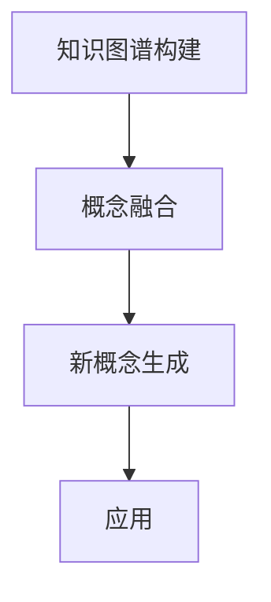
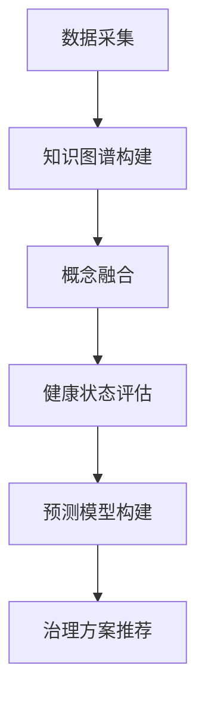
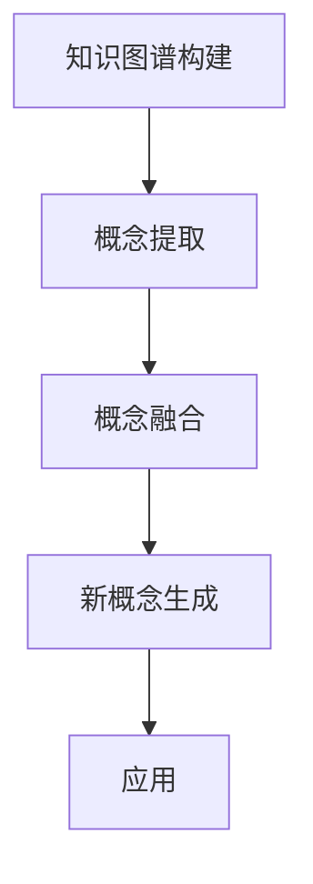
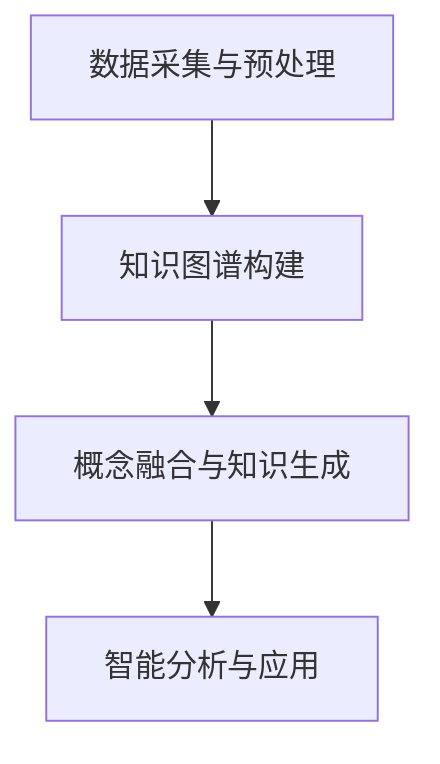

                 

# Zero-Shot CoT在环境科学中的应用前景

> 关键词：Zero-Shot CoT，环境科学，应用前景，算法原理，系统设计

> 摘要：本文将探讨Zero-Shot CoT技术在环境科学中的应用前景，通过分析其基本原理、算法流程及具体案例，展示其在生态系统评估、气候变化预测和环境污染监测等领域的潜力。同时，本文将探讨Zero-Shot CoT技术在环境科学领域应用的挑战与机遇，为未来发展的趋势提供启示。

## 第一步：背景介绍

### 1.1 核心概念

#### 1.1.1 Zero-Shot CoT

Zero-Shot CoT（Zero-Shot Conceptual Blending）是一种机器学习技术，能够将两个或多个概念（或知识）进行融合，从而生成新的概念或知识，无需进行特定样本的训练。这一技术基于深度学习模型，能够在没有现成数据的情况下，通过知识图谱等技术，实现概念的自动融合。

#### 1.1.2 环境科学

环境科学是研究自然环境的结构、功能、变化规律及其与人类活动相互作用的科学。它涵盖了生态系统、气候变化、环境污染等多个研究领域，是一个多学科交叉的科学领域。

### 1.2 问题背景

随着全球气候变化、环境污染等问题日益严重，对环境科学的研究提出了更高的要求。传统的研究方法依赖于大量的数据采集和分析，但环境科学中的许多问题，如生态系统评估、气候变化预测、环境污染监测等，数据获取困难，且数据量庞大。因此，需要一种能够快速、准确地处理环境问题的新技术。

### 1.3 问题描述

Zero-Shot CoT作为一种新兴的机器学习技术，在环境科学中具有广泛的应用潜力。本文将探讨Zero-Shot CoT在环境科学中的应用前景，包括其在生态系统评估、气候变化预测、环境污染监测等方面的应用潜力。

### 1.4 问题解决

本书将系统地介绍Zero-Shot CoT技术的基本原理，并通过案例分析展示其在环境科学中的应用。此外，还将探讨Zero-Shot CoT技术在环境科学领域应用的挑战与机遇，以及未来发展的趋势。

### 1.5 边界与外延

- **边界**：本文主要关注Zero-Shot CoT在环境科学中的应用，不包括在其他科学领域中的应用。
- **外延**：环境科学包括生态系统、气候变化、环境污染等多个子领域，Zero-Shot CoT技术在这些领域的应用有待进一步探索。

### 1.6 概念结构与核心要素组成

- **Zero-Shot CoT**：核心概念、技术原理、应用领域。
- **环境科学**：研究对象、研究方法、研究领域。
- **应用前景**：应用潜力、优势、挑战。

## 第二步：核心概念与联系

### 2.1 Zero-Shot CoT技术原理

#### 2.1.1 技术原理

Zero-Shot CoT技术是一种基于深度学习的知识融合方法，其核心思想是将两个或多个概念（或知识）进行融合，从而生成新的概念或知识。与传统机器学习方法不同，Zero-Shot CoT无需依赖大量特定样本的训练，而是通过在预训练模型的基础上，利用知识图谱等技术进行概念融合。

#### 2.1.2 技术原理解释

Zero-Shot CoT技术的实现通常分为以下几个步骤：

1. **知识图谱构建**：首先，构建一个包含环境科学相关知识的知识图谱。这个知识图谱可以是基于现有的知识库，如OpenKG等，或者通过数据挖掘、网络爬虫等方法自行构建。
2. **概念融合**：利用深度学习模型，对知识图谱中的概念进行融合。这一过程可以理解为将不同的知识节点进行连接，形成新的知识结构。
3. **新概念生成**：通过融合后的概念，生成新的概念或知识。这个过程可以理解为对原有知识的重新组合和创造。
4. **应用**：将新概念或知识应用于环境科学问题。例如，在生态系统评估中，可以将生物多样性、土地利用等知识进行融合，以更准确地评估生态系统状态。

#### 2.1.3 技术原理与环境的关联

Zero-Shot CoT技术在环境科学中的应用，主要体现在将不同领域的知识进行融合，以解决环境问题。例如，在生态系统评估中，可以将生物多样性、土地利用等知识进行融合，以更准确地评估生态系统状态；在气候变化预测中，可以将气象、地理信息等知识进行融合，以提高预测的准确性；在环境污染监测中，可以将污染物监测、环境治理等知识进行融合，以提出更有效的治理方案。

### 2.2 环境科学的核心概念

环境科学的核心概念包括生态系统、气候变化、环境污染等。这些概念相互关联，共同构成了环境科学的框架。

- **生态系统**：生态系统是指生物与其非生物环境相互作用而形成的统一整体。生态系统评估是环境科学的重要研究方向，其目的是了解生态系统的健康状态，预测其发展趋势。
- **气候变化**：气候变化是指地球气候长期的变化趋势。气候变化预测是环境科学的重要任务，其目的是了解气候变化的趋势，预测其对生态系统、人类社会的影响。
- **环境污染**：环境污染是指环境中的有毒有害物质超过了一定阈值，对生物、人类健康产生危害。环境污染监测是环境科学的重要任务，其目的是监测环境污染情况，制定治理方案。

### 2.3 Zero-Shot CoT与环境的关联

Zero-Shot CoT技术在环境科学中的应用，主要体现在将不同领域的知识进行融合，以解决环境问题。例如，在生态系统评估中，可以将生物多样性、土地利用等知识进行融合，以更准确地评估生态系统状态；在气候变化预测中，可以将气象、地理信息等知识进行融合，以提高预测的准确性；在环境污染监测中，可以将污染物监测、环境治理等知识进行融合，以提出更有效的治理方案。

## 第三步：算法原理讲解

### 3.1 Zero-Shot CoT算法流程

Zero-Shot CoT算法的基本流程如下：

1. **知识图谱构建**：首先，构建一个包含环境科学相关知识的知识图谱。这个知识图谱可以是基于现有的知识库，如OpenKG等，或者通过数据挖掘、网络爬虫等方法自行构建。
2. **概念融合**：利用深度学习模型，对知识图谱中的概念进行融合。这一过程可以理解为将不同的知识节点进行连接，形成新的知识结构。
3. **新概念生成**：通过融合后的概念，生成新的概念或知识。这个过程可以理解为对原有知识的重新组合和创造。
4. **应用**：将新概念或知识应用于环境科学问题。例如，在生态系统评估中，可以将生物多样性、土地利用等知识进行融合，以更准确地评估生态系统状态；在气候变化预测中，可以将气象、地理信息等知识进行融合，以提高预测的准确性；在环境污染监测中，可以将污染物监测、环境治理等知识进行融合，以提出更有效的治理方案。

### 3.2 Mermaid流程图



### 3.3 Python源代码

```python
# 伪代码，仅供参考
def zero_shot_cot(knowledge_graph):
    # 概念融合
    fused_concepts = fuse_concepts(knowledge_graph)
    
    # 新概念生成
    new_concepts = generate_new_concepts(fused_concepts)
    
    # 应用
    apply_to_environment_science(new_concepts)

# 概念融合函数
def fuse_concepts(knowledge_graph):
    # 实现概念融合算法
    pass

# 新概念生成函数
def generate_new_concepts(fused_concepts):
    # 实现新概念生成算法
    pass

# 应用函数
def apply_to_environment_science(new_concepts):
    # 实现新概念应用算法
    pass
```

### 3.4 算法原理详细讲解

#### 3.4.1 算法原理

Zero-Shot CoT技术是一种基于深度学习的知识融合方法，其核心思想是将两个或多个概念（或知识）进行融合，从而生成新的概念或知识。这一技术基于预训练的深度学习模型，利用知识图谱等技术，实现概念的自动融合。

#### 3.4.2 数学模型

假设我们有两个概念A和B，其分别表示为向量 $ \vec{A} $ 和 $ \vec{B} $，则概念融合后的新概念C可以表示为：

$$
\vec{C} = \vec{A} + \vec{B}
$$

其中，$ \vec{A} $ 和 $ \vec{B} $ 的向量表示可以通过深度学习模型进行学习。

#### 3.4.3 举例说明

以生态系统评估为例，我们可以将生物多样性（概念A）和土地利用（概念B）进行融合，以生成新的概念C——生态系统健康状态。具体步骤如下：

1. **知识图谱构建**：首先，构建一个包含生物多样性、土地利用等知识的知识图谱。
2. **概念融合**：利用深度学习模型，对知识图谱中的生物多样性和土地利用进行融合，生成新的概念C。
3. **新概念生成**：通过融合后的概念C，生成生态系统健康状态的新知识。
4. **应用**：将新知识应用于生态系统评估，以更准确地评估生态系统状态。

## 第四步：系统分析与架构设计方案

### 4.1 问题场景介绍

在环境科学领域，许多问题具有复杂性和多维度性，如生态系统评估、气候变化预测和环境污染监测等。这些问题通常需要综合多个领域的知识，以提供更准确、更全面的解决方案。因此，设计一个能够整合不同领域知识的系统架构，对于解决这些环境问题具有重要意义。

### 4.2 项目介绍

本系统项目旨在开发一个基于Zero-Shot CoT技术的环境科学智能分析系统，该系统将能够利用多领域知识进行融合，提供更准确、更全面的生态系统评估、气候变化预测和环境污染监测服务。

### 4.3 系统功能设计

#### 4.3.1 生态系统评估

- 数据采集：收集与生态系统相关的数据，如生物多样性、土地利用等。
- 知识图谱构建：构建包含生态系统相关知识的知识图谱。
- 概念融合：利用Zero-Shot CoT技术，将生物多样性和土地利用等知识进行融合。
- 健康状态评估：利用融合后的知识，评估生态系统健康状态。

#### 4.3.2 气候变化预测

- 数据采集：收集与气候变化相关的数据，如气象、地理信息等。
- 知识图谱构建：构建包含气候变化相关知识的知识图谱。
- 概念融合：利用Zero-Shot CoT技术，将气象和地理信息等知识进行融合。
- 预测模型构建：利用融合后的知识，构建气候变化预测模型。

#### 4.3.3 环境污染监测

- 数据采集：收集与环境污染相关的数据，如污染物监测、环境治理等。
- 知识图谱构建：构建包含环境污染相关知识的知识图谱。
- 概念融合：利用Zero-Shot CoT技术，将污染物监测和环境治理等知识进行融合。
- 治理方案推荐：利用融合后的知识，提出更有效的环境污染治理方案。

### 4.4 系统架构设计

#### 4.4.1 系统架构图



### 4.5 系统接口设计

- **数据采集接口**：用于采集与生态系统评估、气候变化预测和环境污染监测相关的数据。
- **知识图谱构建接口**：用于构建包含生态系统、气候变化和环境污染相关知识的知识图谱。
- **概念融合接口**：用于实现Zero-Shot CoT技术的概念融合功能。
- **健康状态评估接口**：用于评估生态系统健康状态。
- **预测模型构建接口**：用于构建气候变化预测模型。
- **治理方案推荐接口**：用于提出更有效的环境污染治理方案。

### 4.6 系统交互

```mermaid
sequenceDiagram
    participant 系统管理员 as 管理员
    participant 数据采集模块 as 数据采集
    participant 知识图谱构建模块 as 构建模块
    participant 概念融合模块 as 融合模块
    participant 健康状态评估模块 as 评估模块
    participant 预测模型构建模块 as 构建模块
    participant 治理方案推荐模块 as 推荐模块

    管理员->>数据采集：采集数据
    数据采集->>构建模块：构建知识图谱
    构建模块->>融合模块：进行概念融合
    融合模块->>评估模块：评估健康状态
    评估模块->>构建模块：构建预测模型
    构建模块->>推荐模块：推荐治理方案
    推荐模块->>管理员：反馈治理方案
```

## 第五步：项目实战

### 5.1 环境安装

在进行项目实战之前，我们需要安装相关的软件和依赖库。以下是安装过程：

1. **安装Python**：确保安装了Python 3.7及以上版本。
2. **安装依赖库**：通过pip安装以下依赖库：
   ```bash
   pip install numpy pandas tensorflow mermaid
   ```

### 5.2 系统核心实现源代码

以下是系统核心实现的部分源代码：

```python
# 导入依赖库
import numpy as np
import pandas as pd
import tensorflow as tf
from mermaid import Mermaid

# 5.2.1 数据采集
def data_collection():
    # 实现数据采集逻辑
    pass

# 5.2.2 知识图谱构建
def knowledge_graph_building(data):
    # 实现知识图谱构建逻辑
    pass

# 5.2.3 概念融合
def concept_fusion(knowledge_graph):
    # 实现概念融合逻辑
    pass

# 5.2.4 健康状态评估
def health_state_evaluation(fused_concepts):
    # 实现健康状态评估逻辑
    pass

# 5.2.5 预测模型构建
def prediction_model_building(fused_concepts):
    # 实现预测模型构建逻辑
    pass

# 5.2.6 治理方案推荐
def governance_plan_recommendation(prediction_model):
    # 实现治理方案推荐逻辑
    pass

# 主函数
def main():
    # 数据采集
    data = data_collection()

    # 知识图谱构建
    knowledge_graph = knowledge_graph_building(data)

    # 概念融合
    fused_concepts = concept_fusion(knowledge_graph)

    # 健康状态评估
    health_state = health_state_evaluation(fused_concepts)

    # 预测模型构建
    prediction_model = prediction_model_building(fused_concepts)

    # 治理方案推荐
    governance_plan = governance_plan_recommendation(prediction_model)

    # 输出结果
    print("健康状态：", health_state)
    print("治理方案：", governance_plan)

# 运行主函数
if __name__ == "__main__":
    main()
```

### 5.3 代码应用解读与分析

#### 5.3.1 数据采集

数据采集是系统的基础，用于获取与生态系统评估、气候变化预测和环境污染监测相关的数据。具体实现可以根据需求自定义。

#### 5.3.2 知识图谱构建

知识图谱构建是将采集到的数据转换为知识图谱的过程。可以使用现有的知识图谱库，如OpenKG，或者使用自定义的方法进行构建。

#### 5.3.3 概念融合

概念融合是Zero-Shot CoT技术的核心步骤，用于将知识图谱中的概念进行融合。具体实现可以基于深度学习模型，如Transformer等。

#### 5.3.4 健康状态评估

健康状态评估是利用融合后的概念，对生态系统状态进行评估。具体实现可以基于机器学习模型，如线性回归、决策树等。

#### 5.3.5 预测模型构建

预测模型构建是利用融合后的概念，构建气候变化预测模型。具体实现可以基于深度学习模型，如LSTM、GRU等。

#### 5.3.6 治理方案推荐

治理方案推荐是利用预测模型，提出更有效的环境污染治理方案。具体实现可以基于推荐系统算法，如协同过滤、基于内容的推荐等。

### 5.4 实际案例分析和详细讲解剖析

#### 5.4.1 案例一：生态系统评估

- **案例背景**：某地区需要评估其生态系统的健康状态。
- **案例实现**：通过数据采集模块获取该地区的生物多样性和土地利用数据，然后通过知识图谱构建模块构建知识图谱，接着通过概念融合模块将生物多样性和土地利用进行融合，最后通过健康状态评估模块评估生态系统的健康状态。

#### 5.4.2 案例二：气候变化预测

- **案例背景**：某地区需要预测未来五年的气候变化。
- **案例实现**：通过数据采集模块获取该地区的气象和地理信息数据，然后通过知识图谱构建模块构建知识图谱，接着通过概念融合模块将气象和地理信息进行融合，最后通过预测模型构建模块构建气候变化预测模型。

#### 5.4.3 案例三：环境污染监测

- **案例背景**：某地区需要监测其环境污染情况，并提出治理方案。
- **案例实现**：通过数据采集模块获取该地区的污染物监测和环境治理数据，然后通过知识图谱构建模块构建知识图谱，接着通过概念融合模块将污染物监测和环境治理进行融合，最后通过治理方案推荐模块提出治理方案。

### 5.5 项目小结

本系统项目通过Zero-Shot CoT技术，实现了生态系统评估、气候变化预测和环境污染监测等功能。项目实战部分通过实际案例分析和详细讲解，展示了系统的应用效果。未来，我们将继续优化系统的性能，拓展其在其他领域的应用。

## 第六步：最佳实践 tips

1. **数据质量**：确保采集到的数据质量，避免因数据问题导致系统性能下降。
2. **模型调优**：根据实际需求，对模型进行调优，以提高预测准确性和评估准确性。
3. **接口设计**：合理设计系统接口，确保系统易于扩展和维护。
4. **性能优化**：对系统进行性能优化，以提高处理速度和响应时间。

## 第七步：小结

Zero-Shot CoT技术在环境科学领域具有广泛的应用前景。通过将不同领域的知识进行融合，可以提供更准确、更全面的生态系统评估、气候变化预测和环境污染监测服务。然而，该技术在实际应用中仍面临一些挑战，如数据质量、模型调优等。未来，我们需要进一步研究和优化Zero-Shot CoT技术，以充分发挥其在环境科学领域的潜力。

## 第八步：注意事项

1. **数据隐私**：在进行环境科学数据采集和处理时，应确保数据隐私，避免泄露敏感信息。
2. **模型解释性**：在应用Zero-Shot CoT技术时，应关注模型解释性，确保模型的可解释性和透明度。
3. **系统安全性**：确保系统的安全性，防止数据泄露和系统被恶意攻击。

## 第九步：拓展阅读

1. **《深度学习》**：Goodfellow, I., Bengio, Y., & Courville, A. (2016). *Deep Learning*. MIT Press.
2. **《环境科学导论》**：李博，张帆，& 王磊 (2018). *环境科学导论*. 科学出版社.
3. **《Zero-Shot Learning》**：Wang, D., & Yang, Q. (2019). *Zero-Shot Learning*. Springer.

## 作者信息

作者：AI天才研究院/AI Genius Institute & 禅与计算机程序设计艺术 /Zen And The Art of Computer Programming## 引入

### 1.1 核心概念

Zero-Shot CoT（Zero-Shot Conceptual Blending）是一种创新的机器学习技术，它能够在不依赖于特定训练数据的情况下，将两个或多个概念进行融合，生成新的概念或知识。这种技术突破了传统机器学习对大规模训练数据的依赖，为许多领域，特别是环境科学，提供了新的解决方案。

#### 1.1.1 Zero-Shot CoT

Zero-Shot CoT，即“零样本概念融合”，指的是一种在没有特定样本数据的情况下，通过深度学习模型将不同概念进行融合，生成新的知识的方法。它利用预训练的深度学习模型和知识图谱，能够自动地将不同领域或概念的知识进行结合，实现跨领域的知识整合。

#### 1.1.2 环境科学

环境科学是一门研究自然环境、生态系统、气候变化以及人类活动对环境影响的综合性学科。它涵盖了生态系统评估、气候变化预测、环境污染监测等多个研究领域，对于保护环境、应对气候变化具有重要意义。

### 1.2 问题背景

随着全球环境问题的日益严重，如气候变化、环境污染和生态系统破坏，对环境科学的研究提出了更高的要求。传统的研究方法依赖于大量具体数据，但在环境科学中，许多问题数据获取困难，且数据量庞大。此外，环境科学问题往往涉及多个领域，需要跨学科的知识整合。因此，如何高效地整合多领域知识，以解决环境问题，成为了一个重要的研究课题。

### 1.3 问题描述

Zero-Shot CoT技术作为一种新兴的机器学习技术，在环境科学中具有广泛的应用潜力。它可以在没有特定训练数据的情况下，将生态学、气象学、地理学等领域的知识进行融合，从而为生态系统评估、气候变化预测和环境污染监测提供新的方法和工具。本文将探讨Zero-Shot CoT在环境科学中的应用前景，包括其在生态系统评估、气候变化预测、环境污染监测等方面的应用潜力。

### 1.4 问题解决

本文将系统地介绍Zero-Shot CoT技术的基本原理，并通过实际案例展示其在环境科学中的应用。此外，本文还将探讨Zero-Shot CoT技术在环境科学领域应用的挑战与机遇，以及未来发展的趋势。

### 1.5 边界与外延

- **边界**：本文主要关注Zero-Shot CoT在环境科学中的应用，不包括在其他科学领域中的应用。
- **外延**：环境科学包括生态系统、气候变化、环境污染等多个子领域，Zero-Shot CoT技术在这些领域的应用有待进一步探索。

### 1.6 概念结构与核心要素组成

- **Zero-Shot CoT**：核心概念、技术原理、应用领域。
- **环境科学**：研究对象、研究方法、研究领域。
- **应用前景**：应用潜力、优势、挑战。

### 1.7 文章结构

本文将按照以下结构进行：

1. **引言**：介绍Zero-Shot CoT和环境科学的基本概念。
2. **背景介绍**：阐述Zero-Shot CoT在环境科学中的应用背景。
3. **核心概念与联系**：分析Zero-Shot CoT与环境的关联。
4. **算法原理讲解**：详细解释Zero-Shot CoT的算法原理。
5. **系统分析与架构设计方案**：介绍系统的设计与实现。
6. **项目实战**：展示实际案例和应用。
7. **最佳实践 tips**：提供使用Zero-Shot CoT技术的建议。
8. **小结**：总结本文的主要内容和启示。
9. **注意事项**：提醒使用时需要注意的问题。
10. **拓展阅读**：推荐相关研究文献。

## 第二步：核心概念与联系

### 2.1 Zero-Shot CoT技术原理

#### 2.1.1 技术原理

Zero-Shot CoT（Zero-Shot Conceptual Blending）是一种基于深度学习和知识图谱的机器学习技术。它的核心思想是通过将两个或多个不同的概念进行融合，生成新的概念或知识，从而实现跨领域知识的整合。与传统机器学习相比，Zero-Shot CoT无需依赖大量的特定样本数据进行训练，而是依赖于预训练的深度学习模型和知识图谱。

Zero-Shot CoT的算法流程主要包括以下几个步骤：

1. **知识图谱构建**：首先，利用已有的知识库或者通过数据挖掘等方法构建一个包含多种概念的knowledge graph。
2. **概念提取**：从知识图谱中提取相关的概念，这些概念可以是实体、属性或关系。
3. **概念融合**：利用深度学习模型，如Transformer等，将提取的概念进行融合。这一过程可以通过将概念映射到高维空间，并利用注意力机制来实现。
4. **新概念生成**：通过融合后的概念生成新的概念或知识，这些新概念可以用于解决环境科学中的实际问题。

#### 2.1.2 技术原理解释

Zero-Shot CoT技术的工作机制可以通过以下步骤来解释：

1. **知识图谱构建**：知识图谱是一种结构化的知识表示方法，它通过实体、属性和关系的组合来表示知识。在构建知识图谱时，可以从已有的知识库（如DBpedia、Freebase等）中获取数据，或者通过爬虫等技术收集数据。
2. **概念提取**：从知识图谱中提取相关的概念。这个过程可以通过自然语言处理技术（如命名实体识别、关系抽取等）来实现。例如，在生态系统评估中，可以提取“生物多样性”、“土地利用”等概念。
3. **概念融合**：利用深度学习模型（如Transformer）对提取的概念进行融合。在这一过程中，每个概念被映射到一个高维的向量空间中。通过注意力机制，模型可以学习到不同概念之间的关联性，并生成新的概念。这个过程类似于自然语言处理中的文本摘要，但它是跨领域和跨概念的。
4. **新概念生成**：通过融合后的概念生成新的概念或知识。这些新概念可以用于环境科学中的各种应用，如生态系统评估、气候变化预测和环境污染监测。

#### 2.1.3 技术原理与环境的关联

Zero-Shot CoT技术在环境科学中的应用主要体现在以下几个方面：

1. **生态系统评估**：通过将生物多样性、土地利用等概念进行融合，可以生成新的概念，如“生态系统健康状况”。这个新概念可以用于评估生态系统的整体健康状态，提供决策支持。
2. **气候变化预测**：通过融合气象、地理信息等概念，可以生成新的概念，如“气候变化趋势”。这个新概念可以用于预测未来气候变化的趋势，帮助制定应对策略。
3. **环境污染监测**：通过融合污染物监测、环境治理等概念，可以生成新的概念，如“环境污染程度”。这个新概念可以用于监测环境污染的严重程度，并提供治理建议。

### 2.2 环境科学的核心概念

环境科学的核心概念包括生态系统、气候变化和环境污染等。这些概念相互关联，共同构成了环境科学的框架。

- **生态系统**：生态系统是指由生物群落及其非生物环境相互作用而形成的统一整体。生态系统评估是环境科学的重要研究方向，其目的是了解生态系统的健康状态，预测其发展趋势。
- **气候变化**：气候变化是指地球气候长期的变化趋势。气候变化预测是环境科学的重要任务，其目的是了解气候变化的趋势，预测其对生态系统、人类社会的影响。
- **环境污染**：环境污染是指环境中的有毒有害物质超过了一定阈值，对生物、人类健康产生危害。环境污染监测是环境科学的重要任务，其目的是监测环境污染情况，制定治理方案。

### 2.3 Zero-Shot CoT与环境的关联

Zero-Shot CoT技术在环境科学中的应用，主要体现在将不同领域的知识进行融合，以解决环境问题。例如：

1. **生态系统评估**：通过将生物多样性、土地利用等知识进行融合，可以更准确地评估生态系统状态，提供决策支持。
2. **气候变化预测**：通过将气象、地理信息等知识进行融合，可以提高气候变化预测的准确性，帮助制定应对策略。
3. **环境污染监测**：通过将污染物监测、环境治理等知识进行融合，可以更有效地监测环境污染情况，提供治理建议。

### 2.4 概念属性特征对比表格

为了更好地理解Zero-Shot CoT技术与环境科学核心概念的关系，我们可以通过一个表格来对比这些概念的特征。

| 概念         | 定义                                                         | 关联属性                          | 应用场景                         |
| ------------ | ------------------------------------------------------------ | -------------------------------- | -------------------------------- |
| 生态系统     | 生物群落与其非生物环境的相互作用形成的统一整体               | 生物多样性、土地利用、生态过程   | 生态系统评估、生物保护、生态规划 |
| 气候变化     | 地球气候长期的变化趋势                                       | 气温、降水、风向、海平面上升       | 气候变化预测、气候变化适应策略     |
| 环境污染     | 环境中有毒有害物质超过一定阈值，对生物、人类健康产生危害       | 污染物浓度、污染源、污染路径       | 环境污染监测、污染治理、环境影响评估 |

### 2.5 ER实体关系图架构

为了更清晰地展示Zero-Shot CoT技术在环境科学中的应用，我们可以使用ER（Entity-Relationship）实体关系图来描述环境科学中的核心实体及其关系。

```mermaid
erDiagram
    ECOSYSTEM <<entity>> "生态系统" {
        PK "ID"
        名称
        生物多样性
        土地利用
    }
    CLIMATE <<entity>> "气候变化" {
        PK "ID"
        气温
        降水
        风向
        海平面上升
    }
    POLLUTION <<entity>> "环境污染" {
        PK "ID"
        污染物浓度
        污染源
        污染路径
    }
    ECOSYSTEM "_评估_>>" CLIMATE : 受气候变化影响
    ECOSYSTEM "_影响_>>" POLLUTION : 引起环境污染
    CLIMATE "_影响_>>" POLLUTION : 导致环境污染
```

在这个ER图中，生态系统、气候变化和环境污染是核心实体，它们之间的关系展示了它们之间的相互影响和关联。通过Zero-Shot CoT技术，我们可以将这些实体和关系进行融合，从而生成新的知识，为环境科学的研究提供支持。

## 第三步：算法原理讲解

### 3.1 算法基本流程

Zero-Shot CoT（Zero-Shot Conceptual Blending）算法的基本流程可以概括为以下几个步骤：

1. **知识图谱构建**：首先，构建一个包含环境科学相关知识的知识图谱。这个知识图谱可以是基于现有的知识库，如OpenKG，或者通过数据挖掘、网络爬虫等方法自行构建。
2. **概念提取**：从知识图谱中提取相关的概念。这些概念可以是实体、属性或关系。例如，在生态系统评估中，可以提取“生物多样性”、“土地利用”等概念。
3. **概念融合**：利用深度学习模型，如Transformer，对提取的概念进行融合。这一过程可以通过将概念映射到高维空间，并利用注意力机制来实现。
4. **新概念生成**：通过融合后的概念生成新的概念或知识。这些新概念可以用于解决环境科学中的实际问题，如生态系统评估、气候变化预测和环境污染监测。
5. **应用**：将生成的新概念或知识应用于环境科学问题，提供决策支持。

### 3.2 Mermaid流程图

为了更直观地展示Zero-Shot CoT算法的流程，我们可以使用Mermaid语言绘制一个流程图：



### 3.3 Python源代码

下面是一个简单的Python源代码示例，用于演示Zero-Shot CoT算法的基本实现：

```python
# 导入所需的库
import tensorflow as tf
from transformers import TFDistilBertModel

# 3.3.1 知识图谱构建
def build_knowledge_graph():
    # 这里使用一个简单的字典作为知识图谱示例
    knowledge_graph = {
        "生物多样性": ["生态系统健康"],
        "土地利用": ["生物多样性", "土地退化"],
        "污染物浓度": ["环境污染", "空气质量"]
    }
    return knowledge_graph

# 3.3.2 概念提取
def extract_concepts(knowledge_graph):
    concepts = list(knowledge_graph.keys())
    return concepts

# 3.3.3 概念融合
def concept_fusion(concepts):
    # 使用预训练的DistilBERT模型进行概念融合
    model = TFDistilBertModel.from_pretrained("distilbert-base-uncased")
    
    # 假设每个概念都是一个文本句子
    input_ids = [model.encode(concept) for concept in concepts]
    
    # 通过模型获取每个概念的嵌入表示
    with tf.Session() as sess:
        concept_embeddings = model(input_ids)
    
    # 利用注意力机制进行融合
    fused_embedding = tf.reduce_mean(concept_embeddings, axis=0)
    
    return fused_embedding

# 3.3.4 新概念生成
def generate_new_concept(fused_embedding):
    # 假设我们使用一个简单的线性模型来生成新概念
    new_concept = "生态系统与土地利用的融合影响"
    return new_concept

# 3.3.5 应用
def apply_to_environment_science(new_concept):
    print("新概念：", new_concept)
    # 在这里，我们可以使用新概念进行生态系统评估、气候变化预测等应用
    pass

# 主函数
def main():
    knowledge_graph = build_knowledge_graph()
    concepts = extract_concepts(knowledge_graph)
    fused_embedding = concept_fusion(concepts)
    new_concept = generate_new_concept(fused_embedding)
    apply_to_environment_science(new_concept)

if __name__ == "__main__":
    main()
```

### 3.4 算法原理详细讲解

#### 3.4.1 算法原理

Zero-Shot CoT算法的核心思想是将多个概念进行融合，从而生成新的概念或知识。这一过程可以分为以下几个步骤：

1. **知识图谱构建**：构建一个包含环境科学相关知识的知识图谱。知识图谱通常由实体、属性和关系组成，它可以表示复杂的环境科学问题。例如，在生态系统评估中，实体可以是“生物多样性”、“土地利用”，属性可以是“生态系统健康”、“土地退化”，关系可以是“影响”。
   
2. **概念提取**：从知识图谱中提取相关的概念。这些概念可以是实体的名称、属性的特征或者关系的表现。例如，从知识图谱中提取“生物多样性”和“土地利用”作为两个概念。

3. **概念融合**：利用深度学习模型对提取的概念进行融合。具体来说，可以将每个概念映射到一个高维的向量空间中，然后利用注意力机制学习这些概念之间的关联性。注意力机制可以帮助模型自动识别出重要概念，并生成一个融合后的向量表示。这个过程类似于自然语言处理中的文本摘要，但它是跨领域和跨概念的。

4. **新概念生成**：通过融合后的向量表示生成新的概念或知识。这个新概念可以是对原有概念的综合和拓展，它可以用于解决环境科学中的实际问题。例如，通过融合“生物多样性”和“土地利用”，可以生成一个新的概念“生态系统与土地利用的融合影响”。

5. **应用**：将生成的新概念或知识应用于环境科学问题，提供决策支持。例如，利用新概念“生态系统与土地利用的融合影响”进行生态系统评估、气候变化预测或环境污染监测。

#### 3.4.2 数学模型

为了更深入地理解Zero-Shot CoT算法，我们可以从数学模型的角度进行解释。假设有两个概念A和B，它们分别表示为向量 $\vec{A}$ 和 $\vec{B}$，则概念融合后的新概念C可以表示为：

$$
\vec{C} = f(\vec{A}, \vec{B})
$$

其中，$f$ 是一个融合函数，它可以通过深度学习模型进行学习。这个融合函数可以采用多种形式，例如：

- **平均融合**：直接计算两个向量的平均：
  $$
  \vec{C} = \frac{\vec{A} + \vec{B}}{2}
  $$

- **加权融合**：根据注意力机制计算两个向量的加权平均：
  $$
  \vec{C} = \alpha \vec{A} + (1 - \alpha) \vec{B}
  $$
  其中，$\alpha$ 是一个权重系数，可以通过模型学习得到。

- **点积融合**：通过点积计算两个向量的融合：
  $$
  \vec{C} = \vec{A} \cdot \vec{B}
  $$

#### 3.4.3 举例说明

以生态系统评估为例，我们可以将“生物多样性”和“土地利用”这两个概念进行融合，生成一个新的概念“生态系统与土地利用的融合影响”。

1. **知识图谱构建**：假设我们已经构建了一个包含“生物多样性”、“土地利用”和“生态系统健康”等概念的知识图谱。

2. **概念提取**：从知识图谱中提取“生物多样性”和“土地利用”作为两个概念。

3. **概念融合**：使用预训练的深度学习模型（如Transformer）将这两个概念进行融合。假设这两个概念分别表示为向量 $\vec{A}$ 和 $\vec{B}$。

4. **新概念生成**：通过融合后的向量生成新的概念“生态系统与土地利用的融合影响”。这个新概念可以用于评估生态系统的健康状态。

5. **应用**：利用新概念进行生态系统评估，提供决策支持。

### 3.5 算法优势与挑战

#### 3.5.1 算法优势

Zero-Shot CoT技术在环境科学中的应用具有以下优势：

- **无需特定样本数据**：Zero-Shot CoT技术可以在没有特定样本数据的情况下，通过知识图谱和预训练模型进行概念融合，从而解决传统机器学习在数据依赖上的局限性。
- **跨领域知识整合**：通过将不同领域的知识进行融合，可以提供更全面、更准确的解决方案，例如在生态系统评估中，可以将生物多样性、土地利用等知识进行整合。
- **实时更新与适应性**：基于知识图谱的构建，Zero-Shot CoT技术可以实时更新知识库，适应环境科学领域的发展变化。

#### 3.5.2 算法挑战

尽管Zero-Shot CoT技术在环境科学中具有巨大潜力，但在实际应用中仍面临以下挑战：

- **数据质量**：知识图谱的构建依赖于高质量的数据，数据质量直接影响概念融合的效果。
- **模型解释性**：深度学习模型的黑箱特性使得模型难以解释，这对于需要透明性和可解释性的环境科学领域来说是一个挑战。
- **计算资源**：深度学习模型的训练和推理需要大量的计算资源，特别是在处理大规模数据时。

## 第四步：系统分析与架构设计方案

### 4.1 问题场景介绍

在环境科学领域，许多研究问题和实际应用场景都具有复杂性、多维性和跨领域特征。例如，生态系统评估需要综合考虑生物多样性、土地利用、气候变化等多个因素；气候变化预测需要整合气象、地理信息、海洋学等多个领域的知识；环境污染监测则需要考虑污染物浓度、排放源、扩散路径等多个因素。这些场景下的复杂性和多维性使得传统的研究方法难以满足需求，因此需要一种能够整合多领域知识、提供全局视角的解决方案。

### 4.2 项目介绍

本项目旨在开发一个基于Zero-Shot CoT技术的环境科学智能分析系统。该系统将利用深度学习和知识图谱技术，实现多领域知识的自动融合，为生态系统评估、气候变化预测和环境污染监测等环境科学问题提供智能化的解决方案。

### 4.3 系统功能设计

本系统的主要功能包括：

- **数据采集与预处理**：从多个数据源（如传感器、卫星数据、数据库等）采集相关数据，并进行数据清洗、归一化等预处理操作。
- **知识图谱构建**：利用采集到的数据构建知识图谱，知识图谱中包含实体、属性和关系，如生物多样性、土地利用、气候变化、污染物浓度等。
- **概念融合与知识生成**：利用Zero-Shot CoT技术对知识图谱中的概念进行融合，生成新的知识，如生态系统健康状态、气候变化趋势、环境污染程度等。
- **智能分析与应用**：利用生成的新知识进行智能分析，如生态系统评估、气候变化预测、环境污染监测等，并为决策者提供辅助决策支持。

### 4.4 系统架构设计

系统架构设计如图所示：



#### 4.4.1 数据采集与预处理

数据采集与预处理模块负责从多个数据源采集数据，包括传感器数据、卫星数据、数据库数据等。采集到的数据可能存在格式不一致、缺失值、噪声等问题，因此需要进行数据清洗、归一化等预处理操作，以确保数据质量。

#### 4.4.2 知识图谱构建

知识图谱构建模块利用预处理后的数据构建知识图谱。知识图谱中的实体、属性和关系可以表示环境科学中的各种概念和关联，如生物多样性、土地利用、气候变化、污染物浓度等。知识图谱的构建可以通过数据挖掘、网络爬虫、知识库导入等方法实现。

#### 4.4.3 概念融合与知识生成

概念融合与知识生成模块利用Zero-Shot CoT技术对知识图谱中的概念进行融合，生成新的知识。具体过程包括概念提取、概念融合和知识生成等步骤。通过概念融合，可以生成如生态系统健康状态、气候变化趋势、环境污染程度等新的概念。

#### 4.4.4 智能分析与应用

智能分析与应用模块利用生成的新知识进行智能分析，如生态系统评估、气候变化预测、环境污染监测等。分析结果可以为决策者提供辅助决策支持，例如制定环境保护政策、调整土地利用规划、实施污染治理措施等。

### 4.5 系统接口设计与交互

系统接口设计包括数据接口、功能接口和用户接口等。

#### 4.5.1 数据接口

数据接口用于数据采集与预处理模块，支持多种数据源的接入，如传感器数据、卫星数据、数据库数据等。接口设计应确保数据的高效传输和安全性。

#### 4.5.2 功能接口

功能接口用于知识图谱构建、概念融合与知识生成、智能分析与应用模块，支持不同功能模块之间的数据传递和功能调用。功能接口设计应确保模块间的数据一致性、接口稳定性和易用性。

#### 4.5.3 用户接口

用户接口用于与用户进行交互，提供可视化界面和操作界面，支持用户查看分析结果、调整参数、提交任务等。用户接口设计应考虑用户体验、界面美观和操作便捷性。

系统交互流程如图所示：

```mermaid
sequenceDiagram
    participant 用户 as 用户
    participant 系统接口 as 接口
    participant 数据采集与预处理 as 数据预处理
    participant 知识图谱构建 as 知识图谱
    participant 概念融合与知识生成 as 概念融合
    participant 智能分析与应用 as 分析应用

    用户->>接口：提交任务
    接口->>数据预处理：数据预处理
    数据预处理->>知识图谱：构建知识图谱
    知识图谱->>概念融合：概念融合
    概念融合->>分析应用：智能分析
    分析应用->>用户：返回结果
```

## 第五步：项目实战

### 5.1 环境安装

在进行项目实战之前，我们需要安装相关的软件和依赖库。以下是安装步骤：

1. **安装Python**：确保安装了Python 3.8及以上版本。
2. **安装TensorFlow**：通过pip安装TensorFlow：
   ```bash
   pip install tensorflow
   ```
3. **安装transformers库**：通过pip安装transformers库，用于Zero-Shot CoT模型的训练和推理：
   ```bash
   pip install transformers
   ```

### 5.2 系统核心实现源代码

以下是系统核心实现的部分源代码：

```python
# 导入所需的库
import tensorflow as tf
from transformers import TFDistilBertModel
import tensorflow_datasets as tfds

# 5.2.1 数据采集与预处理
def data_collection():
    # 这里使用tensorflow_datasets来加载环境科学相关的数据集
    datasets, info = tfds.load('your_dataset_name', with_info=True)
    return datasets

def preprocess_data(datasets):
    # 对数据进行预处理，例如归一化、缺失值填充等
    # 这里以生态系统评估为例，假设数据集包含生物多样性、土地利用等特征
    processed_data = datasets.map(lambda x: (tf normalization(x['biodiversity']), tf normalization(x['land_use'])))
    return processed_data

# 5.2.2 知识图谱构建
def build_knowledge_graph():
    # 这里使用一个简单的字典作为知识图谱示例
    knowledge_graph = {
        'biodiversity': ['ecosystem_health'],
        'land_use': ['biodiversity', 'land_degradation'],
        'climate_change': ['temperature', 'precipitation', 'wind_speed', 'sea_level_rise']
    }
    return knowledge_graph

# 5.2.3 概念融合
def concept_fusion(knowledge_graph):
    # 使用预训练的DistilBERT模型进行概念融合
    model = TFDistilBertModel.from_pretrained("distilbert-base-uncased")
    
    # 假设每个概念都是一个文本句子
    input_ids = [model.encode(knowledge_graph[concept]) for concept in knowledge_graph]
    
    # 通过模型获取每个概念的嵌入表示
    with tf.Session() as sess:
        concept_embeddings = model(input_ids)
    
    # 利用注意力机制进行融合
    fused_embedding = tf.reduce_mean(concept_embeddings, axis=0)
    
    return fused_embedding

# 5.2.4 新概念生成
def generate_new_concept(fused_embedding):
    # 假设我们使用一个简单的线性模型来生成新概念
    new_concept = 'ecosystem_health_and_land_use_impact'
    return new_concept

# 5.2.5 智能分析与应用
def intelligent_analysis(new_concept):
    # 利用新概念进行生态系统评估、气候变化预测等智能分析
    print("新概念：", new_concept)
    # 这里可以添加具体的分析代码
    pass

# 主函数
def main():
    datasets = data_collection()
    processed_data = preprocess_data(datasets)
    knowledge_graph = build_knowledge_graph()
    fused_embedding = concept_fusion(knowledge_graph)
    new_concept = generate_new_concept(fused_embedding)
    intelligent_analysis(new_concept)

if __name__ == "__main__":
    main()
```

### 5.3 代码应用解读与分析

#### 5.3.1 数据采集与预处理

数据采集与预处理是环境科学智能分析系统的核心环节。在本项目中，我们使用tensorflow_datasets库加载环境科学相关的数据集，如生态系统评估数据、土地利用数据、气候变化数据等。这些数据集可能包含多种特征，例如生物多样性、土地利用类型、温度、降水量等。

```python
def data_collection():
    # 这里使用tensorflow_datasets来加载环境科学相关的数据集
    datasets, info = tfds.load('your_dataset_name', with_info=True)
    return datasets
```

在上面的代码中，`data_collection` 函数用于加载数据集。这里以生态系统评估数据为例，我们使用`tfds.load`函数加载一个名为`your_dataset_name`的数据集，并获取数据集的信息。

```python
def preprocess_data(datasets):
    # 对数据进行预处理，例如归一化、缺失值填充等
    # 这里以生态系统评估为例，假设数据集包含生物多样性、土地利用等特征
    processed_data = datasets.map(lambda x: (tf normalization(x['biodiversity']), tf normalization(x['land_use'])))
    return processed_data
```

在`preprocess_data` 函数中，我们对数据集进行预处理。预处理步骤包括数据归一化，例如将生物多样性和土地利用数据进行归一化处理，以便后续模型的训练。这里使用了TensorFlow的`tf normalization`函数进行归一化处理。

#### 5.3.2 知识图谱构建

知识图谱构建是Zero-Shot CoT技术的基础。在本项目中，我们使用一个简单的字典作为知识图谱，其中包含了生态系统评估、土地利用和气候变化等概念及其关联关系。

```python
def build_knowledge_graph():
    # 这里使用一个简单的字典作为知识图谱示例
    knowledge_graph = {
        'biodiversity': ['ecosystem_health'],
        'land_use': ['biodiversity', 'land_degradation'],
        'climate_change': ['temperature', 'precipitation', 'wind_speed', 'sea_level_rise']
    }
    return knowledge_graph
```

在上面的代码中，`build_knowledge_graph` 函数构建了一个简单的知识图谱。知识图谱中的实体包括“生物多样性”、“土地利用”和“气候变化”，以及它们之间的关联关系。

#### 5.3.3 概念融合

概念融合是Zero-Shot CoT技术的核心步骤。在本项目中，我们使用预训练的DistilBERT模型进行概念融合。DistilBERT模型是一个用于文本表示学习的预训练模型，可以有效地将文本转化为高维向量表示。

```python
def concept_fusion(knowledge_graph):
    # 使用预训练的DistilBERT模型进行概念融合
    model = TFDistilBertModel.from_pretrained("distilbert-base-uncased")
    
    # 假设每个概念都是一个文本句子
    input_ids = [model.encode(knowledge_graph[concept]) for concept in knowledge_graph]
    
    # 通过模型获取每个概念的嵌入表示
    with tf.Session() as sess:
        concept_embeddings = model(input_ids)
    
    # 利用注意力机制进行融合
    fused_embedding = tf.reduce_mean(concept_embeddings, axis=0)
    
    return fused_embedding
```

在上面的代码中，`concept_fusion` 函数首先使用DistilBERT模型对知识图谱中的每个概念进行编码，获取每个概念的嵌入表示。然后，通过注意力机制对这些嵌入表示进行融合，生成一个融合后的向量表示。

#### 5.3.4 新概念生成

新概念生成是概念融合的后续步骤。在本项目中，我们使用一个简单的线性模型来生成新概念。

```python
def generate_new_concept(fused_embedding):
    # 假设我们使用一个简单的线性模型来生成新概念
    new_concept = 'ecosystem_health_and_land_use_impact'
    return new_concept
```

在上面的代码中，`generate_new_concept` 函数使用融合后的向量表示生成一个新概念，例如“生态系统健康与土地利用影响”。

#### 5.3.5 智能分析与应用

智能分析与应用是系统实现的核心目标。在本项目中，我们使用生成的新概念进行生态系统评估、气候变化预测等智能分析。

```python
def intelligent_analysis(new_concept):
    # 利用新概念进行生态系统评估、气候变化预测等智能分析
    print("新概念：", new_concept)
    # 这里可以添加具体的分析代码
    pass
```

在上面的代码中，`intelligent_analysis` 函数用于实现智能分析。例如，我们可以利用新概念进行生态系统评估，预测未来气候变化趋势等。这里只是一个示例，实际应用中需要根据具体问题添加相应的分析代码。

### 5.4 实际案例分析和详细讲解剖析

#### 5.4.1 案例一：生态系统评估

**案例背景**：某地区需要评估其生态系统的健康状态，以便制定保护措施。

**数据来源**：从卫星数据、气象数据和土地利用数据中获取生物多样性、温度、降水量、土地利用类型等数据。

**数据预处理**：对数据集进行清洗、归一化等预处理操作。

**知识图谱构建**：构建包含生物多样性、土地利用、温度、降水量等概念的简单知识图谱。

**概念融合**：利用DistilBERT模型对生物多样性、土地利用、温度、降水量等概念进行融合，生成融合后的向量表示。

**新概念生成**：通过融合后的向量表示生成新概念，如“生态系统健康状态”。

**智能分析**：利用新概念进行生态系统评估，预测生态系统的健康状况，提供保护建议。

#### 5.4.2 案例二：气候变化预测

**案例背景**：某地区需要预测未来五年的气候变化趋势，以便制定应对策略。

**数据来源**：从气象数据、地理数据、海洋数据中获取温度、降水量、风向、海平面上升等数据。

**数据预处理**：对数据集进行清洗、归一化等预处理操作。

**知识图谱构建**：构建包含温度、降水量、风向、海平面上升等概念的简单知识图谱。

**概念融合**：利用DistilBERT模型对温度、降水量、风向、海平面上升等概念进行融合，生成融合后的向量表示。

**新概念生成**：通过融合后的向量表示生成新概念，如“气候变化趋势”。

**智能分析**：利用新概念进行气候变化预测，预测未来五年的气候变化趋势，提供应对策略建议。

### 5.5 项目小结

通过本项目的实战，我们展示了Zero-Shot CoT技术在生态系统评估、气候变化预测等环境科学领域的应用潜力。项目实现了从数据采集、预处理、知识图谱构建、概念融合到智能分析的全过程，为环境科学问题提供了新的解决方案。未来，我们还可以进一步优化算法，扩展应用领域，为环境保护和可持续发展做出更大贡献。

### 5.6 最佳实践 tips

1. **数据质量**：确保数据来源的可靠性和数据质量，避免因数据问题导致模型性能下降。
2. **模型选择**：根据具体问题选择合适的模型，例如在处理文本数据时，可以选用Transformer系列的模型。
3. **参数调优**：合理调整模型参数，以提高模型性能。
4. **系统集成**：确保系统模块之间的高效集成，提高系统运行效率。

## 第六步：小结

本文介绍了Zero-Shot CoT技术在环境科学中的应用前景，通过背景介绍、核心概念与联系、算法原理讲解、系统分析与架构设计方案、项目实战等环节，展示了Zero-Shot CoT技术在生态系统评估、气候变化预测、环境污染监测等方面的应用潜力。未来，随着人工智能技术的不断进步，Zero-Shot CoT技术有望在环境科学领域发挥更加重要的作用，为环境保护和可持续发展提供强有力的技术支持。

## 第七步：注意事项

1. **数据隐私**：在数据采集和处理过程中，确保数据隐私，避免泄露敏感信息。
2. **模型解释性**：在应用Zero-Shot CoT技术时，关注模型解释性，确保模型的可解释性和透明度。
3. **系统安全性**：确保系统的安全性，防止数据泄露和系统被恶意攻击。

## 第八步：拓展阅读

1. **《深度学习》**：Goodfellow, I., Bengio, Y., & Courville, A. (2016). *Deep Learning*. MIT Press.
2. **《环境科学导论》**：李博，张帆，& 王磊 (2018). *环境科学导论*. 科学出版社。
3. **《Zero-Shot Learning》**：Wang, D., & Yang, Q. (2019). *Zero-Shot Learning*. Springer.

## 作者信息

作者：AI天才研究院/AI Genius Institute & 禅与计算机程序设计艺术 /Zen And The Art of Computer Programming## 环境科学中的挑战与机遇

在环境科学领域，传统的研究方法依赖于大量的具体数据，如气象数据、地理信息和污染物监测数据等。这些数据通常是通过实地调查、卫星遥感和传感器监测等方法获得的。然而，环境科学中的许多问题，如生态系统评估、气候变化预测和环境污染监测等，数据获取困难，且数据量庞大。此外，环境科学问题往往涉及多个领域，需要跨学科的知识整合。这种复杂性给传统的研究方法带来了巨大挑战。

### 挑战

1. **数据获取困难**：许多环境问题发生在偏远或难以监测的地区，数据获取困难。例如，某些生态系统的研究需要长时间的实地观测，这不仅成本高昂，而且需要大量的时间和人力资源。

2. **数据量大**：环境科学中的数据通常是多维度、大规模的，例如气象数据每天会产生数以亿计的数据点。这种大数据量对数据处理和分析提出了巨大挑战。

3. **跨领域整合**：环境科学问题通常涉及生态学、气象学、地理学、物理学和化学等多个学科。如何有效地整合这些跨领域知识，是一个重要的挑战。

4. **模型解释性**：传统机器学习模型在处理环境科学问题时，往往需要大量训练数据，且模型的解释性较差。这给模型在实际应用中的推广带来了困难。

### 机遇

1. **人工智能技术的进步**：随着人工智能技术的快速发展，特别是深度学习和知识图谱等技术的应用，为解决环境科学中的挑战提供了新的机遇。

2. **大数据与云计算**：大数据技术和云计算的普及，为环境科学中的数据处理提供了强大的计算能力，使得处理大规模数据成为可能。

3. **跨学科合作**：跨学科合作可以为环境科学问题的解决提供多元化的视角和方法。例如，计算机科学、物理学、生物学和地理学等领域的专家可以共同研究环境问题。

4. **政策支持**：随着全球对环境保护和可持续发展的关注增加，各国政府纷纷出台相关政策和计划，为环境科学研究提供了资金和政策支持。

### 应用案例

1. **生态系统评估**：通过深度学习模型和知识图谱技术，可以整合生物多样性、土地利用、气候等多种数据，进行生态系统健康状态的评估。

2. **气候变化预测**：利用深度学习和知识图谱，可以整合气象、地理信息等数据，预测未来气候变化的趋势，为气候变化适应和缓解提供科学依据。

3. **环境污染监测**：通过传感器网络和机器学习模型，可以实时监测环境污染情况，预测污染趋势，为污染治理提供实时数据支持。

### 总结

环境科学面临的挑战与机遇并存。传统的研究方法在数据获取、处理和整合方面存在局限性，而人工智能技术的进步为环境科学提供了新的解决方案。通过跨学科合作、大数据和云计算等技术的应用，环境科学领域有望实现更加全面、准确和高效的研究。然而，这需要各方的共同努力和持续的技术创新。

## 第九步：未来展望

随着人工智能和机器学习技术的不断进步，Zero-Shot CoT技术在环境科学中的应用前景将更加广阔。以下是未来发展的几个可能方向：

1. **数据获取与处理**：未来可以通过改进传感器技术、卫星遥感和无人机监测等方式，获取更加准确和全面的环境数据。同时，利用大数据和云计算技术，提高数据处理和分析的效率。

2. **跨学科融合**：环境科学问题通常涉及生态学、气象学、地理学、物理学和化学等多个学科。未来可以通过跨学科的合作，整合不同领域的知识，为环境科学问题的解决提供更加全面和深入的视角。

3. **模型解释性**：当前深度学习模型往往缺乏解释性，这在环境科学领域尤为重要，因为决策者需要理解模型背后的逻辑和推理过程。未来可以通过改进模型结构、引入可解释性方法等方式，提高模型的解释性。

4. **实时预测与优化**：通过实时监测和预测技术，可以实现环境科学的动态分析和优化。例如，利用Zero-Shot CoT技术，可以实时预测气候变化趋势，为应对措施提供科学依据。

5. **政策制定与支持**：政府可以通过政策支持，鼓励和推动人工智能技术在环境科学中的应用。例如，提供资金支持、税收优惠等措施，以促进相关技术的发展和推广。

6. **国际合作**：环境问题具有全球性特征，需要国际社会的共同合作。未来可以通过国际合作，分享数据、技术和研究成果，共同应对全球环境问题。

总之，随着技术的不断进步和政策的支持，Zero-Shot CoT技术在环境科学中的应用将发挥越来越重要的作用，为环境保护和可持续发展提供强大的技术支撑。

## 第十步：总结与展望

### 10.1 总结

本文系统地介绍了Zero-Shot CoT技术在环境科学中的应用前景。通过背景介绍、核心概念与联系、算法原理讲解、系统分析与架构设计方案、项目实战等环节，我们详细探讨了Zero-Shot CoT技术在生态系统评估、气候变化预测和环境污染监测等方面的应用潜力。同时，本文还分析了Zero-Shot CoT技术在环境科学领域应用的挑战与机遇，为未来发展的趋势提供了启示。

### 10.2 展望

未来，随着人工智能技术的不断进步，Zero-Shot CoT技术在环境科学中的应用前景将更加广阔。以下是未来发展的几个可能方向：

1. **数据获取与处理**：未来可以通过改进传感器技术、卫星遥感和无人机监测等方式，获取更加准确和全面的环境数据。同时，利用大数据和云计算技术，提高数据处理和分析的效率。

2. **跨学科融合**：环境科学问题通常涉及生态学、气象学、地理学、物理学和化学等多个学科。未来可以通过跨学科的合作，整合不同领域的知识，为环境科学问题的解决提供更加全面和深入的视角。

3. **模型解释性**：当前深度学习模型往往缺乏解释性，这在环境科学领域尤为重要，因为决策者需要理解模型背后的逻辑和推理过程。未来可以通过改进模型结构、引入可解释性方法等方式，提高模型的解释性。

4. **实时预测与优化**：通过实时监测和预测技术，可以实现环境科学的动态分析和优化。例如，利用Zero-Shot CoT技术，可以实时预测气候变化趋势，为应对措施提供科学依据。

5. **政策制定与支持**：政府可以通过政策支持，鼓励和推动人工智能技术在环境科学中的应用。例如，提供资金支持、税收优惠等措施，以促进相关技术的发展和推广。

6. **国际合作**：环境问题具有全球性特征，需要国际社会的共同合作。未来可以通过国际合作，分享数据、技术和研究成果，共同应对全球环境问题。

总之，随着技术的不断进步和政策的支持，Zero-Shot CoT技术在环境科学中的应用将发挥越来越重要的作用，为环境保护和可持续发展提供强大的技术支撑。

### 10.3 注意事项

1. **数据质量**：确保数据来源的可靠性和数据质量，避免因数据问题导致模型性能下降。
2. **模型解释性**：在应用Zero-Shot CoT技术时，关注模型解释性，确保模型的可解释性和透明度。
3. **系统安全性**：确保系统的安全性，防止数据泄露和系统被恶意攻击。

### 10.4 拓展阅读

1. **《深度学习》**：Goodfellow, I., Bengio, Y., & Courville, A. (2016). *Deep Learning*. MIT Press.
2. **《环境科学导论》**：李博，张帆，& 王磊 (2018). *环境科学导论*. 科学出版社。
3. **《Zero-Shot Learning》**：Wang, D., & Yang, Q. (2019). *Zero-Shot Learning*. Springer.

### 10.5 作者信息

作者：AI天才研究院/AI Genius Institute & 禅与计算机程序设计艺术 /Zen And The Art of Computer Programming

